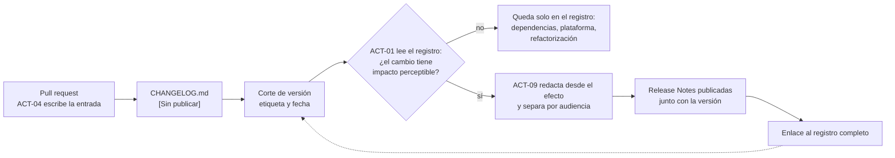

# Release Notes — `DOC-RELEASE`

## 1. Resumen ejecutivo

Las notas de versión son el único documento técnico que lee gente que no eligió leer documentación técnica. Alguien abre la aplicación un martes, ve un aviso de que hay novedades, y decide en quince segundos si le interesa. Ese lector no busca completitud: busca saber si algo cambió para él y si tiene que hacer algo al respecto.

Son un documento de comunicación, no un registro. Se escriben en el momento de publicar una versión, seleccionan lo que le importa a quien usa el producto, y traducen el cambio técnico en beneficio o en instrucción. Su dueño es `ACT-01`, con redacción de `ACT-09`, porque decidir qué merece anunciarse es una decisión de producto y no una decisión técnica.

Su relación con el [Change Log](Change-Log.md) es de derivación en un solo sentido: las notas se escriben leyendo el registro de cambios, y nunca al revés. La confusión entre ambos documentos es la más frecuente de la familia y se trata en detalle más abajo.

En `ESC-4`, las notas de versión públicas de un producto ajeno cambian de rol por completo: dejan de ser algo que se escribe y se vuelven una de las fuentes más ricas del relevamiento externo.

---

## 2. Definición

### Qué es

Comunicación dirigida a quien usa un producto, publicada junto con una versión, que enumera lo que cambió en términos de lo que la persona puede hacer, dejar de hacer o necesita hacer. Se organiza por audiencia y por impacto, no por componente ni por orden cronológico.

Existen en dos variantes que conviene no mezclar. Las **notas de producto**, dirigidas al usuario final, hablan de funcionalidades y de flujos. Las **notas técnicas**, dirigidas a quien integra o administra —el caso de una biblioteca, una API o un producto instalable—, hablan de cambios de contrato, requisitos de plataforma y pasos de actualización. Un producto con ambas audiencias publica ambas secciones, claramente separadas, porque el administrador que busca los pasos de migración no debe tener que leer sobre mejoras de la interfaz.

### Qué problema resuelve

Una versión que se publica sin comunicación produce tres efectos medibles y todos malos: funcionalidades nuevas que nadie usa porque nadie se enteró, consultas de soporte por cambios que sorprendieron, e integraciones rotas por un cambio de contrato que se anunció en ninguna parte.

Resuelve además un problema de confianza. La sección de correcciones es la que más se recorta por incomodidad —admitir que había un defecto— y la que más contribuye a la credibilidad del producto. Un usuario que reportó un problema hace dos meses y lo encuentra nombrado en las notas confirma que lo escucharon; el mismo usuario que ve solo funcionalidades nuevas concluye que su reporte se perdió.

### Qué NO es, y con qué se lo confunde

**No es el Change Log.** Esta es la confusión central de la familia y merece tratamiento explícito porque ambos documentos parecen la misma lista. No lo son.

| | Release Notes | Change Log |
|---|---------------|------------|
| **Audiencia** | Quien usa el producto: usuarios, administradores, integradores | Quien lo desarrolla o mantiene, y quien depura una regresión |
| **Momento** | Al publicar una versión; es un evento | Continuo, en cada cambio integrado |
| **Granularidad** | Selectiva: lo que tiene impacto perceptible | Exhaustiva: todo cambio con efecto observable, ordenado por versión |
| **Tono** | Comunicativo, orientado al beneficio y a la acción | Registral, neutro, verificable |
| **Estructura** | Por audiencia e impacto: novedades, correcciones, acciones requeridas | Por versión y por tipo, según Keep a Changelog |
| **Quién lo escribe** | `ACT-01` con `ACT-09` | `ACT-04`, en el pull request o generado del historial |
| **Dónde vive** | Sitio del producto, aplicación, correo, portal de soporte | `CHANGELOG.md` en la raíz del repositorio |
| **Se puede omitir algo** | Sí, y hay que hacerlo: la refactorización interna no se anuncia | No: omitir un cambio rompe la utilidad del registro |
| **Qué pasa si no existe** | Los usuarios no se enteran de lo que cambió | Nadie puede reconstruir en qué versión entró un cambio |

La regla que resuelve la mayoría de los casos dudosos: **el Change Log responde qué cambió; las Release Notes responden qué significa ese cambio para vos**. Una migración de EF Core 8 a 9 va sin falta en el Change Log y no va en las notas de producto, porque el usuario no puede hacer nada con esa información. Un cambio en el mensaje de error del conflicto de sala va en ambos, redactado distinto.

El error práctico más común es publicar el Change Log como si fueran notas de versión. El resultado es una lista de cuarenta entradas donde treinta y cinco dicen `chore(deps): bump …` y el usuario abandona en la tercera línea sin haber visto la única que le importaba.

**No es un anuncio de marketing.** Las notas se leen buscando información operativa. El lenguaje promocional —«revolucionamos la forma de reservar»— desplaza al dato que la persona vino a buscar y hace que la próxima vez no las abra. Se puede ser claro y entusiasta sin ser publicitario.

**No es el registro de commits.** Un volcado del historial no es una nota de versión, aunque cada línea sea cierta.

**No es documentación de la funcionalidad.** Las notas anuncian y enlazan; no explican cómo se usa. Ese contenido vive en el manual de usuario y en la [especificación de API](../40-Diseno/API-Specification.md).

---

## 3. Aplicación por escenario

| Escenario | Rol de las notas | Quién las produce | Fuente |
|-----------|-----------------|-------------------|--------|
| `ESC-1` | Comunicación de cada versión publicada | `ACT-01` con `ACT-09` | Change Log de la versión |
| `ESC-2` | Comunicación del corte, con foco en lo que cambia para el usuario y en lo que se dejó de ofrecer | `ACT-01` | Criterio de paridad y alcance negativo |
| `ESC-3` | Fuente para reconstruir la historia y el ritmo del producto propio | `ACT-10` con `ACT-05` | Notas históricas del repositorio |
| `ESC-4` | **Fuente primaria de relevamiento externo** | `ACT-02` | Notas públicas del producto ajeno |

### `ESC-1` — Desarrollo nuevo

Se escriben al preparar la versión, leyendo el Change Log acumulado desde la etiqueta anterior. La selección es el trabajo: de cuarenta entradas del registro, quizá seis merecen anunciarse, y decidir cuáles es una decisión de producto.



El punto de bifurcación ocurre después del corte y no antes: adelantarlo al pull request obligaría a `ACT-04` a anticipar una decisión de producto que en ese momento nadie tomó todavía, y es el origen de la mayoría de los registros escritos con tono de comunicación. Lo único que las notas devuelven al registro es un enlace, nunca contenido, y por eso la derivación no tiene vuelta.

En `CTX-1` las notas hablan de pantallas y de flujos, y conviene una captura por novedad relevante. En `CTX-2` la audiencia es quien integra, y la exigencia se vuelve más severa: todo cambio de contrato se anuncia con antelación, no en el momento de publicarlo, y las obsolescencias llevan fecha de retiro concreta. Un cambio de contrato anunciado el mismo día que se aplica rompe integraciones, y ninguna redacción amable compensa eso. En `CTX-3` se publican las dos secciones separadas, porque el administrador que busca los pasos de actualización no debe navegar entre novedades de interfaz.

### `ESC-2` — Migración

Es el caso donde las notas se vuelven críticas para la percepción del proyecto, porque el usuario percibe la migración como cambio impuesto sin beneficio: la aplicación se ve distinta y hace lo mismo. Las notas del corte deben decir, sin rodeos, qué cambia visualmente, qué se comporta igual, qué se comporta distinto a propósito, qué dejó de existir —el alcance negativo firmado en el [Test Plan](Test-Plan.md)— y qué tiene que hacer la persona el primer día.

La sección más importante es la de lo que dejó de existir. Descubrir por uso que una funcionalidad ya no está produce un incidente de soporte y una pérdida de confianza que no se recupera con una nota posterior.

### `ESC-3` — Evaluación con acceso al código

Las notas históricas del propio producto se leen como evidencia. Cruzadas con el historial de Git y con el registro de defectos, revelan el ritmo real de entrega, las áreas donde el producto invirtió, y las discrepancias entre lo anunciado y lo integrado. Una funcionalidad anunciada en la versión 3.2 cuyo código aparece recién en la 3.5 es un hallazgo sobre la relación entre producto y desarrollo.

### `ESC-4` — Qué revelan las notas de versión de un producto ajeno

Es la fuente más rica del relevamiento externo y la más subestimada. El producto se muestra tal como es en su interfaz, pero cuenta su historia en sus notas de versión, y esa historia contiene información que ninguna otra fuente pública ofrece.

**Ritmo y capacidad de entrega.** La secuencia de fechas de publicación da la cadencia; su regularidad da la madurez del proceso. Doce versiones menores al año con intervalos parejos indica automatización de entrega y un equipo estable. Tres versiones en dos años, la última hace once meses, indica un producto en mantenimiento o un equipo desarmado, y esa lectura es determinante en una evaluación previa a una compra. La proporción de versiones de parche publicadas dentro de las setenta y dos horas siguientes a una versión menor mide la calidad del proceso de prueba: muchas correcciones inmediatas indican que las versiones salen sin verificar.

**Dónde invierte el producto.** Agrupando dos años de entradas por área funcional se obtiene el mapa de prioridades reales, que suele diferir del que muestra el material comercial. Un producto que se vende como plataforma de colaboración y cuyas notas de los últimos dieciocho meses son ochenta por ciento facturación y administración de cuentas está diciendo dónde está su negocio.

**Modelo de dominio y vocabulario.** Las notas nombran entidades que la interfaz no expone: «ahora los espacios de trabajo pueden tener políticas de retención heredadas» revela tres conceptos y una relación de jerarquía. Es material de primera calidad para el modelo de dominio inferido, con confianza media, porque el vocabulario es el que el equipo usa internamente.

**Pistas de arquitectura, con confianza baja.** Menciones a regiones nuevas, a límites de tasa, a migraciones de motor de base de datos, a formatos de exportación, a webhooks o a un SDK. Todo esto se registra como hipótesis explícita y nunca con el tono de lo observado.

**Historial de defectos y áreas frágiles.** La sección de correcciones repetida a lo largo de versiones señala los módulos con problemas crónicos. Cuatro versiones consecutivas con correcciones sobre la sincronización de calendarios dicen algo que ningún material comercial va a decir.

**Compromisos con la compatibilidad.** Cómo trata el producto sus cambios de ruptura —si los anuncia con antelación, si mantiene versiones anteriores de la API, si da plazos de retiro— predice el costo de integrarse con él mejor que cualquier promesa contractual.

Un método que ordena el trabajo: recolectar las notas de los últimos veinticuatro meses, normalizarlas en una tabla de versión, fecha, tipo de cambio y área funcional, y recién entonces analizar. La tabla responde por sí sola las preguntas de ritmo e inversión, y evita la lectura anecdótica que se queda con la última versión.

Dos advertencias. Las notas son un documento de comunicación y por lo tanto están sesgadas: omiten lo que el proveedor no quiere destacar, y la ausencia de una entrada no prueba la ausencia del cambio. Y todo el análisis exige registrar fecha de consulta y el rango de versiones observado, sin lo cual el trabajo no es reproducible.

---

## 4. Ejemplos concretos

### 4.1 El mismo cambio en ambos formatos

Situación real del sistema de reserva de salas. Hasta la versión 1.3.1, al intentar confirmar una reserva sobre una sala ocupada, la API devolvía `400 Bad Request` con el mensaje genérico «Solicitud inválida», y la interfaz mostraba ese texto vaciando el formulario. En la 1.4.0 se corrige: la API devuelve `409 Conflict` con las tres alternativas más cercanas, y la interfaz las ofrece conservando los asistentes ya cargados.

**En el Change Log** —registral, exhaustivo, técnico, con la referencia al requisito:

```markdown
## [1.4.0] — 2026-08-03

### Añadido
- El conflicto de reserva devuelve las tres alternativas de horario más
  cercanas en el cuerpo de la respuesta 409, ordenadas por proximidad
  al intervalo solicitado (`RF-014`).

### Cambiado
- **RUPTURA** `POST /reservas` responde `409 Conflict` en lugar de
  `400 Bad Request` cuando la sala está ocupada. El cuerpo pasa a ser
  `ProblemDetails` con `type = "/errores/sala-ocupada"` e incluye
  `reservaEnConflicto` y `alternativas[]` (`RN-007`).

### Corregido
- El editor de reservas conservaba el formulario vacío tras un rechazo;
  ahora preserva asistentes, motivo y fecha (#1182).
```

**En las Release Notes** —selectivo, orientado al beneficio y a la acción, con las dos audiencias separadas:

```markdown
# Reserva de Salas 1.4.0 — 3 de agosto de 2026

## Novedades

**Ya no perdés lo que cargaste cuando la sala está ocupada.**
Si alguien reservó la sala mientras completabas el formulario, ahora te
mostramos los tres horarios libres más cercanos y mantenemos los
asistentes y el motivo que ya habías escrito. Antes tenías que empezar
de nuevo.

## Para quienes integran nuestra API

**Cambio de comportamiento en `POST /reservas`.** El conflicto de sala
ahora responde `409 Conflict` en lugar de `400 Bad Request`, con un
cuerpo que incluye la reserva en conflicto y hasta tres alternativas.

Si tu integración trata el `400` como conflicto de sala, tenés que
actualizarla. El `400` queda reservado para solicitudes mal formadas.
Ver [guía de migración](…) · Soporte de la respuesta anterior hasta el
30 de septiembre de 2026.
```

Las diferencias visibles resumen todo el asunto. El registro habla de códigos, campos y números de ticket; las notas hablan de lo que le pasaba a la persona. El registro enumera tres entradas —añadido, cambiado, corregido—; las notas las funden en un solo párrafo porque para el usuario es un solo hecho. El registro se ordena por tipo de cambio; las notas se ordenan por audiencia. Y las notas agregan algo que el registro no tiene ni debe tener: qué hacer al respecto y hasta cuándo.

Nótese también lo que las notas omiten. Ese mismo despliegue incluyó la actualización de siete paquetes, la migración del pipeline a una versión nueva del ejecutor y una refactorización del validador de intervalos. Las tres cosas están en el Change Log, ninguna en las notas, y esa omisión no es una pérdida sino la razón por la que las notas se leen.

### 4.2 Versionado semántico y su relación con ambos documentos

**Semantic Versioning 2.0.0** define `MAYOR.MENOR.PARCHE`: se incrementa el mayor ante un cambio incompatible de la API pública, el menor ante funcionalidad nueva compatible hacia atrás, y el parche ante correcciones compatibles.

La utilidad práctica del esquema es que el número comunica antes de que nadie lea nada. Quien ve `1.4.0` sabe que hay funcionalidad nueva y que su integración sigue funcionando; quien ve `2.0.0` sabe que tiene trabajo por delante.

La relación con los dos documentos es directa y mecánica. El **Change Log** determina el número: se lee el conjunto de cambios desde la última etiqueta y el mayor de ellos fija el incremento —una ruptura eleva el mayor, una funcionalidad eleva el menor, correcciones solamente elevan el parche—. Con Conventional Commits, la derivación se automatiza. Las **Release Notes** interpretan el número: un mayor exige sección de acciones requeridas y guía de migración; un parche puede resolverse en dos líneas.

El ejemplo anterior muestra el punto de fricción más común. El cambio de `400` a `409` **es una ruptura del contrato**, y por rigor de Semantic Versioning correspondería `2.0.0`. Que se haya publicado como `1.4.0` es una decisión que hay que declarar, no esconder: el equipo consideró que el `400` era un defecto y no un contrato, verificó con los tres integradores conocidos que ninguno dependía de él, y publicó con período de compatibilidad y aviso. Es defendible; lo indefendible es no haberlo pensado. La pregunta que resuelve estos casos: ¿algún consumidor puede estar dependiendo de este comportamiento? Si la respuesta honesta es sí o no lo sé, es ruptura.

Dos reglas del estándar que se olvidan seguido: la versión `0.y.z` no ofrece garantías de estabilidad, y usarla es la forma correcta de decir que el contrato todavía se mueve; y una vez publicada, una versión no se modifica —una corrección exige un número nuevo, nunca reemplazar el artefacto de una etiqueta existente—.

Para productos donde el usuario final no tiene contrato con ninguna API, el versionado por calendario —`2026.08`— comunica mejor la actualidad y peor la compatibilidad. Un producto con API pública necesita versionado semántico al menos para su contrato, aunque la aplicación se numere por fecha.

### 4.3 Notas de un producto ajeno, analizadas

Extracto sintético del relevamiento de un competidor, con la separación entre lo observado y lo inferido que exige `ESC-4`. Producto consultado el 2026-07-10; notas públicas de 3.0.0 a 3.8.2.

| Observación | Evidencia | Inferencia | Confianza |
|-------------|-----------|-----------|-----------|
| 11 versiones menores en 24 meses, intervalo medio de 8 semanas | Fechas de publicación | Proceso de entrega establecido y equipo estable | Alta |
| 4 de las 11 tuvieron parche dentro de las 72 h | Versiones 3.2.1, 3.4.1, 3.5.1, 3.7.1 | Cobertura de prueba insuficiente antes de publicar | Media |
| 3.6.0 introduce «recursos compartidos entre organizaciones» | Texto de la nota | El modelo de dominio tiene un nivel por encima de la organización | Media |
| Correcciones de sincronización de calendario en 5 versiones seguidas | Sección de correcciones | Integración con calendarios externos es su área frágil | Alta |
| 3.5.0 anuncia límite de 100 solicitudes por minuto por organización | Texto de la nota | Existe una pasarela de API con control de tasa por inquilino | Baja |
| Ninguna nota menciona exportación masiva de datos | Ausencia | — | Ninguna: la ausencia no prueba nada |

La última fila es la que da rigor al análisis. La ausencia de una entrada no permite concluir que la funcionalidad no existe: las notas omiten deliberadamente. La conclusión correcta es que no se anunció, y verificarlo exige usar el producto.

El hallazgo accionable de esta tabla no es ninguna funcionalidad sino la fila de sincronización de calendarios: cinco versiones consecutivas corrigiendo lo mismo identifican dónde el competidor tiene un problema estructural, y eso orienta tanto una decisión de compra como una estrategia de producto.

---

## 5. Preguntas guía

- ¿Quién es el lector de estas notas, y qué decisión toma con ellas?
- ¿Cada entrada dice qué puede hacer la persona ahora que antes no podía, o describe el cambio técnico?
- ¿Hay algo que el lector tenga que hacer? Si lo hay, ¿está arriba de todo y con plazo?
- ¿Se anunció algún cambio de ruptura el mismo día en que se aplicó?
- ¿La sección de correcciones existe, o se omitió por incomodidad?
- ¿El número de versión corresponde a la magnitud del cambio según Semantic Versioning? Si se desvió, ¿está declarado por qué?
- En `ESC-4`: ¿qué versión y qué rango de fechas observé, y qué parte de mis conclusiones se apoya en una ausencia?

---

## 6. Criterios de calidad y antipatrones

### Criterios de calidad

**Se leen en menos de dos minutos.** Lo importante arriba, las acciones requeridas primero. Si exigen más tiempo, la selección falló.

**Cada entrada nombra un efecto, no un cambio.** «Ya no perdés lo que cargaste» sirve; «se modificó el manejo del estado del formulario» no.

**Las acciones requeridas están separadas y con plazo.** El lector distingue en un vistazo lo que puede ignorar de lo que no.

**Los cambios de ruptura se anuncian antes de aplicarse.** Con período de compatibilidad y fecha de retiro. Un anuncio simultáneo al cambio es un aviso de daño, no una advertencia.

**Incluyen las correcciones.** Con referencia al problema reportado cuando existe. Es la sección que construye confianza.

**Están fechadas y versionadas.** Sin fecha, no son consultables como historia, que es su segundo uso más frecuente.

**Enlazan en lugar de explicar.** Anuncian y remiten al manual, a la guía de migración o a la especificación.

### Antipatrones

**El Change Log publicado como notas de versión.** El más frecuente. Cuarenta entradas de las cuales treinta y cinco son actualizaciones de dependencias, y la que importaba en el puesto veintitrés.

**El anuncio de ruptura enterrado.** Un cambio de contrato mencionado en la línea catorce, entre dos mejoras menores, sin marca visual ni plazo. Produce integraciones rotas y llamados de soporte que se podían evitar con un encabezado.

**«Mejoras de rendimiento y corrección de errores».** La entrada que no dice nada. Si no se puede o no se quiere detallar, es preferible el silencio a una frase que enseña al lector que estas notas no informan.

**El tono publicitario.** Superlativos que desplazan al dato. La persona vino a saber si tiene que hacer algo.

**Las notas escritas al final por quien tenía tiempo.** Producen o bien un volcado del registro o bien un texto que omite lo importante porque quien lo escribió no participó de la versión.

**La versión que no corresponde al cambio.** Publicar una ruptura como versión menor porque «casi nadie usa esa función». Rompe la promesa del versionado semántico, que es lo único que permite actualizar sin leer.

**En `ESC-4`, confundir ausencia con inexistencia.** Concluir que el competidor no tiene una funcionalidad porque no la anunció.

---

## 7. Anexo — Plantilla comentada

```markdown
---
doc_id: RELEASE-<producto>-<versión>
doc_type: tema
title: Notas de versión — <producto> <versión>
status: vigente
origin: human | ia-assisted
confidence: alta | media | baja        # obligatorio si origin != human
owner: <Product Owner que la firma>
last_review: AAAA-MM-DD
audience: [humano, agente]
traces: [DOC-CHANGELOG, DOC-DEPLOY]
---

# <Producto> <versión> — <fecha de publicación>

<!-- Una o dos frases: el titular de esta versión. Si nada la resume,
     probablemente no había que publicar notas separadas. -->

## Acciones requeridas
<!-- PRIMERO, siempre, y solo si existen. Qué tiene que hacer el lector,
     hasta cuándo, y qué pasa si no lo hace. Si no hay ninguna, se omite
     la sección: no se escribe "ninguna". -->

## Novedades
<!-- Selectivo. Por cada una: qué podés hacer ahora que antes no podías.
     Redactar desde el efecto, no desde la implementación.
     Enlazar a la documentación; no explicar acá cómo se usa. -->

## Cambios de comportamiento
<!-- Lo que funciona distinto sin ser nuevo. Es lo que más consultas de
     soporte genera cuando se omite: la persona cree que algo se rompió. -->

## Correcciones
<!-- Con referencia al problema reportado cuando exista. No omitir esta
     sección por incomodidad: es la que demuestra que se escucha. -->

## Para quienes integran        # solo si el producto tiene API o SDK
<!-- Cambios de contrato, obsolescencias con fecha de retiro, requisitos
     de plataforma, pasos de actualización. Sección separada: el
     administrador no debería leer sobre mejoras de interfaz. -->

## Obsolescencias
<!-- Qué se va a retirar, en qué versión y en qué fecha. Anunciar con
     antelación, no en el momento del retiro. -->

## Problemas conocidos
<!-- Lo que se publica sabiendo que falla, con alternativa provisoria y
     versión objetivo de corrección. Ocultarlo multiplica el soporte. -->

---
<!-- Registro completo de cambios: enlace al CHANGELOG.md.
     Estas notas son selectivas por diseño; el registro es exhaustivo. -->
```
