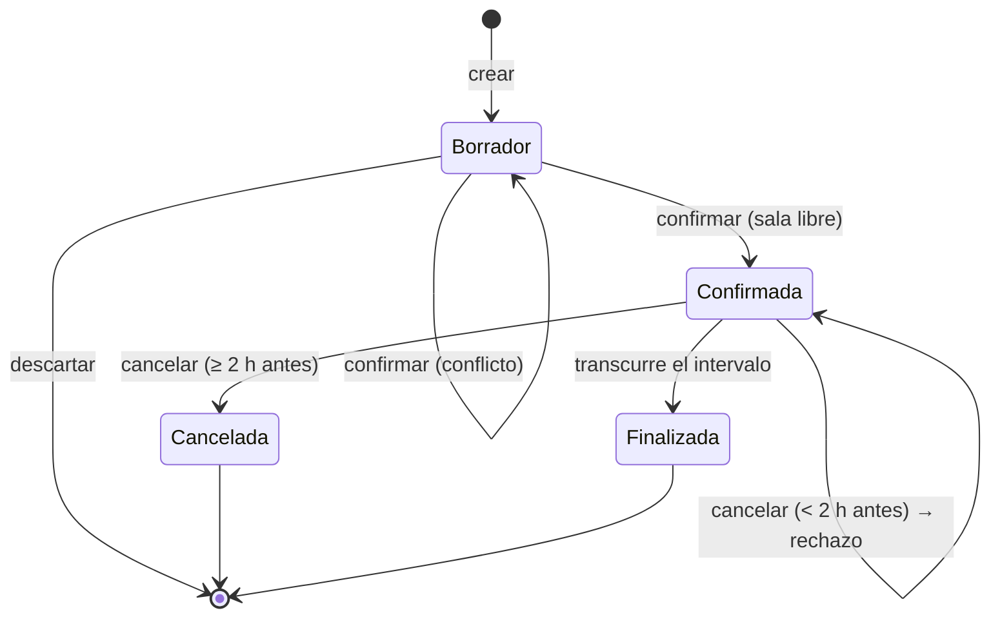

# Test Cases — `DOC-TESTCASES`

## 1. Resumen ejecutivo

Un caso de prueba es la unidad más pequeña de verificación que se puede ejecutar y cuyo resultado se puede juzgar sin discusión. Su valor no está en describir una acción sino en fijar de antemano qué se considera correcto: un caso sin resultado esperado explícito no es una prueba, es una visita al sistema.

Este documento define cómo se escribe, se deriva y se mantiene un caso; cómo se traza hasta el requisito que lo justifica; y cómo se decide si vive como procedimiento manual o como código automatizado. Lo produce `ACT-05` bajo la estrategia que fija el [Test Plan](Test-Plan.md), y lo consume tanto quien ejecuta a mano como quien implementa la prueba en xUnit, bUnit o Playwright.

La propiedad que distingue un buen conjunto de casos de una colección de scripts es la trazabilidad. Cuando cada caso apunta al requisito que verifica, tres preguntas caras se responden leyendo: qué requisitos quedaron sin cubrir, qué se rompe si cambio esta regla, y qué hay que volver a probar antes de publicar.

---

## 2. Definición

### Qué es

Especificación de una verificación concreta: un estado inicial, una secuencia de acciones, un resultado esperado y un estado final. Se identifica con prefijo `TC-` y se enlaza al requisito que verifica. La terminología sigue el glosario de **ISTQB** y su estructura corresponde a lo que **ISO/IEC/IEEE 29119-3** describe como especificación de caso de prueba.

### Qué problema resuelve

Fija el criterio de corrección **antes** de ejecutar. Esa anterioridad es todo el asunto: quien ejecuta sin resultado esperado escrito juzga con lo que ve, y lo que ve siempre parece plausible. El caso escrito antes convierte la ejecución en una comparación y no en una opinión.

Resuelve además la repetibilidad —dos personas distintas llegan al mismo veredicto— y la memoria institucional: cada defecto de producción debería producir un caso nuevo, y el conjunto acumulado es el registro de todo lo que el sistema ya rompió alguna vez.

### Qué NO es, y con qué se lo confunde

**No es el Test Plan.** El plan decide la estrategia; el caso ejecuta dentro de ella. La confusión colapsa dos documentos con ritmos de cambio incompatibles: la estrategia cambia una vez por versión mayor, los casos cambian con cada requisito. El resultado del colapso es un plan que se desactualiza al ritmo de los casos y deja de leerse.

**No es el criterio de aceptación de una historia.** El criterio de aceptación pertenece al requisito y expresa la condición de negocio: «una sala no admite reservas superpuestas». El caso es la verificación instrumentada de esa condición: con qué sala, en qué horario, con qué usuario, esperando qué código de respuesta. Un criterio de aceptación genera típicamente varios casos, y confundirlos produce criterios llenos de detalle técnico que el Product Owner no puede aprobar.

**No es un script de automatización.** El código automatizado es la implementación del caso, y puede haber más de uno para el mismo caso —en niveles distintos—. La distinción importa cuando la automatización se reescribe: el caso sobrevive al cambio de herramienta.

**No es un informe de ejecución.** El caso es la especificación; la ejecución produce un registro con fecha, versión, ejecutor y resultado. Mezclarlos hace que el caso deje de ser reutilizable entre versiones.

---

## 3. Aplicación por escenario

| Escenario | De dónde salen los casos | Qué verifican | Riesgo característico |
|-----------|--------------------------|---------------|----------------------|
| `ESC-1` | Derivados de `RF-`, `RN-` y `RNF-` del [SRS](../20-Analisis/SRS.md) | Lo especificado | Escribir casos que verifican la implementación imaginada |
| `ESC-2` | Comportamiento observado del origen, más los `RF-` reconstruidos | Paridad entre origen y destino | Convertir defectos heredados en resultado esperado |
| `ESC-3` | Código, pruebas existentes, historial de defectos | Lo que el sistema hace hoy | Documentar el defecto como comportamiento correcto |
| `ESC-4` | Exploración del producto ajeno | Comportamiento observable, con fecha y versión | Registrar la inferencia como observación |

### `ESC-1` — Desarrollo nuevo

Los casos se derivan del requisito con técnica, no por inspiración, y se escriben antes de que exista el código. El beneficio principal es indirecto: la derivación sistemática expone los huecos del requisito. Al construir la tabla de decisión de `RF-014` aparece la combinación que el requisito no contempla —usuario con permiso, sala disponible, pero fuera del horario laboral—, y esa pregunta vuelve a `ACT-02` mientras responderla todavía es barato.

En `CTX-1` los casos cubren los cuatro estados de cada pantalla y no solo el camino feliz, e incluyen los propios de Blazor *interactive server*: qué ve el usuario mientras el circuito se reconecta y qué pasa con el formulario a medio completar. En `CTX-2` los casos se escriben contra el contrato: cada código de respuesta de la [especificación de API](../40-Diseno/API-Specification.md) necesita al menos un caso que lo provoque, y la idempotencia exige un caso que reenvíe la misma clave. En `CTX-3` el mismo requisito se verifica en dos niveles con casos distintos y enlazados: uno de integración sobre el endpoint, uno de componente sobre la interfaz, y el plan declara cuál cubre qué para que no se dupliquen.

### `ESC-2` — Migración

Los casos se construyen a partir de lo que el sistema origen hace, y ahí aparece la decisión más delicada del escenario: cada comportamiento observado hay que clasificarlo antes de convertirlo en resultado esperado. Si el origen acepta reservas de duración cero por una validación faltante, escribir `TC-` que espere ese comportamiento perpetúa el defecto en el destino. La clasificación en comportamiento requerido, accidente tolerable y defecto a corregir se toma con `ACT-01` y se registra en el caso, no en la memoria de quien lo escribió.

Los casos de paridad tienen una forma propia: el resultado esperado no es un valor literal sino la salida del sistema origen ante la misma entrada. Se ejecutan contra ambos sistemas y comparan salidas normalizadas, según el criterio que fija el [Test Plan](Test-Plan.md).

### `ESC-3` — Evaluación con acceso al código

Se reconstruyen los casos leyendo las pruebas existentes, y el hallazgo típico es que las pruebas verifican implementación en lugar de comportamiento: aserciones sobre cuántas veces se llamó a un doble, sobre el orden interno de las operaciones, sobre estructuras privadas. Ese conjunto de pruebas se rompe entero ante cualquier refactorización que no cambie nada observable, lo que explica por qué el equipo evita refactorizar.

El trabajo produce dos cosas: el catálogo de lo que efectivamente se verifica hoy, y el mapa de reglas de negocio sin caso que las cubra. Ese mapa se arma leyendo las reglas del código —validaciones, restricciones de la base, condiciones de guarda— y cruzándolas contra las aserciones existentes. Toda afirmación lleva referencia a archivo y línea.

### `ESC-4` — Evaluación externa

Los casos se escriben durante la exploración, con estructura de observación: qué se hizo, qué se vio, en qué fecha, sobre qué versión y con qué cuenta. El resultado esperado no existe de antemano —no hay especificación— y por eso el campo se reemplaza por resultado observado, con una nota que distinga lo verificado de lo inferido.

Su utilidad aparece más tarde: en una evaluación previa a una compra, los casos observados son la línea base contra la que se comparará el producto propio o la versión siguiente del ajeno. Sin fecha y versión registradas, esa comparación no se puede hacer.

---

## 4. Ejemplos concretos

### 4.1 Anatomía de un caso

| Campo | Qué fija | Error frecuente |
|-------|----------|-----------------|
| `TC-` identificador | Referencia estable, independiente del archivo | Renumerar al reordenar |
| Título | Qué verifica, legible sin abrir el caso | «Probar reserva» |
| Traza | El `RF-`, `RN-` o `RNF-` que justifica el caso | Ninguna, con lo que el caso sobrevive al requisito que lo motivó |
| Nivel | Unitario, componente, integración, E2E | No declararlo y duplicar la verificación en tres niveles |
| Prioridad | Crítica, alta, media, baja | Todo crítico, con lo que la prioridad deja de ordenar |
| Precondiciones | Estado exacto antes de empezar | «Sistema funcionando» |
| Datos | Los valores concretos que se usan | Valores en los pasos, imposibles de cambiar de un lugar |
| Pasos | Acciones numeradas y sin ambigüedad | Mezclar acción con verificación |
| Resultado esperado | Lo observable que decide aprobado o fallido | Redactado en potencial: «debería mostrar un mensaje» |
| Poscondiciones | Estado tras la ejecución y cómo se restaura | Omitidas, lo que hace que el caso contamine al siguiente |

Dos campos concentran los defectos de redacción. Las **precondiciones** son la diferencia entre un caso repetible y uno que funciona solo en la máquina de quien lo escribió: «la sala Roble existe y no tiene reservas entre las 09:00 y las 18:00 del 2026-08-12» es una precondición; «hay salas cargadas» no lo es. El **resultado esperado** debe ser observable y unívoco, redactado en presente o futuro afirmativo, nunca en potencial: «el sistema responde `409` con el cuerpo que enumera tres alternativas» decide el veredicto; «debería avisar del conflicto» lo somete a interpretación.

Las **poscondiciones** merecen mención porque su omisión es la causa silenciosa de las pruebas inestables. Un caso que crea una reserva y no la elimina deja el entorno distinto de como lo encontró, y el siguiente caso falla por un motivo que no tiene nada que ver con lo que verifica.

### 4.2 Trazabilidad `RF-` → `TC-`

La matriz se lee en dos direcciones y cada una responde una pregunta distinta. De requisito a caso: ¿qué quedó sin cubrir? De caso a requisito: ¿qué se rompe si cambio esta regla, y qué hay que reejecutar?

| Requisito | Regla | Casos | Nivel de cobertura | Estado |
|-----------|-------|-------|--------------------|--------|
| `RF-014` Confirmar reserva | `RN-007` sin superposición | `TC-041` … `TC-048` | Unitario + integración + E2E | Cubierto |
| `RF-014` | `RN-011` duración 30 min a 4 h | `TC-049`, `TC-050`, `TC-051` | Unitario | Cubierto |
| `RF-015` Cancelar reserva | `RN-009` hasta 2 h antes | `TC-052`, `TC-053` | Integración | Cubierto |
| `RF-016` Reserva recurrente | `RN-012` máx. 12 ocurrencias | — | — | **Sin cobertura** |
| `RNF-008` Búsqueda < 400 ms p95 | — | `TC-090` | Carga | Cubierto |
| `RNF-012` WCAG 2.2 AA en alta | — | `TC-095`, `TC-096` | Accesibilidad | Parcial: falta lector de pantalla |

Las dos últimas filas son las que justifican mantener la matriz. La fila sin cobertura es información accionable que ninguna métrica de cobertura de código habría revelado, porque el código de `RF-016` puede estar ejecutándose durante otras pruebas sin que nadie verifique su regla. La fila parcial evita el autoengaño de marcar como cubierto lo que se verificó a medias.

La matriz se mantiene barata si el enlace vive en el propio caso y en el código de la prueba —un atributo `[Trait("RF", "RF-014")]` en xUnit— y la tabla se genera. Mantenida a mano en una hoja de cálculo aparte, se desincroniza en dos sprints.

### 4.3 Técnicas de derivación

Las técnicas de **ISO/IEC/IEEE 29119-4** convierten un requisito en un conjunto de casos con justificación, en lugar de en los casos que a alguien se le ocurrieron. Su valor conjunto es la cobertura demostrable: se puede explicar por qué esos casos y no otros.

**Clases de equivalencia.** El espacio de entrada se parte en subconjuntos donde el sistema se comporta igual, y se prueba un representante de cada uno. Para la duración de una reserva —válida entre 30 minutos y 4 horas—: menor a 30, entre 30 y 240, mayor a 240, valor no numérico, valor ausente. Cinco casos en lugar de infinitos, con el argumento de por qué alcanza.

**Valores límite.** Los defectos se concentran en los bordes, porque ahí es donde se equivocan los operadores de comparación. Para la misma regla, con granularidad de un minuto: 29, 30, 31, 239, 240, 241. Es la técnica de mayor retorno por caso escrito, y la que expone las ambigüedades del requisito: si el requisito dice «entre 30 minutos y 4 horas», ¿los extremos están incluidos? La pregunta solo aparece al construir estos casos.

**Tablas de decisión.** Cuando el resultado depende de varias condiciones combinadas. Para la confirmación de reserva:

| # | Usuario autorizado | Sala existe | Intervalo libre | Duración válida | Dentro de horario | Resultado esperado |
|---|--------------------|-------------|-----------------|-----------------|-------------------|--------------------|
| 1 | Sí | Sí | Sí | Sí | Sí | `201` reserva confirmada |
| 2 | No | Sí | Sí | Sí | Sí | `403` sin permiso |
| 3 | Sí | No | — | — | — | `404` sala inexistente |
| 4 | Sí | Sí | No | Sí | Sí | `409` conflicto + alternativas |
| 5 | Sí | Sí | Sí | No | Sí | `422` duración fuera de rango |
| 6 | Sí | Sí | Sí | Sí | No | `422` fuera de horario laboral |
| 7 | Sí | Sí | No | No | Sí | `422` — la validación precede a la verificación de disponibilidad |

La fila 7 es la razón de ser de la técnica. Cuando dos condiciones fallan a la vez, ¿qué error se devuelve? El requisito casi nunca lo dice, la implementación lo decide por el orden de las validaciones, y el cliente de la API depende de esa decisión. La tabla obliga a resolverlo antes de programar. El orden de precedencia queda documentado como parte del contrato.

**Transición de estados.** Cuando el comportamiento depende de la historia. El ciclo de vida de una reserva:



Los casos se derivan de las transiciones válidas —una por flecha— y, sobre todo, de las inválidas, que es donde están los defectos: cancelar una reserva ya cancelada, confirmar una finalizada, modificar una en curso. Las transiciones inválidas rara vez aparecen en el requisito y siempre aparecen en producción.

**Adivinación de errores y exploración.** Técnicas basadas en experiencia, que complementan a las sistemáticas: la doble pulsación del botón Confirmar, el cambio de horario de verano en medio de una reserva, la sesión que expira entre la consulta de disponibilidad y la confirmación, el 29 de febrero. No son derivables de ninguna especificación y son la fuente de los defectos que más caros salen.

### 4.4 Manual o automatizado

La decisión se toma por caso y se registra en el propio caso.

| Se automatiza cuando | Queda manual cuando |
|----------------------|--------------------|
| Se ejecuta en cada versión (regresión) | Se ejecuta una vez o muy espaciadamente |
| El resultado se juzga por comparación mecánica | El juicio es perceptual: estética, tono, comodidad |
| El costo de automatizar se amortiza en pocas ejecuciones | Automatizarlo cuesta más que ejecutarlo diez veces |
| El caso es estable | El área todavía cambia de forma cada semana |
| Verifica una regla de negocio o un contrato | Es exploración con carta, sin resultado predefinido |

La regla que corrige el error más común: **un caso manual que se ejecutó en cada versión durante un año está mal clasificado**. La revisión periódica de la lista de casos manuales por frecuencia de ejecución es la que evita que la deuda de automatización crezca sin que nadie la vea.

En sentido inverso, la accesibilidad muestra el límite de la automatización: una herramienta como axe detecta contraste insuficiente y etiquetas faltantes, pero no puede juzgar si el orden de lectura de un formulario tiene sentido para alguien que navega con lector de pantalla. Ese caso se queda manual por naturaleza, no por deuda.

### 4.5 Gherkin y Given-When-Then

**Gherkin** es el lenguaje estructurado que expresa un caso en tres cláusulas: `Dado` el contexto, `Cuando` la acción, `Entonces` el resultado. Su forma se corresponde exactamente con precondición, pasos y resultado esperado, con la diferencia de que está pensado para ser legible por quien no programa y ejecutable por quien sí.

```gherkin
# language: es
Característica: Confirmación de reserva de sala
  Como empleado quiero reservar una sala
  para asegurar el espacio de una reunión

  Antecedentes:
    Dado que la sala "Roble" existe con capacidad 8
    Y que el usuario "ana.perez@demo.local" tiene permiso de reserva

  Escenario: Confirmación sobre sala libre
    Dado que "Roble" no tiene reservas el 2026-08-12
    Cuando confirmo una reserva en "Roble" el 2026-08-12 de 10:00 a 11:00
    Entonces la reserva queda en estado "Confirmada"
    Y se emite el evento "ReservaConfirmada"

  Escenario: Conflicto con reserva existente
    Dado que "Roble" tiene una reserva confirmada el 2026-08-12 de 10:30 a 11:30
    Cuando confirmo una reserva en "Roble" el 2026-08-12 de 10:00 a 11:00
    Entonces la solicitud se rechaza con código 409
    Y la respuesta ofrece 3 horarios alternativos
    Y no se crea ninguna reserva nueva

  Esquema del escenario: Validación de duración
    Cuando confirmo una reserva en "Roble" con duración <minutos> minutos
    Entonces la solicitud responde <codigo>

    Ejemplos:
      | minutos | codigo |
      |      29 |    422 |
      |      30 |    201 |
      |     240 |    201 |
      |     241 |    422 |
```

El esquema de escenario con tabla de ejemplos es la expresión natural del análisis de valores límite: los cuatro casos derivados quedan en cuatro filas legibles por `ACT-01`, que puede confirmar que 30 y 240 son válidos sin leer una línea de código.

Gherkin tiene un costo que conviene declarar. Mantener la capa de definiciones de paso que traduce cada frase a código es trabajo real, y solo se amortiza si alguien que no programa lee y aprueba esos escenarios. Cuando el único lector es el equipo de desarrollo, la misma verificación en xUnit con nombres descriptivos cuesta menos y se mantiene mejor. La pregunta para decidir es concreta: ¿el Product Owner va a leer esto? Si la respuesta honesta es no, Gherkin agrega una capa sin destinatario.

### 4.6 Batería completa: alta de reserva

Casos derivados de `RF-014 — Confirmar reserva` y sus reglas asociadas. Datos sintéticos: salas Roble (cap. 8), Cedro (cap. 4), Sauce (cap. 20); usuarios `ana.perez` (con permiso), `luis.gomez` (con permiso), `visita` (sin permiso); fecha base 2026-08-12, miércoles laborable; horario laboral 08:00–20:00.

| `TC-` | Título | Traza | Nivel | Prior. | Técnica |
|-------|--------|-------|-------|--------|---------|
| `TC-041` | Confirmación sobre sala libre | `RF-014` | Integración | Crítica | Tabla de decisión, fila 1 |
| `TC-042` | Conflicto por superposición parcial al inicio | `RN-007` | Integración | Crítica | Tabla, fila 4 |
| `TC-043` | Conflicto por superposición parcial al final | `RN-007` | Integración | Crítica | Valores límite |
| `TC-044` | Conflicto por contención total | `RN-007` | Unitario | Alta | Clases de equivalencia |
| `TC-045` | Intervalos adyacentes no son conflicto | `RN-007` | Unitario | Crítica | Valores límite |
| `TC-046` | Conflicto ignora reservas canceladas | `RN-007` | Integración | Alta | Transición de estados |
| `TC-047` | Confirmaciones simultáneas: solo una prospera | `RN-007` | Integración | Crítica | Adivinación de errores |
| `TC-048` | El conflicto ofrece tres alternativas ordenadas | `RF-014` | Integración | Media | Tabla, fila 4 |
| `TC-049` | Duración de 29 minutos se rechaza | `RN-011` | Unitario | Alta | Valores límite |
| `TC-050` | Duración de 30 minutos se acepta | `RN-011` | Unitario | Alta | Valores límite |
| `TC-051` | Duración de 241 minutos se rechaza | `RN-011` | Unitario | Alta | Valores límite |
| `TC-054` | Usuario sin permiso recibe 403 | `RF-014` | Integración | Crítica | Tabla, fila 2 |
| `TC-055` | Sala inexistente recibe 404 | `RF-014` | Integración | Media | Tabla, fila 3 |
| `TC-056` | Fuera de horario laboral recibe 422 | `RN-013` | Unitario | Media | Tabla, fila 6 |
| `TC-057` | Precedencia: duración inválida y sala ocupada → 422 | `RF-014` | Unitario | Media | Tabla, fila 7 |
| `TC-058` | Reenvío con misma Idempotency-Key devuelve 200 | `RF-014` | Integración | Alta | Adivinación de errores |
| `TC-059` | Asistentes exceden capacidad de la sala | `RN-014` | Unitario | Media | Valores límite |
| `TC-060` | El conflicto preserva los asistentes ya cargados | `RF-014` | Componente | Alta | Adivinación de errores |
| `TC-061` | Doble pulsación de Confirmar crea una sola reserva | `RF-014` | Componente | Alta | Adivinación de errores |
| `TC-062` | Caída del circuito durante la confirmación | `RF-014` | E2E | Alta | Adivinación de errores |

Cuatro casos desarrollados en detalle. El primero, el camino feliz, que fija el formato:

```
TC-041 · Confirmación de reserva sobre sala libre
Traza:        RF-014 · Nivel: integración · Prioridad: crítica
Automatizado: sí — Salas.Integration.Tests/Reservas/ConfirmarTests.cs

Precondiciones
  1. La sala "Roble" existe, activa, capacidad 8.
  2. "Roble" no tiene reservas confirmadas el 2026-08-12.
  3. ana.perez@demo.local autenticada, con rol Empleado.
  4. Reloj del sistema fijado en 2026-08-10T09:00:00-03:00.

Datos
  salaId = SAL-001 (Roble) · inicio = 2026-08-12T10:00 · fin = 2026-08-12T11:00
  asistentes = 5 · motivo = "Revisión de sprint"

Pasos
  1. POST /reservas con el cuerpo de Datos e Idempotency-Key = K-4471.

Resultado esperado
  · Código 201 Created.
  · Cabecera Location apunta al recurso creado.
  · Cuerpo: estado = "Confirmada", identificador no vacío.
  · La reserva persiste con esos valores exactos.
  · Se emite ReservaConfirmada con el mismo identificador.

Poscondiciones
  · Existe una reserva confirmada de "Roble" el 2026-08-12 de 10:00 a 11:00.
  · Limpieza: la transacción de la prueba se revierte.
```

El segundo es el que da sentido a toda la batería, porque el conflicto de sala es la regla que el sistema existe para hacer cumplir:

```
TC-042 · Conflicto por superposición parcial al inicio
Traza:        RN-007 · Nivel: integración · Prioridad: crítica
Automatizado: sí — ConfirmarTests.RechazaSuperposicionParcial

Precondiciones
  1. "Roble" tiene una reserva CONFIRMADA el 2026-08-12 de 10:30 a 11:30
     (creada por luis.gomez, identificador RES-9001).
  2. ana.perez autenticada con rol Empleado.
  3. "Cedro" libre de 10:00 a 11:00; "Sauce" libre de 11:30 a 12:30.

Datos
  salaId = SAL-001 · inicio = 2026-08-12T10:00 · fin = 2026-08-12T11:00

Pasos
  1. POST /reservas con esos datos.

Resultado esperado
  · Código 409 Conflict.
  · Cuerpo ProblemDetails con type ".../sala-ocupada" y el identificador
    de la reserva en conflicto (RES-9001).
  · El cuerpo enumera exactamente 3 alternativas, ordenadas por cercanía
    al horario solicitado.
  · NO se crea ninguna reserva nueva: el conteo del 2026-08-12 sigue en 1.
  · RES-9001 permanece intacta.

Poscondiciones
  · El estado del sistema es idéntico al de las precondiciones.

Notas
  · La última aserción no es redundante: un defecto que crea la reserva y
    luego devuelve 409 pasaría todas las anteriores.
```

La nota final señala lo que separa un caso escrito con criterio de uno escrito por trámite. Verificar el código de respuesta es lo obvio; verificar que el estado no cambió es lo que atrapa el defecto real.

El tercero cubre el borde que más discusiones genera:

```
TC-045 · Intervalos adyacentes no constituyen conflicto
Traza:        RN-007 · Nivel: unitario · Prioridad: crítica
Automatizado: sí — Salas.Domain.Tests/AgendaSalaTests.cs

Precondiciones
  · Agenda de "Roble" con una reserva confirmada de 10:00 a 11:00.

Datos y resultado esperado
  | Intervalo solicitado | ¿Conflicto? | Motivo                          |
  | 09:00 – 10:00        | No          | Termina donde la otra empieza   |
  | 11:00 – 12:00        | No          | Empieza donde la otra termina   |
  | 09:00 – 10:01        | Sí          | Invade 1 minuto                 |
  | 10:59 – 12:00        | Sí          | Invade 1 minuto                 |

Resultado esperado
  · La superposición se evalúa con intervalos semiabiertos [inicio, fin):
    el instante final no pertenece a la reserva.

Notas
  · Este caso fija la semántica del intervalo, que RN-007 no explicita.
    La ambigüedad se detectó al derivar valores límite y se resolvió con
    ACT-02 el 2026-06-30. Sin este caso, cada desarrollador decidiría
    distinto y la mitad de las salas perdería una hora por día.
```

El cuarto es el caso de concurrencia, que ninguna prueba unitaria puede cubrir:

```
TC-047 · Dos confirmaciones simultáneas sobre el mismo intervalo
Traza:        RN-007, RSK-01 · Nivel: integración · Prioridad: crítica
Automatizado: sí — ConfirmarTests.ConcurrenciaSoloUnaProspera

Precondiciones
  1. "Roble" libre el 2026-08-12 de 14:00 a 15:00.
  2. ana.perez y luis.gomez autenticados, ambos con permiso.
  3. SQL Server real en contenedor, con el índice único desplegado.

Pasos
  1. Preparar dos solicitudes POST /reservas idénticas en sala e intervalo,
     con claves de idempotencia distintas.
  2. Lanzarlas en paralelo con una barrera que las libere en el mismo instante.
  3. Repetir el ciclo 20 veces con intervalos distintos.

Resultado esperado
  · En cada ciclo: exactamente una respuesta 201 y una 409.
  · Nunca dos 201 (doble reserva) ni dos 409 (ambas rechazadas).
  · La reserva persistida corresponde a quien recibió el 201.
  · El 409 llega con el cuerpo de conflicto habitual, no como error 500:
    la violación del índice único se traduce a conflicto de dominio.

Notas
  · Este caso exige base de datos real. Con un repositorio simulado en
    memoria el caso pasa siempre y no verifica nada, porque lo que se
    está probando es el índice único y el aislamiento transaccional.
  · Las 20 repeticiones existen porque una sola ejecución puede no
    provocar la carrera. Es el caso donde el fallo intermitente es señal
    legítima y no ruido: si falla una vez de veinte, el defecto existe.
```

---

## 5. Preguntas guía

- ¿Este caso verifica el requisito o verifica cómo lo implementé? Si al refactorizar sin cambiar comportamiento el caso se rompe, verifica implementación.
- ¿Alguien que no escribió el caso puede ejecutarlo y llegar al mismo veredicto sin preguntar nada?
- ¿El resultado esperado se puede observar, o exige interpretar?
- ¿Qué requisito quedaría sin verificar si borro este caso? Si la respuesta es ninguno, el caso duplica a otro.
- ¿Están cubiertas las transiciones inválidas, o solo las válidas?
- ¿Qué queda como estaba después de ejecutar el caso, y quién lo garantiza?
- Para un caso manual: ¿cuántas veces se ejecutó en el último año? ¿Sigue justificado que sea manual?
- Para Gherkin: ¿alguien que no programa lee estos escenarios? Si no, ¿qué agrega la capa de traducción?

---

## 6. Criterios de calidad y antipatrones

### Criterios de calidad

**Un caso verifica una cosa.** Cuando falla, el motivo es evidente. Un caso con doce pasos y ocho verificaciones falla en el paso tres y deja sin ejecutar las cinco verificaciones siguientes.

**El resultado esperado es observable y unívoco.** Redactado en afirmativo, con valores concretos. Nada de «debería», «aproximadamente» o «correctamente».

**Es independiente y repetible.** No depende del orden de ejecución ni del estado que dejó otro caso, y produce el mismo veredicto ejecutado dos veces seguidas.

**Está trazado.** Todo caso apunta a un requisito o a un riesgo. Un caso sin traza sobrevive al requisito que lo motivó y nadie se anima a borrarlo.

**Verifica comportamiento, no implementación.** La prueba sobrevive a una refactorización que no cambia lo observable. Este es el criterio que determina si el conjunto de pruebas habilita o impide mejorar el código.

**Los datos están separados de los pasos.** Cambiar un valor no obliga a releer el procedimiento.

**Cada defecto de producción deja un caso.** El conjunto acumulado se vuelve la memoria de todo lo que ya falló.

### Antipatrones

**El caso que narra la implementación.** «Verificar que se llama a `ReservaRepository.Add` una vez.» Verifica cómo está escrito el código hoy y falla mañana sin que nada se haya roto. Es el motivo principal por el que un equipo deja de refactorizar.

**El resultado esperado en potencial.** «El sistema debería mostrar un mensaje de error.» ¿Cuál mensaje? ¿Dónde? Dos ejecutores dan dos veredictos.

**Las precondiciones vagas.** «Con datos cargados.» El caso funciona en la máquina de quien lo escribió y falla en todas las demás, y el diagnóstico consume más tiempo que la prueba.

**El caso épico.** Cuarenta pasos que recorren medio sistema. Tarda una hora, falla en el paso once, y no se sabe qué habría pasado en los veintinueve restantes.

**La duplicación entre niveles.** La misma regla verificada en unitario, integración y E2E. Triplica el costo de mantenimiento y, cuando la regla cambia, dos de las tres se olvidan y quedan como falsos positivos.

**El caso sin poscondiciones.** Deja el entorno alterado y provoca fallas en casos posteriores que no tienen ningún defecto. Causa silenciosa de la mitad de la inestabilidad.

**El defecto heredado como resultado esperado.** En `ESC-2` y `ESC-3`, escribir el caso a partir de lo que el sistema hace sin preguntar si debería hacerlo. El comportamiento observado se clasifica antes de convertirse en expectativa.

**Solo el camino feliz.** En `CTX-1`, la manifestación concreta es la pantalla con casos para el estado con datos y ninguno para vacío, cargando y error, que es donde vive la mayor parte del trabajo de implementación.

**Gherkin sin destinatario.** Escenarios en lenguaje natural, con su capa de definiciones de paso, que solo lee el equipo que también lee el código. Costo de mantenimiento sin el beneficio que lo justifica.

---

## 7. Anexo — Plantilla comentada

```markdown
---
doc_id: TESTCASES-<módulo>
doc_type: tema
title: Test Cases — <módulo>
status: vigente | borrador | obsoleto
origin: human | ia-assisted | ia-generated
confidence: alta | media | baja        # obligatorio si origin != human
owner: <QA responsable>
last_review: AAAA-MM-DD
audience: [humano, agente]
traces: [DOC-TESTPLAN, DOC-SRS, DOC-API]
---

# Test Cases — <módulo>

## 1. Alcance y convenciones
<!-- Qué módulo cubre, qué numeración usa, dónde vive el código de las
     pruebas automatizadas. -->

## 2. Matriz de trazabilidad
<!-- RF- / RN- / RNF- → TC- → nivel → estado de cobertura.
     Se genera desde los atributos del código; mantenida a mano se
     desincroniza. Las filas "sin cobertura" y "parcial" son las que
     justifican la matriz: no borrarlas. -->

## 3. Datos de prueba comunes
<!-- Entidades y usuarios compartidos por los casos, con valores exactos.
     Separar los datos de los pasos permite cambiarlos en un solo lugar. -->

## 4. Casos

### TC-<nnn> · <título que dice qué verifica>

| Campo | Valor |
|-------|-------|
| Traza | RF-___ / RN-___ / RSK-___ |
| Nivel | unitario / componente / integración / E2E / carga / accesibilidad |
| Prioridad | crítica / alta / media / baja |
| Tipo | positivo / negativo / borde / concurrencia |
| Automatizado | sí (ruta del archivo) / no (motivo) |

**Precondiciones**
<!-- Estado exacto y verificable. "Sistema funcionando" no es precondición.
     Incluir el instante del reloj si el comportamiento depende del tiempo. -->

**Datos**
<!-- Valores concretos, fuera de los pasos. -->

**Pasos**
<!-- Numerados. Una acción por paso. La verificación NO va acá. -->

**Resultado esperado**
<!-- Observable y unívoco, en afirmativo. Incluir lo que NO debe pasar:
     un defecto que produce el efecto y además el error pasaría un caso
     que solo verifica el código de respuesta. -->

**Poscondiciones**
<!-- Estado tras la ejecución y cómo se restaura. Sin esto, el caso
     contamina a los siguientes. -->

**Notas**
<!-- Ambigüedades del requisito que este caso resolvió, con fecha y con
     quién se resolvieron. Defecto de producción que le dio origen. -->

## 5. Casos manuales pendientes de automatizar
<!-- Con frecuencia de ejecución. Un manual ejecutado en cada versión
     durante un año está mal clasificado. -->
```
