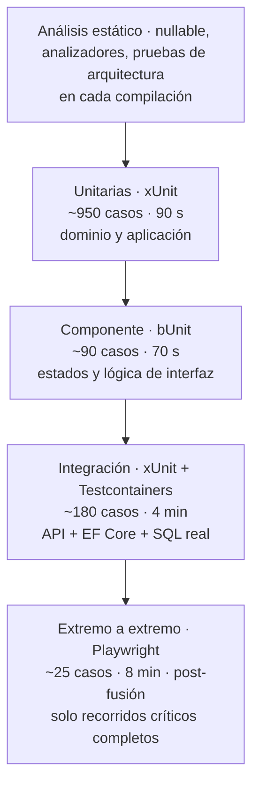

# Test Plan — `DOC-TESTPLAN`

## 1. Resumen ejecutivo

Toda organización prueba su software. Lo que distingue a un equipo con Test Plan de uno sin él no es la cantidad de pruebas sino la capacidad de responder tres preguntas incómodas: qué riesgo cubre cada prueba, qué queda deliberadamente sin cubrir, y bajo qué condición se declara que una versión puede salir. Un equipo sin esas respuestas tiene pruebas; no tiene estrategia.

El Test Plan es el documento donde `ACT-05` fija esa estrategia: alcance, niveles, entornos, datos, criterios de entrada y salida, riesgos y responsabilidades. No contiene casos concretos —eso es materia de [Test Cases](Test-Cases.md)— sino las decisiones bajo las cuales esos casos se escriben. Su lector principal no es quien ejecuta las pruebas sino quien tiene que decidir si se publica, y su valor se mide el día que alguien pregunta «¿está listo?» y hay una respuesta que no depende del optimismo de nadie.

En `ESC-2` el documento cambia de naturaleza y se vuelve la pieza central de la migración: es donde se define operativamente qué significa que el sistema destino «hace lo mismo» que el origen. Sin esa definición, una migración no tiene condición de terminación.

---

## 2. Definición

### Qué es

Documento de estrategia de prueba para un producto, una versión o un proyecto. Establece qué se prueba y con qué profundidad, en qué niveles, sobre qué entornos y datos, quién lo hace, en qué momento, y bajo qué criterios se entra y se sale de cada fase. El marco de referencia normativo es **ISO/IEC/IEEE 29119**, cuya parte 3 define los contenidos de la documentación de prueba, la parte 2 los procesos y la parte 4 las técnicas; la terminología sigue el glosario de **ISTQB**.

### Qué problema resuelve

Sin plan, el esfuerzo de prueba se distribuye por familiaridad y no por riesgo: se prueba con exhaustividad lo que es fácil de probar, y se deja sin cubrir lo que es difícil, que suele coincidir con lo caro de fallar. El Test Plan invierte el orden y obliga a decidir la asignación de esfuerzo antes de gastarlo.

Resuelve además el problema de la decisión de publicación. Cuando no hay criterio de salida escrito, la pregunta «¿podemos salir?» se responde por sensación, y quien la responde asume un riesgo que nunca acordó. Con criterio escrito, salir con tres defectos menores abiertos deja de ser una intuición y pasa a ser una decisión que alguien firmó.

Y resuelve un problema de alcance negativo, que es el más olvidado: **qué no se prueba**. Un plan que no declara sus exclusiones deja creer que todo está cubierto. Decir «no se prueba el rendimiento del módulo de informes en esta versión, porque su uso es mensual y el riesgo es bajo» es información valiosa; no decir nada sobre ese módulo es una omisión que alguien va a interpretar como cobertura.

### Qué NO es, y con qué se lo confunde

**No es el conjunto de casos de prueba.** Esta es la confusión más frecuente y la que produce el documento inservible: un Test Plan de ciento veinte páginas que en realidad es un listado de casos con una carátula de estrategia. La distinción es de nivel de abstracción y de ritmo de cambio. El plan responde *cómo abordamos la calidad de este producto* y cambia con la estrategia —una vez por versión mayor, quizá menos—. Los casos responden *qué se ejecuta exactamente* y cambian con cada requisito. Mezclarlos condena al plan a desactualizarse al ritmo de los casos, y un plan desactualizado deja de leerse.

La regla de decisión: si el contenido cambia cuando se agrega un requisito, es un caso. Si cambia cuando se cambia de opinión sobre cómo asegurar la calidad, es el plan.

**No es la estrategia de prueba organizacional.** En organizaciones grandes existe un documento de política que aplica a todos los productos —niveles obligatorios, herramientas estándar, umbrales corporativos—. El Test Plan lo particulariza para un producto. Cuando no existe la política, el plan la absorbe, y conviene decirlo para que se sepa qué parte es decisión del equipo.

**No es un informe de resultados.** El plan se escribe antes; el informe de ejecución dice qué pasó. Un plan que se llena de resultados deja de servir para planificar la versión siguiente.

**No es responsabilidad exclusiva de QA.** `ACT-05` es el dueño, pero un plan que el equipo de desarrollo no acordó es un plan que se incumple: las pruebas unitarias las escribe `ACT-04`, los entornos los provee `ACT-06` y los umbrales de rendimiento salen de los `RNF-` que firmó `ACT-01`.

---

## 3. Aplicación por escenario

| Escenario | Función del plan | Entrada principal | Dueño | Riesgo característico |
|-----------|-----------------|-------------------|-------|----------------------|
| `ESC-1` | Prescriptiva: define la estrategia y hace verificables los requisitos | `RF-` y `RNF-` del [SRS](../20-Analisis/SRS.md) | `ACT-05` | Escribirlo tarde, cuando los requisitos ya son ambiguos e inmutables |
| `ESC-2` | **Criterio de paridad**: define qué significa «hace lo mismo» | Comportamiento observado del sistema origen | `ACT-05` con `ACT-01` | Confundir defecto heredado con requisito |
| `ESC-3` | Descriptiva: reconstruye la estrategia real y mide su cobertura efectiva | Suites existentes, historial de defectos, configuración de CI | `ACT-05` con `ACT-10` | Confundir cobertura de líneas con cobertura de riesgo |
| `ESC-4` | Plan de exploración: qué se prueba del producto ajeno y con qué límites | El producto tal como se ofrece | `ACT-05` | Cruzar la frontera hacia la intrusión |

### `ESC-1` — Desarrollo nuevo

El momento correcto de escribirlo es en paralelo al SRS, no después. La razón es que el primer producto del Test Plan no son pruebas: es la corrección de los requisitos. Cuando `ACT-05` intenta derivar casos de `RF-014` y descubre que el requisito no dice qué pasa si dos usuarios confirman la misma sala en el mismo segundo, el hallazgo llega mientras corregir cuesta una conversación. Descubierto en la fase de prueba, cuesta una reescritura.

En `CTX-1` el plan dedica espacio a lo que solo existe en interfaz: los cuatro estados de cada pantalla, la accesibilidad con criterio verificable —conformidad **WCAG 2.2** nivel AA sobre los flujos críticos, verificada con herramienta automática más revisión manual de orden de foco y lectura por lector de pantalla—, el comportamiento responsivo en los puntos de quiebre acordados, y en Blazor *interactive server* un nivel de prueba que ningún otro contexto necesita: la caída y reconexión del circuito SignalR durante una operación en curso. En `CTX-2` el peso está en el contrato: pruebas de esquema contra la [especificación de API](../40-Diseno/API-Specification.md), idempotencia verificada reenviando la misma `Idempotency-Key`, comportamiento bajo entrega duplicada de eventos, y códigos de error verificados uno por uno. En `CTX-3` aparece la exigencia de trazabilidad vertical: cada `RF-` debe poder seguirse hasta el caso que lo verifica, sea cual sea el nivel donde se verifique, y el plan declara en qué nivel se cubre cada tipo de requisito para que nadie lo pruebe dos veces ni ninguno quede sin probar.

### `ESC-2` — El Test Plan como criterio de paridad

Este es el uso más exigente del documento y el que justifica escribirlo primero, antes que el SAD del destino. La migración tiene un problema que ningún otro escenario tiene: no existe una especificación de lo que hay que construir. Existe un sistema en producción cuyo comportamiento, en buena parte, nadie escribió nunca. La pregunta «¿terminamos?» no se puede responder contra un SRS que no existe; se responde contra un criterio de paridad, y ese criterio vive acá.

Definir la paridad exige cuatro decisiones que hay que tomar explícitamente y con firma de `ACT-01`.

**Qué se compara.** La paridad se define sobre el comportamiento observable, no sobre la estructura interna. Origen y destino deben producir la misma salida ante la misma entrada, en los mismos casos que importan. Comparar estructura de código es el error que convierte una migración en una traducción literal.

**Con qué granularidad.** Comparar el HTML renderizado de un módulo ASP.NET MVC con el de un componente Blazor es imposible y además indeseable: la migración existe justamente para cambiar la interfaz. La paridad se define en el nivel donde el comportamiento es equivalente por diseño —el resultado de negocio, el estado persistido, el evento emitido— y explícitamente **no** en el nivel de presentación.

**Qué diferencias son aceptables.** Toda migración introduce diferencias, y el plan las clasifica de antemano en tres grupos: las prohibidas —cualquier cambio en el resultado de una regla de negocio—, las aceptadas y documentadas —el orden de los resultados sin criterio explícito de ordenamiento, el formato de los mensajes de error, la latencia dentro de un margen acordado— y las deseadas, que son correcciones deliberadas de defectos del origen. Este tercer grupo es el más delicado: un defecto del origen que se corrige en el destino **rompe la paridad a propósito**, y si no está registrado, la prueba de comparación lo reportará como falla de la migración.

**Qué se decidió no migrar.** El alcance negativo, con firma. Las funcionalidades excluidas no se prueban, y su exclusión se comunica antes del corte y no después.

La técnica que hace operativa la paridad es la **prueba de comparación**: se ejecuta el mismo conjunto de entradas contra ambos sistemas y se comparan las salidas normalizadas. El conjunto se arma de tres fuentes, en orden de valor decreciente: registros de producción del origen anonimizados, que tienen la propiedad irreemplazable de contener los casos raros que nadie hubiera imaginado; casos derivados de las reglas de negocio conocidas; y casos de borde construidos a mano sobre las zonas de mayor riesgo. En sistemas con volumen suficiente, la comparación se puede ejecutar en producción durante un período de operación en paralelo, con el destino recibiendo copia del tráfico real y sin efectos secundarios.

En el sistema de reserva de salas, migrando de ASP.NET MVC a Blazor: la paridad se define sobre el estado final de la reserva y sobre el evento emitido. Se toman doce mil solicitudes de confirmación de los registros del último trimestre, se reproducen contra ambos sistemas con la base restaurada al mismo punto, y se compara el par `(estado, motivo de rechazo)`. Las diferencias esperadas se declaran antes: el origen devolvía `400` para el conflicto de sala y el destino devuelve `409` con alternativas —diferencia deseada, registrada, con `RF-014` como respaldo—; el origen permitía reservas de duración cero por un defecto de validación —diferencia deseada, el destino las rechaza—. Cualquier otra diferencia es una falla de la migración y bloquea el corte.

El criterio de terminación queda entonces enunciable en una línea, que es exactamente lo que le faltaba a la migración: *el destino se declara en paridad cuando el cien por ciento de los casos de comparación coincide, salvo las diferencias declaradas de antemano, sobre un conjunto que cubre todas las reglas de negocio identificadas y las diez operaciones de mayor volumen*.

### `ESC-3` — Evaluación con acceso al código

El plan no se escribe: se reconstruye, y el producto del trabajo es un diagnóstico de la estrategia real más una propuesta.

Se empieza por lo que hay: cuántas pruebas existen, en qué niveles, cuánto tardan, cuántas están marcadas como omitidas —una prueba omitida hace ocho meses es una prueba borrada que nadie se animó a borrar—, cuántas son inestables. Se mide después la cobertura, y acá conviene la desconfianza: la cobertura de líneas dice qué código se ejecutó durante las pruebas, no qué comportamiento se verificó. Un conjunto de pruebas que ejecuta el noventa por ciento del código sin una sola aserción sobre el resultado da noventa por ciento de cobertura y cero de verificación. La pregunta útil no es cuánto cubre, sino qué reglas de negocio quedarían sin detectar si alguien las rompiera; la respuesta se obtiene rompiéndolas deliberadamente y viendo si algo falla.

La fuente más informativa es el historial de defectos. Los módulos donde se concentran los defectos de producción son los que la estrategia actual no cubre, y esa correlación vale más que cualquier métrica de cobertura para decidir dónde invertir. Un módulo con el treinta por ciento de los incidentes y el cinco por ciento de las pruebas es un hallazgo accionable.

### `ESC-4` — Evaluación externa

El plan se transforma en un **plan de exploración**: qué funcionalidades se van a ejercitar, con qué cuenta y configuración, en qué orden, y qué se registra de cada observación. Su valor está en la reproducibilidad —fecha, versión observada, plan de suscripción— sin la cual el informe no se puede contrastar más adelante.

El plan debe declarar sus límites con la misma precisión con la que declara su alcance: se prueba el producto tal como se ofrece al usuario legítimo. Probar credenciales ajenas, forzar límites de tasa, medir capacidad con carga sintética o intentar acceder a datos de otros inquilinos no es prueba: es intrusión. Un plan de exploración externa que no enuncia esa frontera es un plan que invita a cruzarla.

---

## 4. Ejemplos concretos

### 4.1 La pirámide de pruebas y sus críticas

La **pirámide de pruebas de Mike Cohn** propone tres niveles con proporciones decrecientes: muchas pruebas unitarias en la base, menos de servicio en el medio, pocas de interfaz en la cima. El argumento es económico: cuanto más alto el nivel, más lenta la prueba, más frágil, más cara de mantener y más difícil de diagnosticar cuando falla.

El argumento sigue siendo válido, y sin embargo la pirámide se aplica mal con frecuencia, por tres motivos que conviene tener presentes.

**El nivel más barato no es siempre el más informativo.** Una batería de pruebas unitarias con dobles en cada frontera puede estar toda en verde mientras el sistema no funciona, porque lo que falla es la integración entre piezas que individualmente cumplen su contrato simulado. Es el modo de falla característico de la pirámide llevada al extremo: mil pruebas verdes y una aplicación rota.

**La forma óptima depende de la arquitectura.** Un servicio cuya lógica es esencialmente coordinación de llamadas a otros servicios tiene poco que probar unitariamente y mucho que probar en integración. Aplicar la proporción de la pirámide ahí produce pruebas que verifican dobles.

**Las herramientas cambiaron la economía.** Cuando Cohn escribió, una prueba de integración con base de datos tardaba minutos y exigía un entorno compartido. Con contenedores efímeros levantados por la propia prueba, la misma verificación tarda segundos y no depende de nadie. Bajar el costo de un nivel cambia la proporción óptima.

La crítica que mejor articula esto es el **trofeo de pruebas** de Kent C. Dodds, que ensancha la banda de integración y la propone como el nivel de mayor retorno, con una capa de análisis estático en la base —tipos, analizadores— que atrapa gratis defectos que antes exigían pruebas. Su criterio rector es que la confianza que aporta una prueba es proporcional a cuánto se parece a la forma en que el software se usa realmente.

Ninguna de las dos formas es una regla. La utilidad de ambas está en obligar a preguntarse dónde está el mejor retorno para *este* sistema, en lugar de repartir el esfuerzo por costumbre. La forma de este proyecto se declara y se justifica:



La banda de integración es deliberadamente ancha porque el riesgo dominante del sistema está en la concurrencia sobre la base de datos —dos usuarios confirmando la misma sala— y ese comportamiento depende del índice único y del nivel de aislamiento de la transacción, que ninguna prueba unitaria con doble puede verificar. La cima es angosta porque las pruebas extremo a extremo de este proyecto históricamente fallaron por causas ajenas al producto tres veces más seguido que por defectos reales.

### 4.2 Niveles y tipos de prueba

| Nivel / tipo | Qué verifica | Herramienta | Cuándo corre | Dueño |
|--------------|--------------|-------------|--------------|-------|
| Unitaria | Reglas del dominio y lógica de aplicación, sin E/S | xUnit | Cada compilación | `ACT-04` |
| Componente (interfaz) | Renderizado, estados y eventos de un componente aislado | bUnit | Cada pull request | `ACT-04` |
| Integración | Persistencia real, transacciones, contrato HTTP, mensajería | xUnit + Testcontainers | Cada pull request | `ACT-04` con `ACT-05` |
| Contrato | Que la implementación cumple la especificación OpenAPI | Validación de esquema | Cada pull request | `ACT-04` |
| Extremo a extremo | Recorridos completos de usuario sobre el sistema desplegado | Playwright | Post-fusión, nocturno completo | `ACT-05` |
| Carga y rendimiento | `RNF-` de tiempo de respuesta y capacidad | k6 o NBomber | Antes de cada versión menor | `ACT-05` con `ACT-06` |
| Seguridad | Autenticación, autorización, dependencias, entradas maliciosas | Escaneo + casos dirigidos | Cada pull request (automático), trimestral (dirigido) | `ACT-07` |
| Accesibilidad | Conformidad WCAG 2.2 AA en flujos críticos | axe + revisión manual | Cada versión menor | `ACT-08` con `ACT-05` |
| Exploratoria | Lo que ningún caso escrito anticipó | Sesiones con carta de exploración | Cada versión | `ACT-05` |

La prueba exploratoria merece defensa porque suele ser lo primero que se recorta. Los casos escritos verifican lo que alguien pensó; los defectos caros suelen estar en lo que nadie pensó. Una sesión de noventa minutos con una carta de exploración acotada —«explorar el alta de reserva con foco en la interrupción del flujo: cierre de pestaña, sesión expirada, doble envío»— encuentra defectos que ningún caso derivado sistemáticamente encontraría, y su producto es tanto una lista de hallazgos como una lista de casos nuevos para automatizar.

La prueba de carga no se planifica en abstracto sino contra un `RNF-` concreto. `RNF-008 — la búsqueda de disponibilidad responde en menos de 400 ms en el percentil 95 con 200 usuarios concurrentes` es verificable; «el sistema debe ser rápido» no es un requisito sino una expectativa, y devolverlo a `ACT-02` es la respuesta correcta de QA.

### 4.3 Criterios de entrada y salida

Los criterios existen para que la decisión de avanzar sea de la organización y no de quien esté disponible ese día.

**Entrada a la fase de prueba de sistema:**

| Criterio | Umbral |
|----------|--------|
| Compilación desplegada en el entorno de pruebas | Versión etiquetada, sin cambios pendientes |
| Pruebas de los niveles inferiores | 100 % en verde en el pipeline |
| Casos de prueba de la versión | Escritos y revisados; trazabilidad `RF-` → `TC-` completa |
| Datos de prueba | Cargados y verificados en el entorno |
| Defectos bloqueantes de la versión anterior | 0 abiertos |

**Salida hacia producción:**

| Criterio | Umbral | Quién decide la excepción |
|----------|--------|--------------------------|
| Casos de severidad crítica y alta | 100 % ejecutados, 100 % aprobados | Sin excepción posible |
| Casos de severidad media | ≥ 95 % ejecutados y aprobados | `ACT-05` |
| Defectos abiertos críticos o mayores | 0 | Sin excepción posible |
| Defectos abiertos menores | ≤ 5, cada uno con dueño y versión objetivo | `ACT-01` |
| `RNF-` de rendimiento de la versión | Verificados contra su umbral | `ACT-01` con `ACT-03` |
| Accesibilidad de flujos críticos | Sin hallazgos de nivel A o AA | `ACT-01` |
| Recorridos extremo a extremo críticos | 100 % en verde en la última ejecución | Sin excepción posible |
| Vuelta atrás | Probada sobre este artefacto | `ACT-06` |

La columna de excepciones es la que hace utilizable la tabla. Un criterio de salida sin vía de excepción se elude en silencio la primera vez que estorba, y a partir de ahí la tabla entera es decorativa. Con la columna, la excepción existe pero deja rastro: quién la autorizó, cuándo y con qué motivo.

### 4.4 Gestión de datos de prueba

Los datos son la causa más frecuente de pruebas inestables y de incidentes de privacidad, y por eso la estrategia se decide en el plan y no en cada prueba.

**Cuatro fuentes, con su regla de uso.** Los datos sembrados por migración son un conjunto mínimo y estable —tres salas, cuatro usuarios con roles distintos, un feriado— que existe en todos los entornos y que ninguna prueba puede modificar. Los datos construidos por la propia prueba son la fuente preferida en integración: cada prueba crea lo que necesita con un constructor y lo destruye al terminar, lo que la vuelve independiente del orden de ejecución. Los datos generados sintéticamente cubren volumen para las pruebas de carga. Y los datos derivados de producción, que son los más valiosos por realismo y los más peligrosos, solo se usan anonimizados: nombres y correos reemplazados de forma consistente para preservar las relaciones, identificadores conservados, cualquier dato personal irrecuperable. La anonimización se verifica con una prueba propia, porque un procedimiento de anonimización roto no se nota hasta que alguien reconoce a un cliente en el entorno de pruebas.

**La regla que evita la mitad de las pruebas inestables**: ninguna prueba depende del estado que dejó otra. Cada una crea su propio contexto, y en integración lo hace dentro de una transacción que se revierte, o sobre un contenedor efímero exclusivo. Las pruebas que fallan solo cuando se ejecutan en paralelo, o solo los lunes, casi siempre violan esta regla.

**El tiempo es un dato de prueba.** Un sistema de reservas es especialmente vulnerable: una prueba escrita con la fecha del día falla el fin de semana, en el cambio de horario y el 29 de febrero. El reloj se abstrae detrás de un servicio inyectable, y las pruebas fijan el instante explícitamente. Esta decisión pertenece al plan porque obliga a una convención de diseño que el [Developer Guide](Developer-Guide.md) tiene que recoger.

### 4.5 Entornos

| Entorno | Propósito | Datos | Quién despliega | Vida |
|---------|-----------|-------|-----------------|------|
| Local | Desarrollo y pruebas de los niveles inferiores | Sembrados por script | El desarrollador | Permanente |
| Efímero de pull request | Pruebas de componente e integración aisladas | Contenedores por prueba | Pipeline | Minutos |
| Integración | Extremo a extremo automáticas tras la fusión | Restaurado a la línea base cada noche | Pipeline | Permanente |
| Preproducción | Pruebas manuales, carga, aceptación, paridad en `ESC-2` | Copia anonimizada de producción, semanal | Pipeline con aprobación | Permanente |
| Producción | Verificación post-despliegue y monitoreo sintético | Reales | Según Deployment Guide | Permanente |

Preproducción tiene una exigencia que las otras no: debe parecerse a producción en lo que afecta al riesgo que se busca detectar. Igualar el número de réplicas es caro y a veces innecesario; igualar la versión del motor de base de datos, el nivel de aislamiento de transacción y la configuración de la caché no es negociable, porque son exactamente las variables que producen los defectos que solo aparecen en producción.

La configuración de cada entorno y su procedimiento de despliegue viven en el [Deployment Guide](../50-Operativa/Deployment-Guide.md); acá solo se declara para qué sirve cada uno en la estrategia de prueba.

### 4.6 Riesgos

El análisis de riesgo es lo que convierte el plan en una asignación de esfuerzo y no en una lista de buenas intenciones. Cada riesgo lleva su probabilidad, su impacto y la prueba que lo mitiga; los riesgos aceptados sin mitigación se registran igual, con firma.

| ID | Riesgo | Prob. | Impacto | Mitigación | Dueño |
|----|--------|-------|---------|-----------|-------|
| `RSK-01` | Doble reserva de sala por concurrencia | Media | Crítico | Índice único en base + pruebas de integración con confirmaciones simultáneas + caso de carga con 50 solicitudes al mismo intervalo | `ACT-04` |
| `RSK-02` | Pérdida de trabajo al caerse el circuito Blazor | Alta | Alto | Casos de componente de reconexión + recorrido E2E con corte de red simulado | `ACT-04` |
| `RSK-03` | Reglas de negocio en procedimientos almacenados no documentadas | Alta | Crítico | En `ESC-2`: comparación sobre registros de producción, que las ejercita aunque nadie las conozca | `ACT-05` |
| `RSK-04` | Pruebas E2E inestables que erosionan la confianza | Alta | Medio | Cuarentena automática al tercer fallo intermitente + revisión semanal de la lista | `ACT-05` |
| `RSK-05` | Datos de producción sin anonimizar en preproducción | Baja | Crítico | Anonimización verificada por prueba propia + acceso restringido a preproducción | `ACT-06` con `ACT-07` |
| `RSK-06` | Regresión de accesibilidad al rediseñar componentes | Media | Alto | axe en el pipeline sobre las páginas críticas + revisión manual por versión menor | `ACT-08` |

`RSK-04` merece una regla explícita porque es el riesgo que degrada al resto: una prueba que falla sin motivo enseña al equipo a reintentar en lugar de investigar, y llegado ese punto las pruebas dejan de proteger. La política es tratar la inestabilidad como un defecto de severidad alta con dueño y plazo, no como un inconveniente.

### 4.7 Métricas

Se siguen pocas y se elige cada una por la decisión que habilita. Las cuatro métricas de entrega de **DORA / Accelerate** —frecuencia de despliegue, tiempo de espera del cambio, tasa de fallas de cambio y tiempo de restauración— son las que mejor correlacionan la calidad con la capacidad de entregar, y las dos últimas son responsabilidad compartida de esta familia y de la operativa. A ellas se agregan dos propias del plan: la proporción de defectos de producción que ninguna prueba existente hubiera detectado —que mide el hueco de la estrategia mucho mejor que la cobertura— y la duración del pipeline hasta la primera señal de falla, porque una batería lenta se termina eludiendo.

La métrica que conviene no seguir como objetivo es el porcentaje de cobertura total. Es útil como señal de alarma cuando cae bruscamente y es dañina como meta, porque se alcanza escribiendo pruebas sin aserciones.

---

## 5. Preguntas guía

- ¿Qué riesgo concreto cubre cada nivel de prueba de este plan? Si un nivel no responde a un riesgo, ¿por qué existe?
- ¿Qué se decidió deliberadamente no probar, y quién firmó esa decisión?
- Si alguien rompiera la regla de negocio más importante del sistema, ¿qué prueba fallaría? ¿Existe?
- ¿El criterio de salida está escrito antes de la fase de prueba, o se está negociando durante?
- ¿Cuántas pruebas están omitidas o en cuarentena, y desde cuándo?
- En `ESC-2`: ¿cuál es la definición operativa de paridad, y qué diferencias entre origen y destino están declaradas de antemano como aceptables o deseadas?
- ¿Los datos de preproducción están anonimizados, y cuándo se verificó por última vez que el procedimiento funciona?
- ¿Qué proporción de los defectos del último trimestre habría sido detectada por las pruebas que ya existían?

---

## 6. Criterios de calidad y antipatrones

### Criterios de calidad

**Está atado al riesgo.** Cada decisión de esfuerzo se explica por un riesgo identificado. Un plan que reparte pruebas parejo sobre todos los módulos no analizó nada.

**Declara su alcance negativo.** Lo que no se prueba está escrito, con motivo. Un plan sin exclusiones deja creer que cubre todo.

**Los criterios de salida son verificables sin discusión.** Umbrales numéricos, no adjetivos. «Calidad aceptable» no es criterio; «cero defectos críticos abiertos» sí.

**Es más corto que el conjunto de casos que gobierna.** Si el plan es más largo, absorbió contenido que no le corresponde.

**Lo acordó quien lo va a ejecutar.** Un plan que asigna a `ACT-04` la escritura de pruebas de integración sin que `ACT-04` haya participado es una lista de deseos.

**Tiene fecha de revisión y se revisa.** La estrategia envejece con la arquitectura: cuando el sistema se parte en servicios, la banda de integración cambia de significado.

### Antipatrones

**El plan que es un listado de casos.** El más común. Produce un documento largo, desactualizado a las tres semanas y nunca releído.

**La pirámide aplicada como dogma.** Repartir el esfuerzo según proporciones canónicas sin preguntar dónde está el riesgo de este sistema. El síntoma es una batería enorme de pruebas unitarias con dobles en cada frontera, toda en verde, sobre un sistema que falla en integración.

**La cobertura como objetivo.** Fijar un umbral de cobertura total y alcanzarlo con pruebas que ejecutan código sin verificar resultado. Da la métrica y no da la protección.

**El criterio de salida negociado durante la fase de prueba.** Cuando el umbral se decide con los resultados a la vista, el umbral es el resultado. Escribirlo antes es lo único que lo hace un criterio.

**Los defectos heredados convertidos en requisitos.** En `ESC-2`, definir la paridad como «idéntico en todo» obliga a reproducir los defectos del origen. La clasificación previa de las diferencias en prohibidas, aceptadas y deseadas es lo que evita este callejón.

**La inestabilidad tolerada.** Reintentar la batería hasta que pase. Cada reintento aceptado le enseña al equipo que el rojo no significa nada.

**El plan escrito después del código.** Su producto más valioso —hacer verificables los requisitos antes de implementarlos— se pierde por completo. Lo que queda es documentación de lo que ya se hizo.

**Preproducción que no se parece a producción donde importa.** Igualar lo barato de igualar —el nombre del entorno, la cantidad de datos— y no lo que genera los defectos: versión del motor, aislamiento transaccional, configuración de caché y de tiempos de espera.

---

## 7. Anexo — Plantilla comentada

```markdown
---
doc_id: TESTPLAN-<producto>-<versión>
doc_type: tema
title: Test Plan — <producto> <versión>
status: vigente | borrador | obsoleto
origin: human | ia-assisted | ia-generated
confidence: alta | media | baja        # obligatorio si origin != human
owner: <QA responsable que lo firma>
last_review: AAAA-MM-DD
audience: [humano, agente]
traces: [DOC-SRS, DOC-TESTCASES, DOC-DEVGUIDE, DOC-API]
---

# Test Plan — <producto> <versión>

## 1. Contexto y alcance
### 1.1 Qué se prueba
<!-- Módulos, versiones, plataformas y navegadores soportados. -->
### 1.2 Qué NO se prueba, y por qué
<!-- La sección que más se omite y más se necesita. Cada exclusión con
     su motivo y su riesgo aceptado. Sin ella, el lector asume cobertura. -->
### 1.3 Referencias
<!-- SRS con la versión exacta; API Specification; ISO/IEC/IEEE 29119
     si la organización la adopta formalmente. -->

## 2. Estrategia
### 2.1 Forma elegida y su justificación
<!-- Pirámide, trofeo u otra: la forma se elige por el riesgo dominante
     de ESTE sistema, y se justifica. Diagrama con cantidades y duraciones. -->
### 2.2 Niveles y tipos
<!-- Tabla: nivel · qué verifica · herramienta · cuándo corre · dueño.
     Todo nivel debe responder a un riesgo de la sección 5. -->
### 2.3 Automatización
<!-- Qué se automatiza, qué queda manual y por qué. Un caso manual
     ejecutado en cada versión durante dos años es un caso mal clasificado. -->

## 3. Entornos
<!-- Tabla: entorno · propósito · datos · quién despliega.
     En qué se parece y en qué NO se parece preproducción a producción. -->

## 4. Datos de prueba
### 4.1 Fuentes y regla de uso
### 4.2 Anonimización
<!-- Procedimiento, quién lo verifica y con qué frecuencia. -->
### 4.3 Independencia entre pruebas
<!-- Cómo se garantiza que ninguna prueba dependa del estado de otra.
     Tratamiento del tiempo como dato de prueba. -->

## 5. Riesgos
<!-- Tabla: ID · riesgo · probabilidad · impacto · mitigación · dueño.
     Los riesgos aceptados sin mitigación se registran igual, con firma. -->

## 6. Criterios
### 6.1 De entrada
### 6.2 De salida
<!-- Umbrales numéricos y, para cada uno, quién puede autorizar la
     excepción. Sin la columna de excepción, la tabla se elude en silencio. -->
### 6.3 De suspensión y reanudación
<!-- Qué hace detener la fase de prueba y qué se exige para retomarla. -->

## 7. Criterio de paridad        # solo en ESC-2
<!-- Qué se compara, con qué granularidad, sobre qué conjunto de entradas.
     Clasificación previa de diferencias: prohibidas / aceptadas / deseadas.
     Alcance negativo firmado: qué se decidió no migrar. -->

## 8. Organización
<!-- Quién ejecuta cada nivel, quién decide la publicación, cómo se
     escalan los defectos, dónde se registran. -->

## 9. Métricas
<!-- Pocas, cada una con la decisión que habilita. Evitar la cobertura
     total como objetivo. -->

## 10. Trazabilidad
<!-- Cómo se garantiza que cada RF- tenga al menos un TC-, y en qué nivel
     se cubre cada tipo de requisito. El detalle vive en Test Cases. -->
```
