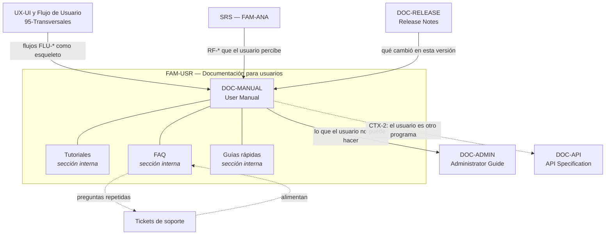

# Documentación para usuarios — `FAM-USR`

## Resumen ejecutivo

Toda la documentación anterior de la guía se escribe para gente que construye el sistema. Esta familia es la primera que se escribe para gente que lo **usa**, y ese cambio de destinatario lo cambia todo: el lector no conoce el vocabulario del dominio técnico, no tiene por qué saber cómo está implementado nada, llega con un objetivo concreto y con paciencia limitada. La pregunta de la familia es **«¿cómo se utiliza el sistema?»**, y quien la responde mal no produce documentación deficiente sino tickets de soporte.

El artefacto único de la familia es el [User Manual](User-Manual.md), que en la práctica absorbe cuatro géneros distintos —manual de referencia, tutoriales, FAQ y guías rápidas— con reglas de redacción incompatibles entre sí. Distinguirlos es el problema central, y el instrumento para hacerlo es el marco **Diátaxis**.

El actor dueño es `ACT-09` Technical Writer, con `ACT-01` Product Owner aprobando y `ACT-08` UX/UI consultado, según la [matriz de responsabilidad](../00-Marco-de-Referencia/Actores.md#matriz-de-responsabilidad-por-familia-documental).

---

## La pregunta que responde la familia

«¿Cómo se utiliza el sistema?» no es una pregunta sino cuatro, y cada una exige un género documental con su propia forma:

| Pregunta del lector | Género | Sección del manual | Estado mental |
|---------------------|--------|--------------------|---------------|
| Nunca usé esto, ¿por dónde empiezo? | Tutorial | [Tutoriales](User-Manual.md#tutoriales) | Aprendiendo, sin objetivo real |
| Necesito hacer *X* ahora | How-to / guía rápida | [Guías rápidas](User-Manual.md#guías-rápidas) | Trabajando, con objetivo concreto |
| ¿Qué hace exactamente este campo? | Referencia | [Manual](User-Manual.md#41-fragmento-de-manual-de-referencia) | Consultando un dato puntual |
| ¿Por qué el sistema se comporta así? | Explicación / FAQ | [FAQ](User-Manual.md#faq) | Entendiendo, muchas veces frustrado |

El error clásico —escribir un tutorial con forma de referencia— consiste en confundir la segunda columna con la primera. Un tutorial que enumera todas las opciones de cada pantalla no enseña: abruma. Una referencia que solo describe el camino feliz no sirve para consultar.

---

## Cómo se relacionan los artefactos

Las tres flechas de entrada marcan de dónde sale el contenido: el manual no se inventa, se deriva de flujos ya diseñados y requisitos ya especificados. Las de salida marcan los límites: lo que exige privilegios administrativos vive en la [Administrator Guide](../50-Operativa/Administrator-Guide.md), y en contexto backend el manual se desplaza hacia la [API Specification](../40-Diseno/API-Specification.md). El ciclo entre FAQ y soporte es el único mecanismo de realimentación empírica que esta familia tiene, y conviene tratarlo como instrumento de medición y no como anécdota.

---

## Orden de lectura

Para producir la familia por primera vez, el orden es inverso al de consumo: primero la **referencia**, porque es lo que obliga a recorrer el producto completo y detecta las funcionalidades que nadie sabía explicar; después las **guías rápidas**, que se apoyan en la referencia; después los **tutoriales**, que son lo más caro de escribir y lo que más envejece; y por último la **FAQ**, que no se escribe sino que se cosecha del soporte real.

Para estudiar la familia, el orden es el del documento: [Diátaxis como eje](User-Manual.md#el-eje-ordenador-diátaxis) antes que cualquier plantilla. Quien salta a las plantillas produce cuatro documentos con la misma forma, que es exactamente el problema que el marco resuelve.

---

## Aplicación por escenario, en una línea cada uno

| Escenario | Peso de la familia | Qué cambia |
|-----------|-------------------|-----------|
| [`ESC-1`](../00-Marco-de-Referencia/Escenarios.md#esc-1--desarrollo-de-software-nuevo) Desarrollo nuevo | Medio, y tardío | Se escribe cuando la interfaz se estabiliza; antes se documenta aire |
| [`ESC-2`](../00-Marco-de-Referencia/Escenarios.md#esc-2--migración-a-otro-lenguaje-o-plataforma) Migración | Alto y subestimado | El manual viejo es la mejor especificación del comportamiento actual, y el nuevo debe explicar qué cambió de lugar |
| [`ESC-3`](../00-Marco-de-Referencia/Escenarios.md#esc-3--evaluación-de-software-existente-con-acceso-al-código) Evaluación con código | Bajo como producto, alto como evidencia | La distancia entre el manual y el sistema real mide la salud documental del equipo |
| [`ESC-4`](../00-Marco-de-Referencia/Escenarios.md#esc-4--evaluación-de-un-producto-solo-desde-afuera) Evaluación externa | Máximo como fuente | El manual público del producto ajeno es la fuente de relevamiento más rica y más barata |

Por contexto, esta familia es la de mayor variación de toda la guía: peso máximo en [`CTX-1`](../00-Marco-de-Referencia/Contextos.md#ctx-1--web-y-cliente-interactivo), mínimo en [`CTX-2`](../00-Marco-de-Referencia/Contextos.md#ctx-2--backend-y-servicios) —donde el «usuario» es otro programa y el manual muta en documentación para desarrolladores integradores— y alto en [`CTX-3`](../00-Marco-de-Referencia/Contextos.md#ctx-3--fullstack), con el problema añadido de mantener un solo vocabulario entre la interfaz y la API.

---

## Referencias de industria pertinentes a la familia

**Diátaxis**, de Daniele Procida, es el marco que ordena los cuatro géneros según dos ejes: acción frente a conocimiento, y estudio frente a trabajo. Es la aportación conceptual que esta familia usa como columna vertebral.

**ISO/IEC/IEEE 26514** cubre el diseño y desarrollo de la información para usuarios; **ISO/IEC/IEEE 26511**, la gestión de esa información como proceso; **ISO/IEC/IEEE 26515**, su producción dentro de desarrollo ágil, que es el caso en el que el manual debe existir al final de cada incremento y no al final del proyecto.

La **Microsoft Writing Style Guide** y la **Google Developer Documentation Style Guide** son las dos guías de estilo de referencia pública más usadas; ambas resuelven decisiones que de otro modo se discuten sin criterio: persona verbal, tiempo, tratamiento de la interfaz, mayúsculas, voz activa.

**WCAG 2.2** aplica a la documentación misma, no solo al producto: un manual publicado en HTML es un sitio web y hereda todos sus criterios de conformidad. El movimiento de **plain language / lenguaje claro** aporta el criterio de legibilidad y la disciplina de escribir para el nivel de lectura real del lector, no para el del autor.

---

## Índice de la familia

- [`DOC-MANUAL` — User Manual](User-Manual.md), con sus secciones internas de **Tutoriales**, **FAQ** y **Guías rápidas**

### Marco de referencia

- [Escenarios](../00-Marco-de-Referencia/Escenarios.md) — `ESC-1` a `ESC-4`
- [Contextos](../00-Marco-de-Referencia/Contextos.md) — `CTX-1` a `CTX-3`
- [Actores](../00-Marco-de-Referencia/Actores.md) — `ACT-01` a `ACT-10`
- [Convenciones](../00-Marco-de-Referencia/Convenciones.md) — frontmatter, IDs, estilo

### Familias y documentos vecinos

- [`DOC-ADMIN` — Administrator Guide](../50-Operativa/Administrator-Guide.md): lo mismo, para quien administra en lugar de usar
- [`DOC-API` — API Specification](../40-Diseno/API-Specification.md): el manual de usuario de `CTX-2`
- [`DOC-RELEASE` — Release Notes](../60-Desarrollo/Release-Notes.md): la puerta de entrada a cada revisión del manual
- [UX/UI y flujo de usuario](../95-Transversales/UX-UI-y-Flujo-de-Usuario.md): los flujos que el manual narra

---

## Criterio de suficiencia de la familia

La prueba es empírica y no admite opinión: se toma a una persona que nunca usó el sistema, se le da un objetivo real y solo la documentación, y se mide si lo logra y en cuánto tiempo. Un manual que no ha sido probado con nadie ajeno al equipo es una hipótesis.

Como criterio de mínimos, un producto interno de línea de negocio necesita tres cosas antes de la primera puesta en producción: un tutorial del recorrido principal, una guía rápida por cada rol y una FAQ vacía pero publicada, con un canal para llenarla. El manual de referencia exhaustivo puede esperar; la FAQ sin canal de alimentación no se llena nunca.
