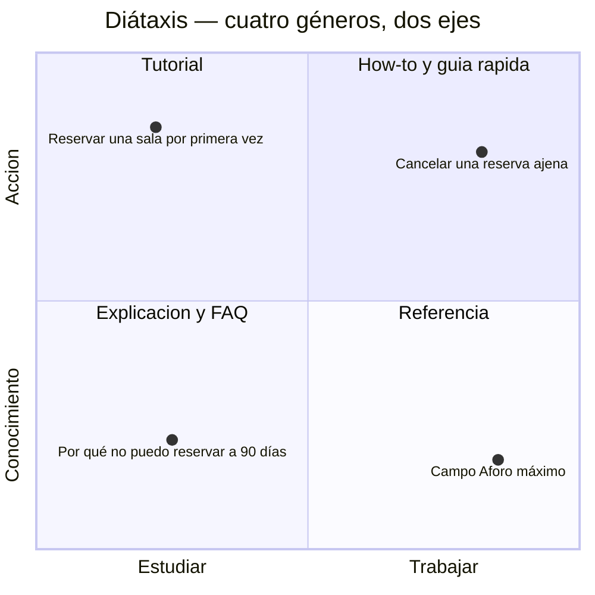
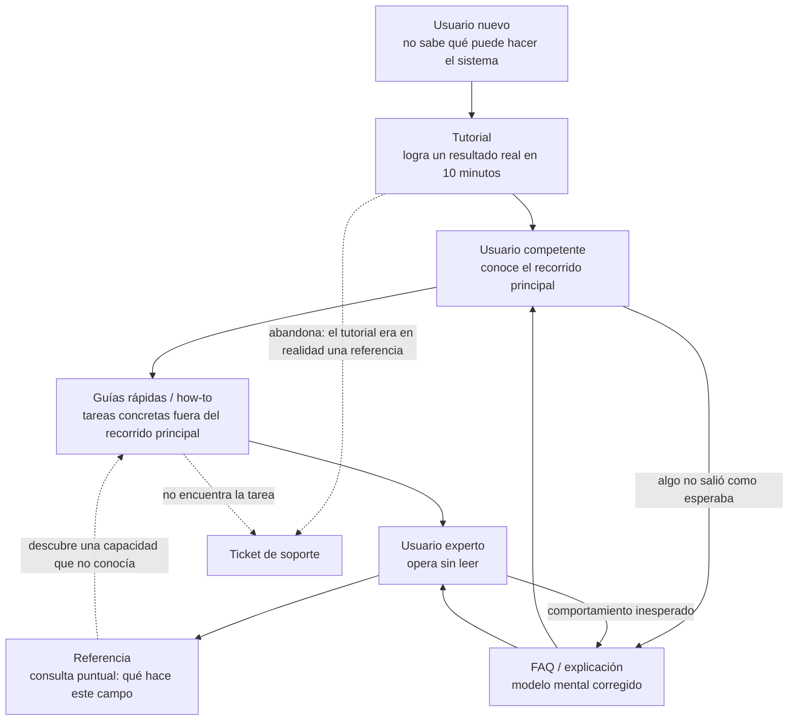

# User Manual — `DOC-MANUAL`

## 1. Resumen ejecutivo

El User Manual es el documento que permite a una persona lograr sus objetivos con el sistema sin preguntarle a nadie. Su destinatario no participó de ninguna decisión de diseño, no conoce el modelo de datos y no le interesa: llega con una tarea —reservar una sala para el jueves— y con el umbral de paciencia de quien ya intentó resolverlo solo. Cada minuto que pierde buscando cómo hacer algo es un costo real, y cuando ese costo supera cierto umbral el usuario deja de leer y abre un ticket.

Bajo ese nombre conviven en realidad cuatro géneros con reglas de redacción incompatibles. El **tutorial** enseña a alguien que no sabe nada y por eso oculta deliberadamente casi todas las opciones. La **guía rápida** asiste a alguien que ya sabe y necesita ejecutar, por lo que no explica nada. La **referencia** describe la superficie completa del producto sin ordenarla por objetivo. La **FAQ** responde el desconcierto, que es un género propio porque su fuente no es el producto sino el usuario real. Escribir los cuatro con la misma plantilla es el error más frecuente y el más caro, porque produce un cuerpo documental que no sirve para ninguno de los cuatro usos.

Este documento organiza esos géneros con el marco **Diátaxis**, desarrolla el tratamiento de cada uno y entrega plantillas comentadas. Trata además las decisiones que definen la economía de un manual: cuánto documentar, con qué capturas de pantalla, en qué idiomas, con qué accesibilidad, versionado contra qué, y cómo medir si sirve. La `FAM-USR` completa está indexada en el [README de la familia](README.md).

---

## 2. Definición

### Qué es

Un User Manual es el conjunto ordenado de información que un usuario final necesita para operar un producto de software dentro de los permisos que su rol le concede. Es documentación de **uso**, no de construcción: describe el sistema desde la superficie que el usuario toca —pantallas, campos, mensajes, resultados— y nunca desde su implementación. Que la reserva se persista con un índice único sobre `(SalaId, Intervalo)` es información verdadera, relevante para el modelo de datos e irrelevante para el manual; lo que el manual dice es que dos personas no pueden reservar la misma sala a la misma hora y qué ve la segunda cuando lo intenta.

La norma **ISO/IEC/IEEE 26514** trata esta materia bajo el nombre de *information for users* y aporta la distinción operativa más útil de todas: la información para usuarios no es un documento sino un **sistema de información**, que puede materializarse en un PDF, un sitio de ayuda, tooltips dentro del producto o los tres a la vez, y cuya unidad no es el capítulo sino el **tema** (*topic*): una unidad autónoma, con título propio, que responde una pregunta completa y se puede leer sin haber leído la anterior. Esa granularidad es la que hace posible la búsqueda, el enlace profundo desde el producto y la reutilización entre géneros.

### Qué problema resuelve

Resuelve la asimetría entre quien construyó el sistema y quien lo usa. El equipo tiene un modelo mental completo —sabe por qué la pantalla pide primero la fecha y después la sala, sabe qué significa el estado «pendiente de confirmación», sabe que el botón gris no está roto sino deshabilitado— y ese modelo mental no viaja con el software. El manual es el vehículo que lo transporta, incompleto y a destiempo, pero es el único que hay.

El problema secundario que resuelve, y el que suele justificar su presupuesto ante quien lo paga, es económico: cada consulta que el manual contesta es una consulta que soporte no atiende. Es la única familia documental de esta guía cuyo retorno se puede medir en una unidad que el negocio entiende sin traducción.

### El eje ordenador: Diátaxis

**Diátaxis**, formulado por Daniele Procida, ordena la documentación técnica según dos preguntas: si el lector está **actuando** o **adquiriendo conocimiento**, y si está **estudiando** o **trabajando**. El cruce produce cuatro cuadrantes, y cada uno tiene una forma de escritura que las otras tres no admiten.



Las cuatro casillas se distinguen por lo que el lector puede hacer con ellas, no por su longitud ni por su tono:

| Género | Pregunta del lector | Contrato del autor | Qué NO hace |
|--------|--------------------|--------------------|-------------|
| Tutorial | «Enséñame» | Garantizar que si el lector sigue los pasos, funciona | No explica alternativas ni casos de error opcionales |
| How-to / guía rápida | «Necesito hacer X» | Llevar del punto A al punto B por el camino más corto | No enseña conceptos ni justifica |
| Referencia | «¿Qué es esto exactamente?» | Ser exacta, completa y estructurada de forma predecible | No propone recorridos ni orden de lectura |
| Explicación / FAQ | «¿Por qué?» | Dar el modelo mental y el contexto | No instruye paso a paso |

La consecuencia práctica del marco es una prohibición: **no se mezclan géneros dentro de un mismo tema**. Un tutorial que en el paso 4 abre un paréntesis para explicar el modelo de permisos pierde al lector, porque el lector de tutoriales está ejecutando y no razonando. Ese paréntesis va en una explicación enlazada. La disciplina de sacar el material fuera de lugar y enlazarlo es el 80 % del beneficio de aplicar Diátaxis.

El recorrido del usuario a través de los géneros no es libre: depende de su madurez con el producto.



Las dos flechas punteadas hacia el ticket de soporte son las que hay que instrumentar: no describen un flujo deseado sino los dos modos de falla del manual, y ambos son medibles.

### Qué NO es, y con qué se lo confunde

**No es la Administrator Guide.** La frontera es de **privilegio**, no de dificultad. El manual de usuario cubre lo que puede hacer alguien con una cuenta ordinaria; la [Administrator Guide](../50-Operativa/Administrator-Guide.md) cubre lo que requiere privilegios elevados: alta de usuarios, configuración de sedes y salas, políticas de reserva, integración con el directorio corporativo, auditoría. Mezclarlas produce dos daños simétricos. El usuario común lee procedimientos que no puede ejecutar y concluye que el sistema está roto o que le falta permiso, lo cual genera tickets; y el administrador busca su procedimiento entre cien páginas que no le conciernen. Cuando un rol es intermedio —el «responsable de sede» que administra sus propias salas pero no el sistema— la regla operativa es simple: el documento se decide por el rol dominante del lector, y el procedimiento excedente se enlaza en lugar de duplicarse.

**No es la ayuda contextual en producto.** La ayuda contextual —tooltips, textos de asistencia bajo un campo, paneles laterales, recorridos guiados en la primera sesión— es información situada: aparece donde y cuando hace falta, y por eso puede ser brevísima y omitir todo el contexto. El manual es información **buscada**: el lector la fue a pedir, no sabe dónde está y necesita orientación. La relación entre ambos se desarrolla más abajo, y la confusión típica consiste en escribir tooltips de tres párrafos —que nadie lee— o manuales que repiten literalmente lo que la interfaz ya dice, lo cual multiplica el costo de mantenimiento sin agregar información.

**No es el material de formación.** Un curso tiene instructor, secuencia obligatoria y evaluación; el manual se lee salteado y sin supervisión. Un tutorial es lo más cerca que el manual llega de la formación, y aun así debe funcionar sin nadie al lado.

**No son las Release Notes.** Las [Release Notes](../60-Desarrollo/Release-Notes.md) son un documento **por versión** que narra el cambio; el manual es un documento de **estado** que describe el producto tal como está. La confusión produce manuales llenos de frases como «a partir de la versión 3.2 este botón se llama Confirmar», que envejecen y estorban. La regla: el manual describe el presente, las notas de versión narran la transición, y se enlazan.

### Audiencia y nivel de conocimiento previo

Escribir un manual sin decidir explícitamente su audiencia produce un texto dirigido al lector promedio, que no existe. La decisión se toma en tres dimensiones y se registra en el propio documento:

**Conocimiento del dominio.** Un jefe de departamento que reserva salas desde hace veinte años en papel conoce el dominio y desconoce el sistema. Un pasante conoce el software genérico y no sabe qué es un «bloque protegido». Documentar para el primero exige explicar la interfaz; para el segundo, el dominio. Cuando ambos coexisten, la salida no es un texto intermedio sino una referencia con glosario y enlaces desde cada término.

**Frecuencia de uso.** El usuario diario aprende una vez y no vuelve al manual salvo para lo raro; el usuario que entra tres veces al año vuelve a ser novato cada vez y necesita guías rápidas autocontenidas. Un mismo producto suele tener las dos poblaciones, y la segunda es la que genera casi todo el soporte.

**Voluntariedad.** Quien usa el producto porque quiere tolera aprender; quien lo usa porque su empleador lo impuso, no. Los sistemas internos de línea de negocio caen enteramente en el segundo caso, lo cual reordena las prioridades: la guía rápida vale más que el tutorial, y el tutorial debe ser cortísimo.

Registrar la audiencia como una sección declarada al inicio del manual —«este manual está escrito para quien reserva salas; si administra sedes, vea la guía de administración»— es un mecanismo barato que ahorra desorientación y encauza el tráfico entre documentos.

### Documentación mínima viable frente a exhaustiva

Un manual exhaustivo documenta el 100 % de la superficie del producto. Cuesta aproximadamente lo mismo escribirlo que mantenerlo cada año, y la distribución de consultas reales es brutalmente desigual: en productos de línea de negocio, un puñado de tareas concentra la mayoría de las consultas, y la cola larga de campos raros casi no se lee. Documentar exhaustivamente antes de saber cuál es la cabeza de esa distribución es invertir a ciegas.

La estrategia de mínimo viable ordena la producción por evidencia. Primero, el recorrido principal completo: un tutorial que lleva al usuario nuevo hasta un resultado real. Después, una guía rápida por cada tarea frecuente y por cada rol. Después, la referencia de los elementos donde la interfaz es ambigua —campos con reglas no evidentes, estados, mensajes de error—, no de todos. Y por último la FAQ, alimentada por soporte, que es la que revela qué faltaba realmente.

Hay tres condiciones que obligan a la exhaustividad y no admiten discusión: obligación contractual o regulatoria, productos vendidos a terceros donde el manual es parte del entregable, y funcionalidades cuyo uso incorrecto tiene consecuencias irreversibles. Fuera de esos casos, un manual del 40 % bien elegido supera a uno del 100 % desactualizado, porque el segundo además miente.

### Capturas de pantalla y su costo de mantenimiento

Las capturas son el activo más caro por unidad de información de todo el cuerpo documental, y el que peor envejece. Envejecen mal por razones acumulativas: cualquier cambio de la interfaz —un botón renombrado, un color de marca, un menú reorganizado— invalida todas las capturas que lo contienen, sin que ninguna herramienta avise; no son diffeables, de modo que una revisión no puede detectar qué cambió; multiplican el costo de la localización, porque cada idioma exige su propio juego; suelen filtrar datos reales de quien las tomó; y son opacas para la búsqueda, para los lectores de pantalla y para los agentes que procesan la documentación.

El efecto secundario más dañino no es la desactualización en sí sino la pérdida de confianza: un usuario que ve una captura que no coincide con su pantalla deja de creer en el resto del documento, incluida la parte que sigue siendo correcta.

Lo que las reemplaza, en orden de preferencia:

1. **Texto preciso con los rótulos exactos de la interfaz.** «Seleccione **Salas › Nueva reserva**» sobrevive a un cambio de color y es buscable, traducible y accesible. Es también lo que permite verificar automáticamente que el rótulo citado todavía existe en los recursos de la aplicación.
2. **Diagramas del flujo**, en Mermaid, versionables junto al texto. Un flujo cambia mucho menos que su representación visual.
3. **Capturas generadas automáticamente** por la suite de pruebas de interfaz, con datos sintéticos y en cada idioma. Convierte el problema de mantenimiento en un problema de infraestructura, que se resuelve una vez.
4. **Capturas manuales**, solo cuando la orientación espacial es el contenido: dónde está un panel poco visible, cómo se ve un estado difícil de describir.

Cuando se usan, se recortan al área relevante en lugar de fotografiar la pantalla completa, se anotan con marcas que no dependan solo del color, se acompañan siempre del texto equivalente y se registra en el propio archivo la versión del producto en la que fueron tomadas.

### Localización e internacionalización

La internacionalización es la propiedad del producto y de la documentación que permite adaptarlos a otro idioma o región sin rehacerlos; la localización es el acto de adaptarlos. Confundir los términos es inocuo, no prepararse para el primero es caro.

En la documentación, prepararse significa escribir de un modo que se pueda traducir: frases cortas, sujeto explícito, voz activa, sin modismos ni juegos de palabras, sin construir oraciones concatenando fragmentos que en otro idioma tendrán otro orden. Significa también no incrustar texto dentro de imágenes, no depender del orden alfabético de una lista —que cambia al traducirla— y no escribir ejemplos con formatos de fecha, moneda o dirección que solo son válidos en una región.

El punto donde la localización de la documentación se cruza con el producto es la **terminología de la interfaz**. Si el botón dice «Confirmar» en español y «Submit» en inglés, el manual traducido debe citar el rótulo que el usuario ve en su idioma, lo cual obliga a que la traducción del manual y la del producto compartan glosario y se versionen juntas. Un manual traducido contra rótulos que la aplicación aún no tradujo es peor que un manual sin traducir.

El criterio de alcance más habitual y sensato: se traduce lo que se usa —tutoriales y guías rápidas— antes que la referencia completa, y se declara explícitamente qué está disponible en cada idioma y con qué fecha de sincronización, en lugar de dejar que el lector descubra por su cuenta que la versión en portugués corresponde a una versión anterior del producto.

### Accesibilidad de la propia documentación

El manual publicado en un sitio de ayuda es un sitio web y le aplica **WCAG 2.2** en los mismos términos que al producto. Los criterios que más se incumplen en documentación, y que además son los más baratos de cumplir:

Toda imagen —capturas incluidas— necesita texto alternativo que transmita la información, no una descripción del archivo; si la captura es puramente decorativa, sobra y se borra. Los encabezados deben formar una jerarquía real, sin saltar niveles, porque son el mecanismo de navegación de un lector de pantalla. El texto de los enlaces debe describir el destino: una página con doce enlaces «aquí» es inutilizable fuera de contexto. El contraste de los bloques de código y de las anotaciones sobre imágenes se verifica igual que el del producto. La instrucción no puede depender de un único canal sensorial: «haga clic en el botón verde» excluye a quien no distingue el color, y «el ícono de la esquina» excluye a quien navega linealmente; se cita el rótulo o el nombre accesible del control.

Hay además un criterio propio de la documentación que WCAG no cubre y que el movimiento de **lenguaje claro** sí: la legibilidad. Frases de menos de veinticinco palabras, una idea por oración, vocabulario común salvo cuando el término técnico es el correcto —en cuyo caso se define en su primer uso—, y verbos en lugar de nominalizaciones. «Para cancelar la reserva, pulse Cancelar» se entiende; «la cancelación de la reserva se efectúa mediante la pulsación del control correspondiente» dice lo mismo y cuesta el doble de leer.

### Documentación versionada por versión de producto

Un manual sin versión declarada es una afirmación sobre un producto indeterminado. El requisito mínimo es que cada página indique a qué versión del producto corresponde y cuándo se revisó por última vez.

La decisión estructural es si se mantiene una sola versión viva o varias en paralelo. Una sola versión —siempre la de producción— es lo correcto para SaaS con un único entorno actualizado para todos: es barata y nunca confunde. Varias versiones son inevitables cuando hay clientes en distintas releases, típicamente en software instalado en las instalaciones del cliente, y entonces la documentación se versiona en el mismo repositorio y con las mismas ramas que el código, se publica bajo rutas explícitas —`/ayuda/4.2/`, `/ayuda/3.8/`— y cada página avisa cuando el lector no está viendo la versión más reciente.

Tratar la documentación como código y no como un adjunto es lo que hace viable esta disciplina: el cambio de manual viaja en el mismo *pull request* que el cambio de comportamiento, se revisa con él y se despliega con él. **ISO/IEC/IEEE 26515**, que trata la información para usuarios en desarrollo ágil, formaliza esa idea: la documentación es parte de la definición de terminado del incremento, no una fase posterior. Cuando no lo es, el desfase entre producto y manual crece de forma monótona y no se recupera nunca.

Lo que no se versiona con el producto sino con el tiempo es la FAQ, que responde a preguntas de usuarios reales sobre el sistema en producción; conviene fechar cada entrada.

### Medición de utilidad

El manual es medible, y esa es una ventaja política que conviene no desperdiciar. Las señales que valen algo:

| Señal | Qué revela | Acción típica |
|-------|-----------|---------------|
| Búsquedas internas sin resultado | Vocabulario que el usuario usa y el manual no | Agregar sinónimos y alias; crear el tema faltante |
| Búsquedas con resultado pero sin clic | El título no promete lo que el usuario busca | Reescribir títulos en el lenguaje del usuario |
| Páginas más visitadas | Dónde vale la pena invertir en calidad | Priorizar revisión y traducción |
| Páginas nunca visitadas | Documentación que nadie necesita, o que nadie encuentra | Verificar antes de borrar: puede ser un problema de navegación |
| Tickets de soporte cuya respuesta ya estaba escrita | Fallo de descubrimiento, no de contenido | Enlazar desde el producto en el punto exacto de la duda |
| Tickets por tema, antes y después de publicar | Efecto directo del documento | Es la métrica que financia el rol |
| Tasa de finalización del tutorial | Si el tutorial enseña o abruma | Recortar pasos, quitar opciones |

Las búsquedas sin resultado son la señal más rentable por su costo de implementación: cuesta una línea de registro y devuelve el vocabulario real de los usuarios, que casi nunca es el del equipo. Si el producto llama «bloques protegidos» a lo que la gente busca como «salas bloqueadas», el arreglo puede ser documental —un alias— o de producto —renombrar el concepto—, y esa segunda posibilidad convierte al manual en un instrumento de diagnóstico de usabilidad.

Los votos de «¿le resultó útil esta página?» tienen valor bajo y sesgo alto: los responden mayoritariamente quienes se frustraron. Sirven como detector de páginas catastróficas, no como medida de calidad.

### Relación entre el manual y la ayuda dentro del producto

La ayuda en producto y el manual no compiten: se reparten según la distancia entre la duda y la tarea. Cuando el usuario duda **mientras** hace algo, la respuesta debe estar en la pantalla; cuando duda **antes** de empezar o **después** de fallar, la respuesta está en el manual.

| Superficie | Momento | Extensión | Fuente |
|-----------|---------|-----------|--------|
| Texto de ayuda bajo un campo | Mientras completa | Una línea | Referencia del campo |
| Tooltip de un ícono | Al dudar del significado | Tres a cinco palabras | Rótulo accesible |
| Mensaje de error accionable | Tras fallar | Una o dos frases más un enlace | Explicación / FAQ |
| Panel de ayuda contextual | Al pedir ayuda en una pantalla | Un tema | Guía rápida de esa pantalla |
| Recorrido guiado en la primera sesión | Primer ingreso | Cinco pasos | Tutorial reducido |
| Sitio de ayuda | Búsqueda deliberada | Todo | Manual completo |

El mecanismo que une ambas superficies es el **enlace profundo con contexto**: cada pantalla del producto conoce el identificador del tema que le corresponde y lo abre directamente, sin obligar al usuario a buscar. Requiere que los temas tengan identificadores estables y que ese enlace se verifique en integración continua, porque un enlace de ayuda roto es una de las fallas que más rápido erosionan la confianza.

Un mensaje de error bien escrito hace más por el usuario que tres páginas de manual: dice qué pasó, por qué y qué hacer ahora. La regla de reparto que evita duplicar es que el producto contenga la respuesta corta y el manual la larga, con el producto enlazando y no copiando; si la respuesta corta cambia, cambia en un solo lugar.

---

## 3. Aplicación por escenario

| Escenario | Rol del manual | Quién lo produce | Riesgo principal |
|-----------|---------------|------------------|------------------|
| [`ESC-1`](../00-Marco-de-Referencia/Escenarios.md#esc-1--desarrollo-de-software-nuevo) Desarrollo nuevo | Entregable del incremento; se escribe cuando la interfaz se estabiliza | `ACT-09` con `ACT-08` y `ACT-04` | Escribirlo demasiado pronto y reescribirlo entero, o demasiado tarde y no escribirlo |
| [`ESC-2`](../00-Marco-de-Referencia/Escenarios.md#esc-2--migración-a-otro-lenguaje-o-plataforma) Migración | Doble: el manual viejo es especificación del comportamiento actual; el nuevo debe explicar qué se movió | `ACT-09` con `ACT-02` y `ACT-05` | Suponer que si el comportamiento no cambia, el manual tampoco |
| [`ESC-3`](../00-Marco-de-Referencia/Escenarios.md#esc-3--evaluación-de-software-existente-con-acceso-al-código) Evaluación con código | Evidencia y hallazgo: la distancia entre manual y sistema es en sí un resultado | `ACT-09` con `ACT-04` | Confiar en el manual existente como descripción del sistema real |
| [`ESC-4`](../00-Marco-de-Referencia/Escenarios.md#esc-4--evaluación-de-un-producto-solo-desde-afuera) Evaluación externa | Fuente primaria de relevamiento; el producto ajeno documenta gratis lo que uno tardaría semanas en descubrir | `ACT-02` con `ACT-09` | Tomar por implementado lo que el manual promete |

### `ESC-1` — Desarrollo de software nuevo

El manual es el único artefacto de esta guía que no puede escribirse al principio: documenta una interfaz que todavía no existe, y toda página escrita antes de que la pantalla se estabilice se reescribe. La consecuencia práctica no es postergarlo hasta el final —donde se cae del alcance— sino **acoplarlo al incremento**: cada funcionalidad entra en producción con su tema de ayuda, y la definición de terminado lo exige explícitamente, según el criterio de **ISO/IEC/IEEE 26515**.

Lo que sí puede hacerse desde el principio es fijar la **terminología**. El glosario que el manual usará se decide en el análisis, y cuando el manual llega tarde y descubre que la interfaz llama «solicitud» a lo que el SRS llama «reserva», el costo de corregir ya es de producto y no de documentación. El Technical Writer leyendo prototipos y rótulos antes de que se implementen es una de las intervenciones de mayor retorno del rol.

En este escenario el manual también funciona como prueba de usabilidad barata: si una funcionalidad no se puede explicar en tres pasos, casi siempre el problema está en el diseño y no en la redacción. Devolver esa observación a `ACT-08` a tiempo evita documentar una complejidad que podía haberse eliminado.

### `ESC-2` — Migración a otro lenguaje o plataforma

El manual del sistema origen es, con frecuencia, la especificación funcional más completa que existe: describe comportamiento observable, en lenguaje comprensible, y fue verificado por miles de usuarios que se habrían quejado si estuviera mal. En una migración conviene tratarlo como fuente para reconstruir el SRS de origen, con una advertencia: describe lo que el sistema hacía cuando se escribió, no necesariamente lo que hace hoy, y la diferencia entre ambos es material para el criterio de paridad.

Hacia el destino aparece un artefacto que casi siempre falta y que decide la percepción de la migración: la **guía de transición**, que responde «esto que hacía así, ahora se hace asá». No es el manual nuevo ni las notas de versión; es un mapa entre dos vocabularios y dos disposiciones de interfaz, con vida útil limitada —seis meses, un año— y valor altísimo durante ese período. Su ausencia es la causa más habitual del rechazo de una migración técnicamente correcta: el usuario no se queja de que el sistema sea peor, se queja de que no encuentra nada.

Los tres géneros se ven afectados de forma desigual. La referencia se reescribe casi entera, porque los rótulos cambian. Las guías rápidas se reescriben paso a paso. La FAQ del sistema viejo, en cambio, se conserva casi intacta: las preguntas de fondo —por qué no puedo reservar con más de sesenta días de anticipación— dependen de reglas de negocio, no de la plataforma.

### `ESC-3` — Evaluación de software existente con acceso al código

Acá el manual se lee, no se escribe, y se lee como evidencia. Tres lecturas dan resultados distintos y complementarias.

La primera es como **descripción del comportamiento esperado**: el manual dice qué debería pasar, y comparar eso con el código revela dos clases de hallazgo, la funcionalidad documentada que ya no existe y la funcionalidad que existe y nadie documentó. La segunda es como **medida de salud documental**: la fecha de última revisión, la presencia de capturas de una versión anterior de la interfaz y la ausencia de temas para funcionalidades recientes dicen mucho sobre la disciplina del equipo, y son indicadores razonables de qué esperar del resto del cuerpo documental. La tercera es como **fuente de reglas de negocio no escritas en ningún otro lado**: el manual suele explicar por qué el sistema rechaza ciertas operaciones, y esa explicación es frecuentemente la única formulación en prosa de una regla que en el código es una condición sin comentario.

Toda afirmación tomada del manual se marca como tal en el informe, con la versión del documento, y se verifica contra código antes de darla por buena. Documentación desactualizada no es ausencia de información: es información engañosa.

### `ESC-4` — Evaluación de un producto solo desde afuera

El manual público del producto ajeno es la mejor fuente de relevamiento externo disponible, y también la más desaprovechada. A diferencia del material de marketing, está escrito para que funcione: no puede exagerar, porque un usuario que sigue el procedimiento y falla abre un ticket. Es descripción operativa, publicada por el proveedor, gratuita y sin implicaciones legales ni éticas en su lectura.

Cómo explotarlo, en orden de rendimiento:

**El índice del manual es el catálogo funcional.** La estructura de capítulos revela cómo el equipo del producto organiza mentalmente su dominio, qué considera principal y qué accesorio. Un capítulo entero dedicado a la aprobación de reservas indica que el producto trata la aprobación como flujo de primera clase; un párrafo perdido indica lo contrario. Ese índice se convierte casi directamente en un catálogo de funcionalidades con confianza alta.

**El glosario y los rótulos revelan el modelo de dominio.** Los nombres de las entidades, sus atributos visibles en las descripciones de campos y las relaciones que el texto da por supuestas —«cada sala pertenece a una sede»— permiten reconstruir un modelo de dominio con confianza media, sin haber visto una sola tabla. Los campos obligatorios y los formatos aceptados que la referencia enumera acotan además el modelo de datos.

**La referencia de mensajes de error expone las reglas de negocio.** Es la sección más informativa y la que menos se lee. Cada mensaje documentado es una validación implementada, y su redacción suele contener el umbral exacto: «no se pueden reservar salas con más de 60 días de anticipación» es una regla de negocio completa, con su parámetro, publicada por el proveedor.

**La matriz de permisos por rol describe el modelo de seguridad funcional.** Los manuales suelen incluir una tabla de qué puede hacer cada rol; reconstruirla observando el producto llevaría días de pruebas con múltiples cuentas.

**Los requisitos previos y las secciones de integración delatan la arquitectura.** Que el manual pida configurar un conector SMTP, que mencione sincronización con un directorio corporativo o que documente un límite de peticiones por minuto son evidencias de componentes reales, no inferencias. Sigue siendo hipótesis todo lo que se deduzca sobre cómo están implementados.

**La ayuda para desarrolladores, cuando existe, entrega el contrato.** Un producto con documentación de API publica su superficie de integración completa; leerla es equivalente a leer la [API Specification](../40-Diseno/API-Specification.md) del competidor.

Dos cautelas. La primera: el manual documenta lo que el producto **ofrece**, no necesariamente lo que hace bien; una funcionalidad documentada puede estar implementada de forma marginal. La segunda: hay que registrar la versión del manual y la fecha de consulta, porque sin eso el relevamiento no es reproducible. Cuando el manual público está versionado por release, comparar dos versiones consecutivas revela el ritmo y la dirección del producto tan bien como las notas de versión.

### Variación por contexto

**`CTX-1` — Web y cliente interactivo.** Es el contexto donde esta familia pesa más. El manual se organiza por **flujo**, no por pantalla, siguiendo los flujos ya definidos en [UX/UI y flujo de usuario](../95-Transversales/UX-UI-y-Flujo-de-Usuario.md), y debe cubrir los cuatro estados de cada pantalla —vacío, cargando, con datos, con error— porque los tres últimos son los que generan consultas. En Blazor Server aparece un tema específico que la documentación olvida sistemáticamente: qué ve y qué debe hacer el usuario cuando el circuito se desconecta y se reconecta, y qué pasa con el trabajo a medio hacer. Es una pregunta de FAQ garantizada.

**`CTX-2` — Backend y servicios.** El «usuario» es otro programa, y su operador es un desarrollador integrador. El manual de usuario se convierte, sin residuo, en **documentación para desarrolladores integradores**, y su núcleo es la [API Specification](../40-Diseno/API-Specification.md), que en este contexto deja de ser un documento de diseño para ser el manual mismo. Lo que Diátaxis aporta acá sigue siendo válido y sigue siendo lo que falta: la especificación OpenAPI es **referencia** —exacta, completa, generada— y no enseña a nadie a integrarse. Faltan siempre los otros tres cuadrantes: un tutorial de *primera llamada exitosa en diez minutos* con credenciales de prueba, guías rápidas de las tareas de integración habituales —paginar, reintentar con idempotencia, renovar el token, procesar un *webhook*—, y explicaciones del modelo de autenticación, del versionado y de las garantías de entrega. Un integrador que necesita leer el código de un SDK para entender qué significa `409` está sufriendo la ausencia de esos tres géneros, no de la referencia.

**`CTX-3` — Fullstack.** El problema es la **coherencia de vocabulario** entre el manual de la interfaz y el de la API: si la pantalla habla de «reserva», el endpoint de `booking` y el manual de ambos, la traza vertical se rompe justo donde el usuario la necesita. Un glosario único, con alias registrados, y un mismo dueño para toda la terminología de cara al exterior es la única solución que sostiene el paso del tiempo.

---

## 4. Ejemplos concretos

Los cuatro ejemplos siguientes pertenecen al producto ficticio **Salas** versión 4.2, sistema de reserva de salas de reunión. Los datos son sintéticos.

### 4.1 Fragmento de manual de referencia

> ## Campos de una reserva
>
> **Sala** (obligatorio). Sala que se reserva. La lista muestra solo las salas de las sedes a las que usted tiene acceso y cuyo aforo admite la cantidad de asistentes indicada. Si una sala que espera ver no aparece, verifique el campo **Asistentes** y la sede seleccionada.
>
> **Fecha y horario** (obligatorio). Fecha e intervalo de inicio y fin. El horario mínimo reservable es de 15 minutos y el máximo de 8 horas seguidas. No se admiten reservas con más de 60 días de anticipación ni con inicio anterior al momento actual.
>
> **Asistentes** (obligatorio). Número de personas previstas. Debe ser igual o menor que el aforo de la sala. El sistema no verifica quiénes asisten: es un dato de planificación que condiciona qué salas se ofrecen.
>
> **Invitados** (opcional). Personas de la organización a las que se notifica la reserva. Reciben un correo con los datos y la reserva aparece en su calendario personal dentro de **Salas**. Los invitados no pueden modificar ni cancelar la reserva.
>
> **Recursos** (opcional). Equipamiento adicional: proyector, videoconferencia, pizarra. Los recursos marcados como *limitados* se asignan por orden de reserva y pueden no estar disponibles aunque la sala lo esté.
>
> **Motivo** (opcional; obligatorio en salas de dirección). Texto libre de hasta 200 caracteres, visible para el responsable de la sede y para los invitados.
>
> ### Estados de una reserva
>
> | Estado | Significado | Qué puede hacer usted |
> |--------|-------------|----------------------|
> | Confirmada | La sala está asignada | Modificar o cancelar hasta el inicio |
> | Pendiente | La sala requiere aprobación del responsable de sede | Cancelar; no modificar |
> | Rechazada | El responsable no aprobó la reserva | Ver el motivo; crear otra |
> | Cancelada | Anulada por usted o por un responsable | Duplicar para crear una nueva |
> | Finalizada | El horario ya transcurrió | Duplicar |

Lo que hace que esto sea referencia y no otra cosa: no propone un recorrido, no enseña, no justifica las reglas —dice que el máximo es de 60 días, no por qué— y se puede leer empezando por cualquier campo. La explicación del porqué vive en la FAQ.

### 4.2 Tutorial completo: reservar una sala por primera vez

> # Su primera reserva
>
> **Qué va a conseguir.** Al terminar este tutorial habrá reservado una sala real para mañana y sabrá cómo cancelarla. Toma unos 10 minutos.
>
> **Qué necesita.** Una cuenta de **Salas** activa y acceso a al menos una sede. Si al iniciar sesión no ve ninguna sala, escriba a soporte antes de continuar.
>
> **Nota.** Va a crear una reserva real y luego la cancelará, de modo que nadie se verá afectado. Use una sala pequeña para no ocupar espacio que otros necesiten.
>
> ---
>
> ## Paso 1. Abrir el calendario de salas
>
> Inicie sesión y seleccione **Salas** en el menú superior.
>
> Verá el calendario de la semana en curso, con una columna por día y una fila por sala de su sede principal.
>
> ## Paso 2. Elegir día y hora
>
> Haga clic en la celda que cruza **mañana** con la sala **Roble** a las **10:00**.
>
> Se abre el panel **Nueva reserva** con la sala, la fecha y la hora ya completadas. No modifique nada todavía.
>
> ## Paso 3. Indicar cuántas personas asistirán
>
> En **Asistentes**, escriba `4`.
>
> Si la sala Roble admite menos de 4 personas, el sistema le avisará y le ofrecerá salas alternativas: elija cualquiera de ellas y continúe.
>
> ## Paso 4. Poner un motivo
>
> En **Motivo**, escriba `Prueba de reserva`.
>
> ## Paso 5. Confirmar
>
> Pulse **Confirmar reserva**.
>
> El panel se cierra y su reserva aparece en el calendario, en color sólido y con su nombre. Acaba de reservar una sala.
>
> ## Paso 6. Comprobar que recibió la confirmación
>
> Revise su correo. Habrá recibido un mensaje de **Salas** con el asunto «Reserva confirmada: Roble, mañana 10:00».
>
> ## Paso 7. Cancelar la reserva
>
> Vuelva al calendario y haga clic en su reserva. En el panel que se abre, pulse **Cancelar reserva** y confirme.
>
> La reserva desaparece del calendario y la sala vuelve a estar libre.
>
> ---
>
> ## Lo que acaba de aprender
>
> Creó una reserva desde el calendario, comprobó la confirmación por correo y la canceló. Ese es el recorrido que usará el 90 % de las veces.
>
> ## Qué hacer ahora
>
> - [Invitar personas a una reserva](#) — para que la reunión aparezca en el calendario de sus compañeros
> - [Reservar una sala periódica](#) — la misma sala todas las semanas
> - [Qué hacer si la sala que necesita está ocupada](#)

El tutorial cumple las reglas de su género y conviene ver cuáles son. Promete un resultado concreto y lo cumple. Usa valores literales —`4`, `Prueba de reserva`— en lugar de pedir al lector que decida, porque decidir es una carga cognitiva que en este momento no aporta. Describe qué debe ver después de cada paso, de modo que el lector sepa si va bien. Omite deliberadamente los campos **Invitados** y **Recursos**, que existen y son útiles, porque enseñar todo es no enseñar nada. No justifica ninguna regla. Y cierra devolviendo al lector al camino siguiente, que es lo que evita que el tutorial sea un callejón sin salida.

### 4.3 Cinco entradas de FAQ

> ### ¿Por qué no puedo reservar con más de dos meses de anticipación?
>
> El límite es de 60 días y lo fija la política de uso de espacios de la organización, no una limitación del sistema. La razón es evitar que las salas queden bloqueadas por reuniones que después se cancelan: la experiencia previa mostró que más de la mitad de las reservas hechas con mucha antelación no llegaban a usarse.
>
> Si necesita asegurar una sala para un evento lejano, pida al responsable de su sede que cree un **bloqueo de agenda**, que no tiene ese límite. Encontrará el responsable en **Salas › Mi sede › Contacto**.
>
> ### Reservé una sala y me llegó un correo diciendo que está «pendiente». ¿Está reservada o no?
>
> No todavía. Las salas de dirección y las de más de 20 personas requieren la aprobación del responsable de la sede. Mientras el estado sea **Pendiente**, la sala figura como no disponible para los demás, pero su reserva puede ser rechazada.
>
> El responsable recibe un aviso al momento y suele responder dentro del día hábil. Si necesita certeza inmediata, reserve una sala que no requiera aprobación: en el listado aparecen sin el ícono de aprobación junto al nombre.
>
> ### Alguien canceló mi reserva. ¿Quién fue y por qué?
>
> Solo usted y el responsable de su sede pueden cancelar una reserva suya. Abra la reserva cancelada desde **Salas › Mis reservas › Historial**: en la parte inferior figura quién la canceló, cuándo y el motivo que indicó.
>
> Si la canceló el responsable, es habitual que se deba a un evento prioritario o a una incidencia en la sala. El sistema le envía un correo en el momento de la cancelación; si no lo recibió, revise el correo no deseado y confirme su dirección en **Mi perfil**.
>
> ### Estaba creando una reserva, se cortó la conexión y ahora no sé si se guardó.
>
> Si perdió la conexión antes de pulsar **Confirmar reserva**, no se guardó nada: los datos del panel viven en su sesión y se pierden.
>
> Si la perdió justo después de confirmar, es posible que la reserva sí se haya creado. Al recuperarse la conexión, **Salas** recarga el calendario con el estado real: si su reserva aparece, está confirmada; si no aparece, no se creó. No vuelva a confirmar sin recargar antes, porque podría crear una reserva duplicada en otra franja.
>
> ### El proyector no estaba en la sala aunque lo reservé.
>
> Los recursos marcados como **limitados** —proyectores portátiles, kits de videoconferencia— se asignan a la reserva, pero su traslado físico depende del equipo de soporte de la sede. Reservarlo garantiza que nadie más lo tenga asignado en esa franja, no que esté colocado en la sala.
>
> Para que lo entreguen en la sala, marque la casilla **Solicitar montaje** al reservar el recurso, con al menos 24 horas de antelación. Si el recurso ya estaba asignado y no apareció, comuníquelo desde la propia reserva con **Reportar incidencia**, para que quede registrado contra esa sala y esa fecha.

Las cinco entradas comparten la estructura que distingue una FAQ útil de una decorativa: la pregunta está redactada **con las palabras del usuario**, incluido su desconcierto —«¿está reservada o no?»—, la respuesta empieza contestando y solo después explica, y todas terminan diciendo qué hacer a continuación. Ninguna es una pregunta que nadie hizo nunca, que es el vicio de las FAQ escritas de un tirón por el equipo de producto.

### 4.4 Guía rápida de una página

> # Reservar una sala — Guía rápida
>
> **Salas 4.2 · Perfil: usuario · Revisada el 2026-07-18**
>
> ## Reservar
>
> 1. **Salas** → clic en la celda del día, la hora y la sala.
> 2. Complete **Asistentes**. Añada **Invitados** y **Recursos** si los necesita.
> 3. **Confirmar reserva**. Recibirá un correo de confirmación.
>
> ## Modificar o cancelar
>
> - Clic en su reserva → **Editar** o **Cancelar reserva**.
> - Puede hacerlo hasta el momento de inicio. Las reservas **Pendientes** solo se pueden cancelar.
>
> ## Reserva periódica
>
> Al crear la reserva, marque **Repetir** → elija frecuencia y fecha de fin (máximo 60 días).
> Si alguna fecha está ocupada, el sistema crea las demás y le indica cuáles quedaron fuera.
>
> ## Si la sala está ocupada
>
> - El calendario ofrece las **tres franjas libres más próximas** de la misma sala.
> - **Buscar alternativa** filtra por aforo y recursos en toda la sede.
> - **Avisarme si se libera** envía un correo si la reserva existente se cancela.
>
> ## Estados
>
> | | |
> |---|---|
> | Confirmada | Sala asignada |
> | Pendiente | Requiere aprobación del responsable de sede |
> | Rechazada | No aprobada; consulte el motivo |
>
> ## Límites
>
> | | |
> |---|---|
> | Anticipación máxima | 60 días |
> | Duración | 15 minutos a 8 horas |
> | Asistentes | No puede superar el aforo |
> | Montaje de recursos | Solicitar con 24 h |
>
> ## Si algo falla
>
> - No veo mis salas → verifique la sede en **Mi perfil**.
> - No recibo correos → revise correo no deseado y su dirección en **Mi perfil**.
> - Incidencia en la sala → abra la reserva → **Reportar incidencia**.
>
> *Manual completo: **Salas › Ayuda**. Soporte: soporte@ejemplo.org*

La guía rápida obedece a una restricción física —una página, imprimible— que la disciplina: no explica, no justifica, usa flechas y verbos en imperativo, y concentra en tablas los datos que se consultan. Su valor no está en contener información nueva sino en que todo lo que un usuario necesita recordar quepa junto. Envejece con cada cambio de rótulo, por lo que conviene generarla desde los mismos temas que alimentan el manual en lugar de mantenerla aparte.

---

## Tutoriales

*Sección interna del manual. Género Diátaxis: aprendizaje orientado a la acción.*

### Qué es y a quién sirve

Un tutorial es una lección guiada que lleva a alguien que no sabe nada del producto hasta un primer resultado real. Su lector no tiene un objetivo propio todavía: su objetivo es aprender, y aceptó ponerse en manos del autor durante diez o quince minutos. Esa confianza es el activo del género y también su fragilidad: se pierde entera en el primer paso que no funciona.

El criterio de éxito no es que el lector entienda, sino que **llegue al final**. Un tutorial que el 40 % de sus lectores abandona en el paso 6 tiene un defecto localizado y medible.

### Reglas de redacción propias del género

El tutorial es el único género donde el autor **decide por el lector**. Se dan valores concretos en lugar de pedir que elija; se recorre un solo camino; se ocultan opciones que existen y funcionan. Esa omisión no es engaño sino pedagogía: el lector no puede evaluar alternativas de algo que todavía no comprende.

Cada paso describe **qué debe ocurrir** después de ejecutarlo, porque es el único mecanismo por el que un lector solo puede saber si sigue en el camino. Los pasos son atómicos —una acción cada uno— y numerados.

El tutorial no explica el porqué. Cuando una explicación es genuinamente necesaria, se reduce a una frase o se enlaza; el paréntesis de tres párrafos es la forma más común de arruinar un tutorial. Tampoco documenta errores: si un paso puede fallar de forma previsible, el tutorial se rediseña para que no falle, o se advierte en los requisitos previos.

Debe **funcionar siempre**. Un tutorial que depende de datos que el lector tal vez no tenga, de una sala llamada Roble que quizá no exista en su sede o de un permiso que no todos poseen, falla para una fracción de sus lectores y esa fracción no vuelve. Requisitos previos explícitos y datos de ejemplo garantizados son la contramedida; en productos donde es viable, un entorno de prueba con datos precargados es mejor.

### Cuántos y sobre qué

Pocos. Un tutorial cuesta mucho de escribir, mucho más de mantener —cualquier cambio en la interfaz lo rompe entero— y su rendimiento decae rápido: solo lo lee cada usuario una vez. La regla razonable es uno por recorrido principal y por rol, con un máximo de tres o cuatro en un producto de línea de negocio. Todo lo demás son guías rápidas.

En `CTX-2` el tutorial equivalente es *la primera llamada exitosa*: obtener credenciales de prueba, autenticarse, ejecutar una operación de lectura, interpretar la respuesta. Es la pieza que más acelera la adopción de una API y la que casi nunca existe, porque el equipo que la escribiría ya sabe integrarse y no percibe la dificultad.

### Mantenimiento

Un tutorial roto es peor que ninguno, porque es la primera impresión del producto. La única defensa sostenible es automatizar su verificación: los pasos del tutorial se corresponden con un caso de prueba de interfaz de punta a punta, y cuando el caso falla, la documentación falla con él. En productos con API, el tutorial se ejecuta literalmente como script en integración continua.

La plantilla comentada está en el [anexo](#72-plantilla-de-tutorial).

---

## FAQ

*Sección interna del manual. Género Diátaxis: explicación, orientada a comprender.*

### Qué es y a quién sirve

Una FAQ es una colección de explicaciones breves, cada una disparada por una pregunta que un usuario real hizo. Sirve a alguien que ya usó el producto y se topó con algo que no encaja en su modelo mental: una restricción que no esperaba, un estado que no entiende, un comportamiento que interpreta como error. Es documentación **reactiva**, y ahí está su valor: no se deriva del producto sino del malentendido, que es información que ningún otro artefacto captura.

Es también el género más despreciado y peor ejecutado, casi siempre por el mismo motivo: se escribe de un tirón, inventando preguntas plausibles, en lugar de cosecharlas.

### De dónde salen las preguntas

De cuatro fuentes, todas empíricas. Los **tickets de soporte** son la principal: cualquier pregunta que se repitió tres veces merece una entrada. Las **búsquedas internas sin resultado** revelan las preguntas que el usuario ni siquiera llegó a formular a un humano. Las **pruebas de usabilidad** capturan el desconcierto en vivo, incluido el que el usuario no reporta porque cree que la culpa es suya. Y las **quejas recurrentes** sobre reglas de negocio —el límite de 60 días— que no van a cambiar y necesitan una explicación pública en lugar de una respuesta distinta cada vez.

Una FAQ cuyas entradas no se puedan rastrear a una de esas cuatro fuentes está inventada.

### Reglas de redacción propias del género

La pregunta se escribe **con las palabras del usuario**, no con las del producto. «Alguien canceló mi reserva» es la formulación real; «Gestión de cancelaciones por terceros» es la formulación del equipo, y nadie la busca. Esta regla tiene una consecuencia técnica directa: los títulos en el lenguaje del usuario son los que hacen que la búsqueda funcione.

La respuesta empieza **contestando**. Primero el hecho —«No todavía»—, después la explicación, después qué hacer. El orden inverso, que es el natural para quien escribe, obliga a leer tres párrafos para llegar al dato.

La FAQ explica el **porqué** cuando el porqué es lo que falta. Es el único lugar del manual donde cabe decir que un límite proviene de una política organizacional y no del software: esa información desactiva la frustración mejor que cualquier instrucción.

Cada entrada es autónoma y enlazable. Se llega a ellas desde una búsqueda o desde un mensaje de error del producto, casi nunca leyendo la FAQ de arriba abajo.

### Higiene de la colección

La FAQ crece por acumulación y muere por acumulación. Requiere una revisión periódica que borre las entradas cuya causa se corrigió en el producto —y esa es la mejor noticia posible: una pregunta frecuente eliminada por un cambio de diseño vale más que la mejor respuesta—, fusione duplicados y refactorice: cuando cinco entradas rondan el mismo tema, lo que falta es una explicación de fondo, y las cinco pasan a ser enlaces a ella.

Cada entrada lleva fecha y la versión del producto en la que la respuesta es válida. Una FAQ sin fechas se vuelve un sedimento en el que nadie confía.

La plantilla comentada está en el [anexo](#73-plantilla-de-entrada-de-faq).

---

## Guías rápidas

*Sección interna del manual. Género Diátaxis: how-to, orientado al trabajo.*

### Qué es y a quién sirve

Una guía rápida es un how-to condensado: la secuencia mínima de pasos para completar una tarea concreta, dirigida a alguien que ya sabe usar el producto y necesita ejecutar ahora. Su lector tiene un objetivo propio, contexto suficiente y prisa. No quiere aprender; quiere terminar.

Se materializa en dos formatos que conviene no confundir. El **how-to individual** es un tema por tarea —«Reservar una sala periódica»— que vive en el sitio de ayuda y se encuentra por búsqueda. La **tarjeta de referencia rápida** es una página que condensa todas las tareas frecuentes de un rol, pensada para imprimirse o consultarse de un vistazo; es el formato del ejemplo 4.4. La primera escala a cientos de temas; la segunda tiene un límite físico que la obliga a priorizar, y ese límite es justamente lo que la hace útil.

### Reglas de redacción propias del género

El título nombra la **tarea, no la funcionalidad**, y empieza con un verbo: «Cancelar una reserva de otra persona», no «Gestión de cancelaciones». El lector busca por lo que quiere hacer.

Cada guía cubre **una tarea completa**, con un punto de partida y un resultado verificable. Si el procedimiento se ramifica en tres variantes sustanciales, son tres guías enlazadas y no una con condicionales anidados, que es la forma más segura de que nadie termine el procedimiento.

A diferencia del tutorial, la guía rápida **sí contempla lo que puede salir mal**, porque su lector está en producción con datos reales. Una sección breve de qué hacer si falla cada paso crítico es lo que evita el ticket. Y a diferencia del tutorial, **no explica**: enlaza.

Se declara siempre el **rol y los permisos** necesarios en la cabecera. Un usuario que sigue seis pasos para descubrir en el séptimo que no tiene permiso abre un ticket, y con razón.

### Cuántas y cómo elegirlas

Son el género de mejor relación entre costo y beneficio, y donde conviene concentrar el esfuerzo cuando el presupuesto es limitado. La selección no se hace por intuición sino por evidencia: las tareas más frecuentes según la analítica del producto, las que más tickets generan, y las que se ejecutan raras veces pero con consecuencias serias —cancelar la reserva de otro, cerrar una sala por incidencia—, donde el usuario nunca recuerda el procedimiento porque lo hace dos veces al año.

En `CTX-2` las guías rápidas son las tareas de integración: paginar un listado largo, reintentar con idempotencia, renovar un token vencido, verificar la firma de un *webhook*. Cada una vale más que veinte páginas de descripción de esquemas, y ninguna se deduce de la especificación OpenAPI.

### Mantenimiento

Son lo más sensible a cambios de rótulo, porque son casi enteramente rótulos y pasos. Dos contramedidas reducen el costo: citar los rótulos desde los mismos recursos de localización que usa el producto, cuando la cadena de publicación lo permite, y generar la tarjeta de referencia rápida a partir de los how-to individuales en lugar de mantener ambos a mano.

La plantilla comentada está en el [anexo](#74-plantilla-de-guía-rápida).

---

## 5. Preguntas guía

**Sobre la audiencia y el alcance**

- ¿Quién es exactamente el lector de este documento, y qué sabe antes de abrirlo? Si la respuesta es «cualquiera», no hay respuesta.
- ¿Qué puede hacer este lector con su rol, y qué procedimientos quedan por tanto fuera y pertenecen a la [Administrator Guide](../50-Operativa/Administrator-Guide.md)?
- ¿Este manual se escribe para reducir tickets, para cumplir un contrato o porque el proceso lo pide? Las tres razones son legítimas y producen documentos distintos.

**Sobre el género**

- ¿Qué cuadrante de Diátaxis ocupa este tema, y lo respeta de principio a fin?
- ¿Hay explicaciones dentro de un tutorial, o pasos dentro de una explicación?
- ¿El título dice lo que el lector busca, o lo que el equipo llama a eso internamente?

**Sobre la verificación**

- ¿Alguien ajeno al equipo ejecutó este procedimiento siguiendo solo el texto, y llegó al final?
- ¿A qué versión del producto corresponde esto, y cuándo se verificó por última vez?
- Si mañana se renombra un botón, ¿qué mecanismo avisa de que este documento quedó mal?

**Sobre la economía**

- ¿Qué consultas de soporte deja de generar este tema, y se puede medir?
- ¿Esta captura de pantalla aporta algo que el texto no pueda decir, y quién la va a actualizar?
- ¿Esta página se leyó alguna vez? Si no, ¿es que no hace falta o es que no se encuentra?

**Sobre la relación con el producto**

- ¿Esto que estoy documentando debería, en realidad, arreglarse en la interfaz?
- ¿El mensaje de error correspondiente enlaza a este tema, o el usuario tiene que buscarlo?
- ¿El manual y el producto llaman igual a la misma cosa, en todos los idiomas publicados?

---

## 6. Criterios de calidad y antipatrones

### Criterios de calidad

**Ejecutabilidad.** Cada procedimiento se ejecutó tal como está escrito, por alguien que no lo redactó, sobre la versión vigente. Es el criterio que más distingue un manual real de uno redactado desde la especificación.

**Pureza de género.** Cada tema pertenece a un solo cuadrante de Diátaxis y lo respeta. El material que no corresponde se enlaza en lugar de intercalarse.

**Vocabulario del lector.** Los títulos y los términos son los que el usuario usa, con los del equipo registrados como alias para que la búsqueda funcione en ambos sentidos.

**Exactitud de los rótulos.** Todo control citado existe con ese nombre exacto en el idioma en que se publica.

**Trazabilidad de versión.** Cada tema declara producto, versión y fecha de revisión.

**Accesibilidad verificada.** Conformidad **WCAG 2.2** comprobada sobre la documentación publicada, con la misma exigencia que sobre el producto.

**Cobertura de lo que falla.** Los estados de error, vacío y carga —y en Blazor Server, la reconexión— están documentados, no solo el camino feliz.

**Consistencia de estilo.** Una convención única de persona verbal, tiempo, imperativos y tratamiento de la interfaz, tomada de la **Microsoft Writing Style Guide** o de la **Google Developer Documentation Style Guide** y aplicada sin excepciones. Cuál de las dos importa mucho menos que elegir una.

**Encontrabilidad.** Cada tema es alcanzable por búsqueda y desde el punto del producto donde surge la duda. Un tema perfecto que nadie encuentra no existe.

### Antipatrones

**El tutorial que es una referencia.** Enumera todos los campos de la pantalla en lugar de recorrer una tarea. El lector novato no sabe cuáles importan y abandona. Es el error que Diátaxis existe para corregir.

**La referencia que es un tutorial.** La descripción de un campo cuenta una historia de uso y no dice qué valores admite. El usuario experto no encuentra el dato.

**El manual que parafrasea la interfaz.** «Pulse Guardar para guardar.» No agrega información, duplica el costo de mantenimiento y enseña al usuario que el manual no vale la pena.

**La FAQ inventada.** Preguntas que nadie hizo, redactadas en el lenguaje del producto, ordenadas por conveniencia del autor. Ocupa el lugar donde debería estar la FAQ real.

**El manual escrito una vez.** Se produce para la primera entrega y se abandona. A los dieciocho meses miente en la mitad de sus afirmaciones, y esa mitad es indistinguible de la otra.

**Las capturas de todo.** Una imagen por paso, con la interfaz de hace dos versiones. Destruye la confianza del lector con más eficacia que cualquier error de texto.

**El manual sin versión.** No dice a qué producto se refiere, con lo cual ninguna de sus afirmaciones es verificable ni refutable.

**Todo en un único documento gigante.** Un PDF de 200 páginas donde el usuario busca con Ctrl+F. Impide el enlace profundo desde el producto, la traducción parcial y la medición por tema.

**La mezcla de roles.** Procedimientos administrativos intercalados entre los del usuario común. Genera tickets de gente que no puede ejecutar lo que acaba de leer.

**El manual como sustituto del diseño.** Documentar exhaustivamente una interfaz confusa en lugar de señalar que es confusa. Un tema que requiere once pasos para una tarea cotidiana es un hallazgo de usabilidad disfrazado de documentación.

**El vocabulario divergente.** La pantalla dice «reserva», la API dice `booking`, el manual alterna. En `CTX-3` es el antipatrón más costoso, porque rompe la traza justo en la superficie que el usuario percibe.

---

## 7. Anexo — Plantillas comentadas

Los comentarios entre `<!-- -->` explican qué responde cada campo y no forman parte del documento entregable.

### 7.1 Plantilla de manual (estructura general)

```markdown
---
doc_id: MAN-<producto>
doc_type: manual-usuario
title: Manual de usuario — <Producto> <versión>
status: vigente
product_version: 4.2          <!-- Sin esto, ninguna afirmación es verificable -->
last_review: AAAA-MM-DD
audience: [usuario-final]
languages: [es, en]           <!-- Y con qué fecha de sincronización cada uno -->
owner: ACT-09 Technical Writer
---

# Manual de usuario — <Producto>

## Para quién es este manual
<!-- Rol, permisos y conocimiento previo asumido. Enlace explícito al documento
     del rol vecino: "si administra sedes, vea la Administrator Guide". -->

## Antes de empezar
<!-- Requisitos previos reales: cuenta, permisos, navegador, datos que debe
     tener. Todo lo que si falta hace que los procedimientos no funcionen. -->

## Primeros pasos
<!-- Enlaces a los tutoriales. No el contenido: los tutoriales son temas propios. -->

## Tareas frecuentes
<!-- Índice de guías rápidas, agrupadas por objetivo del usuario y no por
     módulo del producto. El agrupamiento por módulo es el del equipo. -->

## Referencia
<!-- Descripción exacta de pantallas, campos, estados, mensajes y límites.
     Ordenada de forma predecible (por pantalla o alfabética), no por importancia. -->

### <Pantalla o entidad>
<!-- Un apartado por campo: qué es, si es obligatorio, qué valores admite,
     qué regla lo condiciona, qué pasa si se deja vacío. Sin narrativa. -->

### Estados
<!-- Tabla: estado, qué significa, qué puede hacer el usuario en ese estado. -->

### Mensajes del sistema
<!-- Tabla: mensaje literal, por qué aparece, qué hacer. Es la sección más
     consultada bajo presión y la que más reduce tickets. -->

## Preguntas frecuentes
<!-- Enlace a la FAQ. Se mantiene aparte porque su ciclo de vida es otro. -->

## Límites y reglas
<!-- Valores numéricos que el usuario necesita recordar, en un solo lugar. -->

## Glosario
<!-- Término canónico, definición, alias que los usuarios emplean. Los alias
     son lo que hace que la búsqueda funcione. -->

## Accesibilidad y atajos
<!-- Navegación por teclado, compatibilidad con lectores de pantalla,
     alternativas a interacciones que dependen del ratón o del color. -->

## Dónde pedir ayuda
<!-- Canal, horario, y qué información conviene incluir al reportar. -->
```

### 7.2 Plantilla de tutorial

```markdown
# <Verbo + resultado concreto>
<!-- "Su primera reserva", no "Introducción al módulo de reservas". -->

**Qué va a conseguir.**
<!-- El resultado real y observable, más el tiempo estimado. Es el contrato:
     si el lector no obtiene esto al final, el tutorial falló. -->

**Qué necesita.**
<!-- Cuenta, permisos, datos. Cualquier requisito no declarado que falte
     rompe el tutorial en un punto donde el lector no sabrá por qué. -->

**Nota.**
<!-- Advertencias sobre efectos reales: si el tutorial crea datos, decirlo
     y explicar cómo deshacerlos. -->

## Paso 1. <Acción única, en imperativo>

<Instrucción con valores literales.>
<!-- Dar el valor: "escriba 4". No "escriba el número de asistentes". -->

<Qué debe ver ahora.>
<!-- Obligatorio en cada paso: es cómo el lector, solo, sabe que va bien. -->

## Paso N. <...>

## Lo que acaba de aprender
<!-- Nombrar el recorrido para que quede como modelo mental reutilizable.
     Dos o tres frases; no repetir los pasos. -->

## Qué hacer ahora
<!-- Dos o tres enlaces al siguiente nivel. Evita que el tutorial termine
     en un callejón sin salida. -->

<!-- Reglas del género: un solo camino; opciones ocultas a propósito;
     sin explicaciones del porqué (enlazar); sin casos de error (rediseñar
     el tutorial para que no ocurran); verificado sobre la versión vigente. -->
```

### 7.3 Plantilla de entrada de FAQ

```markdown
### <La pregunta, con las palabras del usuario>
<!-- Tomada literalmente de un ticket, de una búsqueda o de una prueba de
     usabilidad. Si suena a título de manual, está mal escrita. -->

<Respuesta directa en la primera frase.>
<!-- "No todavía." / "Sí, hasta el momento de inicio." El dato primero. -->

<Explicación breve del porqué.>
<!-- Aquí sí cabe el motivo: política de la organización, restricción
     técnica, regla de negocio. Es lo que desactiva la frustración. -->

<Qué hacer ahora.>
<!-- Alternativa concreta, con la ruta exacta o el enlace al how-to. -->

*Válido para <producto> <versión>. Revisado el AAAA-MM-DD.*
*Origen: <ticket / búsqueda sin resultado / prueba de usabilidad>.*
<!-- El origen no se publica necesariamente, pero se registra: una FAQ sin
     origen rastreable es una FAQ inventada. -->
```

### 7.4 Plantilla de guía rápida

```markdown
# <Verbo + tarea> — Guía rápida
<!-- El título es la tarea que el usuario buscaría, no el nombre del módulo. -->

**<Producto> <versión> · Perfil: <rol> · Revisada el AAAA-MM-DD**
<!-- El rol en la cabecera evita que alguien recorra seis pasos para
     descubrir que no tiene permiso. -->

## <Tarea principal>

1. <Ruta exacta con los rótulos literales de la interfaz.>
2. <Acción.>
3. <Acción y resultado verificable.>

## <Variante o tarea relacionada>
<!-- Si la variante es sustancial, es otra guía enlazada, no un condicional. -->

## Si algo falla
<!-- Diferencia clave con el tutorial: el lector está en producción con datos
     reales. Síntoma → causa probable → qué hacer. Dos o tres entradas. -->

- <Síntoma> → <qué hacer>

## Datos que conviene tener a mano
<!-- Tablas de límites, estados, valores. Se consultan, no se leen. -->

| | |
|---|---|
| <Límite> | <Valor> |

*Detalle completo: <enlace al tema de referencia>.*
<!-- La guía rápida no explica: enlaza. -->
```

---

## Referencias

- **Diátaxis**, Daniele Procida — marco de los cuatro géneros documentales y de los dos ejes que los separan.
- **ISO/IEC/IEEE 26514** — diseño y desarrollo de información para usuarios; noción de *topic* como unidad autónoma.
- **ISO/IEC/IEEE 26511** — gestión de la información para usuarios como proceso, incluidos roles, planificación y medición.
- **ISO/IEC/IEEE 26515** — producción de información para usuarios en desarrollo ágil; documentación dentro de la definición de terminado.
- **Microsoft Writing Style Guide** y **Google Developer Documentation Style Guide** — convenciones de estilo, voz, persona verbal y tratamiento de elementos de interfaz.
- **WCAG 2.2** — criterios de accesibilidad aplicables a la documentación publicada.
- **Plain language / lenguaje claro** — criterios de legibilidad, estructura de frase y vocabulario.

Documentos relacionados: [`FAM-USR`](README.md) · [`DOC-ADMIN`](../50-Operativa/Administrator-Guide.md) · [`DOC-API`](../40-Diseno/API-Specification.md) · [`DOC-RELEASE`](../60-Desarrollo/Release-Notes.md) · [UX/UI y flujo de usuario](../95-Transversales/UX-UI-y-Flujo-de-Usuario.md)
