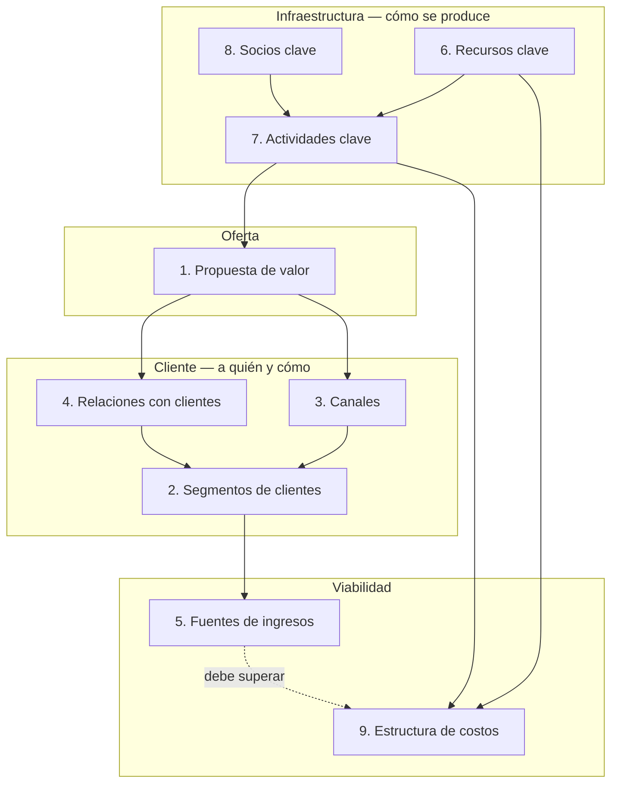
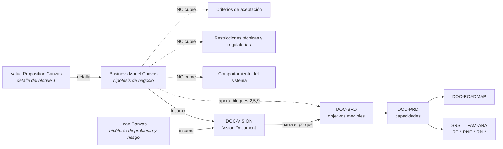

# Canvas de modelo de negocio y de producto — `MET-CANVAS`

## Resumen ejecutivo

Un canvas es una plantilla de una página que obliga a declarar las hipótesis de negocio de un producto en bloques fijos, de modo que las inconsistencias entre ellos se vuelvan visibles de un vistazo. El **Business Model Canvas** de Alexander Osterwalder e Yves Pigneur, publicado en *Business Model Generation*, describe cómo una organización crea, entrega y captura valor; el **Lean Canvas** de Ash Maurya, en *Running Lean*, lo adapta a productos en fase de incertidumbre reemplazando cuatro bloques por otros orientados al problema y al riesgo.

Para esta guía el interés es documental y frontera adentro: el canvas ocupa, en la práctica de la mayoría de los equipos, el lugar donde estaría el BRD, y lo hace bien en la fase en que todo es hipótesis y mal en cuanto hay compromisos que sostener. Este documento fija qué reemplaza, qué precede y —lo más importante— **qué no cubre**, porque el hueco entre un canvas y un [SRS](../20-Analisis/SRS.md) es donde se pierden más proyectos que en cualquier otro tramo del cuerpo documental.

---

## Definición

### Qué es un canvas

Un instrumento de modelado visual con bloques predefinidos y relaciones implícitas entre ellos. Su valor no está en los bloques sino en tres propiedades que la forma impone: cabe en una página, lo que fuerza a priorizar; los bloques son obligatorios, lo que impide omitir la pregunta incómoda; y las inconsistencias se ven —un segmento de clientes que no aparece en ningún canal, una fuente de ingresos sin propuesta de valor que la sostenga—.

El Business Model Canvas modela una organización o una línea de negocio. El Lean Canvas modela una hipótesis de producto todavía no validada. Son documentos vivos: se revisan cuando la evidencia contradice una hipótesis, y su versión anterior se conserva para poder decir qué se creía antes y qué cambió.

### Qué problema resuelve

El plan de negocio de cuarenta páginas tenía dos defectos combinados: nadie lo leía completo, y su extensión disfrazaba de análisis lo que eran suposiciones sin evidencia. El canvas ataca ambos. Al forzar la síntesis, deja las suposiciones desnudas: «segmento de clientes: empresas medianas con más de diez salas de reunión» es una hipótesis falsable escrita en once palabras, y se puede verificar en una semana.

Para el trabajo documental, resuelve además un problema de secuencia. En `ESC-1` la tentación es empezar por el SRS porque parece trabajo técnico. Un canvas completado en dos horas por el equipo y el interlocutor de negocio produce, con costo casi nulo, el material que el [Vision Document](../10-Vision/) y el BRD necesitan, y suele revelar que el producto que se iba a construir no tiene modelo de ingresos.

### Qué NO es

**No es un documento de requisitos.** Ningún bloque contiene comportamiento verificable del sistema. «Propuesta de valor: reservar una sala en menos de treinta segundos» no dice qué pasa ante conflicto, qué significa una reserva, quién puede cancelar ni cómo se comporta el sistema si dos personas confirman a la vez. Confundir el canvas con especificación produce equipos que construyen desde adjetivos.

**No es un plan.** No tiene fechas, secuencia ni hitos. El [Roadmap](../10-Vision/) es otra cosa y sigue haciendo falta.

**No es un análisis de mercado.** Declara hipótesis sobre el mercado; no las valida. La validación es trabajo aparte, y el canvas es útil precisamente porque hace explícito qué hay que validar.

**No sustituye al Vision Document.** El canvas dice qué modelo de negocio se propone; la visión dice por qué vale la pena y hacia dónde va el producto en tres años. Un canvas no narra, y hay decisiones que necesitan narración.

**No es un artefacto ágil.** Ni el Manifiesto ni la Scrum Guide ni Kanban lo mencionan. Entra en esta serie porque en la práctica es la herramienta con la que los equipos ágiles suplen la documentación de visión, y conviene decir con precisión hasta dónde llega esa sustitución.

### Con qué se lo confunde

Con el **Lean Canvas**, que es un canvas distinto con propósito distinto —la comparación está más abajo—. Con un **ejercicio de taller**: hay organizaciones donde el canvas se llena en una sesión facilitada, se fotografía y no se vuelve a mirar, lo cual lo convierte en actividad de equipo y no en documento. Con la **propuesta de valor**, que es uno de sus nueve bloques y tiene su propio canvas dedicado.

Y, con más frecuencia de lo que parece, con el **BRD**. La diferencia operativa: el BRD compromete objetivos de negocio medibles con dueño y fecha; el canvas declara hipótesis. Firmar un canvas como si fuera un BRD es comprometerse con lo que todavía no se verificó.

---

## Business Model Canvas — los nueve bloques

Osterwalder y Pigneur organizan el modelo en nueve bloques agrupados en cuatro áreas: la oferta al centro, el cliente a la derecha, la infraestructura a la izquierda y la viabilidad financiera abajo.



| # | Bloque | Pregunta que responde | Error típico al completarlo |
|---|--------|----------------------|------------------------------|
| 1 | Propuesta de valor | ¿Qué problema resolvemos y qué valor entregamos? | Describir la funcionalidad en lugar del valor |
| 2 | Segmentos de clientes | ¿Para quién creamos valor? ¿Quiénes son los más importantes? | «Todas las empresas»: un segmento que no excluye a nadie no es un segmento |
| 3 | Canales | ¿Cómo llegamos a cada segmento y cómo entregamos la propuesta? | Confundir canal de venta con canal de entrega |
| 4 | Relaciones con clientes | ¿Qué tipo de relación espera cada segmento? | Omitir el costo de sostener la relación |
| 5 | Fuentes de ingresos | ¿Por qué valor pagan realmente y cómo? | Confundir el que usa con el que paga |
| 6 | Recursos clave | ¿Qué activos exige el modelo? | Enumerar todo en lugar de lo que sin ello el modelo no funciona |
| 7 | Actividades clave | ¿Qué debemos hacer bien sí o sí? | Listar las actividades del día en lugar de las críticas |
| 8 | Socios clave | ¿Quién hace lo que no hacemos nosotros, y por qué? | Incluir proveedores intercambiables |
| 9 | Estructura de costos | ¿Cuáles son los costos más importantes, y son fijos o variables? | Omitir el costo de operación del propio software |

El bloque 5 es el que produce las conversaciones más incómodas y más útiles en software de gestión interna. Cuando el sistema de reserva de salas se construye para una organización que lo usa internamente, no hay ingreso: hay costo evitado, y declararlo obliga a cuantificarlo. Un canvas que deja el bloque de ingresos con «uso interno» sin más está renunciando a la única justificación económica del proyecto.

### Cómo se relaciona con la familia de visión



Lo que el canvas **reemplaza**: la sección de contexto de negocio y oportunidad del BRD, el análisis de stakeholders en su versión inicial y buena parte del material de posicionamiento del Vision Document. En un equipo pequeño con producto interno, un canvas más dos páginas de visión narrada cubren razonablemente lo que un BRD formal cubriría, y a una fracción del costo.

Lo que el canvas **precede**: todo lo demás. Es el primer artefacto, anterior incluso a la visión, porque la visión narra un modelo que el canvas hizo explícito.

Lo que el canvas **no cubre**, y hay que producir aparte: los objetivos de negocio medibles con dueño y fecha —lo propio del BRD—; las restricciones, que suelen ser lo que más condiciona la arquitectura —«debe correr sobre el SQL Server que ya tenemos» no tiene bloque—; el marco regulatorio; los criterios de éxito verificables; y absolutamente todo el comportamiento del sistema.

Ese último hueco es el que produce el fracaso característico: un equipo con un canvas excelente empieza a escribir código, y descubre en el sprint tres que no hay ninguna definición de qué es una reserva, si se pueden solapar, quién cancela, qué pasa con las recurrentes. El canvas nunca prometió responder eso. El error fue creer que sí.

---

## Lean Canvas — variante para incertidumbre alta

Ash Maurya adaptó el Business Model Canvas en *Running Lean* reemplazando cuatro bloques por otros que considera más críticos en fase temprana. El criterio de reemplazo es el riesgo: en un producto nuevo, lo que mata no es la falta de socios sino no tener un problema real.

| Bloque BMC reemplazado | Bloque Lean Canvas | Por qué el cambio |
|------------------------|--------------------|-------------------|
| Socios clave | **Problema** (top 3) + alternativas existentes | Sin problema real, el resto es irrelevante |
| Actividades clave | **Solución** (top 3 funcionalidades) | Fuerza a limitar la solución a tres cosas |
| Recursos clave | **Métricas clave** | Qué número dice si el modelo funciona |
| Relaciones con clientes | **Ventaja injusta** | Qué no se puede copiar fácilmente |

Se conservan segmentos de clientes, propuesta de valor única, canales, fuentes de ingresos y estructura de costos.

El bloque de **alternativas existentes** es el de mayor rendimiento documental y el que más se omite. Obliga a escribir qué hace hoy la gente sin el producto, y la respuesta suele ser una planilla compartida, un correo al administrador o un calendario. Eso es la línea base contra la cual se mide el valor, y es también información de análisis: los flujos actuales revelan reglas de negocio que nadie iba a mencionar.

El bloque de **métricas clave** es el punto donde el Lean Canvas toca directamente el trabajo de `ACT-01`, porque una métrica clave bien definida se convierte casi sin traducción en criterio de éxito del PRD.

### Cuál usar

| Situación | Canvas apropiado | Razón |
|-----------|-----------------|-------|
| Producto nuevo, cliente y problema inciertos | Lean Canvas | El riesgo está en el problema |
| Línea de negocio nueva en organización establecida | Business Model Canvas | Socios, recursos y actividades son restricciones reales |
| Software de gestión interna (`ESC-1` corporativo) | Lean Canvas adaptado | Alternativas existentes y métricas clave son lo que importa; no hay ingreso |
| Evaluación de un competidor (`ESC-4`) | Business Model Canvas | Se infiere el modelo completo desde material público |
| Justificación de una migración (`ESC-2`) | Ninguno de los dos | El modelo de negocio no cambia; lo que hace falta es un BRD de migración |

La última fila merece énfasis porque el error se comete con frecuencia: llenar un canvas para justificar una migración técnica produce un documento donde todos los bloques dicen lo mismo que antes de migrar, lo cual es correcto y completamente inútil. Una migración se justifica con costo de mantenimiento, riesgo de obsolescencia y capacidad de evolución, y ninguno de los tres tiene bloque en un canvas.

---

## Value Proposition Canvas

Osterwalder desarrolló un canvas dedicado al encaje entre el bloque 1 y el bloque 2 del Business Model Canvas, con dos mitades:

**Perfil del cliente** — trabajos que intenta hacer (*jobs*), frustraciones (*pains*) y beneficios esperados (*gains*).
**Mapa de valor** — productos y servicios, aliviadores de frustraciones (*pain relievers*) y creadores de beneficios (*gain creators*).

El encaje se logra cuando cada aliviador se corresponde con una frustración declarada y cada creador con un beneficio esperado. Documentalmente su aporte es concreto: **las frustraciones del perfil de cliente son requisitos no funcionales encubiertos**. «Pierdo diez minutos buscando una sala libre» se traduce a un `RNF-` sobre tiempo de respuesta del listado de disponibilidad; «nunca sé si la reserva quedó confirmada» se traduce a requisitos de retroalimentación de la interfaz que en `CTX-1` son exactamente los estados de pantalla que el marco exige documentar.

Es la herramienta que mejor rendimiento tiene cuando el equipo ya sabe para quién construye y discute qué construir. No sustituye al PRD: no contiene capacidades ni criterios de éxito.

Otros canvas de uso extendido tienen menor rendimiento documental y se mencionan por completitud. El **Product Vision Board** de Roman Pichler se solapa casi por entero con el Vision Document y conviene elegir uno de los dos. El **Team Canvas** documenta acuerdos de equipo, que es material de política interna y no de producto. El **Event Storming** de Alberto Brandolini no es un canvas pero ocupa un lugar parecido en la secuencia y produce, a diferencia de estos, material directamente aprovechable por [`FAM-ANA`](../20-Analisis/): eventos de dominio, comandos y agregados.

---

## Aplicación por escenario

### `ESC-1` — Desarrollo de software nuevo

Es el escenario natural y el único donde el canvas es prescriptivo. Se completa antes que cualquier otro documento, en una o dos sesiones, con el interlocutor de negocio presente. Su función es forzar la conversación que de otro modo no ocurre: para quién, contra qué alternativa, con qué métrica sabremos si sirvió.

La regla práctica de secuencia: el canvas se completa, se identifican las tres hipótesis más riesgosas, se define cómo validarlas, y solo entonces se escribe el Vision Document. Escribir la visión antes de tener el canvas produce narrativa sobre un modelo que nadie explicitó.

El riesgo específico de `ESC-1` es el que ya se nombró: creer que el canvas cubre el hueco hasta el SRS. No lo cubre. Entre el canvas y el primer elemento de backlog implementable hacen falta, como mínimo, el glosario del dominio y las reglas de negocio centrales, y ninguno de los dos sale de ningún bloque.

Variación por contexto. En `CTX-1` el bloque de canales y el perfil de cliente del Value Proposition Canvas alimentan directamente el trabajo de `ACT-08`. En `CTX-2`, donde el usuario es otro programa, el canvas se distorsiona: los segmentos de clientes son equipos integradores, los canales son la documentación de API y el portal de desarrolladores, y la propuesta de valor se mide en tiempo hasta la primera integración exitosa. Es un ejercicio útil y hay que reinterpretar los bloques, no llenarlos literalmente.

### `ESC-2` — Migración a otro lenguaje o plataforma

Aplicación marginal, y conviene decirlo antes de que alguien lo intente. El modelo de negocio no cambia al migrar: los mismos clientes, la misma propuesta, los mismos ingresos. Llenar un canvas produce un documento idéntico al que habría producido antes de la migración.

Hay un uso legítimo y acotado: el canvas del **sistema origen**, reconstruido, sirve para detectar qué partes del modelo de negocio el sistema actual sostiene y qué partes quedaron sin soporte. Si el bloque de segmentos incluye un tipo de usuario que el sistema viejo nunca atendió bien, la migración es la oportunidad de resolverlo, y esa decisión es de alcance, no técnica.

Lo que sí hace falta y no es un canvas: un BRD de migración con el costo del statu quo, el riesgo de obsolescencia de la plataforma origen, el criterio de paridad y el presupuesto. Nada de eso tiene bloque.

### `ESC-3` — Evaluación de software existente con acceso al código

El canvas se **reconstruye**, y el ejercicio es más revelador de lo que parece. Con acceso al código, a la base de datos y a la gente, se puede inferir qué modelo de negocio el sistema soporta realmente: qué segmentos tienen funcionalidad dedicada, qué canales están implementados, si hay algún mecanismo de cobro o de medición de uso.

El hallazgo característico es la **divergencia entre el canvas declarado y el canvas implementado**. La organización dice atender a tres segmentos; el código tiene lógica diferenciada para uno solo y los otros dos usan el camino genérico. Eso es un hallazgo de negocio obtenido por análisis técnico, y suele tener más impacto en una evaluación que cualquier observación sobre la arquitectura.

Cada afirmación del canvas reconstruido se marca con su evidencia y su `confidence`, según lo que las [Convenciones](../00-Marco-de-Referencia/Convenciones.md#frontmatter-obligatorio) exigen.

### `ESC-4` — Evaluación de un producto solo desde afuera

Es, junto a `ESC-1`, el escenario de mayor rendimiento, y por una razón que el marco ya anticipa: el modelo de negocio es de lo poco que un producto publica sobre sí mismo. La página de precios revela fuentes de ingresos y segmentación; la de integraciones revela socios clave; las ofertas de empleo revelan recursos y actividades clave con una precisión que sorprende; el material de soporte revela el tipo de relación con el cliente.

Confianza alcanzable por bloque, siguiendo la tabla del marco para este escenario:

| Bloque | Confianza | Fuente observable |
|--------|-----------|-------------------|
| Fuentes de ingresos | Alta | Página de precios y condiciones |
| Segmentos de clientes | Alta | Casos de éxito, planes, materiales sectoriales |
| Propuesta de valor | Alta | Uso directo del producto y mensaje público |
| Canales | Media-alta | Presencia comercial, autoservicio o venta directa |
| Socios clave | Media | Catálogo de integraciones, sellos de partner |
| Actividades y recursos clave | Media-baja | Ofertas de empleo, notas de versión, blog técnico |
| Estructura de costos | Baja | Inferencia desde tamaño del equipo y modelo de despliegue |

Las dos últimas filas son hipótesis y se marcan como tales. La comparación entre el canvas del producto evaluado y el propio es uno de los entregables de mayor valor de un análisis de competencia, porque expone en una página dónde los modelos compiten y dónde no se tocan.

---

## Ejemplos concretos

### Business Model Canvas completo — sistema de reserva de salas

Producto interno de una consultora de 320 personas distribuida en cuatro oficinas, con 47 salas de reunión. Los datos son sintéticos y realistas. Escenario `ESC-1`, contexto `CTX-3`, implementación prevista en Blazor Server sobre ASP.NET Core, con cliente MAUI para el personal de instalaciones.

```markdown
# Business Model Canvas — Sistema de Reserva de Salas — v3 — 2026-03-10
Autor: ACT-01 con Dirección de Operaciones · Revisión: trimestral
Estado de las hipótesis: H1 validada, H2 en validación, H3 sin validar

## 1. PROPUESTA DE VALOR
- Para empleados: reservar una sala adecuada en menos de 30 segundos, con
  certeza de que estará disponible. Elimina la disputa por salas ocupadas
  sin reserva efectiva.
- Para Operaciones: ocupación real medida por sala y por franja, base para
  decidir el rediseño de espacios y la renovación de contratos de alquiler.
- Para Recepción: fin de la gestión manual de reservas telefónicas
  (hoy ~35 llamadas diarias).

## 2. SEGMENTOS DE CLIENTES
- Empleados que reservan (≈280 personas, ≈900 reservas/mes) — segmento principal
- Asistentes de dirección (12 personas, reservan para terceros, 40 % del volumen,
  requieren reservas recurrentes y prioridad) — segmento crítico por volumen
- Personal de instalaciones (6 personas, uso móvil, gestionan disponibilidad real,
  bloqueos por mantenimiento) — segmento con necesidades opuestas al principal
- Dirección de Operaciones (3 personas, consumen informes) — no reserva

NO es segmento: clientes externos. Las salas no se alquilan a terceros (ver H3).

## 3. CANALES
- Entrega: aplicación web interna (Blazor Server), autenticación por Entra ID
- Entrega móvil: cliente MAUI para instalaciones (trabajan sin escritorio)
- Integración: sincronización con Microsoft 365 — la reserva genera evento
  de calendario. Canal crítico: sin esto la adopción cae (H1, validada en piloto)
- Difusión: intranet, capacitación de 20 min a asistentes de dirección
- Soporte: mesa de ayuda interna existente

## 4. RELACIONES CON CLIENTES
- Autoservicio total para empleados: sin capacitación, sin manual obligatorio.
  Implica que la interfaz debe ser autoexplicativa (restricción de diseño real)
- Acompañamiento inicial para asistentes de dirección (reservas recurrentes
  y delegadas son el caso complejo)
- Canal directo con Operaciones para requerimientos de informes

## 5. FUENTES DE INGRESOS
Uso interno: no hay ingreso. La justificación económica es costo evitado y
costo de oportunidad, cuantificados:
- Recepción: 35 llamadas/día × 4 min × 250 días ≈ 583 h/año de gestión manual
- Conflictos por salas: ≈15/mes, con ≈20 min de demora de reunión c/u,
  ≈8 personas promedio → ≈480 h/año de tiempo improductivo
- Decisión de alquiler: el contrato de la oficina Norte se renueva en 2027;
  sin datos de ocupación real, la decisión sobre 6 salas se toma a ciegas
  (H2: la ocupación real es menor a la percibida)

## 6. RECURSOS CLAVE
- Directorio corporativo (Entra ID) como fuente de identidad y jerarquía
- Inventario de salas con atributos reales: capacidad, equipamiento,
  divisibilidad en módulos, accesibilidad. HOY NO EXISTE de forma confiable:
  es prerrequisito, y es trabajo de Operaciones, no del equipo de software
- Equipo de desarrollo: 5 personas, dedicación parcial
- Licencias Microsoft 365 (ya disponibles)

## 7. ACTIVIDADES CLAVE
- Mantener sincronía con calendarios corporativos (fuente de casi todo el
  soporte previsto)
- Gestión de disponibilidad real: bloqueos por mantenimiento y por eventos
- Producción de informes de ocupación para la decisión de 2027
- Curaduría del inventario de salas (actividad continua de Operaciones)

## 8. SOCIOS CLAVE
- Área de TI corporativa: provee identidad, red y despliegue. Restricción:
  el despliegue debe hacerse sobre la infraestructura existente, no en nube
  pública (restricción real, no preferencia → va al SAD como driver)
- Proveedor de mantenimiento de salas: entrega ventanas de bloqueo
- Microsoft 365 como plataforma: dependencia crítica y punto único de falla
  del canal de integración

## 9. ESTRUCTURA DE COSTOS
- Desarrollo inicial: ≈5 personas × 4 meses (dedicación parcial)
- Operación: sobre infraestructura existente, costo marginal en cómputo;
  el costo real es el tiempo de TI para mantenimiento y actualizaciones
- Curaduría del inventario: ≈4 h/mes de Operaciones, permanente. Es el costo
  que los proyectos de este tipo omiten y el que hace que fracasen a los 8 meses
- Soporte: absorbido por la mesa de ayuda existente, con supuesto de
  ≤20 tickets/mes (si se supera, el supuesto de autoservicio era falso)

## Hipótesis a validar
| ID | Hipótesis | Cómo se valida | Estado |
|----|-----------|----------------|--------|
| H1 | Sin sincronía con calendario, la adopción no supera el 30 % | Piloto en oficina Centro, 6 semanas | Validada: 24 % sin sincronía, 71 % con |
| H2 | La ocupación real es <60 % de la percibida | Medición tras 3 meses de uso | En validación |
| H3 | No hay demanda de alquiler externo de salas | Entrevista con Comercial | Sin validar; si es falsa, cambia el modelo |
```

**Qué produjo este canvas para el resto del cuerpo documental.** Tres restricciones que van directo al SAD como *drivers* de arquitectura: despliegue on-premise, identidad federada con Entra ID, dependencia de Microsoft 365 con su punto único de falla. Un prerrequisito que no es de software y que habría hundido el proyecto si se descubría en el sprint cuatro: el inventario de salas no existe de forma confiable. Un segmento —instalaciones, con uso móvil y necesidades opuestas al segmento principal— que justifica el cliente MAUI y que un análisis funcional podría haber omitido. Y una métrica de éxito cuantificada que se convierte, casi sin traducción, en criterio de éxito del PRD.

**Qué no produjo, y hay que escribir aparte.** Qué es una reserva. Si dos reservas contiguas se superponen. Quién puede cancelar la reserva de otro. Qué pasa con las recurrentes cuando una sala se bloquea por mantenimiento. Cómo se comporta el sistema si dos asistentes confirman la misma sala en la misma franja. Cada una de esas preguntas es una regla de negocio, y las cinco viven en el [SRS](../20-Analisis/SRS.md). El canvas señala que el problema es real; no dice cómo se comporta la solución.

### Lean Canvas del mismo producto, en fase temprana

Si el mismo producto se hubiera planteado como iniciativa nueva sin certeza sobre el problema, el Lean Canvas habría sido el instrumento correcto. Los cuatro bloques que difieren:

```markdown
## PROBLEMA (top 3)
1. Los empleados no encuentran sala libre y ocupan salas reservadas por otros
2. Operaciones no sabe la ocupación real y no puede decidir sobre los alquileres
3. Recepción dedica ~2,5 h diarias a gestionar reservas telefónicamente

## ALTERNATIVAS EXISTENTES
- Calendarios de recurso de Outlook: existen y se usan en la oficina Centro,
  pero no modelan capacidad ni equipamiento y no impiden el doble uso físico
- Planilla compartida en la oficina Norte, mantenida por una asistente
- Reserva telefónica a recepción (el 60 % del volumen actual)
  → Estas alternativas contienen reglas de negocio que nadie escribió:
    la planilla de Norte tiene una columna "requiere autorización" que
    resultó ser la regla de aprobación de auditorios. Relevarlas es análisis.

## MÉTRICAS CLAVE
- Reservas efectivas / reservas totales (mide si la reserva refleja el uso real)
- Conflictos reportados por mes (línea base: ≈15)
- Tiempo desde apertura hasta confirmación (objetivo: <30 s, p95)
- Llamadas a recepción por reserva (línea base: 35/día)

## VENTAJA INJUSTA
Acceso al dato de ocupación real y a la identidad corporativa. Ninguna
herramienta externa puede cruzar reserva, asistencia efectiva y jerarquía
organizacional sin integrarse al directorio interno.
```

El bloque de alternativas existentes es, en este caso, el de mayor rendimiento: la columna de la planilla de la oficina Norte es una regla de negocio que ningún taller de requisitos habría descubierto, y que aparece por preguntar qué hace hoy la gente sin el producto.

---

## Preguntas guía

- ¿Cada bloque contiene una afirmación falsable, o hay bloques llenos de generalidades?
- ¿Qué hipótesis de este canvas, si resultara falsa, invalidaría el proyecto entero? ¿Cómo se valida y cuándo?
- ¿El segmento de clientes excluye a alguien? Un segmento que incluye a todos no es un segmento.
- ¿Quién paga —o qué costo se evita— y está cuantificado?
- ¿Hay algún recurso clave que todavía no existe y que no es trabajo del equipo de software?
- ¿Qué restricción del canvas va a condicionar la arquitectura, y está registrada como *driver* en el [SAD](../30-Arquitectura/)?
- ¿Qué preguntas sobre el comportamiento del sistema quedaron sin responder, y dónde se van a responder?
- ¿Este canvas se revisó desde que se escribió, o quedó fijado en la versión del taller inicial?

---

## Criterios de calidad y antipatrones

### Criterios de calidad

**Cada bloque es falsable.** «Segmento: empresas medianas con más de diez salas» se puede verificar; «segmento: organizaciones que valoran la eficiencia» no.

**Las hipótesis están identificadas y priorizadas por riesgo.** Un canvas sin una lista de qué hay que validar primero es una descripción, no un instrumento de trabajo.

**Está fechado y versionado.** Conservar las versiones anteriores permite responder qué se creía en marzo y qué cambió, que es la pregunta que una retrospectiva de producto necesita.

**Las restricciones migran a donde corresponde.** Lo que en el canvas es un socio clave con dependencia crítica, en el SAD es un riesgo de arquitectura con mitigación. Si esa migración no ocurre, el canvas fue un ejercicio.

**Distingue lo validado de lo supuesto.** Igual que cualquier documento de la guía: `origin` y `confidence` no son decorativos, y en un canvas el equivalente es el estado de cada hipótesis.

**Tiene dueño y periodicidad de revisión.** `ACT-01`, trimestral o ante evidencia contraria.

### Antipatrones

**Canvas de taller.** Se llena en una sesión, se fotografía y no se vuelve a abrir. Se detecta preguntando cuándo se revisó por última vez; si la respuesta coincide con la fecha de creación, el canvas es un recuerdo.

**El canvas como especificación.** Empezar a desarrollar con el canvas como único documento de entrada. Produce el descubrimiento tardío de que nadie definió el comportamiento del sistema, y ese descubrimiento llega cuando ya hay código que asumió una definición implícita.

**Bloques de relleno.** Completar los nueve bloques porque están, sin contenido real. «Recursos clave: el equipo» no aporta nada. Un bloque vacío con la anotación «no aplica y por qué» es mejor documentación que un bloque lleno de generalidades.

**Segmento único indiferenciado.** «Todos los empleados». En el ejemplo del sistema de reservas, esa simplificación habría ocultado que instalaciones necesita un cliente móvil con necesidades opuestas, y ese hallazgo cambia la arquitectura.

**Confundir usuario con pagador.** En software interno el usuario es el empleado y el pagador es la dirección que aprueba el presupuesto. El bloque de propuesta de valor debe hablarles a los dos, con argumentos distintos.

**Canvas para justificar una migración.** Ya tratado: produce un documento correcto e inútil.

**Un canvas por funcionalidad.** El canvas modela un negocio o un producto, no una funcionalidad. Un canvas del módulo de informes es un abuso de la herramienta.

**Omitir el costo de operación permanente.** La estructura de costos que solo incluye el desarrollo. En el ejemplo, las cuatro horas mensuales de curaduría del inventario son el costo que hace fracasar a estos proyectos en el mes ocho, cuando nadie lo asumió formalmente.

---

## Anexo — Canvas en blanco con preguntas por bloque

Se completa con el interlocutor de negocio presente, en no más de dos sesiones. Cada bloque incluye la pregunta que lo guía y la trampa que hay que evitar. Los bloques que no apliquen se marcan como «no aplica» con el motivo, nunca se dejan vacíos.

```markdown
# Business Model Canvas — <producto> — v__ — AAAA-MM-DD
Autor: ACT-01 <nombre> · Participantes: · Revisión: <periodicidad>

## 1. PROPUESTA DE VALOR
? ¿Qué problema concreto resolvemos, y para quién es un problema hoy?
? ¿Qué hace la gente hoy sin nosotros, y por qué eso no alcanza?
! Trampa: describir funcionalidades. El valor no es "permite reservar salas";
  es "elimina la disputa por salas y da el dato para decidir alquileres".

## 2. SEGMENTOS DE CLIENTES
? ¿Para quién creamos valor? ¿Cuál es el más importante y por qué?
? ¿A quién estamos dejando afuera deliberadamente?
? ¿Hay algún segmento con necesidades opuestas al principal?
! Trampa: un segmento que no excluye a nadie no es un segmento.

## 3. CANALES
? ¿Cómo se entera cada segmento? ¿Cómo recibe el valor? ¿Cómo obtiene soporte?
? ¿Qué canal es crítico —sin él la adopción no ocurre—?
! Trampa: confundir el canal de difusión con el de entrega.

## 4. RELACIONES CON CLIENTES
? ¿Qué relación espera cada segmento: autoservicio, acompañamiento, comunidad?
? ¿Cuánto cuesta sostenerla, y quién la sostiene?
! Trampa: prometer autoservicio sin asumir que eso es una restricción de diseño.

## 5. FUENTES DE INGRESOS
? ¿Por qué valor paga realmente el cliente, y cómo?
? Si es uso interno: ¿qué costo se evita, cuantificado con qué dato?
? ¿Quién usa y quién paga son la misma persona?
! Trampa: dejar "uso interno" sin cuantificar. Es renunciar a la justificación.

## 6. RECURSOS CLAVE
? ¿Qué activos exige el modelo, sin los cuales no funciona?
? ¿Alguno NO existe todavía? ¿De quién es la responsabilidad de crearlo?
! Trampa: enumerar todo. Recurso clave es aquel cuya ausencia detiene el modelo.

## 7. ACTIVIDADES CLAVE
? ¿Qué tenemos que hacer bien sí o sí?
? ¿Cuál de estas actividades es permanente y no termina con el proyecto?
! Trampa: listar el trabajo del día en vez de lo crítico.

## 8. SOCIOS CLAVE
? ¿Quién hace lo que nosotros no hacemos? ¿Qué pasa si deja de hacerlo?
? ¿Alguno es punto único de falla?
! Trampa: incluir proveedores intercambiables. Socio clave es el que no se sustituye.

## 9. ESTRUCTURA DE COSTOS
? ¿Cuáles son los costos más importantes? ¿Fijos o variables?
? ¿Cuál es el costo de OPERAR esto durante los próximos tres años?
! Trampa: contar solo el desarrollo y omitir la curaduría permanente de datos.

---
## Hipótesis a validar  (obligatorio: sin esto, el canvas es una descripción)
| ID | Hipótesis | Bloque | Si es falsa... | Cómo se valida | Cuándo | Estado |
|----|-----------|--------|----------------|----------------|--------|--------|

## Restricciones detectadas que van a otros documentos
| Restricción | Origen (bloque) | Destino | Estado |
|-------------|-----------------|---------|--------|
| ej. despliegue on-premise | 8. Socios clave (TI) | SAD como driver | pendiente |

## Preguntas de comportamiento que este canvas NO responde
(se listan explícitamente y se derivan al SRS; es la sección que evita
 que alguien tome el canvas por una especificación)
- ¿Qué es exactamente una <entidad principal>?
- ¿Qué pasa cuando dos usuarios hacen lo mismo a la vez?
- ¿Quién puede modificar o cancelar lo que creó otro?
- ...
```

Las tres tablas del final son lo que separa un canvas útil de un póster. La de hipótesis convierte el documento en un plan de validación; la de restricciones garantiza que lo aprendido llegue a la arquitectura; la de preguntas no respondidas es la defensa explícita contra el antipatrón más costoso de esta herramienta, que es confundirla con una especificación.

---

## Continuación

Cómo se articula esta herramienta con la elección de método de trabajo, y en qué escenarios conviene invertir en documentación de visión formal en lugar de un canvas: [`MET-COMPARATIVA`](Comparativa-y-Criterios.md). Los artefactos que continúan la secuencia —Vision Document, BRD, PRD y Roadmap— están desarrollados en [`FAM-VIS`](../10-Vision/).
