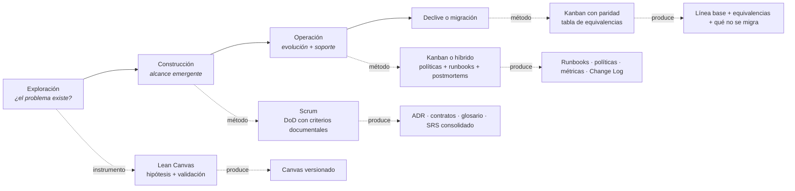
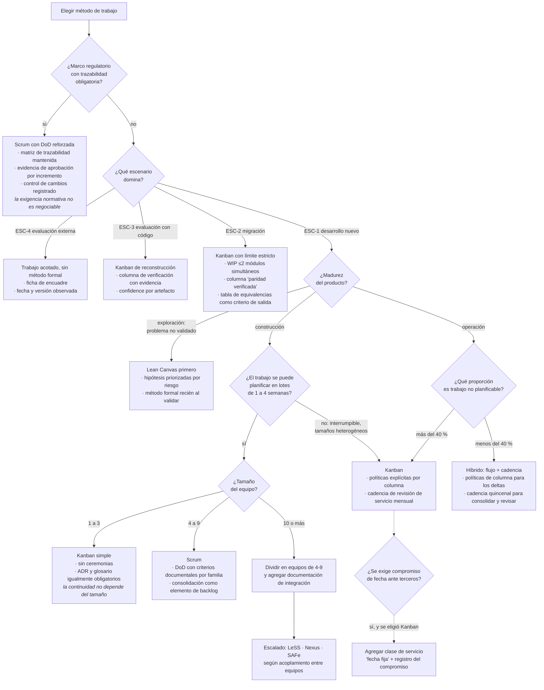

# Comparativa de métodos y criterios de elección — `MET-COMPARATIVA`

## Resumen ejecutivo

La elección de método casi nunca se toma: se hereda. Un equipo adopta Scrum porque la organización usa Scrum, y después descubre que su trabajo —mantenimiento correctivo con prioridades cambiantes intradía— rompe el Sprint Goal cada dos semanas. Este documento propone tomar la decisión con criterio explícito, y evaluarla por su consecuencia documental además de por su ajuste operativo.

Seis variables deciden: escenario, contexto, tamaño de equipo, madurez del producto, previsibilidad exigida y marco regulatorio. La última tiene poder de veto sobre las otras cinco: en un dominio con exigencia normativa de trazabilidad, la discusión sobre Scrum o Kanban es secundaria frente a la obligación de demostrar que cada requisito tiene verificación registrada. Las otras cinco admiten combinaciones, y la respuesta correcta con frecuencia es híbrida.

---

## Definición

### Qué es una decisión de método

La elección de cómo se organiza el trabajo: en lotes de duración fija con compromiso de alcance, en flujo continuo sin compromiso, o en alguna combinación. La decisión determina cuándo se inspecciona el producto, cuándo se replanifica, qué se compromete ante el negocio y —lo que interesa acá— dónde y cómo se financia el trabajo documental.

Es una decisión reversible y de bajo costo de cambio, a diferencia de las decisiones de arquitectura, y por eso conviene tomarla mal antes que no tomarla: un equipo que empieza con Scrum y a los tres meses migra a Kanban perdió poco; un equipo que nunca decidió tiene un proceso que nadie puede describir ni mejorar.

### Qué problema resuelve elegir explícitamente

Evita la disonancia entre el método y la naturaleza del trabajo, que se manifiesta con síntomas reconocibles: Sprint Goals que se abandonan sistemáticamente, ceremonias que el equipo percibe como impuesto, límites de WIP que se violan a diario, o —el síntoma documental— políticas escritas que nadie aplica porque no corresponden a cómo se trabaja realmente.

### Qué NO es

No es una decisión de una vez y para siempre. Un producto en `ESC-1` con equipo de seis personas y un producto en operación con equipo de tres tienen respuestas distintas, y el mismo producto atraviesa ambos estados.

No es una decisión sobre calidad documental. Ningún método garantiza documentación: garantizan un **lugar** donde exigirla —la DoD en Scrum, las políticas de columna en Kanban—. Usar ese lugar es una decisión aparte.

---

## Tabla comparativa

| Dimensión | Scrum | Kanban | Híbrido (Scrumban) | Canvas (no es método) |
|-----------|-------|--------|--------------------|------------------------|
| Unidad de trabajo | Sprint de ≤1 mes | Elemento individual | Cadencia opcional sobre flujo | — |
| Compromiso | Sprint Goal | Ninguno; SLA por clase de servicio | Objetivo por cadencia, sin compromiso rígido | Hipótesis a validar |
| Roles definidos | 3 responsabilidades | Ninguno | Los que ya existen | — |
| Punto de exigencia documental | Definition of Done (único, al final) | Criterio de salida de cada columna (distribuido) | Ambos | Bloques obligatorios |
| Ritmo de revisión documental | Fin de sprint | Cadencia de revisión de servicio | Cadencia explícita | Ante evidencia contraria |
| Registro histórico natural | Sprint Goals + Release Notes | Change Log + métricas de flujo | Ambos | Versiones del canvas |
| Riesgo documental característico | Deltas sin consolidación | WIP oculto: terminado sin documentar | Políticas duplicadas y contradictorias | Confundirlo con especificación |
| Métricas propias | Throughput por sprint | Tiempo de ciclo, eficiencia de flujo, DORA | Ambas | Hipótesis validadas |
| Encaja bien con | Producto nuevo, alcance descubierto | Mantenimiento, operación, flujo heterogéneo | Producto en producción con evolución y soporte | Fase de exploración |
| Encaja mal con | Trabajo interrumpible, tamaños muy heterogéneos | Necesidad de compromiso de alcance ante terceros | Equipos sin disciplina previa | Justificar migraciones |
| Fuente | Scrum Guide 2020, Schwaber y Sutherland | David J. Anderson | Sin fuente canónica única | Osterwalder y Pigneur; Maurya |

La fila del punto de exigencia documental es la que más consecuencias tiene y la menos discutida al elegir. Scrum concentra: un solo lugar donde escribir todo lo exigido, fácil de definir y con el defecto de evaluarse en un único momento, lo cual empuja a exigir artefactos —el runbook— antes de que exista información para escribirlos. Kanban distribuye: cada exigencia se ubica donde la información ya existe, con el costo de que hay que diseñar el flujo con cuidado y de que nadie ve el conjunto de una sola vez.

---

## Las seis variables de decisión

### 1. Escenario

| Escenario | Método de mejor ajuste | Fundamento documental |
|-----------|------------------------|------------------------|
| [`ESC-1`](../00-Marco-de-Referencia/Escenarios.md#esc-1--desarrollo-de-software-nuevo) Desarrollo nuevo | Scrum, o híbrido con cadencia | La cadencia provee los momentos de inspección que un producto emergente necesita, y el Sprint Goal da el registro narrativo de la evolución |
| [`ESC-2`](../00-Marco-de-Referencia/Escenarios.md#esc-2--migración-a-otro-lenguaje-o-plataforma) Migración | Kanban con límites estrictos | El límite de WIP sobre módulos en migración simultánea es el control de riesgo principal; el estado «paridad verificada» no encaja en un sprint |
| [`ESC-3`](../00-Marco-de-Referencia/Escenarios.md#esc-3--evaluación-de-software-existente-con-acceso-al-código) Evaluación con código | Kanban | Flujo de artefactos a reconstruir con estados claros; el límite de WIP evita abrir doce frentes sin cerrar ninguno |
| [`ESC-4`](../00-Marco-de-Referencia/Escenarios.md#esc-4--evaluación-de-un-producto-solo-desde-afuera) Evaluación externa | Ninguno relevante | Trabajo acotado con entregable único; el método es irrelevante a esa escala |

`ESC-2` merece detalle porque la elección se hace mal con frecuencia. Una migración parece encajar en sprints —hay lotes de módulos, hay entregas parciales— y sin embargo tiene tres propiedades que rompen el marco: la condición de terminación es paridad, no valor descubierto; el backlog se deriva de un inventario en lugar de emerger; y el estado de verificación en producción paralela tiene duración impredecible. Kanban con un límite de dos módulos en migración simultánea y una columna de paridad verificada expone el riesgo real, que es cuántas cosas están a medio migrar.

### 2. Contexto

El contexto no decide el método, pero decide qué exigencia documental es innegociable en el punto de control que el método provea.

| Contexto | Exigencia innegociable | Dónde se ubica en Scrum | Dónde en Kanban |
|----------|------------------------|-------------------------|-----------------|
| [`CTX-1`](../00-Marco-de-Referencia/Contextos.md#ctx-1--web-y-cliente-interactivo) Web | Cuatro estados de pantalla; reconexión del circuito en Blazor Server | DoD, sección de interfaz | Salida de *En desarrollo* |
| [`CTX-2`](../00-Marco-de-Referencia/Contextos.md#ctx-2--backend-y-servicios) Backend | Contrato actualizado y validado en CI; garantías declaradas | DoD, sección de contratos | Salida de *En desarrollo* |
| [`CTX-3`](../00-Marco-de-Referencia/Contextos.md#ctx-3--fullstack) Fullstack | Traza vertical del elemento y glosario único | DoD, criterio de traza | Salida de *Analizado* y de *En revisión* |

### 3. Tamaño de equipo

| Tamaño | Método razonable | Consecuencia documental |
|--------|-----------------|-------------------------|
| 1 a 3 personas | Kanban simple o ninguno formal | El costo de coordinación no justifica ceremonias. La documentación no puede depender de la conversación: con dos personas, la rotación de una es la pérdida del 50 % del conocimiento |
| 4 a 9 personas | Scrum o Kanban, ambos viables | Rango en el que ambos funcionan; decide el tipo de trabajo, no el tamaño |
| 10 a 15 personas | Dividir, no escalar | Un equipo de trece con un único backlog produce coordinación permanente y documentación fragmentada |
| Múltiples equipos | Escalado con documentación de integración | Aparece un cuerpo documental nuevo: contratos entre equipos, propiedad de componentes, decisiones que atraviesan equipos |

El caso de uno a tres personas tiene una trampa específica. La intuición dice que un equipo pequeño necesita menos documentación, y es cierto para la coordinación y falso para la continuidad: cuanto más pequeño el equipo, mayor la proporción de conocimiento que se pierde con cada salida. Un equipo de dos personas necesita ADR y glosario tanto o más que uno de ocho.

### 4. Madurez del producto



La transición que más cuesta y peor se documenta es la de construcción a operación. El equipo mantiene Scrum porque funcionó durante el desarrollo, y de pronto la mitad del trabajo son incidentes que rompen el Sprint Goal. El síntoma documental es la aparición de una carpeta de runbooks escritos a las apuradas después del tercer incidente, sin política que los mantenga.

### 5. Previsibilidad exigida

Qué compromiso puede sostener el equipo ante quien pregunta «¿para cuándo?».

| Nivel exigido | Método | Base del pronóstico | Registro que lo sostiene |
|---------------|--------|--------------------|--------------------------|
| Fecha comprometida contractualmente | Ninguno de los dos por sí solo; híbrido con alcance acotado | Alcance fijo y buffer explícito | Registro de supuestos y de alcance excluido |
| Compromiso por iteración | Scrum | Sprint Goal y capacidad histórica | Sprint Goals cumplidos y abandonados |
| Pronóstico probabilístico | Kanban | Distribución histórica de tiempo de ciclo | Serie histórica de métricas de flujo |
| Sin compromiso, prioridad continua | Kanban | Clases de servicio y SLA por clase | Políticas de clase de servicio |

El pronóstico probabilístico de Kanban —«el 85 % de los elementos de este tipo se completa en menos de once días»— es más honesto y más útil que una estimación en puntos, y depende enteramente de tener serie histórica registrada. Es el argumento más fuerte para tratar las métricas de flujo como documentación con dueño y no como capturas de pantalla.

### 6. Marco regulatorio

Tiene poder de veto. En dominios con exigencia normativa —dispositivos médicos, aviación, financiero regulado, sector público con auditoría— hay obligaciones documentales que ningún método suspende:

- **Trazabilidad de requisitos** desde el enunciado hasta la evidencia de verificación. Un backlog de tickets cerrados no la provee: hay que producir y mantener la matriz.
- **Evidencia de revisión y aprobación**, con firma e identidad. Una aprobación conversada no existe para un auditor.
- **Control de cambios** con evaluación de impacto registrada antes de aplicar.
- **Validación registrada** de que lo entregado cumple lo especificado.

Esto no impide trabajar de forma ágil, y conviene ser preciso al respecto porque la afirmación contraria se usa como excusa en ambas direcciones. Lo que impide es que la trazabilidad sea opcional. La adaptación practicable es incorporar la exigencia normativa al punto de control del método —criterios de trazabilidad y aprobación dentro de la DoD, o como criterio de salida de la columna de revisión— y aceptar que el ciclo será más largo, con evidencia de que el alargamiento es exigencia externa y no burocracia interna.

La consecuencia sobre el método: en regulado, Scrum con DoD reforzada suele funcionar mejor que Kanban, porque el sprint provee un punto de corte natural donde consolidar evidencia de aprobación, y los auditores razonan mejor sobre lotes verificados que sobre flujo continuo.

---

## Árbol de decisión



El árbol tiene dos puertas antes de cualquier consideración de gusto: el marco regulatorio y el escenario. Cuando ambas dejan pasar, la variable decisiva es si el trabajo se puede planificar en lotes, y esa pregunta se responde mirando el histórico, no la intención: si en los últimos tres meses más del 40 % del trabajo llegó sin planificar, el trabajo no es planificable en lotes por más que el equipo quiera que lo sea.

---

## Escalado, en lo que cambia la documentación

Los tres marcos de escalado se mencionan por lo que agregan al cuerpo documental exigido, que es lo único que corresponde a esta guía.

**LeSS** (*Large-Scale Scrum*) minimiza la adición: un Product Owner, un Product Backlog, una Definition of Done común a todos los equipos. Su aporte documental es precisamente esa DoD compartida, que se vuelve el instrumento de coherencia entre equipos, y la exigencia de un glosario único —varios equipos sobre el mismo producto con vocabularios divergentes producen el problema de `CTX-3` multiplicado—.

**Nexus** agrega el Nexus Sprint Backlog y, documentalmente, el registro explícito de **dependencias entre equipos**. Es el artefacto que un equipo único no necesita y que se vuelve crítico con tres o más: qué componente depende de qué, quién lo provee y cuándo. Sin ese registro, la integración se descubre tarde.

**SAFe** es el que más documentación agrega, y también el más criticado por eso. Incorpora capa de portafolio, *Program Increment* con planificación conjunta, y un cuerpo documental propio: épicas de portafolio con caso de negocio, hojas de ruta por *release train*, arquitectura habilitadora registrada. Cuando la organización tiene decenas de equipos y una capa de inversión que decide entre iniciativas, esa documentación responde preguntas reales. Cuando se aplica a tres equipos, produce artefactos sin lector, y el síntoma es que las épicas de portafolio las escribe alguien que no las va a usar.

El criterio para todos: el escalado agrega documentación de **integración y de dependencia**, no de producto. Si al escalar aparecen documentos nuevos sobre el comportamiento del sistema, algo se está duplicando.

---

## Enfoques híbridos

El híbrido más frecuente y más razonable es flujo continuo con cadencia de revisión: se trabaja sin sprint, con límites de WIP y políticas de columna, y se mantiene un ritmo quincenal o mensual de revisión y consolidación. Documentalmente combina lo mejor de ambos —exigencias ubicadas donde la información existe, más un momento periódico de consolidación y revisión de vigencia— y su riesgo específico es la duplicación: políticas de columna y DoD que dicen cosas parecidas y divergen con el tiempo. La regla que lo evita es simple y hay que escribirla: **un requisito documental se define en un solo lugar**.

El segundo híbrido habitual es Scrum para el desarrollo evolutivo y Kanban para el soporte, con el mismo equipo y dos flujos. Funciona si la capacidad asignada a cada flujo está fijada y se respeta; degenera si el soporte devora el sprint sin que nadie ajuste el compromiso. La consecuencia documental es que hacen falta dos conjuntos de políticas, y conviene que compartan las exigencias documentales para que un mismo cambio no se documente distinto según por qué flujo entró.

---

## Aplicación por escenario

### `ESC-1` — Desarrollo de software nuevo

La decisión se toma al formar el equipo y se revisa a los tres meses con datos: cuántos Sprint Goals se cumplieron, qué proporción del trabajo llegó sin planificar, cuánto tiempo estuvo el trabajo esperando. La revisión con datos es lo que distingue una decisión de una costumbre.

El error frecuente es elegir Scrum por defecto en un producto de exploración, antes de haber validado que el problema existe. Un equipo que ejecuta sprints impecables construyendo algo que nadie necesita está optimizando la parte barata del problema. En fase de exploración el instrumento es el [canvas](Canvas.md) con hipótesis priorizadas por riesgo, y el método formal empieza cuando hay algo que construir.

Variación por contexto: en `CTX-2`, donde los consumidores son otros equipos, la previsibilidad exigida sube —un integrador necesita saber cuándo estará el contrato— y eso empuja hacia compromiso por iteración aunque el trabajo sea de flujo.

### `ESC-2` — Migración a otro lenguaje o plataforma

Kanban con límite estricto, por lo ya desarrollado. Lo que agrega este documento es el criterio de previsibilidad: una migración suele tener fecha comprometida —el contrato de la plataforma vieja vence, el soporte del framework termina— y Kanban no compromete alcance por defecto. La adaptación es la clase de servicio de fecha fija aplicada a los módulos críticos, con el compromiso y su origen registrados, y pronóstico probabilístico basado en el tiempo de ciclo de los módulos ya migrados.

Aplicado al sistema de reserva de salas: migrados cuatro módulos con tiempos de ciclo de 9, 14, 11 y 19 días, el pronóstico para los siete restantes tiene base empírica y se puede defender ante quien pregunte. Una estimación en puntos, en cambio, no tiene con qué contrastarse.

### `ESC-3` — Evaluación de software existente con acceso al código

Doble lectura, como en [`MET-KANBAN`](Kanban.md#esc-3--evaluación-de-software-existente-con-acceso-al-código). Como método del evaluador, Kanban de reconstrucción. Como objeto de evaluación, el método del equipo evaluado se infiere de las huellas documentales y explica los huecos que se encuentran.

La tabla de inferencia que este documento agrega es la del ajuste: no basta con identificar el método, hay que evaluar si correspondía. Un equipo de mantenimiento haciendo Scrum con Sprint Goals abandonados sistemáticamente tiene un problema de método, no de disciplina, y el hallazgo correcto lo dice así. Es una recomendación con más rendimiento que señalar que faltan documentos.

### `ESC-4` — Evaluación de un producto solo desde afuera

Lo observable es la cadencia y la previsibilidad, no el método. La pregunta útil para una decisión de compra no es «¿usan Scrum?» sino «¿puedo planificar mi integración con la evolución de este producto?», y eso se responde con evidencia pública: regularidad de las notas de versión, existencia de política de deprecación escrita, tiempo entre el anuncio de un cambio incompatible y su aplicación, y vigencia de la documentación pública respecto de la versión actual.

Un proveedor con política de deprecación de doce meses escrita y cumplida es previsible independientemente de su método interno. Uno sin política escrita no lo es, aunque haga Scrum ejemplarmente.

---

## Ejemplos concretos

### Tres equipos sobre el mismo producto, tres decisiones distintas

El sistema de reserva de salas, en tres momentos de su vida.

**Momento 1 — construcción inicial.** Cinco personas, `ESC-1`, `CTX-3`, cuatro meses hasta el primer release. Sin marco regulatorio. Trabajo enteramente planificable: no hay usuarios todavía, no hay incidentes.

Decisión: Scrum, sprints de dos semanas. Recorrido por el árbol: sin regulación → `ESC-1` → madurez de construcción → trabajo planificable en lotes → equipo de 4 a 9 → Scrum. Consecuencia documental: DoD con criterios por familia, consolidación del SRS como elemento propio de backlog cada cuatro o cinco sprints, ADR desde el sprint 1. El Sprint Goal cumple la función de registro narrativo, y a los ocho sprints el equipo tiene una historia legible de por qué el producto es como es.

**Momento 2 — producto en producción, año dos.** Tres personas, `CTX-3`, trabajo mixto: incidentes, pedidos del área de instalaciones con urgencia variable, evolución menor. En los últimos tres meses, el 55 % del trabajo llegó sin planificar.

Decisión: Kanban. Recorrido: sin regulación → `ESC-1` residual → madurez de operación → más del 40 % no planificable → Kanban. Consecuencia documental: políticas explícitas por columna, runbook exigido después del despliegue, postmortem obligatorio para la clase expedita, cadencia mensual de revisión de vigencia. Los Sprint Goals desaparecen como registro y el Change Log toma su lugar.

Lo que costó la transición: el equipo mantuvo Scrum durante siete meses después de que dejara de corresponder, con Sprint Goals abandonados en once de catorce sprints. El síntoma documental fue que la DoD dejó de aplicarse —«esto era urgente»— y en esos siete meses no se escribió un solo ADR ni se actualizó la especificación de API.

**Momento 3 — migración a Blazor Server, año tres.** Cuatro personas, `ESC-2`, con el sistema en producción que debe seguir funcionando. Fecha comprometida: el soporte del framework de origen termina en catorce meses.

Decisión: Kanban con límite de dos módulos simultáneos, columna de paridad verificada y clase de fecha fija para los tres módulos críticos. Recorrido: sin regulación → `ESC-2` → Kanban con límite estricto → previsibilidad exigida → clase de fecha fija. Consecuencia documental: tabla de equivalencias como criterio de salida, registro explícito de lo que no se migra, pronóstico probabilístico basado en los módulos ya migrados, y —lo que el equipo no tenía— reconstrucción de la línea base de comportamiento de los módulos que el equipo original nunca documentó.

### Una decisión mal tomada, y su rastro documental

Equipo de trece personas sobre un producto único, con un solo Product Backlog y sprints de tres semanas. La organización lo llamó Scrum y contrató un coach.

Síntomas a los seis meses: el Daily duraba cuarenta minutos; el refinamiento consumía un día entero por sprint; el Sprint Backlog tenía sesenta elementos y nadie conocía el estado del conjunto; los conflictos de integración aparecían en la última semana. Documentalmente: la DoD existía y se aplicaba de forma desigual según el subgrupo; había tres glosarios divergentes; y aparecieron dos ADR contradictorios sobre autenticación escritos con dos semanas de diferencia por personas que no sabían del trabajo del otro.

El diagnóstico no era de disciplina sino de tamaño: trece personas con un backlog único exceden el rango en el que Scrum funciona. La corrección fue dividir en dos equipos de seis y siete, con propiedad de componentes definida, contrato explícito entre ellos y —la pieza que resolvió el problema de los ADR contradictorios— un registro compartido de decisiones con revisión cruzada obligatoria para las que afectaran a ambos.

Lo que este caso ilustra: los síntomas documentales precedieron al diagnóstico organizativo y lo anticipaban. Dos ADR contradictorios sobre el mismo tema no son un problema de documentación; son la evidencia de que dos grupos trabajan sin saber uno del otro.

---

## Preguntas guía

- ¿El método actual se eligió, o se heredó? Si se eligió, ¿con qué criterio y hace cuánto?
- ¿Qué proporción del trabajo de los últimos tres meses llegó sin planificar? ¿Es compatible con el método que se usa?
- ¿Cuántos de los últimos diez Sprint Goals se cumplieron? Si menos de siete, ¿el problema es el compromiso o el método?
- ¿Dónde está escrito el requisito documental de esta organización, y es un único lugar?
- ¿Qué previsibilidad se exige al equipo, y con qué evidencia se sostiene el pronóstico?
- Si mañana un auditor pidiera la trazabilidad de un requisito hasta su verificación, ¿existe? ¿En cuánto tiempo se produce?
- Al escalar, ¿la documentación nueva es de integración y dependencia, o se está duplicando documentación de producto?
- ¿El método cambió cuando el producto pasó de construcción a operación, o se mantuvo por inercia?

---

## Criterios de calidad y antipatrones

### Criterios de calidad de una decisión de método

**Está escrita, con su fundamento.** Qué método, por qué, qué variables se consideraron y cuándo se revisa. Una decisión de método es exactamente el tipo de decisión que se rediscute cada seis meses si no se registra.

**Se revisa con datos, no con opinión.** Proporción de trabajo no planificado, Sprint Goals cumplidos, tiempo de ciclo, eficiencia de flujo. La revisión sin datos es una conversación sobre preferencias.

**El punto de exigencia documental es único y está identificado.** DoD, políticas de columna, o ambos con reparto explícito. Dos lugares que dicen cosas parecidas divergen.

**La exigencia normativa está incorporada al método, no yuxtapuesta.** La trazabilidad que se produce en un esfuerzo aparte antes de la auditoría es teatro; la que forma parte del criterio de terminación es evidencia.

**El método corresponde a la madurez actual del producto**, no a la del momento en que se eligió.

### Antipatrones

**El método heredado.** Se usa Scrum porque la organización usa Scrum. Se detecta preguntando qué se consideró y descartando; si no hay respuesta, no hubo decisión.

**Agile de nombre.** Ceremonias completas sobre un proceso que en el fondo es secuencial: análisis en un sprint, desarrollo en el siguiente, pruebas en el tercero. Produce un cuerpo documental de cascada con vocabulario ágil, y el indicio es que ningún sprint produce un incremento utilizable por sí solo.

**Escalar en lugar de dividir.** Adoptar un marco de escalado para trece personas que deberían ser dos equipos. Agrega documentación de coordinación para un problema que se resolvía dividiendo.

**El coach como sustituto de la decisión.** Contratar acompañamiento sin haber decidido qué problema se quiere resolver. El acompañamiento mejora la ejecución del método elegido; no elige por nadie.

**Kanban como «no tenemos método».** Llamar Kanban a la ausencia de proceso, sin límites de WIP, sin políticas escritas y sin métricas. Es la forma más común del antipatrón, y su rastro documental es un tablero con columnas y ninguna regla.

**Rigidez regulatoria por precaución.** Aplicar exigencias de trazabilidad de dominio médico a un sistema interno de reserva de salas porque «así estamos cubiertos». Encarece el ciclo sin destinatario real, y termina produciendo documentación de cumplimiento que nadie lee ni verifica.

**No revisar la decisión al cambiar la madurez.** Es el antipatrón de mayor costo acumulado, porque no produce un evento visible: el equipo simplemente sigue haciendo lo que hacía mientras la naturaleza del trabajo cambió debajo, y la documentación deja de producirse sin que nadie lo note.

---

## Anexo — Ficha de decisión de método

Se completa al formar el equipo y se revisa con la periodicidad que ella misma fija. Es, en la práctica, un ADR sobre proceso, y conviene tratarlo como tal: con alternativas evaluadas y consecuencia aceptada.

```markdown
# Decisión de método — <equipo> — <producto> — AAAA-MM-DD
Decide: ACT-01 con el equipo · Revisión: <fecha concreta, no "cuando haga falta">

## Encuadre
| Variable | Valor | Evidencia |
|----------|-------|-----------|
| Escenario dominante | ESC-_ | |
| Contexto | CTX-_ | |
| Tamaño del equipo | __ personas | |
| Madurez del producto | exploración / construcción / operación / declive | |
| Previsibilidad exigida | fecha contractual / por iteración / probabilística / ninguna | ¿quién la exige y para qué? |
| Marco regulatorio | ninguno / __________ | ¿qué exige textualmente? |
| Trabajo no planificado últimos 3 meses | __ % | dato, no percepción |

## Decisión
Método elegido:
Fundamento (2-4 líneas, no una lista):

## Alternativas evaluadas y por qué se descartaron
| Alternativa | Por qué no |
|-------------|-----------|

## Punto único de exigencia documental
- [ ] Definition of Done  → ubicación:
- [ ] Políticas de columna → ubicación:
- [ ] Ambos, con este reparto: ______________________
  (si son ambos, escribir qué se define en cada uno; sin esto, divergen)

## Exigencias documentales innegociables por contexto
| Contexto | Exigencia | Dónde está escrita |
|----------|-----------|--------------------|
| CTX-_ | | |

## Exigencias normativas incorporadas
| Exigencia | Norma o política que la impone | Dónde se cumple en el flujo | Evidencia que produce |
|-----------|-------------------------------|------------------------------|-----------------------|

## Métricas de revisión
Qué se va a mirar en la próxima revisión para decidir si el método sigue siendo el correcto:
| Métrica | Valor actual | Umbral que dispararía revisar la decisión |
|---------|-------------|-------------------------------------------|
| Trabajo no planificado | __ % | >40 % → considerar flujo continuo |
| Sprint Goals cumplidos | __ de 10 | <7 → el compromiso no es sostenible |
| Tiempo de ciclo p85 | __ días | |
| Elementos "terminados" con documentación pendiente | __ | >0 sostenido → WIP oculto |

## Consecuencia aceptada
Qué renunciamos al elegir esto:
```

Las dos secciones que hacen trabajo real son «Punto único de exigencia documental» y «Métricas de revisión». La primera evita la divergencia entre lugares que dicen cosas parecidas. La segunda convierte la próxima revisión en una lectura de datos en lugar de una discusión de preferencias, que es lo que ocurre cuando nadie fijó umbrales de antemano.

---

## Cierre de la serie

Los cuatro documentos anteriores desarrollan cada método por separado: el criterio de fondo en [`MET-MANIFIESTO`](Manifiesto-y-Documentacion.md), los mecanismos concretos en [`MET-SCRUM`](Scrum.md) y [`MET-KANBAN`](Kanban.md), y la frontera con la documentación de negocio en [`MET-CANVAS`](Canvas.md). El [índice de la serie](README.md) mapea las siete familias documentales contra los métodos.

Una observación que la comparación deja a la vista y que ninguno de los métodos declara: los dos marcos son igualmente silenciosos sobre qué documentar, y difieren solo en dónde ofrecen escribirlo. La calidad documental de un equipo, entonces, no se predice por su método sino por si usó el lugar que el método le dio. Un equipo Scrum con DoD de cuatro líneas y un equipo Kanban con un tablero sin políticas producen el mismo resultado, que es ninguno.
