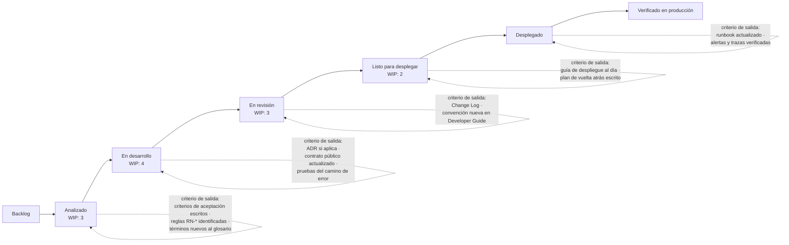
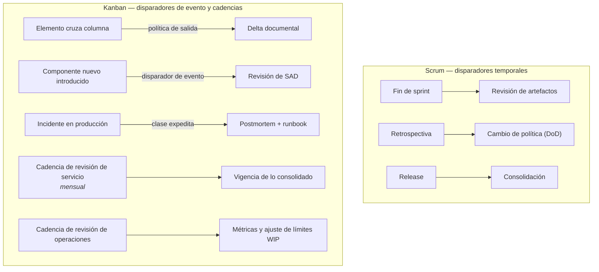

# Kanban y su cuerpo documental — `MET-KANBAN`

## Resumen ejecutivo

Kanban tiene una particularidad que ningún otro método comparte: **una de sus prácticas fundamentales es escribir documentación**. «Hacer explícitas las políticas del proceso» es la cuarta de las prácticas que David J. Anderson formuló en *Kanban: Successful Evolutionary Change for Your Technology Business*, y no es un consejo periférico sino el mecanismo por el cual el sistema se vuelve inspeccionable y mejorable. Un tablero Kanban sin políticas escritas es un tablero de tareas.

Eso cambia el planteo respecto de [Scrum](Scrum.md). Donde Scrum concentra la exigencia documental en un solo artefacto opcional —la Definition of Done—, Kanban distribuye la exigencia a lo largo del flujo: cada columna tiene su criterio de entrada y de salida escrito, y esos criterios son el lugar natural donde el trabajo documental se vuelve obligatorio. La ausencia de iteraciones fijas elimina el ritmo de revisión que el sprint proveía, y hay que reponerlo con disparadores basados en el flujo y en la cadencia de entrega real.

---

## Definición

### Qué es Kanban

Un método para gestionar y mejorar el trabajo de conocimiento mediante la visualización del flujo y la limitación del trabajo en curso. No define roles, no define iteraciones y no prescribe una estructura de equipo: se aplica sobre el proceso existente y lo evoluciona. Anderson lo formula sobre cuatro principios de gestión del cambio —empezar con lo que se hace ahora, acordar perseguir mejora evolutiva e incremental, respetar el proceso, roles y responsabilidades actuales, y fomentar el liderazgo en todos los niveles— y seis prácticas generales:

| Práctica | Qué exige | Consecuencia documental |
|----------|-----------|-------------------------|
| Visualizar el flujo | Un tablero que represente el proceso real | El tablero es un modelo del proceso, y como tal es documentación |
| Limitar el trabajo en curso (WIP) | Un número máximo por estado | Los límites y su justificación se registran |
| Gestionar el flujo | Medir y actuar sobre el tiempo de ciclo | Métricas registradas y accesibles |
| **Hacer explícitas las políticas** | Escribir las reglas del proceso | Documentación de proceso, obligatoria por definición |
| Implementar bucles de retroalimentación | Cadencias de revisión | Registro de decisiones de mejora |
| Mejorar colaborativamente, evolucionar experimentalmente | Cambios basados en modelos y datos | Los experimentos y sus resultados se registran |

La cuarta práctica es la que hace de Kanban el método con mayor densidad documental de proceso, y simultáneamente el que menos dice sobre documentación de producto.

### Qué problema resuelve

La sobrecarga y su efecto sobre el tiempo de entrega. Un sistema con demasiado trabajo simultáneo entrega más lento, no más rápido: el trabajo se acumula en colas invisibles, el cambio de contexto multiplica el esfuerzo y nadie puede predecir cuándo termina algo. Kanban ataca eso limitando el trabajo en curso y midiendo el flujo, sin reorganizar el equipo ni imponer una cadencia artificial.

Para el trabajo documental esto tiene una consecuencia directa y poco discutida: **la documentación es trabajo en curso**. Un elemento cuyo código está desplegado pero cuyo runbook no se escribió sigue ocupando un lugar en el sistema, y si el tablero lo muestra como terminado, el tablero miente. La disciplina de que un elemento no cruza a la columna final hasta cumplir su criterio de salida es lo que impide que la deuda documental sea invisible.

### Qué NO es

No es un tablero. La visualización es una de seis prácticas, y hay organizaciones con tableros impecables que no limitan el WIP, no miden el flujo y no escribieron una sola política. Eso es un tablero de tareas, y su valor es de coordinación, no de mejora.

No es «Scrum sin sprints». Kanban no tiene compromiso de alcance, no tiene Sprint Goal y no exige que el trabajo se agrupe en lotes. La ausencia de esas piezas cambia qué documentación tiene sentido: no hay Sprint Goal que registrar, y en cambio hay clases de servicio y acuerdos de nivel de servicio que Scrum no contempla.

No es aplicable solo a mantenimiento, aunque ahí brille. Se usa en desarrollo de producto, en operación, en procesos de contenido y en flujos de trabajo documental propiamente dichos.

No define qué documentar sobre el producto. Igual que Scrum, es silencioso al respecto; la diferencia es que provee un lugar natural donde escribirlo —las políticas de columna— en vez de un único artefacto opcional.

### Con qué se lo confunde

Con **Scrumban**, que es un híbrido con reglas propias. Con un **sistema de tickets**: Jira o Azure Boards en modo Kanban no implementan límites de WIP por defecto ni obligan a escribir políticas. Con **«sin proceso»**: es exactamente lo contrario, un método cuyo punto de partida es hacer el proceso existente tan explícito que sus problemas se vuelvan discutibles con datos.

---

## Las políticas explícitas como documentación

### Qué son

Las reglas escritas que gobiernan el sistema de trabajo: cuándo un elemento puede entrar a una columna, cuándo puede salir, cuánto trabajo cabe en cada estado, cómo se prioriza, qué se hace ante un bloqueo, quién puede tomar qué. Son el contrato operativo del equipo, y su rasgo definitorio es que están escritas y visibles junto al tablero, no en la memoria colectiva.

Una política mal escrita se reconoce porque admite interpretación. «El código debe estar revisado» deja abierto quién revisa, con qué criterio y qué pasa si el revisor no está. «Ningún elemento sale de *En revisión* sin aprobación de alguien que no participó de la implementación; si nadie está disponible en 24 h, el elemento se marca bloqueado y se escala» es una política.

### Por qué son el lugar donde vive la exigencia documental

En Scrum, todo el peso recae en la DoD, que se aplica al final. En Kanban la exigencia se distribuye, y eso permite ubicar cada requisito documental en el punto del flujo donde la información está disponible:



La ubicación importa. El runbook se exige **después** del despliegue, no antes, porque antes se escribiría de memoria: es la aplicación literal del criterio *just in time* de [`MET-MANIFIESTO`](Manifiesto-y-Documentacion.md#just-in-time--el-criterio-de-momento). En Scrum esta distinción se pierde, porque la DoD se evalúa en un único punto y termina exigiendo el runbook antes de haber operado, o no exigiéndolo nunca.

### Qué otras políticas conviene escribir

**Clases de servicio.** Kanban distingue tipos de trabajo con tratamiento distinto. Las cuatro habituales, con su consecuencia documental:

| Clase de servicio | Trato en el flujo | Exigencia documental |
|-------------------|-------------------|----------------------|
| Expedita | Rompe el límite de WIP; máximo un elemento | Postmortem obligatorio; nunca se exime de él |
| Fecha fija | Se planifica hacia atrás desde el compromiso | Registro del compromiso y de su origen |
| Estándar | Primero en entrar, primero en salir dentro de la prioridad | Política completa de columna |
| Intangible | Se toma cuando hay capacidad | Suele ser trabajo documental o de deuda técnica |

La clase intangible es donde muchos equipos alojan el trabajo documental de consolidación, y es una mala ubicación: lo intangible es lo primero que se posterga indefinidamente. Conviene tratarlo como estándar, con su propia justificación de valor.

**Criterios de bloqueo y escalamiento.** Qué convierte a un elemento en bloqueado, cómo se marca, cuánto puede permanecer así y a quién se escala. Sin esta política, los bloqueos se vuelven invisibles y el tiempo de ciclo se degrada sin causa aparente.

**Política de reposición.** Cada cuánto se decide qué entra al sistema desde el backlog, y con qué criterio. Es el sustituto funcional del Sprint Planning y, como aquel, conviene que deje registro de por qué se priorizó lo que se priorizó.

**Definición de los límites de WIP y su justificación.** El número no es arbitrario; se ajusta observando el flujo. Registrar por qué el límite de *En desarrollo* pasó de 6 a 4 evita que alguien lo devuelva a 6 en tres meses con el argumento de que «así avanzamos más».

---

## Métricas de flujo y su registro

Kanban es el método más orientado a datos de los que trata esta serie, y las métricas son documentación en sentido estricto: son el registro verificable del comportamiento del sistema de trabajo.

| Métrica | Qué mide | Qué revela sobre la documentación |
|---------|----------|-----------------------------------|
| Tiempo de ciclo | Desde que el trabajo empieza hasta que termina | Si crece al endurecer políticas documentales, el criterio está mal ubicado |
| Tiempo de entrega (*lead time*) | Desde que se solicita hasta que se entrega | Distancia entre lo comprometido y lo entregado |
| Throughput | Elementos completados por unidad de tiempo | Base para pronósticos sin estimación |
| Trabajo en curso | Elementos en el sistema | Elementos «terminados» sin documentación son WIP oculto |
| Eficiencia de flujo | Tiempo de trabajo activo sobre tiempo total | Las esperas suelen ser esperas de información no escrita |
| Antigüedad del elemento en curso | Cuánto lleva un elemento sin terminar | Detecta trabajo documental atascado |

La eficiencia de flujo es la que más dice sobre el estado documental de un equipo. Cuando un elemento pasa el 80 % de su vida esperando —esperando una definición, esperando saber cómo se despliega, esperando que alguien recuerde por qué se decidió algo— la causa raíz es casi siempre información que existe pero no está escrita.

Las **métricas DORA** —frecuencia de despliegue, plazo de entrega de cambios, tasa de fallos de cambio y tiempo medio de restauración— se articulan naturalmente con las de flujo y aportan la dimensión que estas no cubren: la calidad del resultado. Para el argumento documental, la más relevante es el tiempo de restauración, porque depende directamente de la calidad de los runbooks y de la documentación de operación. Un equipo con tiempo de restauración alto y runbooks desactualizados tiene una relación causal que se puede sostener con datos ante quien decide las prioridades.

### El registro de las métricas

Un diagrama de flujo acumulado y un gráfico de dispersión de tiempo de ciclo son artefactos documentales con dueño y periodicidad, no capturas de pantalla que alguien muestra en una reunión. Lo que hay que preservar es la serie histórica: sin ella, no se puede demostrar que un cambio de política mejoró o empeoró el sistema, y las decisiones de mejora vuelven a ser opinión.

---

## Documentación en un sistema sin iteraciones fijas

La ausencia de sprint elimina tres cosas que en Scrum se daban por sentadas: un momento periódico de revisión, un lote coherente de trabajo al que asociar un objetivo, y un evento de cierre donde la documentación se consolida. Hay que reponerlas explícitamente.

**El disparador deja de ser temporal y pasa a ser de evento.** En lugar de «al final de cada sprint se revisa el SAD», la regla es «al cerrar un elemento que introdujo un componente nuevo, se revisa el SAD». Es más preciso y más difícil de sostener, porque depende de que la política esté escrita y de que alguien la aplique en el momento.

**La consolidación necesita cadencia propia.** Kanban las llama cadencias, y son independientes del flujo: revisión de servicio, revisión de operaciones, revisión de riesgos, reposición. La cadencia de revisión de servicio es el lugar natural para preguntar si la documentación consolidada sigue siendo cierta, con una periodicidad que el equipo fija —mensual funciona en la mayoría de los casos—.

**No hay Sprint Goal, y eso deja un hueco narrativo.** Los veintiséis Sprint Goals que cuentan la evolución de un producto no tienen equivalente en Kanban. El sustituto razonable es la nota de versión: si el equipo despliega continuamente, el Change Log bien mantenido cumple la función de registro histórico, y adquiere un peso que en Scrum no tiene.

**El WIP oculto es el riesgo documental específico.** Un elemento cuyo código está en producción y cuya documentación no se escribió está terminado en el tablero y sin terminar en la realidad. La única defensa es que la política de la última columna lo impida, y que alguien mire la antigüedad de los elementos que quedaron a medias.



---

## Cuándo Kanban encaja mejor que Scrum

Tres condiciones, y cuando se dan las tres la elección es clara.

**El trabajo llega, no se planifica.** Mantenimiento correctivo, soporte de segundo nivel, operación. Un equipo que recibe incidentes con prioridad cambiante intradía no puede comprometer un Sprint Goal: la mitad de los sprints se abandonarían, y un compromiso que se rompe la mitad de las veces deja de ser un compromiso.

**Los elementos son heterogéneos en tamaño y urgencia.** Cuando conviven un cambio de una hora y una migración de tres semanas, agruparlos en lotes de duración fija no aporta nada y las clases de servicio sí.

**El equipo es estable y el proceso importa más que la cadencia.** Kanban mejora un proceso existente; Scrum reorganiza el trabajo. Cuando la organización no puede o no quiere reorganizarse, Kanban es aplicable y Scrum no.

Existe una cuarta condición, menos discutida: cuando el trabajo documental **es** el trabajo. Un equipo de documentación técnica, un esfuerzo de reconstrucción documental en `ESC-3`, una migración de contenido: son flujos con estados claros —redactado, revisado técnicamente, editado, publicado—, con límites de WIP obviamente necesarios y sin ningún sentido de agrupación en iteraciones.

---

## Aplicación por escenario

### `ESC-1` — Desarrollo de software nuevo

Encaja peor que Scrum, y conviene ser explícito sobre por qué. Un producto nuevo se beneficia del ritmo de inspección y adaptación que la cadencia fija impone, y del compromiso de alcance que el Sprint Goal representa frente a interlocutores del negocio. Kanban sin cadencias de revisión bien establecidas puede producir seis meses de flujo eficiente sin ningún momento estructurado de preguntarse si se está construyendo lo correcto.

Cuando aun así se elige Kanban en `ESC-1` —equipos pequeños con contacto directo con el usuario, productos con demanda muy variable— la contrapartida documental es reponer los momentos de revisión mediante cadencias explícitas, y usar las políticas de columna para que la documentación de análisis y arquitectura no quede diferida. La columna *Analizado* con criterio de salida estricto es lo que sustituye al refinamiento del backlog.

Variación por contexto. En `CTX-1`, la política de salida de la columna de desarrollo debe exigir los cuatro estados de pantalla; en `CTX-2`, el contrato validado; en `CTX-3`, la traza vertical completa del elemento.

### `ESC-2` — Migración a otro lenguaje o plataforma

Kanban funciona bien en la fase de ejecución de una migración, donde el trabajo es repetitivo, heterogéneo en tamaño y con dependencias que producen bloqueos frecuentes. La visualización del flujo expone algo que en Scrum queda escondido entre sprints: cuántos módulos están a medio migrar simultáneamente, que es la métrica de riesgo más importante de una migración.

El diseño del tablero incorpora un estado que no existe en otros escenarios: **en paridad verificada**. Un módulo migrado del sistema de reserva de salas pasa por *migrado*, *desplegado en paralelo* y *paridad verificada*, y solo el último estado significa terminado. La política de salida de esa columna exige la fila en la tabla de equivalencias, el resultado de las pruebas comparativas y el registro de lo que se decidió no migrar.

El límite de WIP hace acá su trabajo más valioso. Un límite de dos módulos en migración simultánea obliga a terminar antes de empezar, que es exactamente la disciplina que las migraciones fallidas no tienen: sistemas con dieciocho módulos a medio migrar durante catorce meses, ninguno verificado, y una tabla de equivalencias que nadie mantiene.

### `ESC-3` — Evaluación de software existente con acceso al código

Doble aplicación, y las dos importan.

**Kanban como método del evaluador.** Una reconstrucción documental es trabajo de flujo: hay un inventario de artefactos a reconstruir, cada uno pasa por relevamiento, redacción, verificación contra evidencia y revisión. El límite de WIP evita el error característico de estos trabajos, que es abrir doce frentes y no cerrar ninguno. La columna de verificación es la que sostiene la calidad: ningún artefacto sale de ahí sin que cada afirmación esté rastreada a un archivo y una línea, y sin que lo no verificado esté marcado como tal con su `confidence`.

**Kanban como hallazgo.** Un equipo Kanban maduro deja rastros documentales reconocibles y de alto valor para el evaluador: políticas escritas, series históricas de métricas de flujo, postmortems de incidentes. Si esos artefactos existen, la evaluación del proceso es directa, y las métricas históricas permiten afirmar cosas sobre la salud del sistema que ninguna lectura de código sostiene.

La ausencia de políticas escritas junto a un tablero en uso es, a su vez, un hallazgo: indica un tablero de tareas y no un sistema Kanban, y anticipa que el proceso no se ha inspeccionado con datos.

### `ESC-4` — Evaluación de un producto solo desde afuera

Poco observable y con baja confianza. Un ritmo de publicación irregular con parches frecuentes es compatible con flujo continuo, y también con ausencia de método. Un Change Log con entradas granulares y fechadas de forma dispersa sugiere despliegue continuo, lo cual sugiere prácticas de flujo.

La inferencia útil no es sobre el método sino sobre la operación: un producto con notas de versión que registran correcciones a las pocas horas de reportadas revela un tiempo de restauración bajo, y eso permite inferir madurez operativa y, con ella, existencia de documentación de operación. Es una inferencia de segundo orden y se registra como tal.

---

## Ejemplos concretos

### Tablero de mantenimiento del sistema de reserva de salas

Equipo de tres personas, `CTX-3`, sistema en producción con dos años de uso: Blazor Server para la interfaz interna, ASP.NET MVC en el módulo heredado de informes y un cliente MAUI para el personal de instalaciones. El trabajo es correctivo, evolutivo menor y operación. Sprints no tienen sentido: el mes pasado hubo dos incidentes que habrían roto cualquier Sprint Goal.

**Tablero y límites:**

| Columna | Límite WIP | Criterio de entrada | Criterio de salida |
|---------|-----------|---------------------|--------------------|
| Solicitado | — | Tiene solicitante identificado | Clasificado por clase de servicio |
| Analizado | 3 | Reproducible o especificable | Criterios de aceptación escritos; `RN-*` afectadas identificadas |
| En desarrollo | 3 | Hay capacidad y el analizado está completo | ADR si aplica; contrato actualizado; prueba que reproduce el defecto |
| En revisión | 2 | Compila y pasa la suite | Revisado por otra persona; Change Log escrito |
| Listo para desplegar | 2 | Aprobado | Plan de vuelta atrás escrito para cambios de esquema |
| Desplegado | — | En producción | Runbook actualizado si cambió un procedimiento operativo |
| Verificado | — | 48 h en producción sin regresión | Métricas del camino nuevo verificadas |

**Un caso real del flujo, con su rastro documental.** Incidente `INC-2026-014`: usuarios del área de instalaciones reportan que las reservas creadas desde el cliente MAUI a veces no aparecen en el listado web.

Se clasifica como expedita, rompe el límite de WIP de desarrollo y se toma de inmediato. El diagnóstico revela que el cliente MAUI reintenta el `POST /reservas` ante timeout, y que el servicio no era idempotente respecto de la cabecera `Idempotency-Key` en el camino del cliente móvil: creaba dos reservas, una de las cuales quedaba con estado inconsistente y no se listaba.

Documentación que el flujo obliga a producir, por política:

- **Al salir de *Analizado*:** el criterio de aceptación —«dos `POST` con la misma `Idempotency-Key` en menos de 30 s producen una sola reserva y devuelven `200` con la reserva existente»— y la identificación de `RN-007` como regla afectada.
- **Al salir de *En desarrollo*:** `ADR-024` registrando que la idempotencia se implementa con tabla de claves y ventana de 24 h, con la alternativa de deduplicación por contenido descartada por costo; especificación OpenAPI actualizada declarando la cabecera como obligatoria; prueba de integración que reproduce el reintento.
- **Al salir de *En revisión*:** entrada en el Change Log marcando el cambio como corrección de comportamiento con impacto en clientes que no envíen la cabecera.
- **Al salir de *Desplegado*:** actualización del runbook de diagnóstico de reservas fantasma, con la consulta SQL que identifica registros huérfanos.
- **Por clase de servicio expedita:** postmortem obligatorio. El hallazgo del postmortem —que el contrato nunca declaró la idempotencia como obligatoria, y que el cliente MAUI se escribió asumiendo que existía— produjo un cambio de política: la columna *En desarrollo* incorporó «todo endpoint que modifique estado declara explícitamente su comportamiento ante reintento».

Ese último punto es el bucle de retroalimentación funcionando: un incidente produjo un cambio permanente en la política documental del equipo, escrito y visible. En un equipo sin políticas explícitas, el hallazgo habría quedado en la memoria de quien lo diagnosticó.

### Un conjunto de políticas explícitas, tal como se publica

```markdown
# Políticas del sistema — Equipo Reservas — vigente desde 2026-03-02
Última revisión: 2026-06-15 (revisión de servicio mensual)

## Clases de servicio
- EXPEDITA: afecta a más de 20 usuarios o impide reservar. Máximo 1 simultánea.
  Rompe límites de WIP. Postmortem obligatorio dentro de las 72 h.
- FECHA FIJA: comprometida con un área. El compromiso y su origen quedan
  registrados en el elemento. Se planifica hacia atrás.
- ESTÁNDAR: orden por prioridad, y dentro de la prioridad, por antigüedad.
- INTANGIBLE: mejora interna sin reclamo externo. Se toma con capacidad libre.
  NO se usa para trabajo documental: ese va como ESTÁNDAR con valor declarado.

## Límites de WIP y su historia
| Columna | Límite | Desde | Motivo del último cambio |
|---------|--------|-------|--------------------------|
| Analizado | 3 | 2026-03 | — |
| En desarrollo | 3 | 2026-05 | Era 4; el tiempo de ciclo empeoró al subirlo en marzo |
| En revisión | 2 | 2026-03 | — |

## Bloqueos
Un elemento se marca bloqueado con etiqueta roja y motivo escrito. Si supera
48 h bloqueado, se escala en la revisión diaria. Un elemento bloqueado sigue
contando para el límite de WIP: no se saca del tablero para "hacer lugar".

## Reposición
Martes y jueves. Entran elementos solo si hay capacidad en Analizado.
Quien repone deja escrito por qué eligió lo que eligió.

## Cadencias
- Revisión diaria del tablero: 15 min, de derecha a izquierda, por antigüedad.
- Revisión de servicio: primer lunes de mes. Se revisa vigencia de lo consolidado
  y se pregunta explícitamente qué documentación quedó desactualizada.
- Revisión de operaciones: mensual. Métricas de flujo, métricas DORA, límites WIP.
- Revisión de riesgos: trimestral. Deuda documental registrada y su prioridad.

## Deuda documental abierta
| Hueco | Riesgo | Registrado | Prioridad |
|-------|--------|-----------|-----------|
| Módulo de informes (ASP.NET MVC) sin modelo de datos documentado | Nadie puede modificarlo con seguridad | 2026-04-10 | Alta |
| Sin runbook de restauración de base | Tiempo de restauración estimado, no medido | 2026-02-01 | Alta |
```

La tabla de historia de los límites de WIP es la pieza que casi nadie escribe y que evita la discusión repetida. La sección de deuda documental abierta convierte lo que en la mayoría de los equipos es una sensación en una lista con dueño y prioridad.

---

## Preguntas guía

- ¿Las políticas del proceso están escritas y visibles, o viven en la costumbre del equipo?
- ¿Qué política impide que un elemento se declare terminado sin su documentación?
- ¿Cuánto trabajo hay en el sistema que figura como terminado y tiene documentación pendiente?
- ¿Existe alguna cadencia en la que alguien pregunte si lo documentado sigue siendo cierto?
- Cuando un límite de WIP cambió, ¿está registrado por qué?
- ¿Las esperas que muestran las métricas de flujo son esperas de información que debería estar escrita?
- Sin Sprint Goals, ¿qué artefacto cuenta la historia de la evolución del producto?

---

## Criterios de calidad y antipatrones

### Criterios de calidad

**Las políticas son verificables.** Cada criterio de columna se puede comprobar sin discutir. Si dos personas razonables pueden discrepar sobre si un elemento puede pasar, la política está mal escrita.

**Los requisitos documentales están donde la información existe.** El runbook se exige después de operar, el ADR en el momento de decidir, los criterios de aceptación antes de desarrollar. Concentrar todo en la última columna reproduce el problema que la DoD de Scrum tiene.

**Las métricas se preservan como serie.** No capturas sueltas: histórico que permita demostrar el efecto de un cambio de política.

**El trabajo documental tiene clase de servicio estándar.** Si va como intangible, no se hace.

**Existe una cadencia de revisión de vigencia.** Sin sprint, alguien tiene que preguntar periódicamente qué dejó de ser cierto. Un mes es la periodicidad que funciona en la mayoría de los equipos.

**La deuda documental está en el tablero, no en la conversación.** Registrada, con dueño, riesgo y prioridad.

### Antipatrones

**Tablero sin políticas.** Columnas con nombres y ninguna regla escrita sobre qué significa estar en cada una. Es el antipatrón fundacional: sin políticas no hay sistema que inspeccionar, y la mejora se vuelve opinión.

**Límites de WIP decorativos.** Existen, están escritos y se violan a diario sin registrar la excepción. Un límite que nunca duele no está limitando nada.

**Columna «Documentación» al final del tablero.** Convertir la documentación en un estado separado garantiza que se acumule ahí. La documentación no es una etapa: es un criterio de salida de cada etapa.

**Todo es expedita.** Cuando la mitad de los elementos rompe los límites, el sistema perdió su capacidad de gestionar el flujo, y el primer efecto colateral es que las políticas documentales se suspenden «por urgencia» de forma permanente.

**Métricas sin decisión.** Medir el tiempo de ciclo durante un año y no haber cambiado ninguna política a partir de esa medición. La sexta práctica es evolucionar experimentalmente, no observar.

**Terminado sin documentar.** El elemento cruza a la última columna y su documentación queda «para después». Es WIP oculto, y es la forma en que la deuda documental se vuelve invisible en Kanban, igual que en Scrum lo hace la DoD que nadie aplica.

**Kanban como excusa para no consolidar.** «No tenemos sprints, así que no tenemos momento de consolidación». La ausencia de iteraciones obliga a definir cadencias, no exime de tener momentos de revisión.

**Confundir el tablero con el proceso.** Rediseñar columnas mensualmente sin tocar las políticas. El tablero es una representación; el proceso son las reglas.

---

## Anexo — Plantilla de políticas explícitas con criterios documentales

Se publica junto al tablero, se revisa en la cadencia de revisión de servicio y se versiona. Cada columna necesita las tres filas: quién puede tomar, qué habilita la entrada, qué exige la salida.

```markdown
# Políticas del sistema — <equipo> — vigente desde AAAA-MM-DD
Revisión: <cadencia> · Última: AAAA-MM-DD · Versión: <n>

## Diseño del flujo
| Columna | Límite WIP | Quién puede tomar | Criterio de ENTRADA | Criterio de SALIDA |
|---------|-----------|-------------------|---------------------|--------------------|
| | | | | |

  → Para cada criterio de salida, preguntarse: ¿lo puede verificar alguien
    que no participó del trabajo? Si no, reescribirlo.

## Criterios documentales por columna
Ubicar cada exigencia donde la información ya existe, no antes.

| Columna | Exigencia documental | Familia | Por qué acá y no antes |
|---------|---------------------|---------|------------------------|
| Analizado | Criterios de aceptación escritos; RN-* identificadas; términos al glosario | FAM-ANA | La regla se entiende antes de codificar, no después |
| En desarrollo | ADR si la decisión excede el componente; contrato público actualizado | FAM-ARQ / FAM-DIS | El racional se pierde apenas termina la implementación |
| En revisión | Change Log; convención nueva a la Developer Guide | FAM-DEV | Hay un segundo par de ojos disponible |
| Listo para desplegar | Guía de despliegue al día; plan de vuelta atrás | FAM-OPE | Antes de necesitarlo bajo presión |
| Desplegado | Runbook actualizado | FAM-OPE | Solo se sabe cómo se opera después de operar |
| Verificado | Métricas y alertas comprobadas | FAM-OPE | Requiere tráfico real |

## Clases de servicio
| Clase | Criterio de asignación | Trato en el flujo | Exigencia documental propia |
|-------|----------------------|-------------------|------------------------------|
| Expedita | | Máx. __ simultáneas; rompe WIP | Postmortem obligatorio en __ h |
| Fecha fija | | | Compromiso y su origen registrados |
| Estándar | | FIFO dentro de la prioridad | Política completa de columna |
| Intangible | | Con capacidad libre | (el trabajo documental NO va acá) |

## Bloqueos y escalamiento
- Qué constituye un bloqueo:
- Cómo se marca:
- Tiempo máximo antes de escalar, y a quién:
- ¿El elemento bloqueado sigue contando para el WIP? (debería: sí)

## Reposición
- Frecuencia:
- Criterio de selección:
- ¿Queda registrado por qué se eligió lo que se eligió?

## Cadencias
| Cadencia | Frecuencia | Pregunta que responde | Salida escrita |
|----------|-----------|----------------------|----------------|
| Revisión del tablero | Diaria | ¿Qué está atascado? | Bloqueos marcados |
| Revisión de servicio | Mensual | ¿Qué documentación dejó de ser cierta? | Deuda registrada |
| Revisión de operaciones | Mensual | ¿Qué dicen las métricas de flujo y DORA? | Ajuste de límites, con motivo |
| Revisión de riesgos | Trimestral | ¿Qué deuda documental es ya un riesgo? | Prioridades |

## Historia de cambios de límites de WIP
| Columna | De | A | Fecha | Motivo | Efecto observado |
|---------|----|---|-------|--------|------------------|

## Deuda documental abierta
| Hueco | Riesgo si no se salda | Dueño | Registrado | Prioridad |
|-------|----------------------|-------|-----------|-----------|
```

Las dos últimas tablas son las que convierten el documento en un instrumento y no en una declaración. La historia de límites impide rediscutir lo ya decidido; la deuda abierta impide que el equipo confunda no tener documentación con no tener problema.

---

## Continuación

Cómo se elige entre este método y [Scrum](Scrum.md) según escenario, contexto, tamaño de equipo y marco regulatorio, con árbol de decisión: [`MET-COMPARATIVA`](Comparativa-y-Criterios.md). El criterio de fondo que ambos aplican con mecanismos distintos: [`MET-MANIFIESTO`](Manifiesto-y-Documentacion.md).
