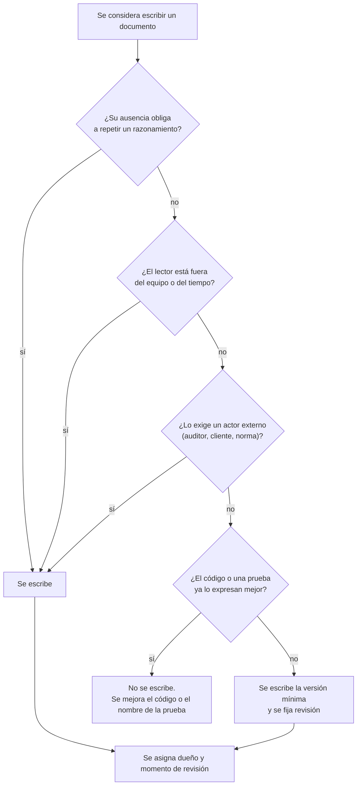
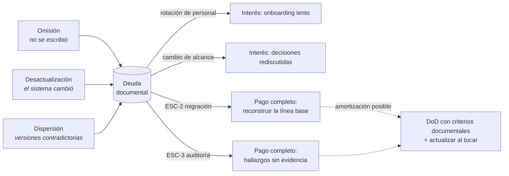

# El Manifiesto Ágil y la documentación — `MET-MANIFIESTO`

## Resumen ejecutivo

En febrero de 2001, diecisiete personas firmaron en Snowbird un texto de sesenta y ocho palabras que incluye la frase «software funcionando sobre documentación exhaustiva». Dos décadas después, esa frase es la coartada más citada para no documentar nada. La lectura es errónea por una razón textual, no interpretativa: el propio Manifiesto cierra con «aunque valoramos los elementos de la derecha, valoramos más los de la izquierda». Los elementos de la derecha se valoran. Lo que se rechaza es la exhaustividad, no la documentación.

Este documento reconstruye qué dice el Manifiesto, qué documentación sobrevive en un entorno ágil y por qué, y desarrolla los dos criterios operativos que reemplazan a la exhaustividad: *just enough* —el mínimo que sostiene la decisión— y *just in time* —escrito en el momento de menor incertidumbre útil—. El corolario práctico es la **deuda documental**: el equipo que no documenta no ahorra trabajo, lo difiere con interés, y el cobro llega puntualmente en `ESC-2` y `ESC-3`.

---

## Definición

### Qué es el Manifiesto

Una declaración de cuatro valores y doce principios sobre cómo desarrollar software. Los cuatro valores se enuncian como preferencias comparativas, no como exclusiones:

| Se valora más | Sobre | Lo que la comparación afirma |
|---------------|-------|------------------------------|
| Individuos e interacciones | Procesos y herramientas | El proceso sirve a la gente, no al revés |
| Software funcionando | Documentación exhaustiva | La evidencia de progreso es el producto, no el papel |
| Colaboración con el cliente | Negociación contractual | El alcance se descubre, no se litiga |
| Respuesta ante el cambio | Seguimiento de un plan | El plan es hipótesis, no compromiso |

De los doce principios, cuatro tienen consecuencia documental directa. El principio de entrega frecuente de software funcionando establece el ritmo al que la documentación debe poder actualizarse. El principio de que la conversación cara a cara es el método más eficiente de transmitir información dentro del equipo delimita el alcance de la documentación interna: lo que se resuelve hablando no necesita escribirse, salvo que deba sobrevivir a la conversación. El principio de simplicidad —«maximizar la cantidad de trabajo no realizado»— es la formulación original de *just enough*. Y el principio de atención continua a la excelencia técnica y al buen diseño es el que sostiene que los ADR y el diseño registrado no son burocracia sino condición de agilidad futura.

### Qué problema resuelve

El Manifiesto responde a un modo de trabajo concreto —el ciclo en cascada con fases documentales estancas— en el que la documentación se producía antes de tener información suficiente y se firmaba como si fuera un contrato irrevocable. El problema real que se ataca es la **documentación como sustituto del progreso**: equipos que llevaban seis meses de proyecto, cero líneas de código útil y mil doscientas páginas de especificación funcional aprobada, sobre un producto cuyo alcance ya había cambiado.

La crítica es al momento y al volumen, no al acto de escribir.

### Qué NO es

No es un método. No prescribe roles, eventos ni artefactos: eso lo hacen Scrum, Kanban o XP, que son implementaciones concretas de estos valores y no derivaciones necesarias de ellos.

No es una autorización para no documentar. Un equipo que no puede explicar por qué su sistema de reserva de salas usa bloqueo optimista con `RowVersion` en lugar de un índice único con exclusión temporal no está siendo ágil: está siendo opaco, y la próxima persona que toque esa tabla va a repetir la discusión.

No es antidocumental por convicción, sino por economía. La consigna operativa es que el costo de un documento se justifique por la decisión que evita repetir.

### Con qué se lo confunde

Con **Scrum**, que es su implementación más difundida y por eso se lo toma por sinónimo. Con **«no hay requisitos»**, cuando lo que cambia es la forma —criterios de aceptación por elemento de backlog en lugar de un SRS cerrado por adelantado— y no la existencia. Con **velocidad**: el Manifiesto no habla de ir rápido, habla de responder al cambio, que es una propiedad distinta y a veces más cara.

El malentendido más costoso, sin embargo, es tomar «documentación exhaustiva» como si se refiriera a toda documentación. En el original, *comprehensive documentation* califica un tipo específico: la que pretende ser completa antes de que exista el sistema. Una guía de despliegue escrita después de desplegar tres veces no es exhaustiva en ese sentido, es descriptiva, y no está en el lado derecho de ninguna balanza.

---

## Qué documentación sobrevive en un entorno ágil

La prueba de supervivencia tiene tres preguntas. Un documento sobrevive si su ausencia obliga a alguien a repetir un razonamiento ya hecho, si su lector no está en la sala, o si algún actor externo —auditor, cliente, regulador, el equipo dentro de dos años— lo va a exigir.

### Lo que sobrevive siempre

**Decisiones y su racional.** Los ADR son el artefacto más agil-compatible que existe: se escriben en el momento en que la decisión se toma, ocupan una página, y su valor crece con el tiempo en lugar de decrecer. Una decisión arquitectónica no registrada se vuelve a discutir cada seis meses, y cada discusión cuesta más que escribirla la primera vez.

**Contratos hacia afuera.** Toda superficie que otro equipo consume: especificación de API, esquema de eventos, formato de archivos de intercambio. En `CTX-2` esto es innegociable —un cliente externo no puede preguntarle al equipo cada vez— y en `CTX-1` toma la forma de contrato de componente y de sistema de diseño.

**Lo que se ejecuta bajo presión.** Runbooks, procedimientos de recuperación, guías de despliegue. Se leen a las tres de la mañana por alguien que no los escribió, y su desactualización prolonga la caída.

**Lo que el negocio o la ley exigen.** Trazabilidad de requisitos en dominios regulados, registros de validación, evidencia de control de acceso. Ninguna cantidad de agilidad exime de un requisito normativo.

**Conocimiento tácito de alto costo de reconstrucción.** El modelo de dominio, el glosario, las reglas de negocio no obvias. Que una sala de la categoría *auditorio* exija aprobación del responsable de instalaciones si la reserva supera cuatro horas no se deduce del código sin leer tres clases y adivinar la intención.

### Lo que no sobrevive

La especificación funcional completa firmada antes de escribir código, cuando el alcance todavía es hipótesis. El documento de diseño detallado que parafrasea lo que el código ya expresa —una clase `ReservaService` con métodos `Crear`, `Cancelar` y `Reprogramar` no necesita un LLD que enumere esos tres métodos—. Las actas de reunión que nadie relee. Los diagramas generados a mano que se desincronizan al primer refactor. Los informes de estado que existen para tranquilizar a alguien que podría mirar el tablero.

### La regla de decisión



El nodo que más se salta es el último: un documento sin dueño y sin momento de revisión es deuda documental desde el día en que se crea, porque nadie tiene la obligación de detectar que dejó de ser cierto.

---

## Just enough y just in time

Son dos criterios independientes que suelen confundirse. *Just enough* responde **cuánto**; *just in time* responde **cuándo**.

### Just enough — el criterio de volumen

La cantidad correcta de documentación es la mínima que permite tomar la decisión que el documento habilita, con el margen de error que el costo de equivocarse justifica. La formulación operativa: se escribe hasta que el lector previsto pueda actuar sin preguntar, y ni una línea más.

Aplicado al sistema de reserva de salas. El requisito de que una sala no admita reservas superpuestas necesita, como mínimo: el enunciado de la regla, la definición de superposición —¿el fin de una reserva a las 10:00 y el inicio de otra a las 10:00 se superponen?—, y el comportamiento ante conflicto. Eso son cinco líneas. Lo que no necesita es un capítulo sobre la teoría de intervalos temporales ni un diagrama de secuencia de doce participantes que muestre el camino feliz.

El error simétrico también existe y es menos visible: *just enough* mal aplicado produce documentos tan escuetos que no habilitan ninguna decisión. «El sistema debe ser rápido» es mínimo, y es inútil. «El listado de disponibilidad de salas responde en menos de 400 ms en el percentil 95 con 200 salas y 5.000 reservas activas» es igual de corto y sí habilita decisiones de arquitectura.

### Just in time — el criterio de momento

Se escribe en el momento de menor incertidumbre que todavía sea útil. Escribir antes produce ficción; escribir después produce arqueología.

Cada artefacto tiene su momento propio:

| Artefacto | Momento de mínima incertidumbre útil | Qué pasa si se escribe antes | Qué pasa si se escribe después |
|-----------|--------------------------------------|------------------------------|--------------------------------|
| ADR | Cuando la decisión se toma, antes de implementarla | Se decide sin información suficiente | Se racionaliza lo hecho; se pierden las alternativas |
| Criterios de aceptación | Al refinar el elemento de backlog, antes de estimarlo | Se detalla lo que puede no construirse | El desarrollador inventa el criterio y QA discute |
| API Specification | Con el contrato acordado, antes del primer consumidor | Se congela una firma que va a cambiar | El consumidor ya se acopló a lo que encontró |
| Modelo de datos | Con la primera migración | Se diseñan tablas para requisitos hipotéticos | Se reconstruye desde el esquema real |
| Runbook | Después de ejecutar el procedimiento dos o tres veces | Se documenta lo que se cree que pasa | El conocimiento vive en una persona |
| User Manual | Cuando el flujo se estabiliza, antes del release | Se reescribe cada sprint | El usuario ya llamó a soporte |

La tabla explica una asimetría que confunde a los equipos: los ADR y los criterios de aceptación se escriben **antes** de codificar, los runbooks **después** de operar. No hay una regla única de anticipación; hay un momento por artefacto, y el momento es el punto donde la información deja de mejorar significativamente.

### Cómo se combinan

Un ADR sobre concurrencia de reservas escrito en el sprint en que se implementa el bloqueo, de una página, con tres alternativas evaluadas y una descartada explícitamente, es *just enough* y *just in time*. El mismo ADR escrito en el sprint uno —cuando todavía no se sabía si habría reservas simultáneas— sería especulación; escrito en el mes catorce, sería una reconstrucción de por qué se hizo lo que ya está hecho, con el sesgo que eso implica.

---

## La deuda documental

El paralelo con la deuda técnica es exacto en la mecánica y peor en las consecuencias, porque la deuda documental no se detecta con herramientas.

**Qué es.** La diferencia entre el conocimiento que el sistema requiere para ser operado, modificado y auditado, y el conocimiento que está registrado fuera de la cabeza de las personas. Se contrae de tres formas: por omisión —no se escribió—, por desactualización —se escribió y el sistema cambió— y por dispersión —está escrito en cinco lugares que se contradicen—.

**Cómo se acumula el interés.** No linealmente. Mientras el equipo original permanece, el interés es bajo: alguien recuerda. Cada rotación de personal capitaliza intereses. La primera migración o la primera auditoría exige el pago completo, con la agravante de que reconstruir cuesta más que haber escrito: reconstruir el racional de una decisión desde el código requiere leer el código, formular hipótesis y validarlas contra el historial, y aun así el resultado es una conjetura marcada como tal.

**Cómo se mide.** No hay métrica directa, pero hay indicadores observables. El tiempo hasta el primer commit útil de una persona nueva. La proporción de preguntas en el canal del equipo cuya respuesta ya debería estar escrita. El número de decisiones que se rediscuten. La distancia entre la documentación existente y el sistema real, medida por muestreo: se eligen cinco afirmaciones al azar de los documentos vigentes y se verifican contra el código.

**Cómo se amortiza.** No con un proyecto de documentación —esos fracasan sistemáticamente, porque producen un cuerpo documental correcto y muerto—, sino atándola al trabajo en curso: cuando se toca un módulo, se actualiza su documentación en el mismo cambio, y la Definition of Done lo exige. Es la única estrategia con evidencia de sostenerse, y depende de que el trabajo documental esté financiado dentro del ciclo, lo cual se desarrolla en [`MET-SCRUM`](Scrum.md#cómo-se-financia-el-trabajo-documental).



---

## Aplicación por escenario

### `ESC-1` — Desarrollo de software nuevo

Es el escenario donde el Manifiesto se aplica con menos fricción y donde la interpretación errónea es más fácil de sostener, porque nadie sufre todavía las consecuencias. El equipo entrega software funcionando cada dos semanas, la demostración va bien, y la ausencia de documentación no produce ningún síntoma durante seis o diez meses.

Lo que corresponde en `ESC-1` es escribir tres cosas desde el principio, aunque el resto se difiera: el glosario del dominio, los ADR de las decisiones estructurales y los criterios de aceptación de cada elemento entregado. Las tres son baratas en el momento y carísimas de reconstruir. El SRS completo, en cambio, se produce incrementalmente o no se produce: la especificación consolidada es un subproducto del backlog refinado, no un prerrequisito.

Variación por contexto. En `CTX-1` el artefacto que no se puede diferir son los estados de interfaz —vacío, cargando, con datos, con error, más la reconexión del circuito en Blazor Server—, porque son requisitos que el desarrollador va a inventar si no están escritos. En `CTX-2` es la especificación de API, y conviene generarla desde el código para que no se desincronice. En `CTX-3` es el glosario, por la razón que el marco explica: el mismo concepto llamado de tres formas distintas en interfaz, API y base de datos.

### `ESC-2` — Migración a otro lenguaje o plataforma

Acá se cobra la deuda. La migración de un sistema de reserva de salas en ASP.NET MVC a Blazor Server necesita una línea base de comportamiento, y si el equipo original interpretó el Manifiesto como permiso para no documentar, esa línea base no existe: hay que reconstruirla desde el código, desde la base de datos y desde los usuarios, que recordarán comportamientos que nadie especificó y que sin embargo son requisito de hecho.

El costo es asimétrico y conviene dimensionarlo. Escribir el criterio de una regla de negocio en el momento en que se implementa cuesta minutos. Reconstruirla desde una migración de Entity Framework, tres controladores y un procedimiento almacenado cuesta días, y el resultado queda marcado como inferencia con confianza media.

La paradoja que este escenario expone: la agilidad prometía respuesta al cambio, y el cambio más grande que un sistema enfrenta —cambiar de plataforma— es exactamente donde la falta de documentación lo vuelve más rígido. Un sistema sin línea base documentada no se puede migrar con criterio de paridad, solo se puede reescribir a ciegas y esperar que los usuarios reporten lo que falta.

Variación por contexto. En `CTX-1` lo irrecuperable son los flujos y los estados de excepción de la interfaz vieja, porque el código de vistas rara vez los expresa completos. En `CTX-2` lo irrecuperable son las garantías implícitas: si el servicio viejo resultaba idempotente por accidente y algún consumidor se apoyó en eso, nadie lo sabe hasta que se rompe.

### `ESC-3` — Evaluación de software existente con acceso al código

La lectura del Manifiesto que hizo el equipo evaluado es en sí misma un hallazgo. Un repositorio sin ADR, sin glosario y con un README de instalación desactualizado permite inferir con confianza razonable que el equipo trabajó con la interpretación errónea, y esa inferencia explica y anticipa otros hallazgos: decisiones estructurales incoherentes entre módulos —síntoma de decisiones tomadas dos veces con criterios distintos—, nombres divergentes para la misma entidad, y funcionalidad cuya intención no se puede determinar.

Lo que el auditor debe distinguir, y suele no distinguir, es la ausencia deliberada de la ausencia por descuido. Un equipo maduro que decidió no escribir LLD porque el código es legible y las pruebas documentan el comportamiento tomó una decisión defendible; ese mismo equipo tendrá ADR, glosario y contratos. Un equipo que no escribió nada no tomó ninguna decisión. La diferencia se detecta preguntando por el criterio: si existe una regla escrita sobre qué se documenta y qué no, hubo criterio.

Variación por contexto. En `CTX-2` la evidencia más rápida es la especificación de API: si existe y coincide con el código, el equipo mantenía disciplina de contrato. En `CTX-3`, la prueba es intentar seguir un requisito desde el enunciado hasta la prueba que lo verifica.

### `ESC-4` — Evaluación de un producto solo desde afuera

El método de trabajo del proveedor se infiere con confianza baja a media desde el material público, y la inferencia es útil aunque no sea concluyente. Las notas de versión revelan ritmo: entregas quincenales regulares sugieren iteraciones fijas; entregas irregulares con parches frecuentes sugieren flujo continuo o ausencia de método. La documentación pública de API, si está versionada y tiene política de deprecación escrita, indica disciplina de contrato. Un centro de ayuda que va varias versiones por detrás del producto indica que la documentación de usuario no está en la Definition of Done.

Nada de esto se afirma; se registra como hipótesis con su base observacional, según lo que el marco establece para este escenario. La utilidad práctica es de riesgo: un proveedor cuya documentación pública se desactualiza sistemáticamente es un proveedor cuyo soporte va a depender de conversaciones, y eso se considera en una decisión de compra.

---

## Ejemplos concretos

### El mismo requisito, tres tratamientos documentales

Sistema de reserva de salas, regla de no superposición. Contexto `CTX-3`, implementación Blazor Server sobre ASP.NET Core y EF Core.

**Tratamiento exhaustivo (pre-ágil).** Capítulo 7 del SRS, catorce páginas. Define el concepto de intervalo, enumera los nueve casos de solapamiento posibles con diagramas, especifica el algoritmo de detección, fija el mensaje de error literal en tres idiomas y describe la interfaz de resolución de conflictos. Se aprueba en el mes tres. En el mes siete el negocio agrega salas divisibles en módulos, y once de las catorce páginas quedan obsoletas sin que nadie las corrija, porque corregirlas requiere reabrir un documento aprobado.

**Tratamiento «ágil» mal entendido.** Un elemento de backlog: «Como usuario quiero reservar una sala sin que se pise con otra reserva». Sin criterios de aceptación. El desarrollador decide que las reservas contiguas no se superponen, implementa una consulta con `AnyAsync` antes de insertar, y no considera la condición de carrera entre la consulta y la inserción. En producción aparecen reservas dobles con baja frecuencia. Nadie sabe si el bloqueo era requisito o descuido, porque no hay nada escrito.

**Tratamiento just enough / just in time.** Tres piezas, en tres momentos distintos:

```markdown
RN-007 — No superposición de reservas          [glosario + reglas, sprint 2]
Dos reservas de la misma sala se superponen si sus intervalos
[inicio, fin) se intersecan. Los intervalos son semiabiertos: una
reserva 09:00–10:00 y otra 10:00–11:00 NO se superponen.
Alcance: salas indivisibles. Las salas modulares se tratan en RN-019.

Criterios de aceptación de PBI-114                    [refinamiento, sprint 2]
- Dado que la sala Everest tiene reserva 09:00–10:00, cuando se
  solicita 09:30–10:30, entonces se rechaza con 409 y se ofrecen
  los tres huecos libres más cercanos.
- Dado que dos usuarios confirman 14:00–15:00 en la misma sala en
  la misma ventana de 200 ms, entonces exactamente una prospera.

ADR-012 — Control de concurrencia en reservas         [al implementar, sprint 3]
Decisión: índice único sobre (SalaId, Intervalo) con tipo de rango
en PostgreSQL y constraint de exclusión; el rechazo llega como
violación de constraint y se traduce a 409.
Alternativas evaluadas: (a) bloqueo pesimista con SELECT FOR UPDATE
— descartado por contención en el listado de disponibilidad;
(b) RowVersion optimista sobre la sala — descartado porque serializa
reservas de horarios que no compiten entre sí.
Consecuencia aceptada: acopla la regla al motor de base de datos.
Revisar si se decide soportar SQL Server (ver RSK-004).
```

Total: veintitantas líneas, escritas en tres momentos distintos por tres actores distintos —`ACT-02` la regla, `ACT-01` con `ACT-05` los criterios, `ACT-03` el ADR—. Cubren lo que el capítulo de catorce páginas cubría, sobreviven al cambio de alcance del mes siete —`RN-019` se agrega sin tocar `RN-007`— y responden la pregunta que el tratamiento mal entendido dejó abierta.

### Un caso de deuda documental cobrada

Equipo de cuatro personas, sistema de reserva de salas en ASP.NET MVC, dos años de desarrollo, cero documentación más allá del README. Todo funcionó: el producto se usa, los usuarios están conformes, el equipo conocía el sistema de memoria.

En el mes veintiséis la organización decide migrar a Blazor Server —`ESC-2`— y dos de las cuatro personas ya no están. El inventario de deuda que aparece:

| Hallazgo | Origen de la deuda | Costo de reconstrucción |
|----------|--------------------|-------------------------|
| Las reservas de más de cuatro horas en salas *auditorio* requieren aprobación | Regla nunca escrita, implementada en un `if` sin comentario | 2 días: se detectó por un usuario que reclamó |
| El cálculo de disponibilidad excluye feriados desde una tabla que nadie mantiene | Decisión de implementación con consecuencia funcional | 1 día + decisión pendiente sobre si migrar la tabla |
| El endpoint `/api/reservas` lo consume una planilla del área de finanzas | Contrato de hecho, sin especificación | 3 días: se descubrió al apagarlo en preproducción |
| Nadie sabe por qué el bloqueo es optimista en vez de pesimista | ADR nunca escrito | No reconstruible; se decidió de nuevo desde cero |

La última fila es la más cara y la que no tiene número: el equipo nuevo tomó una decisión distinta a la del equipo viejo, sin saber qué había motivado la original, y descubrió tres meses después el problema de contención que la decisión vieja evitaba.

---

## Preguntas guía

- ¿Existe una regla escrita sobre qué documenta este equipo y qué no, o cada quien decide por su cuenta?
- Si mañana se van las dos personas que más saben del sistema, ¿qué se pierde de forma irrecuperable? ¿Está esa lista escrita en algún lado?
- ¿Cuál fue la última decisión estructural que se tomó, y dónde quedó registrada con sus alternativas?
- ¿La documentación que existe está más cerca del sistema real o de lo que el sistema era hace un año?
- ¿El trabajo documental está financiado dentro del ciclo de trabajo, o depende de que sobre tiempo?
- Cuando alguien pregunta algo cuya respuesta debería estar escrita, ¿la respuesta se escribe, o solo se contesta?

---

## Criterios de calidad y antipatrones

### Criterios de calidad de la política documental de un equipo

Una política documental es buena cuando existe explícitamente y cuando lo que excluye está justificado. Se reconoce por cinco propiedades:

**Es explícita.** Está escrita qué se documenta siempre, qué se documenta bajo condición y qué no se documenta nunca. Un equipo que decidió no escribir LLD tiene esa decisión escrita, con su razón.

**Está financiada.** El trabajo documental tiene lugar dentro del ciclo, no después. En Scrum, la Definition of Done lo exige; en Kanban, las políticas explícitas de cada columna lo incluyen.

**Tiene dueño por artefacto.** Cada documento vivo tiene un actor responsable de que siga siendo cierto, según la matriz de [Actores](../00-Marco-de-Referencia/Actores.md#matriz-de-responsabilidad-por-familia-documental).

**Tiene mecanismo de detección de obsolescencia.** Fecha de última revisión en el frontmatter, revisión disparada por cambio en el módulo, o validación automática cuando el artefacto lo permite —una especificación OpenAPI contrastada contra el código en el pipeline—.

**Distingue lo verificado de lo inferido.** Los campos `origin` y `confidence` de las [Convenciones](../00-Marco-de-Referencia/Convenciones.md#frontmatter-obligatorio) existen para esto, y en `ESC-3` son la diferencia entre un informe y una conjetura presentada como hecho.

### Antipatrones

**El Manifiesto como excusa.** Citar «software funcionando sobre documentación exhaustiva» para justificar la ausencia total de registro. Se reconoce porque quien lo cita nunca menciona la frase de cierre sobre los elementos de la derecha.

**El sprint de documentación.** Dedicar una iteración completa a escribir todo lo que se debió escribir en las doce anteriores. Produce un cuerpo documental que era correcto el viernes en que se terminó y que nadie vuelve a tocar, porque no está atado a ningún trabajo en curso.

**La documentación exhaustiva con vocabulario ágil.** Un SRS de doscientas páginas reescrito como cuatrocientas historias de usuario con criterios de aceptación en Gherkin. Es el mismo volumen y la misma anticipación, con otra sintaxis. El indicio es la existencia de un backlog refinado en detalle a seis meses vista.

**Documentar el camino feliz.** Especificar lo que pasa cuando todo sale bien y omitir el error, el vacío y la interrupción, que es donde vive la mayor parte del trabajo de implementación. En `CTX-1` esto deja sin especificar la mayoría de los estados de pantalla.

**El documento sin lector.** Producir artefactos porque el proceso los pide. La prueba es preguntar quién lo leyó en los últimos tres meses; si la respuesta es nadie, o se elimina o se corrige el motivo por el que no se usa.

**Confundir conversación con registro.** Apoyarse en el principio de comunicación cara a cara para resolverlo todo hablando. Funciona mientras el equipo no rota y nadie audita. Ambas condiciones expiran.

**Documentación paralela.** Mantener la misma información en el wiki, en el repositorio y en las tarjetas del tablero. Tres versiones que divergen es peor que una desactualizada, porque el lector no sabe cuál creer.

---

## Anexo — Plantilla de política documental de equipo

Se completa al inicio del proyecto o al formarse el equipo, y se revisa cuando cambia el escenario o el tamaño del equipo. Cabe en una página; si ocupa más, la política es demasiado detallada para que alguien la siga.

```markdown
# Política documental — <equipo> — <fecha> — revisión: <periodicidad>

## Encuadre
- Escenario dominante: ESC-_        (¿construimos, migramos, auditamos?)
- Contexto: CTX-_                   (¿qué cambia el centro de gravedad?)
- Método de trabajo: ___            (define el momento en que se financia)
- Marco regulatorio aplicable: ___  (si existe, no es negociable)

## Se documenta SIEMPRE
Para cada ítem: artefacto, dueño (ACT-__), momento de creación, disparador de revisión.
| Artefacto | Dueño | Cuándo se crea | Cuándo se revisa |
|-----------|-------|----------------|------------------|
| ADR       | ACT-03| Al decidir     | Al superarse la decisión |
| Glosario  | ACT-02| Continuo       | Al aparecer término nuevo |
| ...       |       |                |                  |

## Se documenta BAJO CONDICIÓN
| Artefacto | Condición que lo dispara |
|-----------|--------------------------|
| LLD       | Solo si el algoritmo no es evidente del código |
| Runbook   | Solo tras ejecutar el procedimiento en producción |

## NO se documenta, y por qué
| Lo que no escribimos | Razón | Qué lo suple |
|----------------------|-------|--------------|
| LLD por clase | El código y las pruebas lo expresan | Nombres de prueba descriptivos |
| Actas de reunión | Las decisiones van a ADR | ADR + tablero |

## Financiamiento
- ¿Dónde vive el trabajo documental? (DoD / política de columna / ítem propio)
- ¿Qué pasa si un cambio llega al final del ciclo sin su documentación?

## Detección de obsolescencia
- Campo `last_review` obligatorio: sí / no
- Validaciones automatizadas: (p. ej. contraste OpenAPI vs. código en CI)
- Muestreo periódico: N afirmaciones verificadas contra el sistema cada M meses

## Deuda documental conocida
| Hueco | Riesgo si no se salda | Prioridad |
|-------|----------------------|-----------|
```

Las dos secciones que hacen la diferencia son «NO se documenta, y por qué» y «Financiamiento». La primera convierte la omisión en decisión defendible ante un auditor; la segunda es la única que determina si la política se va a cumplir. Todo lo demás es intención.

---

## Continuación

Cómo se financia concretamente el trabajo documental dentro de un ciclo iterativo, y cómo la Definition of Done funciona como contrato: [`MET-SCRUM`](Scrum.md). Cómo se resuelve el mismo problema sin iteraciones, mediante políticas explícitas: [`MET-KANBAN`](Kanban.md). Qué documentación de negocio precede a todo esto: [`MET-CANVAS`](Canvas.md).

Sobre documentación de usuario en desarrollo ágil, **ISO/IEC/IEEE 26515** es la referencia normativa: trata específicamente cómo se planifica y produce documentación de usuario en ciclos iterativos, y su aporte principal es que el trabajo documental se estima y se gestiona como cualquier otro elemento de trabajo, no como actividad residual.
