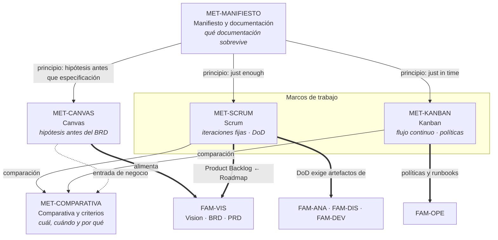

# Métodos ágiles y documentación — `MET-INDICE`

## Resumen ejecutivo

El método de trabajo decide cuánta documentación existe, quién la produce, cuándo y con qué vida útil. Esta serie no enseña a hacer Scrum ni a dibujar un tablero Kanban: examina qué cuerpo documental resulta de cada método y cómo se articula con las siete familias de la guía. Un mismo sistema de reserva de salas documentado por un equipo Scrum, por un equipo Kanban de mantenimiento y por un equipo que arranca con un Lean Canvas produce tres conjuntos de artefactos distintos, con distintos momentos de creación y distintos criterios de vigencia.

La pregunta que atraviesa los cinco documentos es una sola: **¿qué documentación produce, exige y elimina este método, y quién paga por ella?** El método ágil que no responde la tercera parte de esa pregunta —quién paga— es el que genera deuda documental, y esa deuda se cobra completa en `ESC-2` y en `ESC-3`, cuando alguien tiene que migrar o auditar un sistema del que nadie escribió por qué está hecho como está.

---

## Qué cubre la serie

| Documento | ID | Pregunta que responde | Ángulo documental |
|-----------|----|-----------------------|-------------------|
| [Manifiesto y documentación](Manifiesto-y-Documentacion.md) | `MET-MANIFIESTO` | ¿Qué dijo realmente el Manifiesto sobre documentar? | Qué documentación sobrevive y por qué |
| [Scrum](Scrum.md) | `MET-SCRUM` | ¿Qué documentación exige un marco con iteraciones? | Artefactos oficiales, DoD como contrato documental |
| [Kanban](Kanban.md) | `MET-KANBAN` | ¿Qué documentación exige un sistema de flujo continuo? | Políticas explícitas, métricas, mantenimiento |
| [Canvas](Canvas.md) | `MET-CANVAS` | ¿Qué reemplaza y qué precede a la documentación de visión? | Business Model Canvas, Lean Canvas, Value Proposition Canvas |
| [Comparativa y criterios](Comparativa-y-Criterios.md) | `MET-COMPARATIVA` | ¿Cómo elijo método según escenario y contexto? | Árbol de decisión, escalado, híbridos |

Ninguno de los cinco es un tutorial del método. Scrum tiene una guía oficial de catorce páginas y Kanban una bibliografía extensa; lo que esta serie agrega es la lectura documental que ninguna de esas fuentes hace de forma sistemática.

---

## Cómo se relacionan

Las flechas continuas dentro de la serie marcan dependencia de lectura; las de doble trazo salen hacia las familias documentales de la guía y son las que justifican que esta serie exista. El Canvas no es un artefacto de método ágil en sentido estricto —es una herramienta de modelado de negocio— pero entra acá porque en la práctica ocupa el lugar que el BRD tendría en un proyecto tradicional, y conviene decir explícitamente qué cubre y qué deja sin cubrir.

---

## Orden de lectura

Para estudiar la serie por primera vez, el orden es el del listado: `MET-MANIFIESTO` primero, porque fija el criterio con el que se juzgan los demás; después `MET-SCRUM` y `MET-KANBAN` en cualquier orden; `MET-CANVAS` cuando interese la frontera con la familia de visión; y `MET-COMPARATIVA` al final, que asume el vocabulario de los cuatro anteriores.

Para alguien que ya trabaja con un método y necesita corregir su documentación, el recorrido útil es el inverso: entrar por el documento del método que usa, leer su sección de antipatrones, y volver a `MET-MANIFIESTO` para entender por qué esos antipatrones son sistemáticos y no fallas individuales del equipo.

Para quien evalúa un sistema ajeno —`ESC-3` y `ESC-4`— la serie se lee como catálogo de indicios. El método de trabajo de un equipo deja huellas documentales reconocibles: la presencia de una Definition of Done escrita, la existencia o ausencia de ADRs, el ritmo de los commits contra el ritmo de las notas de versión, la forma de los tickets. Reconstruir el método es un paso legítimo para explicar por qué la documentación tiene los huecos que tiene.

---

## Qué asume esta serie del resto de la guía

Los cinco documentos usan los ejes del marco sin volver a definirlos:

- [Escenarios](../00-Marco-de-Referencia/Escenarios.md) — `ESC-1` desarrollo nuevo, `ESC-2` migración, `ESC-3` evaluación con código, `ESC-4` evaluación externa.
- [Contextos](../00-Marco-de-Referencia/Contextos.md) — `CTX-1` web y cliente interactivo, `CTX-2` backend y servicios, `CTX-3` fullstack.
- [Actores](../00-Marco-de-Referencia/Actores.md) — `ACT-01` a `ACT-10`, con la matriz de responsabilidad por familia.
- [Convenciones](../00-Marco-de-Referencia/Convenciones.md) — frontmatter, prefijos de identificador, estilo y regla de no duplicación.

El dominio de los ejemplos es el **sistema de reserva de salas** que la guía usa en todas partes, con .NET y C# como vocabulario técnico: Blazor con render mode *interactive server* para la interfaz, ASP.NET MVC en los ejemplos de sistema heredado y .NET MAUI con MVVM para el cliente móvil.

---

## Las siete familias, vistas desde el método

Cada familia documental tiene una relación distinta con el método de trabajo. Algunas se producen dentro del ciclo iterativo, otras lo preceden y otras sobreviven a cualquier método.

| Familia | Relación con el método | Dónde se desarrolla |
|---------|------------------------|---------------------|
| [`FAM-VIS`](../10-Vision/) Visión | Precede al método; el Canvas la anticipa en forma de hipótesis | [`MET-CANVAS`](Canvas.md) |
| [`FAM-ANA`](../20-Analisis/) Análisis | Se produce incrementalmente; el backlog es su cara táctica | [`MET-SCRUM`](Scrum.md) |
| [`FAM-ARQ`](../30-Arquitectura/) Arquitectura | Se decide *just in time*; los ADR son el mecanismo | [`MET-MANIFIESTO`](Manifiesto-y-Documentacion.md) |
| [`FAM-DIS`](../40-Diseno/) Diseño | Casi siempre dentro del incremento, financiado por la DoD | [`MET-SCRUM`](Scrum.md) |
| `FAM-OPE` Operativa | Indiferente al método; exigida por la operación | [`MET-KANBAN`](Kanban.md) |
| `FAM-DEV` Desarrollo | Convenciones estables; el método define quién las cambia | [`MET-SCRUM`](Scrum.md) |
| `FAM-USR` Usuarios | Se sincroniza con la entrega, no con la iteración | [`MET-KANBAN`](Kanban.md) |

La lectura transversal es que el método afecta fuertemente a análisis, diseño y desarrollo —las tres familias que viven dentro del ciclo— y muy poco a operativa y usuarios, que responden al ritmo de la entrega real y no al del sprint. Una organización que entrega cada dos semanas pero despliega cada tres meses tiene un desfase documental que ningún marco resuelve por sí solo.

---

## Referencias de industria que la serie usa

- **Manifiesto por el Desarrollo Ágil de Software** (2001) y sus doce principios — desarrollado en [`MET-MANIFIESTO`](Manifiesto-y-Documentacion.md).
- **Scrum Guide 2020**, Ken Schwaber y Jeff Sutherland — desarrollado en [`MET-SCRUM`](Scrum.md).
- **Kanban**, David J. Anderson — desarrollado en [`MET-KANBAN`](Kanban.md).
- **Business Model Canvas**, Alexander Osterwalder e Yves Pigneur, *Business Model Generation*; **Lean Canvas**, Ash Maurya, *Running Lean*; **Value Proposition Canvas** — desarrollados en [`MET-CANVAS`](Canvas.md).
- **ISO/IEC/IEEE 26515** — documentación de usuario en desarrollo ágil; se cita en `MET-MANIFIESTO` y `MET-COMPARATIVA`.
- **Métricas DORA** — frecuencia de despliegue, plazo de entrega de cambios, tasa de fallos de cambio y tiempo de restauración; se usan en `MET-KANBAN` y `MET-COMPARATIVA`.
- **SAFe**, **LeSS** y **Nexus** — se mencionan en [`MET-COMPARATIVA`](Comparativa-y-Criterios.md) solo por lo que agregan al cuerpo documental exigido.

---

## Criterio de suficiencia de la serie

Un lector que termine los cinco documentos debería poder hacer tres cosas: decidir qué documentación produce su equipo y con qué financiamiento explícito dentro del ciclo de trabajo; detectar, leyendo el cuerpo documental de un proyecto ajeno, qué método lo produjo y qué huecos son consecuencia previsible de ese método; y defender ante un auditor que una Definition of Done escrita, una política de flujo explícita y un conjunto de ADRs vigentes constituyen documentación de proceso suficiente, aunque no exista un plan de proyecto de doscientas páginas.

Lo que la serie no cubre, y conviene saberlo antes de empezar: no enseña facilitación, no trata estimación —el Scrum Guide 2020 no la define— ni entra en la dimensión contractual de vender proyectos ágiles a precio cerrado. Son problemas reales, y son de otra guía.
