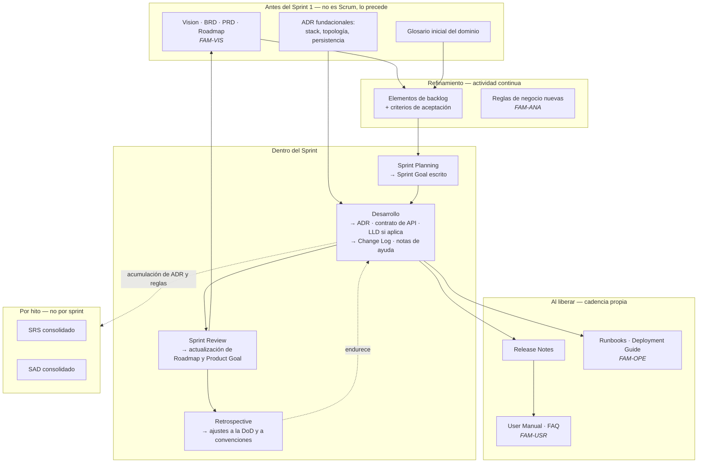

# Scrum y su cuerpo documental — `MET-SCRUM`

## Resumen ejecutivo

Scrum define tres artefactos y ningún documento. Product Backlog, Sprint Backlog e Incremento son las únicas piezas que la Scrum Guide 2020 nombra como artefactos, y ninguna de ellas es documentación técnica en el sentido de las siete familias de esta guía. Eso no significa que un equipo Scrum no documente: significa que el marco no le dice qué documentar, y que la respuesta la tiene que dar el propio equipo en un lugar concreto —la **Definition of Done**—.

Ese es el eje de este documento. La Definition of Done es el único mecanismo dentro de Scrum que convierte el trabajo documental en trabajo obligatorio y financiado, porque un incremento que no cumple la DoD no es incremento. Todo lo que no esté en la DoD compite con la funcionalidad por el tiempo del sprint, y pierde siempre.

---

## Definición

### Qué es Scrum

Un marco liviano para desarrollar productos complejos, definido en la **Scrum Guide 2020** de Ken Schwaber y Jeff Sutherland. Se apoya en el empirismo —transparencia, inspección y adaptación— y en el pensamiento lean. Su unidad de trabajo es el **Sprint**, un período de un mes o menos dentro del cual se produce un incremento de producto utilizable.

La Guía 2020 define tres responsabilidades, cinco eventos, tres artefactos y tres compromisos:

| Elemento | Componentes |
|----------|-------------|
| Responsabilidades | Product Owner · Scrum Master · Developers |
| Eventos | Sprint (contenedor) · Sprint Planning · Daily Scrum · Sprint Review · Sprint Retrospective |
| Artefactos | Product Backlog · Sprint Backlog · Incremento |
| Compromisos | Product Goal · Sprint Goal · Definition of Done |

Los compromisos son la novedad conceptual de la versión 2020: cada artefacto tiene asociado un compromiso que le da transparencia y contra el cual se mide su progreso. El Product Backlog se compromete con el Product Goal, el Sprint Backlog con el Sprint Goal, el Incremento con la Definition of Done.

### Qué problema resuelve

Reducir el riesgo de construir lo equivocado, mediante ciclos cortos con inspección al final. La cadencia fija cumple una función documental indirecta que suele pasarse por alto: crea momentos periódicos y previsibles en los que revisar el estado de los artefactos. Un equipo con Sprint Review cada dos semanas tiene veintiséis oportunidades anuales de detectar que un documento dejó de ser cierto; un equipo sin cadencia tiene cero, salvo que alguien las genere.

### Qué NO es

No es una metodología de gestión de proyectos, aunque se lo use como tal. No define cómo escribir requisitos: **la Scrum Guide no menciona historias de usuario, ni story points, ni ninguna técnica de estimación**. Los elementos del Product Backlog pueden expresarse en el formato que el equipo elija; el formato de historia de usuario proviene de Extreme Programming y del trabajo de Ron Jeffries y Mike Cohn, no de Scrum.

No prescribe documentación técnica de ningún tipo. Ni SRS, ni SAD, ni ADR, ni runbooks. El marco es deliberadamente silencioso, y ese silencio se interpreta con demasiada frecuencia como prohibición.

No es aplicable a cualquier trabajo. Scrum asume que el trabajo se puede planificar en lotes de duración fija con un objetivo coherente. Trabajo de mantenimiento correctivo, soporte con prioridades cambiantes intradía y operación no encajan; ahí el marco natural es [Kanban](Kanban.md).

### Con qué se lo confunde

Con **agilidad**, de la que es una implementación entre varias. Con un **conjunto de ceremonias**: hay equipos que ejecutan los cinco eventos con puntualidad y no producen incrementos utilizables, lo cual es Scrum en la forma y cascada en el fondo. Con la **gestión del backlog en Jira**, que es una herramienta y no el marco.

La confusión más costosa para esta guía es tomar la ausencia de artefactos documentales en la Guía como afirmación de que no hacen falta. La Guía define lo que Scrum es, no lo que un producto necesita. La documentación técnica cae en el espacio que la DoD debe llenar.

---

## Los artefactos oficiales, leídos como documentación

### Product Backlog

Lista ordenada y emergente de lo que se necesita para mejorar el producto. Es el único artefacto persistente de los tres: el Sprint Backlog muere con el sprint y el Incremento se convierte en producto.

Como pieza documental tiene una propiedad ambigua. Contiene información de análisis —qué debe hacer el sistema, con qué criterios de aceptación— pero no está organizado por tema sino por orden de ejecución, y sus elementos desaparecen del foco al completarse. Un backlog no responde la pregunta «¿qué hace hoy el sistema?»; responde «¿qué falta?». Confundir ambas cosas es el origen del equipo que, tras dieciocho meses, no tiene ninguna vista consolidada de su propio producto y debe reconstruirla leyendo mil doscientos tickets cerrados.

El **Product Goal** es el compromiso asociado: el objetivo de largo plazo del producto. Documentalmente es el punto de contacto con [`FAM-VIS`](../10-Vision/): el Product Goal es la expresión operativa, dentro de Scrum, de lo que el [Vision Document](../10-Vision/) y el Roadmap establecen.

### Sprint Backlog

El Sprint Goal, los elementos seleccionados y el plan para entregarlos. Pertenece a los Developers, que lo actualizan durante el sprint. Su vida útil es de días.

Su valor documental es nulo hacia afuera y alto hacia adentro: es el instrumento de coordinación diaria, no un registro. Intentar convertirlo en documentación —exigir que cada tarea tenga descripción formal, adjuntos y trazabilidad— agrega costo sin destinatario, porque nadie lo va a leer dentro de tres semanas.

### Incremento

La suma del trabajo completado que cumple la Definition of Done. Un sprint puede producir varios incrementos, y el incremento debe ser utilizable independientemente de que se decida liberarlo.

Acá está la bisagra documental de todo el marco: **la documentación exigida por la DoD forma parte del incremento**. Si la DoD dice que un elemento no está terminado sin su entrada en el Change Log y sin la actualización de la especificación de API, entonces el trabajo no se declara hecho sin eso, y el tiempo necesario está dentro del sprint por construcción. Si la DoD no lo dice, el trabajo documental es voluntario, y compite con funcionalidad prometida en una Sprint Review.

---

## La Definition of Done como contrato documental

### Qué es y qué no es

La DoD es la descripción formal del estado del incremento cuando cumple los estándares de calidad requeridos del producto. Se aplica al incremento, no a los elementos individuales, y es un compromiso: si un elemento no la cumple, no se libera ni se presenta en la Sprint Review, y vuelve al Product Backlog.

No es la lista de criterios de aceptación de un elemento. Esa distinción confunde a la mitad de los equipos y vale fijarla con el ejemplo del dominio:

| | Criterios de aceptación | Definition of Done |
|---|-------------------------|--------------------|
| Alcance | Un elemento concreto | Todo incremento, siempre |
| Quién lo define | Product Owner con el equipo | El equipo Scrum (o la organización) |
| Ejemplo | «Al confirmar dos reservas simultáneas de la sala Everest 14:00–15:00, exactamente una prospera y la otra recibe 409 con tres alternativas» | «Todo cambio de contrato público actualiza la especificación OpenAPI y pasa la validación de contrato en CI» |
| Vida útil | La del elemento | Meses; se endurece con la madurez del equipo |
| Qué pasa si no se cumple | El elemento no se acepta | El incremento no existe |

### Por qué es el único lugar donde la documentación se vuelve obligatoria

Scrum no tiene ningún otro mecanismo coercitivo. El Product Owner ordena el backlog por valor, y la documentación rara vez compite bien por valor percibido frente a funcionalidad. El Scrum Master facilita, no decide contenido. Los Developers son autogestionados, lo que significa que la disciplina documental depende de un acuerdo interno. La DoD **es** ese acuerdo, escrito y con consecuencia definida.

De ahí que la calidad documental de un equipo Scrum se pueda predecir leyendo su DoD. Una DoD que dice «código revisado, pruebas pasando, desplegado en staging» produce, con alta probabilidad, un sistema sin ADR, con especificación de API desactualizada y sin runbooks. No por negligencia: porque nada lo exige y el sprint siempre está lleno.

### Criterios documentales por familia

Qué puede exigir una DoD, familia por familia, y qué no conviene exigirle:

| Familia | Criterio razonable en la DoD | Por qué no más |
|---------|------------------------------|----------------|
| [`FAM-VIS`](../10-Vision/) Visión | Nada por elemento | La visión no cambia por sprint; se revisa por evento, no por incremento |
| [`FAM-ANA`](../20-Analisis/) Análisis | Reglas de negocio nuevas registradas; términos nuevos en el glosario | Un [SRS](../20-Analisis/SRS.md) consolidado no se mantiene por incremento sino por hito |
| [`FAM-ARQ`](../30-Arquitectura/) Arquitectura | ADR escrito para toda decisión de alcance supracomponente | Exigir SAD actualizado por sprint genera actualizaciones cosméticas |
| [`FAM-DIS`](../40-Diseno/) Diseño | Contrato público actualizado (OpenAPI, `.proto`, firma de componente) | El LLD por clase parafrasea el código |
| `FAM-OPE` Operativa | Cambios de despliegue o configuración reflejados en la guía correspondiente | El runbook completo requiere haber operado, no haber construido |
| `FAM-DEV` Desarrollo | Entrada en el Change Log; convención nueva incorporada a la [Developer Guide](../60-Desarrollo/Developer-Guide.md) | — |
| `FAM-USR` Usuarios | Nota de ayuda o texto de interfaz revisado si el flujo visible cambió | El manual completo se sincroniza con el release, no con el sprint |

El patrón que emerge: la DoD exige **deltas**, no documentos completos. Lo que cambió en este incremento queda reflejado; la consolidación es otro trabajo, con otro momento, y conviene tratarla como un elemento propio del Product Backlog en lugar de esperar que ocurra sola.

---

## Qué documentación se produce en qué momento del ciclo



El diagrama tiene cuatro cadencias distintas, y confundirlas es el error de planificación documental más común en Scrum. La cadencia del sprint gobierna los deltas. La cadencia del release gobierna lo que el usuario y la operación ven. La cadencia del hito gobierna las consolidaciones. Y hay cosas que no tienen cadencia: los ADR se escriben cuando la decisión ocurre, que puede ser el día tres del sprint o nunca.

### Detalle por evento

**Sprint Planning.** Produce un artefacto escrito que muchos equipos no escriben: el Sprint Goal. Una frase que explica por qué vale la pena este sprint. Su valor documental aparece meses después, cuando alguien reconstruye la historia del producto: veintiséis Sprint Goals cuentan la evolución de un producto mejor que mil doscientos tickets.

**Daily Scrum.** No produce documentación, y no debe producirla. El intento de convertirlo en registro de avance —informes diarios, actualizaciones de estado escritas— es un antipatrón caro: quince minutos de coordinación se transforman en cuarenta de reporte para un lector que no existe.

**Sprint Review.** Es el evento con mayor rendimiento documental por minuto invertido, y el más desaprovechado. Ahí se recoge retroalimentación que ajusta el Product Backlog y, cuando corresponde, el Product Goal y el Roadmap. Lo que se pierde si no se registra: el motivo por el que una funcionalidad cambió de prioridad. Seis meses después nadie recuerda que fue porque el responsable de instalaciones dijo, en la review del sprint 9, que las salas modulares eran el 40 % de las reservas.

**Sprint Retrospective.** Produce cambios a la DoD y a las convenciones de desarrollo. Es el canal por el cual la política documental del equipo evoluciona: cuando la retrospectiva concluye que se perdió tiempo rediscutiendo una decisión, el resultado correcto no es una queja sino una línea nueva en la DoD sobre ADR.

---

## Cómo se financia el trabajo documental

Tres modelos, con consecuencias distintas.

**Dentro de la DoD.** El trabajo documental está incluido en cada elemento y su costo está en la estimación. Es el modelo que funciona. Su condición es que la DoD exija deltas pequeños y verificables; una DoD que exige «documentación actualizada» sin especificar qué es inaplicable y se ignora dentro de tres sprints.

**Como elemento propio del backlog.** Para trabajo documental que no corresponde a ningún incremento: consolidar el SRS, escribir la guía de despliegue, reconstruir el modelo de datos. Funciona si el Product Owner entiende su valor, y conviene expresar ese valor en términos de riesgo evitado —«sin esto, incorporar a alguien nuevo cuesta tres semanas»— y no como higiene abstracta.

**Como porcentaje reservado de capacidad.** Un 10 o 15 % del sprint dedicado a deuda técnica y documental. Es el modelo más frágil: el porcentaje es lo primero que se sacrifica ante un compromiso de fecha, y su erosión no es visible porque nadie mide qué documentación no se escribió.

El modelo que no funciona, y que es el más frecuente, es el implícito: se espera que la gente documente porque es lo correcto. En un sprint con capacidad comprometida, documentar significa entregar menos, y ningún incentivo del marco premia esa elección.

### Cómo se estima

El trabajo documental incluido en la DoD no se estima por separado; forma parte del tamaño del elemento, como las pruebas. Un equipo que estima «esto son 3 puntos, más 1 de documentación» está declarando que la documentación es opcional, y la va a recortar cuando el sprint se complique.

Para el trabajo documental que es elemento propio, la unidad de estimación es la misma que el resto. **ISO/IEC/IEEE 26515** —documentación de usuario en desarrollo ágil— sostiene exactamente este punto: la documentación se planifica, se estima y se gestiona como cualquier otro elemento de trabajo, y el equipo de documentación participa de los mismos eventos que el resto.

---

## Aplicación por escenario

### `ESC-1` — Desarrollo de software nuevo

Es el escenario para el que Scrum fue diseñado y donde su cuerpo documental funciona con menos ajustes. Lo que hay que resolver es la asimetría del inicio: los primeros sprints necesitan documentación que todavía no tiene incremento del cual colgarse. El Product Goal, el glosario inicial y los ADR fundacionales —stack, topología, estrategia de persistencia— no son deltas de ningún elemento de backlog.

La solución practicable es un *Sprint 0* acotado o, mejor, tratar esos artefactos como los primeros elementos del Product Backlog con su propio valor declarado. Extender el Sprint 0 a un mes de documentación previa reproduce la cascada con vocabulario nuevo.

El riesgo específico de `ESC-1` en Scrum es la ilusión de que la consolidación va a ocurrir por acumulación. Veintiséis sprints de deltas correctos no producen un SAD; producen veintiséis conjuntos de deltas. La consolidación necesita su propio elemento de backlog, y el momento natural es antes de cada release mayor.

Variación por contexto. En `CTX-1` la DoD debe exigir los cuatro estados de cada pantalla nueva y, en Blazor Server, el comportamiento ante caída del circuito; sin esa exigencia el desarrollador implementa el camino feliz porque es lo único especificado. En `CTX-2` la exigencia central es el contrato: especificación actualizada y validada en CI. En `CTX-3`, la traza vertical del elemento —requisito, pantalla, endpoint, tabla, caso de prueba— es lo que la DoD debe pedir, porque es lo único que ningún artefacto individual garantiza.

### `ESC-2` — Migración a otro lenguaje o plataforma

Scrum encaja peor de lo que parece, y conviene decir por qué antes de adoptarlo por inercia. Una migración tiene una condición de terminación definida por paridad de comportamiento, no por valor incremental descubierto. El backlog no emerge: se deriva de un inventario de lo que el sistema viejo hace. Y el incremento «utilizable» es discutible cuando el 60 % del sistema todavía corre en la plataforma vieja.

Dicho eso, la cadencia sirve, y el ajuste documental es concreto. La DoD de una migración incorpora un criterio que en `ESC-1` no existe: **paridad demostrada**. Un módulo migrado no está terminado sin la fila correspondiente en la tabla de equivalencias y sin el conjunto de pruebas que compara origen y destino sobre los mismos casos.

Sistema de reserva de salas, migración de ASP.NET MVC a Blazor Server. La DoD del sprint incluye: por cada vista migrada, entrada en la tabla de equivalencias que indique qué controlador y qué vista del origen cubre; ADR si la migración obligó a decidir algo distinto —por ejemplo, mantener estado en el circuito en lugar de en `TempData`—; y registro explícito de lo que se decidió **no** migrar, que es lo que nadie escribe y lo que produce el reclamo del usuario tres meses después.

El Sprint Goal en migración tiene una forma distinta y útil: «los usuarios del área de instalaciones operan íntegramente sobre la interfaz nueva» es un objetivo verificable; «migrar el módulo de salas» es una tarea disfrazada.

### `ESC-3` — Evaluación de software existente con acceso al código

Scrum como método de trabajo del evaluador es marginal —una evaluación es un trabajo con entregable definido, más cercano a un proyecto que a un producto—, pero **Scrum como objeto de evaluación** es central, porque los rastros del método explican los huecos documentales que se encuentran.

Qué buscar y qué se infiere:

| Evidencia observable | Inferencia | Confianza |
|----------------------|------------|-----------|
| Existe una DoD escrita y versionada | El equipo tenía criterio documental explícito | Alta |
| La DoD menciona documentación específica | Los artefactos que menciona probablemente existen y están razonablemente vigentes | Media-alta |
| Tickets cerrados con criterios de aceptación completos | El refinamiento era real; los requisitos son reconstruibles desde el backlog | Media |
| Commits agrupados en ventanas regulares de 10-14 días | Trabajo por sprints | Media |
| Carpeta `docs/adr/` con numeración continua | Disciplina de decisiones; el racional arquitectónico es recuperable | Alta |
| Wiki con última edición hace catorce meses | La documentación no estaba en la DoD | Alta |

La conclusión operativa para el evaluador: si existe una DoD, el cuerpo documental esperable se puede predecir leyéndola, y lo que no está en la DoD probablemente no exista. Es un atajo de enorme rendimiento al planificar la reconstrucción.

Variación por contexto: en `CTX-2` el indicio más rápido es si la especificación de API está en el repositorio y si el pipeline la valida; en `CTX-1`, si existe algún registro de flujos y estados más allá de los componentes.

### `ESC-4` — Evaluación de un producto solo desde afuera

Se infiere la cadencia, no el marco. Notas de versión publicadas con regularidad de dos o tres semanas, agrupando varios cambios, sugieren iteraciones fijas; publicación irregular con parches sueltos sugiere flujo continuo. La existencia de un roadmap público con horizontes trimestrales sugiere Product Goal gestionado.

Ninguna de estas observaciones permite afirmar que la organización usa Scrum, y el informe debe decirlo así. La utilidad no está en nombrar el marco sino en estimar previsibilidad: un proveedor con cadencia estable y notas de versión completas es un proveedor cuya evolución se puede planificar; uno cuyas notas dicen «mejoras y correcciones» durante ocho versiones seguidas no permite planificar nada, y eso es un riesgo documentable en una decisión de compra.

---

## Ejemplos concretos

### Un sprint del sistema de reserva de salas, con su rastro documental

Equipo de cinco personas, `CTX-3`, Blazor Server sobre ASP.NET Core y EF Core, sprints de dos semanas. Sprint 9.

**Sprint Goal.** «El responsable de instalaciones puede reservar salas modulares y ver cómo la combinación de módulos afecta la disponibilidad del resto.»

**Elementos seleccionados y documentación que cada uno genera:**

| Elemento | Trabajo funcional | Documentación producida | Exigida por |
|----------|-------------------|-------------------------|-------------|
| `PBI-207` Modelar salas divisibles en módulos | Entidad `Modulo`, relación con `Sala`, migración | `RN-019` regla de composición en el glosario de reglas; entrada de modelo de datos con el índice nuevo | DoD: reglas de negocio nuevas registradas |
| `PBI-208` Disponibilidad considerando módulos | Reescritura del cálculo de solapamiento | `ADR-018`: cálculo en base de datos con constraint de exclusión por módulo, en lugar de en memoria; alternativa descartada y motivo | DoD: ADR ante decisión supracomponente |
| `PBI-209` Selector de módulos en el alta de reserva | Componente `SelectorModulos.razor` | Flujo `FLU-07` con los cuatro estados y el comportamiento ante reconexión del circuito | DoD: estados de pantalla documentados (`CTX-1`) |
| `PBI-210` Exponer módulos en `GET /salas` | Cambio de contrato, campo `modulos[]` | OpenAPI actualizado, validado en CI; entrada en Change Log marcando cambio compatible | DoD: contrato público actualizado |
| `PBI-211` Consolidar el SRS con las reglas de los sprints 5 a 9 | — | Sección de reglas de negocio del [SRS](../20-Analisis/SRS.md) consolidada | Elemento propio de backlog, no DoD |

`PBI-211` es la pieza que la mayoría de los equipos omite. No tiene valor funcional visible, no se demuestra en la Sprint Review y es la única que evita que a los dieciocho meses no exista ninguna vista consolidada del sistema. Su justificación de valor se escribió en el propio elemento: «sin esto, el análisis de impacto de un cambio en reservas requiere leer 40 tickets cerrados».

**Lo que no se documentó, deliberadamente.** No se escribió LLD de `SelectorModulos.razor`: el componente tiene ciento veinte líneas, tres parámetros y sus pruebas describen el comportamiento. No se actualizó el SAD: la decisión del sprint quedó en `ADR-018` y el SAD se consolida antes del release. No se actualizó el manual de usuario: la funcionalidad está detrás de una bandera y el manual se sincroniza con el release. Las tres omisiones son decisiones, no descuidos, y las tres están cubiertas por la política documental del equipo.

### Dos Definitions of Done comparadas

**DoD de un equipo con problemas documentales previsibles:**

```
- Código revisado por al menos un par
- Pruebas unitarias pasando
- Desplegado en el entorno de integración
- Product Owner lo aceptó
```

Nada obliga a registrar decisiones ni a mantener contratos. A los seis meses: sin ADR, con OpenAPI escrito a mano y desactualizado, con reglas de negocio dispersas en el código. El equipo no hizo nada mal según su propio contrato.

**DoD con criterios documentales:**

```
Funcional
- Criterios de aceptación verificados por alguien distinto de quien implementó
- Pruebas automatizadas cubren el camino feliz y al menos dos casos de error

Documental
- Toda regla de negocio nueva o modificada, registrada con ID RN-* 
- Todo término de dominio nuevo, en el glosario
- ADR escrito si la decisión afecta a más de un componente, si es
  costosa de revertir o si se descartó una alternativa razonable
- Contrato público (OpenAPI / firma de componente compartido) actualizado
  y validado en CI
- Entrada en el Change Log con la clasificación de compatibilidad
- Si cambió un flujo visible: estados vacío / cargando / con datos / error
  documentados, más comportamiento ante reconexión del circuito

Operación
- Cambios de configuración o de despliegue reflejados en la guía de despliegue
- Métricas y trazas del camino nuevo, verificadas en el entorno de integración
```

La segunda es más larga y, contra la intuición, más barata de cumplir, porque cada criterio produce un delta pequeño en el momento en que la información está fresca. La primera es más barata por elemento y produce una deuda que se paga completa en la primera migración.

---

## Preguntas guía

- ¿La Definition of Done del equipo menciona algún artefacto documental concreto, o solo criterios de código y despliegue?
- ¿Qué documentación se produjo en el último sprint, y quién la pidió?
- Si el Product Owner tuviera que elegir entre un elemento funcional y la consolidación del SRS, ¿con qué argumento se defiende la consolidación?
- ¿Existe alguna vista consolidada del producto —qué hace hoy el sistema— o solo el backlog de lo que falta?
- ¿Los Sprint Goals de los últimos seis sprints están escritos en algún lugar recuperable?
- Cuando la retrospectiva detecta una decisión rediscutida, ¿se cambia la DoD o solo se comenta?
- ¿El trabajo documental está dentro de la estimación de los elementos, o es un extra que se recorta bajo presión?

---

## Criterios de calidad y antipatrones

### Criterios de calidad del cuerpo documental de un equipo Scrum

**La DoD nombra artefactos concretos y verificables.** «Documentación actualizada» no es un criterio; «OpenAPI validado contra el código en CI» sí lo es, porque se puede comprobar sin discutir.

**Existe consolidación periódica y planificada.** Alguien es dueño de que, cada cierto número de sprints, los deltas se conviertan en una vista consolidada. Sin esto, el equipo acumula fragmentos correctos y ninguna respuesta a «¿qué hace el sistema?».

**Los ADR se escriben en el sprint de la decisión.** Un ADR con fecha posterior a la implementación es una racionalización, y se nota: enumera una sola alternativa.

**Lo que no se documenta está decidido, no omitido.** El equipo puede explicar por qué no escribe LLD, y esa explicación está escrita.

**La documentación de usuario y de operación tiene cadencia de release, no de sprint.** Sincronizarla con el sprint produce reescritura constante de material que todavía cambia.

### Antipatrones

**«Scrum no pide documentación».** El razonamiento es formalmente correcto y prácticamente desastroso: el marco no pide documentación porque no pide **nada** sobre el contenido del producto. Tampoco pide pruebas automatizadas ni control de versiones.

**DoD decorativa.** Existe, está pegada en la pared y nadie la aplica. Se detecta preguntando cuándo fue la última vez que un elemento volvió al backlog por no cumplirla. Si la respuesta es nunca, la DoD no es un compromiso sino una aspiración.

**El sprint de documentación al final del proyecto.** Concentrar en una iteración lo que debió producirse en veinte. Ya tratado en [`MET-MANIFIESTO`](Manifiesto-y-Documentacion.md#antipatrones); en Scrum toma la forma particular del «sprint de estabilización» que además absorbe deuda técnica y pruebas.

**El backlog como especificación completa.** Refinar en detalle seis meses de trabajo para tener una especificación. Es cascada con tickets: el 40 % de ese detalle se descarta y el costo ya se pagó.

**Confundir criterios de aceptación con DoD.** Produce elementos con veinte criterios donde la mitad son estándares de calidad que deberían aplicar a todo, repetidos en cada tarjeta y divergentes entre sí.

**Documentar en el Daily.** Convertir el evento de coordinación en reporte de estado escrito.

**Definir la DoD por sprint.** La DoD es estable y se endurece con la madurez del equipo. Una DoD que se negocia cada sprint según el compromiso asumido no es un compromiso.

**Atribuirle a Scrum lo que no dice.** Exigir story points, historias de usuario en formato canónico o velocidad como métrica de productividad, en nombre de la Scrum Guide. La Guía no define ninguna de las tres, y presentarlas como obligatorias desplaza la discusión sobre lo que el equipo realmente necesita.

---

## Anexo — Plantilla de Definition of Done con criterios documentales

Se acuerda al formarse el equipo y se revisa en retrospectiva. Cada línea debe poder verificarse sin discutir: si dos personas razonables pueden estar en desacuerdo sobre si un criterio se cumplió, el criterio está mal escrito.

```markdown
# Definition of Done — <equipo> — <producto>
Vigente desde: AAAA-MM-DD · Última revisión: AAAA-MM-DD
Aplica a: todo incremento. Un elemento que no cumpla esta lista vuelve al
Product Backlog y no se presenta en la Sprint Review.

## 1. Funcional
- [ ] Criterios de aceptación verificados por alguien distinto del autor
- [ ] Pruebas automatizadas: camino feliz + al menos ___ casos de error
- [ ] Sin regresiones en la suite existente

## 2. Análisis  — FAM-ANA
- [ ] Reglas de negocio nuevas o modificadas registradas con ID `RN-*`
      → ¿alguien fuera del equipo podría entender la regla sin leer el código?
- [ ] Términos de dominio nuevos incorporados al glosario
      → ¿el término se llama igual en interfaz, API y base de datos?

## 3. Arquitectura — FAM-ARQ
- [ ] ADR escrito si se cumple alguna condición:
      · la decisión afecta a más de un componente
      · revertirla costaría más de ___ días
      · se descartó una alternativa razonable
      → el ADR incluye alternativas evaluadas y consecuencia aceptada

## 4. Diseño y contratos — FAM-DIS
- [ ] Contrato público actualizado (OpenAPI / .proto / firma de componente
      compartido) y validado automáticamente en CI
- [ ] Cambios de esquema con migración versionada y reversible
      → ¿un consumidor externo se rompe con este cambio? Si sí, ¿está anunciado?

## 5. Interfaz — solo CTX-1 / CTX-3
- [ ] Estados documentados: vacío · cargando · con datos · error
- [ ] Comportamiento ante reconexión del circuito (Blazor interactive server)
- [ ] Criterios de accesibilidad verificables, no adjetivos

## 6. Desarrollo — FAM-DEV
- [ ] Entrada en el Change Log con clasificación de compatibilidad
- [ ] Convención nueva incorporada a la Developer Guide (no queda como costumbre)

## 7. Operación — FAM-OPE
- [ ] Cambios de configuración o despliegue reflejados en la guía correspondiente
- [ ] Métricas, trazas y alertas del camino nuevo verificadas fuera de local
      → ¿alguien que no construyó esto podría diagnosticarlo a las 3 AM?

## 8. Usuario — FAM-USR (si el flujo visible cambió)
- [ ] Textos de interfaz revisados
- [ ] Nota para el equipo de soporte / entrada de ayuda contextual
      → el manual completo se sincroniza con el release, no acá

## Excepciones registradas
| Fecha | Elemento | Criterio no cumplido | Motivo | Cuándo se salda |
|-------|----------|----------------------|--------|-----------------|

## Lo que deliberadamente NO exigimos
| Artefacto | Por qué no | Qué lo suple |
|-----------|-----------|--------------|
| LLD por clase | El código y las pruebas lo expresan | Nombres de prueba descriptivos |
| SAD actualizado por sprint | Genera cambios cosméticos | ADR + consolidación antes del release |
```

Las dos últimas tablas son las que distinguen una DoD viva de una declarativa. La de excepciones convierte el incumplimiento en deuda registrada con fecha de saldo, en lugar de en silencio. La de exclusiones convierte la omisión en decisión defendible, que es exactamente lo que un auditor en `ESC-3` va a querer ver.

---

## Continuación

El mismo problema —financiar el trabajo documental— resuelto sin iteraciones fijas, mediante políticas explícitas por columna: [`MET-KANBAN`](Kanban.md). Los criterios para elegir entre ambos según escenario, contexto, tamaño de equipo y marco regulatorio: [`MET-COMPARATIVA`](Comparativa-y-Criterios.md).
