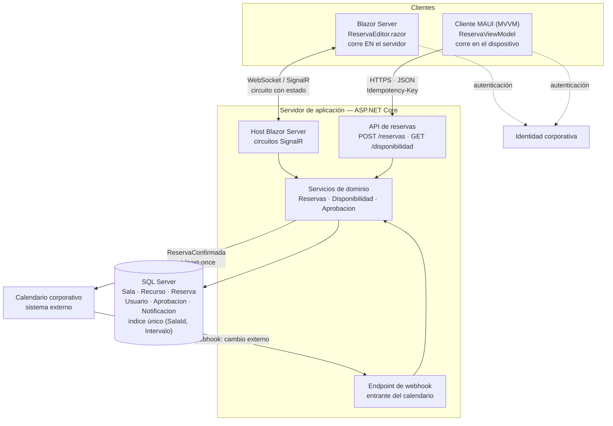
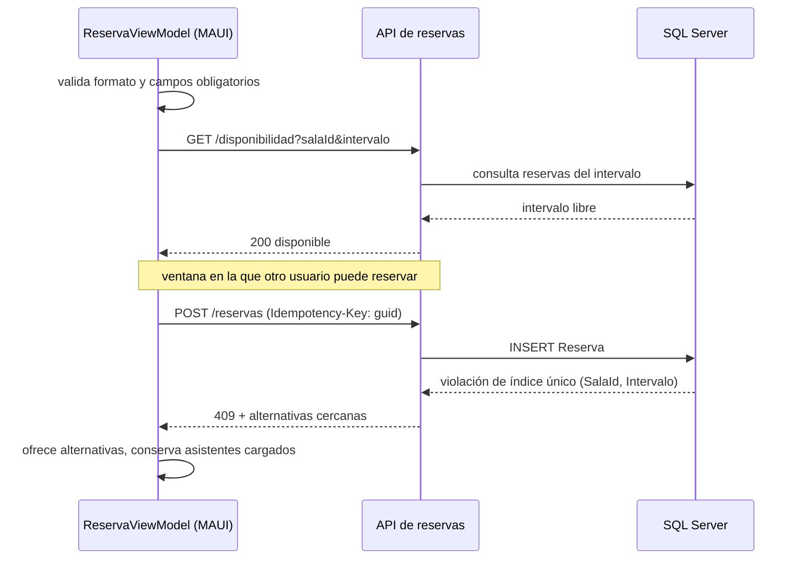
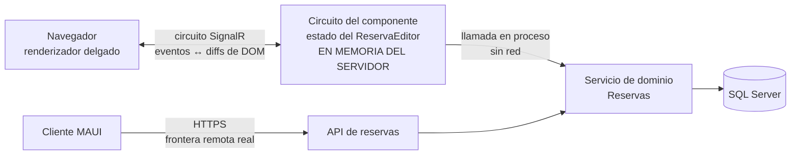

# Cliente-servidor — `ARQ-CS`

## Resumen ejecutivo

Cliente-servidor reparte el sistema entre procesos que piden y procesos que atienden, y coloca la frontera entre ambos en un punto que el equipo elige. Esa elección es el contenido del modelo: no hay una manera canónica de partir un sistema en cliente y servidor, hay una decisión sobre qué corre en cada lado, qué viaja por la red y quién custodia el estado. Todo lo demás —protocolos, formatos, tecnologías— se deriva.

Documentalmente, el modelo tiene una consecuencia que lo distingue del resto del catálogo: convierte la **vista de despliegue** en la pieza vertebral del [SAD](../30-Arquitectura/SAD.md) y a la **especificación de API** en el contrato más consultado del proyecto. En un monolito de capas la frontera entre módulos es una convención que el compilador puede ayudar a sostener; entre cliente y servidor hay una red de por medio, y una red introduce latencia, fallo parcial, reintento y duplicado. Lo que en un proceso único era una llamada a método pasa a ser un protocolo con códigos de error, tiempos límite y semántica de repetición, y nada de eso se deduce leyendo la firma de una operación.

El destinatario natural de este documento es `ACT-03`, que decide dónde poner la frontera; su lector más frecuente es `ACT-04`, que la implementa a ambos lados; y su revisor obligado es `ACT-06`, porque un reparto cliente-servidor mal documentado se manifiesta como un incidente de operación y no como un defecto de código.

---

## Definición

### Qué es

Un estilo arquitectónico en el que el sistema se organiza en dos roles asimétricos que se comunican por un protocolo de petición y respuesta. El **cliente** inicia la interacción, conoce la dirección del servidor y espera una respuesta. El **servidor** no conoce a sus clientes de antemano, permanece a la escucha y atiende peticiones concurrentes de muchos de ellos.

La asimetría es lo definitorio. No es que un lado tenga interfaz y el otro no —un servicio puede ser cliente de otro sin exhibir pantalla alguna—, sino que uno inicia y el otro responde. Un proceso puede ser servidor de unos y cliente de otros al mismo tiempo: la API de reservas es servidor del cliente Blazor y cliente del calendario corporativo.

Los rasgos que el modelo impone y que hay que documentar:

- **Separación de procesos.** Cliente y servidor son unidades de despliegue distintas, con ciclos de vida, versiones y ventanas de actualización propios.
- **Frontera de confianza.** El servidor no controla al cliente. Todo lo que llega del cliente es entrada no confiable, incluso cuando el cliente lo escribió el mismo equipo.
- **Custodia del estado.** El estado autoritativo vive del lado del servidor; el cliente sostiene, como mucho, una copia con vigencia limitada.
- **Multiplicidad.** Un servidor atiende a muchos clientes simultáneos, lo que introduce concurrencia sobre recursos compartidos —en el sistema de reservas, sobre `RN-007`— aunque cada cliente sea de un solo usuario.

### Qué problema resuelve

Centralizar lo que no puede estar disperso. Los datos compartidos, las reglas cuya violación tiene consecuencias, la identidad de quien opera y la integración con sistemas de terceros necesitan un punto único de autoridad, y ese punto es el servidor. Sin él, dos usuarios que reservan la misma sala a la misma hora ambos creen haber reservado, porque cada cliente decidió con su propia copia de la información.

Resuelve también un problema de despliegue: permite cambiar la regla sin tocar los clientes. Si `RN-007` se amplía para admitir un margen de limpieza de quince minutos entre reservas, esa modificación se despliega una vez en el servidor y rige de inmediato para el cliente web y para el móvil. La misma ampliación en un sistema donde la regla vive en cada cliente exige una campaña de actualización y un período en que conviven dos criterios.

### Qué no es

**No es sinónimo de "aplicación web".** Una aplicación web es cliente-servidor, pero también lo es un cliente MAUI contra una API, un cliente de correo contra IMAP y un proceso batch contra un servidor de base de datos. Confundirlos lleva a documentar el modelo como si el protocolo fuera necesariamente HTTP y el cliente necesariamente un navegador, y a no tener respuesta cuando aparece un consumidor que no es ninguna de las dos cosas.

**No es un modelo de capas.** Es la confusión central y merece su propio apartado, más abajo.

**No es una topología de escalado.** Que haya un servidor lógico no dice cuántos procesos lo materializan. La documentación que trata "el servidor" como un nodo único deja sin especificar lo que más duele en producción: si hay varias instancias, dónde vive el estado de sesión y si el balanceador necesita afinidad.

**No es una alternativa a microservicios ni al modelo hexagonal.** Opera en otro eje. Un sistema de microservicios está compuesto de relaciones cliente-servidor; un servicio hexagonal expone un adaptador HTTP que lo convierte en servidor. Los tres modelos se combinan; no se eligen entre sí. El cruce está desarrollado en [Comparativa y criterios](Comparativa-y-Criterios.md).

### `tier` físico contra `layer` lógico

Esta distinción es la que más malentendidos produce y la que la documentación resuelve o perpetúa.

Un **layer** es una división lógica de responsabilidades dentro del código: presentación, aplicación, dominio, infraestructura. Es una decisión de organización interna, la impone la disciplina del equipo y su violación se detecta leyendo referencias entre proyectos. Es materia de [Modelo de capas](Modelo-de-Capas.md).

Un **tier** es una división física en procesos o nodos desplegables separados. Es una decisión de topología, la impone la red y su violación es imposible: no se puede llamar a un método que corre en otro proceso sin atravesar el protocolo.

La confusión aparece porque el diagrama clásico de tres capas y el de tres tiers se dibujan igual. Pero un monolito de tres layers desplegado en un único proceso es **una sola tier**, y un sistema de dos tiers puede tener cinco layers dentro del servidor. Los ejes son ortogonales.

| | `layer` (capa lógica) | `tier` (nivel físico) |
|---|---|---|
| Naturaleza | Organización del código | Unidad de despliegue |
| Frontera sostenida por | Convención y revisión | Red y proceso |
| Costo de cruzarla | Llamada a método | Serialización, latencia, fallo parcial |
| Se documenta en | HLD, vista de módulos del SAD | Vista de despliegue del SAD |
| Se cambia | Refactorizando | Redesplegando |
| Puede fallar parcialmente | No | Sí |

La prueba práctica para distinguirlas: si al mover una responsabilidad de un lado al otro hay que serializar algo, es un tier. Si basta con mover un archivo de proyecto, es un layer.

El término **n-tier** agrega una tercera confusión. Nombra la variante con un nivel intermedio de aplicación entre el cliente y la base de datos, y suele usarse como si fuera un modelo distinto de cliente-servidor cuando es su caso más común: cliente, servidor de aplicación, servidor de datos, tres tiers y tres relaciones cliente-servidor encadenadas. Lo relevante para la documentación no es cuántas tiers hay sino dónde está cada frontera y qué contrato la gobierna.

---

## Documentación que exige el modelo

Adoptar cliente-servidor no agrega documentos al catálogo; redistribuye su peso y cambia el contenido obligatorio de varios. Lo que en un monolito de proceso único era una nota se convierte acá en la sección que más se consulta.

### Peso por familia

| Familia | Peso bajo `ARQ-CS` | Qué cambia concretamente |
|---------|-------------------|--------------------------|
| Visión | Sin cambio | El modelo es invisible al negocio; solo aparece si hay una restricción de conectividad o de dispositivo |
| Análisis | Medio-alto | Las reglas de negocio deben declarar de qué lado se verifican; los casos de uso ganan flujos alternativos por fallo de comunicación |
| Arquitectura | **Máximo** | Vista de despliegue como pieza central; ADR sobre ubicación de la frontera y del estado de sesión |
| Diseño | Alto, desplazado | El contrato desplaza al detalle interno: la API Specification es el artefacto de diseño más leído |
| Operativa | **Máximo** | Runbooks de fallo parcial, orden de despliegue, compatibilidad entre versiones desplegadas |
| Desarrollo | Medio | Convenciones de manejo de errores, reintentos y serialización, comunes a ambos lados |
| Usuarios | Sin cambio en peso, sí en contenido | El manual debe cubrir los estados de degradación que el modelo hace posibles |

La familia que más gana no es Arquitectura sino Operativa, y ese es el punto que suele omitirse. Un sistema en un proceso falla entero o funciona entero; un sistema cliente-servidor tiene modos de fallo intermedios —el servidor vive pero la base no responde, el cliente no alcanza al servidor, el servidor responde tarde— y cada uno necesita un procedimiento escrito. La documentación operativa que solo contempla "está caído" o "está arriba" es insuficiente por construcción.

### SAD

La [vista de despliegue](../30-Arquitectura/SAD.md) deja de ser una de las vistas y pasa a ser la que ordena a las demás. Bajo este modelo debe fijar, como mínimo:

**Los nodos y qué corre en cada uno.** No "servidor web" sino qué proceso, con qué runtime, en cuántas instancias y detrás de qué balanceador.

**Los canales y su naturaleza.** Protocolo, dirección de la iniciativa, síncrono o asíncrono, y quién inicia la conexión. El webhook del calendario corporativo invierte la dirección respecto del resto: es el sistema externo quien llama, y eso obliga a exponer un endpoint entrante con su propio esquema de autenticación.

**La ubicación del estado de sesión.** Es la decisión que más consecuencias operativas tiene y la que con más frecuencia queda sin escribir. Hay que decir dónde vive —memoria del proceso, almacén distribuido, token en el cliente—, cuánto dura, qué pasa al reiniciar una instancia y si el balanceador necesita afinidad. Tres respuestas posibles con tres perfiles operativos distintos:

| Ubicación del estado | Escalado horizontal | Qué se pierde al reiniciar | Exige afinidad |
|---------------------|---------------------|---------------------------|----------------|
| Memoria del proceso servidor | Requiere afinidad de sesión | Toda la sesión activa | Sí |
| Almacén distribuido (cache o base) | Libre | Nada, si el almacén sobrevive | No |
| Token firmado en el cliente | Libre | Nada; el estado viaja | No |

La tercera columna es la que hay que documentar aunque la decisión sea la primera. Estado en memoria es una opción legítima; estado en memoria **sin afinidad documentada** es un incidente esperando su turno.

**Las zonas de confianza.** Qué canal es interno, cuál atraviesa Internet, dónde termina el cifrado y qué componente ejecuta la autorización. Alimenta directamente la [arquitectura de seguridad](../30-Arquitectura/Arquitectura-de-Seguridad.md).

Las decisiones que sostienen ese reparto se registran una por una en [ADR](../30-Arquitectura/ADR.md). Las tres que ningún proyecto cliente-servidor debería dejar sin registrar: dónde se puso la frontera y qué se evaluó, dónde vive el estado de sesión, y qué política de compatibilidad rige entre versiones de cliente y servidor.

### HLD

Se desdobla. Deja de haber un HLD y pasa a haber uno por unidad desplegable, más un documento de costura que describe el contrato entre ellas. La descomposición interna del servidor y la del cliente son problemas distintos con vocabularios distintos: en el servidor se habla de servicios, repositorios y transacciones; en el cliente MAUI, de ViewModels, comandos y navegación.

El error frecuente es escribir un HLD único que mezcla ambos, con lo cual el desarrollador de cliente lee páginas de persistencia que no le sirven y no encuentra lo que necesita, que es el catálogo de operaciones remotas con su comportamiento ante fallo.

### LLD

Aparece una categoría de diseño que en un proceso único no existe: el **cliente de la API**. Alguien tiene que decidir y documentar cómo se implementa la política de reintento, el tiempo límite por operación, el manejo del `409` de conflicto de sala y la generación de la `Idempotency-Key`. Si eso no queda escrito, cada pantalla lo resuelve a su manera y el sistema desarrolla tantas políticas de reintento como desarrolladores tuvo.

Del lado servidor, el LLD gana la especificación de los mecanismos de control de concurrencia. Que exista el índice único `(SalaId, Intervalo)` es una decisión de modelo de datos; qué hace el servidor cuando la base rechaza la inserción por violación de ese índice —traducirla a `409`, consultar alternativas, componer el cuerpo de la respuesta— es diseño detallado y no se deduce del esquema.

### Modelo de datos

Gana dos secciones que en un sistema monoproceso son opcionales.

La primera es la de **concurrencia**: qué restricciones defienden las reglas de negocio en la base, qué nivel de aislamiento se usa y qué estrategia de bloqueo. `RN-007` es el ejemplo canónico. Puede sostenerse comprobando en memoria antes de insertar, y eso falla bajo concurrencia; puede sostenerse con el índice único `(SalaId, Intervalo)`, y entonces la regla vive en el esquema y el código traduce el error; puede sostenerse con bloqueo pesimista sobre la sala. Las tres son válidas y producen comportamientos observables distintos ante dos peticiones simultáneas. El modelo de datos debe decir cuál se eligió.

La segunda es la de **datos replicados en el cliente**. Si el cliente MAUI mantiene un catálogo local de salas, ese catálogo es parte del modelo de datos del sistema, con su propia definición de vigencia y su procedimiento de sincronización, aunque no viva en SQL Server.

### Especificación de API

Es el artefacto que el modelo vuelve imprescindible y el que concentra la mayor densidad de uso diario. Bajo `ARQ-CS` no basta con enumerar rutas y esquemas; el contrato debe cerrar cuatro cuestiones que la firma de la operación no expresa.

**Códigos de error con semántica de negocio.** No alcanza con documentar que `POST /reservas` puede devolver `409`. Hay que decir que el `409` significa que la sala quedó ocupada entre la consulta de disponibilidad y la confirmación, que el cuerpo enumera alternativas cercanas, y que la acción correcta del cliente es ofrecerlas sin perder los datos ya cargados —no reintentar—. Un `409` y un `503` exigen conductas opuestas del cliente, y quien escribe el cliente no puede adivinarlo.

**Tiempos límite.** Cuánto puede tardar cada operación en el peor caso aceptable, y qué hace el cliente al vencer ese plazo. El plazo debe ser una propiedad documentada del contrato, no una constante que cada consumidor elige.

**Reintentos.** Qué operaciones son seguras de reintentar, con qué espera entre intentos y cuántas veces. El tiempo límite vencido es el caso peligroso: el cliente no sabe si el servidor procesó la petición o no, y sin una regla escrita elegirá reintentar, que es exactamente cuando aparece la reserva duplicada.

**Idempotencia.** El mecanismo que hace seguro ese reintento. `POST /reservas` es idempotente respecto de la cabecera `Idempotency-Key`: un reintento con la misma clave devuelve la reserva ya creada con `200` en lugar de crear una segunda con `201`. La especificación debe declarar además cuánto tiempo el servidor recuerda una clave, porque un reintento fuera de esa ventana vuelve a ser una creación.

A eso se suma la **política de versionado y compatibilidad**, que es una obligación del modelo y no un refinamiento. Cliente y servidor se despliegan por separado, luego coexisten versiones distintas, luego hay que escribir qué cambios son compatibles hacia atrás, cuánto tiempo se sostiene una versión anterior y cómo se fuerza la actualización de un cliente móvil que no se puede actualizar de forma remota.

### Runbooks

El modelo genera procedimientos operativos que no existirían sin él. Los cuatro que ningún sistema cliente-servidor debería tener sin escribir:

1. **Servidor no alcanzable desde los clientes**, con la distinción entre servidor caído, red interrumpida y balanceador mal configurado, porque los tres se ven igual desde el cliente y se resuelven distinto.
2. **Degradación por dependencia externa**, cuando el calendario corporativo no responde: qué se sigue pudiendo hacer, qué queda encolado y cómo se reprocesa después.
3. **Despliegue con clientes de versión anterior activos**, con el orden entre servidor y cliente y el criterio de compatibilidad que lo justifica.
4. **Reinicio de instancia con sesiones activas**, que depende directamente de la decisión de estado de sesión registrada en el SAD y es la razón por la cual esa decisión tiene que estar escrita.

### Lo que pierde peso

La documentación de estructura interna de módulos importa menos que en un monolito modular, porque la frontera que hay que cuidar es la remota y las internas se pueden reorganizar sin afectar a nadie externo. Y la documentación de arranque y composición del sistema es más simple que en microservicios, donde el orden de inicio y el descubrimiento de servicios son problemas en sí mismos.

---

## Aplicación por escenario

### `ESC-1` — Desarrollo de software nuevo

La decisión está abierta y hay que tomarla temprano, porque condiciona todo lo posterior. Lo que se documenta no es "usamos cliente-servidor" —casi todo sistema conectado lo es— sino **dónde se pone la frontera**: qué operaciones se exponen como contrato remoto, qué validaciones se duplican deliberadamente en el cliente por experiencia de usuario y cuáles solo existen en el servidor.

El orden productivo es el del [SAD](../30-Arquitectura/SAD.md) hacia el contrato: primero la vista de despliegue con nodos y canales, después el ADR de ubicación del estado de sesión, después la especificación de API, y recién entonces el diseño interno de cada lado. Invertirlo —diseñar el servidor y derivar el contrato de lo que quedó implementado— produce APIs que reflejan la estructura interna del servidor en lugar de las necesidades del cliente, que es el origen más común de la conversación chatty descrita en los antipatrones.

La trampa del escenario es tratar el contrato como documentación posterior. En `ESC-1` el contrato es la primera pieza que permite trabajar a dos equipos en paralelo, y si no existe antes que el código, no habilita nada.

### `ESC-2` — Migración

Es donde el modelo produce el trabajo documental más pesado, porque la migración suele mover la frontera y no solo la tecnología. El caso característico de esta guía es el paso de ASP.NET MVC —render en servidor, estado en sesión de servidor, formularios con `POST` completo— a Blazor con render mode *interactive server*, donde el estado vive en el circuito y las interacciones son mensajes sobre SignalR. Ambos son cliente-servidor y la frontera está en lugares distintos.

Lo que hay que producir, además del SAD de origen y el de destino:

| Pieza | Contenido | Por qué es específica del modelo |
|-------|-----------|----------------------------------|
| Tabla de equivalencias de frontera | Qué operación del origen se convierte en qué operación del destino | La correspondencia no es uno a uno cuando la frontera se mueve |
| Inventario de estado de sesión | Qué guarda hoy la sesión de servidor y dónde va a vivir mañana | Es el punto donde las migraciones de este tipo se rompen |
| Criterio de paridad de comportamiento remoto | Qué respuestas y códigos de error deben coincidir | La paridad funcional no garantiza paridad de contrato |
| Plan de convivencia | Si origen y destino coexisten, qué cliente habla con qué servidor | Determina si hace falta una capa de compatibilidad |

El comportamiento no especificado que los usuarios dan por hecho suele concentrarse justo acá: el tiempo que sobrevive una sesión, qué pasa al abrir dos pestañas, si el botón de retroceso del navegador conserva el formulario. Nada de eso está escrito en el sistema origen y todo eso se nota cuando cambia.

### `ESC-3` — Evaluación con acceso al código

El modelo se reconstruye desde evidencia de despliegue antes que desde el código, porque la topología deja rastros más confiables que las intenciones. Las fuentes en orden de fiabilidad: los archivos de configuración de despliegue y las variables de entorno, que dicen qué proceso habla con cuál; las cadenas de conexión y las URL base configuradas; los controladores y endpoints expuestos; los clientes HTTP registrados en la inyección de dependencias; y por último los comentarios, que no son evidencia.

Dos hallazgos son especialmente valiosos y especialmente frecuentes. El primero es la **frontera no documentada**: consumidores del servidor que nadie recuerda —un script, un informe, una integración vieja— y que aparecen en los registros de acceso, no en el repositorio. El segundo es la **regla duplicada divergente**: una validación que existe en el cliente y en el servidor con criterios que ya no coinciden. Detectarla exige comparar las dos implementaciones, y su hallazgo se documenta como riesgo con la evidencia de ambos lados.

Sobre el estado de sesión, la reconstrucción tiene que llegar hasta la configuración real de producción, no hasta lo que dice el código. Un servidor que guarda sesión en memoria detrás de un balanceador sin afinidad funciona la mayor parte del tiempo y falla de manera intermitente; el código no lo revela, la configuración del balanceador sí.

### `ESC-4` — Evaluación externa

Aplica con confianza baja, y sin embargo es de los pocos rasgos arquitectónicos parcialmente observables desde afuera, porque el protocolo es la superficie del producto.

| Observable | Qué permite inferir | Confianza |
|-----------|--------------------|-----------|
| Patrón de URLs y verbos | Existencia de una API con estilo REST | Media |
| Cabeceras de respuesta y cookies | Mecanismo de sesión y presencia de balanceador | Media |
| Comportamiento al perder conexión | Si el cliente tiene copia local o depende del servidor para todo | Media |
| Latencia por tipo de operación | Grado de chattiness del cliente | Baja |
| Mensajes de error ante entrada inválida | Si la validación es de cliente, de servidor o de ambos | Media |

La última fila merece atención porque es la más informativa: enviar una entrada que el formulario rechaza, pero por un canal que evita el formulario, revela si el servidor valida por su cuenta. Y acá el límite ético de `ESC-4` es preciso: observar el comportamiento del producto con la propia cuenta es relevamiento; forzar límites, probar credenciales ajenas o eludir controles es intrusión, y corresponde pedir acceso y pasar a `ESC-3`.

Lo que no se puede inferir desde afuera: dónde vive el estado de sesión más allá de la señal de las cookies, cómo está descompuesto el servidor por dentro, y si detrás de la fachada hay un monolito o veinte servicios. Toda afirmación sobre esos puntos es hipótesis y se marca como tal.

### Variación por contexto

**`CTX-1` — Web y cliente interactivo.** El foco documental se va a lo que el usuario percibe del modelo, que es la latencia y el fallo. Cada pantalla relevante necesita sus cuatro estados —vacío, cargando, con datos, con error— y en este modelo el estado "cargando" no es decorativo: es la manifestación visible de la frontera remota. Se agrega un quinto estado propio de Blazor Server, el de circuito en reconexión, con la definición de qué ve el usuario y qué pasa con el trabajo a medio hacer.

**`CTX-2` — Backend y servicios.** El cliente es otro programa, y el contrato pasa a ser todo el producto. Las cuatro cuestiones de la especificación de API —códigos, tiempos límite, reintentos, idempotencia— dejan de ser buenas prácticas y se vuelven la definición de la interfaz. Se agrega la documentación de garantías de entrega para los canales asíncronos: `ReservaConfirmada` se publica *at-least-once*, luego el consumidor deduplica por `reservaId`, y eso hay que escribirlo del lado que publica aunque le cueste al que consume.

**`CTX-3` — Fullstack.** La frontera es una decisión del propio equipo, lo que la vuelve invisible: se puede mover sin negociar con nadie y por eso se mueve sin registrarse. El documento que este contexto exige es el ADR que responda por qué una operación tiene endpoint público y otra equivalente se invoca directamente como servicio del lado servidor. Sin esa regla escrita, la superficie de API crece por acumulación de casos particulares y nadie puede decir cuál es el criterio.

---

## Ejemplos concretos

### El sistema de reservas bajo `ARQ-CS`



Hay cuatro relaciones cliente-servidor en el diagrama y solo dos son obvias. El cliente MAUI contra la API es la canónica. El servidor de aplicación contra SQL Server es la segunda tier de un esquema n-tier. El servidor como cliente del calendario corporativo invierte los roles respecto de la primera. Y el webhook invierte la dirección otra vez: el calendario pasa a ser cliente del sistema de reservas, lo que obliga a un endpoint entrante con autenticación propia, validación de origen y —porque las entregas de webhook se repiten— tratamiento idempotente del evento recibido.

### `RF-014 Confirmar reserva` desde el cliente MAUI

El recorrido completo de la operación, con lo que cada tramo obliga a documentar:



La nota del diagrama marca lo que el modelo hace inevitable: entre la consulta y la confirmación transcurre tiempo, y en ese tiempo el estado autoritativo puede cambiar. Ninguna cantidad de validación en el cliente lo evita. Por eso `RN-007` se defiende en la base con el índice único y no en el ViewModel, y por eso el `409` con alternativas es parte del contrato y no un caso de error genérico.

Si la respuesta al `POST` no llega por vencimiento del tiempo límite, el ViewModel no sabe si la reserva se creó. Reintenta con **la misma** `Idempotency-Key` —no una nueva—, y el servidor devuelve `200` con la reserva ya creada en lugar de crear la segunda. Que la clave se genere una vez por intento del usuario y no una vez por petición HTTP es exactamente el tipo de detalle que vive en el LLD del cliente de la API y que, sin documentar, cada pantalla resuelve mal a su manera.

### El cliente MAUI sin conexión

Es el caso donde el modelo se tensiona hasta casi romperse, y donde la documentación decide si el resultado es utilizable o peligroso.

Un cliente móvil pierde conectividad de forma rutinaria. La pregunta que la arquitectura tiene que contestar, y el SAD registrar, es qué se puede hacer sin servidor. La respuesta correcta no es la más generosa sino la que respeta la custodia del estado:

| Capacidad | Sin conexión | Fundamento |
|-----------|-------------|------------|
| Consultar catálogo de salas y recursos | Sí, con copia local fechada | Cambia poco; el desfase es tolerable y se muestra |
| Consultar reservas propias | Sí, con copia local fechada | Solo lectura; se rotula la fecha del último dato |
| Consultar disponibilidad | No | Depende de reservas ajenas; una copia local miente |
| Crear o modificar reserva | No confirmada; a lo sumo, borrador local | `RN-007` solo se puede verificar contra el estado autoritativo |
| Cancelar reserva | No | Requiere confirmación del servidor para liberar la sala |

La distinción entre "borrador local" y "reserva creada" es la línea que separa un cliente offline correcto de uno que genera conflictos. Un borrador es una intención del usuario guardada en el dispositivo, sin número de reserva, sin sala comprometida y presentada como pendiente de envío. Al recuperar conexión, el envío puede fallar con `409` y la interfaz tiene que estar preparada para decirlo. Un cliente que muestra un borrador como si fuera una reserva confirmada está mintiendo, y el usuario se entera al llegar a una sala ocupada.

Lo que esto exige documentar, y que un cliente conectado no necesita: el modelo de datos local con la vigencia de cada entidad replicada, la política de sincronización, el tratamiento de la cola de operaciones pendientes, y los estados de interfaz que comunican el desfase. Los identificadores de idempotencia se generan al crear el borrador, no al enviarlo, para que el reenvío tras la reconexión sea seguro.

### Blazor Server: el cliente que corre en el servidor

Es el ejemplo más instructivo del documento porque desmiente la lectura ingenua del modelo, según la cual el cliente es lo que corre en la máquina del usuario.

En Blazor con render mode *interactive server*, el componente `ReservaEditor.razor` se ejecuta en el servidor. El navegador mantiene un circuito SignalR sobre WebSocket, envía eventos de interfaz —una tecla, un clic— y recibe fragmentos de DOM a aplicar. El código C# del componente, su estado y sus variables viven en la memoria del servidor.

Esto produce una situación que la documentación tiene que desenredar con precisión:



Hay dos fronteras cliente-servidor y son de naturaleza distinta. La primera, entre navegador y circuito, es una frontera de **presentación**: transporta interacción, no operaciones de negocio. La segunda, entre circuito y servicio de dominio, no es una frontera remota en absoluto: es una llamada a método dentro del mismo proceso. El componente Blazor es, respecto del dominio, un cliente que no atraviesa red.

Las consecuencias documentales de esa asimetría son concretas y suelen sorprender:

**El estado del componente es estado de servidor.** Los asistentes cargados en el formulario ocupan memoria del servidor por cada usuario con la pantalla abierta. El dimensionamiento y el límite de circuitos concurrentes son datos de la vista de despliegue, no del cliente.

**El circuito exige afinidad.** El circuito vive en una instancia concreta; si el balanceador envía la reconexión a otra, el estado no está ahí. La configuración de afinidad de sesión no es un detalle de infraestructura: es una condición para que el sistema funcione, y su ausencia en la documentación de despliegue es de las omisiones más caras del modelo.

**La caída del circuito es un estado de interfaz especificable.** Qué ve el usuario mientras reconecta, cuánto se espera, y qué ocurre con la confirmación que estaba en curso. Si el circuito se cae después de que el servidor procesó `RF-014` pero antes de que la interfaz lo refleje, al reconectar hay que consultar el estado real de la reserva antes de mostrar nada. Sin esa regla, el usuario ve un formulario a medio llenar y vuelve a confirmar.

**La frontera de confianza no se mueve.** Que el componente corra en el servidor no lo convierte en autoridad de dominio. Sigue siendo entrada dirigida por el usuario, y el servicio de dominio valida por su cuenta. La cercanía física invita a saltarse la validación —"si ya lo comprobó el componente"—, y ese atajo es el antipatrón de servidor confiado en su forma más difícil de detectar, porque acá el "cliente" es código propio corriendo en la propia máquina.

**El contrato del dominio no desaparece por ser local.** Las mismas operaciones que la API expone al cliente MAUI las invoca el componente Blazor en proceso. Si esa lógica está duplicada en dos lugares, `RN-007` tiene dos implementaciones que divergirán. La documentación de `CTX-3` que resuelve esto es el ADR sobre qué se expone como endpoint y qué se invoca directamente, con la regla de que el servicio de dominio es el mismo en ambos caminos y la API es una fachada sobre él, no una implementación paralela.

### El mismo caso en ASP.NET MVC

Vale como contraste porque mueve la frontera otra vez. En MVC clásico el navegador envía un `POST` de formulario completo, el servidor procesa y responde con una página entera o una redirección. El cliente es genuinamente delgado, no hay circuito, no hay estado de componente en el servidor —hay estado de sesión, que es otra cosa— y la granularidad de la interacción es la página.

| | ASP.NET MVC | Blazor interactive server | MAUI + API |
|---|---|---|---|
| Dónde corre la lógica de interfaz | Servidor, por petición | Servidor, en circuito persistente | Dispositivo |
| Unidad de interacción | Petición de página | Evento de interfaz | Llamada a operación |
| Estado entre interacciones | Sesión de servidor o formulario | Circuito en memoria | Estado del ViewModel |
| Efecto de perder la red | Error de navegación | Circuito en reconexión | Modo sin conexión |
| Exige afinidad de sesión | Según dónde viva la sesión | Sí | No |
| Contrato remoto explícito | Rutas y formularios | Ninguno hacia el dominio | API versionada |

La última fila es la que decide el peso de la especificación de API. Con MAUI en el catálogo de clientes, el contrato remoto existe y hay que documentarlo con las cuatro cuestiones ya enumeradas. Sin él, en un producto solo web sobre Blazor Server, la API pública puede no ser necesaria, y forzarla produce una capa de indirección que nadie consume. Es una decisión legítima en ambos sentidos, y el ADR que la registre evita que se rediscuta.

---

## Preguntas guía

Sobre la frontera:

- ¿Dónde está exactamente la frontera remota, y qué criterio decidió que estuviera ahí y no un paso más adentro o más afuera?
- ¿Cuántas relaciones cliente-servidor tiene realmente el sistema, contando las que invierten la dirección habitual?
- ¿Qué operación se expone como endpoint y cuál se invoca en proceso? ¿Está escrito el criterio o se resuelve caso por caso?

Sobre el estado:

- ¿Dónde vive el estado de sesión, cuánto dura y qué se pierde al reiniciar una instancia?
- ¿El despliegue exige afinidad de sesión? ¿Está documentado en la vista de despliegue y configurado en el balanceador?
- ¿Qué datos replica el cliente, con qué vigencia, y qué se le muestra al usuario cuando esa copia está desactualizada?

Sobre el contrato:

- ¿Un desarrollador que escribe un cliente nuevo puede saber, leyendo solo la especificación, qué hacer ante cada código de error?
- ¿Qué operaciones son seguras de reintentar y con qué clave de idempotencia? ¿Cuánto tiempo el servidor recuerda esa clave?
- ¿Está escrito el tiempo límite de cada operación, o cada consumidor elige el suyo?
- ¿Qué versiones de cliente y servidor pueden coexistir, y por cuánto tiempo?

Sobre la confianza y el fallo:

- ¿Qué validación existe solo en el cliente? Si un cliente la omitiera, ¿el servidor lo detendría?
- ¿Cuántas idas y vueltas al servidor exige la operación más frecuente del sistema?
- ¿Están escritos los modos de fallo intermedios, o solo "arriba" y "abajo"?

---

## Criterios de calidad y antipatrones

### Qué distingue una documentación buena del modelo

Una documentación suficiente de `ARQ-CS` permite responder tres preguntas sin abrir el código: qué corre en cada nodo, qué contrato gobierna cada canal y dónde vive el estado. Si las tres tienen respuesta escrita, el resto se deriva. La verificación práctica: entregar la documentación a alguien que deba escribir un cliente nuevo y observar cuántas veces necesita preguntar. Cada pregunta es un hueco localizado.

Un segundo criterio, en el vocabulario de **ISO/IEC 25010**: el modelo compromete de manera característica la *fiabilidad* —por el fallo parcial que introduce la red— y la *eficiencia de desempeño* —por la latencia de cada cruce—, a cambio de *mantenibilidad* y *escalabilidad*. Una descripción de arquitectura que no nombre ese intercambio no explicó por qué se eligió el modelo. **ISO/IEC/IEEE 42010** aporta el encuadre correspondiente: la vista de despliegue es un punto de vista con interesados propios, y su interesado principal acá es `ACT-06`, que debe poder operar el sistema leyéndola.

### Antipatrones

**Cliente gordo con reglas de negocio duplicadas.** El cliente reimplementa reglas que ya viven en el servidor, con el argumento razonable de evitar viajes de red. El problema no es la duplicación en sí —anticipar `RN-007` en el cliente para dar retroalimentación inmediata es correcto— sino la duplicación **no declarada**. La versión sana documenta que la comprobación del cliente es una cortesía de experiencia de usuario, que la autoridad es el servidor, y que ante desacuerdo prevalece el servidor. La versión enferma tiene dos implementaciones que cada equipo cree autoritativas, y divergen en el primer cambio de regla. Síntoma diagnóstico: la regla cambia en el servidor y nadie sabe si hay que tocar el cliente.

**Servidor que confía en la validación del cliente.** La forma más grave y la más simple de enunciar: el servidor omite una comprobación porque el formulario ya la hace. Falla ante cualquier consumidor que no sea ese formulario —otro cliente, una petición construida a mano, una versión anterior de la aplicación móvil que sigue instalada—. En un producto con cliente MAUI el riesgo es permanente, porque hay versiones viejas en dispositivos que nadie puede actualizar. La regla es que toda entrada externa se valida en el servidor sin excepción, y la excepción tentadora es Blazor Server, donde el "cliente" es código propio en la propia máquina y la validación parece redundante.

**Chattiness.** La operación que el usuario percibe como una acción exige diez o veinte idas y vueltas, porque el contrato se derivó de la estructura interna del servidor en lugar de las necesidades del cliente. Una pantalla de reserva que consulta la sala, después el recurso, después cada asistente por separado funciona bien en la red del desarrollador y mal en la del usuario móvil. Se detecta contando peticiones por interacción; se corrige diseñando el contrato desde el caso de uso. La documentación que lo previene es la que enumera, junto a cada flujo, cuántas llamadas remotas lo componen.

**Estado de sesión en memoria del servidor sin afinidad documentada.** El sistema funciona en desarrollo con una instancia y falla de manera intermitente en producción con tres, y el síntoma —sesiones que se pierden sin patrón aparente— no apunta a su causa. La decisión de guardar sesión en memoria es legítima; lo que la vuelve un antipatrón es que la condición que la sostiene, la afinidad en el balanceador, viva en la cabeza de quien la configuró. En Blazor Server el caso es más agudo porque el circuito no es opcional: siempre hay estado en memoria, y la afinidad es obligatoria.

**Frontera dibujada pero no decidida.** El SAD tiene un diagrama con una caja "cliente" y una caja "servidor" y una flecha entre ambas, y ninguna frase que explique qué se evaluó para ponerla ahí. Es la versión de este modelo del diagrama de cajas sin decisión justificada. El remedio es un [ADR](../30-Arquitectura/ADR.md), no un diagrama mejor.

**Contrato derivado del código sin revisión.** La especificación se genera desde las anotaciones del servidor y nadie la lee como contrato. El resultado es sintácticamente exacto y semánticamente vacío: están los esquemas y los códigos, falta lo que significan. Un `409` documentado como "Conflict" no le dice al desarrollador del cliente qué hacer. Generar la especificación desde el código es buena práctica; publicarla sin la semántica de negocio añadida a mano no lo es.

---

## Anexo — Lista de verificación del modelo cliente-servidor

Se recorre al cerrar el SAD y se revisa en cada cambio de topología. Cada campo lleva la pregunta que lo guía; un campo sin respuesta es un hueco, no una omisión aceptable.

```markdown
## Ficha de aplicación de ARQ-CS — <sistema> — <fecha> — <autor>

### 1. Encuadre
- **Escenario**: ESC-_        ¿Estoy decidiendo la frontera, migrándola, reconstruyéndola o infiriéndola?
- **Contexto**: CTX-_         ¿El contrato relevante es con una persona, con otro programa, o con ambos?
- **Actor que firma**: ACT-_  ¿Quién tiene autoridad sobre esta decisión y quién la revisa?

### 2. Inventario de fronteras
Una fila por cada relación cliente-servidor, incluidas las que invierten la dirección habitual.

| # | Cliente | Servidor | Protocolo | Quién inicia | Síncrono | Atraviesa Internet |
|---|---------|----------|-----------|--------------|----------|--------------------|

  ¿Están todas? ¿Conté la base de datos, los sistemas externos y los webhooks entrantes?
  ¿Hay algún consumidor que no esté en la lista y que aparezca en los registros de acceso?

### 3. Reparto de responsabilidades
- **Solo en el servidor**:            ¿Qué regla, si el cliente la omitiera, comprometería la integridad?
- **Duplicado deliberadamente**:      ¿Qué se anticipa en el cliente por experiencia, sabiendo que el servidor decide?
- **Solo en el cliente**:             ¿Qué es puramente presentación y no tiene consecuencia de dominio?
- **Regla de precedencia**:           Ante desacuerdo entre cliente y servidor, ¿cuál prevalece y está escrito?

### 4. Estado
- **Estado de sesión — ubicación**:   ¿Memoria del proceso, almacén distribuido o token en el cliente?
- **Duración y caducidad**:           ¿Cuánto vive y qué la renueva?
- **Afinidad requerida**:             ¿El balanceador necesita afinidad? ¿Está configurada y documentada?
- **Pérdida al reiniciar**:           ¿Qué se pierde si una instancia se reinicia con sesiones activas?
- **Datos replicados en el cliente**: ¿Qué entidades, con qué vigencia y qué se muestra si están viejas?

### 5. Contrato
- **Especificación**:                 ¿Dónde vive, se genera o se mantiene a mano, y quién la valida contra el código?
- **Códigos de error con semántica**: Por cada código, ¿qué debe hacer el cliente al recibirlo?
- **Tiempos límite por operación**:   ¿Cuál es el plazo aceptable y qué hace el cliente al vencerlo?
- **Operaciones reintentables**:      ¿Cuáles y con qué espera entre intentos?
- **Idempotencia**:                   ¿Qué clave, generada por quién, recordada cuánto tiempo?
- **Garantías de entrega asíncrona**: ¿At-least-once, at-most-once? ¿Quién deduplica y por qué campo?
- **Versionado y coexistencia**:      ¿Qué versiones conviven, por cuánto y cómo se fuerza una actualización?

### 6. Fallo y degradación
- **Modos de fallo enumerados**:      ¿Están los intermedios o solo "arriba" y "abajo"?
- **Comportamiento sin servidor**:    Por capacidad, ¿disponible, degradada o bloqueada?
- **Runbooks asociados**:             ¿Existe procedimiento para cada modo de fallo listado?
- **Orden de despliegue**:            ¿Servidor primero o cliente primero, y qué lo justifica?

### 7. Costo de la frontera
- **Llamadas por caso de uso principal**: ¿Cuántas idas y vueltas exige la operación más frecuente?
- **Volumen por respuesta**:             ¿El cliente recibe lo que necesita o lo que el servidor tenía a mano?
- **Peor red contemplada**:              ¿Sobre qué condiciones de red se validó el diseño?

### 8. Decisiones registradas
- **ADR de ubicación de la frontera**:    ¿Existe y enumera las alternativas descartadas?
- **ADR de estado de sesión**:            ¿Existe y explicita la consecuencia operativa elegida?
- **ADR de política de compatibilidad**:  ¿Existe y fija la ventana de soporte de versiones anteriores?
```

Las secciones 4 y 6 son las que con más frecuencia quedan incompletas y las que más incidentes explican. Si el tiempo alcanza solo para dos, son esas.

---

## Enlaces

**Marco de referencia.** [Escenarios](../00-Marco-de-Referencia/Escenarios.md) · [Contextos](../00-Marco-de-Referencia/Contextos.md) · [Actores](../00-Marco-de-Referencia/Actores.md) · [Convenciones](../00-Marco-de-Referencia/Convenciones.md)

**Documentación de la decisión.** [Familia de arquitectura](../30-Arquitectura/README.md) · [SAD](../30-Arquitectura/SAD.md) · [ADR](../30-Arquitectura/ADR.md)

**Modelos hermanos.** [Índice de modelos](README.md) · [Modelo de capas](Modelo-de-Capas.md) · [Monolítico](Monolitico.md) · [Hexagonal](Hexagonal.md) · [Microservicios](Microservicios.md) · [Comparativa y criterios](Comparativa-y-Criterios.md)

**Referencias de industria.** ISO/IEC 25010 para el vocabulario de atributos de calidad usado al enunciar el intercambio del modelo; ISO/IEC/IEEE 42010 para el tratamiento de la vista de despliegue como punto de vista con interesados propios; *Patterns of Enterprise Application Architecture*, de Martin Fowler, para el tratamiento de la distribución y el costo de atravesar una frontera de proceso.
