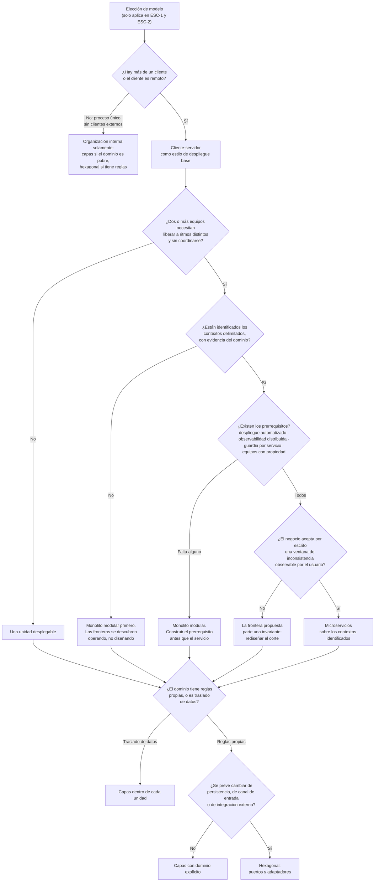
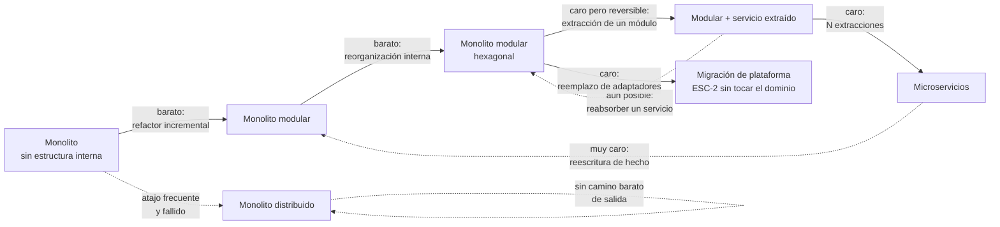

# Comparativa de modelos y criterios de elección — `ARQ-COMPARATIVA`

## Resumen ejecutivo

Los cinco modelos anteriores se describieron por separado; este documento los pone frente a los mismos criterios para que la elección deje de ser una preferencia y pase a ser una decisión defendible. El instrumento de comparación son las características de calidad de **ISO/IEC 25010**, porque un modelo de arquitectura no es mejor ni peor en abstracto: es mejor para un conjunto de atributos y peor para otro, y lo único que un arquitecto puede hacer es elegir qué sacrificar.

Contiene la tabla comparativa por atributos, los criterios de elección cruzados con los escenarios `ESC-1` a `ESC-4` y los contextos `CTX-1` a `CTX-3`, las combinaciones habituales entre modelos —que son la norma y no la excepción—, un árbol de decisión ejecutable y los caminos de evolución entre modelos, con los puntos a partir de los cuales volver atrás deja de ser realista.

Su destinatario natural es `ACT-03`, en el momento de escribir el ADR de elección de estilo. Su segundo destinatario es `ACT-01`, que suele llegar a la discusión con un modelo ya elegido por lectura de blogs y necesita el vocabulario para expresar el resultado de negocio que lo motivaba.

---

## Definición del problema de elección

Elegir un modelo de arquitectura consiste en repartir capacidad de cambio. Todo sistema tiene ejes por los que va a cambiar mucho y ejes por los que no va a cambiar casi nada, y un modelo de arquitectura hace baratos los cambios en unos ejes a costa de encarecerlos en otros. Hexagonal abarata cambiar de tecnología de persistencia o de canal de entrada, y encarece cada funcionalidad trivial que ahora debe atravesar un puerto. Microservicios abaratan desplegar una parte sin tocar el resto, y encarecen cualquier cambio que cruce dos servicios. Un monolito en capas abarata todo cambio que no cruce la frontera de despliegue, y no ofrece ninguna respuesta cuando dos equipos necesitan liberar a ritmos distintos.

La pregunta útil, por lo tanto, no es cuál es el mejor modelo sino **por dónde va a cambiar este sistema en los próximos tres años, y quién va a tener que cambiarlo**. La segunda mitad de esa pregunta es organizativa y pesa tanto como la primera, por la razón que la ley de Conway describe: la estructura de comunicación de la organización termina reflejándose en la estructura del sistema, y una arquitectura que contradice al organigrama se erosiona hasta parecerse a él.

Lo que este documento **no** hace es recomendar un modelo por defecto para todo caso. Sí sostiene una asimetría de riesgo, que es distinto: las decisiones que agregan fronteras de despliegue son mucho más caras de revertir que las que agregan fronteras internas, de modo que ante incertidumbre genuina conviene diferir las primeras y no las segundas.

---

## Comparativa por atributos de calidad ISO/IEC 25010

La escala es relativa entre los cinco modelos, no absoluta: **alto**, **medio**, **bajo** indican posición comparada, y todas las celdas suponen que el modelo está bien aplicado. Un microservicio mal cortado no rinde lo que la fila de microservicios promete; rinde peor que un monolito.

Se usan las características del modelo de calidad de producto de **ISO/IEC 25010**. La revisión de 2023 reorganizó parte de la taxonomía —entre otras cosas, reformuló usabilidad como capacidad de interacción y separó flexibilidad de portabilidad—; la comparación siguiente se apoya en las características cuya interpretación no cambia entre versiones.

| Característica ISO/IEC 25010 | `ARQ-CS` | `ARQ-CAPAS` | `ARQ-MONO` | Monolito modular | `ARQ-HEX` | `ARQ-MICRO` |
|------------------------------|----------|-------------|------------|------------------|-----------|-------------|
| Adecuación funcional | Neutral | Neutral | Alta | Alta | Alta | Media: la funcionalidad que cruza servicios se degrada |
| Eficiencia de desempeño | Media: cada llamada es de red | Alta | Alta: llamadas en proceso | Alta | Media: indirección adicional | Baja por operación, alta en escalado selectivo |
| Compatibilidad | Alta: el contrato es explícito | Baja: no expone nada por sí | Media | Media | Alta: cada adaptador es un punto de integración | Alta: contratos obligatorios y versionados |
| Capacidad de interacción | Depende del cliente | Neutral | Neutral | Neutral | Neutral | Baja: la consistencia eventual se vuelve visible |
| Fiabilidad | Media: el fallo de red es un modo propio | Alta | Alta: falla todo junto o nada | Alta | Alta | Media: más modos de fallo, pero fallo parcial posible |
| Seguridad | Media: superficie expuesta acotada | Neutral | Alta: un solo perímetro | Alta | Alta: el adaptador concentra la validación | Baja de partida: N perímetros, tráfico interno a proteger |
| Mantenibilidad | Neutral | Media: degrada con el crecimiento | Baja a largo plazo si no hay módulos | Alta | Alta: el núcleo se prueba sin infraestructura | Alta dentro del servicio, baja entre servicios |
| Portabilidad y flexibilidad | Media | Baja: la capa de datos ata el dominio | Baja | Media | Alta: es el atributo que el modelo compra | Alta por servicio |

Tres lecturas cruzadas que la tabla sostiene y conviene hacer explícitas.

La columna de microservicios no es una columna de altos. Compra escalado selectivo, autonomía de despliegue y aislamiento de fallo, y paga con desempeño por operación, seguridad de partida, consistencia observable y mantenibilidad de todo lo que cruce una frontera. Quien la elija esperando mejorar todo a la vez eligió mal.

La columna de monolito modular es la más plana de la tabla, y esa es precisamente su propiedad: no destaca en nada y no se hunde en nada. Por eso funciona tan bien como punto de partida cuando el conocimiento del dominio todavía es bajo.

La fila de mantenibilidad es la única donde el monolito sin modularizar aparece con un valor claramente malo, y eso explica la confusión que el documento de [monolítico](Monolitico.md) desmonta: lo que la industria criticó bajo el nombre de monolito fue casi siempre una carencia de estructura interna, no la unidad de despliegue.

### Comparativa por costo documental

La misma comparación desde el ángulo de esta guía. El costo se mide en artefactos que hay que producir y, sobre todo, **mantener sincronizados con el sistema**, que es donde la documentación fracasa.

| Artefacto | `ARQ-CS` | `ARQ-CAPAS` | `ARQ-MONO` modular | `ARQ-HEX` | `ARQ-MICRO` |
|-----------|----------|-------------|--------------------|-----------|-------------|
| SAD | Vista de despliegue obligatoria | Vista lógica obligatoria | Mapa de módulos | Vista lógica con puertos | Todas las vistas, y ninguna opcional |
| HLD | Uno | Uno, con regla de dependencia | Uno, con interfaces publicadas | Uno, con catálogo de puertos | Uno por servicio |
| Especificación de API | Obligatoria | Puede no existir | Una, externa | Una por adaptador de entrada | Una por servicio, versionada, más eventos |
| Modelo de datos | Uno | Uno, central | Uno con esquemas por módulo | Dos: dominio y persistencia | N, más mapa de propiedad y de duplicación |
| Runbooks | Dos: cliente y servidor | Uno | Uno | Uno, con matriz puerto-adaptador | Uno por servicio, más degradación y saga fallida |
| ADR característico | Dónde vive el estado de sesión | Excepciones a la regla de dependencia | Frontera de módulo | Qué se convierte en puerto y qué no | Corte de servicios y política de consistencia |
| Artefactos que solo existen aquí | — | — | Registro de interfaces publicadas | Ficha de puerto | Ficha de servicio, catálogo de eventos, matriz de compatibilidad de versiones |

El salto de costo no es gradual: está concentrado en la columna de microservicios, y su origen es identificable. Cada frontera de red convierte una llamada a método —que el compilador verifica en cada compilación, gratis— en un contrato que hay que escribir, versionar, probar y operar. La documentación deja de ser un apoyo y pasa a ser el único mecanismo de verificación que queda.

---

## Criterios de elección

### Por escenario

| Escenario | Naturaleza de la elección | Criterio dominante |
|-----------|--------------------------|--------------------|
| `ESC-1` Desarrollo nuevo | Decisión abierta, la única vez que lo es plenamente | Preservar opciones: elegir el modelo más barato que satisfaga los atributos exigidos, no el que anticipa un crecimiento hipotético |
| `ESC-2` Migración | Doble: se hereda un modelo de origen y se decide uno de destino | Aislar lo que se conserva de lo que se reemplaza; el modelo de destino debe permitir migrar por partes |
| `ESC-3` Evaluación con código | No hay elección: hay un hallazgo | Nombrar el modelo real, no el declarado, y medir la distancia entre ambos |
| `ESC-4` Evaluación externa | Hipótesis, con confianza baja | Distinguir lo observable de lo supuesto y no afirmar estilo interno |

En `ESC-1` el sesgo a vencer es el de anticipación: se elige la arquitectura del sistema que se espera tener en cinco años, cuando el conocimiento del dominio está en su punto más bajo. Las fronteras de servicio trazadas en la semana dos se trazan sobre el organigrama y sobre las entidades visibles, que son los dos peores criterios disponibles.

En `ESC-2` el modelo de destino tiene un requisito que en `ESC-1` no existe: debe admitir convivencia. Una migración que solo puede cortarse de una vez es una migración sin ensayo, y hexagonal es el modelo que mejor la sostiene, porque el adaptador es la unidad natural de corte: el dominio se conserva y los adaptadores de ASP.NET MVC se reemplazan por adaptadores de Blazor Server sin tocar la lógica de `RN-007`.

En `ESC-3` la tarea es de nomenclatura honesta. Un sistema que se presenta como hexagonal pero cuyo proyecto de dominio referencia `Microsoft.EntityFrameworkCore` no es hexagonal, y la distancia entre la arquitectura declarada y la observada es en sí misma el hallazgo de mayor valor de la evaluación. En `ESC-4` la organización interna es indetectable: se puede inferir el reparto en unidades de despliegue por dominios, cabeceras y patrones de fallo parcial, y nada más.

### Por contexto

| Contexto | Qué pesa en la elección | Modelos que suelen quedar |
|----------|------------------------|---------------------------|
| `CTX-1` Web y cliente interactivo | Dónde vive el estado de sesión y qué se pierde ante una desconexión | Cliente-servidor con organización interna en capas o hexagonal |
| `CTX-2` Backend y servicios | Autonomía de despliegue, contratos, garantías de entrega | Monolito modular o microservicios, con hexagonal dentro |
| `CTX-3` Fullstack | La frontera cliente-servidor como decisión, y la traza vertical | Monolito modular hexagonal desplegado como cliente-servidor |

En `CTX-1` la discusión de modelos se reduce con frecuencia a una sola pregunta, y en Blazor con render mode *interactive server* esa pregunta es qué vive en el circuito. Es una decisión de arquitectura de pleno derecho, con consecuencias de escalado y de comportamiento ante reconexión, y merece su ADR.

En `CTX-3` aparece el criterio que más frecuentemente se omite: la traza vertical. Cuantas más fronteras de despliegue tenga el sistema, más caro es sostener la cadena que va del `RF-014` del SRS a la pantalla, al endpoint, a la tabla y al caso de prueba. Un sistema partido en seis servicios tiene seis modelos de datos y ninguna traza automática entre ellos; en un monolito modular la traza es una referencia de proyecto.

---

## Combinaciones habituales

Los modelos se componen, y las combinaciones frecuentes son más informativas que los modelos puros porque son lo que se encuentra en producción.

| Combinación | Coherencia | Cuándo tiene sentido |
|-------------|-----------|---------------------|
| Monolito modular + hexagonal + cliente-servidor | Coherente y muy frecuente | Aplicación de línea de negocio con un equipo y dominio con reglas | 
| Monolito + capas + cliente-servidor | Coherente | CRUD con poca lógica, equipo chico, vida útil corta |
| Microservicios + hexagonal por servicio | Coherente | Servicios densos en reglas, con integraciones que cambian |
| Microservicios + capas por servicio | Coherente | Servicios de consulta o de integración con poca lógica propia |
| Monolito modular con un servicio extraído | Coherente | Un módulo con perfil de escalado o de disponibilidad distinto al resto |
| Microservicios con base de datos compartida | Incoherente | Nunca: es un monolito distribuido con el costo de ambos |
| Hexagonal + capas simultáneos y estrictos | Redundante | Rara vez: dos reglas de dependencia compitiendo confunden más de lo que ordenan |
| Microservicios sin autonomía de despliegue | Incoherente | Nunca: se paga el costo sin cobrar el beneficio |

La primera fila merece detenerse. Un monolito modular organizado en hexagonal y desplegado como cliente-servidor no es una contradicción ni un compromiso tibio: es una unidad desplegable —monolito— con fronteras internas explícitas entre `Salas`, `Disponibilidad`, `Reservas`, `Aprobaciones`, `Notificaciones` e `Informes` —modular—, donde cada módulo aísla su dominio detrás de puertos —hexagonal—, servido por HTTP a un cliente Blazor Server y a un cliente MAUI —cliente-servidor—. Cada término describe un eje distinto y ninguno contradice a otro. Que la pregunta «¿es un monolito o es hexagonal?» se formule con tanta frecuencia indica que la distinción entre eje de despliegue y eje de organización interna es la que más falta hace explicitar.

Las dos filas incoherentes comparten causa: se adoptó la forma del modelo sin la propiedad que lo justifica. Microservicios con base compartida conserva la palabra y pierde la independencia de datos; microservicios sin autonomía de despliegue conserva los procesos separados y pierde la única ventaja que compensaba el costo.

---

## Árbol de decisión

Se recorre de arriba hacia abajo. Cada nodo de decisión responde a una restricción verificable, no a una preferencia, y el resultado se registra en un ADR con las alternativas descartadas.



Dos nodos concentran casi todo el valor del árbol. El de los prerrequisitos organizacionales, porque es el que más se saltea: la decisión de microservicios se toma como decisión técnica y se descubre como decisión organizativa dieciocho meses después, cuando nadie está de guardia para el servicio de aprobaciones. Y el de la ventana de inconsistencia, porque convierte una discusión de infraestructura en una pregunta de negocio que tiene respuesta verificable: si nadie firma que la reserva puede aparecer confirmada en una pantalla y todavía no en otra durante veinte segundos, entonces `Reservas` y `Disponibilidad` no pueden ser servicios distintos.

---

## Caminos de evolución y puntos de no retorno

Los sistemas cambian de modelo, y esos cambios no son simétricos. Extraer un servicio de un monolito modular es un proyecto acotado; devolver seis servicios a un monolito es una reescritura. Esa asimetría es el criterio central de esta sección.



| Transición | Costo | ¿Reversible? | Qué la dispara legítimamente |
|-----------|-------|--------------|------------------------------|
| Monolito → monolito modular | Bajo, incremental | Sí | Nadie encuentra dónde vive una regla |
| Capas → hexagonal | Medio, por módulo | Sí | Cambio previsto de persistencia o de canal |
| Monolito modular → extraer un servicio | Medio-alto | Sí, aún | Un módulo con perfil de escalado o disponibilidad distinto |
| Extraer varios → microservicios | Alto | En la práctica, no | Varios equipos bloqueándose entre sí en cada liberación |
| Microservicios → monolito modular | Muy alto | Reescritura | Corte de fronteras equivocado descubierto tarde |
| Cambio de plataforma con hexagonal | Medio | Sí | `ESC-2`: el dominio se conserva, los adaptadores se reemplazan |

### Los puntos de no retorno

Hay tres, y ninguno es técnico en su origen.

**El primero es la partición de los datos.** Mientras las tablas de todos los módulos vivan en la misma base, `RN-007` se garantiza con una transacción local y un índice único, y reabsorber un módulo es mover código. En cuanto `Reservas` y `Disponibilidad` tienen bases separadas y la invariante pasa a resolverse con una reserva de recurso y una compensación, volver atrás exige reunificar datos que ya divergieron y que llevan meses de historia inconsistente. La partición de datos es el punto de no retorno real; la partición de procesos, no.

**El segundo es la exposición de contratos a terceros.** Una API interna se cambia con un refactor. Una API publicada con consumidores fuera del control del equipo se cambia con una política de versionado, un período de convivencia y un plan de retiro que nadie cumple. En el momento en que un consumidor externo depende del contrato de un servicio, la frontera de ese servicio deja de ser negociable.

**El tercero es la reorganización de los equipos.** Cuando la estructura de servicios ya se reflejó en el organigrama —un equipo por servicio, con su guardia y su presupuesto—, revertir la arquitectura implica revertir la organización, y eso no está en el alcance de `ACT-03`. La ley de Conway opera en ambas direcciones: la organización moldea el sistema, y un sistema suficientemente consolidado congela la organización.

La consecuencia práctica para la documentación es directa: el ADR que decide partir los datos, el que decide publicar un contrato hacia afuera y el que decide asignar propiedad de servicio a un equipo son los tres ADR más importantes de la vida del sistema, y son los que con más frecuencia no se escriben, porque las tres decisiones suelen llegar disfrazadas de tareas de implementación.

---

## Aplicación por escenario

### `ESC-1` — Desarrollo de software nuevo

El árbol de decisión se ejecuta completo y su resultado se registra en un ADR con las alternativas descartadas y el criterio de reevaluación. Ese último campo es el que distingue una decisión de una apuesta: «se revisará esta decisión cuando el equipo supere las doce personas o cuando el módulo de informes requiera un perfil de escalado propio» convierte una elección irreversible en una elección con fecha de revisión.

### `ESC-2` — Migración

Se ejecuta dos veces: una para nombrar el modelo del origen —que casi nunca es el que la documentación heredada declara— y otra para decidir el destino. La tabla de equivalencias entre ambos es el artefacto puente, y su columna más informativa es la de lo que se decidió no migrar. El criterio de paridad se define sobre comportamiento observable, nunca sobre estructura: una migración que exige que el destino tenga los mismos módulos que el origen no es una migración, es una traducción.

### `ESC-3` — Evaluación con acceso al código

La comparativa se usa al revés: en lugar de elegir, se clasifica. La salida es una afirmación con evidencia —«el sistema está desplegado como cliente-servidor con una unidad de servidor; internamente declara hexagonal pero el proyecto `Reservas.Dominio` referencia `Microsoft.EntityFrameworkCore`, con lo cual la inversión de dependencia no se sostiene»— y la distancia entre lo declarado y lo observado se reporta como hallazgo, con su ruta y su línea.

### `ESC-4` — Evaluación externa

Se puede inferir, con confianza baja y marcándolo como hipótesis, el reparto en unidades de despliegue: dominios distintos por funcionalidad, latencias marcadamente dispares entre secciones, fallo de una parte con el resto operativo, cabeceras de correlación visibles. La organización interna es inobservable, y afirmarla es el error característico del escenario. La elección de modelo no aplica: no se elige la arquitectura de un producto ajeno.

### Variación por contexto

En `CTX-1` la comparativa se concentra en las filas de capacidad de interacción y de fiabilidad, porque el usuario percibe directamente la consistencia y el fallo parcial. En `CTX-2` el peso se va a compatibilidad y mantenibilidad: el contrato es el producto. En `CTX-3` la fila decisiva es mantenibilidad, por la traza vertical que se encarece con cada frontera agregada.

---

## Ejemplo concreto: el mismo sistema bajo los cinco modelos

El sistema de reserva de salas, con las mismas capacidades y las mismas reglas, resuelve `RN-007` —una sala no admite reservas superpuestas— de forma distinta según el modelo, y cada forma tiene su factura documental.

| Modelo | Dónde vive `RN-007` | Cómo se garantiza | Qué hay que documentar |
|--------|--------------------|--------------------|------------------------|
| Cliente-servidor | En el servidor, siempre | Validación de servidor; el cliente solo anticipa | Que la validación de cliente es cortesía y no control |
| Capas | Capa de lógica de negocio | Consulta previa más índice único | La excepción a la regla de dependencia si la capa de datos valida |
| Monolito modular | Módulo `Reservas` | Transacción local e índice `(SalaId, Intervalo)` | La interfaz publicada que `Disponibilidad` expone |
| Hexagonal | Invariante del dominio | Regla en el núcleo, índice como red de seguridad del adaptador | La duplicación deliberada regla/índice, y por qué |
| Microservicios | Repartida entre `Reservas` y `Disponibilidad` | Reserva de recurso con compensación | La saga, la ventana de inconsistencia y quién la aceptó |

La última fila es la que resume el documento entero. Una regla de negocio de una línea, que en cuatro de los cinco modelos se resuelve con una restricción de base de datos, en el quinto se convierte en un protocolo distribuido con estados intermedios visibles, compensaciones que pueden fallar y una ventana de tiempo durante la cual el sistema le miente a alguien. Nada de eso es un defecto de los microservicios: es el precio explícito de la autonomía de despliegue. El defecto aparece cuando ese precio se paga sin haberlo cotizado.

### Tres organizaciones, el mismo producto, tres elecciones correctas

El sistema de reservas no tiene una arquitectura correcta; tiene una por cada organización que lo construya. Los tres casos siguientes son sintéticos y recorren el árbol de decisión hasta el final.

**Caso A — una cooperativa de trabajo, cuatro personas, sesenta salas, un edificio.** Un único equipo, sin guardia formal, con despliegue manual los martes fuera de horario. El árbol se detiene en el primer nodo de despliegue: nadie necesita liberar sin coordinarse. Queda una unidad desplegable, servida por HTTP a un cliente Blazor Server. El dominio tiene reglas —aprobación de salas restringidas, solapamiento, cupos por área— y hay un cambio previsto de proveedor de calendario corporativo dentro del año. Resultado: monolito modular con hexagonal en los módulos `Reservas` y `Aprobaciones`, capas planas en `Informes`. La factura documental es un SAD breve, un HLD con seis módulos y sus interfaces publicadas, el catálogo de puertos de los dos módulos con dominio, un modelo de datos con esquemas separados y un solo runbook. `RN-007` se resuelve con una transacción local.

**Caso B — una universidad, cuatro sedes, tres equipos, reservas académicas y de investigación con reglas distintas.** Los equipos se bloquean entre sí: el de investigación no puede liberar su flujo de aprobación sin esperar a que el de académicas cierre su sprint. El nodo de ritmos de liberación da positivo, y los contextos delimitados están identificados con evidencia de dos años de operación. Existe despliegue automatizado y observabilidad, pero no hay guardia por servicio. El árbol se detiene en el nodo de prerrequisitos: se construye la guardia antes que el servicio. Mientras tanto, se extrae un único servicio —`Informes`, que tiene un perfil de escalado propio en fin de cuatrimestre y ninguna invariante compartida— y el resto queda modular. Es la decisión más frecuente y la peor documentada, porque el estado intermedio se percibe como provisional y nadie escribe el ADR que lo justifica.

**Caso C — un proveedor SaaS con clientes corporativos y una API pública de reservas.** Seis equipos con propiedad de servicio, guardia rotativa, despliegue continuo, contratos publicados hacia terceros. Los tres nodos dan positivo, y el negocio acepta por escrito que una reserva confirmada tarde hasta treinta segundos en aparecer en el informe de ocupación —pero no acepta ninguna ventana entre la confirmación y el bloqueo de la sala. Esa distinción define el corte: `Reservas` y `Disponibilidad` quedan en el mismo servicio porque comparten la invariante `RN-007`; `Informes`, `Notificaciones` y `Aprobaciones` se separan. El corte lo fijó una firma del negocio, no un diagrama.

Los tres casos usan el mismo SRS. Lo que cambia es la organización, y la arquitectura la sigue.

---

## Cómo se traslada esta comparación a un ADR

La comparativa no es el entregable: el entregable es la decisión registrada. El error de forma más común consiste en anexar la tabla de atributos al ADR y darla por argumento, cuando la tabla es genérica y el ADR debe ser específico de este sistema.

El traslado correcto tiene tres pasos. Primero, cada característica de calidad que se invoque debe apuntar a un requisito no funcional concreto del SRS —`RNF-008` y no «escalabilidad»—, porque solo así la decisión queda verificable por `ACT-05` y revisable por quien la herede. Segundo, el sacrificio debe estar nombrado con la misma precisión que la ganancia: un ADR que dice qué mejora y no dice qué empeora no registró una decisión, registró una preferencia. Tercero, la condición de reevaluación debe ser observable sin discusión: «cuando el equipo supere las doce personas» sirve; «cuando el sistema crezca» no.

| Sección del ADR | Qué aporta esta comparativa |
|-----------------|----------------------------|
| Contexto | Escenario, contexto, equipos y ritmo de liberación |
| Fuerzas | Las características ISO/IEC 25010 exigidas, con el RNF que las origina |
| Decisión | El resultado del recorrido del árbol, con el nodo que fue determinante |
| Alternativas | Los modelos descartados y el atributo contra el cual perdieron |
| Consecuencias | La factura documental y operativa de la tabla de costo |
| Reevaluación | El punto de no retorno más cercano y la condición que reabre la decisión |

El formato del ADR y sus estados están en [`../30-Arquitectura/ADR.md`](../30-Arquitectura/ADR.md); lo que aquí se fija es qué contenido tiene que llegarle.

Cuando la decisión implica cruzar un punto de no retorno —partir los datos, publicar un contrato hacia afuera, asignar propiedad de servicio— el instrumento correcto no es un ADR escrito por una persona sino una [RFC interna](../30-Arquitectura/RFC.md) que recoja objeciones antes de decidir. `ACT-06` es el revisor cuya objeción más se subestima: una topología que no se puede desplegar por partes ni observar en producción es inviable aunque el diagrama sea impecable, y esa objeción tiene poder de veto.

---

## Preguntas guía

- ¿Por qué eje va a cambiar este sistema en los próximos tres años, y qué evidencia lo sostiene?
- ¿Cuántos equipos necesitan liberar sin coordinarse? Si la respuesta es uno, ¿qué justifica más de una unidad desplegable?
- ¿Qué atributo de calidad estoy comprando y cuál estoy vendiendo? ¿Está escrito en el ADR?
- ¿Los contextos delimitados que voy a convertir en fronteras de servicio se descubrieron operando el dominio, o se dibujaron en una pizarra?
- ¿Existe alguien de guardia por cada unidad desplegable que estoy proponiendo?
- ¿Qué invariante de negocio quedaría partida por esta frontera, y quién firma la ventana de inconsistencia?
- ¿Esta decisión tiene criterio de reevaluación, o es permanente por omisión?
- ¿Estoy eligiendo la arquitectura del sistema que tengo o la del que espero tener?

---

## Criterios de calidad y antipatrones

Una comparación de modelos bien hecha nombra el sacrificio, no solo la ganancia; se apoya en atributos de calidad con criterio verificable y no en adjetivos; distingue el eje de despliegue del de organización interna; y termina en un ADR fechado con alternativas descartadas y criterio de reevaluación. Una comparación pobre enumera ventajas de cada modelo sin ponerlas en tensión, con lo cual todo modelo parece razonable y la decisión termina tomándose por afinidad.

**Elección por currículum.** Se adopta el modelo que le conviene profesionalmente a quien decide, no al sistema. Es el antipatrón más frecuente y el más difícil de nombrar en una reunión; el antídoto documental es exigir que el ADR consigne qué atributo de calidad se está optimizando y contra qué requisito del SRS se lo puede verificar.

**Arquitectura por anticipación.** Se elige la estructura del sistema que se espera dentro de cinco años, con el conocimiento del dominio del primer mes. Produce fronteras de servicio trazadas sobre entidades y sobre el organigrama actual, que son exactamente las que después hay que rehacer.

**Comparación sin sacrificio declarado.** Una tabla donde cada modelo tiene ventajas y ninguno tiene costos no compara nada. Si una columna no tiene celdas malas, falta información.

**Confusión de ejes.** Preguntar «monolito o hexagonal» y esperar una respuesta. Sostener que un sistema no puede ser modular porque se despliega junto. Sostener que microservicios implica hexagonal.

**Adopción parcial que conserva la forma y pierde la propiedad.** Microservicios con base compartida, hexagonal con entidades de EF Core como modelo de dominio, capas donde la de arriba llama a la de abajo saltando la intermedia. En los tres casos se paga el costo del modelo y no se cobra su beneficio, y la documentación que sigue declarando el modelo original se vuelve engañosa, que es peor que ausente.

**Decisión sin fecha de revisión.** Una elección de modelo sin criterio de reevaluación se convierte en tradición en dieciocho meses, y a partir de ahí se defiende por antigüedad.

---

## Anexo — Ficha de elección de modelo de arquitectura

Se completa antes de escribir el ADR de elección de estilo y se anexa a él. Cada campo lleva la pregunta que lo guía; los campos que no se puedan contestar señalan exactamente dónde falta trabajo previo.

```markdown
## Elección de modelo de arquitectura — <sistema> — <fecha>

### Encuadre
- **Escenario**: ESC-_ (¿es una elección real, o estoy nombrando lo que ya existe?)
- **Contexto**: CTX-_ (¿dónde está el centro de gravedad del producto?)
- **Decide**: ACT-03 · **Consultados**: ACT-06 (operabilidad), ACT-07 (perímetros), ACT-01 (restricciones de negocio)

### Fuerzas
- **Atributos de calidad exigidos**: (por característica ISO/IEC 25010, con el requisito del SRS que lo origina)
- **Ejes de cambio previstos**: (¿por dónde va a cambiar, y qué evidencia lo sostiene?)
- **Equipos y ritmo de liberación**: (¿cuántos equipos necesitan liberar sin coordinarse?)
- **Restricciones impuestas**: (plataforma, infraestructura existente, cumplimiento, presupuesto operativo)

### Eje de despliegue
- **Unidades desplegables previstas**: (una, o N con justificación por unidad)
- **Prerrequisitos verificados**: (despliegue automatizado / observabilidad distribuida / guardia por unidad / propiedad de equipo — marcar los que existen HOY, no los planificados)
- **Invariantes que cruzan fronteras**: (¿qué regla queda partida, y qué ventana de inconsistencia genera?)
- **Aceptación de la ventana de inconsistencia**: (nombre, rol y fecha de quien la firma; si está vacío, la frontera no está aprobada)

### Eje de organización interna
- **Estilo elegido por unidad**: (puede ser distinto en cada una; justificar la diferencia)
- **Regla de dependencia**: (enunciada, y cómo se verifica: tests de arquitectura, referencias de proyecto)
- **Excepciones autorizadas**: (cuáles, por qué, y hasta cuándo)

### Alternativas descartadas
- **Modelo descartado 1**: (por qué, contra qué atributo perdió)
- **Modelo descartado 2**: (ídem)
- (Si no hay alternativas descartadas, no hubo elección)

### Costo asumido
- **Artefactos que esta elección vuelve obligatorios**: (lista concreta, con dueño)
- **Costo operativo recurrente**: (entornos, guardias, observabilidad)
- **Qué atributo de calidad se sacrifica**: (si está vacío, la comparación no se hizo)

### Reevaluación
- **Criterio de revisión**: (condición observable que obliga a reabrir la decisión)
- **Punto de no retorno más cercano**: (partición de datos / contrato publicado / reorganización de equipos)
- **ADR asociado**: ADR-___
```

Los dos campos que más discusión evitan son el de aceptación de la ventana de inconsistencia y el de criterio de revisión. El primero traslada al negocio una decisión que suele tomarse por defecto en una reunión técnica; el segundo impide que la elección se vuelva permanente por el solo paso del tiempo.

---

## Enlaces

- [Índice de la serie](README.md) — `ARQ-INDICE`, con el mapa de relaciones entre modelos.
- [Cliente-servidor](Cliente-Servidor.md) · [Modelo de capas](Modelo-de-Capas.md) · [Monolítico](Monolitico.md) · [Hexagonal](Hexagonal.md) · [Microservicios](Microservicios.md)
- [`../30-Arquitectura/ADR.md`](../30-Arquitectura/ADR.md) — donde la elección se registra; este documento produce el insumo, aquel fija el formato.
- [`../30-Arquitectura/RFC.md`](../30-Arquitectura/RFC.md) — cuando la elección es lo bastante costosa como para someterla a escrutinio antes de decidir.
- [`../30-Arquitectura/SAD.md`](../30-Arquitectura/SAD.md) — donde el modelo elegido se describe en vistas.
- [Escenarios](../00-Marco-de-Referencia/Escenarios.md) · [Contextos](../00-Marco-de-Referencia/Contextos.md) · [Actores](../00-Marco-de-Referencia/Actores.md) · [Convenciones](../00-Marco-de-Referencia/Convenciones.md)
