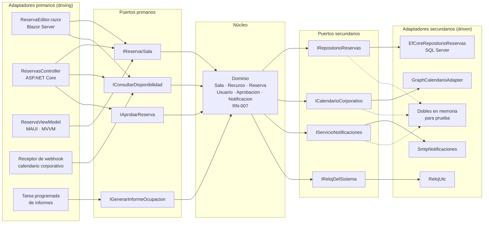
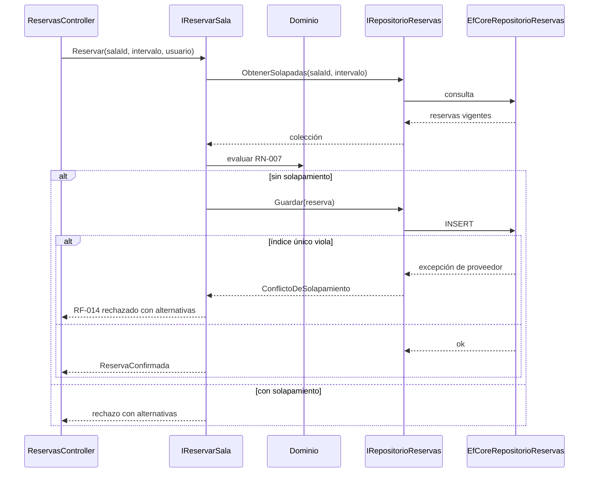

# Arquitectura hexagonal (puertos y adaptadores) — `ARQ-HEX`

## Resumen ejecutivo

El modelo que Alistair Cockburn formuló en 2005 bajo el nombre de *ports and adapters* propone una regla única: el núcleo de la aplicación no conoce a nadie que esté fuera de él, y todo lo que está fuera entra o sale a través de una interfaz que el propio núcleo declara. La consecuencia práctica es que el sistema de reservas puede confirmar una reserva sin saber si la petición llegó por un formulario Blazor, por `POST /reservas`, por una pantalla MAUI o por un webhook del calendario corporativo, y sin saber si el resultado se guarda en SQL Server, en un doble en memoria o en un archivo de pruebas.

Esa indiferencia respecto de la tecnología de entrada y de salida es lo que se compra. Lo que se paga es una capa de indirección que hay que documentar: cada interfaz declarada por el dominio es un contrato, y un contrato sin especificación escrita es una promesa que cada implementación interpreta a su manera. El artefacto característico del modelo —el catálogo de puertos, en el [HLD](../30-Arquitectura/HLD.md)— existe exactamente por eso.

Para `ACT-03` el hexágono desplaza el peso documental desde la topología hacia las fronteras internas. Para `ACT-04` convierte la pregunta «¿dónde pongo este código?» en una pregunta contestable por regla. Para `ACT-05` habilita la prueba del comportamiento de negocio sin levantar infraestructura, que es la ganancia más medible del modelo y la que justifica su costo en la mayoría de los proyectos.

---

## Definición

### Qué es

Una organización interna del código en la que se distingue un **núcleo** —el dominio y los casos de uso que lo orquestan— de un conjunto de **adaptadores** que lo conectan con el mundo. La conexión nunca es directa: pasa por un **puerto**, que es una interfaz con semántica de negocio.

Los puertos tienen dirección, y esa dirección es lo que primero hay que entender.

Un **puerto primario** —*driving*, conducido por— expone una capacidad del núcleo hacia afuera. `IReservarSala` es un puerto primario: alguien de afuera lo invoca para que el sistema haga algo. El adaptador primario es quien traduce un estímulo del mundo real en una llamada a ese puerto: un componente Blazor traduce un clic, un controlador traduce una petición HTTP, una tarea programada traduce el paso del tiempo.

Un **puerto secundario** —*driven*, que conduce— expresa una necesidad del núcleo hacia afuera. `IRepositorioReservas` es un puerto secundario: el núcleo lo invoca porque necesita persistir, y el adaptador es quien sabe cómo hacerlo contra SQL Server. Acá aparece el mecanismo que sostiene todo el modelo, que es la **inversión de dependencias**: la interfaz pertenece al dominio, no a la infraestructura. `IRepositorioReservas` se declara en el ensamblado del dominio, con vocabulario del dominio, y `EfCoreRepositorioReservas` la implementa desde afuera. Si la interfaz viviera en el proyecto de infraestructura, el dominio dependería de la infraestructura y el hexágono sería decorativo.

La simetría es deliberada: ambos lados son puertos, ambos tienen adaptadores intercambiables, y el núcleo no distingue entre uno y otro más allá de quién inicia la conversación.

### Qué problema resuelve

Dos acoplamientos concretos, ambos caros de deshacer una vez instalados.

El primero es el acoplamiento del dominio a la **tecnología de entrada**. Cuando la regla `RN-007` —una sala no admite reservas superpuestas— vive dentro de un método de `ReservasController`, existe una sola forma de ejecutarla: por HTTP. El día que la misma regla tiene que aplicarse al importar reservas desde el calendario corporativo, o al ejecutar una carga masiva desde una tarea nocturna, se la reimplementa o se simula una petición HTTP contra el propio sistema. Ambos caminos producen divergencia de comportamiento entre canales, que es una de las clases de defecto más difíciles de detectar porque cada canal funciona bien por separado.

El segundo es el acoplamiento a la **tecnología de persistencia**. Un modelo de dominio construido sobre entidades de EF Core hereda las restricciones del ORM: constructores sin parámetros, propiedades públicas con *setter*, colecciones mutables, ausencia de invariantes en el constructor. El resultado es un dominio anémico donde `Reserva` no puede garantizar nada sobre sí misma porque cualquiera puede dejarla en estado inválido, y las reglas migran a servicios que las aplican por convención.

### Qué no es

**No son seis lados.** El hexágono se dibujó con seis lados por comodidad gráfica —permite dibujar varios puertos alrededor sin sugerir jerarquía— y no porque haya seis clases de nada. Contar lados es una lectura equivocada del diagrama.

**No es una carpeta llamada `Domain`.** La estructura de directorios es consecuencia, no causa. Un proyecto con carpetas `Domain`, `Application` e `Infrastructure` en el que `Domain` referencia `Microsoft.EntityFrameworkCore` no es hexagonal: es un proyecto con tres carpetas. La verificación es mecánica y se hace leyendo el grafo de referencias entre ensamblados, no el árbol de archivos.

**No es un modelo de despliegue.** El hexágono no dice cuántos procesos hay, ni cómo se despliegan, ni si hay red entre ellos. Un [monolito](Monolitico.md) puede ser hexagonal por dentro; cada uno de un conjunto de [microservicios](Microservicios.md) puede serlo; una aplicación [cliente-servidor](Cliente-Servidor.md) clásica también. Confundir organización interna con topología lleva a la afirmación —común y falsa— de que adoptar hexagonal implica algún cambio en la infraestructura de ejecución.

### Con qué se lo confunde

Con el [modelo de capas](Modelo-de-Capas.md). La diferencia es la dirección de las dependencias en el borde inferior: en capas clásicas, la capa de negocio depende de la capa de acceso a datos; en hexagonal, el acceso a datos depende del dominio, porque implementa una interfaz que el dominio declaró. Un diagrama de capas dibujado con la flecha invertida en la base ya es, en lo esencial, un hexágono.

Con **DDD**. El modelo de Eric Evans aporta el vocabulario del dominio —entidades, agregados, objetos de valor, lenguaje ubicuo, contextos delimitados— y el hexágono aporta la frontera técnica que lo protege. Se usan bien juntos y son independientes: hay hexágonos con dominios anémicos y hay agregados ricos dentro de arquitecturas por capas.

Con «usar repositorios». El patrón Repository, catalogado en *Patterns of Enterprise Application Architecture* de Martin Fowler, es un puerto secundario más. Tenerlo no hace hexagonal a un sistema si el resto de las dependencias externas —el reloj, el correo, la integración con el calendario— siguen instanciándose directamente dentro de los servicios de negocio.

### Hexagonal, cebolla y limpia

Las tres comparten la regla de dependencia hacia el dominio, la independencia respecto del framework y de la base de datos, y la testabilidad del núcleo sin infraestructura. Difieren en cuánto prescriben del interior.

| | Hexagonal (Cockburn) | Onion (Palermo) | Clean (Martin) |
|---|---|---|---|
| Metáfora | Núcleo rodeado de puertos | Anillos concéntricos | Círculos con regla de dependencia |
| Interior del núcleo | No lo prescribe | Modelo, servicios de dominio, servicios de aplicación | Entidades y casos de uso |
| Simetría entrada/salida | Simétrica: ambos son puertos | Asimétrica: el exterior es infraestructura | Asimétrica: entrada por *input port* |
| Cruce de frontera | No lo normaliza | No lo normaliza | Prescribe DTO y estructuras simples |
| Nombre del contrato | Puerto | Interfaz del anillo interior | *Boundary* de caso de uso |
| Aporta | La frontera y su dirección | La organización en anillos | La disciplina de casos de uso |

La elección entre las tres rara vez cambia el código resultante de forma sustantiva; cambia el vocabulario con el que se lo documenta. Lo que sí conviene es elegir uno y sostenerlo en todo el cuerpo documental, porque mezclar «puerto», «boundary» y «anillo» para nombrar lo mismo produce exactamente el problema de terminología que `CTX-3` señala como riesgo dominante.

---

## Documentación que exige el modelo

Adoptar el hexágono redistribuye el peso documental. No agrega una familia nueva: mueve el centro de gravedad dentro de las que ya existen, y crea un artefacto que en los demás modelos no tiene sentido.

### Qué cambia en cada artefacto

**[SAD](../30-Arquitectura/SAD.md).** Gana una sección que en otros modelos no existe: la **declaración de la regla de dependencia** y el mecanismo que la verifica. No alcanza con enunciar que el dominio no depende de infraestructura; hay que decir qué ensamblados componen el núcleo, qué referencias tienen permitidas y cómo se comprueba —prueba de arquitectura automatizada, análisis del grafo de referencias en la compilación, revisión manual en el *pull request*—. Una regla de dependencia sin mecanismo de verificación dura hasta el primer sprint con presión de fecha.

El SAD pierde, en cambio, parte de su peso en la vista de despliegue: el hexágono no la afecta, y quien busque en el SAD hexagonal una topología distinta no la va a encontrar. La vista de despliegue se decide en el eje monolito/microservicios, no acá. Conviene decirlo explícitamente para que nadie interprete la adopción del modelo como un cambio de infraestructura.

**[HLD](../30-Arquitectura/HLD.md).** Aparece el **catálogo de puertos**, que es el artefacto característico del modelo y el que más se omite. Cada puerto se documenta con su nombre, su dirección, la razón por la que existe, su firma, los adaptadores conocidos que lo implementan o lo consumen, su contrato de errores y su doble de prueba. El catálogo es lo que convierte al hexágono en algo revisable: sin él, la lista de interfaces del dominio solo existe en el código y nadie puede evaluar si una interfaz nueva está justificada o si duplica una existente.

El contrato de errores merece énfasis porque es lo que más se olvida. `IRepositorioReservas.Guardar` puede fallar por violación del índice único `(SalaId, Intervalo)`, por indisponibilidad de la base o por conflicto de concurrencia optimista. Cada una de esas condiciones tiene una traducción distinta hacia el dominio, y si no está escrita, cada adaptador la resuelve como puede: uno lanza la excepción de EF Core tal cual —con lo que el dominio termina conociendo el ORM—, otro devuelve `null`, un tercero la traga. La divergencia entre adaptadores del mismo puerto es el defecto estructural más caro de este modelo.

**[LLD](../40-Diseno/LLD.md).** Se parte en dos cuerpos con reglas distintas. El LLD del núcleo describe agregados, invariantes y algoritmos, y no menciona ninguna tecnología. El LLD de cada adaptador describe la traducción entre el mundo exterior y el puerto, y ahí sí aparece `DbContext`, `HttpClient`, `SmtpClient` o el SDK de Microsoft Graph. Mezclarlos en un solo documento reproduce en la documentación el acoplamiento que la arquitectura evita en el código.

**Modelo de datos.** Deja de ser el centro del diseño y pasa a ser un detalle del adaptador de persistencia. Esto tiene una consecuencia documental concreta: aparecen dos modelos donde antes había uno. El **modelo de dominio** describe `Reserva` con sus invariantes —un intervalo con fin posterior al inicio, una sala obligatoria, un estado que solo transiciona según reglas—. El **modelo de persistencia** describe la tabla `Reservas` con sus columnas, sus tipos, sus índices y sus restricciones. Y entre ambos hace falta un tercer documento que casi siempre falta: **el mapeo**.

El mapeo importa porque no es trivial ni obvio. Un objeto de valor `Intervalo` con inicio y fin se aplana en dos columnas; un estado de reserva modelado como jerarquía de tipos se persiste como discriminador; una colección de recursos asociados se convierte en tabla de unión. Cada una de esas traducciones es una decisión que alguien tomó y que el siguiente lector va a intentar reconstruir leyendo configuraciones de EF Core. Documentarla cuesta una tabla; no documentarla cuesta una tarde por cada persona nueva.

**Especificación de API.** Baja de rango y esto conviene decirlo con todas las letras: en un sistema hexagonal, `POST /reservas` no es la definición del sistema, es la interfaz de **un** adaptador primario. El documento OpenAPI sigue siendo imprescindible para quien integra —mantiene todo el peso que `CTX-2` le asigna— pero deja de ser la fuente de verdad sobre qué hace el sistema. Esa fuente es el catálogo de puertos primarios, que incluye capacidades sin exposición HTTP.

La diferencia se vuelve tangible al comparar: `IReservarSala` es un puerto; `POST /reservas` con su cabecera `Idempotency-Key`, sus códigos `201`, `200` y `409`, y su cuerpo de alternativas es la traducción de ese puerto al protocolo HTTP. La idempotencia por cabecera es una decisión del adaptador, no del dominio: el dominio garantiza que no hay solapamiento, y el adaptador garantiza que un reintento de red no produce dos reservas.

**Runbooks y operativa.** Aparece la **matriz puerto→adaptador por entorno**, que es documentación operativa de pleno derecho: dice qué implementación concreta está activa detrás de cada puerto secundario en desarrollo, en pruebas de integración, en preproducción y en producción. Es lo primero que se consulta cuando un comportamiento difiere entre entornos, y su ausencia convierte esa clase de incidente en una investigación desde cero.

| Puerto | Desarrollo | Integración | Producción |
|---|---|---|---|
| `IRepositorioReservas` | SQL Server local | SQL Server efímero en contenedor | SQL Server, alta disponibilidad |
| `ICalendarioCorporativo` | Doble en memoria | Simulador con contratos grabados | Microsoft Graph |
| `IServicioNotificaciones` | Escritura a archivo | Servidor SMTP de captura | SMTP corporativo |
| `IRelojDelSistema` | Reloj controlable | Reloj controlable | `RelojUtc` |

### Qué pierde peso

Los diagramas de despliegue no cambian por adoptar el modelo. Los ADR sobre elección de ORM o de proveedor de correo bajan de criticidad, porque el hexágono los vuelve reversibles: cambiar de proveedor de notificaciones afecta a un adaptador y a su ficha de puerto, no a la arquitectura. La documentación de esquema físico deja de ser el punto de entrada para entender el dominio y pasa a leerse después del modelo de dominio, invirtiendo el orden habitual de `ESC-3`.

---

## Aplicación por escenario

### `ESC-1` — Desarrollo de software nuevo

El modelo se decide antes de escribir código y se registra en un ADR que responda por qué se acepta la indirección. La respuesta legítima es un atributo de calidad de ISO/IEC 25010 con un escenario detrás: capacidad de prueba —«el conjunto de reglas de `RN-007` debe verificarse sin base de datos, en menos de dos segundos»—, modificabilidad —«el proveedor de calendario corporativo puede cambiar durante la vida del producto»— o portabilidad. Si no hay ninguno de esos, el ADR debería concluir que el hexágono no se justifica.

El riesgo del escenario es el hexágono especulativo: declarar puertos para necesidades que nadie tiene, con un solo adaptador cada uno y sin perspectiva de un segundo. Un puerto cuya única razón de existir es «por si algún día cambiamos» debe declararlo así en su ficha, y el equipo debe poder revisar esa decisión más adelante.

En `CTX-1` conviene fijar desde el inicio qué vive en el circuito de Blazor Server y qué vive en el núcleo: el estado de un formulario a medio completar es del adaptador; la reserva confirmada es del dominio. En `CTX-2` el catálogo de puertos primarios se define antes que la especificación OpenAPI, y la especificación se deriva de él.

### `ESC-2` — Migración a otro lenguaje o plataforma

Es donde el modelo aporta más valor, y la razón es precisa: **el adaptador es la unidad de migración**. Si el sistema origen ya está organizado en puertos y adaptadores, migrar de ASP.NET MVC a Blazor Server significa escribir adaptadores primarios nuevos contra los mismos puertos, y el núcleo —donde vive el comportamiento que la migración no debe alterar— queda intacto. La paridad funcional se verifica probando el núcleo, que es el mismo, y se restringe a probar la traducción en los bordes.

Si el sistema origen no es hexagonal, el modelo sigue siendo útil como **destino intermedio**. La secuencia que suele funcionar consiste en extraer primero los puertos secundarios del sistema viejo —envolver el acceso a datos y las integraciones detrás de interfaces con vocabulario de negocio, sin cambiar su implementación—, luego mover las reglas desde los controladores hacia el núcleo, y recién entonces reemplazar los adaptadores por los de la plataforma destino. Cada paso es verificable por separado y ninguno exige una ventana de corte grande.

La tabla de equivalencias que `ESC-2` reclama como pieza puente adopta acá una forma concreta y fácil de completar: componente origen, puerto al que corresponde, adaptador destino, estado de la migración. Esa tabla es también la condición de terminación —cuando no queda ninguna fila pendiente, la migración terminó— que el escenario señala como la pregunta que separa una migración ordenada de una desordenada.

### `ESC-3` — Evaluación con acceso al código

La verificación de si un sistema es realmente hexagonal es de las pocas evaluaciones arquitectónicas que se pueden hacer de forma casi mecánica, y por lo tanto de las más fiables. Se leen los archivos de proyecto y se construye el grafo de referencias: si el ensamblado del dominio referencia `Microsoft.EntityFrameworkCore`, `Microsoft.AspNetCore.*` o cualquier SDK de terceros, el hexágono está roto y la evidencia es un archivo y una línea, exactamente el estándar que `ESC-3` exige.

El hallazgo más frecuente en esta evaluación no es la ausencia total del modelo sino su **erosión parcial**: un sistema que nació hexagonal y donde tres o cuatro dependencias se filtraron con el tiempo. Documentar ese estado con precisión —qué puertos siguen limpios, cuáles no, y desde qué versión— es más útil que un veredicto binario, porque orienta la remediación.

La reconstrucción del catálogo de puertos a partir del código la puede producir `ACT-10` con confianza alta, porque cada entrada es rastreable a una declaración de interfaz y a sus implementaciones. Lo que el agente no puede reconstruir es el motivo de existencia de cada puerto: eso es intención, y salvo que esté escrita, se marca como no verificada.

### `ESC-4` — Evaluación solo desde afuera

El hexágono es prácticamente indetectable desde afuera, y conviene afirmarlo sin rodeos en lugar de producir una hipótesis débil. No hay cabecera HTTP, patrón de URL, mensaje de error ni latencia que distinga un sistema de puertos y adaptadores de uno organizado en capas clásicas: la diferencia es estrictamente interna y no tiene manifestación observable.

Existen indicios muy indirectos —que una misma capacidad esté disponible por interfaz web, por API pública y por integración con comportamiento idéntico en los tres canales sugiere un núcleo compartido— pero la inferencia inversa no vale: un sistema sin hexágono puede lograr esa consistencia por disciplina, y uno hexagonal puede exhibir divergencias por defectos en los adaptadores. La confianza alcanzable es baja y así debe registrarse en el frontmatter del informe.

Lo honesto en este escenario es no incluir el modelo de arquitectura interna entre los hallazgos, o incluirlo con una sola línea que diga que no es observable.

---

## Ejemplos concretos — sistema de reserva de salas

### El hexágono completo



Las flechas punteadas indican adaptadores alternativos activos solo en entornos de prueba. Nótese que `IRelojDelSistema` no tiene doble punteado porque su doble es el que se usa en toda prueba de comportamiento temporal, y que ningún adaptador secundario apunta hacia el núcleo: todos son apuntados desde él a través de la interfaz que el núcleo declara.

### Dónde vive `RN-007`

La regla —una sala no admite reservas superpuestas— tiene dos manifestaciones y esa duplicación es deliberada.

En el **dominio** vive la regla propiamente dicha: el servicio de reserva recupera las reservas vigentes de la sala en el intervalo solicitado a través de `IRepositorioReservas.ObtenerSolapadas(salaId, intervalo)`, evalúa el solapamiento con la semántica que el negocio definió —intervalos semiabiertos, de modo que una reserva de 10:00 a 11:00 no colisiona con una de 11:00 a 12:00— y rechaza con un resultado de dominio que enumera alternativas. Esa evaluación es la que produce el mensaje al usuario y la que se prueba sin base de datos.

En el **adaptador de persistencia** vive el índice único `(SalaId, Intervalo)`, que no reimplementa la regla sino que actúa como red de seguridad ante concurrencia: dos peticiones simultáneas pueden pasar ambas la validación de dominio si consultan antes de que cualquiera de las dos escriba, y el índice garantiza que solo una llegue a existir.



La documentación de esa duplicación tiene un lugar propio y no debe quedar implícita. Se registra en un ADR con la forma «`RN-007` se valida en el dominio y se protege en el índice único; el índice no es la regla sino su garantía bajo concurrencia», y se refleja en dos lugares más: en la ficha del puerto `IRepositorioReservas`, cuyo contrato de errores incluye `ConflictoDeSolapamiento` como condición traducida; y en el modelo de datos, donde el índice lleva una nota que remite a `RN-007` para que nadie lo elimine creyéndolo una optimización.

La traducción de la excepción del proveedor a `ConflictoDeSolapamiento` ocurre dentro del adaptador. Ese es el punto exacto donde la arquitectura se sostiene o se rompe: si la excepción de EF Core viaja hacia el dominio, el dominio pasa a depender del ORM aunque el archivo de proyecto no lo declare.

### El mismo caso de uso por cuatro canales

`RF-014 Confirmar reserva` se ejecuta desde cuatro adaptadores primarios distintos y el comportamiento de negocio es idéntico en los cuatro. Lo que difiere es la traducción.

| Adaptador | Estímulo | Traducción de entrada | Traducción de salida |
|---|---|---|---|
| `ReservaEditor.razor` | Clic en Confirmar | Estado del formulario del circuito | Actualización de la vista; alternativas en el propio panel |
| `ReservasController` | `POST /reservas` | Cuerpo JSON más `Idempotency-Key` | `201`, `200` en reintento, `409` con alternativas |
| `ReservaViewModel` | Comando MVVM | Propiedades enlazadas | Mensaje al usuario y navegación |
| Receptor de webhook | Evento del calendario | Carga útil de Microsoft Graph | Acuse al emisor; sin interfaz |

Ninguna de las cuatro filas contiene lógica de negocio, y esa es la prueba de que el reparto de responsabilidades es correcto. La idempotencia por `Idempotency-Key` aparece solo en la fila HTTP porque es una preocupación del protocolo; el evento `ReservaConfirmada` con garantía *at-least-once* se publica desde el núcleo a través de un puerto secundario y llega igual sin importar qué canal originó la confirmación.

### El mapeo entre modelo de dominio y modelo de persistencia

La separación de ambos modelos genera un documento que en una arquitectura por capas no existe porque allí hay un solo modelo. Este es su contenido para el agregado `Reserva`, tal como debería aparecer junto al modelo de datos:

| Concepto de dominio | Forma en el dominio | Forma en la tabla `Reservas` | Decisión de traducción |
|---|---|---|---|
| `Intervalo` | Objeto de valor, semiabierto | `Inicio`, `Fin` (`datetime2`) | Se aplana en dos columnas; la semántica semiabierta no es representable en el esquema y vive en el dominio |
| `EstadoReserva` | Jerarquía de tipos | `Estado` (`tinyint`) | Discriminador numérico; la tabla de correspondencia se versiona con el esquema |
| Recursos asociados | Colección de `Recurso` | Tabla `ReservaRecursos` | Tabla de unión; el orden no se persiste porque el dominio no lo usa |
| `SalaId`, `UsuarioId` | Identificadores tipados | `uniqueidentifier` | Conversión de valor en la configuración de EF Core, no en el dominio |
| Versión de concurrencia | Ausente del dominio | `rowversion` | Preocupación exclusiva del adaptador; se traduce a `ConflictoDeVersion` |
| `RN-007` | Regla evaluada en el servicio | Índice único `(SalaId, Intervalo)` | Duplicación deliberada; ver el ADR correspondiente |

Las dos últimas filas son las que justifican el documento. La versión de concurrencia existe solo en la persistencia y el dominio no debe conocerla; el índice único existe solo en la persistencia y sin embargo remite a una regla del dominio. Ninguna de las dos relaciones se deduce leyendo cualquiera de los dos modelos por separado, y ambas son exactamente el tipo de conocimiento que se pierde cuando rota el equipo.

### Cómo se ve el modelo en cada contexto

En `CTX-1` los adaptadores primarios concentran todo lo específico de la interfaz: los cuatro estados de pantalla, la reconexión del circuito SignalR y la conservación de los asistentes ya cargados ante un `409` son responsabilidad de `ReservaEditor.razor`, y ninguna de esas preocupaciones aparece en `IReservarSala`. En `CTX-2` el peso se va a los puertos secundarios y a sus contratos de errores, porque es donde se juegan las garantías de idempotencia y de entrega. En `CTX-3` el hexágono aporta un beneficio que el contexto reclama explícitamente: la traza vertical se apoya en el puerto, que es el único nombre que aparece igual en el HLD, en el LLD del núcleo, en el LLD de cada adaptador y en las pruebas.

---

## Preguntas guía

- ¿Cada puerto tiene una razón de existir escrita, o hay puertos que existen porque el patrón los sugiere?
- ¿La regla de dependencia está verificada por algún mecanismo automático, o depende de que nadie se distraiga?
- ¿El contrato de errores de cada puerto secundario está escrito, o cada adaptador decide qué hace ante un fallo?
- ¿El modelo de dominio y el modelo de persistencia están documentados por separado, y existe el mapeo entre ambos?
- ¿Se puede ejecutar el conjunto completo de reglas de negocio sin base de datos, sin red y sin reloj real?
- ¿Qué adaptador está activo detrás de cada puerto en cada entorno, y dónde está escrito?
- ¿Qué atributo de calidad concreto justifica la indirección en este sistema?
- Si mañana se reemplaza el proveedor de calendario corporativo, ¿cuántos archivos fuera del adaptador hay que tocar?

---

## Criterios de calidad y antipatrones

### Señales de una implementación sana

El ensamblado del dominio no referencia nada de infraestructura, y eso es verificable leyendo un archivo de proyecto. Los nombres de los puertos pertenecen al vocabulario del negocio y no al de la tecnología: `ICalendarioCorporativo` describe una capacidad, `IGraphClient` describe un cliente HTTP. Cada puerto secundario tiene al menos un doble de prueba y el conjunto de pruebas del núcleo corre sin infraestructura. El catálogo de puertos existe, está en el HLD y coincide con las interfaces del código.

### Antipatrones

**Puerto espejo del ORM.** Un `IRepositorio<T>` genérico con `Add`, `Update`, `Delete` y `GetAll` no es un puerto: es la interfaz del `DbSet` con otro nombre. No expresa ninguna necesidad del dominio y hace que cualquier cambio en la forma de consultar se filtre hacia el núcleo. El puerto correcto tiene métodos que el dominio necesita —`ObtenerSolapadas(salaId, intervalo)`, `ObtenerPendientesDeAprobacion(salaId)`— y ninguno que el dominio no invoque.

**Entidades de EF Core como modelo de dominio.** Compartir la clase entre dominio y persistencia parece ahorrar trabajo y en realidad transfiere las restricciones del ORM al dominio. El síntoma es un constructor sin parámetros y propiedades con *setter* público en un agregado que debería garantizar invariantes.

**Dominio que referencia el ORM.** Basta un `[Key]`, un `[Column]` o un `Include` en el núcleo para que la regla de dependencia esté rota. Suele entrar por conveniencia puntual y no se revierte nunca. La configuración del mapeo vive en el adaptador, en clases de configuración de EF Core, no en atributos sobre las entidades del dominio.

**Adaptadores con reglas de negocio.** Un `ReservasController` que verifica el solapamiento antes de invocar el puerto, aunque sea «para dar mejor mensaje al usuario», crea una segunda implementación de `RN-007` que va a divergir. Si el mensaje de la interfaz necesita más información, la información se agrega al resultado que devuelve el puerto.

**Hexágono ceremonial sobre un CRUD.** Un catálogo de salas que solo hace altas, bajas y modificaciones sin ninguna regla no gana nada con cuatro proyectos, seis interfaces y una capa de mapeo. La respuesta correcta no es abandonar el modelo en todo el sistema sino admitir que puede convivir con módulos que acceden directamente a los datos, y registrar esa excepción en un ADR para que no se lea como incoherencia.

**Catálogo de puertos que no existe.** Es el antipatrón documental propio del modelo. El código es hexagonal, nadie escribió el catálogo, y la información sobre qué contratos existen y qué prometen vive únicamente en las declaraciones de interfaz. Cuando aparece la necesidad de un puerto nuevo, nadie puede evaluar si ya hay uno equivalente.

---

## Anexo — Lista de verificación y ficha de puerto

### Ficha de puerto

Una por puerto, en el [HLD](../30-Arquitectura/HLD.md). Los campos están ordenados por lo que primero se consulta.

```markdown
## Puerto: <nombre de la interfaz>

- **Dirección**: primario (driving) | secundario (driven)
  > ¿El mundo exterior lo invoca, o el núcleo lo invoca hacia afuera?
- **Motivo de existencia**: <capacidad de negocio o necesidad del núcleo>
  > ¿Qué se rompería si esta interfaz no existiera y el núcleo llamara
  > directamente a la implementación? Si la respuesta es "nada", el puerto sobra.
- **Firma**: <métodos con parámetros y tipos de retorno>
  > ¿Los tipos que cruzan la frontera pertenecen al dominio, o hay tipos
  > de infraestructura filtrándose en la firma?
- **Adaptadores conocidos**: <lista, con el entorno en que cada uno está activo>
  > ¿Hay más de uno? Si no, ¿está previsto que lo haya, o el puerto es especulativo?
- **Contrato de errores**: <condición → resultado que ve el núcleo>
  > ¿Qué puede fallar, y cómo lo expresa cada adaptador sin exponer su tecnología?
- **Doble de prueba**: <nombre y qué comportamiento simula>
  > ¿Permite provocar cada condición del contrato de errores?
- **Invariantes del contrato**: <lo que todo adaptador debe cumplir>
  > ¿Idempotencia? ¿Orden? ¿Latencia máxima? ¿Comportamiento ante ausencia?
```

Ejemplo completado para el puerto más cargado del sistema de reservas:

```markdown
## Puerto: IRepositorioReservas

- **Dirección**: secundario (driven)
- **Motivo de existencia**: el núcleo necesita consultar y persistir reservas sin
  conocer el almacenamiento; habilita probar RN-007 sin base de datos.
- **Firma**:
    IReadOnlyCollection<Reserva> ObtenerSolapadas(SalaId, Intervalo)
    Reserva? ObtenerPorId(ReservaId)
    void Guardar(Reserva)
- **Adaptadores conocidos**:
    EfCoreRepositorioReservas (SQL Server) — integración y producción
    RepositorioReservasEnMemoria — pruebas de dominio
- **Contrato de errores**:
    Violación del índice único (SalaId, Intervalo) → ConflictoDeSolapamiento
    Conflicto de concurrencia optimista → ConflictoDeVersion
    Almacenamiento no disponible → ErrorDePersistencia (reintentable)
    Ninguna excepción del proveedor cruza hacia el núcleo.
- **Doble de prueba**: RepositorioReservasEnMemoria, con activación explícita de
  ConflictoDeSolapamiento para verificar la ruta 409 de POST /reservas.
- **Invariantes del contrato**: ObtenerSolapadas usa intervalos semiabiertos
  [inicio, fin); Guardar es atómico respecto del agregado completo.
```

### Lista de verificación del modelo

| # | Verificación | Cómo se comprueba |
|---|---|---|
| 1 | El ensamblado del dominio no referencia infraestructura | Grafo de referencias del archivo de proyecto |
| 2 | Todos los puertos están en el catálogo del HLD | Contraste entre interfaces del dominio y catálogo |
| 3 | Cada puerto tiene motivo de existencia escrito | Ficha de puerto completa |
| 4 | Cada puerto secundario tiene contrato de errores | Ficha de puerto, campo correspondiente |
| 5 | Ningún adaptador contiene reglas de negocio | Revisión del LLD de adaptadores |
| 6 | Los nombres de puertos usan vocabulario de negocio | Revisión del catálogo contra el glosario |
| 7 | Existe el mapeo dominio ↔ persistencia | Documento de mapeo en el modelo de datos |
| 8 | La matriz puerto→adaptador por entorno está publicada | Runbook de operación |
| 9 | Las pruebas del núcleo corren sin infraestructura | Ejecución de la suite sin contenedores |
| 10 | La regla de dependencia tiene verificación automática | Prueba de arquitectura en la integración continua |

### Documentos relacionados

- [`README.md`](README.md) — índice de modelos de arquitectura.
- [`Modelo-de-Capas.md`](Modelo-de-Capas.md) — el modelo del que el hexágono se distingue por la dirección de la dependencia inferior.
- [`Cliente-Servidor.md`](Cliente-Servidor.md), [`Monolitico.md`](Monolitico.md), [`Microservicios.md`](Microservicios.md) — modelos de despliegue con los que el hexágono convive sin conflicto.
- [`Comparativa-y-Criterios.md`](Comparativa-y-Criterios.md) — criterios de elección entre modelos.
- [`../30-Arquitectura/README.md`](../30-Arquitectura/README.md), [`SAD.md`](../30-Arquitectura/SAD.md), [`HLD.md`](../30-Arquitectura/HLD.md), [`ADR.md`](../30-Arquitectura/ADR.md) — cómo se documenta la elección.
- [`../00-Marco-de-Referencia/Escenarios.md`](../00-Marco-de-Referencia/Escenarios.md), [`Contextos.md`](../00-Marco-de-Referencia/Contextos.md), [`Actores.md`](../00-Marco-de-Referencia/Actores.md) — ejes del marco.

### Referencias de industria

Arquitectura hexagonal de **Alistair Cockburn** (2005), origen del término *ports and adapters*. **Clean Architecture** de Robert C. Martin y **Onion Architecture** de Jeffrey Palermo, comparadas en la sección de definición. **Domain-Driven Design** de Eric Evans para el vocabulario del núcleo. ***Patterns of Enterprise Application Architecture*** de Martin Fowler para los patrones Repository, Gateway y Data Mapper que aparecen como adaptadores secundarios. **ISO/IEC 25010** para los atributos de calidad —capacidad de prueba, modificabilidad, portabilidad— que justifican la adopción. **ISO/IEC/IEEE 42010** para el encuadre de la descripción arquitectónica en vistas e interesados.
