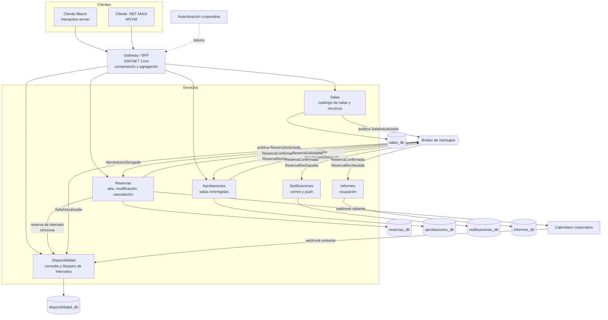
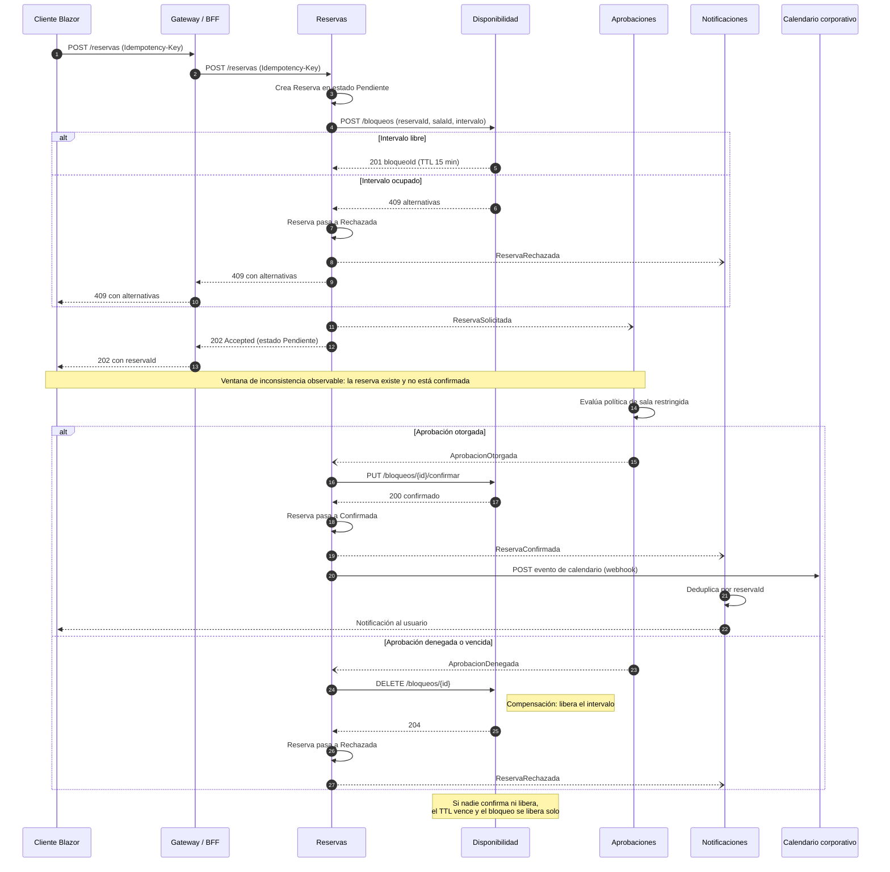

# Microservicios — `ARQ-MICRO`

## Resumen ejecutivo

Un sistema de microservicios reemplaza llamadas a método por llamadas de red. Esa frase, que parece una simplificación, contiene el costo entero del modelo: lo que antes verificaba el compilador —que el método existe, que los tipos coinciden, que el argumento no es nulo— pasa a ser un acuerdo entre dos equipos que hay que escribir, versionar, probar y sostener en producción mientras ambos lados evolucionan a distinto ritmo. La ganancia es real y está bien documentada: autonomía de despliegue, escalado selectivo, aislamiento de fallos, equipos que avanzan sin coordinarse en cada entrega. El precio también es real y se paga sobre todo en documentación y en operación.

Este documento trata el modelo desde la pregunta que le corresponde a esta guía, que no es cómo se implementa sino qué obliga a escribir. La respuesta corta: la operativa se multiplica por servicio, la especificación de API deja de ser un artefacto deseable para volverse la condición de que el sistema funcione, y aparecen familias enteras de documentos que en un monolito sencillamente no existen —descubrimiento de servicios, matriz de compatibilidad entre versiones desplegadas, política de reintentos y timeouts, correlación de trazas, plan de compensación de sagas, propiedad de servicio y rotación de guardia—.

La decisión de adoptar microservicios es tanto organizativa como técnica, y el documento insiste en ello porque el fracaso más común no es de diseño sino de encaje: equipos sin propiedad de punta a punta, sin automatización de despliegue, sin observabilidad distribuida y sin cultura de guardia producen, con esfuerzo considerable, un monolito distribuido que combina las restricciones del monolito con la operación de los microservicios. El [monolito modular](Monolitico.md) es el punto de partida defendible en la mayoría de los casos, y este documento explica cuándo deja de serlo.

---

## Definición

### Qué es

Un estilo arquitectónico en el que el sistema se descompone en servicios que se despliegan de forma independiente, cada uno alineado a un contexto delimitado del dominio en el sentido de Eric Evans, y cada uno con **propiedad exclusiva de sus datos**. Las tres condiciones son conjuntas, y la que más se incumple es la tercera.

**Despliegue independiente** significa que un servicio puede liberarse a producción sin coordinar ventana con ningún otro, sin desplegar nada más y sin que un consumidor tenga que actualizarse en el mismo acto. Si liberar `Reservas` obliga a liberar `Disponibilidad`, el sistema tiene dos procesos pero un solo artefacto desplegable.

**Alineación a contexto delimitado** significa que la frontera del servicio coincide con una frontera de lenguaje y de responsabilidad del negocio. `Reservas` es dueño de la noción de reserva; `Aprobaciones` es dueño de la noción de aprobación; que ambos hablen de la misma reserva no los vuelve un solo servicio, siempre que cada uno tenga su propio modelo de lo que esa reserva significa para él.

**Propiedad exclusiva de datos** significa que ningún otro servicio lee ni escribe el almacenamiento de un servicio. Se accede por contrato publicado o no se accede. Es la condición que sostiene a las otras dos: mientras dos servicios compartan una tabla, cambiar su esquema exige coordinar despliegues, y la autonomía desaparece aunque los procesos sigan separados.

### Qué problema resuelve

Resuelve problemas de escala organizativa y de escala operativa, en ese orden de importancia.

El problema organizativo aparece cuando el número de personas que tocan un mismo artefacto desplegable hace que el costo de coordinar supere al de construir: ramas que se pisan, ventanas de liberación compartidas, un equipo esperando a otro para publicar una corrección de una línea. Separar el artefacto separa el calendario.

El problema operativo aparece cuando distintas partes del sistema tienen perfiles de carga o de disponibilidad incompatibles. En el sistema de reservas, la consulta de disponibilidad recibe dos órdenes de magnitud más tráfico que la confirmación —la gente mira mucho y reserva poco—, y el informe de ocupación consume ráfagas de cómputo a fin de mes que no deberían degradar la operación diaria. Escalar el monolito entero para atender el pico de un módulo es posible, y a cierta escala, caro.

Hay un tercer beneficio, el aislamiento de fallos, que solo se obtiene si se diseña explícitamente: separar procesos sin degradación planificada convierte un fallo local en fallo global por cascada de timeouts. La disponibilidad de un sistema distribuido, sin trabajo deliberado, es menor que la de sus partes.

### Qué no es

**No es "servicios pequeños".** El tamaño no es el criterio. Un servicio de doce mil líneas que es dueño de un contexto delimitado coherente está bien dimensionado; tres servicios de doscientas líneas que solo se usan juntos y se despliegan juntos son un solo servicio partido en tres por razones estéticas.

**No es SOA con un bus.** La arquitectura orientada a servicios clásica centralizaba la orquestación y la lógica de integración en un bus empresarial. Los microservicios invierten esa relación: extremos inteligentes, tuberías tontas. El broker transporta y persiste mensajes; no traduce, no enruta por reglas de negocio ni conoce el dominio.

**No es "una API por entidad".** Un servicio `Usuario`, un servicio `Sala`, un servicio `Reserva`, cada uno con su CRUD, es un modelo de datos expuesto por HTTP. Toda operación de negocio real cruza tres servicios, y el sistema hereda la coordinación distribuida sin ninguna de sus ventajas.

**No es un objetivo.** Nadie tiene el requisito de tener microservicios. Se tienen requisitos de autonomía de entrega, de escalado diferenciado o de aislamiento, y este modelo es un medio con costo. Cuando aparece en un documento de negocio —`ACT-01` pidiendo microservicios— hay una invasión de alcance que corresponde traducir a la propiedad de calidad subyacente, tal como plantea la ficha de Product Owner en [Actores](../00-Marco-de-Referencia/Actores.md).

### Con qué se lo confunde

| Se llama microservicios a | Lo que en realidad es | Síntoma que lo delata |
|---|---|---|
| Servicios que se despliegan juntos | Monolito distribuido | Una entrega exige coordinar N repositorios |
| Servicios sobre una base compartida | Monolito con varios frentes | Cambiar una tabla rompe a otro equipo |
| Servicios por capa técnica | Capas remotas | Existen servicios `API`, `Lógica`, `Datos` |
| Procesos separados sin dueño | Componentes desplegados aparte | Nadie sabe a quién llamar cuando uno cae |
| Módulos de un monolito modular | [Monolito modular](Monolitico.md) | Y está bien: no pretende ser otra cosa |

### El criterio de tamaño correcto

La frontera de un servicio la fijan dos cosas, y ninguna de las dos es una métrica de código: el **contexto delimitado** del dominio y el **equipo** que puede sostenerlo. Un servicio debe caber en la cabeza de un equipo, y un equipo debe poder ser dueño de él de punta a punta, incluida la guardia. De ahí se sigue el criterio operativo de trazado: si dos candidatos a servicio necesitan cambiar juntos ante la mayoría de los requisitos, son uno solo; si comparten datos que ninguno puede ceder al otro, la frontera está mal puesta; si uno no puede funcionar de forma degradada cuando el otro no responde, están acoplados en tiempo de ejecución y la separación es nominal.

En el sistema de reservas, `Salas` y `Disponibilidad` son un caso interesante: la tentación de fusionarlos es alta porque la disponibilidad se calcula sobre el catálogo. Se sostienen separados porque tienen perfiles de carga y de cambio radicalmente distintos —el catálogo cambia semanas, la disponibilidad se consulta miles de veces por hora— y porque `Disponibilidad` puede seguir respondiendo con una copia local del catálogo mientras `Salas` está caído. Esa última frase es la justificación real, y es la que debe estar en el ADR.

---

## Documentación que exige el modelo

Esta es la sección central del documento. La tesis: cada frontera de red que se agrega convierte una garantía que daba el compilador en un documento que alguien tiene que escribir y mantener. El costo documental de los microservicios no es un recargo proporcional; es la aparición de familias enteras que antes no existían, más la multiplicación por N de la familia operativa.

### Efecto por familia documental

| Familia | Efecto | Detalle |
|---|---|---|
| Visión | Sin cambio | El producto es el mismo |
| Análisis | Cambia de dueño, no de peso | El SRS sigue siendo único; las reglas se reparten entre servicios |
| Arquitectura | Aumento fuerte | Mapa de servicios, propiedad de datos, política de comunicación |
| Diseño | Multiplicación por servicio | Un HLD por servicio; el LLD se reduce por servicio pero se multiplica |
| Operativa | Multiplicación por servicio, más documentos nuevos | Runbook por servicio, degradación parcial, sagas fallidas |
| Desarrollo | Aumento moderado | Convenciones que antes eran costumbre pasan a ser contrato |
| Usuarios | Sin cambio | El usuario no ve la topología, y si la ve hay un problema |

La lectura de la tabla es simple: las familias que miran hacia el negocio no se enteran del cambio, y las que miran hacia la máquina se duplican o se multiplican. Quien evalúe la adopción del modelo mirando solo el esfuerzo de construcción está omitiendo el bloque de costo más grande y el más permanente, porque el esfuerzo de construir se paga una vez y el de mantener documentación operativa se paga cada semana.

### Qué cambia en el SAD

El [SAD](../30-Arquitectura/SAD.md) gana cuatro contenidos que en otros modelos son marginales o inexistentes.

**Mapa de servicios.** El inventario con nombre, contexto delimitado, equipo dueño y estado de madurez. No es el diagrama: es la tabla que permite responder "cuántos servicios hay y quién responde por cada uno" sin abrir un repositorio. Su ausencia es el primer síntoma de un sistema que creció sin gobierno.

**Propiedad de datos.** Qué servicio es fuente de verdad de qué dato, y —esto es lo que casi siempre falta— qué datos están duplicados en otros servicios, por qué, con qué latencia se actualizan y qué hacer cuando divergen. En el sistema de reservas, `Disponibilidad` mantiene una copia del catálogo de salas del que `Salas` es fuente de verdad; `Notificaciones` mantiene una copia del correo del usuario del que la autenticación corporativa es fuente de verdad. Cada duplicación es una decisión que debe estar escrita, con su mecanismo de sincronización y su ventana de desfase aceptable.

**Topología.** No solo qué se despliega dónde, sino qué falla cuando cae cada nodo. La vista de despliegue en un monolito responde "dónde corre esto"; en microservicios tiene que responder además "qué deja de funcionar y qué sigue funcionando degradado si esto no responde".

**Política de comunicación síncrona frente a asíncrona.** El criterio, no la lista. Cuándo un servicio llama a otro por HTTP y cuándo publica un evento; qué operaciones admiten consistencia eventual y cuáles exigen respuesta inmediata; qué timeout, cuántos reintentos, con qué backoff, con qué disyuntor y con qué comportamiento cuando el disyuntor abre. Esta política es un documento de arquitectura, no una configuración: si vive únicamente en el `appsettings.json` de cada servicio, cada equipo elegirá valores distintos y el sistema tendrá un comportamiento de fallo que nadie puede predecir.

### Qué cambia en el HLD y en el LLD

El [HLD](../30-Arquitectura/HLD.md) se multiplica: uno por servicio, cada uno describiendo módulos internos e interfaces. Individualmente son más cortos que el HLD de un monolito equivalente —hay menos que describir dentro de cada frontera— pero la suma es mayor, y aparece un HLD que no existía: el del **gateway o BFF**, cuya responsabilidad es composición y adaptación al cliente, no negocio.

El [LLD](../40-Diseno/LLD.md) es el artefacto menos afectado. El código dentro de un servicio se diseña igual que dentro de un monolito, y de hecho la mayoría de los servicios bien construidos aplican [arquitectura hexagonal](Hexagonal.md) puertas adentro. Lo que cambia es que el LLD gana una zona nueva: los adaptadores de salida hacia otros servicios, con su manejo de fallo, su deduplicación de eventos y su política de reintento. Esa zona es donde se concentran los defectos difíciles.

### Qué pasa con el modelo de datos

Deja de haber un modelo de datos. Hay N modelos, uno por servicio, y ninguno tiene visión del conjunto. En su lugar aparecen tres artefactos:

1. **El modelo de datos de cada servicio**, que es un documento normal y más simple que el del monolito equivalente.
2. **El mapa de propiedad**, que dice qué servicio es fuente de verdad de qué concepto. Es un documento de arquitectura, no de datos, y es el que se consulta cuando alguien pregunta dónde se cambia el correo de un usuario.
3. **El registro de duplicaciones**, que documenta cada dato replicado: quién es la fuente, quién la copia, por qué mecanismo, con qué latencia esperada y qué procedimiento existe para reconciliar cuando divergen. Este documento no tiene equivalente en ningún otro modelo de arquitectura, y su ausencia es la causa de la clase de incidente más desconcertante del modelo: dos pantallas del mismo producto mostrando datos distintos, sin que ninguna esté equivocada.

El diagrama entidad-relación único desaparece, y con él desaparece la posibilidad de garantizar integridad referencial por motor de base de datos. `RN-007` deja de ser un índice y pasa a ser un protocolo, como se desarrolla más abajo.

### Qué pasa con la especificación de API

Pasa de opcional a obligatoria, y de un documento a dos.

La **especificación de contratos síncronos** —OpenAPI para REST, `.proto` para gRPC— deja de ser cortesía hacia integradores externos y se vuelve el mecanismo por el cual dos equipos internos acuerdan algo. Debe generarse desde el código o validarse contra él en la integración continua; una especificación mantenida a mano en un sistema de veinte servicios está desactualizada antes de terminar el trimestre. Y necesita **política de versionado explícita**: cómo se introduce un cambio compatible, cómo uno incompatible, cuánto tiempo conviven dos versiones, quién avisa a los consumidores y cómo se retira una versión vieja. Semantic Versioning describe la semántica de los números; la política de retiro es una decisión propia que hay que escribir, y su omisión produce el antipatrón de la versión `v2` eterna junto a la `v1` que nadie se anima a apagar porque nadie sabe quién la usa.

El **catálogo de eventos** es el documento nuevo. Por cada evento publicado: nombre, esquema de la carga, servicio productor, servicios consumidores conocidos, garantía de entrega, garantía de orden, política de evolución del esquema y clave de deduplicación. `ReservaConfirmada` se publica *at-least-once*, sin garantía de orden respecto de otros eventos, y su clave de deduplicación es `reservaId`; todo consumidor debe ser idempotente respecto de esa clave. Nada de eso se deduce mirando la clase del evento en C#, y su ausencia produce notificaciones duplicadas en producción que se descubren cuando un usuario las reporta.

### Qué pasa con la operativa

Es la familia que más crece, y la que más se subestima al decidir.

Cada servicio necesita su **runbook**: cómo se despliega, cómo se revierte, qué alertas tiene, qué significa cada una, a quién se escala. Multiplicar un runbook por veinte no es multiplicar el esfuerzo por veinte —hay plantilla y hay repetición— pero tampoco es gratis, y el costo de mantenerlos actualizados es proporcional al número de servicios y permanente en el tiempo.

Aparecen además runbooks que no tienen equivalente en un sistema no distribuido. El de **degradación parcial** responde qué hacer cuando un servicio está caído y el resto sigue en pie: qué se le muestra al usuario, qué operaciones se rechazan, qué se encola para procesar después, y cuál es el criterio para decidir apagar una funcionalidad en lugar de dejarla fallar. El de **saga fallida** responde qué hacer cuando una transacción distribuida quedó a medio compensar: cómo se detecta, cómo se inspecciona el estado, cómo se completa la compensación a mano y qué evidencia se deja.

Y aparece la **documentación de observabilidad**, que en un monolito se resuelve con un archivo de log. En un sistema distribuido hay que documentar el esquema de correlación —qué identificador viaja en qué cabecera, quién lo genera, quién lo propaga—, el mapa de qué se instrumenta y con qué nivel, y la guía de cómo se reconstruye el recorrido de una operación que atravesó seis servicios. Sin correlación documentada y aplicada de forma uniforme, las trazas existen y son inútiles.

### Artefactos que solo existen en este modelo

| Artefacto | Pregunta que responde | Dueño |
|---|---|---|
| Mapa de servicios | ¿Qué servicios hay y quién responde por cada uno? | `ACT-03` |
| Mapa de propiedad de datos | ¿Quién es fuente de verdad de este dato? | `ACT-03` |
| Registro de duplicaciones | ¿Por qué este dato está en dos lados y qué pasa si divergen? | `ACT-03` |
| Catálogo de eventos | ¿Qué se publica, con qué esquema y qué garantía? | `ACT-03` con `ACT-04` |
| Política de versionado y retiro de contratos | ¿Cuándo puedo romper y a quién debo avisar? | `ACT-03` |
| Política de resiliencia | ¿Qué timeout, cuántos reintentos, qué hace el disyuntor? | `ACT-03` con `ACT-06` |
| Matriz de compatibilidad entre versiones desplegadas | ¿Qué combinación de versiones es válida en producción? | `ACT-06` |
| Documentación de descubrimiento y enrutamiento | ¿Cómo encuentra un servicio a otro? | `ACT-06` |
| Esquema de correlación de trazas | ¿Cómo sigo una operación de punta a punta? | `ACT-06` |
| Especificación de sagas y compensaciones | ¿Qué pasa si el paso 3 de 5 falla? | `ACT-03` con `ACT-02` |
| Ficha de servicio y rotación de guardia | ¿A quién llamo a las tres de la mañana? | `ACT-06` |
| Runbook de degradación parcial | ¿Qué sigue funcionando cuando esto cae? | `ACT-06` |

Doce artefactos, ninguno de los cuales tiene sentido en un monolito. Ese es el costo documental del modelo expresado de la forma más honesta disponible.

### Qué no pierde peso pero cambia de dueño

Tres artefactos conservan su importancia y se vuelven más difíciles de sostener porque su responsabilidad se fragmenta.

El **SRS** sigue siendo único: el negocio no se reparte por servicio, y `RF-014 Confirmar reserva` es un requisito del sistema aunque su ejecución atraviese cuatro servicios. Lo que aparece es la necesidad de mapear cada requisito a los servicios que participan de él, porque sin ese mapa nadie puede estimar el impacto de un cambio funcional. El dueño sigue siendo `ACT-02`, pero ahora necesita interlocutor en cada equipo.

El **glosario** gana peso crítico. En un monolito, dos nombres para la misma cosa producen confusión; en microservicios producen contratos incompatibles entre equipos que creían estar hablando de lo mismo. La contradicción se manifiesta tarde, en integración.

El **Test Plan** cambia de naturaleza más que de dueño. Las pruebas de integración de un monolito se ejecutan en un proceso; acá exigen decidir qué se prueba con dobles, qué con pruebas de contrato y qué en un entorno con todo levantado, y esa decisión es documental antes que técnica. `ACT-05` sigue siendo el dueño, pero necesita del arquitecto la definición de qué contrato es verificable automáticamente.

---

## Aplicación por escenario

### `ESC-1` — Desarrollo de software nuevo

Elegir microservicios antes de conocer las fronteras del dominio es la causa más común de fracaso del modelo. El motivo es estructural, no de habilidad: las fronteras correctas se descubren construyendo, y en un sistema nuevo nadie las conoce todavía. Una frontera mal puesta dentro de un monolito modular se corrige moviendo clases entre proyectos en una tarde; la misma frontera mal puesta entre dos servicios exige migrar datos, versionar contratos, coordinar dos despliegues y sostener un período de convivencia. El error cuesta dos órdenes de magnitud más.

El punto de partida defendible es el **monolito modular** con fronteras internas explícitas y datos separados por esquema, construido de modo que extraer un módulo sea un trabajo de días y no de meses. La documentación de `ESC-1` bajo esa premisa incluye un artefacto propio: el registro de qué módulos son candidatos a extracción y qué condición dispararía la extracción —"cuando el equipo de informes supere las cuatro personas", "cuando la consulta de disponibilidad supere las mil peticiones por segundo"—. Escribir esa condición obliga a admitir que hoy no se cumple.

Hay excepciones legítimas y conviene nombrarlas para no caer en el dogma opuesto. Un dominio ya conocido por el equipo, una organización que ya opera microservicios con plataforma y guardia establecidas, o una restricción regulatoria que exige aislar un componente, son razones válidas para empezar distribuido. Lo que no es razón válida es la expectativa de escala futura que nadie sabe si llegará.

Por contexto: en `CTX-1` la decisión apenas afecta al cliente si hay gateway, y afecta mucho si no lo hay, porque el cliente Blazor termina orquestando llamadas a servicios y hereda la lógica de composición. En `CTX-2` es donde vive el grueso de la decisión. En `CTX-3` aparece la pregunta específica de cuánta lógica de composición vive en el BFF y cuánta en los servicios, y merece ADR propio.

### `ESC-2` — Migración a otro lenguaje o plataforma

La combinación de migrar plataforma y descomponer en servicios al mismo tiempo es el error de secuenciación más caro del oficio, porque cuando algo se rompe no hay forma de saber cuál de los dos cambios lo rompió. La secuencia defendible es migrar la plataforma manteniendo la estructura, estabilizar, y recién después extraer servicios; o al revés, modularizar primero sobre la plataforma vieja. Ambas son más lentas en el papel y más rápidas en la práctica.

La documentación característica del escenario —la tabla de equivalencias que describe [Escenarios](../00-Marco-de-Referencia/Escenarios.md)— se vuelve más exigente: ya no mapea componente viejo a componente nuevo, sino módulo viejo a servicio nuevo, con la columna adicional de qué datos se llevó cada servicio y qué pasa con las consultas que antes cruzaban tablas y ahora cruzan servicios. Esa última columna es donde aparecen las sorpresas: un informe que era un `JOIN` de cinco tablas y pasa a ser una composición de cuatro llamadas HTTP con un comportamiento de latencia completamente distinto.

El criterio de paridad gana una dimensión que el monolito no tiene: la paridad de comportamiento bajo fallo. El sistema origen, si la base respondía, respondía; el destino puede tener un servicio caído y responder parcialmente. Definir si eso es paridad aceptable es una decisión de negocio que alguien debe firmar antes de la migración, no descubrirse después.

### `ESC-3` — Evaluación de software existente con acceso al código

El inventario es el primer trabajo y suele ser más difícil de lo previsto: en sistemas distribuidos que crecieron sin gobierno, la lista de servicios en producción rara vez coincide con la lista de repositorios, y ambas rara vez coinciden con lo que el equipo cree que hay. La fuente de verdad para el inventario es el orquestador o el registro de despliegue, no la documentación ni la memoria de nadie.

El hallazgo que más importa reconstruir es el **grafo real de dependencias**, y hay que reconstruirlo desde dos fuentes porque ninguna basta sola: el análisis estático de configuración y clientes HTTP muestra las dependencias declaradas, y las trazas de producción muestran las reales. La diferencia entre ambas es información valiosa: dependencias declaradas que nadie usa, y dependencias reales que ningún documento menciona.

Dos preguntas diagnósticas resuelven el caso más frecuente. Primera: ¿cada servicio tiene su propio almacenamiento, o hay una base compartida? Segunda: ¿se puede desplegar un servicio solo? Si la respuesta a la primera es "compartida" o a la segunda es "no", lo que se está evaluando es un monolito distribuido, y conviene decirlo con esas palabras en el informe, porque determina el esfuerzo de todo lo que venga después.

Sobre los ADR retrospectivos vale la advertencia de `ESC-3`: se registra la decisión observable sin inventarle motivación al equipo original. Que exista un servicio `Notificaciones` es evidencia; que se haya creado para aislar la latencia del proveedor de correo es hipótesis, salvo que alguien lo confirme.

### `ESC-4` — Evaluación de un producto solo desde afuera

Los microservicios son parcialmente detectables desde afuera, lo cual es una diferencia respecto de casi todos los demás modelos de arquitectura. Las señales son varias, y ninguna concluyente por separado:

- Dominios o rutas base distintos por área funcional del producto.
- Cabeceras de respuesta que difieren entre secciones —servidor, política de caché, identificadores de traza con formatos distintos—.
- Latencias con distribuciones claramente diferentes entre operaciones de similar complejidad aparente.
- Fallos parciales: una sección del producto degradada o no disponible mientras el resto funciona con normalidad.
- Consistencia eventual observable: una acción confirmada en una pantalla que tarda en reflejarse en otra.
- Notas de versión que enumeran cambios por componente con numeraciones independientes.

La quinta señal es la más informativa y también la que exige más cuidado al interpretarla, porque una caché mal invalidada produce exactamente el mismo síntoma. La conclusión honesta es del tipo "el comportamiento observado es compatible con una arquitectura de servicios con consistencia eventual entre el módulo de reservas y el de notificaciones", y va marcada como hipótesis con confianza baja, según la tabla de confianza alcanzable de [Escenarios](../00-Marco-de-Referencia/Escenarios.md). Afirmar el número de servicios, sus fronteras o su tecnología desde afuera no es inferencia: es invención.

Los runbooks y toda la familia operativa no aplican en este escenario, por la razón obvia de que no se opera un sistema al que solo se accede como usuario.

---

## Ejemplos concretos

El sistema de reserva de salas descompuesto en servicios, con .NET y C# como vocabulario: cada servicio es un proyecto ASP.NET Core con su propia base, el broker transporta los eventos de dominio, y dos clientes —Blazor con render mode *interactive server* y .NET MAUI con MVVM— consumen a través de un gateway.

### Mapa de servicios y mensajería



Tres decisiones del diagrama merecen registro en ADR, porque son las que un lector futuro va a cuestionar.

La primera: `Reservas` llama a `Disponibilidad` de forma **síncrona** para reservar el intervalo, en lugar de publicar un evento. La consistencia inmediata sobre el intervalo es lo que impide la doble reserva; hacerlo asíncrono significaría aceptar que dos reservas superpuestas puedan confirmarse y compensarse después, lo cual es exactamente lo que `RN-007` prohíbe. Es el único acoplamiento síncrono fuerte del sistema, y esa excepcionalidad es deliberada.

La segunda: `Disponibilidad` mantiene una copia del catálogo de salas alimentada por `SalaActualizada`, en lugar de consultar a `Salas` en cada petición. Reduce la latencia del camino más transitado y permite que la consulta siga funcionando con `Salas` caído, al precio de una ventana de desfase de segundos en la que una sala recién dada de baja puede aparecer disponible. Ese precio está documentado en el registro de duplicaciones y firmado por el negocio.

La tercera: `Informes` consume los eventos de reserva y construye su propio modelo de lectura en lugar de consultar a `Reservas`. Aísla las ráfagas de cómputo de fin de mes del camino transaccional, y acepta que un informe emitido a las 09:00 refleje el estado de las 08:59.

### Saga de confirmación de reserva con compensación

`RF-014 Confirmar reserva` sobre una sala restringida atraviesa cuatro servicios y no puede resolverse con una transacción de base de datos. Se implementa como saga con compensación explícita.



El diagrama contiene tres mecanismos que hay que documentar y que un lector desprevenido pasa por alto. El **TTL del bloqueo** es la compensación de última instancia: cubre el caso de que `Reservas` caiga después de bloquear y antes de confirmar, que ninguna compensación explícita alcanza porque el compensador está caído. La **deduplicación en `Notificaciones`** existe porque `ReservaConfirmada` se entrega *at-least-once*; sin ella, un reintento del broker produce dos correos al mismo usuario. Y la respuesta `202` en lugar de `201` es el reconocimiento honesto en el contrato de que la operación no terminó: un `201` mentiría, y el cliente Blazor construiría una interfaz sobre esa mentira.

### `RN-007` sin índice único

En el [monolito](Monolitico.md), `RN-007 Una sala no admite reservas superpuestas` se garantiza con el índice único `(SalaId, Intervalo)`: dos transacciones concurrentes compiten, una gana, la otra recibe una violación de restricción que se traduce en `409`. La regla la sostiene el motor de base de datos y es imposible violarla desde la aplicación.

Repartido en servicios, el índice sigue existiendo, pero dentro de `Disponibilidad`, sobre su tabla de bloqueos. Lo que se pierde no es la garantía de exclusión sino la **atomicidad entre el bloqueo y la reserva**: el bloqueo se crea en una transacción de `disponibilidad_db` y la reserva en otra de `reservas_db`, y entre ambas hay una frontera de red donde puede pasar de todo. La regla de negocio deja de ser una restricción declarativa y pasa a ser un protocolo de reserva de recurso con compensación, con todo lo que eso implica: estados intermedios visibles, caminos de fallo múltiples y un mecanismo de recuperación por vencimiento.

La documentación nueva que exige este solo cambio:

| Documento | Contenido | Dónde vive |
|---|---|---|
| Contrato de bloqueos | `POST /bloqueos`, `PUT /confirmar`, `DELETE`, semántica del TTL | API Spec de `Disponibilidad` |
| Especificación de la saga | Pasos, compensación de cada uno, estado tras cada fallo | SAD, sección de sagas |
| Máquina de estados de `Reserva` | Pendiente, Confirmada, Rechazada, Vencida, con transiciones válidas | HLD de `Reservas` |
| Ventana de inconsistencia | Cuánto puede durar el estado Pendiente y qué ve el usuario | SRS, firmado por `ACT-01` |
| Runbook de saga fallida | Cómo detectar y completar a mano una compensación incompleta | Operativa de `Reservas` |
| Consulta de bloqueos huérfanos | Cómo encontrar bloqueos sin reserva asociada | Operativa de `Disponibilidad` |

Seis documentos donde antes había una línea en el modelo de datos. La comparación no es retórica: es la medida honesta de lo que cuesta cruzar una regla de negocio a través de una frontera de red, y el material con el que se decide si esa frontera vale la pena.

### La ventana de inconsistencia como requisito firmado

El teorema CAP explica por qué no se puede tener consistencia, disponibilidad y tolerancia a particiones al mismo tiempo; el patrón Saga explica cómo se compensa una transacción que no puede ser atómica. Ninguno de los dos responde la pregunta que la documentación tiene que fijar, que es **cuánto dura la inconsistencia observable por el usuario y qué ve mientras dura**.

En el sistema de reservas hay dos ventanas concretas. Entre `ReservaConfirmada` y la notificación transcurren los segundos que `Notificaciones` tarda en consumir el evento y el proveedor de correo en entregar; durante esa ventana el usuario ve la reserva confirmada en la aplicación y no tiene correo. Entre la confirmación en `Reservas` y su reflejo en `Informes` transcurre otro tanto; durante esa ventana el informe de ocupación no incluye una reserva que ya existe.

La frase que hay que escribir, y que alguien tiene que firmar, es de esta forma:

> Tras confirmar una reserva, el estado puede verse como confirmado en la pantalla de reservas y no aparecer aún en el informe de ocupación durante un máximo de 30 segundos. El informe muestra la marca de tiempo de su última actualización. Si el desfase supera los 5 minutos, se dispara alerta operativa.

Tres elementos la hacen útil: un número, un comportamiento visible durante la ventana —la marca de tiempo, que convierte una inconsistencia desconcertante en un dato— y un umbral que separa el funcionamiento normal del incidente. Sin esos tres, la frase es una excusa.

Y de acá se sigue el criterio de trazado más práctico de todo el documento: **si el negocio no acepta la ventana de inconsistencia, la frontera de servicios está mal trazada**. Cuando `ACT-01` responde que la reserva y el informe deben coincidir siempre, la conclusión no es agregar consistencia distribuida sino fusionar los dos servicios. Esa conversación tiene que ocurrir mientras la frontera se dibuja en una pizarra, no cuando está desplegada.

### Qué cambia en los clientes

En el cliente Blazor, el `202 Accepted` obliga a un estado de interfaz que en el monolito no existía: reserva creada y pendiente, con actualización cuando llega la confirmación. La documentación de ese estado —qué se muestra, qué se puede hacer mientras tanto, si se puede cancelar una reserva pendiente— es requisito funcional, no detalle de implementación. Y el circuito SignalR agrega el caso de que la confirmación llegue con el usuario desconectado, con lo cual al reconectar hay que consultar el estado real antes de mostrar nada, tal como plantea [Contextos](../00-Marco-de-Referencia/Contextos.md) para `CTX-1`.

En el cliente MAUI el problema es más agudo porque hay desconexión prolongada por diseño. El ViewModel de reserva tiene que manejar el estado pendiente localmente, reintentar con la misma `Idempotency-Key` al recuperar red —única razón por la que la clave debe generarse y persistirse en el cliente— y reconciliar contra el servidor al reanudar. Ese ciclo es diseño de cliente y se documenta en su LLD, pero nace de una decisión de arquitectura de servidor.

---

## Preguntas guía

Sobre la decisión de adoptar el modelo:

- ¿Qué atributo de calidad concreto exige distribuir, y qué evidencia lo sostiene hoy? ¿Hay una alternativa no distribuida que lo satisfaga?
- ¿Los equipos tienen propiedad de punta a punta, incluida la guardia? Si no la tienen, ¿quién opera lo que se despliegue?
- ¿Existe despliegue automatizado, infraestructura reproducible y observabilidad distribuida antes del primer servicio? Sin las tres, el modelo no es operable.
- ¿Se evaluó el [monolito modular](Monolitico.md) y se registró por qué no alcanza?

Sobre las fronteras:

- ¿Cada servicio corresponde a un contexto delimitado con lenguaje propio, o a una entidad de datos?
- ¿Qué dato es propiedad exclusiva de cada servicio? ¿Hay alguno compartido? ¿Por qué todavía?
- ¿Cuántos servicios cambian ante el requisito funcional típico? Si son más de dos, las fronteras cortan por donde el negocio no corta.
- ¿Cada servicio puede funcionar degradado sin sus dependencias, y está escrito cómo?

Sobre la consistencia:

- ¿Cuál es la ventana de inconsistencia observable de cada flujo, en segundos, y quién la firmó?
- ¿Qué ve el usuario durante esa ventana, y cómo distingue "todavía no" de "falló"?
- Por cada saga: ¿cada paso tiene compensación documentada y probada? ¿Qué pasa si el compensador falla?
- ¿Hay mecanismo de última instancia —vencimiento, reconciliación periódica— para los casos que ninguna compensación cubre?

Sobre los contratos:

- ¿Existe especificación de cada contrato síncrono, generada o validada contra el código?
- ¿Está escrita la política de versionado y de **retiro**? ¿Alguna versión se retiró efectivamente alguna vez?
- ¿El catálogo de eventos declara garantía de entrega, de orden y clave de deduplicación de cada uno?
- ¿Un equipo puede saber quién consume su contrato sin preguntar por los canales del chat?

Sobre la operación:

- ¿Cada servicio tiene runbook, dueño nombrado y guardia asignada?
- ¿Se puede seguir una operación completa por sus trazas, con un identificador de correlación que todos propaguen?
- ¿Existe la matriz de qué combinaciones de versiones son válidas en producción?
- ¿Está documentado qué deja de funcionar cuando cae cada servicio?

---

## Criterios de calidad y antipatrones

### Qué distingue una buena documentación de microservicios

La prueba práctica es la del desarrollador nuevo: alguien que se incorpora a un equipo debe poder, leyendo la documentación y sin preguntar, identificar de qué servicio es dueño su equipo, qué datos le pertenecen en exclusiva, qué contratos publica y quién los consume, qué eventos emite y con qué garantías, de qué depende y qué pasa si cada dependencia no responde, y a quién escalar un incidente. Si para cualquiera de esas preguntas la respuesta es "preguntale a fulano", el sistema tiene un punto único de fallo humano que es más frágil que cualquier servicio.

La segunda prueba es la del cambio: un desarrollador debe poder determinar, leyendo, si un cambio que va a hacer rompe a alguien. Eso exige contratos especificados, consumidores conocidos y política de compatibilidad escrita. Sin esas tres cosas el sistema avanza por prueba y error en producción.

### Antipatrones

**Monolito distribuido.** Servicios que deben desplegarse juntos porque sus contratos cambian juntos. Combina el acoplamiento del monolito con la latencia, el modo de fallo y el costo operativo de la distribución. Es el resultado por defecto de descomponer sin haber entendido el dominio, y se detecta con una sola pregunta: ¿la última entrega involucró a más de un servicio?

**Base de datos compartida.** Dos o más servicios leyendo o escribiendo las mismas tablas. El más frecuente y el más difícil de revertir, porque suele empezar como una excepción temporal para un informe. Anula la autonomía: el esquema se vuelve un contrato implícito que nadie especificó y que se rompe sin aviso. Documentalmente es peor que un monolito, porque el monolito al menos tiene un modelo de datos único y explícito.

**Saga sin compensación documentada.** El camino feliz implementado y probado; los caminos de fallo resueltos con reintentos y esperanza. El síntoma en producción son los estados inconsistentes que nadie sabe reparar: bloqueos huérfanos, reservas pendientes eternas, notificaciones de eventos que se revirtieron. Cada paso de una saga necesita su compensación escrita, probada y con runbook para el caso de que la compensación falle.

**Versionado por "v2" sin política de retiro.** Se publica `/v2/reservas` porque romper `/v1` daba miedo, y tres años después conviven cuatro versiones que nadie puede apagar porque nadie sabe quién las usa. El defecto no es tener versiones sino no tener política: cuánto conviven, quién avisa, cómo se mide el uso residual, cuándo se apaga. Sin métrica de uso por versión, el retiro es imposible de justificar y por lo tanto no ocurre nunca.

**Servicio sin dueño.** Un servicio que se creó en un proyecto que terminó, cuyo equipo se disolvió, y que sigue en producción. Nadie lo actualiza, nadie sabe si sus alertas funcionan, y aparece en cada incidente como sospechoso que nadie puede descartar. La ficha de servicio del anexo existe para prevenirlo: un servicio sin dueño nombrado no debería poder desplegarse.

**Trazas sin correlación.** Cada servicio registra su actividad, con formato propio y sin identificador común. Se tienen seis registros de lo que pasó y ninguna forma de saber cuáles corresponden a la misma operación. El costo de instrumentar la correlación es bajo al principio y crece con cada servicio nuevo, así que se posterga y nunca se hace.

**Servicios por capa técnica.** Un servicio `API`, un servicio `Lógica`, un servicio `Datos`. Es el [modelo de capas](Modelo-de-Capas.md) desplegado sobre red, y hereda lo peor de ambos mundos: todo cambio funcional atraviesa los tres, ningún equipo puede entregar solo, y la latencia se triplicó sin ganar nada. Se reconoce porque los nombres de los servicios no le dirían nada a alguien del negocio.

**Compartir bibliotecas de dominio entre servicios.** Un paquete NuGet con las entidades compartidas, publicado para no repetir código. Reintroduce el acoplamiento de despliegue por la puerta de atrás: actualizar el paquete obliga a recompilar y liberar a todos. Compartir utilidades técnicas es razonable; compartir el modelo de dominio contradice la premisa de que cada contexto tiene el suyo.

**Distribuir antes de tener plataforma.** Adoptar el modelo sin despliegue automatizado, sin infraestructura reproducible y sin observabilidad. El equipo pasa a dedicar la mayor parte de su tiempo a operar a mano lo que debería ser automático, y la velocidad de entrega —el motivo por el que se adoptó el modelo— cae por debajo de la que tenía el monolito.

---

## Anexo — Lista de verificación y ficha de servicio

### Ficha de servicio

Un servicio no debería desplegarse a producción sin esta ficha completa. Se versiona junto al código del servicio, en su repositorio, y el mapa de servicios del SAD la referencia.

```markdown
## Ficha de servicio — <nombre>

- **Nombre**: (el que usa el negocio; si no le dice nada a nadie fuera del equipo, revisar la frontera)
- **Contexto delimitado**: (qué parte del dominio le pertenece, en una frase)
- **Equipo dueño**: (nombre del equipo y persona de contacto; "plataforma" no es un dueño)
- **Fuente de verdad de**: (qué conceptos son suyos en exclusiva; nadie más los escribe)
- **Datos que replica**: (qué copia, de quién, por qué mecanismo, con qué desfase aceptable)
- **Contratos publicados**: (endpoints, versión vigente, versiones en retiro y su fecha de apagado)
- **Consumidores conocidos**: (quién depende de sus contratos; si es "no sabemos", romperlos es a ciegas)
- **Eventos publicados**: (nombre, esquema, garantía de entrega y de orden, clave de deduplicación)
- **Eventos consumidos**: (nombre, productor, qué hace al recibirlos, cómo deduplica)
- **Dependencias síncronas**: (a quién llama, con qué timeout, cuántos reintentos, qué hace si falla)
- **Comportamiento degradado**: (qué sigue respondiendo sin cada dependencia; si nada, no está aislado)
- **SLO**: (disponibilidad y latencia comprometidas, con ventana de medición y presupuesto de error)
- **Almacenamiento**: (motor, esquema, quién más accede — la respuesta correcta es nadie)
- **Runbook**: (enlace; despliegue, reversión, alertas y su significado, escalamiento)
- **Guardia**: (quién atiende fuera de horario y por qué canal)
- **Plan de degradación**: (qué se apaga primero si hay que sacrificar algo, y quién lo autoriza)
- **Sagas en las que participa**: (cuáles, como iniciador o como paso, con enlace a su especificación)
```

Las tres filas que más se omiten son consumidores conocidos, comportamiento degradado y guardia. La primera hace imposible evolucionar el contrato con seguridad; la segunda convierte cualquier incidente local en incidente general; la tercera se descubre a las tres de la mañana del primer fin de semana largo.

### Lista de verificación antes de adoptar el modelo

Prerrequisitos organizacionales, en el sentido de la ley de Conway: la arquitectura que un sistema puede sostener está limitada por la estructura de comunicación de la organización que lo construye. Distribuir el sistema sin distribuir la autoridad produce servicios que no son autónomos porque los equipos no lo son.

- [ ] Los equipos son dueños de sus servicios de punta a punta: los construyen, los despliegan y los operan.
- [ ] Ningún servicio requiere aprobación de otro equipo para liberarse.
- [ ] Existe rotación de guardia con dueño nombrado por servicio.
- [ ] El despliegue está automatizado y la reversión es un procedimiento probado, no improvisado.
- [ ] La infraestructura se crea desde código y un entorno nuevo se levanta sin intervención manual.
- [ ] Hay trazabilidad distribuida con correlación funcionando antes del segundo servicio.
- [ ] Existe la práctica de postmortem sin culpa, porque los incidentes van a aumentar.

Si tres o más casillas quedan vacías, el resultado probable es un monolito distribuido operado a mano. El camino sensato es construir la plataforma y la práctica sobre un monolito modular, y extraer servicios cuando la lista esté completa.

### Lista de verificación documental por servicio

- [ ] Ficha de servicio completa y versionada con el código.
- [ ] HLD del servicio: módulos internos, interfaces, decisiones propias.
- [ ] Especificación de contratos generada o validada contra el código en integración continua.
- [ ] Eventos publicados en el catálogo, con esquema y garantías.
- [ ] Modelo de datos propio, con la declaración explícita de que nadie más accede.
- [ ] Runbook probado: alguien que no lo escribió ejecutó el procedimiento y funcionó.
- [ ] Comportamiento degradado documentado por cada dependencia.
- [ ] Participación en sagas registrada, con compensaciones.
- [ ] SLO acordado con quien depende del servicio, no declarado unilateralmente.

### Lista de verificación documental del sistema

- [ ] Mapa de servicios con dueño y contexto delimitado de cada uno.
- [ ] Mapa de propiedad de datos: cada concepto del glosario tiene un servicio dueño y solo uno.
- [ ] Registro de duplicaciones con mecanismo, latencia y procedimiento de reconciliación.
- [ ] Política de comunicación síncrona frente a asíncrona, con criterio y no solo con lista.
- [ ] Política de resiliencia: timeouts, reintentos, backoff, disyuntores, valores por defecto.
- [ ] Política de versionado y de retiro de contratos, con métrica de uso por versión.
- [ ] Matriz de compatibilidad entre versiones desplegadas.
- [ ] Esquema de correlación de trazas, uniforme y verificado.
- [ ] Ventanas de inconsistencia por flujo, con número, comportamiento visible y umbral de alerta, firmadas por `ACT-01`.
- [ ] Runbook de degradación parcial y runbook de saga fallida.
- [ ] ADR de la decisión de adoptar el modelo, con las alternativas evaluadas y lo que se sacrifica.

---

## Referencias y enlaces

Referencias de industria empleadas: **ISO/IEC 25010** para el vocabulario de atributos de calidad —disponibilidad, escalabilidad, modificabilidad, operabilidad— sobre el que se justifica o se descarta el modelo; **ISO/IEC/IEEE 42010** para la organización de la descripción arquitectónica en vistas e interesados, que en este modelo obliga a una vista de despliegue y una de datos más ricas que de costumbre; **"Building Microservices"** de Sam Newman como tratamiento de referencia del estilo, sus fronteras y su costo operativo; **"Software Architecture: The Hard Parts"** para el análisis de los compromisos de descomposición y de gestión de datos distribuidos; la **ley de Conway** para el encaje entre estructura organizativa y estructura del sistema; el **teorema CAP** para los límites de la consistencia bajo partición; el patrón **Saga** para las transacciones distribuidas con compensación; y los **contextos delimitados** del *Domain-Driven Design* de Eric Evans como criterio de trazado de fronteras.

Cómo se documenta la elección de este modelo, en la familia de arquitectura: [`../30-Arquitectura/README.md`](../30-Arquitectura/README.md), [`../30-Arquitectura/SAD.md`](../30-Arquitectura/SAD.md) para la estructura del documento vertebral, [`../30-Arquitectura/ADR.md`](../30-Arquitectura/ADR.md) para el registro de la decisión y de lo que se sacrifica al tomarla.

Modelos hermanos: [`README.md`](README.md) del catálogo, [`Cliente-Servidor.md`](Cliente-Servidor.md), [`Modelo-de-Capas.md`](Modelo-de-Capas.md), [`Monolitico.md`](Monolitico.md) —el punto de partida por defecto y el destino de vuelta cuando la descomposición no se sostiene—, [`Hexagonal.md`](Hexagonal.md) —el modelo que conviene aplicar puertas adentro de cada servicio— y [`Comparativa-y-Criterios.md`](Comparativa-y-Criterios.md), donde el cruce entre modelos se resuelve con criterio explícito.

Marco de referencia: [Escenarios](../00-Marco-de-Referencia/Escenarios.md), [Contextos](../00-Marco-de-Referencia/Contextos.md), [Actores](../00-Marco-de-Referencia/Actores.md), [Convenciones](../00-Marco-de-Referencia/Convenciones.md).
