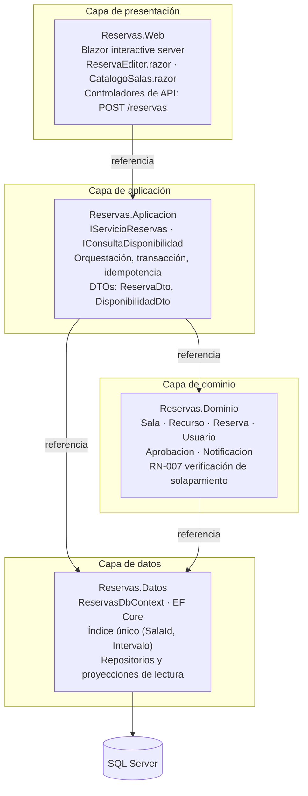
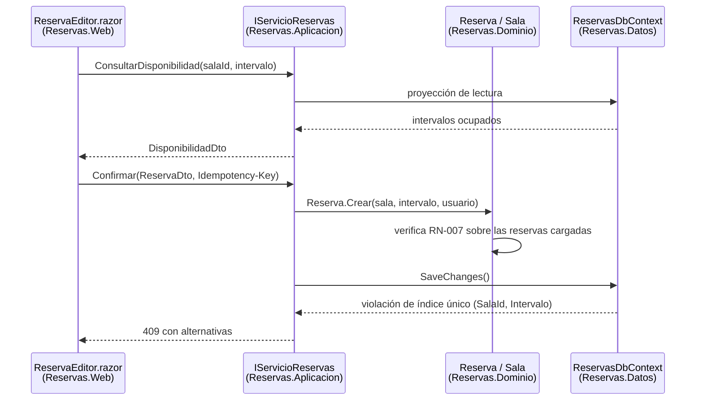

# Modelo de capas — `ARQ-CAPAS`

## Resumen ejecutivo

Es el estilo arquitectónico más enseñado, más aplicado y más frecuentemente mal documentado. Su idea central cabe en una frase —agrupar el código por responsabilidad y permitir que las dependencias vayan en un solo sentido— y esa simplicidad aparente explica tanto su difusión como su degradación: casi todo equipo cree tener capas porque tiene carpetas con esos nombres, y muy pocos pueden mostrar dónde está escrito qué puede llamar a qué.

Lo que este documento sostiene es que el modelo de capas no se sostiene en el diagrama sino en dos piezas documentales concretas: el contrato entre capas, que vive en el [HLD](../30-Arquitectura/HLD.md), y la regla de dependencia con sus excepciones autorizadas, que vive en el [SAD](../30-Arquitectura/SAD.md) y se hace verificable en las convenciones de desarrollo. Sin esas dos piezas, un sistema en capas es indistinguible de un sistema sin estructura que casualmente tiene cuatro proyectos en la solución.

Le sirve al arquitecto que debe justificar por qué no eligió algo más elaborado, al desarrollador que necesita saber dónde poner una validación nueva, y al evaluador de `ESC-3` que abre un repositorio ajeno y quiere determinar si la estructura que ve es intencional o es sedimento.

---

## Definición

### Qué es

Un particionamiento **lógico** del sistema en grupos de responsabilidad homogénea, ordenados verticalmente, sujeto a una regla que define el sentido admisible de las dependencias entre esos grupos. La estructura tiene dos componentes inseparables: la partición y la regla. Una partición sin regla es una taxonomía de carpetas; una regla sin partición no tiene sobre qué aplicarse.

La regla canónica es unidireccional y descendente: una capa puede depender de la capa inmediatamente inferior y nunca de una superior. En el sistema de reserva de salas, esto significa que la capa de presentación conoce a la de aplicación, que la de aplicación conoce al dominio, y que el dominio no sabe que existe una pantalla. Cuando el código de `Reservas.Dominio` necesita comunicar algo hacia arriba, lo hace por retorno o por un evento que otro capta, jamás invocando un tipo de `Reservas.Web`.

La versión de tres capas —presentación, lógica de negocio, acceso a datos— es la formulación clásica y la que aparece en la mayoría de los sistemas de línea de negocio. Fowler la trata en *Patterns of Enterprise Application Architecture* como la organización por omisión de las aplicaciones empresariales, y buena parte del catálogo de patrones de ese libro se entiende como el relleno de cada una de esas tres bandas.

### Qué problema resuelve

El problema es la propagación del cambio. En un sistema sin particionar, cambiar el motor de base de datos toca código de pantalla, y cambiar la disposición de un formulario obliga a recompilar la lógica de negocio. La partición por responsabilidad acota el radio de un cambio a la capa donde ocurre, siempre que el contrato con las capas vecinas se mantenga. El beneficio es de comprensión antes que de sustituibilidad: la mayoría de los equipos que estructuran en capas nunca cambian de motor de base de datos, y sin embargo se benefician a diario de saber dónde buscar.

El segundo problema que resuelve es organizativo. Con capas, la asignación de trabajo y la revisión de código tienen ejes naturales, y la conversación sobre dónde va una responsabilidad nueva tiene un marco en lugar de resolverse por preferencia personal.

### Capas estrictas y capas relajadas

| | Capas estrictas | Capas relajadas |
|---|---|---|
| Dependencia admitida | Solo a la capa inmediatamente inferior | A cualquier capa inferior |
| Salto de capa | Prohibido | Permitido |
| Costo típico | Capas de reenvío sin lógica propia | Erosión gradual de la frontera |
| Verificación | Simple: pares adyacentes | Exige enumerar los saltos legítimos |
| Cuándo conviene | Sistemas con sustitución real de capas | Sistemas donde el reenvío puro sería mayoritario |

La elección entre ambas variantes es material de ADR, no de preferencia. Un equipo que adopta capas estrictas y luego tolera saltos sin registrarlos termina con lo peor de las dos: la ceremonia del reenvío y la impredecibilidad del salto. Un equipo que adopta capas relajadas sin enumerar qué saltos son legítimos deja la regla sin poder de decisión, porque cualquier violación se justifica a posteriori como relajación prevista.

Existe una tercera formulación que conviene conocer porque cambia el vocabulario sin cambiar la sustancia: la de capas **cerradas** y **abiertas**. Una capa cerrada obliga a que toda petición la atraviese; una capa abierta puede sortearse. Es la misma distinción vista desde la capa en lugar de desde la dependencia, y resulta más cómoda cuando la excepción afecta a una capa entera —«la capa de dominio es abierta para las consultas de solo lectura»— en vez de a un par de operaciones puntuales. Lo importante es que el documento use un solo vocabulario y lo defina; alternar entre ambos en el mismo SAD produce lectores que creen estar leyendo dos reglas distintas.

### Qué no es

**No es una topología de despliegue.** La distinción entre *layer* y *tier* es la confusión más costosa del modelo y la que produce peores documentos. Una capa es una partición del código; un *tier* es un nodo de ejecución. Un sistema de cuatro capas puede desplegarse íntegro en un solo proceso de ASP.NET Core sobre una única máquina, y sigue teniendo cuatro capas. Cuando el SAD dice «arquitectura de tres capas» sin aclarar cuál de los dos sentidos usa, el lector de operaciones entiende tres servidores y el desarrollador entiende tres proyectos, y ambos siguen trabajando con esa lectura durante meses.

**No es una arquitectura de dominio.** Las capas dicen dónde vive el código, no cómo está modelado. Un sistema en capas puede tener un dominio rico o un conjunto de estructuras de datos anémicas movidas por servicios de transacción; la elección es ortogonal y se documenta aparte, en el modelo de dominio.

**No es tener tres carpetas.** La estructura de directorios es evidencia débil. Lo que constituye la capa es la restricción de dependencia efectivamente impuesta —por referencias de proyecto, por tests de arquitectura, por revisión— y su ausencia convierte las carpetas en una convención de nombres sin consecuencias.

### Con qué se lo confunde

Con **cliente-servidor**, porque el diagrama de tres bandas se parece al de tres nodos. La diferencia está en el eje: cliente-servidor particiona por proceso y frontera de red, capas particiona por responsabilidad dentro de un mismo cuerpo de código. Ambos modelos son compatibles y suelen coexistir; el detalle está en [Cliente-Servidor.md](Cliente-Servidor.md).

Con **hexagonal**, porque ambos hablan de aislar el dominio. La diferencia es el sentido de la dependencia respecto de la persistencia, y es la distinción conceptual más importante de esta familia. En tres capas clásicas, la capa de datos está **abajo**: la lógica de negocio depende del acceso a datos, y por lo tanto el dominio conoce el mecanismo de persistencia. En hexagonal, la persistencia es un adaptador **externo** que depende del dominio a través de un puerto que el propio dominio declara. La flecha se invierte, y con ella se invierte qué es sustituible. Un modelo de capas donde `Reservas.Dominio` referencia a `Reservas.Datos` es tres capas ortodoxo; uno donde `Reservas.Datos` referencia a `Reservas.Dominio` para implementar interfaces declaradas allí ya es una arquitectura de dependencias invertidas, y el documento debería llamarla por su nombre. Comparación completa en [Hexagonal.md](Hexagonal.md).

Con la idea de que capas y **monolito** son sinónimos. Las capas son el estilo interno más común de un monolito, pero un microservicio individual también suele estructurarse en capas. El eje monolito/servicios está en [Monolitico.md](Monolitico.md) y [Microservicios.md](Microservicios.md).

---

## Documentación que exige el modelo

Elegir capas no reduce la documentación necesaria: la desplaza. El modelo concentra su riesgo en un punto —la frontera entre capas— y ese punto no es observable en el código sin ayuda, porque una llamada legítima y una violación de la regla se escriben exactamente igual. Toda la documentación característica del modelo existe para hacer visible esa diferencia.

### Peso por familia documental

| Familia | Peso | Qué cambia concretamente |
|---------|------|--------------------------|
| Visión | Sin cambio | El estilo interno no altera la propuesta de producto |
| Análisis | Alto | El modelo de dominio determina qué capa recibe cada regla; sin él, la asignación es arbitraria |
| Arquitectura | Alto | El SAD fija las capas y la regla; el HLD define el contrato entre ellas |
| Diseño | Alto | El modelo de datos gana peso máximo; el LLD documenta el mapeo entre representaciones |
| Operativa | Bajo | El despliegue no se ve afectado: las capas no son nodos |
| Desarrollo | Muy alto | Es donde la regla de dependencia se vuelve verificable |
| Usuarios | Sin cambio | Invisible para el usuario final |

Las dos familias que ganan son Arquitectura y Desarrollo, y ganan por motivos distintos. Arquitectura gana porque la regla es una decisión con alternativas descartadas. Desarrollo gana porque una regla que solo vive en un documento se erosiona en el primer sprint con presión de entrega; la que vive además en una referencia de proyecto y en un test que falla, no.

La familia que pierde peso es la Operativa. Un sistema en capas se despliega como cualquier otro artefacto de su topología, y los runbooks no cambian una línea por el hecho de que el código esté particionado. Es la diferencia más nítida con [Microservicios.md](Microservicios.md), donde la elección de estilo reescribe la documentación de operación entera.

### Qué cambia en cada artefacto

**SAD.** Incorpora tres cosas que en otros modelos no existen o son marginales. Primero, el catálogo de capas con la responsabilidad de cada una enunciada de forma excluyente: no basta decir que la capa de aplicación «orquesta», hay que decir qué queda fuera de ella. Segundo, la regla de dependencia declarada en términos normativos, estricta o relajada, con las excepciones autorizadas enumeradas una por una. Tercero, la aclaración explícita de que las capas no son *tiers*, con la vista de despliegue mostrando en qué proceso corre cada una. La estructura del documento en sí no se explica acá: está en [SAD.md](../30-Arquitectura/SAD.md).

**HLD.** Es la pieza que más gana, y la que más se omite. El contrato entre capas es exactamente el objeto del HLD: qué tipos expone cada capa hacia arriba, qué tipos no cruzan la frontera, y cómo se traduce la información entre una representación y otra. En el sistema de reservas, el HLD debe decir que `Reservas.Aplicacion` expone `IServicioReservas` con DTOs propios, que las entidades de EF Core no salen de `Reservas.Datos`, y que la traducción ocurre en un punto identificable. Cuando ese contrato no está escrito, la frontera la define el primer desarrollador que necesita un campo y devuelve la entidad completa porque es más rápido. Formato en [HLD.md](../30-Arquitectura/HLD.md).

**LLD.** Documenta el interior de cada capa y, específicamente, los puntos de traducción: mapeadores, ensambladores, la lógica de conversión entre el modelo de persistencia y el modelo de dominio. Es trabajo repetitivo y por eso propenso a quedar sin documentar, con la consecuencia de que nadie sabe si un campo faltante en un DTO es una omisión o una decisión.

**Modelo de datos.** Alcanza su peso máximo en este modelo, y la razón es estructural: con la capa de datos abajo, el esquema condiciona el dominio en lugar de derivarse de él. Las decisiones de normalización, los índices y las restricciones de integridad se propagan hacia arriba, y el modelo de datos deja de ser un anexo técnico para convertirse en una fuente de restricciones de negocio. Es el mismo mecanismo que produce la trampa que [Escenarios](../00-Marco-de-Referencia/Escenarios.md) señala en `ESC-2`: reglas de negocio embebidas en el esquema que nadie documentó porque nadie las consideró negocio.

**Especificación de API.** No cambia de forma por el estilo interno, y esa independencia es en sí misma una propiedad documentable: el contrato de `POST /reservas` es el mismo bajo capas, hexagonal o microservicios. Lo que sí conviene registrar es la correspondencia entre operación de API y servicio de aplicación, porque es la traza que permite calcular el impacto de un cambio de contrato sin leer el código.

**Runbooks.** Sin cambios atribuibles al modelo. Se documenta que no aplica, en lugar de omitir la fila.

### La regla de dependencia y sus excepciones

Es el artefacto conceptual propio del modelo, y merece tratamiento explícito porque su documentación tiene una forma que no se repite en ningún otro estilo. Consta de tres partes.

La **declaración** enuncia el sentido admisible en términos normativos, con el vocabulario de RFC 2119 si el documento lo adopta: la capa de presentación DEBE depender únicamente de la capa de aplicación; la capa de dominio NO DEBE depender de ninguna otra capa del sistema.

Las **excepciones autorizadas** se enumeran individualmente, cada una con su justificación y su fecha. En el sistema de reservas hay dos típicas. La primera es el informe de ocupación: una consulta de solo lectura que agrega datos de miles de reservas y que, pasando por el dominio, exigiría materializar objetos que se descartan de inmediato; se autoriza que la capa de aplicación consulte una proyección de lectura directamente contra `Reservas.Datos`, sin instanciar entidades. La segunda es la validación de disponibilidad en la interfaz: la pantalla de alta consulta disponibilidad antes de confirmar, y esa consulta atraviesa la aplicación sin lógica de negocio propia. La primera excepción es una decisión con alternativas —vale un ADR—; la segunda es una capa de reenvío tolerada y basta con una nota en el HLD.

La **caducidad** es lo que distingue una excepción documentada de una grieta. Cada excepción registra en qué condición dejaría de ser necesaria. Una excepción de rendimiento cuyo motivo desapareció y que nadie retiró es deuda que se ha vuelto invisible, porque ya está autorizada.

### Convenciones de desarrollo que la hacen verificable

Las convenciones (`FAM-DEV`) son donde la regla deja de ser una aspiración. Tres mecanismos, de menor a mayor fuerza.

La **estructura de referencias de la solución .NET** es el más fuerte de los tres porque el compilador lo impone. Si `Reservas.Dominio` no referencia a `Reservas.Datos`, ningún desarrollador puede violar esa frontera por descuido: el código no compila. Documentar el grafo de referencias del archivo de solución es, en este modelo, documentar arquitectura, y conviene que el SAD lo diga con esas palabras para que nadie agregue una referencia «temporal» sin advertir que está modificando la arquitectura.

Los **tests de arquitectura** cubren lo que las referencias no pueden: las restricciones intra-ensamblado y las de tipo. Verifican que ningún tipo de `Reservas.Web` mencione un tipo del espacio de nombres de entidades de EF Core, que ninguna clase del dominio herede de un tipo de infraestructura, que los servicios de aplicación no expongan tipos de persistencia en sus firmas públicas. Un test así es documentación ejecutable: la regla y su verificación son el mismo artefacto, y no pueden desincronizarse.

Las **convenciones de nomenclatura y ubicación** son el mecanismo más débil y el más barato. Sirven para que una violación sea visible en revisión de código, no para impedirla.

La proporción sana entre los tres es la que deja el mínimo de reglas confiadas solo a la revisión humana. Toda regla que pueda expresarse como referencia de proyecto debería serlo; toda regla que no, debería intentarse como test; lo que quede va al documento con la conciencia de que se erosionará.

### Las decisiones que piden ADR

El modelo genera un conjunto acotado y recurrente de decisiones estructurales. Registrarlas cuando se toman evita que cada incorporación al equipo las reabra:

| Decisión | Alternativa principal descartada | Consecuencia de no registrarla |
|----------|----------------------------------|-------------------------------|
| Capas estrictas o relajadas | La contraria | Cada salto se discute de cero |
| Sentido de la dependencia con datos | Inversión al estilo hexagonal | Alguien invierte una parte y quedan dos arquitecturas |
| Cantidad de capas | Fusionar aplicación y dominio | Capas de reenvío que nadie se anima a eliminar |
| Tipos que cruzan fronteras | Reutilizar la entidad de persistencia | El contrato de la API queda atado al esquema |
| Ubicación de las reglas de concurrencia | Solo dominio, o solo motor | Reglas que desaparecen en una optimización |

Ninguna de estas decisiones es reversible barata una vez que hay código apoyado en ella, y todas tienen la propiedad que `ACT-03` debe vigilar: se toman una vez, se olvidan, y se vuelven a discutir con los mismos argumentos. El formato del registro está en [ADR.md](../30-Arquitectura/ADR.md).

---

## Aplicación por escenario

### `ESC-1` — Desarrollo de software nuevo

El modelo se elige antes de la primera línea de código y la elección compromete. Lo que hay que decidir y registrar en este orden: cuántas capas, con qué responsabilidad excluyente cada una, estrictas o relajadas, y qué se referencia con qué en la solución. Un ADR que registre la elección de capas frente a hexagonal es de los más útiles del proyecto, porque es exactamente la discusión que reaparecerá cuando el equipo crezca y alguien proponga invertir la dependencia de datos.

La trampa propia del escenario es diseñar más capas de las que el sistema justifica. Cuatro capas en un sistema con un solo consumidor y sin sustitución prevista producen tres niveles de reenvío por cada operación, y ese costo lo paga cada desarrollador en cada cambio durante toda la vida del producto. La cantidad de capas se justifica en el SAD con el atributo de calidad que cada una protege; una capa sin atributo asignado es una capa de más.

### `ESC-2` — Migración a otro lenguaje o plataforma

El modelo de capas aparece en las dos direcciones de la migración, y no necesariamente con la misma forma. En el origen suele estar en su versión más deteriorada: tres capas nominales donde la de datos contiene procedimientos almacenados con reglas de negocio, y la de presentación contiene validaciones que nadie replicó en el servidor. La reconstrucción del origen tiene que documentar dónde está realmente cada regla, no dónde el diagrama dice que está.

En el destino, la elección de capas es frecuentemente la opción de menor riesgo, porque preserva la estructura mental del equipo mientras cambia la plataforma. Una migración de ASP.NET MVC a Blazor Server que mantiene las tres capas y reemplaza solo la de presentación acota el riesgo a una banda. La tabla de equivalencias que `ESC-2` exige se vuelve, en ese caso, un mapeo capa a capa que es legible de un vistazo.

El punto que más frecuentemente se omite: cuando el origen tiene lógica en procedimientos almacenados y el destino la sube a la capa de dominio, la migración no es de plataforma sino de arquitectura, y necesita su propio ADR y su propio criterio de paridad.

### `ESC-3` — Evaluación de software existente con acceso al código

El modelo de capas es de los más fáciles de reconstruir desde evidencia, y esa facilidad es una trampa. El grafo de referencias de la solución se lee en minutos y produce un diagrama convincente; lo que ese diagrama no dice es si la regla se respeta dentro de cada ensamblado. Un evaluador que se detiene en las referencias documenta la intención declarada, no la estructura real.

La verificación mínima consiste en tres búsquedas: si aparecen tipos de EF Core en el ensamblado de presentación, si el dominio menciona tipos de infraestructura, y si existen consultas directas a la base desde controladores o componentes. Los hallazgos se registran como observación con archivo y línea, según exige el escenario. La distancia entre el diagrama declarado y las tres búsquedas es, en sí misma, el hallazgo principal.

Los ADR retrospectivos registran la decisión observable —«la solución está organizada en cuatro proyectos con referencias descendentes»— sin atribuir una motivación que nadie puede confirmar.

### `ESC-4` — Evaluación de un producto solo desde afuera

El modelo de capas es prácticamente indetectable desde afuera, y esa es la respuesta honesta. No hay comportamiento observable que distinga un sistema en capas de uno hexagonal: ambos responden igual, con las mismas latencias y los mismos códigos de error. Cualquier afirmación sobre el estilo interno en este escenario es especulación con confianza baja, y corresponde decirlo así en lugar de omitir la entrada.

Lo poco que se puede inferir es negativo y débil. Mensajes de error que filtran nombres de tablas o excepciones de acceso a datos sugieren que la capa de datos no está encapsulada; validaciones que solo se aplican en el navegador sugieren lógica de negocio en presentación. Ambos son indicios de deterioro, no evidencia de estilo, y se registran como hipótesis observables con la captura que las sostiene.

### Variación por contexto

En `CTX-1` la capa de presentación absorbe complejidad que en backend no existe, y la pregunta que el modelo obliga a responder es dónde vive el estado de la interfaz. En Blazor con render mode *interactive server*, el estado del circuito es estado de presentación aunque físicamente resida en el servidor, y confundirlo con estado de aplicación produce servicios con memoria por usuario que nadie sabe que la tienen. En MAUI con MVVM, el ViewModel es presentación sin discusión, y la tentación es meterle reglas de negocio porque tiene acceso a todo.

En `CTX-2` las capas se reducen habitualmente a tres y el peso se desplaza al contrato de aplicación, que suele mapear casi uno a uno con los endpoints. La pregunta característica es si la capa de aplicación existe como tal o si los controladores de ASP.NET Core son la capa de aplicación con otro nombre; ambas respuestas son defendibles y solo una es la que el equipo aplica.

En `CTX-3` aparece el problema propio del contexto: la frontera cliente-servidor y la frontera entre capas son ejes distintos que el equipo tiende a superponer. En Blazor Server ambas fronteras conviven en el mismo proceso, y sin documentación explícita nadie distingue una llamada que cruza el circuito de una que solo cruza una capa. La traza vertical que `CTX-3` exige debe indicar, para cada requisito, en qué capa vive cada eslabón.

---

## Ejemplos concretos con el sistema de reserva de salas

### Estructura de la solución



La responsabilidad excluyente de cada capa, tal como debería figurar en el SAD, con la columna que suele faltar:

| Capa | Responsable de | Explícitamente fuera de su alcance |
|------|----------------|-----------------------------------|
| `Reservas.Web` | Interacción, estados de pantalla, contrato HTTP, autenticación corporativa | Decidir si una reserva es válida; conocer el esquema |
| `Reservas.Aplicacion` | Orquestar casos de uso, transacción, idempotencia, notificaciones, traducción de errores | Contener reglas de negocio propias; renderizar |
| `Reservas.Dominio` | Entidades, invariantes, `RN-007`, política de aprobación de salas restringidas | Conocer HTTP, el `DbContext` o el calendario corporativo |
| `Reservas.Datos` | Mapeo, consultas, restricciones de integridad, migraciones | Decidir cuándo se aprueba una reserva |

La columna derecha es la que convierte la tabla en una regla. «`Reservas.Aplicacion` orquesta» no impide que alguien meta allí la validación de solapamiento; «no contiene reglas de negocio propias» sí, y además da al revisor de código un enunciado que citar.

El sentido de las flechas es el de la referencia de proyecto, que en .NET es también el sentido de la dependencia de compilación. `Reservas.Web` no referencia a `Reservas.Datos`, y esa ausencia es la que impide que un componente Blazor abra un `DbContext`. La referencia de `Reservas.Aplicacion` a `Reservas.Datos` es el salto de capa autorizado para las proyecciones de lectura del informe de ocupación; en una configuración estricta no existiría, y la consulta pasaría por el dominio.

La referencia de `Reservas.Dominio` a `Reservas.Datos` es la que hace de esto tres capas ortodoxas y no hexagonal. Es la decisión que más conviene registrar en un ADR, porque es exactamente la que se invierte al adoptar puertos y adaptadores.

### Dónde cae `RN-007`

La regla `RN-007` —una sala no admite reservas superpuestas— es el mejor caso de estudio del modelo, porque no cae en una capa sino en tres, y entender por qué es entender el límite del particionamiento.



La verificación aparece tres veces y cada aparición tiene una función distinta. En presentación es una consulta previa que evita que el usuario complete un formulario destinado a fallar; no es la regla, es cortesía de interfaz, y documentarla como regla lleva a que alguien la considere suficiente. En el dominio es la expresión canónica de la regla, la que un lector consulta para saber qué significa exactamente «superpuesta» —si dos reservas contiguas se solapan, si el minuto final cuenta—. En la capa de datos es el índice único `(SalaId, Intervalo)`, que es la única de las tres que se sostiene bajo concurrencia.

La regla se filtra a la capa de datos por una razón que el modelo no puede evitar: entre la verificación en memoria y la escritura hay una ventana en la que otra transacción puede insertar una reserva conflictiva. Ninguna cantidad de lógica en el dominio cierra esa ventana; solo la cierra una restricción impuesta por el motor. Lo que hay que documentar al respecto es preciso y suele faltar entero:

- Que `RN-007` tiene una implementación de dominio y una garantía de datos, y que la segunda es la autoritativa bajo concurrencia.
- Que la violación del índice único **no** es un error técnico sino la manifestación de una regla de negocio, y que la capa de aplicación la traduce a `409` con alternativas en lugar de dejarla escalar como excepción de infraestructura.
- Que el índice único es parte del contrato de la regla, y que modificarlo o eliminarlo en una migración de esquema es un cambio de comportamiento del sistema, no una optimización.
- Que la comprobación en `ReservaEditor.razor` es indicativa y puede quedar obsoleta entre la consulta y la confirmación, comportamiento que el flujo de la interfaz debe contemplar según lo que exige `CTX-1`.

Sin ese registro, la secuencia previsible es conocida: alguien encuentra el índice único durante una revisión de rendimiento, no ve ninguna documentación que lo justifique, lo elimina para acelerar las inserciones, y la regla desaparece sin que ninguna prueba unitaria lo detecte porque el dominio sigue verificando correctamente en el caso sin concurrencia.

### Qué cruza cada frontera

| Frontera | Cruza | No cruza |
|----------|-------|----------|
| Web → Aplicación | `ReservaDto`, `DisponibilidadDto`, identificadores | Entidades de dominio, tipos de EF Core |
| Aplicación → Dominio | Entidades y objetos de valor del dominio | DTOs, tipos de ASP.NET Core |
| Dominio → Datos | Entidades del dominio, especificaciones de consulta | Tipos de presentación |
| Aplicación → Datos | Solo proyecciones de lectura (excepción autorizada) | Escrituras: van por el dominio |

La fila que más se viola es la primera, y siempre por el mismo motivo: devolver la entidad de EF Core desde el servicio de aplicación funciona, ahorra un mapeador y no rompe nada visible. Lo que rompe es diferido: la entidad arrastra propiedades de navegación que provocan consultas al serializar, expone campos que no deberían salir del servidor, y ata el contrato de la API al esquema de la base. El test de arquitectura que prohíbe tipos del espacio de nombres de entidades en las firmas públicas de `Reservas.Aplicacion` cuesta una tarde y cierra la puerta de forma permanente.

### La integración que el modelo no ubica bien

El calendario corporativo se integra por webhook y el evento `ReservaConfirmada` se publica con garantía *at-least-once*. Ninguna de las dos cosas encaja limpiamente en el esquema vertical, y ahí está el límite honesto del modelo: la integración saliente no es presentación, no es dominio y no es acceso a datos, y meterla en la capa de aplicación —que es lo habitual— la mezcla con la orquestación de casos de uso.

Las tres salidas usuales, todas defendibles, ninguna evidente:

1. Un adaptador dentro de `Reservas.Datos`, tratando el calendario como otro almacén externo. Es coherente con «abajo está lo que habla con el mundo», y produce una capa de datos que ya no es solo datos.
2. Una capa de infraestructura al lado de la de datos, con la misma posición en el grafo de dependencias. Es la respuesta más limpia y la que agrega la quinta capa que el equipo intentaba evitar.
3. Un proyecto de integración que la capa de aplicación referencia directamente. Es un salto de capa autorizado más, con la carga documental correspondiente.

Lo que hay que documentar no es cuál se eligió sino por qué la pregunta existe: es el punto donde el particionamiento vertical deja de tener una respuesta obvia, y es también el argumento con el que alguien propondrá hexagonal en la próxima revisión de arquitectura, donde la integración es un adaptador sin ambigüedad de ubicación. La deduplicación por `reservaId` que el consumidor debe hacer, en cambio, no es problema de este sistema y pertenece a la especificación del evento.

### El mismo sistema en ASP.NET MVC y en MAUI

En ASP.NET MVC la capa de presentación es controladores más vistas, y la pregunta característica es qué hace el controlador: si valida, decide y consulta, la capa de aplicación no existe aunque el proyecto esté en la solución. En MAUI con MVVM, `Reservas.Web` se reemplaza por un proyecto de ViewModels y el cliente accede a la capa de aplicación por HTTP en lugar de por referencia, con lo cual la frontera entre presentación y aplicación se convierte además en frontera de proceso. Las capas no cambiaron; cambió su distribución en *tiers*, que es precisamente la distinción que el SAD debe mantener separada.

---

## Preguntas guía

- ¿Cuál es la responsabilidad excluyente de cada capa, y qué queda deliberadamente fuera de cada una?
- ¿Las capas son estrictas o relajadas, y dónde está registrada esa elección?
- ¿Qué excepciones a la regla de dependencia están autorizadas, quién las autorizó, y bajo qué condición dejarían de ser necesarias?
- ¿Qué tipos pueden cruzar cada frontera y cuáles no? ¿Está escrito o se resuelve por costumbre?
- ¿La regla se verifica automáticamente, o depende de que alguien la recuerde en la revisión?
- ¿El documento distingue capa de *tier*, o usa «tres capas» sin decir cuál de los dos sentidos?
- Para cada regla de negocio con consecuencias de concurrencia: ¿está documentado cuál de sus implementaciones es la autoritativa?
- ¿Cuántas capas hay, y qué atributo de calidad justifica cada una?
- Si mañana hubiera que cambiar el motor de base de datos, ¿qué capas se tocan según el documento, y qué capas se tocarían en realidad?

---

## Criterios de calidad y antipatrones

### Qué distingue una documentación buena del modelo

La prueba práctica es una sola: un desarrollador que recibe un requisito nuevo debe poder determinar, leyendo el documento y sin preguntar, en qué capa va cada parte de la implementación. Si la respuesta requiere consultar a alguien con antigüedad en el equipo, el documento describe una estructura pero no comunica una regla.

La segunda prueba es de verificabilidad. Toda afirmación sobre la estructura debería poder contrastarse contra algo que falle cuando se viola: una referencia ausente, un test que se pone rojo. Las afirmaciones que solo pueden contrastarse leyendo código son las que envejecen sin que nadie lo note.

En términos de ISO/IEC 25010, el modelo optimiza modificabilidad y capacidad de análisis a costa de eficiencia de desempeño —cada salto entre capas tiene un precio— y, en su versión estricta, de facilidad de modificación puntual, porque un campo nuevo atraviesa cuatro proyectos. El SAD debería nombrar ese compromiso en lugar de presentar las capas como beneficio sin contrapartida. ISO/IEC/IEEE 42010 aporta el encuadre: las capas son una vista, responden a un punto de vista de desarrollo, y sus interesados son el equipo de construcción y mantenimiento, no operaciones ni negocio.

### Antipatrones

**Capa anémica de paso.** Una capa cuyos métodos reciben parámetros, llaman al método homónimo de la capa inferior y devuelven el resultado sin transformarlo. Cuesta un archivo por operación, ninguna decisión queda registrada en ella, y su valor prometido —aislar el cambio— nunca se cobra porque cualquier cambio en la firma inferior se propaga hacia arriba de todas formas. Cuando la mayoría de los métodos de una capa son de paso, la capa no está aislando: está copiando.

**Arquitectura lasagna.** La versión agravada del anterior, con cuatro o cinco capas donde tres son de reenvío. El síntoma diagnóstico es medible: contar cuántos archivos hay que tocar para agregar un campo al formulario de reserva. Si son más de tres y ninguno contiene lógica, el particionamiento excede lo que el sistema justifica. La respuesta correcta no es siempre eliminar capas —a veces la capa vacía es la que impide que otro la llene mal— pero la decisión debe tomarse conscientemente y registrarse.

**Saltos de capa no documentados.** Un componente Blazor que inyecta el `DbContext` porque «era una consulta simple». El daño no es la consulta sino el precedente: a partir de ahí la regla es negociable, y su erosión no deja rastro en ningún documento. La diferencia entre un salto y una excepción autorizada es solo documental, y por eso la documentación es el control.

**Entidades de EF Core paseando por todas las capas.** La entidad de persistencia usada como modelo de dominio, como DTO de la API y como modelo de la vista. Es el atajo más frecuente y el que mejor se disfraza de simplicidad. Sus consecuencias aparecen todas tarde: cambios de esquema que rompen el contrato de la API, consultas inesperadas al serializar propiedades de navegación, campos internos filtrados al cliente, imposibilidad de versionar la API sin versionar la base. La contramedida es documental antes que técnica: declarar en el HLD qué tipos cruzan cada frontera, y hacerlo verificable con un test de arquitectura.

**Lógica de negocio en procedimientos almacenados.** Reglas que viven en el motor de base de datos, fuera de la capa de dominio, del control de versiones efectivo y de las pruebas. La forma más dañina no es la deliberada sino la histórica: procedimientos escritos hace años que nadie revisó y que el equipo actual desconoce. Es la trampa que `ESC-2` señala explícitamente, y su detección temprana es una de las tareas de mayor retorno en una evaluación de `ESC-3`. La distinción operativa: una restricción de integridad como el índice único `(SalaId, Intervalo)` es una garantía documentada de una regla que también vive en el dominio; un procedimiento que calcula tarifas es una regla que solo vive en el motor.

**Dependencia circular disimulada.** El dominio que necesita algo de arriba y lo obtiene mediante un servicio inyectado cuya interfaz está en el dominio pero cuya implementación conoce la presentación. Formalmente no hay ciclo de referencias; en la práctica, el dominio depende del comportamiento de una capa superior. Es la señal de que el sistema está pidiendo una inversión de dependencia real, y la respuesta honesta suele ser evaluar hexagonal en lugar de simularlo a medias.

**El diagrama sin la regla.** Tres cajas apiladas con flechas descendentes, sin una sola línea que diga qué está prohibido. Es el estado por omisión de la documentación de capas, y el que hace que la mayoría de los sistemas «en capas» no lo estén.

---

## Anexo — Lista de verificación comentada

Se completa al documentar el modelo en un sistema nuevo, o al evaluarlo en uno existente. Cada ítem lleva la pregunta que lo justifica.

```markdown
## Documentación del modelo de capas — <sistema> — <fecha>

### Catálogo de capas
- [ ] Cada capa tiene responsabilidad enunciada de forma excluyente
      (¿qué queda FUERA de esta capa? Si no se puede responder, la frontera no existe)
- [ ] Cada capa tiene un atributo de calidad asignado que la justifica
      (una capa sin atributo asignado es una capa de más)
- [ ] Cada capa tiene su proyecto o ensamblado identificado por nombre
      (si dos capas comparten ensamblado, la regla no la impone el compilador)

### Regla de dependencia
- [ ] Declarada como estricta o relajada, con vocabulario normativo
      (¿un lector nuevo sabe si puede saltar una capa?)
- [ ] Excepciones enumeradas una por una, con autor y fecha
      (una excepción sin autor no se puede discutir ni retirar)
- [ ] Cada excepción registra la condición bajo la cual dejaría de ser necesaria
      (sin caducidad, la excepción se vuelve estructura permanente)
- [ ] Las excepciones con alternativas evaluadas tienen ADR
      (¿esta excepción fue una decisión o una concesión?)

### Contrato entre capas — HLD
- [ ] Tipos que cruzan cada frontera, enumerados
      (¿puede salir una entidad de EF Core de la capa de datos?)
- [ ] Tipos que NO cruzan, enumerados explícitamente
      (lo prohibido no se deduce de lo permitido)
- [ ] Puntos de traducción identificados
      (¿dónde exactamente se convierte una entidad en DTO?)
- [ ] Interfaces públicas de cada capa listadas con su capa consumidora
      (si una interfaz no tiene consumidor documentado, ¿para quién existe?)

### Layer vs tier
- [ ] El documento aclara que las capas no son nodos de despliegue
      (¿alguien podría leer "tres capas" y entender tres servidores?)
- [ ] La vista de despliegue indica en qué proceso corre cada capa
      (dos ejes distintos, dos diagramas distintos)

### Verificación — FAM-DEV
- [ ] Grafo de referencias de la solución documentado como parte de la arquitectura
      (¿agregar una referencia es un cambio arquitectónico declarado?)
- [ ] Tests de arquitectura para las restricciones que la referencia no cubre
      (tipos, espacios de nombres, firmas públicas)
- [ ] Se identifica qué reglas quedan solo bajo revisión humana
      (esas son las que se erosionarán; conviene saber cuáles son)

### Reglas de negocio con implementación múltiple
- [ ] Para cada regla con consecuencias de concurrencia, se identifican todas
      sus implementaciones y cuál es la autoritativa
      (RN-007: dominio + índice único; la autoritativa es el índice)
- [ ] Las restricciones de esquema que materializan reglas están marcadas como tales
      (¿alguien podría eliminar este índice creyendo que es una optimización?)
- [ ] La traducción de violación de restricción a respuesta de negocio está documentada
      (violación de índice único → 409 con alternativas, no error 500)

### Contexto
- [ ] CTX-1: dónde vive el estado de interfaz y qué capa lo posee
- [ ] CTX-2: si la capa de aplicación existe o los controladores la absorbieron
- [ ] CTX-3: la traza vertical indica la capa de cada eslabón
```

Los ítems de la sección de reglas con implementación múltiple son los que menos se completan y los que más incidentes previenen. Un índice único sin documentación que lo ate a una regla de negocio sobrevive exactamente hasta la primera revisión de rendimiento que lo encuentre.

---

## Documentos relacionados

- [README del catálogo de modelos](README.md) — el conjunto de estilos y el criterio de elección entre ellos.
- [Cliente-Servidor](Cliente-Servidor.md) — el otro eje de partición, por proceso en lugar de por responsabilidad.
- [Monolítico](Monolitico.md) — el envase habitual del modelo de capas.
- [Hexagonal](Hexagonal.md) — la inversión de la dependencia de datos y qué gana con ella.
- [Microservicios](Microservicios.md) — donde las capas dejan de ser el eje estructural principal.
- [Comparativa y criterios](Comparativa-y-Criterios.md) — cuándo cada modelo, con qué compromisos.
- [Documentación de arquitectura](../30-Arquitectura/README.md) — la familia que documenta la elección: [SAD](../30-Arquitectura/SAD.md), [HLD](../30-Arquitectura/HLD.md), [ADR](../30-Arquitectura/ADR.md).
- [Escenarios](../00-Marco-de-Referencia/Escenarios.md) · [Contextos](../00-Marco-de-Referencia/Contextos.md) · [Actores](../00-Marco-de-Referencia/Actores.md)
