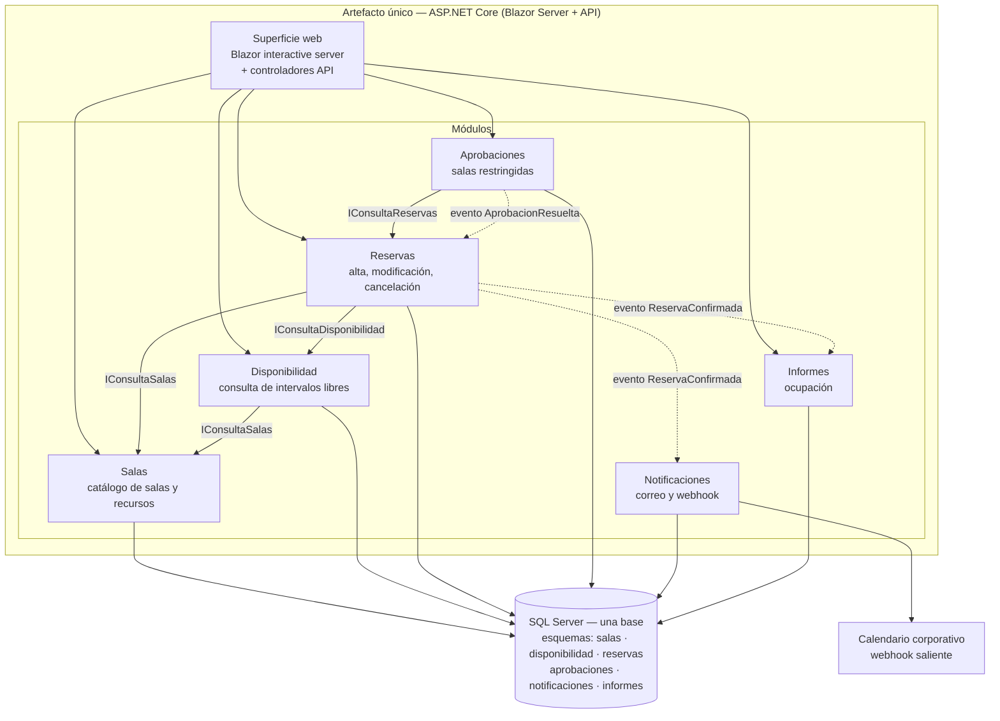
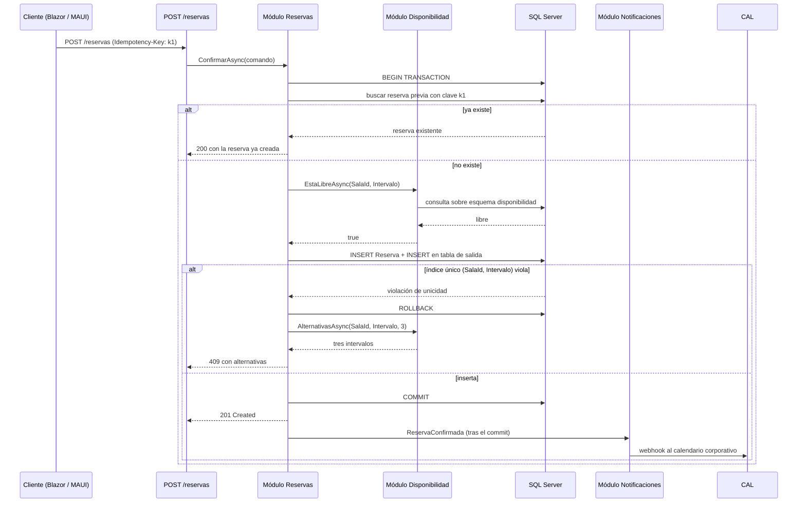

# Monolítico y monolito modular — `ARQ-MONO`

## Resumen ejecutivo

Un sistema monolítico se compila, se versiona y se despliega como una sola unidad. Esa es toda la definición, y de ella no se desprende nada sobre la calidad de su estructura interna: un monolito puede estar organizado en módulos con fronteras más nítidas que las de muchos sistemas distribuidos, o puede ser una masa indiferenciada de código donde cualquier clase alcanza a cualquier otra. Confundir la unidad de despliegue con el grado de acoplamiento es el malentendido que sostiene la mayor parte del prejuicio contra este modelo.

El documento desarrolla dos variantes. El monolito sin más, que es la forma por defecto en la que nace casi todo sistema, y el **monolito modular**, que impone al interior de un único artefacto desplegable las mismas fronteras que un diseño distribuido impondría entre procesos: módulos con interfaz publicada, propiedad exclusiva de sus tablas y prohibición de acceso lateral. La diferencia entre ambos no se ve en el diagrama de despliegue —es idéntico— sino en el HLD, y por eso el HLD es, en este modelo, el documento crítico.

Le sirve a `ACT-03` cuando tiene que justificar por qué no arranca con servicios, a `ACT-04` cuando necesita saber qué puede llamar desde dónde, y a `ACT-06` porque la operativa de un monolito es la más barata de todo el catálogo. Para quien evalúa alternativas, la comparación sistemática está en [Comparativa y criterios](Comparativa-y-Criterios.md).

---

## Definición

### Qué es

El sistema se construye como un único artefacto ejecutable. En términos .NET: una solución que produce un proceso ASP.NET Core —o un ejecutable, o una imagen de contenedor— que contiene todo el código de aplicación y se lleva entero al entorno de destino. Las llamadas entre partes del sistema son invocaciones de método dentro del mismo dominio de aplicación: no atraviesan la red, no serializan, no fallan por *timeout*, y participan de la misma transacción de base de datos.

Que la solución tenga quince proyectos `.csproj` no la vuelve distribuida. Los proyectos son unidad de compilación y de referencia; la unidad de despliegue sigue siendo una. Esa distinción es exactamente el eje del modelo, y conviene fijarla antes de seguir: **el monolito es una decisión sobre el artefacto que se despliega, no sobre el número de ensamblados, ni de repositorios, ni de equipos.**

### Qué problema resuelve

Elimina de raíz una familia entera de problemas: latencia de red entre componentes, fallos parciales, consistencia eventual, versionado de contratos internos, descubrimiento de servicios, trazabilidad distribuida, coreografía de transacciones. Nada de eso desaparece porque el arquitecto sea hábil; desaparece porque el sistema no tiene fronteras de proceso donde esos problemas puedan ocurrir.

A cambio ofrece dos capacidades que un sistema distribuido paga caro. La primera es la **transacción local**: varias escrituras sobre entidades distintas se confirman o se revierten juntas, con una garantía que el motor de base de datos provee y que nadie tiene que implementar. La segunda es la **refactorización barata de fronteras**: mover una responsabilidad de un módulo a otro es un cambio de código con el compilador como red de seguridad, no una negociación entre equipos con un contrato de red de por medio.

Esa segunda capacidad es la que sostiene el argumento más fuerte a favor del modelo en `ESC-1`: cuando todavía no se sabe dónde están las fronteras del dominio, conviene estar en la estructura donde equivocarse es más barato.

### Qué NO es

**No es "sin capas".** Un monolito puede estar organizado en capas —presentación, aplicación, dominio, infraestructura— y de hecho es su organización más común. El modelo de capas es una decisión de estructura interna ortogonal a la unidad de despliegue; se desarrolla en [Modelo de capas](Modelo-de-Capas.md).

**No es "sin módulos".** El monolito modular es precisamente la demostración de lo contrario. La modularidad se logra con visibilidad de tipos, referencias de proyecto controladas, interfaces publicadas y reglas verificables en la compilación.

**No es legado por definición.** Un sistema es legado cuando nadie entiende cómo cambiarlo con seguridad, condición que depende de la calidad de su estructura interna y de su cobertura de pruebas, no de cuántos procesos ocupa. Hay monolitos de quince años que reciben cambios en horas y plataformas de servicios de dos años que nadie toca sin miedo.

**No es incompatible con la escala.** Un proceso ASP.NET Core se replica horizontalmente detrás de un balanceador con la misma facilidad que un servicio pequeño; lo que no se puede es escalar sus partes de forma independiente. Si el módulo de informes consume el noventa por ciento de la CPU, se replica el sistema entero. Esa es una limitación real y es un criterio legítimo de decisión —pero es *esa*, y no la imposibilidad de escalar.

### Con qué se lo confunde

| Se lo confunde con | Qué es en realidad | Por qué no es lo mismo |
|---|---|---|
| *Big ball of mud* | Ausencia de estructura interna reconocible | Es una patología de diseño, no una topología de despliegue; ocurre igual en sistemas distribuidos |
| Monolito distribuido | Varios procesos con acoplamiento de monolito | Paga el costo de la red sin obtener la independencia de despliegue |
| Monorepo | Un repositorio con varios artefactos | Un repositorio puede producir doce imágenes de contenedor independientes |
| Aplicación en capas | Organización interna en niveles | Se puede tener capas en un monolito y capas dentro de cada servicio |

El *big ball of mud* es lo que la mayoría de la gente describe cuando dice "monolito" en tono peyorativo: código donde el módulo de facturación consulta la tabla de reservas, el controlador contiene reglas de negocio y una clase de utilidades importa media aplicación. Nada de eso lo causa el despliegue único. Lo causa la ausencia de fronteras internas y de un mecanismo que las haga cumplir, y esa ausencia se puede replicar sin dificultad en quince contenedores.

El **monolito distribuido** merece un párrafo propio porque es la peor de las tres opciones. Se produce cuando un sistema se parte en procesos sin haber establecido primero las fronteras de dominio: los servicios comparten la base de datos, cambiar uno obliga a desplegar a otros dos en el mismo orden, y una operación de negocio atraviesa cuatro saltos de red que ninguna transacción cubre. Tiene la rigidez de un monolito y el costo operativo de un sistema distribuido. La literatura sobre descomposición de arquitecturas —*Software Architecture: The Hard Parts*, y el tratamiento de fronteras de servicio en *Building Microservices* de Sam Newman— insiste en el mismo punto: la partición en procesos es la consecuencia de haber encontrado las fronteras, no el método para encontrarlas.

Sobre la confusión repositorio/artefacto: **monorepo ≠ monolito**. Son ejes independientes y las cuatro combinaciones existen. Un monolito puede vivir en varios repositorios —mala idea, pero ocurre— y una plataforma de cuarenta servicios puede vivir en uno solo, que es la práctica de varias organizaciones grandes.

---

## El monolito modular

### Las cuatro reglas

El monolito modular no es una gradación difusa entre "monolito feo" y "microservicios": es una configuración con reglas explícitas y verificables.

1. **Frontera explícita.** Cada módulo es una unidad nombrada del dominio con un límite declarado. En .NET se materializa como un proyecto o un conjunto de proyectos con un espacio de nombres raíz propio.
2. **Interfaz publicada.** El módulo expone un conjunto acotado de tipos públicos —comandos, consultas, eventos de integración— y mantiene `internal` todo lo demás. Lo que no está en la interfaz publicada no existe para el resto del sistema.
3. **Propiedad exclusiva de sus tablas.** Cada tabla pertenece a exactamente un módulo. Ningún otro módulo la lee ni la escribe, ni siquiera para un `SELECT` inocente. Los datos ajenos se obtienen llamando a la interfaz publicada del dueño.
4. **Despliegue único.** Todos los módulos viajan en el mismo artefacto y se despliegan a la vez. Esto es lo que lo mantiene monolito y lo que le conserva sus ventajas.

Las cuatro reglas juntas producen algo que conviene nombrar: el módulo se comporta hacia afuera como se comportaría un servicio, sin pagar la red. Si más adelante hiciera falta extraerlo, el trabajo consiste en reemplazar la implementación de su interfaz publicada por un cliente remoto y migrar su esquema —costoso, pero acotado y conocido de antemano.

### Relación con los contextos delimitados

El módulo del monolito modular es la realización en código de un **contexto delimitado** en el sentido del *Domain-Driven Design* de Eric Evans: una porción del dominio con su propio modelo, su propio lenguaje y una frontera dentro de la cual los términos tienen un significado único. `Reserva` significa una cosa dentro de `Reservas` —una solicitud con estado, titular e intervalo— y otra dentro de `Informes`, donde es apenas una fila de ocupación con fecha y duración. Que ambos módulos tengan un tipo llamado `Reserva` con campos distintos no es duplicación: es la consecuencia correcta de que el modelo pertenece al contexto.

De ahí se sigue la regla de propiedad de tablas. Si `Informes` pudiera leer directamente las tablas de `Reservas`, quedaría acoplado al modelo interno de otro contexto, y cualquier cambio de esquema en `Reservas` lo rompería en silencio. La interfaz publicada es el mecanismo de traducción entre contextos, y en el vocabulario de Evans cumple la función de una capa anticorrupción interna.

La ventaja práctica sobre la variante distribuida es que acá la frontera se puede mover. Descubrir en el mes cuatro que `Aprobaciones` no era un contexto propio sino parte de `Reservas` cuesta una refactorización con el compilador verificando cada llamada; el mismo descubrimiento entre dos servicios cuesta una migración de datos, un cambio de contrato y una coordinación entre equipos.

### Ley de Conway y punto de partida

La observación de Conway —una organización produce sistemas cuya estructura reproduce su estructura de comunicación— tiene una consecuencia incómoda para quien elige arquitectura al inicio de un proyecto: la estructura que se dibuja al comienzo tiende a convertirse en la estructura del equipo, y a partir de ahí se refuerza sola. Si el día uno se decide una partición en seis servicios y se asigna uno a cada par de desarrolladores, en el mes seis esa partición será difícil de cuestionar aunque haya resultado equivocada, porque cuestionarla implica reorganizar personas.

El monolito modular ofrece una salida a ese dilema. Mantiene la frontera como decisión de código, que es el nivel donde revisarla es más barato, y difiere la decisión organizativa hasta que el dominio se conozca lo suficiente. Para `ESC-1`, donde por definición nadie ha visto todavía el sistema funcionando, es el punto de partida racional: se fijan módulos con disciplina, se observa cuáles cambian juntos y cuáles no, y recién con esa evidencia se decide si alguno merece proceso propio.

---

## Documentación que exige el modelo

Esta es la sección que justifica el documento. La elección de modelo arquitectónico no cambia solamente el código: cambia qué artefactos se vuelven imprescindibles, cuáles se pueden reducir y qué contenido concreto tiene que aparecer en cada uno.

### Panorama por familia documental

| Familia | Peso en monolito modular | Qué cambia respecto de otros modelos |
|---|---|---|
| Visión | Sin cambio | El producto es el mismo cualquiera sea la estructura |
| Análisis | Alto | El modelo de dominio determina las fronteras de módulo; es insumo directo del HLD |
| Arquitectura | Muy alto, concentrado en el HLD | El SAD es breve; el mapa de módulos es la pieza crítica |
| Diseño | Medio | LLD por módulo, sin necesidad de contratos de red |
| Operativa | Bajo | Un solo despliegue, un solo runbook base, un solo *rollback* |
| Desarrollo | Alto | Las reglas de frontera viven acá y deben ser verificables |
| Usuarios | Sin cambio | Depende del contexto, no del modelo |

### SAD

El [SAD](../30-Arquitectura/SAD.md) de un monolito es corto, y eso es correcto. Su vista de contenedores tiene un contenedor de aplicación, una base de datos y los sistemas externos; su vista de despliegue tiene un plan de aplicación con *n* réplicas y una instancia de motor de base. Lo que no se puede omitir es la **justificación**: por qué unidad única, qué atributos de calidad de ISO/IEC 25010 se están favoreciendo —mantenibilidad y fiabilidad, típicamente, a costa de escalabilidad selectiva— y bajo qué condición se revisaría la decisión. Sin esa justificación el SAD queda como una descripción de lo obvio, y el equipo vuelve a discutir la topología cada semestre.

La condición de revisión merece ser explícita y observable: "si el módulo `Informes` supera el treinta por ciento del consumo de CPU sostenido, o si el equipo supera las tres células con conflictos recurrentes de despliegue, se reabre la decisión". Un umbral escrito convierte una discusión de opiniones en una verificación.

El registro de la elección va en un [ADR](../30-Arquitectura/ADR.md) —`ADR-001 Unidad de despliegue única con modularidad interna forzada` sería un título honesto— con las alternativas evaluadas y lo que se sacrifica.

### HLD — la pieza crítica

Acá vive el modelo. En un sistema distribuido, las fronteras entre servicios están inscritas en la infraestructura: son visibles en el repositorio, en el pipeline, en la topología de red. Nadie necesita un documento para saber que dos servicios son cosas distintas. En un monolito modular, las fronteras existen **solo en la medida en que estén documentadas y verificadas**, porque el runtime no las impone: cualquier clase puede, físicamente, llamar a cualquier otra.

De ahí que el [HLD](../30-Arquitectura/HLD.md) de este modelo sea obligatorio y tenga que contener, como mínimo:

- El **mapa de módulos**: nombre, responsabilidad en una frase, y el contexto delimitado que representa.
- La **interfaz publicada de cada módulo**: los tipos y operaciones que otros módulos pueden usar, con su semántica. No es OpenAPI: son firmas C# y su contrato de comportamiento.
- El **grafo de dependencias permitidas**: qué módulo puede llamar a cuál, y en qué dirección. Las dependencias no listadas están prohibidas.
- La **propiedad de datos**: qué esquema y qué tablas pertenecen a cada módulo.
- Los **eventos de integración internos**: qué publica cada módulo, quién lo consume, y si el despacho es dentro de la misma transacción o diferido.

El grafo de dependencias es lo que distingue un HLD útil de una lista de carpetas. Un módulo que aparece consumido por todos los demás es un candidato a ser infraestructura mal ubicada, o el germen del módulo "Común" que devora el dominio; un ciclo entre dos módulos indica que la frontera está mal trazada y que probablemente sean uno solo.

### LLD

El [LLD](../40-Diseno/LLD.md) se escribe por módulo y describe lo que está detrás de la interfaz publicada: entidades, servicios de aplicación, repositorios, algoritmos. Su nota característica en este modelo es una omisión bienvenida —no hay que documentar reintentos, *circuit breakers*, ni políticas de *timeout* para las llamadas entre módulos, porque son llamadas de método— y una exigencia adicional: dejar claro qué tipos son `internal` y por qué, para que la próxima persona no los promueva a `public` por conveniencia.

### Modelo de datos

Es el artefacto que más cambia. En un monolito clásico, el modelo de datos es un único diagrama entidad-relación con todas las tablas y todas las claves foráneas. En un monolito modular se documenta **por módulo**, y aparece una sección que en ningún otro modelo existe: la de **restricciones de acceso entre esquemas**.

La técnica habitual es un esquema SQL Server por módulo —`salas`, `disponibilidad`, `reservas`, `aprobaciones`, `notificaciones`, `informes`— en la misma base física. Documentar la separación no alcanza; hay que documentar cómo se hace cumplir, y las opciones se registran explícitamente:

| Mecanismo | Qué impide | Costo |
|---|---|---|
| Un `DbContext` por módulo, con solo sus entidades mapeadas | Consultas accidentales por EF Core a tablas ajenas | Bajo; es la línea base |
| Un usuario de base por módulo, con permisos por esquema | Cualquier acceso, incluido SQL crudo | Medio; complica cadenas de conexión y migraciones |
| Prueba de arquitectura que falla ante referencias cruzadas | Referencias de tipos entre módulos fuera de la interfaz | Bajo; requiere mantenerla |
| Revisión de código | Nada de forma confiable | Alto y no verificable |

La **prohibición de joins entre módulos** es la regla más resistida y la que hay que documentar con más cuidado, porque tiene un costo visible e inmediato: el informe de ocupación que en un modelo compartido sería un `JOIN` entre `reservas.Reserva` y `salas.Sala` pasa a requerir que `Informes` obtenga los datos de sala por la interfaz publicada de `Salas`, o que mantenga su propia proyección desnormalizada alimentada por eventos. La forma correcta de documentarlo no es una prohibición seca sino el registro de la alternativa aceptada para cada caso concreto, en el HLD, junto con el ADR que fija la política general. Una regla sin salida documentada se incumple en el primer sprint con presión de fecha.

### Especificación de API

Hay **una sola superficie externa**, y solo eso se documenta en OpenAPI: los endpoints que consume el navegador, la aplicación MAUI y el calendario corporativo. Los contratos entre módulos no son API: son tipos C# y viven en el HLD.

La tentación de generar OpenAPI para las interfaces internas —"por si algún día las extraemos"— produce documentación que nadie consume y que se desactualiza en semanas. Si un módulo se extrae más adelante, su contrato remoto se diseña en ese momento, con la información que entonces se tenga, y muy probablemente no será idéntico a la firma C# actual.

### Runbooks y operativa

La operativa del monolito es la más barata del catálogo, y conviene decirlo sin rodeos porque suele omitirse de las comparaciones. Un artefacto, un despliegue, un `rollback` que consiste en volver a la versión anterior del mismo artefacto. Los [runbooks](../50-Operativa/) que un sistema distribuido necesita —orden de despliegue entre servicios, compatibilidad de versiones entre pares, procedimiento ante fallo parcial, reconciliación de estado inconsistente— acá no existen porque no existe el escenario que los motiva.

Lo que sí hay que documentar con cuidado es la **migración de base de datos**, porque al ser única y compartida por todos los módulos, un cambio de esquema mal aplicado detiene el sistema entero. El procedimiento de despliegue debe fijar si las migraciones corren antes del despliegue del código, si son compatibles hacia atrás, y cómo se revierte una migración que ya se aplicó.

### Qué pierde peso

Enumerado explícitamente, porque el ahorro es parte de la decisión:

- **Contratos de red internos.** No hay OpenAPI ni `.proto` entre módulos.
- **Descubrimiento de servicios.** No hay registro, ni *health checks* entre componentes, ni documentación de resolución de nombres.
- **Consistencia eventual.** No hay sagas, ni compensaciones, ni ventanas de inconsistencia que documentar entre módulos. La documentación de sagas solo aparece frente a sistemas externos.
- **Trazabilidad distribuida.** Un identificador de correlación sigue siendo útil para las llamadas entrantes, pero no hay que documentar propagación de contexto entre saltos.
- **Versionado de contratos internos.** Los módulos se despliegan juntos; siempre están en la misma versión.

Cada punto de esta lista es documentación que en un sistema de microservicios hay que escribir, mantener y sincronizar. Su ausencia no es una carencia del monolito: es su rendimiento.

---

## Aplicación por escenario

### `ESC-1` — Desarrollo nuevo

El escenario donde el modelo es la elección por defecto defendible. No se conocen las fronteras del dominio, el equipo es pequeño, y el costo de equivocarse en la partición es máximo justamente ahora. La documentación se ordena así: modelo de dominio primero, mapa de módulos derivado de él, y ADR que registre tanto la elección de unidad única como los umbrales que la reabrirían.

El error a evitar es declarar "monolito modular" en el SAD y no producir el HLD con el grafo de dependencias. Sin ese documento y sin una verificación automatizada, el sistema es un monolito a secas con buenas intenciones, y a los seis meses la diferencia se nota.

### `ESC-2` — Migración

Aparece en dos direcciones opuestas, y conviene no tratarlas igual.

**Hacia el monolito modular**, como destino de una migración de plataforma —ASP.NET MVC sobre .NET Framework a ASP.NET Core con Blazor Server, por ejemplo—. La tabla de equivalencias entre origen y destino tiene una columna adicional respecto de una migración corriente: a qué módulo del destino va cada componente del origen. Esa columna es donde se descubre que el sistema viejo tenía responsabilidades repartidas de un modo que el mapa de módulos nuevo no admite, y esa fricción es información valiosa, no un obstáculo.

**Hacia servicios, partiendo de un monolito modular.** Acá el HLD existente es el activo principal: los módulos ya tienen frontera e interfaz publicada, de modo que el trabajo es de infraestructura y datos, no de rediseño. El documento nuevo es el plan de extracción, que registra el orden de los módulos a extraer y el criterio que lo justifica. Si el HLD no existía, la migración empieza por reconstruirlo, que es `ESC-3` disfrazado.

### `ESC-3` — Evaluación con acceso al código

La pregunta central es si el sistema es un monolito modular o un *big ball of mud* que se autodenomina modular. La evidencia es accesible y no depende de entrevistas:

- Grafo de referencias entre proyectos: ¿es acíclico? ¿coincide con lo que el HLD declara, si hay HLD?
- Proporción de tipos `public` sobre el total en cada proyecto: una superficie pública amplia indica frontera nominal.
- Mapeo de `DbContext`: si hay uno solo con todas las entidades, no hay propiedad de datos por más que la documentación lo afirme.
- Consultas con `JOIN` entre tablas de módulos distintos, en EF Core o en SQL crudo.
- Historial de commits: qué archivos cambian juntos. Módulos que siempre cambian en el mismo commit no son módulos independientes.

Los hallazgos se registran como observación con la evidencia que los sostiene. Un ADR retrospectivo puede registrar la decisión observable —"el sistema se despliega como unidad única"— sin atribuirle al equipo original una intención que nadie documentó.

### `ESC-4` — Evaluación externa

La confianza cae a baja y hay poco que afirmar. Se observa que existe un único dominio, que las rutas de la aplicación cubren áreas funcionales distintas sin cambio de origen, que las notas de versión numeran el producto entero en lugar de componentes, y que las ventanas de mantenimiento afectan a todas las funcionalidades a la vez. De ahí se infiere despliegue único, y se marca como hipótesis. La modularidad interna es **inobservable desde afuera**: nada en el comportamiento externo distingue un monolito modular de uno degradado, y afirmar lo uno o lo otro en un informe de `ESC-4` es exceder lo que la evidencia sostiene.

### Variación por contexto

| Contexto | Qué cambia |
|---|---|
| `CTX-1` Web | Los componentes Blazor pertenecen a módulos y respetan el grafo: `ReservaEditor.razor` es de `Reservas` y no consulta el `DbContext` de `Salas`. El estado del circuito interactive server se documenta por módulo. |
| `CTX-2` Backend | La superficie OpenAPI es única; el HLD gana peso porque no hay interfaz visual que insinúe las fronteras. La propiedad de tablas es la regla de mayor riesgo de incumplimiento. |
| `CTX-3` Fullstack | La traza vertical de `RF-014` atraviesa un solo artefacto, lo que la hace verificable de punta a punta con una prueba de integración. El módulo se vuelve la unidad de trazabilidad. |

En `CTX-3` con Blazor Server el modelo tiene una afinidad particular: la interfaz y la lógica comparten proceso, de modo que un componente puede invocar un servicio de aplicación directamente sin pasar por HTTP. Eso es una ventaja de rendimiento y una tentación de acoplamiento a la vez, y por eso el HLD debe decir explícitamente qué operaciones tienen endpoint —porque MAUI o el calendario corporativo las consumen— y cuáles se invocan solo en proceso.

---

## Ejemplos concretos — sistema de reserva de salas

### Mapa de módulos



Las flechas continuas son llamadas a interfaz publicada; las punteadas, publicación de eventos internos. `Salas` no depende de nadie, lo que lo convierte en el módulo más estable y en el candidato natural a extraerse primero si alguna vez hiciera falta. `Informes` no es consumido por nadie, lo que lo hace el más desechable. Ningún módulo accede al esquema de otro, aunque los seis esquemas vivan en la misma base física.

### Interfaces publicadas

| Módulo | Interfaz publicada | Semántica |
|---|---|---|
| `Salas` | `IConsultaSalas.ObtenerAsync(SalaId)` | Devuelve datos de sala; `null` si no existe |
| `Disponibilidad` | `IConsultaDisponibilidad.EstaLibreAsync(SalaId, Intervalo)` | Consulta de lectura; no reserva |
| `Disponibilidad` | `IConsultaDisponibilidad.AlternativasAsync(SalaId, Intervalo, int n)` | Los `n` intervalos libres más cercanos |
| `Reservas` | `IReservas.ConfirmarAsync(ComandoConfirmar)` | Idempotente por `Idempotency-Key`; falla con conflicto si hay solapamiento |
| `Aprobaciones` | `IAprobaciones.SolicitarAsync(ReservaId, SalaId)` | Crea solicitud pendiente para sala restringida |
| `Notificaciones` | Ninguna; solo consume eventos | Módulo terminal |
| `Informes` | Ninguna hacia otros módulos; expone a la interfaz de usuario | Módulo terminal |

Todo lo que no está en esta tabla es `internal`. `Reservas` no conoce el tipo `Sala` de `Salas`: conoce el DTO que `IConsultaSalas` devuelve, que es deliberadamente más pobre.

### `RN-007` con una transacción local

La regla `RN-007` —una sala no admite reservas superpuestas— es el mejor ejemplo de lo que se gana. En el flujo de `RF-014 Confirmar reserva`, el módulo `Reservas` ejecuta dentro de una única transacción de SQL Server: verifica disponibilidad, inserta la fila de `Reserva`, y registra el evento `ReservaConfirmada` en su tabla de salida. El índice único `(SalaId, Intervalo)` —con un tipo de rango o su equivalente por columnas de inicio y fin más una restricción de exclusión— hace que dos confirmaciones concurrentes sobre el mismo intervalo produzcan una violación de unicidad en la segunda, que la capa de aplicación traduce a `409` con las alternativas obtenidas de `IConsultaDisponibilidad`.



Lo relevante no es el camino feliz sino lo que **no aparece** en el diagrama. No hay saga: la verificación de disponibilidad, la inserción y el registro del evento se confirman o se revierten juntos, y el motor de base de datos garantiza que no exista un estado intermedio observable. No hay compensación: si algo falla, la transacción se revierte y no queda nada que deshacer. No hay ventana de inconsistencia entre la reserva y el evento, porque el evento se escribe en la misma transacción y el despacho posterior es un detalle de entrega.

En una descomposición donde `Reservas` y `Disponibilidad` fueran servicios con bases separadas, el mismo requisito exigiría una reserva tentativa con expiración, un mecanismo de confirmación en dos pasos o una saga con compensación, más la documentación de la ventana durante la cual un usuario puede ver disponible una sala que otro ya está confirmando. Toda esa documentación existe únicamente por la decisión de topología. La única garantía que sigue siendo *at-least-once* es la publicación de `ReservaConfirmada` hacia el calendario corporativo, porque ahí sí hay una frontera de proceso real.

### Cómo se hace cumplir la frontera

Documentar la regla no la hace cumplir. Las tres verificaciones que la sostienen en una solución .NET, y que van en el Developer Guide:

- **Referencias de proyecto restringidas.** `Reservas.csproj` referencia `Disponibilidad.Contratos.csproj`, no `Disponibilidad.csproj`. La implementación se registra en el contenedor de inyección de dependencias del ensamblado de arranque, que es el único que conoce a todos.
- **Visibilidad.** Todo tipo fuera del proyecto de contratos es `internal`. `InternalsVisibleTo` se usa solo hacia el proyecto de pruebas del propio módulo.
- **Prueba de arquitectura.** Una prueba automatizada que recorre los ensamblados y falla si detecta una referencia de tipo cruzada fuera de los contratos, o un `DbContext` que mapee entidades de más de un esquema. Es la única de las tres que detecta la violación introducida por SQL crudo.

Un `DbContext` por módulo, cada uno con su cadena de conexión apuntando a la misma base pero con su propio esquema por defecto, es la configuración que hace natural lo correcto: escribir un `JOIN` entre módulos exige salir de EF Core, y ese acto deliberado es visible en revisión de código.

---

## Preguntas guía

- ¿La decisión de despliegue único está registrada con sus alternativas, o simplemente es lo que salió?
- ¿Existe un mapa de módulos con grafo de dependencias permitidas, o hay una carpeta por área funcional y confianza en la disciplina del equipo?
- ¿Qué mecanismo automatizado impide que un módulo llame a otro por fuera de su interfaz publicada? Si la respuesta es "la revisión de código", la frontera no existe.
- ¿Cada tabla tiene un módulo dueño escrito en algún lado, y ese dueño es único?
- ¿Cuántos `DbContext` hay, y qué entidades mapea cada uno?
- Si hubiera que extraer un módulo a proceso propio, ¿está documentado cuál sería el primero y por qué?
- ¿Qué condición observable —de carga, de tamaño de equipo, de frecuencia de despliegue— reabriría la decisión de topología?
- ¿El módulo "Común", "Shared" o "Core" contiene infraestructura genuinamente transversal, o se convirtió en el depósito de lo que no se supo dónde poner?
- ¿La prohibición de joins entre módulos está acompañada de la alternativa aceptada para los casos donde duele?
- ¿Los eventos internos entre módulos se despachan dentro de la transacción o después? ¿Está escrito?

---

## Criterios de calidad y antipatrones

### Qué distingue una buena documentación de este modelo

Un HLD que permite responder, sin abrir el código, qué módulo puede llamar a cuál y qué tabla pertenece a quién. Un ADR de topología con umbrales observables de revisión. Un modelo de datos particionado por módulo con la política de acceso entre esquemas y el mecanismo que la hace cumplir. Un Developer Guide donde las reglas de frontera aparecen como verificaciones automatizadas y no como recomendaciones.

La prueba de fuego es de `ESC-3` aplicada al propio sistema: si alguien tomara el repositorio y reconstruyera el grafo de referencias, ¿coincidiría con el que el HLD declara? Cuando no coincide, el documento no describe el sistema, describe una aspiración, y de las dos cosas la peligrosa es la segunda porque se lee como si fuera la primera.

### Antipatrones

**Módulos que se saltan la interfaz publicada.** El síntoma es una referencia de proyecto directa a la implementación de otro módulo, o un tipo que debería ser `internal` marcado como `public` "porque lo necesitaba el otro lado". Empieza con una excepción justificada y termina con el grafo de dependencias convertido en un grafo completo. La documentación se degrada primero: el HLD sigue mostrando cuatro flechas mientras el código tiene veinte.

**Base de datos compartida sin propiedad de tablas.** Todas las tablas en el esquema `dbo`, cualquier módulo consultando cualquiera, `JOIN` libre. Es el antipatrón más común y el más difícil de revertir, porque para cuando se detecta ya hay decenas de consultas que dependen del modelo interno ajeno. Un cambio de columna en `Reserva` rompe el informe de ocupación, y nadie lo sabe hasta que alguien lo ejecuta. La modularidad de código sin propiedad de datos es una modularidad de fachada.

**Un solo `DbContext` que ve todo.** La versión .NET del anterior, y la que más se disfraza de decisión razonable —"es más simple, y las migraciones se manejan en un solo lugar"—. Un `DbContext` con todas las entidades habilita `JOIN` entre módulos con IntelliSense de por medio, es decir, convierte la violación de frontera en el camino de menor resistencia. El costo de tener seis `DbContext` es real y consiste en coordinar migraciones; el beneficio es que la frontera se vuelve física.

**El módulo "Común" que crece hasta contener el dominio.** Nace legítimamente con tipos transversales —resultado de operación, excepciones base, utilidades de fecha— y a los seis meses tiene `Reserva`, `Sala` y la validación de solapamiento, porque cada vez que dos módulos necesitaron compartir algo, ese algo fue a parar ahí. El resultado es un módulo del que todos dependen y que ningún equipo puede cambiar sin coordinar con todos, lo que es la definición operativa de acoplamiento. El indicador temprano es el grafo: si `Común` es consumido por todos y su superficie pública crece sprint a sprint, ya está pasando. La regla defendible es que en `Común` no entra ningún tipo con significado de dominio; si dos módulos necesitan el mismo concepto de negocio, o uno es dueño y el otro lo consume por interfaz, o la frontera estaba mal trazada.

**HLD que enumera carpetas.** Una lista de proyectos con una frase cada uno, sin grafo de dependencias, sin interfaces publicadas y sin propiedad de datos. Parece documentación de módulos y no lo es: no permite decidir nada ni detectar ninguna violación.

**Declarar "monolito modular" sin verificación.** El caso general del que todos los anteriores son instancias. La modularidad que no se verifica automáticamente se degrada, porque cada violación individual siempre tiene una justificación razonable bajo presión de fecha, y la suma de justificaciones razonables es un *big ball of mud*.

---

## Anexo — Lista de verificación del monolito modular

Se aplica sobre la documentación existente, no sobre el código. Cada punto que no se pueda responder con un documento y una sección concreta es un hueco.

```markdown
## Verificación — Monolito modular — <sistema> — <fecha>

### Decisión de topología
- [ ] ADR con la elección de unidad de despliegue única
      → ¿enumera las alternativas evaluadas y qué se sacrifica?
- [ ] Condición de revisión escrita y observable
      → ¿qué métrica o evento reabre la discusión?
- [ ] Atributos de calidad de ISO/IEC 25010 favorecidos y sacrificados, nombrados

### Mapa de módulos (HLD)
- [ ] Lista de módulos con responsabilidad en una frase
      → ¿cada uno corresponde a un contexto delimitado identificable?
- [ ] Grafo de dependencias permitidas, acíclico
      → ¿hay algún módulo consumido por todos? ¿por qué?
- [ ] Interfaz publicada de cada módulo, con firmas y semántica
      → ¿está claro qué es `public` y qué es `internal`?
- [ ] Eventos internos: quién publica, quién consume, transaccional o diferido
- [ ] Módulos terminales identificados (no consumidos por nadie)
      → son los candidatos a extracción de menor costo

### Datos
- [ ] Tabla de propiedad: cada tabla con exactamente un módulo dueño
- [ ] Esquemas por módulo declarados
- [ ] Política de acceso entre esquemas y mecanismo que la hace cumplir
      → ¿un `DbContext` por módulo? ¿usuarios de base? ¿prueba de arquitectura?
- [ ] Casos donde la prohibición de joins duele, con la alternativa aceptada
      → proyección desnormalizada, consulta por interfaz, o excepción registrada
- [ ] Procedimiento de migración de esquema y su reversión

### Superficie externa
- [ ] Una única especificación OpenAPI para los consumidores externos
- [ ] Ningún contrato interno entre módulos expresado como OpenAPI
      → si lo hay, ¿quién lo consume realmente?
- [ ] Integraciones salientes con sus garantías de entrega
      → `ReservaConfirmada` hacia el calendario: at-least-once, deduplicación por `reservaId`

### Verificación automatizada (Developer Guide)
- [ ] Prueba de arquitectura que falla ante referencia cruzada fuera de contratos
- [ ] Prueba que falla si un `DbContext` mapea entidades de más de un esquema
- [ ] Ambas corren en el pipeline y bloquean la integración
      → si no bloquean, no son verificación

### Operativa
- [ ] Runbook de despliegue único, con orden respecto de las migraciones
- [ ] Procedimiento de rollback, incluido el caso de migración ya aplicada
- [ ] Confirmado que NO hay: orden de despliegue entre componentes, matriz de
      compatibilidad de versiones internas, procedimiento de fallo parcial
      → si aparecieran, el sistema dejó de ser monolito

### Salud del modelo
- [ ] Módulo "Común" auditado: ¿contiene algún tipo con significado de dominio?
- [ ] Archivos que cambian juntos en el historial vs. fronteras declaradas
      → ¿hay dos módulos que siempre cambian en el mismo commit?
- [ ] Grafo real de referencias reconstruido desde el código vs. grafo del HLD
      → toda divergencia es un hallazgo, en cualquier dirección
```

Las tres últimas verificaciones son las que envejecen peor y las que más rinden. Un mapa de módulos escrito el primer mes y nunca contrastado contra el repositorio describe el sistema que se quiso construir, y a partir de cierto punto la distancia entre ese sistema y el real es exactamente lo que hay que documentar.

---

## Enlaces

- [Índice de modelos de arquitectura](README.md) — el catálogo completo y el criterio de selección.
- [Cliente-servidor](Cliente-Servidor.md) — el eje de distribución del que este modelo es el grado cero.
- [Modelo de capas](Modelo-de-Capas.md) — la organización interna más frecuente dentro de un monolito.
- [Hexagonal](Hexagonal.md) — cómo se estructura el interior de un módulo cuando se quiere aislar el dominio de la infraestructura.
- [Microservicios](Microservicios.md) — el destino habitual de una extracción, y la fuente de la documentación que este modelo evita.
- [Comparativa y criterios](Comparativa-y-Criterios.md) — la elección entre modelos con criterios explícitos.
- [Documentación de arquitectura](../30-Arquitectura/README.md) — la familia que explica cómo se documenta la elección.
- [SAD](../30-Arquitectura/SAD.md), [HLD](../30-Arquitectura/HLD.md), [ADR](../30-Arquitectura/ADR.md) — los tres artefactos donde este modelo deja su huella.
- [Escenarios](../00-Marco-de-Referencia/Escenarios.md), [Contextos](../00-Marco-de-Referencia/Contextos.md), [Actores](../00-Marco-de-Referencia/Actores.md) — los ejes del marco.
