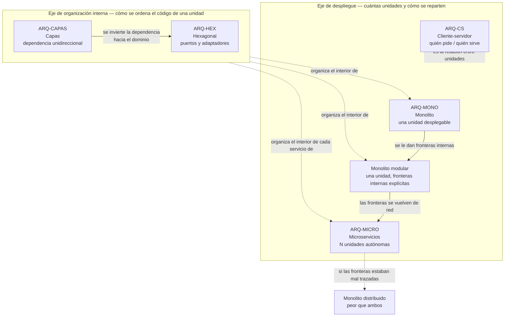

# Modelos de arquitectura — `ARQ-INDICE`

## Pregunta que ordena la serie

> **¿Entre qué estructuras se elige, y qué documentación queda obligada por cada elección?**

La primera mitad de la pregunta se contesta en cualquier manual. La segunda casi nunca se plantea, y es la que justifica que esta serie exista dentro de una guía de documentación técnica. Elegir microservicios no es solo elegir una topología: es comprometerse a mantener una especificación de API versionada por servicio, un catálogo de eventos con garantías declaradas, un runbook por unidad desplegable y un mapa de propiedad de datos que en un monolito no hacía falta escribir porque el compilador lo verificaba. Elegir hexagonal obliga a un catálogo de puertos que en un modelo de capas clásico no tiene equivalente. Cada modelo emite una factura documental, y esa factura se paga durante toda la vida del sistema.

## Resumen ejecutivo

La serie cubre cinco modelos y un documento de síntesis. [Cliente-servidor](Cliente-Servidor.md) y [microservicios](Microservicios.md) responden a cómo se reparte el sistema entre unidades de despliegue; [capas](Modelo-de-Capas.md) y [hexagonal](Hexagonal.md) responden a cómo se organiza el interior de una de esas unidades; [monolítico](Monolitico.md) responde a cuántas unidades hay, y su variante modular es el punto donde ambos ejes se tocan. La [comparativa](Comparativa-y-Criterios.md) cierra con la tabla por atributos de calidad de ISO/IEC 25010, los criterios de elección por escenario y contexto, un árbol de decisión y los caminos de evolución entre modelos con sus puntos de no retorno.

Cada documento sigue la estructura de ocho secciones que fijan las [convenciones](../00-Marco-de-Referencia/Convenciones.md), con una sección propia de esta serie —**Documentación que exige el modelo**— intercalada en tercer lugar. Todos modelan el mismo sistema de reserva de salas, con las mismas entidades y las mismas reglas, para que la comparación entre modelos sea comparación y no yuxtaposición de ejemplos distintos.

Lo que esta serie **no** hace es explicar cómo se escribe un SAD, un HLD o un ADR. Eso vive en [`../30-Arquitectura/`](../30-Arquitectura/README.md). Aquí se trata de los modelos en sí y del peso documental que cada uno impone; allí, de los artefactos con los que ese peso se registra.

---

## Los modelos de la serie

| ID | Modelo | Pregunta que responde | Eje | Artefacto que vuelve obligatorio |
|----|--------|----------------------|-----|----------------------------------|
| `ARQ-CS` | [Cliente-servidor](Cliente-Servidor.md) | ¿Quién pide y quién sirve, y dónde vive el estado? | Despliegue | Vista de despliegue y contrato de API |
| `ARQ-CAPAS` | [Modelo de capas](Modelo-de-Capas.md) | ¿Cómo se separan responsabilidades dentro de una unidad? | Organización interna | HLD con la regla de dependencia explícita |
| `ARQ-MONO` | [Monolítico y monolito modular](Monolitico.md) | ¿Cuántas unidades desplegables hay? | Despliegue | Mapa de módulos e interfaces publicadas |
| `ARQ-HEX` | [Hexagonal](Hexagonal.md) | ¿Cómo se aísla el dominio de la tecnología? | Organización interna | Catálogo de puertos y adaptadores |
| `ARQ-MICRO` | [Microservicios](Microservicios.md) | ¿Qué se despliega y se opera de forma independiente? | Despliegue | Ficha por servicio, catálogo de eventos, runbook por servicio |
| `ARQ-COMPARATIVA` | [Comparativa y criterios](Comparativa-y-Criterios.md) | ¿Cuál elijo, con qué criterio y cómo evoluciono? | Síntesis | ADR de elección de estilo |

---

## Advertencia previa: no son alternativas excluyentes ni están en el mismo nivel

El error de lectura más frecuente ante un catálogo como este consiste en tratarlo como un menú del que se elige un plato. Los cinco modelos no compiten entre sí porque no responden todos a la misma pregunta.

Dos de ellos —cliente-servidor y microservicios, con el monolito como caso límite— son **estilos de despliegue**: describen cómo se reparte el sistema en procesos, nodos y unidades que se liberan por separado. Otros dos —capas y hexagonal— son **estilos de organización interna**: describen cómo se acomoda el código dentro de una unidad de despliegue, y son indiferentes a cuántas unidades haya.

De ahí que la frase «un monolito modular organizado en hexagonal, desplegado como cliente-servidor» no contenga ninguna contradicción: describe un único artefacto desplegable, con módulos de frontera explícita, cada uno con su dominio aislado por puertos, servido a clientes remotos por HTTP. Es, de hecho, una de las combinaciones más frecuentes y de las más sensatas en aplicaciones de línea de negocio. Las combinaciones habituales y las que sí son incoherentes están tabuladas en la [comparativa](Comparativa-y-Criterios.md).

Hay además una asimetría de granularidad que conviene tener presente antes de leer: en un sistema de microservicios, cada servicio tiene su propia organización interna, y nada obliga a que todos usen la misma. Es normal que el servicio de reservas —denso en reglas— esté organizado en hexagonal y que el de informes —esencialmente consultas— esté en dos capas planas. Imponer un estilo interno único a todos los servicios anula una de las pocas ventajas que el modelo compra a cambio de su costo.

Las flechas continuas indican evolución habitual de un modelo hacia otro; las punteadas, relación de composición o de riesgo. La única flecha que representa un fracaso es la que lleva al monolito distribuido, y llega ahí por la misma vía por la que se llega a microservicios: la diferencia no está en la técnica sino en si las fronteras de dominio estaban identificadas antes de convertirlas en fronteras de red.

---

## Cómo se relacionan con la documentación

El vínculo entre modelo y documentación no es decorativo: cambia qué artefactos son obligatorios, cuáles se vuelven irrelevantes y cuáles siguen existiendo pero se escriben distinto. Este es el resumen; cada documento lo desarrolla en su sección tercera.

| Familia | `ARQ-CS` | `ARQ-CAPAS` | `ARQ-MONO` | `ARQ-HEX` | `ARQ-MICRO` |
|---------|----------|-------------|------------|-----------|-------------|
| Visión | Igual | Igual | Igual | Igual | Igual |
| Análisis | Igual | Igual | Igual | Gana: el dominio se documenta aparte del dato | Gana: contextos delimitados como frontera |
| Arquitectura | Vista de despliegue central | HLD con regla de dependencia | Mapa de módulos | Catálogo de puertos | Peso máximo: mapa de servicios y datos |
| Diseño | Contrato de API | Contrato entre capas | Interfaces publicadas | Ficha de puerto y adaptadores | Contrato de red y de evento |
| Operativa | Dos artefactos de despliegue | Uno | Uno, el más barato | Matriz puerto-adaptador por entorno | Uno por servicio, más degradación parcial |
| Desarrollo | Convenciones de cliente y de servicio | Tests de arquitectura sobre la regla | Frontera de módulo verificable | Prohibición de dependencias hacia infraestructura | Plantilla de servicio y política de versionado |
| Usuarios | Igual | Igual | Igual | Igual | Cambia: la consistencia eventual es visible |

La lectura vertical de esta tabla es la que importa: la fila de operativa muestra por qué microservicios es el modelo más caro de documentar, y la fila de análisis muestra por qué hexagonal y microservicios exigen un trabajo de dominio que capas y cliente-servidor toleran no hacer.

---

## Orden de lectura

El recorrido va de lo más simple y más antiguo a lo más costoso, porque cada modelo se entiende mejor como respuesta a una limitación del anterior.

1. **[Cliente-servidor](Cliente-Servidor.md)** — el reparto más elemental y el que fija el vocabulario de *tier* frente a *layer*, distinción sin la cual los cuatro documentos siguientes se leen mal.
2. **[Modelo de capas](Modelo-de-Capas.md)** — la primera respuesta a la organización interna, y la referencia contra la que se define hexagonal.
3. **[Monolítico](Monolitico.md)** — la unidad de despliegue única, con el monolito modular como variante que sostiene casi todo lo que después se le atribuye a los microservicios.
4. **[Hexagonal](Hexagonal.md)** — la inversión de la dependencia respecto del modelo de capas, con su relación con arquitectura limpia y cebolla.
5. **[Microservicios](Microservicios.md)** — se lee al final a propósito, porque su costo solo es legible cuando ya se sabe qué se estaba obteniendo gratis en los modelos anteriores.
6. **[Comparativa y criterios](Comparativa-y-Criterios.md)** — la síntesis, el árbol de decisión y los caminos de evolución.

Quien llegue con un problema concreto en lugar de con intención de estudio puede entrar por la pregunta:

| Situación | Entrar por |
|-----------|-----------|
| Hay que elegir estilo para un sistema nuevo | [Comparativa](Comparativa-y-Criterios.md), árbol de decisión |
| Alguien pide microservicios sin justificarlo | [Microservicios](Microservicios.md), sección de costo y prerrequisitos |
| El código es un solo proyecto y nadie encuentra nada | [Monolítico](Monolitico.md), variante modular |
| Cambiar de ORM o de proveedor de calendario cuesta meses | [Hexagonal](Hexagonal.md) |
| Se hereda un sistema y hay que reconstruir su estructura | El modelo que corresponda, sección `ESC-3` |
| Hay que migrar de plataforma sin reescribir el dominio | [Hexagonal](Hexagonal.md), `ESC-2` |
| El sistema ya está partido y funciona mal | [Comparativa](Comparativa-y-Criterios.md), puntos de no retorno |

---

## El sistema de referencia

Los cinco documentos modelan el mismo sistema de reserva de salas que usa el resto de la guía, con las mismas capacidades —catálogo de salas y recursos, consulta de disponibilidad, alta, modificación y cancelación de reservas, aprobación para salas restringidas, notificaciones, informe de ocupación e integración con el calendario corporativo—, las mismas entidades y los mismos identificadores: `RF-014` para la confirmación de reserva, `RN-007` para la prohibición de solapamiento, `POST /reservas` idempotente por `Idempotency-Key`.

Ese anclaje permite una comparación que los ejemplos genéricos no dan. `RN-007` es el caso testigo: en un monolito es una transacción local respaldada por un índice único `(SalaId, Intervalo)`; en hexagonal es una invariante del dominio con el índice como red de seguridad del adaptador de persistencia; en microservicios deja de poder resolverse con una transacción y se convierte en una reserva de recurso con compensación, con una ventana de inconsistencia que alguien tiene que aceptar por escrito. La misma regla, tres costos documentales distintos.

Las tecnologías de referencia son las de la guía: .NET y C#, ASP.NET Core, Blazor con render mode *interactive server*, ASP.NET MVC y .NET MAUI con patrón MVVM. Son vocabulario ilustrativo, no objeto de estudio.

---

## Enlaces al marco

- [Escenarios](../00-Marco-de-Referencia/Escenarios.md) — `ESC-1` a `ESC-4`. La elección de modelo solo es una elección en `ESC-1` y `ESC-2`; en `ESC-3` y `ESC-4` el modelo es un hallazgo que se reconstruye o se infiere.
- [Contextos](../00-Marco-de-Referencia/Contextos.md) — `CTX-1` a `CTX-3`. En `CTX-1` la discusión de modelos se concentra en dónde vive el estado; en `CTX-2`, en las fronteras de servicio.
- [Actores](../00-Marco-de-Referencia/Actores.md) — `ACT-03` decide el modelo; `ACT-06` tiene veto de operabilidad, que en microservicios es un veto real y no formal.
- [Convenciones](../00-Marco-de-Referencia/Convenciones.md) — frontmatter, identificadores `ARQ-`, estructura de secciones, política de no duplicar.
- [Mapa conceptual](../01-Mapa-Conceptual/Mapa-Conceptual.md) — cruce completo de escenarios y contextos contra los artefactos de la guía.

## Familia vecina

- [`../30-Arquitectura/README.md`](../30-Arquitectura/README.md) — la familia documental que registra la elección de modelo.
- [`../30-Arquitectura/SAD.md`](../30-Arquitectura/SAD.md) — el documento donde el modelo elegido se describe en vistas. Todo lo que estos documentos digan sobre «qué cambia en el SAD» se apoya en la estructura definida allí.
- [`../30-Arquitectura/ADR.md`](../30-Arquitectura/ADR.md) — la elección de modelo es la decisión arquitectónica canónica y el ADR es donde queda fechada, atribuida y con sus alternativas descartadas.
- [`../50-Operativa/`](../50-Operativa/) — el destinatario directo de la factura operativa que cada modelo emite.

---

## Referencias de industria usadas en la serie

Se citan por designación exacta y solo cuando lo atribuido es verificable: **ISO/IEC 25010** para el vocabulario de atributos de calidad que estructura la comparativa; **ISO/IEC/IEEE 42010** para la descripción de arquitectura mediante vistas e interesados; **"Patterns of Enterprise Application Architecture"** de Martin Fowler para los patrones de capas y de acceso a datos; la **arquitectura hexagonal de Alistair Cockburn (2005)** para puertos y adaptadores; **Clean Architecture** de Robert C. Martin y **Onion Architecture** de Jeffrey Palermo como variantes emparentadas; **"Building Microservices"** de Sam Newman y **"Software Architecture: The Hard Parts"** para el costo y las fronteras de los sistemas distribuidos; el **DDD** de Eric Evans para los contextos delimitados; la **ley de Conway** para la relación entre estructura organizativa y estructura del sistema; el **teorema CAP** y el **patrón Saga** para la consistencia en sistemas distribuidos.
