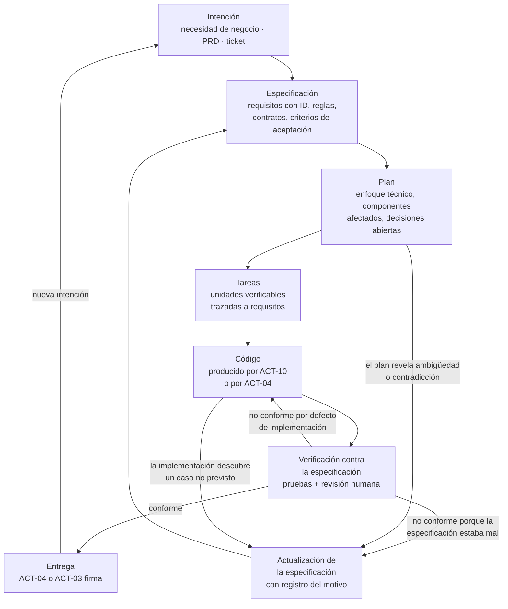
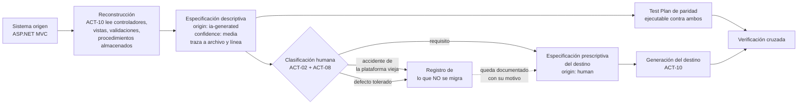

# Spec-Driven Development — `DOC-SDD`

## Resumen ejecutivo

Durante cuatro décadas la especificación fue un documento previo que se escribía para que alguien lo aprobara y luego se abandonaba: el código lo contradecía en el tercer sprint y nadie volvía a abrirlo. Spec-Driven Development invierte esa relación. La especificación pasa a ser el artefacto del que se deriva el código, y el código pasa a ser una salida —revisable, reemplazable, regenerable— en lugar de la fuente de verdad. La práctica se vuelve viable cuando aparece un ejecutor capaz de leer prosa estructurada y producir implementación a partir de ella, que es lo que un agente de codificación hace.

El cambio tiene una consecuencia incómoda para el oficio documental: una especificación ambigua deja de ser un defecto de estilo y pasa a ser un defecto funcional. Si el agente puede implementar dos cosas distintas a partir del mismo enunciado, va a implementar una de ellas, y la elección no va a estar registrada en ningún lado.

Este documento define qué es SDD, qué hace que una especificación sea apta para un agente, cómo se integra con cada familia documental de la guía, y dónde están sus límites. Su dueño natural es `ACT-03`, porque decidir qué se especifica y qué se firma es una decisión estructural, con `ACT-02` como productor principal de las especificaciones y `ACT-10` como ejecutor sin autoridad.

Sobre las fuentes: el campo es reciente y su terminología no está estandarizada. Este documento cita únicamente prácticas y estándares verificables —contract-first, TDD, Gherkin, OpenAPI, `RFC 2119`— y declara explícitamente como criterio propio de la guía todo lo que no tiene fuente normativa.

---

## Definición

### Qué es

Una forma de organizar la construcción de software en la que la especificación es el artefacto primario y versionado, y la implementación se deriva de ella mediante un ejecutor —humano o agente— cuya salida se verifica contra la propia especificación. La especificación no describe lo que el código hace: prescribe lo que debe hacer, y se mantiene viva porque cada cambio de comportamiento entra por ella.

Tres propiedades la separan de la documentación previa clásica. Es **ejecutable en sentido operativo**: no se compila, pero un agente puede tomarla y producir código sin información adicional. Es **verificable**: sus criterios de aceptación se traducen en pruebas que fallan cuando la implementación se aparta. Y es **la entrada del cambio**: modificar el comportamiento significa modificar primero la especificación, del mismo modo en que en `contract-first` un cambio de API entra por el contrato OpenAPI y no por la firma del controlador.

La genealogía es reconocible y conviene explicitarla, porque desactiva buena parte del escepticismo. `contract-first` ya movió la fuente de verdad de un servicio desde el código hacia el contrato. TDD ya estableció que la especificación del comportamiento —en forma de prueba— precede a la implementación y la gobierna. Los criterios de aceptación en Gherkin ya son especificación en lenguaje semiestructurado, legible por humanos y ejecutable por una herramienta. SDD generaliza esas tres ideas a la totalidad del comportamiento del sistema y las apoya en un ejecutor capaz de leer prosa.

### Qué problema resuelve

Resuelve la asimetría de costo entre especificar y construir. Cuando escribir código costaba semanas, escribir una especificación exhaustiva era una inversión discutible: se prefería construir y corregir. Cuando la generación de una implementación completa cuesta minutos, el cuello de botella se desplaza a la calidad de la instrucción, y la especificación deja de ser un gasto administrativo para ser el trabajo central.

Resuelve también el problema de la generación de código sin trazabilidad. Un agente instruido con un prompt suelto produce código que funciona y que nadie puede auditar: no hay registro de qué se pidió, qué reglas se le dieron, ni contra qué se lo debe verificar. Cuando la instrucción es un documento versionado con requisitos identificados, la revisión deja de ser una lectura de diff a ciegas y pasa a ser una comparación contra un contrato.

Y resuelve la deriva documental. En el modelo clásico, la documentación se desactualiza porque actualizarla no es necesario para que el sistema funcione. En SDD sí lo es: si el equipo regenera o modifica a partir de la especificación, una especificación desactualizada rompe la próxima iteración. La disciplina deja de depender de la buena voluntad.

### Qué NO es

**No es cascada disfrazada.** La objeción es previsible y merece respuesta precisa. Cascada implica una especificación completa y congelada antes de construir; SDD implica una especificación *suficiente para la próxima porción de trabajo*, que se modifica cada vez que la implementación descubre algo que la contradice. La diferencia no está en cuánto se escribe antes, sino en si la escritura es un evento único o un ciclo. Una especificación que no cambió en tres meses de desarrollo activo no es un signo de rigor sino de que nadie la está usando.

**No es generación de código a partir de un prompt suelto.** Pedirle a un agente «hacé el alta de reservas en Blazor» produce código; no produce SDD. Falta lo esencial: identificadores estables, criterios de aceptación, contratos explícitos, restricciones negativas y trazabilidad. La distinción operativa es de reproducibilidad: si dos ejecuciones del mismo insumo pueden dar comportamientos distintos y ninguna es verificablemente incorrecta, no había especificación.

**No es documentación generada desde el código.** Esa es la operación inversa, propia de `ESC-3`, y es descriptiva. SDD es prescriptivo. Ambas pueden coexistir en un mismo proyecto y de hecho se encadenan —se reconstruye desde el código, se corrige y se convierte en especificación prescriptiva—, pero confundirlas produce el error de tratar una reconstrucción inferida como si fuera una decisión tomada.

**No es un formato ni una herramienta.** No hay estándar de especificación para agentes al que esta guía pueda remitir. Lo que hay son propiedades exigibles al documento, que la sección siguiente enumera, y que se pueden satisfacer en Markdown con frontmatter YAML, que es lo que esta guía usa.

**No elimina la revisión humana.** `ACT-10` no tiene autoridad, y SDD no se la otorga. Lo que cambia es dónde se concentra el esfuerzo humano: menos en escribir la implementación, más en escribir la especificación y en verificar la conformidad.

### Con qué se lo confunde

| | SDD | Documentación tradicional | Prompting ad hoc | Generación desde código |
|---|-----|--------------------------|------------------|------------------------|
| Fuente de verdad | La especificación | Ambigua en la práctica | El código generado | El código |
| Dirección | Especificación → código | Especificación → código, una vez | Intención → código | Código → documento |
| Al cambiar el comportamiento | Se modifica la especificación primero | Se modifica el código; el documento queda | Se escribe otro prompt | Se regenera el documento |
| Trazabilidad | Requisito con ID → código → prueba | Escasa | Nula | Código → afirmación |
| Escenario típico | `ESC-1`, `ESC-2` | `ESC-1` | Cualquiera, sin disciplina | `ESC-3` |

---

## El ciclo



Los tres arcos que vuelven a la especificación son el documento entero. Sin ellos el diagrama describe cascada con otro vocabulario. El arco desde el plan es el más barato y el que más ahorra: es donde se descubre que dos requisitos se contradicen, antes de que exista una línea de código. El arco desde el código aparece cuando la implementación encuentra un caso que nadie previó —el usuario reserva una sala en el instante en que otro la confirma— y la respuesta correcta no es resolverlo en el código sino subir la decisión a la especificación y bajarla después. El arco desde la verificación es el que distingue un defecto de implementación de un defecto de especificación, y esa distinción es la que hace que la especificación siga siendo verdadera.

La disciplina que sostiene el ciclo es una sola y se enuncia en una línea: **ningún cambio de comportamiento entra por el código**. Cuando el equipo empieza a corregir directamente en la implementación porque «es un detalle», la especificación empieza a mentir, y la próxima generación va a reintroducir el error corregido.

### Las cuatro etapas intermedias, con su entregable

Entre la intención y el código hay tres artefactos que el método distingue y que la práctica tiende a fundir en uno. Fundirlos es lo que produce el salto directo del ticket al código generado.

| Etapa | Entregable | Pregunta que cierra | Quién firma | Qué pasa si se salta |
|-------|-----------|--------------------|-------------|----------------------|
| Intención | Enunciado del problema, con su origen en el PRD o en un ticket | ¿Por qué vale la pena? | `ACT-01` | Se construye lo que nadie pidió, más rápido que antes |
| Especificación | Requisitos con ID, reglas, contrato, criterios de aceptación | ¿Qué debe hacer, exactamente? | `ACT-02` | El agente completa los huecos y nadie sabe cuáles fueron |
| Plan | Enfoque técnico, componentes afectados, decisiones abiertas | ¿Cómo se aborda y qué falta decidir? | `ACT-03` o `ACT-04` | Las decisiones estructurales las toma el generador sin registro |
| Tareas | Unidades de trabajo verificables, cada una trazada a requisitos | ¿En qué orden y con qué criterio de terminado? | `ACT-04` | La verificación se vuelve una sola revisión grande e inevaluable |

El plan merece una nota, porque es la etapa que más se omite y la que más ambigüedad detecta. Es el momento en que alguien lee la especificación con intención de construir y descubre que `RN-007` y `RN-014` se contradicen en el caso de una reserva que cruza la medianoche. Ese hallazgo, hecho en el plan, cuesta un párrafo; hecho en producción, cuesta un incidente.

---

## Qué hace que una especificación sea apta para un agente

Un documento puede ser excelente para un humano y aun así inutilizable como insumo de generación. La diferencia no está en el nivel de detalle sino en siete propiedades, que esta guía sostiene como criterio propio.

**Identificadores estables.** Cada requisito, regla y criterio lleva un ID con prefijo —`RF-`, `RNF-`, `RN-`, `TC-`— que no cambia aunque el texto se reescriba. Es la condición para que exista trazabilidad y para que una conversación con el agente pueda referirse a una porción concreta del contrato sin reproducirla.

**Criterios de aceptación verificables.** Cada requisito trae la condición observable que permite decidir si está cumplido. «El sistema debe responder rápido» no es verificable; «el 95 % de las consultas de disponibilidad responde en menos de 800 ms medido en el servidor bajo 50 usuarios concurrentes» sí lo es. El criterio operativo es el mismo que `ACT-05` aplica al revisar un SRS: si no se puede escribir el caso de prueba, el requisito no está terminado.

**Contratos explícitos.** Firmas, esquemas, códigos de estado, formatos y unidades. Todo lo que el agente tendría que inventar, lo inventa. En backend esto significa OpenAPI o `.proto` como parte de la especificación, no como derivado; en la interfaz, el inventario de estados de [DOC-UX](UX-UI-y-Flujo-de-Usuario.md); en persistencia, el esquema con sus restricciones e índices.

**Ausencia de ambigüedad.** El uso disciplinado del vocabulario de `RFC 2119` —`DEBE`, `NO DEBE`, `DEBERÍA`, `PUEDE`— convierte el grado de obligación en un dato y no en una inferencia de tono. Un `DEBERÍA` que el agente resuelve de una forma y el revisor esperaba de otra es una discusión evitable con una palabra.

**Contexto suficiente y autocontenido.** El agente no comparte el conocimiento tácito del equipo. Una especificación que dice «como en el módulo de facturación» le exige leer el módulo de facturación y adivinar qué parte era la relevante. Autocontenido no significa repetir la guía entera: significa que las referencias externas sean explícitas, resolubles y acotadas.

**Restricciones negativas.** Lo que el sistema *no* debe hacer, y lo que la implementación *no* debe introducir. Es la sección que más rendimiento tiene y la que casi nunca se escribe, porque en la comunicación entre humanos lo prohibido se sobreentiende. «No introducir dependencias externas nuevas», «no persistir el correo del asistente», «no confiar en la validación de cliente», «no crear una segunda tabla de auditoría»: cada línea evita una revisión completa.

**Trazabilidad.** El vínculo declarado entre cada requisito y sus artefactos: el caso de uso que lo origina, el flujo que lo expone, el endpoint que lo ejecuta, el caso de prueba que lo verifica. En la guía, ese vínculo vive en el campo `traces` del frontmatter y en las referencias por ID dentro del cuerpo.

### El contraste que importa

El ejemplo más útil de este documento es el mismo requisito escrito de las dos maneras.

**Versión inservible para un agente:**

> El sistema debe permitir a los usuarios reservar salas. Hay que validar que la sala esté disponible y mostrar un mensaje si no lo está. Debe ser rápido y seguro.

Todo lo que un implementador necesita está ausente. Quién es «los usuarios» —¿todos los autenticados, algún rol?—. Qué es «disponible» —¿la sala existe, está habilitada, no tiene reserva superpuesta, tiene capacidad?—. Cuándo se valida —¿al seleccionar, al enviar, en cliente, en servidor?—. Qué pasa con dos usuarios simultáneos. Qué mensaje, con qué texto, y si conserva lo ya cargado. Qué significa rápido. Qué significa seguro. Un agente producirá algo plausible para cada hueco y ninguna de sus elecciones quedará registrada.

**Versión ejecutable por un agente:**

```markdown
### RF-014 — Confirmar reserva de sala

**Actor**: usuario autenticado con rol `Empleado` o `Recepcion`.
**Disparador**: envío del formulario de alta desde `FLU-03`, paso 6.

**Comportamiento**
El sistema DEBE crear una reserva para la sala, la fecha y el intervalo indicados
cuando se cumplan simultáneamente RN-007, RN-011 y RN-014, y DEBE rechazarla en
caso contrario sin efectos parciales.

**Reglas aplicables**
- `RN-007` — Una sala NO DEBE admitir dos reservas cuyos intervalos se superpongan,
  incluida la coincidencia exacta de extremos. Un intervalo `[10:00, 11:30)` no se
  superpone con `[11:30, 12:00)`.
- `RN-011` — La cantidad de asistentes NO DEBE superar la capacidad de la sala.
- `RN-014` — La duración DEBE estar entre 15 y 240 minutos, en múltiplos de 15.

**Contrato**
`POST /reservas`
Request: `{ salaId: string, inicio: datetime-offset, fin: datetime-offset,
            asistentes: int, titulo: string(1..120) }`
Cabecera `Idempotency-Key`: obligatoria, UUID v4.
Respuestas:
- `201 Created` + `{ reservaId, salaId, inicio, fin, estado: "Confirmada" }`
  con cabecera `Location`.
- `200 OK` + el mismo cuerpo, si se repite una `Idempotency-Key` ya procesada.
- `409 Conflict` + `{ codigo: "SALA_OCUPADA", alternativas: [ {inicio, fin} x3 ] }`
- `422 Unprocessable Entity` + `{ codigo, campo, mensaje }` para RN-011 y RN-014.
- `403 Forbidden` si el rol no tiene permiso sobre la sala.

**Concurrencia**
La verificación de RN-007 DEBE ejecutarse dentro de la transacción de inserción,
apoyada en una restricción de exclusión a nivel de base sobre `(SalaId, Intervalo)`.
NO DEBE resolverse con una consulta previa fuera de transacción.

**Restricciones negativas**
- NO DEBE confiarse en la validación de cliente para ninguna de las tres reglas.
- NO DEBE persistirse el correo de los asistentes en la tabla de reservas.
- NO DEBE introducirse una biblioteca de acceso a datos distinta de EF Core.
- NO DEBE emitirse el evento `ReservaConfirmada` antes de confirmar la transacción.

**Criterios de aceptación**
- `CA-014-1` Dada la sala `S-204` libre el 14/08/2026 de 10:00 a 11:30, cuando un
  `Empleado` confirma con 4 asistentes y capacidad 8, entonces responde `201` y la
  reserva queda consultable por su `reservaId`.
- `CA-014-2` Dadas dos solicitudes concurrentes sobre `S-204` en el mismo intervalo,
  entonces exactamente una responde `201` y la otra `409` con tres alternativas.
- `CA-014-3` Dada una solicitud repetida con la misma `Idempotency-Key`, entonces
  responde `200` con el mismo `reservaId` y no crea una segunda reserva.
- `CA-014-4` Dada una solicitud con 12 asistentes sobre una sala de capacidad 8,
  entonces responde `422` con `campo: "asistentes"`.
- `CA-014-5` Dada una duración de 20 minutos, entonces responde `422` por RN-014.

**Trazas**: `CU-04`, `FLU-03`, `RN-007`, `RN-011`, `RN-014`, `TC-041`..`TC-046`.
```

La segunda versión es más larga y esa longitud es el trabajo. Un agente puede implementarla; `ACT-05` puede derivar seis casos de prueba sin preguntar nada; y un revisor puede verificar la conformidad línea por línea en lugar de opinar sobre el diff. La primera versión no habilita ninguna de las tres cosas.

### El plan y las tareas derivados de `RF-014`

El plan no repite la especificación: registra el enfoque y, sobre todo, lo que la lectura para construir dejó al descubierto.

```markdown
## Plan — RF-014

**Enfoque**: restricción de exclusión en PostgreSQL sobre `(SalaId, tstzrange)`,
con captura de la violación en el repositorio y traducción a 409. La verificación
previa fuera de transacción se conserva solo como mejora de experiencia, nunca
como control.

**Componentes afectados**
- `ReservaEditor.razor` — estados Cargando, Conflicto, ErrorValidacion (FLU-03)
- `ReservasController` — POST /reservas, traducción de errores
- `ReservaService` — validación de RN-011 y RN-014, transacción
- Migración `20260814_AddReservaExclusion`

**Decisiones abiertas**
- D1. Las tres alternativas del 409, ¿se calculan sobre la misma sala u otras?
      Bloquea CA-014-2. Decide ACT-02 con ACT-08.
- D2. Ventana de idempotencia: 24 h propuesta, sin confirmar. Decide ACT-03.

**Ambigüedad detectada en la especificación**
- RN-014 no resuelve la reserva que cruza medianoche. Sube a ACT-02 antes
  de implementar; no se resuelve acá.
```

Las tareas se derivan del plan con la condición de que cada una declare qué criterio de aceptación la cierra: migración y restricción (`CA-014-2`), servicio con reglas (`CA-014-4`, `CA-014-5`), endpoint con traducción de errores (`CA-014-2`), idempotencia (`CA-014-3`), estados de la interfaz (`FLU-03`, `RNF-026`). Una tarea sin criterio asociado es trabajo cuya terminación depende de la opinión de quien la revise.

Nótese qué está y qué no. Está el comportamiento, el contrato, la concurrencia y lo prohibido. No está el nombre de las clases, la estructura de carpetas ni la forma del método: eso es `ACT-04` y se decide al implementar. Especificar de más es un antipatrón propio del método, y la sección de riesgos vuelve sobre él.

---

## La doble audiencia como infraestructura

El frontmatter que [Convenciones](../00-Marco-de-Referencia/Convenciones.md) exige no es formalismo administrativo: es la capa mínima sin la cual SDD no funciona.

`doc_id` da la identidad estable que permite referirse a un documento sin depender de su ruta, y hace que un agente pueda resolver una referencia cruzada sin buscar por nombre de archivo. `traces` convierte el conjunto documental en un grafo recorrible: dado un requisito, un agente puede reunir su contexto —caso de uso, flujo, contrato, casos de prueba— sin que un humano se lo enumere, que es exactamente la operación que la propiedad de «contexto suficiente» exige.

`origin` y `confidence` cumplen la función más delicada. Cuando parte de la especificación fue reconstruida por un agente en `ESC-3` y parte fue decidida por `ACT-02`, el ejecutor y el revisor necesitan saber cuál es cuál. Un requisito con `origin: ia-generated` y `confidence: baja` no debe implementarse sin verificación humana previa; uno con `origin: human` es una decisión tomada. Sin esos dos campos, el conjunto documental mezcla decisiones con hipótesis y el agente trata a ambas por igual, que es el mecanismo por el cual una inferencia razonable termina convertida en comportamiento de producción.

`status` cierra el circuito: un documento en `borrador` no es insumo de generación, y uno `obsoleto` no debe alimentar nada. La convención de esta guía es que solo `status: vigente` entra al ciclo de SDD.

Los encabezados predecibles y los diagramas como código completan el cuadro por una razón práctica: un agente que sabe que todo documento temático tiene su sección de criterios de aceptación en el mismo lugar puede recorrer el corpus por estructura, y un diagrama Mermaid es texto que puede leer, mientras que una imagen es un hueco.

---

## Integración con las familias documentales

La tabla siguiente reparte, familia por familia, qué alimenta al agente, qué puede producir el agente y qué debe firmar un humano. La columna de firma es la que evita el error central del método, que es delegar decisiones bajo la apariencia de delegar redacción.

| Familia | Alimenta al agente | El agente puede producir | Firma humana obligatoria | Por qué |
|---------|-------------------|--------------------------|--------------------------|---------|
| Visión (`FAM-VIS`) | Visión, BRD, PRD como contexto de propósito y alcance | Borradores de PRD; detección de capacidades sin requisito asociado | `ACT-01` | Definir para qué existe el producto es una decisión de negocio; ninguna evidencia la sostiene |
| Análisis (`FAM-ANA`) | PRD, flujos de `DOC-UX`, glosario | Requisitos con ID a partir de flujos y casos de uso; casos de uso a partir de requisitos; detección de contradicciones entre reglas | `ACT-02` | Una regla de negocio inventada por un agente es indistinguible de una real hasta que produce daño |
| Arquitectura (`FAM-ARQ`) | SRS, `RNF`, restricciones | Borradores de ADR con alternativas y consecuencias; diagramas C4 en Mermaid | `ACT-03` | La elección entre alternativas es la decisión; enumerarlas no lo es |
| Diseño (`FAM-DIS`) | SRS, contratos, ADR, inventario de estados | LLD, API Specification, esquema de datos, código | `ACT-04` con revisión de `ACT-03` si cruza límites de componente | Es donde el agente rinde más y donde su salida es más verificable |
| Operativa (`FAM-OPE`) | Topología, entornos, ADR | Borradores de runbook y de guía de despliegue | `ACT-06`, tras ejecutarlos | Un runbook no probado prolonga la caída; la firma acredita ejecución, no lectura |
| Desarrollo (`FAM-DEV`) | Convenciones, LLD, criterios de aceptación | Código, pruebas, Change Log, actualización de convenciones | `ACT-04` | El código es propuesta hasta que alguien lo revisa contra la especificación |
| Pruebas (`FAM-DEV`) | Criterios de aceptación, flujos, contratos | Casos de prueba derivados de `CA-`; matriz de cobertura requisito-prueba | `ACT-05` | El agente deriva bien las pruebas de lo especificado y no detecta lo que falta especificar |
| Usuarios (`FAM-USR`) | Flujos, terminología canónica, capturas | Borradores de manual, FAQ, textos de ayuda | `ACT-09` | Riesgo alto de describir comportamiento no implementado |
| Seguridad (`FAM-ARQ`) | SAD, modelo de datos, API Spec | Enumeración de amenazas por STRIDE; hallazgos de controles ausentes | `ACT-07` y, para el riesgo residual, `ACT-01` | Aceptar un riesgo es una decisión de negocio con nombre y fecha |

El patrón que recorre la tabla se enuncia en una frase: **el agente produce lo que la evidencia sostiene; el humano firma lo que la evidencia no puede decidir**. Todo lo que es derivación —un caso de prueba desde un criterio de aceptación, un LLD desde un contrato, un diagrama desde una estructura— es territorio natural de `ACT-10`. Todo lo que es elección entre alternativas legítimas —qué se construye, qué regla rige, qué se sacrifica, qué riesgo se acepta— sigue siendo humano, y no porque el agente no pueda proponer, sino porque la responsabilidad no es delegable.

---

## Aplicación por escenario

| Escenario | ¿Aplica? | Rendimiento | Rol dominante de `ACT-10` | Riesgo característico |
|-----------|----------|-------------|---------------------------|----------------------|
| `ESC-1` Desarrollo nuevo | Sí, es su caso canónico | Alto | Generar implementación desde especificación | Sobreespecificar antes de saber |
| `ESC-2` Migración | Sí, y es donde más rinde | Muy alto | Reconstruir origen y generar destino | Migrar el accidente junto con el requisito |
| `ESC-3` Evaluación con código | Sí, en modo inverso | Medio-alto | Reconstruir especificación con traza a archivo y línea | Presentar inferencia como hallazgo |
| `ESC-4` Evaluación externa | Marginal | Bajo | Estructurar observaciones e hipótesis | Tratar la salida como especificación |

### `ESC-1` — Desarrollo de software nuevo

Es el caso canónico y el más simple de razonar: no hay sistema, la especificación es prescriptiva por naturaleza, y el ciclo del diagrama se recorre en su forma completa desde la intención. El orden documental de `ESC-1` —visión, requisitos, arquitectura, diseño— coincide con el orden de refinamiento de la especificación, lo que evita tener que inventar un proceso paralelo.

La tentación específica del escenario es especificar demasiado y demasiado pronto. Con un agente capaz de generar rápido, escribir doscientas líneas de especificación es barato, y produce la ilusión de progreso mientras se están fijando decisiones sobre un producto que todavía no validó nada. La disciplina que corresponde es la misma que rige la documentación de `ESC-1` sin agentes: especificar en profundidad lo que se va a construir en el ciclo actual, y dejar en enunciado grueso lo que viene después.

### `ESC-2` — Migración a otro lenguaje o plataforma

Es el escenario de mayor rendimiento del método, y merece desarrollo porque la razón no es obvia.

Una migración tiene un problema estructural que ningún otro escenario tiene: exige dos cuerpos documentales, uno descriptivo del origen y otro prescriptivo del destino, y la pieza que los une —la definición operativa de paridad— es la que casi siempre falta. SDD ataca exactamente esa unión, porque la especificación reconstruida del origen **es** la entrada de la generación del destino. No son dos documentos con una tabla de correspondencia entre ellos; es un solo artefacto que cambia de naturaleza al cruzar el puente.

La secuencia concreta, sobre el sistema de reserva de salas migrando de ASP.NET MVC a Blazor *interactive server* con backend en ASP.NET Core:



Tres razones sostienen el rendimiento. Primera: el origen es evidencia verificable, con lo cual la reconstrucción del agente no es especulación sino lectura, y cada afirmación se rastrea a un archivo. Segunda: existe un oráculo. En `ESC-1` nadie puede decir si el comportamiento generado es correcto salvo contra la especificación; en `ESC-2` el sistema viejo está corriendo y responde, lo que permite verificación diferencial sobre los mismos casos. Tercera: el trabajo de traducción entre plataformas —de `Controller` y `ViewModel` MVC a componente Blazor con estado en circuito, de validación por `ModelState` a validación en servicio— es mecánico y repetitivo en volumen alto, que es la forma de trabajo donde un agente supera a un humano por márgenes amplios.

El nodo `D` es donde reside el valor humano y no se puede delegar. Clasificar cada comportamiento observado como requisito, como accidente de la plataforma o como defecto tolerado exige conocimiento del negocio que el código no contiene. El postback que pierde la posición de scroll es accidente; el `ORDER BY` sin criterio explícito que devuelve resultados en orden de inserción puede ser accidente o puede ser lo único que los usuarios usan para saber qué reservaron último. Un agente no puede distinguirlos, y decidir mal cuesta una regresión que aparece en producción tres semanas después del corte.

El registro de `X` —lo que deliberadamente no se migra, con su motivo— es el entregable que más se omite y el que más discusiones cierra durante el año siguiente al corte.

### `ESC-3` — Evaluación de software existente con acceso al código

El ciclo se recorre al revés: el código es la entrada y la especificación la salida. La condición de calidad es la trazabilidad a archivo y línea, con la que el escenario ya opera por naturaleza. Un agente que afirma que una reserva no puede superar las cuatro horas debe citar `ReservaService.cs:118`, y esa cita es lo que convierte una afirmación en un hallazgo.

La disciplina que este escenario impone, y que conviene fijar como regla: **el agente no completa huecos**. Cuando la evidencia no alcanza —una regla que solo existe en un procedimiento almacenado que no se pudo leer, un comportamiento que depende de configuración no disponible— la salida correcta es una entrada marcada como no verificada, no una reconstrucción plausible. La reconstrucción plausible es indistinguible del hallazgo real en la lectura, y esa indistinguibilidad es el daño.

El producto natural del escenario es una especificación con `origin: ia-generated` y `confidence` diferenciada por sección, que después un humano promueve a `confidence: alta` en las partes que verificó. Esa promoción gradual es lo que permite que una reconstrucción se convierta en la especificación prescriptiva de `ESC-2` sin que nadie pierda de vista qué se verificó y qué no.

### `ESC-4` — Evaluación de un producto solo desde afuera

El margen es escaso y conviene decirlo sin adornos. No hay código que leer, no hay especificación que generar, y lo único que un agente puede aportar es estructuración de observaciones y formulación de hipótesis con su base declarada. Toda salida es hipótesis y se marca como tal: `origin: ia-generated`, `confidence: baja`, con la observación que la sostiene.

El error específico del escenario es tomar la salida del agente como especificación. Un catálogo de funcionalidades inferido de la navegación puede alimentar una comparación competitiva; no puede alimentar una generación de código, porque las reglas de negocio que gobiernan lo observado no son observables. Un producto de reservas que rechaza una solicitud no dice si lo hace por superposición, por capacidad, por permiso o por una cuota mensual que nadie ve.

### Variación por contexto

En `CTX-2` la especificación tiene su forma más favorable: el contrato es explícito por naturaleza, OpenAPI es un artefacto ejecutable verificable por máquina, y la conformidad se puede comprobar automáticamente con pruebas de contrato. Es el contexto donde la verificación de conformidad puede correr en integración continua sin intervención.

En `CTX-1` la especificación necesita apoyarse en el inventario de estados y en los flujos de [DOC-UX](UX-UI-y-Flujo-de-Usuario.md), porque sin ellos el agente genera el camino feliz y nada más. La correspondencia entre estados documentados y estado del componente —el circuito en Blazor, las propiedades observables del ViewModel en MAUI— es lo que vuelve verificable la salida.

En `CTX-3` el valor aparece en la traza vertical completa: una especificación que cubre desde el requisito hasta la prueba permite que la generación produzca la pantalla, el endpoint, la migración de esquema y los casos de prueba en una sola pasada coherente, con los mismos nombres en las cuatro capas. Es también donde la deriva duele más, porque una especificación desactualizada desincroniza cuatro artefactos a la vez.

---

## Riesgos y límites

**Alucinación.** Un agente produce afirmaciones plausibles sin distinguir las sostenidas por evidencia de las inventadas. El antídoto operativo no es la desconfianza genérica sino la trazabilidad obligatoria: toda afirmación descriptiva cita su fuente —archivo y línea en `ESC-3`, requisito con ID en `ESC-1`— y lo que no puede citar se marca como no verificado. Una afirmación sin traza no se corrige: se rechaza. Esta es la razón por la cual los campos `origin` y `confidence` son estructura y no adorno.

**Deriva entre especificación y código.** Es el riesgo más probable de todos, porque su fuerza es el atajo: corregir en el código es más rápido que corregir la especificación y regenerar. Se combate con dos mecanismos. Uno cultural, la regla de que ningún cambio de comportamiento entra por el código. Uno automatizable, la verificación de conformidad en integración continua: que exista al menos un caso de prueba por criterio de aceptación, que todo requisito tenga cobertura declarada, que el contrato OpenAPI publicado coincida con el implementado. La deriva se detecta cuando la matriz de trazabilidad tiene huecos, no cuando alguien la nota leyendo.

**Sobreespecificación.** Especificar la estructura de clases, los nombres de métodos o la organización de carpetas anula el beneficio y agrega mantenimiento: cada refactorización interna obliga a actualizar un documento que nadie necesitaba. El límite es el mismo que separa a `ACT-03` de `ACT-04`: se especifica el comportamiento observable, el contrato y las restricciones; no la implementación interna. El síntoma es una especificación que cambia cada vez que cambia el código sin que cambie el comportamiento.

**Dependencia de contexto.** La calidad de la salida depende de qué porción del corpus documental recibe el agente. Una especificación excelente entregada sin el glosario, sin las convenciones y sin las reglas de negocio relacionadas produce código correcto respecto de lo que leyó e incoherente respecto del resto del sistema. Por eso `traces` no es opcional: es el mecanismo por el cual el contexto necesario se declara en lugar de suponerse.

**Revisión humana como puerta de calidad.** La revisión de código generado tiene una patología propia: el volumen. Es fácil aprobar cuatrocientas líneas plausibles que ningún humano habría escrito de esa forma. La contramedida es no revisar el diff sino la conformidad: recorrer los criterios de aceptación y verificar cada uno contra la implementación, en ese orden. Revisar contra la especificación es más rápido y encuentra otra clase de defectos que leer el código de arriba abajo.

**Falsa sensación de completitud.** Una especificación bien formada, con IDs, contratos y criterios, se lee como exhaustiva aunque le falte la mitad del dominio. La forma no acredita cobertura. La verificación correspondiente es de cobertura funcional, no de forma: qué capacidades del PRD no tienen requisito, qué flujos no tienen especificación, qué estados de `DOC-UX` no aparecen en ningún criterio de aceptación.

**Erosión del conocimiento del equipo.** Riesgo de segundo orden y de horizonte largo: un equipo que solo especifica y revisa pierde familiaridad con la implementación, y esa familiaridad es la que permite juzgar si una propuesta es razonable. No tiene contramedida documental; se menciona porque afecta la calidad de la revisión, que es la última puerta del método.

---

## Verificación automatizada de la conformidad

La revisión humana no escala al ritmo de la generación, y el método necesita una capa que corra sin intervención. Lo que sigue es criterio propio de esta guía, ordenado de lo más barato de implementar a lo más costoso.

**Comprobaciones de forma sobre el corpus.** Un recorrido del repositorio documental que verifique que todo archivo tiene frontmatter válido, que `origin != human` implica `confidence`, que todo ID referenciado en `traces` existe, y que ningún documento `vigente` referencia a uno `obsoleto`. Es trivial de escribir y detecta la clase de rotura que hace que un agente cargue contexto incompleto.

**Cobertura de criterios de aceptación.** Por cada `CA-` de una especificación vigente debe existir al menos un `TC-` que lo declare en su campo de trazabilidad. Un `CA-` huérfano es un comportamiento especificado que nadie verifica, y es el hueco por el que entra la deriva.

**Conformidad de contrato.** En `CTX-2` y en la costura de `CTX-3`, comparar el documento OpenAPI declarado en la especificación contra el generado desde la implementación, y fallar el pipeline ante diferencias no aprobadas. Es la única verificación de esta lista que es completamente objetiva, y por eso conviene apoyarse en ella todo lo posible: mover comportamiento hacia el contrato es mover comportamiento hacia lo verificable por máquina.

**Cobertura funcional contra el PRD.** Qué capacidades declaradas no tienen requisito, y qué requisitos no tienen implementación declarada. Detecta el hueco que las tres anteriores no ven, que es lo que nunca se especificó.

Ninguna de estas comprobaciones evalúa si la implementación es buena. Evalúan si la cadena entre intención, especificación, código y prueba está completa, que es una condición necesaria y no suficiente. La calidad sigue dependiendo de que un humano lea los criterios de aceptación y verifique cada uno.

---

## Preguntas guía

- ¿Un agente sin conocimiento previo del proyecto podría implementar esto sin preguntar? Si no, ¿qué le falta?
- ¿Cada requisito tiene un criterio de aceptación que `ACT-05` pueda convertir en caso de prueba?
- ¿Está escrito lo que el sistema **no** debe hacer, o solo lo que debe hacer?
- ¿Qué parte de esta especificación es decisión humana firmada y qué parte es inferencia de un agente? ¿Se distingue leyendo?
- Si la implementación contradice la especificación, ¿cuál se corrige, y quién lo decide?
- ¿La especificación cambió alguna vez desde que empezó el desarrollo? Si no, ¿alguien la está usando?
- ¿Estoy especificando comportamiento observable o estoy diseñando la implementación de otro?
- ¿Qué contexto adicional necesita el agente para que su salida sea coherente con el resto del sistema, y está declarado en `traces`?
- En `ESC-2`: ¿qué comportamiento del origen se clasificó como accidente, y quién firmó esa clasificación?

---

## Criterios de calidad y antipatrones

### Qué distingue una especificación apta

Tres pruebas, en orden de exigencia creciente. La primera es de completitud: entregada a alguien sin contexto del proyecto, ¿produce una implementación conforme? La segunda es de verificabilidad: ¿cada criterio de aceptación se traduce en una prueba que puede fallar? La tercera es de estabilidad: ¿el documento cambia solo cuando cambia el comportamiento requerido, y no cuando cambia el código?

Los indicadores observables: todo requisito tiene ID y criterios; el vocabulario de obligación es explícito; existe sección de restricciones negativas; el contrato está completo con sus códigos de error; `traces` enumera los artefactos relacionados; `origin` y `confidence` reflejan honestamente la procedencia; y la matriz requisito-prueba no tiene filas vacías.

### Antipatrones

**La especificación como prompt.** Un párrafo de prosa entregado a un agente con la expectativa de un sistema. Produce código, no produce contrato, y nadie puede verificar la salida contra nada.

**La especificación de museo.** Escrita al inicio con gran esfuerzo, aprobada, y nunca modificada mientras el sistema evoluciona. Es la documentación tradicional con un nombre nuevo y con el agravante de que ahora alguien podría regenerar a partir de ella.

**La corrección en el código.** El comportamiento se ajusta directamente en la implementación porque «es un detalle». A las diez veces, la especificación describe un sistema que no existe.

**El requisito sin criterio.** Enunciado con ID, con formato impecable y sin condición observable de cumplimiento. Tiene toda la apariencia de estar especificado.

**La firma delegada.** Un ADR generado por un agente y aprobado sin que nadie evalúe las alternativas. `ACT-10` enumeró opciones; nadie eligió. La decisión existe formalmente y no existe realmente.

**La especificación que diseña.** Nombres de clases, estructura de carpetas, firmas de métodos. Invade a `ACT-04`, se desactualiza con cada refactorización y no aporta a la verificación del comportamiento.

**El contexto implícito.** «Seguir el patrón habitual del proyecto.» El agente no tiene patrón habitual; tiene el texto que recibió.

**La confianza uniforme.** Un documento con `confidence: alta` en el frontmatter cuya mitad fue inferida. El campo deja de informar y pasa a tranquilizar, que es peor que no tenerlo.

---

## Anexo A — Plantilla comentada de especificación apta para SDD

```markdown
---
doc_id: SPEC-<área>-<nn>          # estable; no cambia aunque el título cambie
doc_type: tema
title: <capacidad especificada>
status: vigente                    # solo 'vigente' entra al ciclo de generación
origin: human | ia-assisted | ia-generated
confidence: alta | media | baja    # obligatorio si origin != human
owner: ACT-__                      # quién firma, no quién redactó
last_review: AAAA-MM-DD
audience: [humano, agente]
traces: [CU-__, FLU-__, RN-__, TC-__]   # el contexto que el agente debe cargar
---

## Propósito
(Una a tres frases: qué capacidad se especifica y para qué existe.
 Si no se puede escribir sin nombrar tecnología, probablemente sea diseño.)

## Alcance
- **Incluye**: (lo que esta especificación gobierna)
- **No incluye**: (lo que queda fuera y dónde está especificado; evita que el
  agente rellene por su cuenta la frontera)

## Contexto necesario
(Documentos que hay que leer para implementar esto, por ID. Si un requisito
 solo se entiende con otro, se enlaza acá y no se parafrasea.)

## Requisitos
### RF-__ — <nombre>
- **Actor**:
- **Disparador**:
- **Comportamiento**: (DEBE / NO DEBE / DEBERÍA / PUEDE — RFC 2119)
- **Precondiciones**:
- **Postcondiciones**:
- **Reglas aplicables**: RN-__
- **Errores y su respuesta**: (condición → código → cuerpo → qué ve el usuario)

## Reglas de negocio
### RN-__ — <enunciado>
(Independiente de la interfaz y de la tecnología. Con sus casos límite
 resueltos explícitamente: los extremos de un intervalo, el cero, el empate.)

## Contrato
(Firma, esquema de entrada y salida, códigos de estado, unidades, formatos,
 zona horaria, longitudes. Todo lo que el agente inventaría si falta.)

## Comportamiento no funcional
(Rendimiento con umbral y condición de medición, concurrencia, idempotencia,
 seguridad, accesibilidad con criterio WCAG. Sin adjetivos.)

## Restricciones negativas
(Qué NO debe hacer el sistema y qué NO debe introducir la implementación:
 dependencias, patrones prohibidos, datos que no se persisten, atajos vedados.)

## Criterios de aceptación
### CA-__-_ 
Dado <estado inicial>, cuando <acción>, entonces <resultado observable>.
(Estructura Gherkin. Uno por camino relevante, incluidos los de error.)

## Decisiones abiertas
(Lo que todavía no está decidido, quién debe decidirlo y para cuándo.
 Un hueco declarado es información; un hueco silencioso es una invitación
 a que el agente lo complete.)

## Trazabilidad
| Requisito | Caso de uso | Flujo | Contrato | Prueba |
```

Los tres campos que más rendimiento tienen son los que menos se escriben: restricciones negativas, decisiones abiertas y la fila «no incluye» del alcance. Los tres cumplen la misma función, que es impedir que el agente resuelva por su cuenta lo que nadie resolvió.

## Anexo B — Lista de verificación previa a entregar una especificación a un agente

```markdown
### Identidad y contexto
- [ ] Frontmatter completo, con `origin` y `confidence` honestos
- [ ] `status: vigente`
- [ ] `traces` enumera todo el contexto necesario, resoluble por ID
- [ ] Ninguna referencia del tipo "como en el otro módulo" sin ID

### Contenido
- [ ] Todo requisito tiene ID estable con prefijo
- [ ] Todo requisito tiene al menos un criterio de aceptación observable
- [ ] El grado de obligación usa vocabulario RFC 2119 de forma consistente
- [ ] Las reglas de negocio resuelven sus casos límite (extremos, cero, empate)
- [ ] El contrato está completo: códigos de error, formatos, unidades, husos
- [ ] Existe sección de restricciones negativas y no está vacía
- [ ] El comportamiento no funcional tiene umbral y condición de medición
- [ ] Las decisiones abiertas están declaradas, no omitidas

### Límites
- [ ] No se especifican nombres de clases, carpetas ni firmas internas
- [ ] No hay reglas de negocio que solo existan en el documento de UX
- [ ] Lo inferido está marcado como inferido, con su base

### Verificación posterior
- [ ] Cada `CA-` tiene un `TC-` asociado o previsto
- [ ] Está definido quién firma la salida y contra qué la verifica
- [ ] Está definido qué se hace si la implementación contradice el documento
```

---

## Referencias y advertencia sobre las fuentes

Prácticas y estándares verificables sobre los que este documento se apoya:

- `RFC 2119` — palabras clave para indicar niveles de requisito.
- `OpenAPI 3.1` — contrato de servicio ejecutable y verificable por máquina; base de la práctica *contract-first*.
- Gherkin, como formato semiestructurado de criterios de aceptación (`Dado / Cuando / Entonces`).
- Test-Driven Development, como antecedente de la idea de que la especificación del comportamiento precede y gobierna a la implementación.
- `ISO/IEC/IEEE 29148` — requisitos: propiedades exigibles a un requisito individual y a un conjunto de requisitos, entre ellas verificabilidad, no ambigüedad y trazabilidad.

Se declara explícitamente como **criterio propio de esta guía**, sin fuente normativa: el nombre y la delimitación de Spec-Driven Development tal como se usan acá; las siete propiedades de una especificación apta para un agente; el ciclo con sus tres arcos de realimentación; el reparto de firma por familia documental; la regla de que ningún cambio de comportamiento entra por el código; y las plantillas de ambos anexos.

No existe a la fecha de esta revisión un estándar publicado de especificación para agentes de codificación al que remitir. Toda afirmación de este documento que suene a norma y no aparezca en la lista anterior es convención de la guía, y debe tratarse como tal.
