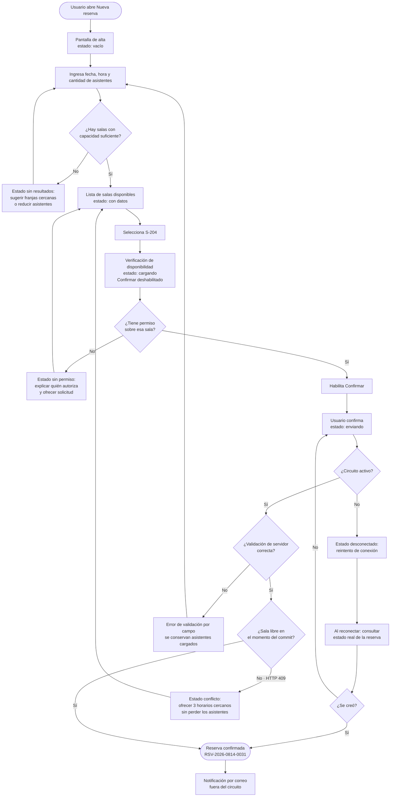
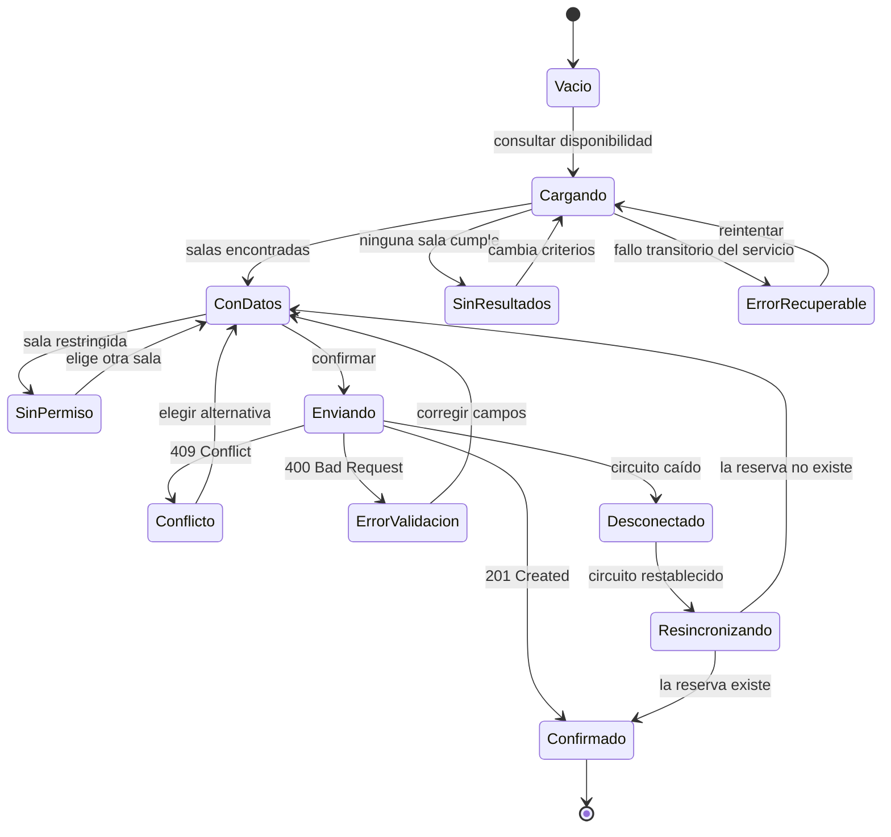

# UX, UI y flujo de usuario — `DOC-UX`

## Resumen ejecutivo

La documentación de experiencia de usuario es la que más frecuentemente se produce y menos frecuentemente se versiona. Un equipo puede tener doscientas pantallas dibujadas en una herramienta de diseño y no tener escrito en ninguna parte qué pasa cuando la sala que el usuario eligió se ocupa entre la consulta de disponibilidad y la confirmación. El dibujo muestra el resultado; el contrato es lo que falta.

Este documento describe qué artefactos componen el cuerpo documental de UX, qué metodología produce cada uno, y —lo que más importa dentro de esta guía— cómo se conectan con el resto del marco: qué toma del [PRD](../10-Vision/PRD.md), qué entrega al [SRS](../20-Analisis/SRS.md) y a los [casos de uso](../20-Analisis/SRS.md#casos-de-uso), cómo condiciona el [LLD](../40-Diseno/LLD.md) de componentes en `CTX-1`, y cómo se convierte en [casos de prueba](../60-Desarrollo/Test-Cases.md) de usabilidad y accesibilidad verificables por `ACT-05`.

Su dueño es `ACT-08`, con una frontera deliberadamente porosa con `ACT-02`: un flujo de usuario bien construido contiene requisitos funcionales que nadie escribió todavía, y el modo sano de trabajar es que ambos actores produzcan en paralelo y no en cadena.

---

## Definición

### Qué es

Cuatro cosas distintas que la conversación cotidiana funde en una sola palabra. Separarlas es la primera obligación del documento.

**Experiencia de usuario (UX)** es la percepción y las respuestas de una persona derivadas del uso o del uso anticipado de un sistema. La definición es de `ISO 9241-210`, que la trata como el resultado —no como una disciplina ni como un entregable— y que incluye explícitamente lo que ocurre antes y después del uso: la expectativa previa y el recuerdo posterior forman parte de la experiencia. Nadie diseña UX directamente; se diseñan las condiciones que la producen.

**Interfaz de usuario (UI)** es la superficie concreta a través de la cual ocurre la interacción: controles, tipografía, color, espaciado, iconografía, estados visuales. Es lo tangible y lo que se puede especificar con mayor precisión, y por eso absorbe la mayor parte del presupuesto de atención de un equipo aunque no sea donde se pierden los proyectos.

**Arquitectura de información (AI)** es la organización, el etiquetado y las relaciones del contenido y de las funciones: cómo se agrupa, cómo se nombra, cómo se encuentra. Garrett, en *The Elements of User Experience*, la ubica en un plano intermedio entre el alcance del producto y su superficie visible, y esa ubicación explica su síntoma característico: los problemas de arquitectura de información se descubren en la interfaz pero no se arreglan ahí. Renombrar un menú no corrige un modelo mental equivocado.

**Flujo de usuario** es la secuencia de pasos, decisiones y estados que atraviesa una persona para alcanzar un objetivo, incluidas las ramas de error, de abandono y de reanudación. Es el artefacto con mayor densidad de requisitos por línea y el que esta guía considera el núcleo verificable de la documentación de UX.

| Concepto | Pregunta que responde | Artefacto típico | Cómo se verifica |
|----------|----------------------|------------------|------------------|
| UX | ¿Cómo lo vive la persona? | Journey map, resultados de investigación | Métricas de usabilidad: éxito de tarea, tiempo, SUS |
| UI | ¿Cómo se ve y se opera? | Wireframe, mockup, sistema de diseño | Inspección contra el sistema de diseño y contra WCAG |
| Arquitectura de información | ¿Dónde está cada cosa y cómo se llama? | Mapa de sitio, taxonomía, glosario de etiquetas | Card sorting, *tree testing*, prueba de localización |
| Flujo de usuario | ¿Qué pasos, decisiones y errores hay? | Diagrama de flujo, inventario de estados | Casos de prueba funcionales y de usabilidad |

### Qué problema resuelve

Resuelve el vacío entre un requisito funcional y su implementación. Un `RF` dice que el sistema debe permitir reservar una sala; entre esa frase y el código hay entre treinta y cincuenta decisiones —qué se pregunta primero, qué se valida cuándo, qué se muestra mientras se espera, qué se conserva cuando algo falla— que alguien va a tomar sí o sí. La documentación de UX existe para que las tome quien tiene criterio y queden escritas, en lugar de tomarlas el desarrollador a las siete de la tarde y quedar solo en el código.

Resuelve además el problema de la especificación incompleta por sesgo de camino feliz. La mayor parte del esfuerzo de implementación de `CTX-1` se va en estados que nadie documentó: vacío, cargando, error, sin permiso, sin conexión, sesión vencida. Un inventario de estados no agrega trabajo; revela el que ya existía y estaba sin estimar.

### Qué NO es

No es decoración aplicada al final. La secuencia «el equipo construye y después UX lo embellece» produce el artefacto más caro del oficio, que es un rediseño de flujo sobre código ya escrito.

No es sustituto del análisis funcional. Un flujo describe cómo se opera una regla; no la establece. Cuando un diseñador decide que una reserva no puede superar las cuatro horas, no está diseñando interacción: está fijando una regla de negocio que corresponde a `ACT-02` y que debe vivir en el SRS con su `RN-`, con la interfaz limitándose a hacerla evidente y a impedir su violación temprano.

No es el prototipo. El prototipo es una ilustración de alta fidelidad y baja durabilidad; el contrato es el texto que lo acompaña. Un equipo que entrega solo el prototipo entrega un artefacto que no se puede diffear, no se puede versionar junto al código y no se puede consultar cuando la licencia de la herramienta expira.

No es investigación de mercado. El estudio de segmento y disposición a pagar es del [PRD](../10-Vision/PRD.md) y de `ACT-01`. La investigación de usuario en UX indaga comportamiento y dificultad, no intención de compra.

### Con qué se lo confunde

La confusión más costosa es **sistema de diseño con biblioteca de componentes**. La biblioteca es la implementación —los componentes Razor, los controles MAUI, el paquete de estilos—; el sistema de diseño es el cuerpo de decisiones que la biblioteca materializa: escala tipográfica, paleta con sus ratios de contraste, unidad de espaciado, criterios de uso de cada componente, comportamiento de estados. Se puede tener biblioteca sin sistema, y es la situación habitual: veinte componentes que funcionan y ninguna regla que diga cuál usar cuándo, con lo cual la interfaz diverge igual.

La segunda es **wireframe con mockup con prototipo**. El wireframe fija estructura y jerarquía sin estética; el mockup fija la apariencia final estática; el prototipo agrega comportamiento navegable. Presentar un mockup en una revisión temprana desplaza la conversación hacia el color y evita la discusión sobre la estructura, que es la que todavía es barata de cambiar.

La tercera es **usabilidad con accesibilidad**. `ISO 9241-11` define usabilidad como el grado en que un sistema puede ser usado por usuarios específicos para alcanzar objetivos específicos con eficacia, eficiencia y satisfacción en un contexto de uso especificado; la accesibilidad, en cambio, se especifica contra criterios de conformidad externos y binarios —`WCAG 2.2`— que se cumplen o no. Un producto puede ser accesible y detestable, y puede ser encantador y legalmente inutilizable por un lector de pantalla.

---

## Artefactos documentales

### Investigación y comprensión

**Persona.** Descripción sintética de un arquetipo de usuario construida a partir de investigación, no de imaginación: objetivos, contexto de uso, restricciones, nivel de familiaridad con el dominio. Su valor es servir de criterio de decisión —«¿esto le sirve a la recepcionista que reserva doce salas por día o al empleado que reserva una por mes?»— y su patología es la persona demográfica sin conducta, que no permite decidir nada. Dos personas bien hechas superan a ocho decorativas.

**Mapa de empatía.** Registro estructurado de lo que una persona dice, piensa, hace y siente frente a una tarea. Es un instrumento de síntesis de entrevistas, no un entregable de largo plazo; envejece rápido y su vida útil termina cuando su contenido pasó al journey map o a los requisitos.

**Journey map.** Recorrido de la persona a lo largo del tiempo y a través de puntos de contacto, con las acciones, las emociones y los puntos de fricción de cada etapa. Su alcance excede al sistema: incluye lo que pasa antes de abrir la aplicación y después de cerrarla. En el sistema de reserva de salas, el journey empieza cuando alguien convoca una reunión por correo —fuera del producto— y termina cuando llega y encuentra la sala ocupada por otro, que es donde el producto falla aunque su formulario funcione perfectamente.

### Estructura

**Mapa de sitio / arquitectura de información.** Inventario jerárquico de secciones, pantallas y contenidos con sus etiquetas canónicas. En `CTX-3` cumple una función que se subestima: es donde se detecta que la interfaz llama «solicitud» a lo que el SRS llama «reserva» y la base de datos `Booking`. El glosario y el mapa de sitio deben coincidir por construcción.

**Diagrama de flujo de usuario.** El artefacto central. Representa pasos, decisiones, ramas de error y puntos de salida. Es texto versionable —Mermaid— y por lo tanto diffeable, revisable en pull request y consumible por un agente. Cada flujo recibe un identificador estable con prefijo `FLU-`.

### Superficie

**Wireframe.** Estructura y jerarquía de una pantalla sin compromiso estético. Sirve para discutir qué información aparece, en qué orden de importancia y qué acciones compiten entre sí.

**Mockup.** Representación visual definitiva de una pantalla en un estado. Su límite es que representa un estado por vez, lo que lo vuelve engañoso cuando se lo usa como especificación completa.

**Prototipo.** Simulación navegable del comportamiento. Excelente para validar con usuarios y para desambiguar transiciones; pésimo como fuente de verdad por su naturaleza binaria y propietaria.

**Sistema de diseño y biblioteca de componentes.** El primero fija decisiones y criterios de uso; la segunda las implementa. `Material Design` de Google y `Fluent` de Microsoft son los dos ejemplos públicos más completos y sirven como modelo de qué debe contener un sistema propio: fundamentos —color, tipografía, espaciado, elevación, movimiento—, catálogo de componentes con anatomía y estados, y pautas de contenido. Adoptar uno de ellos como base es una decisión de arquitectura de producto y merece un `ADR`.

### Comportamiento

**Especificación de interacción.** El texto que ningún dibujo reemplaza: qué dispara cada acción, qué se valida y cuándo, qué es optimista y qué espera respuesta del servidor, qué ocurre con la entrada parcial ante un error, qué es reversible y por cuánto tiempo, qué atajos y qué comportamiento de teclado existen.

**Inventario de estados.** Para cada pantalla o componente relevante, la enumeración explícita de sus estados con el contenido y las acciones disponibles en cada uno. El conjunto mínimo que esta guía exige en `CTX-1` es de seis: vacío, cargando, con datos, error recuperable, error no recuperable y sin permiso. En Blazor *interactive server* se agregan dos propios de la tecnología: circuito desconectado y circuito reconectado con estado potencialmente obsoleto.

**Guía de contenido y microcopy.** Reglas de redacción de la interfaz: persona gramatical, tratamiento, terminología canónica, formato de fechas y de errores. El mensaje de error es el lugar donde el microcopy deja de ser cosmético: «Error 409» y «Esa sala se acaba de ocupar; hay tres horarios cercanos disponibles» describen el mismo evento y producen dos productos distintos.

---

## Metodologías

`ISO 9241-210` establece el marco general bajo el nombre de diseño centrado en el ser humano, con cuatro actividades iterativas: comprender y especificar el contexto de uso, especificar los requisitos de usuario, producir soluciones de diseño y evaluarlas contra los requisitos. Todo lo demás de esta sección son formas concretas de recorrer ese ciclo.

**Design Thinking** organiza el trabajo en fases de comprensión, definición, ideación, prototipado y prueba, con énfasis en producir alternativas antes de comprometerse con una. **El Doble Diamante**, formulado por el Design Council británico, describe la misma alternancia con una geometría más útil de recordar: divergir para explorar el problema, converger para definirlo, divergir para explorar soluciones, converger para entregar una. La discusión que el modelo fuerza —¿estamos todavía definiendo el problema o ya elegimos la solución?— es la que más frecuentemente se omite.

**Lean UX**, en la formulación de Gothelf, reemplaza el entregable extenso por el ciclo de hipótesis, experimento y aprendizaje: la unidad de trabajo no es el documento de especificación sino la suposición riesgosa que hay que validar. Encaja con `MET-SCRUM` y con productos en descubrimiento; encaja mal con contratos que exigen especificación cerrada antes de construir, y esa incompatibilidad conviene declararla al inicio en lugar de descubrirla en la primera entrega.

La **investigación de usuario** aporta tres instrumentos de costo y rendimiento distintos. Las entrevistas semiestructuradas revelan objetivos y modelos mentales, y son poco confiables para predecir comportamiento futuro. Las pruebas de usabilidad moderadas —observar a alguien intentando completar una tarea real sin ayuda— son el instrumento de mayor retorno por hora invertida y el que produce evidencia directamente convertible en requisitos. La evaluación heurística, hecha por especialistas contra un conjunto de principios, encuentra problemas sin necesidad de reclutar usuarios y a cambio produce falsos positivos: detecta violaciones de principio que en el contexto real no molestan a nadie.

Las **10 heurísticas de usabilidad de Jakob Nielsen** siguen siendo el conjunto de referencia para esa evaluación: visibilidad del estado del sistema; correspondencia entre el sistema y el mundo real; control y libertad del usuario; consistencia y estándares; prevención de errores; reconocimiento antes que recuerdo; flexibilidad y eficiencia de uso; diseño estético y minimalista; ayuda a los usuarios a reconocer, diagnosticar y recuperarse de errores; y ayuda y documentación. Aplicadas al sistema de reservas, la primera y la novena son las que más hallazgos producen: un botón Confirmar que no informa que está esperando al servidor viola la primera, y un `409` traducido como «Error» viola la novena.

La **medición** cierra el ciclo y es lo que separa una afirmación de usabilidad de una opinión. Tres instrumentos, complementarios:

| Instrumento | Qué mide | Cómo se obtiene | Uso característico |
|-------------|----------|-----------------|--------------------|
| Tasa de éxito de tarea | Eficacia | Proporción de participantes que completan la tarea sin ayuda | Criterio de aceptación de un flujo |
| Tiempo en tarea | Eficiencia | Mediana del tiempo hasta completar | Comparación entre versiones o entre origen y destino en `ESC-2` |
| System Usability Scale (SUS) | Satisfacción percibida | Cuestionario de 10 ítems, puntaje 0–100 | Seguimiento longitudinal; comparación entre productos |

El SUS, propuesto por John Brooke, produce un puntaje en escala de 0 a 100 que no es un porcentaje y no debe leerse como tal; su utilidad está en la comparación entre mediciones del mismo instrumento, no en su valor absoluto.

---

### Qué método produce qué artefacto

La correspondencia no es biunívoca y conviene tenerla a la vista para no producir artefactos sin haber hecho el trabajo que los sostiene. Una persona sin entrevistas es ficción; un journey map sin investigación es el journey del equipo, no del usuario.

| Método | Produce | Cuándo conviene | Costo relativo |
|--------|---------|-----------------|----------------|
| Entrevistas semiestructuradas | Personas, mapa de empatía | Antes de definir el problema | Medio |
| Observación contextual | Journey map, hallazgos de contexto de uso | Cuando el uso ocurre en un entorno que el equipo no conoce | Alto |
| Card sorting / tree testing | Arquitectura de información, mapa de sitio | Cuando la navegación es el problema | Bajo |
| Bocetado y wireframing | Wireframes, flujos preliminares | Divergencia de soluciones | Bajo |
| Prueba de usabilidad moderada | Hallazgos accionables, tasa de éxito, tiempo en tarea | Sobre prototipo o sobre producto en uso | Medio |
| Evaluación heurística | Lista priorizada de violaciones | Cuando no hay usuarios disponibles o como filtro previo | Bajo |
| Auditoría de accesibilidad | `RNF` con criterio WCAG y evidencia | Antes de cada entrega mayor | Medio |
| Encuesta SUS | Puntaje comparable en el tiempo | Después de cada versión relevante | Bajo |

La evaluación heurística y la prueba de usabilidad no se sustituyen entre sí. La primera es barata y produce falsos positivos; la segunda es cara y produce hallazgos que nadie discute, porque el equipo vio a alguien fallar.

---

## Aplicación por escenario

| Escenario | ¿Aplica? | Naturaleza | Quién lo produce | Riesgo característico |
|-----------|----------|-----------|------------------|----------------------|
| `ESC-1` Desarrollo nuevo | Sí, desde el inicio | Prescriptiva | `ACT-08` con `ACT-02` | Producir prototipos hermosos sin especificación de interacción |
| `ESC-2` Migración | Sí, en las dos direcciones | Descriptiva del origen, prescriptiva del destino | `ACT-08` con `ACT-05` | Replicar la interfaz vieja en lugar del comportamiento requerido |
| `ESC-3` Evaluación con código | Sí, reconstruida | Descriptiva con evidencia | `ACT-10` supervisado por `ACT-08` | Confundir la estructura de rutas con el flujo real |
| `ESC-4` Evaluación externa | Sí, y es el escenario más favorable | Observacional | `ACT-02` con `ACT-08` | Documentar el flujo del propio recorrido y no del usuario típico |

### `ESC-1` — Desarrollo de software nuevo

Los artefactos de UX preceden al SRS y lo alimentan, no al revés. La secuencia que funciona parte del [PRD](../10-Vision/PRD.md) —qué capacidades tiene el producto y para quién—, produce personas y journey map, deriva de ahí los flujos, y recién entonces `ACT-02` escribe requisitos que ya conocen sus ramas de error. Escribir el SRS primero y pedirle a UX que «diseñe las pantallas» produce requisitos sin estados, que es la forma más común de subestimar un proyecto de `CTX-1`.

El compromiso de fidelidad es la decisión de gestión más relevante. Wireframes y flujos en la etapa temprana; mockups y prototipo cuando la estructura está acordada; sistema de diseño cuando hay suficientes pantallas como para que la inconsistencia sea un riesgo real —típicamente después de la primera decena, no antes.

### `ESC-2` — Migración a otro lenguaje o plataforma

Es donde la documentación de UX se vuelve el instrumento de definición de paridad. La pregunta que `ESC-2` obliga a responder —qué significa «hace lo mismo»— se responde en términos de flujo, no de pantalla: el destino cumple paridad si un usuario logra los mismos objetivos con al menos la misma tasa de éxito, no si reproduce la disposición de controles.

El trabajo concreto tiene tres piezas. Primero, reconstruir los flujos del sistema origen recorriéndolo, incluidas las ramas que el equipo actual ya no recuerda haber implementado. Segundo, clasificar cada comportamiento observado como requisito o como accidente de la plataforma vieja: en una migración de ASP.NET MVC a Blazor Server, el postback completo con pérdida de la posición de scroll es accidente y no debe replicarse, mientras que la validación en servidor de la superposición de reservas es requisito y debe sobrevivir. Tercero, medir el origen antes de tocarlo —tasa de éxito y tiempo en tarea sobre los tres flujos principales— para tener contra qué comparar el destino. Sin esa medición previa, la discusión posterior sobre si la nueva interfaz «es peor» no tiene forma de cerrarse.

### `ESC-3` — Evaluación de software existente con acceso al código

Los flujos se reconstruyen desde tres fuentes y cada afirmación se rastrea a una: las rutas y componentes del proyecto, las validaciones efectivas del servidor, y —cuando existe— la telemetría de uso. La trampa específica del escenario es tomar el mapa de rutas por el mapa de flujos: la existencia de `/reservas/editar/{id}` no prueba que alguien llegue ahí ni por qué camino, y el flujo real puede pasar por una ruta que el equipo considera obsoleta.

El hallazgo más valioso de este escenario suele ser negativo: los estados que la implementación no cubre. Un componente Blazor que no maneja `OnCircuitClosed`, un formulario MVC que pierde la entrada del usuario cuando la validación de servidor falla, una lista sin estado vacío. Cada uno es una entrada del inventario de estados con evidencia de archivo y línea.

### `ESC-4` — Evaluación de un producto solo desde afuera

Es el escenario donde la documentación de UX alcanza mayor confianza, porque el objeto de estudio es exactamente lo que se puede observar. Los flujos, el mapa de sitio, el inventario de estados y la evaluación heurística se producen con confianza alta; la conformidad WCAG se puede auditar parcialmente con herramientas automáticas sobre las páginas públicas, con la salvedad de que la verificación automática cubre una fracción de los criterios y el resto exige revisión manual.

Lo que no se puede afirmar es la intención: por qué el producto pide el correo antes que la fecha es hipótesis, y se marca como tal. La investigación con usuarios del producto ajeno queda fuera de alcance salvo que se recluten usuarios propios para una prueba comparativa, que es legítimo y distinto de intervenir el producto.

### Variación por contexto

**`CTX-1` — Web y cliente interactivo.** Peso máximo. Todos los artefactos de este documento aplican y el inventario de estados es obligatorio. La especificación de interacción se acopla directamente al [LLD](../40-Diseno/LLD.md): en Blazor *interactive server*, cada estado de pantalla se corresponde con un estado del componente que vive en el circuito del servidor, y la especificación debe decir qué se conserva al reconectar y qué se descarta. En MAUI con MVVM, el inventario de estados es literalmente el conjunto de propiedades observables del ViewModel más las condiciones `CanExecute` de sus comandos, y esa correspondencia uno a uno es lo que vuelve al documento verificable.

**`CTX-2` — Backend y servicios.** Peso reducido pero no nulo. El usuario es otro programa y su experiencia se documenta en la [especificación de API](../40-Diseno/API-Specification.md), pero hay dos piezas que sobreviven: la coherencia de nomenclatura entre el dominio y los recursos expuestos, que es arquitectura de información con otro nombre, y la calidad de los mensajes de error, que es microcopy dirigido a un desarrollador integrador. Un `409` con cuerpo que enumera alternativas es una decisión de experiencia tanto como de contrato.

**`CTX-3` — Fullstack.** El flujo de usuario es el eslabón que abre la traza vertical descrita en [Contextos](../00-Marco-de-Referencia/Contextos.md): `FLU-03` conecta `RF-014` con `ReservaEditor.razor`, con `POST /reservas` y con `TC-041`. Cuando el flujo no tiene identificador estable, la cadena se corta en su punto más frágil, que es justamente el que traduce intención de negocio en comportamiento observable.

---

## Ejemplos concretos

### Flujo `FLU-03` — Alta de reserva, con sus ramas de error

Se documenta el flujo completo del sistema de reserva de salas, en Blazor *interactive server*. Precondición: usuario autenticado con rol `Empleado`. Objetivo: obtener una reserva confirmada. Datos de ejemplo sintéticos: sala `S-204`, 14 de agosto de 2026, 10:00 a 11:30, cuatro asistentes.



Lo que el diagrama fija y un mockup no puede fijar: que la verificación de disponibilidad ocurre al seleccionar la sala y no al confirmar; que Confirmar permanece deshabilitado mientras esa verificación está en curso; que un `409` conserva los asistentes ya cargados; y que ante reconexión se consulta el estado real antes de mostrar cualquier cosa, porque la reserva pudo haberse creado con el circuito ya caído. Esas cuatro afirmaciones generan cuatro casos de prueba.

### Inventario y diagrama de estados de la pantalla de alta



Cada estado se documenta en tabla con cuatro columnas —qué se muestra, qué acciones están disponibles, qué texto exacto aparece, qué evento lo abandona—, y esa tabla es la entrada directa del LLD del componente.

### Especificación de interacción del selector de sala

El fragmento que sigue es el tipo de texto que ningún mockup contiene y que la implementación necesita entero.

```markdown
## Selector de sala — FLU-03, paso 4

- **Disparo de la consulta**: al perder el foco el selector, no en cada tecla.
  Si el usuario vuelve a cambiar la sala con una consulta en curso, se descarta
  la respuesta anterior; nunca se muestra el resultado de una selección abandonada.
- **Durante la consulta**: Confirmar deshabilitado con indicador de progreso
  en el propio botón. El resto del formulario permanece editable.
- **Latencia mínima del indicador**: 300 ms. Por debajo no se muestra, para
  evitar el parpadeo en respuestas rápidas.
- **Resultado sin salas**: no se vacía el formulario. Texto literal:
  «Ninguna sala libre con capacidad para 4 personas en ese horario.»
  Acciones ofrecidas: ver franjas cercanas, reducir asistentes.
- **Teclado**: el selector se abre con Alt+Flecha abajo, se recorre con flechas,
  se confirma con Enter y se cancela con Escape sin perder la selección previa.
- **Anuncio a tecnologías asistivas**: el cambio de estado Cargando → ConDatos
  se anuncia en una región `aria-live="polite"` sin mover el foco (RNF-025).
- **Persistencia**: la selección sobrevive a un error 409 y a una reconexión
  del circuito dentro de la ventana configurada.
```

Seis de esas ocho líneas describen comportamiento que solo se descubre implementando —o discutiendo en revisión, tres semanas después— si no está escrito antes.

### El mismo comportamiento en las tres tecnologías de referencia

**Blazor *interactive server*.** El estado vive en el circuito del servidor. La especificación debe declarar qué sobrevive a una reconexión: los datos del formulario ya ingresados se conservan si el circuito se restablece dentro de la ventana configurada, y se pierden si el circuito se descarta. Documentar «se pierde el formulario tras N segundos de desconexión» es una decisión de producto que alguien debe firmar, no un detalle de infraestructura. La validación de superposición ocurre siempre en servidor; la validación de cliente es cortesía, nunca garantía.

**ASP.NET MVC.** El ciclo es de postback: la validación de servidor devuelve la vista con `ModelState` poblado. La especificación debe fijar que el `POST` fallido devuelve todos los campos con los valores ingresados y el foco en el primer error, porque la falla característica del patrón es devolver un formulario vacío y hacer que el usuario reescriba todo. El estado «cargando» prácticamente no existe: existe «navegando», y el flujo debe contemplar el doble envío por doble clic, que se resuelve con patrón *Post/Redirect/Get* y token de idempotencia.

**.NET MAUI con MVVM.** El inventario de estados se materializa en el ViewModel: `IsBusy`, `HasError`, `ErrorMessage`, `Salas`, `SalaSeleccionada`, y `ConfirmarCommand.CanExecute` como función de esas propiedades. La navegación es explícita y documentable como transiciones entre páginas, y aparece un estado que la web no tiene: sin conectividad con trabajo pendiente en cola local. Si el producto acepta reservas fuera de línea, eso es un requisito funcional con reglas de resolución de conflicto, no una característica de la interfaz.

### Journey map de la reserva, y por qué excede al producto

El flujo `FLU-03` cubre lo que ocurre dentro de la aplicación. El journey cubre el objetivo real, que es tener dónde reunirse, y ahí aparecen los puntos de fricción que ninguna pantalla resuelve.

| Etapa | Qué hace la persona | Dónde ocurre | Fricción observada | Oportunidad documental |
|-------|--------------------|--------------|--------------------|------------------------|
| Convocatoria | Acuerda horario con cuatro personas por correo | Fuera del producto | Elige horario sin saber si hay sala | Integración con calendario; `RF` candidato |
| Búsqueda | Abre el sistema y busca sala | `FLU-03` pasos 1–3 | Debe volver a ingresar datos que ya están en la invitación | Precarga desde el calendario |
| Reserva | Confirma | `FLU-03` pasos 4–8 | Conflicto por reserva simultánea | `RN-007` y microcopy de `409` |
| Espera | Olvida qué sala reservó | Fuera del producto | El correo de confirmación no dice el piso | Contenido de la notificación |
| Llegada | Encuentra la sala ocupada por otro | Físico | Nadie liberó la reserva cancelada | Liberación automática; señalización en puerta |
| Cierre | Termina antes y no libera | Físico | Sin incentivo ni recordatorio | `RF` candidato de liberación anticipada |

Las dos últimas filas son donde el producto realmente falla y donde ninguna cantidad de trabajo sobre el formulario mejora nada. El journey map existe para producir esa conclusión antes de que el equipo invierta un trimestre en rediseñar la pantalla de alta.

### Accesibilidad como criterio verificable

La formulación inaceptable es «la aplicación debe ser accesible». La formulación verificable declara nivel de conformidad, alcance y criterios concretos de `WCAG 2.2`, que organiza sus criterios de éxito en tres niveles acumulativos —A, AA y AAA— bajo cuatro principios: perceptible, operable, comprensible y robusto. El nivel AA es el objetivo habitual en contratación pública y privada; el AAA no se exige normalmente para sitios completos porque varios de sus criterios no son alcanzables para todo tipo de contenido.

Requisitos así escritos, para el flujo de alta de reserva:

| ID | Criterio WCAG 2.2 | Nivel | Enunciado verificable | Cómo lo verifica `ACT-05` |
|----|-------------------|-------|----------------------|---------------------------|
| `RNF-021` | 1.4.3 Contraste (mínimo) | AA | Todo texto de la pantalla de alta mantiene contraste ≥ 4.5:1 contra su fondo; el texto grande, ≥ 3:1 | Medición sobre los tokens del sistema de diseño y verificación automática por página |
| `RNF-022` | 2.1.1 Teclado | A | El flujo completo de alta se opera sin ratón, incluida la selección de sala y la confirmación | Recorrido manual del flujo solo con teclado |
| `RNF-023` | 2.4.7 Foco visible | AA | Todo elemento enfocable presenta indicador de foco visible que no depende solo del color | Inspección visual por estado |
| `RNF-024` | 3.3.1 Identificación de errores | A | Cada error de validación se describe en texto e identifica el campo afectado, además de la marca visual | `TC` sobre los cuatro errores del flujo |
| `RNF-025` | 4.1.3 Mensajes de estado | AA | El resultado de la verificación de disponibilidad se anuncia a tecnologías asistivas sin desplazar el foco | Prueba con lector de pantalla sobre el estado `Cargando → ConDatos` |
| `RNF-026` | 3.3.7 Entrada redundante | AA | Los asistentes ya cargados no se vuelven a pedir tras un error de conflicto | `TC-042`, rama `409` |

Cada fila es un requisito no funcional del [SRS](../20-Analisis/SRS.md) con su caso de prueba en [Test Cases](../60-Desarrollo/Test-Cases.md). Esa es la diferencia operativa entre accesibilidad como intención y accesibilidad como requisito: la segunda tiene ID, dueño y prueba que falla.

---

## Integración con el resto de la guía

### Qué entra y qué sale

| Relación | Artefacto | Qué aporta el intercambio |
|----------|-----------|---------------------------|
| Toma del [PRD](../10-Vision/PRD.md) | Capacidades, segmentos, criterios de éxito | Define para quién y para qué se diseña; sin esto, las personas son ficción |
| Toma del [Vision Document](../10-Vision/Vision-Document.md) | Alcance y fuera de alcance | Evita diseñar flujos para usuarios declarados fuera de alcance |
| Aporta al [SRS](../20-Analisis/SRS.md) | `RF` derivados de ramas del flujo, `RNF` de usabilidad y accesibilidad | Convierte estados y errores en requisitos con ID |
| Aporta a los [casos de uso](../20-Analisis/SRS.md#casos-de-uso) | Flujo principal, flujos alternativos y de excepción | El diagrama de flujo es la fuente de los cursos alternativos |
| Aporta al [LLD](../40-Diseno/LLD.md) | Inventario de estados, especificación de interacción | Define el estado del componente Blazor o del ViewModel MAUI |
| Aporta a [Test Cases](../60-Desarrollo/Test-Cases.md) | Criterios de usabilidad y de accesibilidad medibles | Cada rama del flujo y cada `RNF` de WCAG genera al menos un `TC` |
| Aporta al [User Manual](../70-Usuarios/User-Manual.md) | Flujos y terminología canónica | El manual documenta el flujo tal como el diseño lo definió, con las mismas etiquetas |
| Consulta la [API Specification](../40-Diseno/API-Specification.md) | Códigos de error y sus cuerpos | Cada respuesta de error necesita un estado de interfaz y un microcopy |

La relación con el SRS merece precisión porque es donde la frontera `ACT-08` / `ACT-02` se pone tensa. El flujo produce el enunciado del comportamiento observable; el SRS lo eleva a requisito con ID, prioridad y criterio de aceptación; la regla de negocio subyacente pertenece siempre al SRS aunque haya sido descubierta diseñando. Operativamente: si la afirmación seguiría siendo verdadera con otra interfaz, es requisito o regla y va al SRS; si depende de esta interfaz, es diseño y se queda acá.

### Propiedad de cada pieza

| Artefacto | Dueño | Consultados | Firma |
|-----------|-------|-------------|-------|
| Personas, journey map | `ACT-08` | `ACT-01`, `ACT-02` | `ACT-08` |
| Mapa de sitio / AI | `ACT-08` | `ACT-02`, `ACT-09` (glosario) | `ACT-08` |
| Flujo de usuario `FLU-` | `ACT-08` con `ACT-02` | `ACT-05` | Ambos |
| Requisitos derivados del flujo | `ACT-02` | `ACT-08` | `ACT-02` |
| Inventario de estados | `ACT-08` | `ACT-04` | `ACT-08` |
| Sistema de diseño | `ACT-08` | `ACT-04`, `ACT-03` (si implica dependencia) | `ACT-08` con `ACT-03` |
| Criterios de accesibilidad | `ACT-08` | `ACT-05` | `ACT-08`, verificados por `ACT-05` |
| Microcopy y guía de contenido | `ACT-08` con `ACT-09` | `ACT-02` | `ACT-09` |

### Qué aporta esta familia a la generación asistida

El flujo y el inventario de estados son, en `CTX-1`, el insumo que distingue una generación útil de una que produce solo el camino feliz. Un agente que recibe «implementar el alta de reserva» genera un formulario que envía y confirma; el mismo agente que recibe `FLU-03` con sus nueve estados y sus cuatro ramas de error genera los nueve estados. La relación está desarrollada en [Spec-Driven Development](Spec-Driven-Development.md); lo que corresponde acá es la consecuencia para el diseñador: los artefactos de UX escritos como texto estructurado son directamente ejecutables, y los que viven solo en el prototipo son invisibles para el ejecutor.

Esto refuerza el reparto que la sección siguiente propone por otra vía. Un inventario de estados en tabla, con su columna de texto literal, se convierte en implementación; una captura de pantalla del mismo estado, no.

### La tensión entre el prototipo y los diagramas como código

La convención de [diagramas como código](../00-Marco-de-Referencia/Convenciones.md) choca de frente con la práctica habitual de UX, donde el entregable principal vive en una herramienta propietaria, no produce diff legible y no se puede revisar en un pull request. Negar la tensión no la resuelve: el prototipo aporta algo que el texto no aporta, que es la validación con usuarios reales antes de escribir código.

La resolución que esta guía adopta es de reparto por función. **Debe vivir en texto versionable** todo lo que constituye contrato: flujos con sus ramas, inventario de estados con contenido y acciones por estado, especificación de interacción, reglas de validación y su momento, criterios de accesibilidad con su criterio WCAG, microcopy de errores y de estados vacíos, y tokens del sistema de diseño —color, tipografía, espaciado— que son datos y se versionan como tales. **Puede quedar como ilustración** todo lo que comunica apariencia sin fijar comportamiento: mockups de alta fidelidad, prototipos navegables, exploraciones visuales descartadas.

La prueba operativa para decidir de qué lado cae una pieza es simple: si un desarrollador necesita abrirla para saber qué implementar, es contrato y debe estar en texto. Si la abre para saber cómo debe verse, es ilustración. El corolario incómodo es que un prototipo que responde preguntas de comportamiento está haciendo el trabajo del texto, y su desaparición —licencia vencida, cuenta cerrada, archivo movido— deja al proyecto sin especificación.

Cuando el prototipo se referencia desde un documento versionado, se lo hace con enlace, fecha de captura y versión, del mismo modo en que `ESC-4` exige registrar la versión observada. Un enlace sin fecha a un archivo que cambia todos los días no es una referencia.

---

## Preguntas guía

- ¿Cada pantalla relevante tiene documentados sus seis estados mínimos, o solo el camino feliz?
- ¿Qué pasa si el usuario abandona el flujo a la mitad y vuelve mañana? ¿Y si vuelve desde otro dispositivo?
- ¿Los criterios de accesibilidad citan un criterio de éxito concreto de `WCAG 2.2` y un nivel, o son una declaración de intención?
- ¿Puede `ACT-05` escribir un caso de prueba a partir de este documento sin preguntar nada?
- ¿Este enunciado seguiría siendo verdadero con otra interfaz? Si sí, no pertenece a este documento sino al SRS.
- ¿Existe alguna decisión de comportamiento que solo esté registrada en el prototipo?
- ¿La etiqueta que usa la interfaz coincide con el término del glosario, del SRS y del modelo de datos?
- ¿Se midió algo antes de rediseñar, o el criterio de mejora va a ser la opinión del que revise?
- En Blazor Server, ¿está definido qué ve el usuario y qué conserva ante una caída del circuito?

---

## Criterios de calidad y antipatrones

### Qué distingue una versión buena

Un cuerpo documental de UX en buen estado permite tres cosas que uno pobre no permite. Primero, implementar un flujo completo sin consultar al diseñador, incluidas sus ramas de error. Segundo, escribir los casos de prueba de ese flujo directamente desde el documento. Tercero, detectar una regresión de accesibilidad en integración continua, porque los criterios están enunciados como verificables.

Los indicadores concretos: todo flujo tiene identificador `FLU-` y aparece citado desde el SRS; el inventario de estados no tiene celdas vacías; el microcopy de cada error existe con su texto literal; los criterios de accesibilidad referencian criterios de éxito de WCAG con número; y el sistema de diseño declara criterios de uso y no solo apariencia.

### Antipatrones

**El catálogo de pantallas.** Cuarenta imágenes ordenadas por módulo, sin una sola transición documentada. Responde qué existe y no responde qué pasa, que es la única pregunta que la implementación necesita.

**El camino feliz único.** El flujo llega de la primera pantalla a la confirmación sin ninguna rama. Es el antipatrón más caro porque no se ve: el documento parece completo y la mitad del trabajo de implementación queda sin especificar y sin estimar.

**El prototipo como fuente de verdad.** Toda decisión de comportamiento vive en una herramienta de diseño. El proyecto queda sin especificación el día que la cuenta se cierra, y mientras tanto ninguna decisión es revisable en pull request.

**La accesibilidad declarativa.** «El sistema cumplirá con estándares de accesibilidad.» No cita nivel, no cita criterio, no genera ninguna prueba que pueda fallar. Es indistinguible de no haber escrito nada, salvo por el efecto tranquilizador.

**La persona demográfica.** «María, 34 años, vive en la ciudad, usa el teléfono a diario.» No permite decidir absolutamente nada. Una persona útil declara objetivos, contexto de uso y restricciones.

**El sistema de diseño sin criterios de uso.** Catálogo de componentes con su aspecto y sin una línea sobre cuándo usar cada uno. La interfaz diverge igual, ahora con componentes consistentes mal aplicados.

**La regla de negocio disfrazada de interacción.** «El selector no permite más de cuatro horas» escrito solo en el documento de UX. El día que aparezca una API, la regla no existirá del lado del servidor.

**El flujo sin dueño de la terminología.** El diagrama dice «solicitud», la pantalla dice «pedido» y el SRS dice «reserva». Los tres documentos están bien por separado y juntos son inutilizables.

---

## Anexo — Plantillas comentadas

### Ficha de flujo de usuario

```markdown
## FLU-__ — <nombre del flujo>

- **Objetivo del usuario**: (en sus términos, no en los del sistema)
- **Persona / rol**: (quién lo recorre; si son varios, un flujo por rol si difieren)
- **Precondiciones**: (estado del sistema y del usuario al iniciar)
- **Punto de entrada**: (desde dónde se llega; puede haber más de uno)
- **Postcondición de éxito**: (qué es verdad cuando termina bien)
- **Requisitos que lo sostienen**: RF-__, RN-__
- **Casos de prueba asociados**: TC-__

### Diagrama
(Mermaid flowchart con ramas de error, abandono y reanudación)

### Pasos
| # | Acción del usuario | Respuesta del sistema | Validación | Estado resultante |

### Ramas de excepción
| Condición | Qué ve el usuario | Texto exacto | Qué se conserva | Salida |

### Qué pasa si abandona
(en cada paso: se descarta, se guarda como borrador, se retoma dónde)
```

Las dos últimas secciones son las que distinguen una ficha útil. «Qué se conserva» es la pregunta que la implementación va a hacer y que casi nunca está contestada.

### Inventario de estados de pantalla

```markdown
## Estados — <pantalla o componente>

| Estado | Cuándo ocurre | Qué se muestra | Acciones disponibles | Texto literal | Salida |
|--------|---------------|----------------|---------------------|---------------|--------|
| Vacío | | | | | |
| Cargando | | | | | |
| Con datos | | | | | |
| Sin resultados | | | | | |
| Error recuperable | | | | | |
| Error no recuperable | | | | | |
| Sin permiso | | | | | |
| Desconectado (Blazor Server) | | | | | |
| Resincronizando (Blazor Server) | | | | | |

- **Correspondencia con la implementación**: (propiedades del ViewModel / estado del componente)
- **Estado inicial**:
- **Estados que persisten entre sesiones**:
```

La columna «texto literal» evita la ronda de revisión en la que alguien discute el copy después de que ya está implementado.

### Requisito de accesibilidad

```markdown
- **ID**: RNF-__
- **Criterio WCAG 2.2**: (número y nombre exactos, p. ej. 2.4.7 Foco visible)
- **Nivel**: A | AA | AAA
- **Alcance**: (qué pantallas o flujos cubre este requisito)
- **Enunciado verificable**: (condición observable, con umbral si corresponde)
- **Método de verificación**: (automática / manual / con tecnología asistiva; cuál)
- **Caso de prueba**: TC-__
- **Excepción declarada**: (si algo queda fuera, qué y por qué, con quién lo aceptó)
```

El último campo existe porque la conformidad parcial declarada es defendible y la conformidad implícitamente incompleta no lo es.

### Lista de verificación antes de entregar documentación de UX

```markdown
- [ ] Cada flujo tiene ID `FLU-` y está citado desde el SRS o los casos de uso
- [ ] Cada flujo documenta al menos una rama de error y el abandono
- [ ] Toda pantalla relevante tiene inventario de estados sin celdas vacías
- [ ] Cada mensaje de error tiene texto literal, no una descripción de su intención
- [ ] Los criterios de accesibilidad citan criterio de éxito y nivel WCAG 2.2
- [ ] Ninguna regla de negocio vive solo en este documento
- [ ] Las etiquetas de interfaz coinciden con el glosario y el modelo de datos
- [ ] Ninguna decisión de comportamiento existe únicamente en el prototipo
- [ ] Las referencias a prototipos incluyen versión y fecha
- [ ] El sistema de diseño declara criterios de uso, no solo apariencia
```

---

## Referencias

- `ISO 9241-210` — Ergonomía de la interacción humano-sistema: diseño centrado en el ser humano para sistemas interactivos.
- `ISO 9241-11` — Usabilidad: definiciones y conceptos.
- `WCAG 2.2` — Web Content Accessibility Guidelines, W3C. Niveles A, AA y AAA sobre cuatro principios.
- 10 heurísticas de usabilidad para el diseño de interfaces, Jakob Nielsen.
- Double Diamond, Design Council (Reino Unido).
- *Lean UX*, Jeff Gothelf.
- *The Elements of User Experience*, Jesse James Garrett.
- System Usability Scale, John Brooke.
- `Material Design` (Google) y `Fluent` (Microsoft), como ejemplos públicos de sistemas de diseño documentados.

La correspondencia entre criterios WCAG y requisitos con `RNF-`, el conjunto de seis estados mínimos exigido en `CTX-1` y el reparto contrato/ilustración entre texto y prototipo son criterio propio de esta guía, no prescripción de ninguna norma citada.
