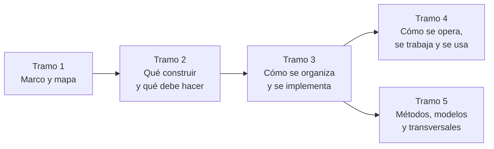

# Guía de estudio — Documentación técnica

## Resumen ejecutivo

Cuerpo documental formativo sobre la documentación técnica de software: qué tipos existen, qué problema resuelve cada uno, cuál producir en cada situación y cómo distinguir una versión buena de una pobre. Está pensada para leerse de corrido una vez y consultarse muchas después.

El recorrido va de lo general a lo particular. Primero el **marco de referencia**, que fija tres ejes —cuatro escenarios, tres contextos, diez actores— y se convierte en el vocabulario común de toda la guía. Después el **mapa conceptual**, con tres tablas de entrada que responden «estoy acá, qué aplico». Después las **siete familias documentales**, un documento por cada tipo de documentación técnica del catálogo. Al final, los **transversales**: métodos ágiles, modelos de arquitectura, UX y Spec-Driven Development, que no agregan artefactos nuevos pero cambian cuáles se exigen.

Todos los ejemplos usan el mismo dominio —un sistema de reserva de salas— y las mismas tecnologías de referencia —.NET y C#, Blazor con render mode *interactive server*, ASP.NET MVC y .NET MAUI con MVVM—, de modo que el mismo problema pueda compararse desde artefactos distintos.

---

## Cómo usar esta guía

Tres entradas según el motivo de la consulta.

**Estudiar el tema completo.** El orden de los directorios es el orden de lectura. Marco de referencia, mapa conceptual, familias de la uno a la siete, transversales. La [ruta sugerida](#ruta-de-lectura-sugerida) lo desglosa en cinco tramos.

**Resolver algo concreto.** Ir al [mapa conceptual](01-Mapa-Conceptual/Mapa-Conceptual.md), usar la tabla de entrada por escenario, identificar el artefacto, abrir ese documento y trabajar con la plantilla de su anexo. No hace falta el resto.

**Evaluar documentación ajena.** Tabla de entrada por artefacto del mapa, y dentro de cada documento, la sección de criterios de calidad, que es donde vive la distinción entre lo aceptable y lo que solo lo parece.

---

## Tabla de contenido

### Marco de referencia

El vocabulario común. Nada del resto de la guía se entiende sin esto.

| Documento | ID | Qué fija |
|-----------|----|----------|
| [Escenarios](00-Marco-de-Referencia/Escenarios.md) | `MARCO-ESCENARIOS` | Las cuatro situaciones de partida: desarrollo nuevo, migración, evaluación con código y evaluación desde afuera |
| [Contextos](00-Marco-de-Referencia/Contextos.md) | `MARCO-CONTEXTOS` | Los tres entornos: web y cliente interactivo, backend y servicios, fullstack |
| [Actores](00-Marco-de-Referencia/Actores.md) | `MARCO-ACTORES` | Los diez roles, su alcance, su autoridad y la matriz de responsabilidad |
| [Convenciones](00-Marco-de-Referencia/Convenciones.md) | `MARCO-CONVENCIONES` | Identificadores, frontmatter, estructura de documento y estilo de la guía |

### Mapa conceptual

| Documento | ID | Qué resuelve |
|-----------|----|--------------|
| [Mapa conceptual](01-Mapa-Conceptual/Mapa-Conceptual.md) | `MAPA-CONCEPTUAL` | Tres tablas de entrada —por escenario, por contexto y por artefacto— más los cruces escenario × familia y actor × familia |

### Familia 1 — Documentación de visión · ¿Qué queremos construir?

[Índice de la familia](10-Vision/README.md) · `FAM-VIS`

| Documento | ID | Propósito |
|-----------|----|-----------|
| [Vision Document](10-Vision/Vision-Document.md) | `DOC-VISION` | Qué es el producto, qué problema resuelve, alcance y público |
| [BRD](10-Vision/BRD.md) | `DOC-BRD` | Necesidades del negocio que justifican el proyecto |
| [PRD](10-Vision/PRD.md) | `DOC-PRD` | Funcionalidades desde la perspectiva del usuario y del negocio |
| [Roadmap](10-Vision/Roadmap.md) | `DOC-ROADMAP` | Evolución prevista del producto |

### Familia 2 — Documentación de análisis · ¿Qué debe hacer el sistema?

[Índice de la familia](20-Analisis/README.md) · `FAM-ANA`

| Documento | ID | Propósito |
|-----------|----|-----------|
| [SRS](20-Analisis/SRS.md) | `DOC-SRS` | Requisitos funcionales y no funcionales detallados. Incluye **casos de uso** y **reglas de negocio** como secciones propias |
| [Modelo de dominio](20-Analisis/Modelo-de-Dominio.md) | `DOC-DOMINIO` | Entidades, conceptos y relaciones del negocio |

### Familia 3 — Documentación de arquitectura · ¿Cómo estará organizado?

[Índice de la familia](30-Arquitectura/README.md) · `FAM-ARQ`

| Documento | ID | Propósito |
|-----------|----|-----------|
| [SAD](30-Arquitectura/SAD.md) | `DOC-SAD` | Arquitectura completa. Incluye **diagramas de arquitectura** y **arquitectura de despliegue** como secciones propias |
| [HLD](30-Arquitectura/HLD.md) | `DOC-HLD` | Módulos principales y su interacción, sin implementación |
| [ADR](30-Arquitectura/ADR.md) | `DOC-ADR` | Decisiones arquitectónicas con sus alternativas y justificación |
| [Arquitectura de seguridad](30-Arquitectura/Arquitectura-de-Seguridad.md) | `DOC-SECARQ` | Autenticación, autorización, cifrado y auditoría |
| [Threat Model](30-Arquitectura/Threat-Model.md) | `DOC-THREAT` | Amenazas, riesgos y mitigaciones |
| [RFC](30-Arquitectura/RFC.md) | `DOC-RFC` | Propuesta abierta a comentarios antes de implementar |

### Familia 4 — Documentación de diseño · ¿Cómo se implementa cada componente?

[Índice de la familia](40-Diseno/README.md) · `FAM-DIS`

| Documento | ID | Propósito |
|-----------|----|-----------|
| [LLD](40-Diseno/LLD.md) | `DOC-LLD` | Diseño detallado. Incluye **diagramas UML** e **interfaces y contratos internos** como secciones propias |
| [Modelo de datos](40-Diseno/Modelo-de-Datos.md) | `DOC-DATOS` | Estructura de los datos: entidades, atributos, claves e índices |
| [API Specification](40-Diseno/API-Specification.md) | `DOC-API` | Contrato de las APIs, con ejemplos y garantías |
| [Integration Guide](40-Diseno/Integration-Guide.md) | `DOC-INTEGRACION` | Cómo integrar sistemas externos con la plataforma |

### Familia 5 — Documentación operativa · ¿Cómo se instala, mantiene y opera?

[Índice de la familia](50-Operativa/README.md) · `FAM-OPE`

| Documento | ID | Propósito |
|-----------|----|-----------|
| [Installation Guide](50-Operativa/Installation-Guide.md) | `DOC-INSTALL` | Instalación desde cero |
| [Deployment Guide](50-Operativa/Deployment-Guide.md) | `DOC-DEPLOY` | Despliegue en los distintos entornos |
| [Operations Guide](50-Operativa/Operations-Guide.md) | `DOC-OPERACION` | Operación diaria. Incluye **disaster recovery** como sección propia |
| [Administrator Guide](50-Operativa/Administrator-Guide.md) | `DOC-ADMIN` | Configuración, usuarios, permisos y mantenimiento |
| [Runbook](50-Operativa/Runbook.md) | `DOC-RUNBOOK` | Procedimientos ante incidentes y tareas repetitivas |
| [Postmortem](50-Operativa/Postmortem.md) | `DOC-POSTMORTEM` | Análisis de incidentes, causas y acciones correctivas |

### Familia 6 — Documentación para desarrollo · ¿Cómo trabajamos sobre el proyecto?

[Índice de la familia](60-Desarrollo/README.md) · `FAM-DEV`

| Documento | ID | Propósito |
|-----------|----|-----------|
| [Developer Guide](60-Desarrollo/Developer-Guide.md) | `DOC-DEVGUIDE` | Estructura y flujo de trabajo. Incluye **coding standards**, **git workflow**, **convenciones** y **CI/CD** como secciones propias |
| [Test Plan](60-Desarrollo/Test-Plan.md) | `DOC-TESTPLAN` | Estrategia de pruebas y criterios de aceptación |
| [Test Cases](60-Desarrollo/Test-Cases.md) | `DOC-TESTCASES` | Casos de prueba concretos y resultados esperados |
| [Release Notes](60-Desarrollo/Release-Notes.md) | `DOC-RELEASE` | Cambios de cada versión, para quien usa el producto |
| [Change Log](60-Desarrollo/Change-Log.md) | `DOC-CHANGELOG` | Historial cronológico de cambios, para quien desarrolla |

### Familia 7 — Documentación para usuarios · ¿Cómo se utiliza el sistema?

[Índice de la familia](70-Usuarios/README.md) · `FAM-USR`

| Documento | ID | Propósito |
|-----------|----|-----------|
| [User Manual](70-Usuarios/User-Manual.md) | `DOC-MANUAL` | Documentación para quien usa el sistema. Incluye **tutoriales**, **FAQ** y **guías rápidas** como secciones propias |

### Métodos ágiles

[Índice de la serie](80-Metodos-Agiles/README.md) · `MET-INDICE`. El ángulo es documental: qué documentación produce, exige y elimina cada método.

| Documento | ID |
|-----------|-----|
| [Manifiesto y documentación](80-Metodos-Agiles/Manifiesto-y-Documentacion.md) | `MET-MANIFIESTO` |
| [Scrum](80-Metodos-Agiles/Scrum.md) | `MET-SCRUM` |
| [Kanban](80-Metodos-Agiles/Kanban.md) | `MET-KANBAN` |
| [Canvas](80-Metodos-Agiles/Canvas.md) | `MET-CANVAS` |
| [Comparativa y criterios](80-Metodos-Agiles/Comparativa-y-Criterios.md) | `MET-COMPARATIVA` |

### Modelos de arquitectura

[Índice de la serie](90-Modelos-de-Arquitectura/README.md) · `ARQ-INDICE`. Cada modelo aparece vinculado con la documentación que exige, y el mismo sistema de reservas está modelado bajo los cinco.

| Documento | ID |
|-----------|-----|
| [Cliente-servidor](90-Modelos-de-Arquitectura/Cliente-Servidor.md) | `ARQ-CS` |
| [Modelo de capas](90-Modelos-de-Arquitectura/Modelo-de-Capas.md) | `ARQ-CAPAS` |
| [Monolítico](90-Modelos-de-Arquitectura/Monolitico.md) | `ARQ-MONO` |
| [Hexagonal](90-Modelos-de-Arquitectura/Hexagonal.md) | `ARQ-HEX` |
| [Microservicios](90-Modelos-de-Arquitectura/Microservicios.md) | `ARQ-MICRO` |
| [Comparativa y criterios](90-Modelos-de-Arquitectura/Comparativa-y-Criterios.md) | `ARQ-COMPARATIVA` |

### Transversales

| Documento | ID | Propósito |
|-----------|----|-----------|
| [UX, UI y flujo de usuario](95-Transversales/UX-UI-y-Flujo-de-Usuario.md) | `DOC-UX` | Herramientas documentales de experiencia e interacción, y su integración con el resto del marco |
| [Spec-Driven Development](95-Transversales/Spec-Driven-Development.md) | `DOC-SDD` | La especificación como fuente de verdad para la generación de código asistida por IA |

### Anexos

| Documento | ID | Propósito |
|-----------|----|-----------|
| [Glosario](99-Anexos/Glosario.md) | `ANEXO-GLOSARIO` | Término canónico, definición y alias registrados |
| [Revisión de consistencia](99-Anexos/Revision-de-Consistencia.md) | `ANEXO-REVISION` | Qué se verificó, qué se corrigió y qué decisiones son criterio propio |
| [Pendientes](99-Anexos/Pendientes.md) | `ANEXO-PENDIENTES` | Backlog de huecos, verificaciones y convenciones sin fijar, con ubicación propuesta |

Las plantillas comentadas no están centralizadas: cada documento temático cierra con la suya, junto al contexto que explica cómo completarla.

---

## Ruta de lectura sugerida

Cinco tramos. Los tres primeros son secuenciales; los dos últimos pueden tomarse en cualquier orden o consultarse sueltos.

**Tramo 1 — El aparato conceptual.** Escenarios, contextos, actores, convenciones y mapa. Es el único tramo obligatorio: sin los cuatro escenarios y los tres contextos, el resto de la guía se lee como una enciclopedia de tipos de documento, que es exactamente lo que no quiere ser.

**Tramo 2 — Visión y análisis.** Familias 1 y 2. Se aprende a distinguir intención de requisito, y requisito de regla. La frontera PRD ↔ SRS es el punto donde más equipos se confunden y donde conviene detenerse.

**Tramo 3 — Arquitectura y diseño.** Familias 3 y 4. El salto de nivel más grande de la guía. Si el tiempo aprieta, el orden de rendimiento decreciente es SAD, ADR, LLD, modelo de datos, API.

**Tramo 4 — Operación, desarrollo y usuarios.** Familias 5, 6 y 7. Es la documentación que más se usa a diario y la que menos se enseña. El Runbook y el Postmortem cambian de forma la manera de escribir, porque se leen bajo presión.

**Tramo 5 — Métodos, modelos y transversales.** Cómo el método de trabajo y el modelo de arquitectura modifican todo lo anterior, más UX y SDD. Quien ya trabaja en un equipo con método definido puede empezar por acá y volver hacia atrás.

### Rutas alternativas por rol

| Rol | Ruta corta |
|-----|-----------|
| Analista (`ACT-02`) | Tramo 1 → familias 1 y 2 → UX → Test Plan |
| Arquitecto (`ACT-03`) | Tramo 1 → familia 3 → modelos de arquitectura → familia 4 |
| Desarrollador (`ACT-04`) | Tramo 1 → familia 4 → Developer Guide → familia 3 |
| QA (`ACT-05`) | Tramo 1 → SRS → Test Plan → Test Cases → Postmortem |
| DevOps/SRE (`ACT-06`) | Tramo 1 → familia 5 → Developer Guide → SAD |
| Product Owner (`ACT-01`) | Tramo 1 → familia 1 → métodos ágiles → Roadmap |
| Technical Writer (`ACT-09`) | Tramo 1 → familia 7 → convenciones → glosario |

---

## Alcance y límites

La guía cubre los veintiocho tipos de documentación de la tabla del catálogo de referencia, más los artefactos que ese catálogo menciona solo dentro de su agrupación práctica —casos de uso, reglas de negocio, coding standards, git workflow, CI/CD, disaster recovery, tutoriales, FAQ y guías rápidas—, que se tratan como secciones dentro del documento de la familia que los contiene y no como documentos propios.

Lo que la guía **no** hace: no enseña .NET, Blazor ni MAUI, que aparecen solo como vocabulario de los ejemplos; no reemplaza a las normas que cita, de las que toma designación e idea y no texto; y no prescribe un proceso de trabajo único, porque el método adecuado depende del escenario, del contexto y del equipo.

Las afirmaciones que provienen de estándares se citan por designación exacta. Lo que es criterio propio de esta guía se declara como tal en el lugar donde aparece. Cada documento registra en su frontmatter su origen y su nivel de confianza, según [Convenciones](00-Marco-de-Referencia/Convenciones.md).

---

## Estado del cuerpo documental

| Bloque | Documentos | Líneas |
|--------|-----------:|-------:|
| Marco de referencia | 4 | 747 |
| Mapa conceptual | 1 | 286 |
| Familias 1 a 7 | 35 | 13 035 |
| Métodos ágiles | 6 | 2 200 |
| Modelos de arquitectura | 7 | 2 830 |
| Transversales | 2 | 1 043 |
| Anexos | 3 | 323 |
| Índice | 1 | 237 |
| **Total** | **59** | **20 700** |

El recuento de familias incluye los siete índices de familia. El cuerpo contiene 87 diagramas Mermaid y ningún enlace roto.

La revisión de la guía completa contra el mapa está registrada en el [informe de consistencia](99-Anexos/Revision-de-Consistencia.md), que documenta qué se verificó, qué se corrigió, qué decisiones son criterio propio y qué huecos quedan abiertos. Conviene leerlo antes de extender la guía.
