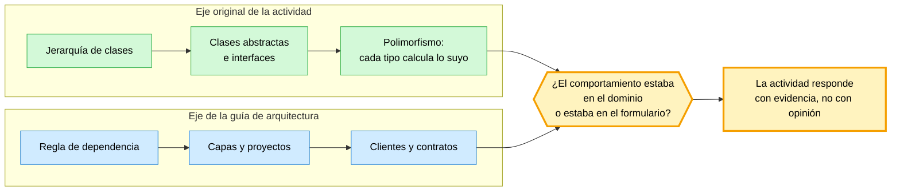
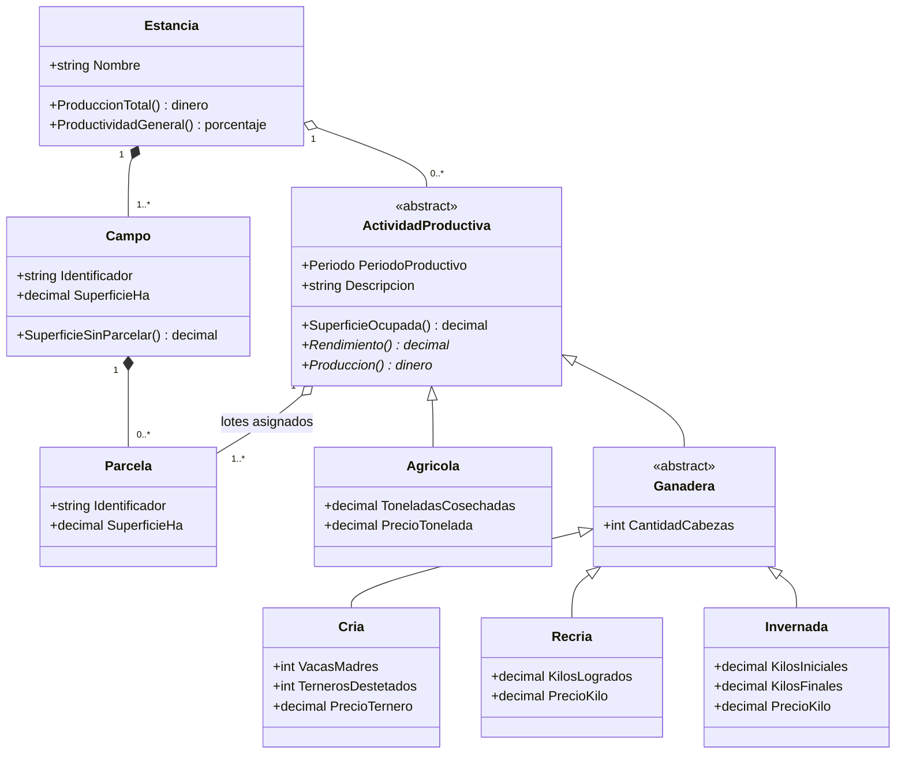
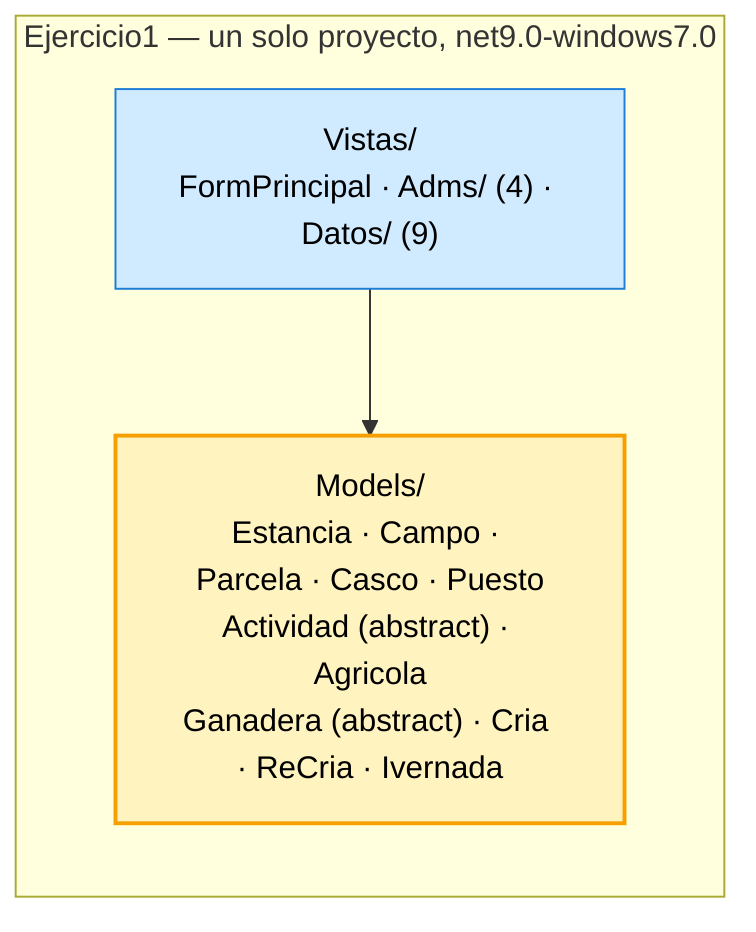
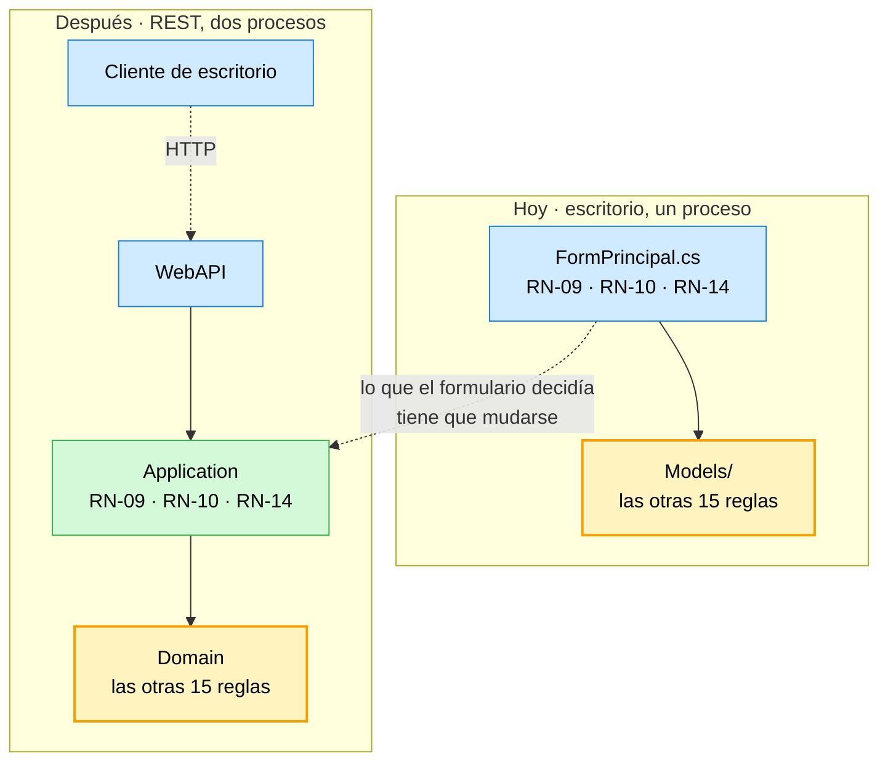

# La Estancia — actividad interactiva

Esta no es una segunda guía de arquitectura. Es el **banco de pruebas** de la guía [`Dot-NET-Arquitectura-Guide.md`](Dot-NET-Arquitectura-Guide.md): toma un problema que ya fue resuelto una vez, con una aplicación de escritorio real y un modelo de clases real, y lo vuelve a resolver con la estructura que la guía propone. Cada capítulo de la guía deja de ser una afirmación y pasa a ser algo que se cumple o no se cumple contra un caso que nadie inventó para la ocasión.

El documento se escribe **mientras la actividad se hace**. Lo que está verificado en máquina lleva su marca de procedencia; lo que todavía no se resolvió está rotulado como pendiente y dice quién lo tiene que decidir.

## Índice

- **[0. Cómo usar este documento](#0-cómo-usar-este-documento)**: qué es, qué relación tiene con la guía, cómo se lee y qué marcas usa.
- **[1. El problema: La Estancia «La Ana»](#1-el-problema-la-estancia-la-ana)**: de dónde sale, el modelo de dominio y las dieciocho reglas de negocio.
- **[2. La línea de base: la versión de escritorio](#2-la-línea-de-base-la-versión-de-escritorio)**: qué se construyó la primera vez y qué forma tiene.
- **[3. El punto de partida: la solución `LaEstancia`](#3-el-punto-de-partida-la-solución-laestancia)**: lo que ya está creado y verificado, y por qué está vacío a propósito.
- **[4. Los hitos de la actividad](#4-los-hitos-de-la-actividad)**: la secuencia A0 a A9, cada uno con su señal observable.
- **[5. Lo que la actividad le encontró a la guía](#5-lo-que-la-actividad-le-encontró-a-la-guía)**: los hallazgos que vuelven al apunte, y las preguntas abiertas.
- **[6. Bitácora de la construcción](#6-bitácora-de-la-construcción)**: lo que se decide mientras se escribe el código, con su motivo.
- **[7. Registro de cambios](#7-registro-de-cambios)**: qué se hizo en cada sesión.

---

## 0. Cómo usar este documento

### 0.1 Qué es y qué no es

| Es | No es |
| --- | --- |
| El recorrido de una actividad concreta sobre un dominio dado | Un resumen ni un reemplazo de la guía de arquitectura |
| El lugar donde la guía se pone a prueba y, cuando falla, se corrige | El lugar donde se definen los conceptos: eso está en la guía |
| Un documento que crece sesión a sesión, con lo pendiente declarado | Un documento cerrado |

Cada vez que la actividad muestra que la guía dice algo que no se sostiene, o que calla algo que hace falta, eso **vuelve a la guía**. Este documento registra el hallazgo; la guía registra la corrección.

### 0.2 Los dos ejes que se cruzan

La actividad original y la guía de arquitectura enseñan cosas distintas. El valor está en el cruce.



Un modelo con herencia rica es justamente el caso donde poner una API adelante **revela** dónde vivía de verdad el comportamiento. Si estaba en las clases del modelo, la API lo reutiliza y la traducción es mecánica. Si estaba repartido entre los formularios, la API lo deja a la vista: hay que reescribirlo, y ahí se mide cuánto costaba la forma anterior.

### 0.3 Marcas de procedencia

Se usan las mismas marcas que la guía, más una propia de este documento.

| Marca | Significado |
| --- | --- |
| *Verificado en máquina: fecha, comando* | La afirmación se comprobó ejecutando el comando que se indica, en el entorno declarado en el encabezado |
| **[Leído: `ruta`]** | Extracto textual de un archivo que existe en el workspace, citado por ruta |
| **[Fuente: enunciado §X]** | Sale del enunciado original, transcrito como evidencia (§1.1) |
| **⏳ Pendiente de mesa** | Todavía no se decidió; dice qué falta y quién decide |
| **⚠ Hallazgo contra la guía** | La actividad encontró algo que la guía no sostiene o no dice; va a corrección |
| **Criterio de esta actividad** | Decisión propia de la actividad, no una norma |

---

## 1. El problema: La Estancia «La Ana»

### 1.1 De dónde sale

El problema **no se inventó para esta guía**. Es la Actividad Integradora 3.3 de Programación II, UTN FRP, TUP, 2026, de Fernando Filipuzzi: *«Jerarquía en programación orientada a objetos. Modelado. La Estancia "La Ana"»*.

Eso importa por tres razones, y conviene decirlas antes de empezar:

1. **El dominio está dado.** No se elige, no se recorta y no se simplifica para que entre en un capítulo. Lo que el enunciado pide es lo que hay que poder hacer.
2. **Ya tiene una solución.** Existe una aplicación de escritorio que resuelve los quince casos de uso (§2). La versión con API no la reemplaza: la usa como término de comparación.
3. **El eje del original es la jerarquía de clases**, no la arquitectura. La actividad va a pedirle a la guía de arquitectura algo que la guía no eligió como tema central, y ahí es donde se va a ver si aguanta.

El enunciado completo, el modelo, los quince casos de uso y las dieciocho reglas de negocio numeradas están transcritos como evidencia en el registro de la actividad, fuera de esta guía, para que ninguna afirmación dependa de un documento que no se puede abrir.

### 1.2 El modelo de dominio

Éste es el modelo que **el texto del enunciado sostiene literalmente**. El enunciado remite además a tres figuras que son imágenes y no se transcribieron: lo que esas figuras agreguen está pendiente de verificación.



*(Se omiten `Casco` y `Puesto`, que el enunciado declara fuera de alcance administrativo: «La administración del casco y de los puestos se contempla en un futuro análisis del sistema».)* **[Fuente: enunciado §I]**

**Sobre la palabra «lote».** El enunciado la define como *«una parcela de alguno de los campos de la estancia»* asignada a una actividad. No es una clase con atributos propios: es el **rol** que juega una parcela cuando una actividad la toma. Si en la implementación aparece una clase `Lote`, eso es una decisión de diseño que hay que justificar, no algo que el enunciado pida. Es el primer punto donde la actividad va a tener que usar el §7 de la guía («cada objeto responde una pregunta») para algo que no es evidente.

### 1.3 Lo que hace interesante a este dominio

Cuatro rasgos, y cada uno tensiona un capítulo distinto de la guía:

| Rasgo del dominio | Qué tensiona |
| --- | --- |
| Los subtipos de actividad calculan producción y rendimiento con **fórmulas distintas y unidades distintas** | §3 (Domain): si el comportamiento es del dominio, la jerarquía es del dominio |
| Hay invariantes que cruzan objetos: la suma de parcelas contra la superficie del campo, una parcela tomada por una sola actividad | §3 (invariantes) y §7 (qué objeto es responsable de sostenerlos) |
| El **cierre** de una actividad recibe datos que dependen del tipo | §4 (Use Cases): un caso de uso cuyo contrato de entrada varía según el subtipo |
| El enunciado pide explícitamente **agregar un tipo nuevo** (forestal, apícola, avícola, turismo rural) | Todo: es un cambio acotado cuyo costo se puede medir en las dos versiones |

Ese último rasgo es el mejor instrumento de medición que tiene la actividad. La Tarea 2 del enunciado pide extender el modelo con una actividad económica nueva. Es el mismo cambio en los dos mundos, y se puede cronometrar y contar: cuántos archivos se tocan, cuántos compilan, cuántas veces hay que repetir una regla.

---

## 2. La línea de base: la versión de escritorio

Antes de construir nada nuevo hay que mirar lo que ya existe, y describirlo sin juzgarlo todavía.

### 2.1 Qué es

**[Leído: `PROG2/2026/dev/tup_prog_2_2026_actividad3.3/Actividad3.3/`]**

| | |
| --- | --- |
| Solución | `Actividad3.3.sln`, un solo proyecto |
| Proyecto | `Ejercicio1.csproj` — `Microsoft.NET.Sdk`, `OutputType` `WinExe`, `TargetFramework` `net9.0-windows7.0`, `UseWindowsForms` `true` |
| Carpetas | `Models/` (11 clases del dominio) y `Vistas/` (14 formularios) |
| Persistencia | ninguna: el estado vive en memoria mientras la aplicación corre |

Windows Forms, .NET 9, **un solo proyecto**. En el vocabulario de la guía esto es exactamente el escalón 1 del §9.2 y el escenario E-A: sin capas, sin API, sin base de datos. Y no está mal: es la estructura que el problema pedía cuando se resolvió.



### 2.2 El corazón del ejercicio

La clase `Actividad` es abstracta y declara dos métodos abstractos que **cada subtipo resuelve a su manera**:

```csharp
// [Leído: Models/Actividad.cs]
abstract public class Actividad
{
    public int Periodo { get; set; }
    public string Descripcion { get; set; }

    //los lotes son parcelas que ya existen en algún campo de la estancia,
    //acá solo guardo la referencia (agregación)
    List<Parcela> lotesAsignados = new List<Parcela>();

    public bool AsignarLote(Parcela lote)
    {
        //un lote no se puede asignar dos veces a la misma actividad
        //y una actividad cerrada ya no admite más lotes
        if (lote != null && !Cerrada && !lotesAsignados.Contains(lote))
        {
            lotesAsignados.Add(lote);
            return true;
        }
        return false;
    }

    public bool Cerrada { get; private set; } = false;

    public bool Cerrar()
    {
        if (CantidadLotes > 0)
        {
            Cerrada = true;
            return true;
        }
        return false;
    }

    //cada tipo de actividad sabe calcular lo suyo (polimorfismo)
    abstract public double CalcularRendimiento();
    abstract public double CalcularProduccion();
}
```

| Línea | Concepto de la guía |
| --- | --- |
| `abstract public class Actividad` | Una jerarquía de tipos dentro del dominio (§3) |
| `List<Parcela> lotesAsignados` privada | El objeto es dueño de su colección: nadie de afuera la modifica (§3, §7) |
| `AsignarLote` con las condiciones adentro | Reglas de negocio en el objeto que las tiene que sostener (§3.2) |
| `Cerrada` con `private set` | Un cambio de estado que sólo ocurre por un método del propio objeto |
| `abstract … CalcularProduccion()` | El comportamiento que varía por tipo vive en el tipo, no en un `switch` (§7) |

**Lo primero que hay que reconocerle a este código**: el modelo **no es anémico**. El comportamiento está en las clases del dominio, no en los formularios. Es la mitad del trabajo que la guía de arquitectura suele tener que pedir, y acá ya está hecho.

### 2.3 Dónde vive hoy cada una de las dieciocho reglas

Ésta es la medición que ordena toda la actividad. Se hizo leyendo las once clases de `Models/` y los catorce formularios de `Vistas/`, regla por regla. **[Leído: `Ejercicio1/`, `HEAD 80c003b`]**

| Domicilio | Cuántas | Cuáles |
| --- | --- | --- |
| **Dominio** ✅ | 11 | RN-01, RN-02, RN-05, RN-06, RN-07, RN-08, RN-11, RN-15, RN-16, RN-17, RN-18 |
| **Duplicada** entre dominio y vista | 3 | RN-03, RN-04 (el formulario revalida el alta de campo), RN-12 (benigna: adelanta el mensaje) |
| **Sólo en la vista** ❌ | 3 | RN-09, RN-10, RN-14 |
| Sin implementar | 1 | RN-13 |

Las tres que se fueron a la vista, con el código a la vista:

| Regla | Dónde se hace cumplir | Qué dice el dominio |
| --- | --- | --- |
| RN-09 — una parcela asignada no se modifica ni elimina | `FormPrincipal.cs` l. 553: `if (estancia.EstaAsignada(seleccionada))` | `Campo.ModificarParcela` y `Campo.EliminarParcela` **no la verifican** |
| RN-10 — una parcela va a una sola actividad | `FormPrincipal.cs` l. 337: `if (estancia.EstaAsignada(lote))` | `Actividad.AsignarLote` sólo mira que no esté repetida **en la misma** actividad |
| RN-14 — los datos de cierre son los del tipo | `FormPrincipal.cs` l. 396–419: `if (actividad is Agricola) { ((Agricola)actividad).CantidadToneladasCosechadas = Convert.ToInt32(fCierre.tbToneladas.Text); } else if …` | nada: `Cerrar()` sólo verifica que haya lotes |

### 2.4 Por qué se filtraron esas tres y no las otras quince

No fue descuido, y no es que el modelo sea anémico. Las tres comparten una propiedad:

| Regla | Qué necesita para poder decidirse |
| --- | --- |
| RN-09 | Ver **todas** las actividades de la estancia, parada en un campo |
| RN-10 | Ver **todas** las actividades de la estancia, parada en una actividad |
| RN-14 | Saber **de qué tipo** es la actividad, para pedir unos datos u otros |

Las tres necesitan algo que **ningún objeto del modelo tiene a mano en el momento de decidir**. Y en una aplicación de escritorio hay exactamente un lugar que tiene todo a mano: el formulario principal, dueño de la `Estancia` y conductor de cada caso de uso.

> **`FormPrincipal` ya es una capa de aplicación.** Orquesta, coordina y decide el orden de los pasos. Lo que no es, es una capa **separable**: está atada a `ShowDialog()`, a `DialogResult` y a `MessageBox`.

De ahí sale la afirmación que esta actividad existe para dejar instalada, y que no es una opinión sino algo medido:

> **La capa `Application` no aparece porque el modelo sea anémico. Aparece porque hay reglas que no caben en ningún objeto del dominio y hoy viven en el único lugar que los ve a todos: el formulario. Y el día que hay un segundo cliente, esas reglas no viajan.**

El contraste que lo prueba, con dos casos de uso del mismo modelo:

| Caso de uso | ¿Cruza el HTTP? | Por qué |
| --- | --- | --- |
| CU-15, el informe | **Sí, gratis** | `total += actividad.CalcularProduccion()` no pregunta nada (`Estancia.cs` l. 157): el polimorfismo hace el trabajo |
| CU-14, el cierre | **No** | la decisión de qué datos pedir está escrita con `is` en la vista |



*Diagrama 2.2. Las quince reglas de `Models/` cambian de proyecto y no de forma. Las tres de `FormPrincipal` cambian de forma, porque del otro lado del HTTP no hay formulario.*

### 2.5 Otras cosas que crujen

No son errores del original: son consecuencias de la estructura que tenía.

1. **Identidad posicional.** `Campo.cs` l. 91 reordena la colección, y el propio autor lo comenta en `FormPrincipal.cs` l. 182–183. En una pantalla el índice alcanza; entre dos peticiones HTTP, no.
2. **`double` para dinero y superficies.** Decisión natural en una primera versión; candidata directa al capítulo de *Value Objects*.
3. **`Ganadera` declara `CantidadCabezas` pero su constructor la deja afuera** (el parámetro está comentado, `Ganadera.cs` l. 9–12). Produce rendimientos `0` que en realidad significan «no sé».
4. **El tipo de actividad es un entero mágico** compartido entre el combo de la vista y un `switch` del dominio (`Estancia.cs` l. 51–74 ↔ `FormPrincipal.cs` l. 246 ↔ `FormActividadDatos.Designer.cs` l. 143).
5. **El primer campo no pasa por `AgregarCampo`**, así que las validaciones del alta no lo alcanzan.
6. **Un defecto latente que la Tarea 2 va a activar**: `FormActividadDatos.cs` l. 18 dice `tbCantidadCabezas.Enabled = cmbTipoActividad.SelectedIndex > 0;` y el combo tiene cuatro ítems (Agrícola, Cría, Ivernada, ReCría). **Cualquier actividad no ganadera que se agregue al final del combo habilita «cantidad de cabezas».** Es exactamente el tipo de acoplamiento que la actividad va a medir.

---

## 3. El punto de partida: la solución `LaEstancia`

### 3.1 Qué está creado

*Verificado en máquina: 2026-09-24, imagen `mcr.microsoft.com/dotnet/sdk:10.0`, SDK 10.0.400.*

```text
Interactive-Activities/
├── global.json                        SDK 10.0.400, rollForward latestFeature
├── LaEstancia.slnx                    solución en formato XML (slnx)
└── src/
    └── Backend/
        ├── LaEstancia.WebAPI/             net10.0 — el borde HTTP
        │   ├── LaEstancia.WebAPI.csproj
        │   ├── Program.cs
        │   ├── LaEstancia.WebAPI.http
        │   ├── appsettings.json
        │   ├── appsettings.Development.json
        │   └── Properties/launchSettings.json
        └── LaEstancia.Infrastructure/     net10.0 — EF Core + SQLite, sin una sola clase (§3.6)
            └── LaEstancia.Infrastructure.csproj

    Faltan, y los escribe quien hace la actividad:
    LaEstancia.Domain  ·  LaEstancia.Application
```

Dos paquetes, y nada más:

| Paquete | Versión | Para qué |
| --- | --- | --- |
| `Microsoft.AspNetCore.OpenApi` | 10.0.11 | Genera el documento OpenAPI a partir de los endpoints |
| `Scalar.AspNetCore` | 2.17.9 | Interfaz de lectura y prueba sobre ese documento |

### 3.2 El `Program.cs`

```csharp
// [Compilado: Interactive-Activities/src/Backend/LaEstancia.WebAPI/Program.cs]
using Scalar.AspNetCore;

var builder = WebApplication.CreateBuilder(args);

// Documento OpenAPI: lo genera el propio ASP.NET Core a partir de los endpoints.
builder.Services.AddOpenApi();

// --- Registro de las capas ---
// builder.Services.AddApplication();
// builder.Services.AddInfrastructure(builder.Configuration);

var app = builder.Build();

if (app.Environment.IsDevelopment())
{
    app.MapOpenApi();                    // /openapi/v1.json — el documento crudo
    app.MapScalarApiReference(options => options.WithTitle("LaEstancia — API"));
}

app.UseHttpsRedirection();

// --- Endpoints ---
// app.MapProductosEndpoints();

app.Run();
```

### 3.3 Qué se verificó y cómo

| Qué | Comando | Resultado |
| --- | --- | --- |
| Compila sin errores | `dotnet build LaEstancia.slnx` | correcto, cero errores |
| El documento OpenAPI se sirve | `curl http://127.0.0.1:5250/openapi/v1.json` | `200`, `"openapi": "3.1.1"`, `"title": "LaEstancia.WebAPI \| v1"`, `"paths": { }` |
| La interfaz de Scalar responde | `curl -L http://127.0.0.1:5250/scalar` | `302` → `/scalar/` → `200`, `<title>LaEstancia — API</title>` |

Que `paths` esté **vacío** no es un defecto: es el estado correcto de partida. La API existe, se documenta sola y no afirma todavía nada sobre el negocio.

### 3.4 Por qué el proyecto está en `src/Backend/`

La guía dice que la carpeta de primer nivel indica **qué se despliega junto** (§8.1), y que el árbol crece con la solución (§8.6). Con un solo proyecto, `src/Backend/` no hace falta todavía.

**Criterio de esta actividad**: se adopta igual, desde el principio, porque se sabe de antemano que van a llegar hermanos —`LaEstancia.Domain`, `LaEstancia.Application`, `LaEstancia.Infrastructure`— y un cliente que no se despliega con ellos. Mover archivos después es barato; discutir dónde va cada cosa mientras se escribe, no.

**⚠ A registrar**: la guía justifica el árbol para una solución que ya tiene varias unidades de despliegue, y justifica el proyecto único para el escalón 1, pero no dice qué hacer cuando se **sabe** que la solución va a crecer. Es un hueco chico y concreto, y la actividad lo encontró en el primer comando.

### 3.5 Lo que deliberadamente no está

No hay entidades, ni *Use Cases*, ni endpoints, ni `DbContext`. `LaEstancia.Domain` y
`LaEstancia.Application` **no existen todavía**, y `LaEstancia.Infrastructure` está vacío de clases.

**Criterio de esta actividad**: el andamiaje llega hasta donde empieza la decisión de diseño, y ni un
archivo más. Los espacios de nombres, las clases y las capas las escribe quien hace la actividad; el
documento registra lo que va pasando y responde las preguntas que aparecen. Ésa es la parte
interactiva, y es el punto: si el andamiaje decidiera por el lector, no habría nada que aprender.

### 3.6 La persistencia: SQLite

*Verificado en máquina: 2026-09-24, SDK 10.0.400.*

**Decisión del autor**: la actividad persiste con SQLite. El proyecto `LaEstancia.Infrastructure`
existe para alojar esa decisión, porque es donde la guía ubica a EF Core (§8.3): el dominio no puede
nombrarlo.

| Paquete | Versión |
| --- | --- |
| `Microsoft.EntityFrameworkCore.Sqlite` | 10.0.12 |
| `Microsoft.EntityFrameworkCore.Design` | 10.0.12 (`PrivateAssets=all`: herramienta, no dependencia de ejecución) |

El proyecto está **vacío de clases**: sólo tiene los paquetes y la referencia desde la WebAPI. La
solución compila con cero advertencias.

#### Qué se comprobó antes de adoptarlo

Se montó aparte una jerarquía con la misma forma que la de La Estancia —base abstracta, dos subtipos
con fórmulas distintas— y se la guardó y releyó con SQLite. Dos resultados importan para el diseño:

```text
Agricola  Soja lote 4    produccion = 99,355.00
Cria      Rodeo norte    produccion = 78,633.50
tablas: Actividades sqlite_sequence
  fila: Agricola | Soja lote 4
  fila: Cria     | Rodeo norte
```

1. **El polimorfismo sobrevive a la base.** Los objetos releídos vuelven con su tipo concreto, y
   `Produccion()` calcula lo que corresponde a cada uno sin que nadie pregunte por el tipo.
2. **EF Core guarda la jerarquía en una sola tabla con una columna `Discriminator`.** Es la estrategia
   *table-per-hierarchy*, y es la que elige por omisión.

#### El detalle que hay que saber de antemano

**EF Core no descubre los subtipos solo.** Con sólo `DbSet<Actividad>`, el modelo falla al arrancar:

```text
System.InvalidOperationException: The entity type 'Actividad' cannot be instantiated because its
corresponding CLR type is abstract and there is no derived entity type in the model that corresponds
to a concrete CLR type.
```

Hay que nombrarlos, y eso se hace **en `Infrastructure`**, no en el dominio:

```csharp
protected override void OnModelCreating(ModelBuilder b)
{
    b.Entity<Agricola>();
    b.Entity<Cria>();
}
```

**Lo importante para quien escribe el dominio**: esto **no impone nada** sobre las clases del dominio.
No hay atributos, no hay clase base de EF, no hay `using` de EF Core. La jerarquía se escribe como se
escribiría sin base de datos, y el mapeo es problema de la capa de afuera. Es exactamente lo que la
regla de dependencia promete, comprobado antes de escribir la primera clase.

### 3.7 Cómo se corre

```bash
cd Interactive-Activities
docker run --rm -it --network host \
  -e HOME=/tmp/home -e DOTNET_CLI_HOME=/tmp/home \
  -v "$PWD":/w -w /w mcr.microsoft.com/dotnet/sdk:10.0 \
  bash -c 'mkdir -p /tmp/home && ASPNETCORE_ENVIRONMENT=Development \
    ASPNETCORE_URLS=http://127.0.0.1:5250 dotnet run --project src/Backend/LaEstancia.WebAPI'
```

Con el SDK instalado en el equipo, `dotnet run --project src/Backend/LaEstancia.WebAPI` alcanza; el perfil `http` de `launchSettings.json` escucha en el puerto 5250 y el perfil `https` agrega el 7111. La interfaz queda en `http://127.0.0.1:5250/scalar/`.

---

## 4. Los hitos de la actividad

**Criterio de esta actividad**: cada hito existe porque hay una decisión que se puede tomar mal, y hay un comando que revela que se tomó mal. Un hito sin señal observable es una opinión y no entra.

### 4.1 El mapa

```mermaid
flowchart LR
    A0["A0 · medir<br/>la línea de base"] --> A1["A1 · el modelo dado<br/>tal cual, detrás de HTTP"]
    A1 -->|"el índice no sobrevive"| A2["A2 · identidad"]
    A2 -->|"tres reglas sin dueño"| A3["A3 · Application"]
    A3 -->|"que lo exija el compilador"| A4["A4 · Domain aparte"]
    A4 -->|"el cierre pregunta por el tipo"| A5["A5 · cierre polimórfico<br/>y contrato con subtipos"]
    A5 --> A6["A6 · el dinero<br/>double → Value Object"]
    A6 --> A7["A7 · persistir<br/>una jerarquía"]
    A7 --> A8["A8 · Contracts<br/>+ cliente"]
    A8 --> A9["A9 · Tarea 2<br/>en los dos mundos"]

    classDef medir fill:#e5dbff,stroke:#7048e8,stroke-width:2px,color:#000
    class A0,A9 medir
```



*Diagrama 4.1. Cada flecha es una señal observable, en el sentido del §9.3 de la guía. A0 y A9 son mediciones y enmarcan a las demás: la actividad empieza contando y termina contando.*

### 4.2 La tabla

| Hito | Qué se hace | § que pone a prueba | Error típico que debe aparecer | Verificación |
| --- | --- | --- | --- | --- |
| **A0** | Reproducir uno mismo la tabla de §2.3, con `grep`, y contar los puntos de toque de la Tarea 2 | §3.2, §3.6, §9.1 | Leer `Models/`, ver que el modelo tiene comportamiento y concluir «está todo bien puesto» sin abrir `FormPrincipal.cs` | `grep -rn 'is Agricola\|is Cria\|is Ivernada\|is ReCria' Vistas/`; `grep -n 'EstaAsignada' Models/ Vistas/` |
| **A1** | Copiar `Models/` **sin tocar una línea** y exponer CU-3, CU-6, CU-10 y CU-15 | §1.1, §9.2 escalones 1–2, §8.2 | Empezar «mejorando» el modelo antes de medir | `dotnet build`; el informe por HTTP devuelve los mismos números que el de escritorio |
| **A2** | Del índice al identificador: las rutas dejan de ser posicionales | §3.1, §7.1 | Exponer `GET /api/campos/{idx}/parcelas/{idx}` y que ande en la demo | Dos peticiones con un alta en el medio: con índices, la segunda devuelve otra parcela |
| **A3** | Reponer RN-09, RN-10 y RN-14 fuera de la vista: nace `LaEstancia.Application` | §3.6, §4.1–§4.6, §9.6 | Reponerlas en el controller o el endpoint: el mismo error con otro traje | `dotnet test`: «no se elimina una parcela asignada» pasa **sin HTTP y sin base** |
| **A4** | `LaEstancia.Domain` como proyecto aparte | §1.4, §2.3, §2.7, §8.3 | El `using` sin la referencia | `dotnet build` → **`CS0234`**; `dotnet list … reference` sobre `Domain` → sin referencias |
| **A5** | El cierre sin preguntar por el tipo, y el contrato que transporta subtipos | §3.7, §3.8, §4.10, §7.2 | Reproducir la cadena de `is` en el handler o en el serializador | Cerrar los cuatro tipos por el mismo *Use Case*; `grep -rn ' is Agricola' src/` → **vacío** |
| **A6** | `double` → *Value Object* de dinero; las *Invariants* que hoy ninguna fábrica establece | §3.3, §3.6, §7.5 | Cambiar el tipo y no la fábrica: siguen quedando dos caminos de creación | Suma con decimales: el total en `double` y el del *Value Object* **difieren** |
| **A7** | Persistir la jerarquía: `LaEstancia.Infrastructure` con EF Core | §5.1, §5.3, §5.5 | Agregar EF Core a `Domain` para poner atributos | `sha256sum` de `LaEstancia.Domain.dll` antes y después: **idéntico** |
| **A8** | `LaEstancia.Contracts` y el cliente contra la API | §6.1–§6.3, §8.1, §8.3, §8.5 | Referenciar `Domain` desde el cliente «para reusar `Actividad`» | `dotnet list <cliente> reference` → **sólo `Contracts`** |
| **A9** | **La Tarea 2 en los dos mundos**: agregar la actividad económica nueva y contar | §9.3, §9.6, §9.8 | Declarar la mejora sin contar, o contar archivos en vez de «lo que el compilador exige» | `git diff --stat` de las dos ramas; y el defecto latente de §2.5.6 **no** debe reproducirse |

**⏳ Bloqueados a la espera de la mesa**: A5 y A7 dependen de que se resuelva si el apunte incorpora un tratamiento de jerarquías de tipos (hoy no tiene ninguno, §5). A8 depende de cómo se resuelva la evidencia del cliente de escritorio, que no compila en contenedor Linux.

### 4.3 El instrumento de medición: la Tarea 2

El enunciado pide extender el modelo con una actividad económica nueva —forestal, turismo rural, apicultura, avícola—. Es **el mismo cambio en los dos mundos**, y por eso sirve para medir en vez de opinar.

Lo que se cuenta no son archivos tocados sino **puntos que el compilador exige**. En la versión de escritorio hay 6 puntos de toque y el compilador exige 1: los otros 5 son lugares donde, si uno se olvida, el programa compila igual y hace algo mal. El defecto del combo (§2.5.6) es uno de esos cinco, y está esperando.

---

## 5. Lo que la actividad le encontró a la guía

Este es el otro producto de la actividad: no el código, sino lo que la guía tiene que corregir. Cada hallazgo se registra acá y la corrección va a la guía.

### 5.1 El hueco grande: la guía no trata las jerarquías de tipos

**⚠ Hallazgo contra la guía.** *Verificado en máquina: 2026-09-24, `grep -ci` sobre `Dot-NET-Arquitectura-Guide.md`.*

| Término | Ocurrencias en 2817 líneas |
| --- | --- |
| `herencia` | **0** |
| `polimorf` | **0** |
| `jerarqu` | **0** |
| `Liskov` | **0** |
| `clase abstracta` | **0** |

La guía enseña *Entities*, *Value Objects*, reglas de negocio e invariantes, y nunca dice **cuándo una jerarquía de tipos es la respuesta correcta y cuándo es un error**. `Actividad` → `Ganadera` → `Cría`/`Recría`/`Invernada` no tiene hoy dónde apoyarse.

El hueco se ve tres veces, y son la misma falta:

| | Dónde aparece | Qué bloquea |
| --- | --- | --- |
| **F-A** | Las jerarquías dentro del Domain: criterio para elegir jerarquía o composición | A5 |
| **F-B** | Cómo se mapea una jerarquía con EF Core | A7 |
| **F-C** | Cómo se publica una jerarquía en un contrato JSON, donde el polimorfismo no viaja | A5 |

### 5.2 Los demás hallazgos

| # | Hallazgo | Estado |
| --- | --- | --- |
| **F-D** | La escalera del §9.2 no tiene escalón para una aplicación de escritorio, y la línea de base real no encaja en ninguno: tiene *Domain Model* con comportamiento pero sin persistencia ni capas | ⏳ En mesa |
| **F-E** | La guía muestra una regla **subiendo** de un servicio a la *Entity*; acá hay que hacerla **bajar** de un formulario a un *Use Case*, que es el recorrido de toda base heredada | ⏳ En mesa |
| **F-F** | §8 justifica el árbol grande y el proyecto único, pero no dice qué hacer cuando se **sabe** que la solución va a crecer (§3.4) | ⏳ En mesa |
| **F-G** | §2.1 ubica `IProductoRepository` en el círculo *Entities*; Martin la ubica en *Use Cases*. Divergencia defendible por Evans, pero no declarada | ⏳ En mesa |
| **F-H** | Ocho afirmaciones normativas son criterio propio sin rotular (§8.3, §8.4, §9.1, §9.3, …) | ⏳ En mesa |
| **F-I** | §2.7 declara la referencia `Infrastructure → Application` y admite con un `grep` que nadie la usa, contra el criterio del §9.8 | ⏳ En mesa |
| **F-J** | Cuatro fuentes que la guía ya usa sin nombrar: Cockburn (2005), Palermo (2008) y dos de Fowler (2015) | ⏳ En mesa |

### 5.3 Preguntas del dominio, todavía abiertas

| # | Pregunta | Estado |
| --- | --- | --- |
| P-01 | ¿`Lote` es una clase o es el rol de una `Parcela` asignada? (§1.2) | ⏳ En mesa |
| P-02 | RN-13 dice que toda actividad tiene al menos un lote, pero CU-11 la da de alta sin lotes | ✅ **Cerrada 2026-09-24**: el autor corrigió el enunciado. La asignación de parcelas es **posterior** al alta y son **una o más**. RN-13 no es *Invariant* del alta; la que se hace cumplir es RN-12 |
| P-03 | ¿Cuánto de la jerarquía sobrevive al pasar por HTTP? | ⏳ En mesa, ligada a F-C |
| P-04 | ¿Persistencia, o en memoria como el original? | ✅ **Cerrada 2026-09-24**: se usa **SQLite**, con EF Core 10.0.12 (§3.7) |

---

## 6. Bitácora de la construcción

Acá se anota lo que se va decidiendo **mientras se escribe el código**, con el motivo. Sirve para dos
cosas: que la decisión no haya que volver a tomarla, y que se pueda discutir si estuvo bien.

### 6.1 Sesión del 2026-09-24/25 — el dominio

#### D-1. Las carpetas del dominio agrupan por agregado, no por entidad

**Pregunta que la originó**: si `Casco` y `Puesto` llevan carpeta propia.

**Decisión: no.** La unidad de agrupación es el *Aggregate*, y el criterio operativo es el que la guía
ya cita en §4.4: *«Provide repositories only for aggregate roots that actually need direct access»*
([Evans](Dot-NET-Arquitectura-Guide.md#anexo-e-referencias)). De ahí la regla práctica: **si una
entidad no necesita repositorio propio, no necesita carpeta propia**, y no lo necesita cuando sólo se
llega a ella a través de otra.

```text
Domain/
├── Common/          Dinero · Periodo · DomainException
├── Estancias/       Estancia · Casco · Puesto · IEstanciaRepository
├── Campos/          Campo · Parcela
└── Actividades/     Actividad · Agricola · Ganadera · Cria · ReCria · Invernada
```

Los cuatro subtipos de actividad van juntos en `Actividades/`: **una jerarquía es un agregado, no
cuatro carpetas**.

#### D-2. `Estancia` es la raíz del agregado; `Campo` y `Parcela` viven adentro

**Pregunta que la originó**: la cardinalidad entre `Campo` y `Parcela`, y quién hace el parcelado.

**Decisión del autor**: un campo se incorpora a la estancia **sin parcelas** (cardinalidad `0..*`), y
**el parcelado le corresponde a la estancia**, no al campo por sí mismo.

Esa segunda mitad es la que decide el agregado, y es coherente con el enunciado entero: el CU-5 se
llama «Administrar un campo» pero se entra desde la administración de la estancia, y el CU-13 asigna
un lote eligiendo campo y parcela desde la actividad. **Nunca se administra un campo por fuera de la
estancia.**

Qué cambia en el código:

| | Antes | Ahora |
| --- | --- | --- |
| Puerta del parcelado | `campo.CrearParcela(…)` | `estancia.ParcelarCampo(idCampo, idParcela, sup)` |
| Constructor de `Parcela` | público | **`internal`** |
| `Campo.CrearParcela` | público | **`internal`** — sigue existiendo y sigue verificando RN-07 |
| Repositorios | uno por entidad | **`IEstanciaRepository` y nada más** |

El `internal` no es cosmética: es lo que convierte a `Estancia` en raíz, y es el mismo mecanismo que
la guía usa con `ItemPedido` en §4.10. `Campo` no pierde reglas —sigue siendo el único que sabe cuánto
le queda sin parcelar—, pierde la **puerta de calle**.

**Invariante que la cardinalidad `0..*` hace explícita**: al incorporarse un campo,
`SuperficieSinParcelar == SuperficieTotal`. Un campo sin parcelas no es un campo incompleto: es un
campo recién incorporado.

**Lo que se paga, y se declara**: un agregado grande se carga y se guarda entero. Con una estancia y
SQLite es irrelevante. Con mil estancias sería otra conversación.

#### D-3. Dos correcciones sobre lo que se había afirmado antes

Se registran porque la actividad documenta también sus propios errores.

1. Se había dicho que **RN-03 no tenía dónde vivir en el dominio**. Es falso: `Estancia` es dueña de
   la colección de campos y los ve a todos, y la versión de escritorio ya la verifica en
   `Estancia.AgregarCampo` (l. 113). La formulación correcta es que **la regla vive donde vive la
   colección**. El matiz que sí vale, y que el cambio del enunciado destapó: si el campo se crea
   afuera y se entrega, la estancia puede impedir que **entre**, no que **exista**.
2. Se había propuesto un `ICampoRepository`. Con D-2 no corresponde: hay un solo repositorio.

#### D-4. Cómo se enuncian las reglas de negocio — crítica del propio método

**Pregunta que la originó**: con qué criterio se redactaron los RN-01 a RN-18.

**Lo que se hizo**, declarado sin adornos: no se siguió un estándar, se aplicó un procedimiento —una
afirmación atómica por regla, cada una anclada al lugar de la fuente que la dice, en vocabulario del
negocio, numerada de forma estable, y lo inferido fuera de la lista—. El anclaje fue lo que más
rindió: gracias a él se pudo contrastar RN-13 contra el CU-11 y descubrir que la fuente se contradecía.

**Los tres defectos encontrados en esa lista**:

| # | Defecto | Ejemplo |
| --- | --- | --- |
| 1 | Se mezclaron **restricciones** con **derivaciones** en una sola numeración | RN-15 no prohíbe ningún estado: define cómo se calcula la producción. Nunca se va a «violar» |
| 2 | RN-08 no es verificable | «la suma de parcelas es **coherente** con la superficie total»: «coherente» no se puede probar. La regla real es «no supera», y es consecuencia de RN-07 |
| 3 | Hay entradas que no son reglas sino **alcance** | RN-05 («los campos sólo se dan de alta») no prohíbe un estado: describe funcionalidad no pedida |

**Reclasificación propuesta**, pendiente del visto del autor:

| Prefijo | Qué es | Dónde termina en el código |
| --- | --- | --- |
| `RN-nn` | restricción: prohíbe un estado | métodos que cambian estado; fábricas |
| `DR-nn` | derivación: define un cálculo | los métodos polimórficos de `Actividad` |
| `AL-nn` | alcance: qué queda afuera | ningún lado: es documentación |

Y a cada `RN` le falta una columna: **¿*Invariant* o *Precondition*?** (§3.7 de la guía), que es lo que
decide si se verifica en la creación o en el método. RN-04 (superficie ≠ 0) es *Invariant*; RN-12 (no
se cierra sin parcelas) es *Precondition* de cerrar.

**Criterios de referencia que existen**, más allá del §3.2 de la guía: el *Business Rules Manifesto*
(Business Rules Group, 2003) aporta que las reglas se construyen sobre hechos y los hechos sobre
términos —o sea, el vocabulario va antes que las reglas, paso que acá se salteó—, y que las reglas se
enuncian de forma declarativa y no procedimental. La distinción entre reglas **definicionales** y de
**comportamiento** es la que explica el defecto 1. **⏳ Ninguna de estas fuentes se citó textualmente
todavía: si entran al apunte, se cotejan antes (§0.5 de la guía).**

#### D-5. Sobre el orden del trabajo: ¿primero las reglas, después el código?

**Observación del autor**: *«tal vez antes de codear, debí empezar a escribir yo las RN»*.

**Es correcto en parte, y la parte en que no lo es importa.** Se registra porque es material didáctico
de primer orden y contradice el consejo de manual.

Lo que **sí** habría salido antes escribiendo las reglas primero: los tres defectos de D-4 son de
redacción y se ven sin compilar nada. El vocabulario —qué es un lote, qué es el parcelado— también.

Lo que **no** habría salido: D-2. La decisión de que `Estancia` es la raíz no vino del enunciado ni de
la lista de reglas. Vino de **intentar ubicar una regla y descubrir que no tenía dónde vivir**. Ese
conocimiento aparece al intentar el código, no antes.

> **La formulación que la actividad propone**: las reglas se **extraen** antes de codear; se
> **clasifican** —*Invariant* o *Precondition*, de qué agregado— intentando el código. Quien pretenda
> clasificar sin intentar, clasifica de memoria; quien codee sin extraer, descubre las reglas de a una
> y tarde.

Es, además, la misma lección que la línea de base ya había dado medida: las tres reglas que se fueron
al formulario (§2.4) no se fueron por descuido, se fueron porque **no había dónde ponerlas**, y eso
sólo se sabe cuando se intenta ponerlas.

#### D-6. Literalismo: el modo de falla de «no inventar»

**Qué pasó.** El enunciado dice que la suma de las parcelas debe ser «**coherente**» con la superficie
del campo. Se detectó que la palabra no es verificable y, en vez de recuperar qué quiso decir el
autor, se **propuso otra regla** —«no supera»— que es más débil. El autor aclaró la intención: **la
suma debe ser igual a la superficie total declarada**.

**El error no fue la conclusión, fue el salto.** Sustituir la letra por una propuesta propia sin pasar
por la intención es reescribir la fuente. Y no fue un descuido aislado: los tres subagentes que
trabajaron hasta acá llevaban la misma directiva primaria —*«no inventar información, toda afirmación
con evidencia verificable»*—, y **el literalismo es el modo de falla de esa directiva**. Cuando lo
único que se premia es no inventar, el camino seguro es pegarse al texto: si el texto está mal
escrito, se reporta el defecto en lugar de reconstruir la intención. El reglamento respaldaba el error.

> **Regla de método, incorporada. Criterio de esta actividad.**
> Ante un enunciado ajeno, nunca colapsar tres cosas distintas: **qué dice el texto**, **qué tuvo que
> haber querido decir**, y **qué propondría yo**. Se enuncian las tres, por separado y rotuladas. Si
> coinciden, se dice. Si divergen, se muestran las dos y se explica la inferencia. La tercera es
> opcional y va siempre al final, nunca disfrazada de la primera.

**Consecuencia orgánica**: se incorpora un rol que no existía —*analista de requerimientos*, encargado
de recuperar la intención antes de juzgar la letra— y se relee el conjunto completo de las dieciocho
reglas con ese método (documento `10-Relectura-De-Intencion.md`).

**El hallazgo técnico que salió de tomarse en serio la objeción**, y que no habría aparecido ni con el
literalismo ni con la aceptación automática: `=` y `≤` **no son la misma regla y hacen falta las dos**.

| | Qué es | Cuándo se verifica |
| --- | --- | --- |
| `≤` | *Invariant* del campo: nunca se parcela de más | en cada alta y cada modificación (CU-7 b.2, CU-8 b.1) |
| `=` | **condición de completitud**: el parcelado terminó | en ninguno de los quince casos de uso |

`=` no puede ser *Invariant*, porque un campo se incorpora sin parcelas (D-2) y en ese instante la
suma es cero. El enunciado hace cumplir `≤` dos veces y `=` ninguna. La pregunta que abre, y que vale
más que la discusión original: **si un campo tiene que terminar totalmente parcelado, ¿en qué momento
alguien lo verifica?** Hoy, ninguno. O es una meta descriptiva, o falta un caso de uso —«cerrar el
parcelado del campo»— cuya *Precondition* sería esa igualdad, igual que RN-12 lo es de cerrar una
actividad.

### 6.2 Lo que quedó abierto en esta sesión

| # | Pregunta | Por qué importa |
| --- | --- | --- |
| **A-1** | ¿`Actividad` es otra raíz, o entra en el agregado de `Estancia`? | Si es otra raíz, **RN-10 no tiene dónde vivir en el dominio y se va a `Application`** — que es exactamente donde la versión de escritorio la puso (`FormPrincipal` l. 337). Si entra, la resuelve `Estancia.AsignarLote(…)` |
| **A-2** | ¿Se adopta la reclasificación `RN`/`DR`/`AL` de D-4? | Decide la forma de la tabla de reglas y, con ella, la de las pruebas |
| **A-3** | `Lote`: ¿clase o rol de una `Parcela` asignada? (P-01) | Sigue abierta desde el principio |
| **A-4** | Si el parcelado tiene que completarse (`=`), ¿falta el caso de uso que lo cierra? | Decide si `=` es *Precondition* de un acto o sólo una meta descriptiva (D-6) |

---

## 7. Registro de cambios

| Fecha | Versión | Qué se hizo |
| --- | --- | --- |
| 2026-09-25 | 0.4.0 | D-6: el literalismo como modo de falla de «no inventar»; regla de método de las tres lecturas incorporada; se suma el rol de analista de requerimientos y se relee el conjunto de las 18 reglas. Hallazgo: `=` y `≤` son reglas de especie distinta y conviven. Pregunta A-4 abierta. |
| 2026-09-25 | 0.3.0 | Bitácora de construcción: cinco decisiones del dominio (agrupación por agregado, `Estancia` como raíz, dos autocorrecciones, la crítica al método de enunciar reglas, y el orden extraer/clasificar). Tres preguntas abiertas nuevas. |
| 2026-09-24 | 0.2.0 | Se midió el domicilio real de las 18 reglas en la versión de escritorio (11 en el dominio, 3 duplicadas, 3 sólo en la vista, 1 sin implementar) y se formuló la tesis del cruce. Se incorporaron los hitos A0 a A9 con su señal observable. Se abrieron los hallazgos F-A a F-J contra la guía, entre ellos que la guía no trata las jerarquías de tipos. Mesa convocada sobre las seis cuestiones bloqueantes. |
| 2026-09-24 | 0.1.0 | Se identificó la fuente del problema y se transcribió como evidencia. Se relevó la versión de escritorio existente. Se creó y verificó la solución `LaEstancia` con `LaEstancia.WebAPI`, OpenAPI y Scalar. Se abrieron las preguntas P-01 a P-04 y el primer hallazgo contra la guía (§3.4). |
