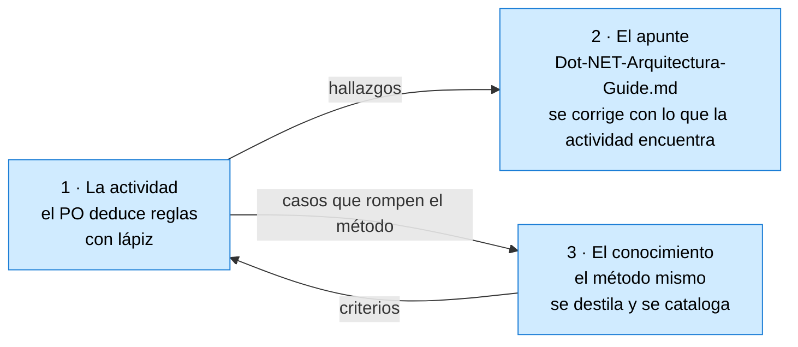

# Contexto completo del taller — reconstrucción desde cero

> **Para qué sirve este documento.** Si la sesión de trabajo se perdió, esto alcanza para retomar
> desde una sesión limpia sin preguntarle nada al PO. Leerlo entero y después
> [`ParaRetomar.md`](ParaRetomar.md), que dice en qué punto exacto quedó el trabajo.
>
> Fecha del corte: 2026-09-26.

---

## Índice

1. [Qué es esto y quién es quién](#1-qué-es-esto-y-quién-es-quién)
2. [Los tres carriles](#2-los-tres-carriles)
3. [Mapa de archivos](#3-mapa-de-archivos)
4. [El caso: La Estancia «La Ana»](#4-el-caso-la-estancia-la-ana)
5. [El método, y cómo llegó a ser lo que es](#5-el-método-y-cómo-llegó-a-ser-lo-que-es)
6. [Las tesis del PO](#6-las-tesis-del-po)
7. [Decisiones tomadas](#7-decisiones-tomadas)
8. [Estado de cada cosa](#8-estado-de-cada-cosa)
9. [Cómo se trabaja acá](#9-cómo-se-trabaja-acá)
10. [Entorno y comandos](#10-entorno-y-comandos)

---

## 1. Qué es esto y quién es quién

Un **taller**. El PO —Fernando Filipuzzi, docente de Programación II en UTN FRP— es **el alumno**, y
el agente es **el moderador**. Se trabaja sobre una actividad real y se va construyendo el material
mientras se la hace.

El PO es además **el autor del enunciado que se analiza**, lo cual importa: cuando él aclara una
intención, eso es fuente de máximo peso y cierra la discusión.

Hay tres tipos de participantes:

| | Quién | Qué hace |
| --- | --- | --- |
| **PO / alumno** | Fernando | hace la actividad con lápiz, objeta, decide |
| **Moderador** | el agente principal | guía, verifica, despacha, consolida |
| **Especialistas** | subagentes | didáctica, edición bibliográfica, gramática, análisis de requisitos |
| **Mesa** | subagente conductor | dictamina lo que queda trabado. **Lo que decide queda aprobado** |

---

## 2. Los tres carriles

Corren en paralelo y se alimentan:



**El carril 3 es el que más creció**, y es el que el PO viene cuestionando: el aparato está en
~5100 líneas y él sostiene que eso es síntoma de un modelo que pide parches.

---

## 3. Mapa de archivos

Base A: `LAB/Lab-Documentos/Guides/Dot-NET-Arquitectura-Guide/`
Base B: `LAB/Lab-Documentos.Documentacion/PROMPTs/Guides/06-Crear-Dot-NET-Arquitectura-Guide/OUTPUTs/`

### Del PO — **no se escriben** salvo pedido explícito

| Archivo | Qué es |
| --- | --- |
| `A: Interactive-Activities/docs/Actividad-1-Deduciendo-Reglas-Negocios.md` | su cuaderno de trabajo |
| `A: Interactive-Activities/docs/Mis-Notas.md` | sus notas (78 KB) |
| `A: Exercices/` | su taller de práctica |

### Del taller

| Archivo | Qué es |
| --- | --- |
| `A: Dot-NET-Arquitectura-Guide.md` | **el apunte**, v2.5.0, 2944 líneas. La obra principal |
| `A: Dot-NET-Arquiectura-Interactive-Guide.md` | la guía de la actividad, v0.4.0, 815 líneas |
| `A: Interactive-Activities/` | la solución `LaEstancia` + `docs/` |
| `A: Interactive-Activities/docs/Temas.md` | temario de las cuatro actividades |
| `A: Examples/Dot-NET-Arquitectura-Lab/` | el laboratorio del apunte (MyProject, capturas) |

### El conocimiento — base B, `Conocimientos/`

| Archivo | Líneas | Qué es |
| --- | --- | --- |
| `Knowledge-Deduccion-De-Reglas-De-Negocio.md` | 600 | **el método**. En su techo de formato |
| `Knowledge-Icono-Y-Ancla.md` | 266 | cómo se entrega una definición |
| `02-Criterio-De-Segmentacion.md` | 925 | el paso 1: dónde corta el texto |
| `03-Catalogo-De-Etiquetas.md` | 1578 | el paso 2: las ocho etiquetas. Hoja de bolsillo al frente |
| `04-Afirmacion-Distribuida-Y-Modificadores.md` | 2053 | el último dictamen. **37 parches sin aplicar** |
| `00-Dictamen-Diseno-De-Roles.md` · `01-Cuerpo-Metodologico.md` | | los insumos del método |

### Evidencia y actas — base B

| Archivo | Qué es |
| --- | --- |
| `Bitacora-Editores/09-Fuente-Actividad-La-Estancia.md` | **el enunciado transcrito**. Fuente secundaria: ante la duda, el original |
| `Bitacora-Editores/10-Relectura-De-Intencion.md` | la relectura de las 18 reglas con triple lectura |
| `Bitacora-Editores/07-…-Didactica.md` · `08-Dictamen-Editorial.md` | análisis didáctico y editorial |
| `Mesa/04-Acta-Actividad-Interactiva.md` | seis cuestiones: jerarquías, Repository, RN-13, escalera §9.2 |
| `Mesa/05-Acta-Catalogo-De-Etiquetas.md` | `L` rechazada, marcas, formato, generalización a modificadores |
| `Mesa/06-Acta-Replanteo-Del-Modelo.md` | **en curso** |

### Fuente primaria

- El enunciado original: Google Drive `1A80sKyEk1XlnOwxRyiZPeMgw3y6nYZrd`
  (`actividad3.3_iterfaces_clases_abstractas.docx`), del PO.
- La versión de escritorio ya resuelta: `PROG2/2026/dev/tup_prog_2_2026_actividad3.3/` — **sólo
  lectura**, HEAD `80c003b`. WinForms, `net9.0-windows7.0`, un proyecto.

---

## 4. El caso: La Estancia «La Ana»

Actividad Integradora 3.3 de Programación II, UTN FRP 2026. Su eje original es **jerarquía de clases:
interfaces y clases abstractas**. El eje del apunte es la regla de dependencia. **El material está en
el cruce.**

Dominio: Estancia → Campos → Parcelas; Actividades productivas (Agrícola; Ganadera abstracta con
Cría, Recría, Invernada) a las que se asignan parcelas como lotes; Casco y Puesto como instalaciones,
declarados fuera de alcance. 15 casos de uso, 18 reglas numeradas RN-01..RN-18.

### La medición que ordena todo

En la versión de escritorio, dónde vive hoy cada regla:

| Domicilio | Cuántas |
| --- | --- |
| Dominio ✅ | 11 |
| Duplicada dominio + vista | 3 |
| **Sólo en la vista** ❌ | **3** — RN-09 (`FormPrincipal.cs` l. 553), RN-10 (l. 337), RN-14 (l. 396-419) |
| Sin implementar | 1 — RN-13 |

**Las tres que se filtraron necesitan algo que ningún objeto tiene a mano.** De ahí la tesis del
taller:

> La capa `Application` no aparece porque el modelo sea anémico —el del PO no lo es—. Aparece porque
> hay reglas que no caben en ningún objeto y hoy viven en el único lugar que los ve a todos: el
> formulario. Y el día que hay un segundo cliente, esas reglas no viajan.

Contraste que lo prueba: el informe (CU-15) cruza el HTTP gratis porque no pregunta por el tipo; el
cierre (CU-14) no cruza porque decide con `is` en la vista.

---

## 5. El método, y cómo llegó a ser lo que es

### El procedimiento en cinco pasos

| Paso | Qué se hace |
| --- | --- |
| **0** | numerar las oraciones |
| **1** | cortar en afirmaciones — corta donde hay predicado propio; lo que no corta se registra como calificador |
| **2** | etiquetar cada fragmento, **rápido y sucio**, cinco segundos |
| **3** | volcar en **tres tablas**: términos, actos, reglas |
| **4** | llenarlas **en ese orden** y no volver atrás |

Las ocho etiquetas: `T` término · `A` atributo · `V` acto · `C` cardinalidad · `M` momento ·
`R` regla · `E` alcance · `?` no se decide. Más las marcas `°` (segunda mención), `⟦ ⟧`
(restituido por el analista), `⟦?⟧` (no se pudo reponer: hallazgo), `X/Y` (dos etiquetas), `!` (vino
mal cortado). **No hay novena letra**: la liga va como `R(estructura)`.

### Los dos modos de falla, que son el corazón del asunto

| | Literalismo | Pasividad |
| --- | --- | --- |
| Qué produce | reglas reescritas, fuente sustituida | catálogo correcto y **vacío de hallazgos** |
| Se ve | comparando con la fuente | **no se ve**: todo lo que dice está bien |
| Se corrige con | disciplina de rotulado | obligaciones de búsqueda |

**El literalismo es el modo de falla de «no inventar».** El caso fundacional: el enunciado decía que
la suma de las parcelas debía ser «coherente» con la superficie; se detectó que no era verificable y
**se propuso otra regla** en vez de recuperar que el autor quiso decir «igual».

De ahí la regla que gobierna todo:

> **Máxima iniciativa para averiguar y proponer. Cero autoridad sobre la fuente.**

Y la disciplina que la hace posible: **nunca colapsar `Letra` / `Intención` / `Propuesta`.**

### Las taxonomías

- **Especie**: restricción · derivación · alcance · estructura.
- **Momento**: *Invariant* · *Precondition* · **condición de completitud** · ninguno. Prueba: *¿vale
  en el instante en que el objeto nace?*
- **Dueño**: qué objeto tiene los datos. **«Ninguno en el dominio» es resultado, no fracaso.**

### La escalera de diagnóstico, y el orden importa

| # | Diagnóstico | Cómo se resuelve |
| --- | --- | --- |
| 1 | **ambigüedad de expresión** | leyendo bien |
| 2 | **incompletitud** | nombrando la premisa faltante |
| 3 | **contradicción** | el autor corrige |

Prueba: *¿puedo construir un caso donde las dos afirmaciones sean verdaderas?* Si puedo, es 2.
**Prohibido saltar al 3.**

---

## 6. Las tesis del PO

Salieron de la conversación y son las piezas más valiosas del método. **Se le pasan a los
especialistas numeradas y separadas.**

| # | Tesis |
| --- | --- |
| **PO-1** | el modelo es pobre y pide parches; si los datos son más diversos de lo que pensó, hace aguas |
| **PO-2** | el supuesto que falla: **el fragmento atómico no es la unidad de sentido**. Diez parches, cinco son el mismo |
| **PO-3** | la búsqueda no es combinatoria sino **por referencia**: agrupar, contrastar, apartar, cerrar |
| **PO-4** | lo mecánico es determinista; la inteligencia natural no, pero es **exacta dentro de la información que tiene** |
| **PO-5** | describir por **caras** es técnica del autor. Varias vistas son técnica cuando el objeto está nombrado, **síntoma cuando no** |
| **PO-6** | la **redundancia es corrección de errores**, y es lo que vuelve *detectable* la ambigüedad |

Dos corolarios que quedaron:

- **El autor distribuye; el lector tiene que intersecar.** El método fallaba porque suponía un autor
  que no existe.
- **Una cara agrega una dimensión; un eco repite una.** No toda repetición es cara.

### El contra-argumento del gramático, que hay que pesar

> **La corrección no es abrir lecturas: es dejar de tirarlas.** El procedimiento ya produce la lista
> de lugares indecisos —los `?` y cada decisión tomada por indicio derrotable— y sólo hay que dejar de
> descartarla. `P0–P11` no cambian.

Con eso, los cinco parches repetidos caen como consecuencia **sin re-arquitectura**. La formulación
que quedó: **el modelo no era pobre, era con pérdida.**

### El criterio de aceptación del PO, que no se negocia

> Después de la decisión, **cada parche tiene que caer como consecuencia del modelo o desaparecer**.
> Si siguen haciendo falta como excepciones, la decisión fue la equivocada.

---

## 7. Decisiones tomadas

### Sobre el caso

| | Decisión |
| --- | --- |
| RN-13 | **el autor corrigió la fuente**: la asignación de parcelas es posterior al alta, y son una o más. No es *Invariant* del alta |
| RN-08 | la intención es **igualdad**, no «no supera». Pero no es *Invariant*: es **condición de completitud que nadie verifica** |
| Persistencia | **SQLite**, EF Core 10.0.12 |
| Cardinalidad campo→parcela | `0..*`: un campo se incorpora sin parcelas |
| Agregado | **`Estancia` es la raíz**; `Campo` y `Parcela` viven adentro. `Parcela` y `Campo.CrearParcela` van `internal`. Un solo `IEstanciaRepository` |
| `Instalacion` como clase base | **no**: heredar para compartir un `string` es el ❌ de §3.9 |
| Carpetas del dominio | agrupan por **agregado**, no por entidad |

### Sobre el apunte (acta 04)

Ganó **§3.9 «¿Cuándo una jerarquía de tipos es la respuesta?»** —el hueco mayor: `herencia`,
`polimorf`, `jerarqu`, `Liskov` daban **0** en 2817 líneas—, la divergencia con Martin sobre dónde
vive la interfaz del Repository declarada en §2.1, el caso RN-13 como ejercicio en §9.7, la fila E-E
en §9.1, y la corrección de §5.6 (el 400 lo produce el enlace de parámetros, no `[ApiController]`).
Quedó en **v2.5.0**.

### Sobre el catálogo (acta 05)

`L` no se adopta —ocho letras, la liga va como `R(estructura)`—; las marcas se adoptan con `V°`
retirado; la hoja de bolsillo va primero; la jerarquía de indicios se generaliza a **todo
modificador** con el indicio del determinante corregido a **unidireccional** (el indefinido no prueba
nada); el umbral numérico del `?` no se adopta.

---

## 8. Estado de cada cosa

| | Estado |
| --- | --- |
| Actividad 1, párrafo I | **fragmentado, etiquetado y tabulado**. Tres deudas — ver `ParaRetomar.md` |
| Actividad 1, párrafos II a IV | sin empezar |
| Apunte | v2.5.0, 2944 líneas, 0 anclas rotas, 8 diagramas válidos |
| Guía interactiva | v0.4.0, 815 líneas |
| Solución `LaEstancia` | compila. Un proyecto: `src/LaEstancia.WebAPI`, net10.0, OpenAPI + Scalar + EF Core SQLite. **El dominio lo escribe el PO** |
| Mesa 06, replanteo | **corriendo** |
| 37 parches de `04` | **sin aplicar, a la espera de la mesa 06** |
| C-4 del acta 04 | pendiente: requiere regenerar `capturas/L08-esqueleto.txt` |
| Deudas bibliográficas | Liskov y Wing 1994 y el texto literal de Martin 2017, sin cotejar |

---

## 9. Cómo se trabaja acá

Reglas que rigen y que no hay que volver a descubrir:

1. **Los cuadernos del PO no se tocan.** `Interactive-Activities/docs/Actividad-1-*` y `Mis-Notas.md`
   son de él. `Temas.md`, `ParaRetomar.md` y `Contexto.md` los pidió expresamente.
2. **`IA/SDD/IA.SDD` no se modifica.** Leer sí.
3. **`PROG2/` es sólo lectura.**
4. **Lo que se razona en la conversación se les pasa a los especialistas**, con las tesis separadas y
   numeradas, sin esperar a que lo pida. Si el aporte es del PO, decirlo.
5. **La mesa decide y queda aprobado.** Ante una duda que traba, mesa con propuesta.
6. **Toda afirmación con evidencia verificable**, y anclada a la **fuente primaria**, no a una
   transcripción. Ya falló una vez.
7. **No se cita lo que no se cotejó.** Lo no verificado va rotulado «criterio propio».
8. **Verificar lo que entregan los subagentes** antes de pasarlo al PO. Han fundado P0 en premisas
   falsas; una mesa se sacó cuatro cargos propios al verificarlos.
9. Los documentos de conocimiento cumplen `Rules-Base-Conocimiento.md` 2.2: once campos de cabecera,
   §0 a §10, techo de **600 líneas** para naturaleza `propio`.

---

## 10. Entorno y comandos

**No hay `dotnet` en el host.** Todo por contenedor:

```bash
cd LAB/Lab-Documentos/Guides/Dot-NET-Arquitectura-Guide/Interactive-Activities
docker run --rm --user "$(id -u):$(id -g)" \
  -e HOME=/tmp/home -e DOTNET_CLI_HOME=/tmp/home -e DOTNET_NOLOGO=1 \
  -v "$PWD":/w -w /w mcr.microsoft.com/dotnet/sdk:10.0 \
  bash -c 'mkdir -p /tmp/home && dotnet build LaEstancia.slnx'
```

La API escucha en `5250`; Scalar en `/scalar/` (hay un 302 desde `/scalar`).

**Validador de mermaid** (se usa en cada documento con diagramas): `npm i mermaid jsdom` en el
scratchpad y un script que corre `mermaid.parse` sobre cada bloque. **El slug de las anclas debe
imitar a GitHub**: sólo alfanuméricos, espacios y guiones — conservar `°` o guiones largos da falsos
positivos.

**Git**: dos repos, `Lab-Documentos` y `Lab-Documentos.Documentacion`, remoto `hdcm-dev`. Credencial
por descriptor (ver memoria `git-credencial-por-repo`). **Stagear explícito, nunca `git add -A`.**
