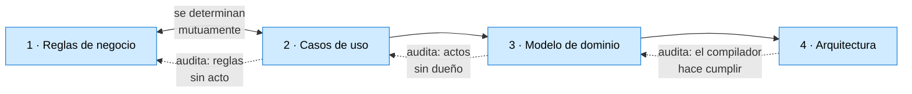

# Taller: del requerimiento a la arquitectura

Un taller que recorre **un solo camino**, sobre **un solo caso**: de un documento de requerimientos
escrito en prosa hasta una solución .NET en capas que el compilador sostiene.

El caso es la estancia «La Ana», una actividad de cátedra real que ya fue resuelta una vez con una
aplicación de escritorio. No se cambia de dominio en el medio, y no se inventa nada para que el
ejemplo cierre: lo que el enunciado dice es lo que hay que poder hacer, y lo que no dice es material
de trabajo.

---

## 1. Qué es esto, y qué no

| Es | No es |
| --- | --- |
| Un recorrido que se **hace**, no que se lee | Un apunte teórico |
| Cuatro actividades con entregable verificable | Cuatro capítulos |
| El banco de pruebas de la guía de arquitectura | Un resumen de la guía |
| Un documento que crece mientras se trabaja | Un documento cerrado |

Cuando la actividad muestra que la guía dice algo que no se sostiene, o que calla algo que hace
falta, **eso vuelve a la guía**. Ya pasó varias veces.

## 2. Cómo está organizado

```text
Interactive-Activities/
├── README.md              ← este documento: encuadre y temario
├── Actividades/           las cuatro actividades, una por archivo
├── Contextos/             cómo retomar el trabajo: desde cero o en caliente
├── Apuntes-Borradores/    notas de trabajo, sin pulir
└── LaEstancia/            la solución .NET que se va construyendo
```

---

## 3. Bajo qué se encuadra

Los cuatro segmentos **no son una disciplina: son dos**, y el corte cae en el medio del tercero.

| Segmento | Disciplina |
| --- | --- |
| 1 · Reglas de negocio | **Análisis** de requisitos |
| 2 · Casos de uso | **Análisis** de requisitos, lado funcional |
| 3 · Modelo de dominio | **empieza análisis y termina diseño** |
| 4 · Arquitectura | **Diseño** |

El paraguas que los cubre se llama, clásicamente, **análisis y diseño de software**; y el camino
específico —de un enunciado a un modelo de objetos, y de ahí a capas— es el del **análisis y diseño
orientado a objetos**, que es exactamente el arco que recorre Larman
([Larman, 2004](#referencias)): requisitos evolutivos y casos de uso, modelado del dominio, diseño
por responsabilidades y arquitecturas en capas.

> **Por qué el taller no se titula «OOAD».** El nombre arrastra UML, y UML no es lo que acá se
> enseña. «Del requerimiento a la arquitectura» describe lo que se hace y no promete un aparato que
> no se va a usar. **Criterio de este taller.**

### 3.1 Por qué el tercer segmento se parte al medio

Un modelo de dominio puede ser dos cosas distintas, y conviene no confundirlas:

| | Qué es | Disciplina |
| --- | --- | --- |
| **Modelo conceptual** | qué conceptos existen y cómo se relacionan | **análisis**: describe el problema |
| **Modelo de diseño** | con invariantes, agregados, fábricas, constructores `internal` | **diseño**: decide la solución |

La actividad 3 arranca en el primero y termina en el segundo. **Ése es el punto exacto donde se deja
de describir el negocio y se empieza a comprometerse con una solución**, y por eso está señalado: es
la frontera que más se cruza sin darse cuenta.

### 3.2 Una distinción que le sirve a quien aprende

**El segmento 1 es neutral al paradigma. El 3 y el 4 no lo son.**

Deducir reglas de negocio de un documento de requerimientos se hace igual si después se va a objetos,
a programación funcional o a un motor de reglas. El vocabulario, los actos, las restricciones y sus
momentos son **del problema**, no de la solución.

En cambio «entidad», «value object», «agregado» y «capas» ya son compromisos tomados. Recién ahí se
eligió.

Decirlo explícito evita el malentendido más común: creer que las reglas de negocio «son de la
programación orientada a objetos».

### 3.3 De dónde viene lo que se hace en el paso 1

El sistema de etiquetas del taller —`T` término, `V` acto, `A` atributo— tiene un antepasado
identificable: el análisis de sustantivos y verbos sobre texto en lenguaje natural. Abbott lo
formuló en 1983 y su técnica «muestra cómo derivar **tipos de datos de los sustantivos comunes**,
variables de las referencias directas, **operadores de los verbos** y de los atributos, y estructuras
de control de sus equivalentes en inglés» ([Abbott, 1983](#referencias)). Los métodos orientados a
objetos de los años siguientes lo incorporaron como paso de arranque.

Y hay una debilidad conocida en esa técnica cuando se aplica sola: **extraer sustantivos de forma
ingenua produce modelos pobres**, porque el texto natural nombra cosas que no son objetos, omite las
que sí lo son, y usa la misma palabra para dos conceptos distintos. *(Esta objeción es **criterio de
este taller**: no se cotejó contra una fuente que la formule así.)*

Lo que el taller agrega ataca exactamente esa debilidad:

| Lo que el taller agrega | Qué defecto del método ingenuo corrige |
| --- | --- |
| El glosario **antes** que las reglas | la misma palabra con dos sentidos |
| Letra / intención / propuesta, separadas | el analista que sustituye la fuente |
| Especie, momento y dueño | el sustantivo que no es un objeto |
| Buscar lo que el texto **no** dice | la regla que se hace cumplir y nadie escribió |
| Las caras y la triangulación | el texto que dice una cosa en tres lugares |

No se trata de aplicar Abbott: se trata de hacer lo que hay que hacer **porque Abbott solo no
alcanza**.

---

## 4. El hilo de las cuatro actividades

Cada actividad produce un entregable, y **cada entregable audita al anterior**. Eso es lo que las
hace actividades y no capítulos: de cada una se puede decir si salió bien, y el juez es la siguiente.



---

## Actividad 1 — Deducir las reglas de negocio

**Entrada:** el documento de requerimientos, en prosa.
**Salida:** tres tablas —términos, actos, reglas— y el cuestionario para el autor.

| # | Tema | Qué se aprende |
| --- | --- | --- |
| 1.1 | Qué es una regla de negocio | la prueba del papel; qué no es regla |
| 1.2 | **El vocabulario va antes que las reglas** | términos, unidades, ámbito. El paso que todos se saltean |
| 1.3 | Segmentar el texto | dónde corta y dónde no; los falsos cortes y las falsas uniones |
| 1.4 | Etiquetar los fragmentos | las ocho etiquetas, rápido y sin deliberar |
| 1.5 | Las tres tablas y el orden | por qué términos, después actos, después reglas |
| 1.6 | Especie, momento y dueño | restricción / derivación / alcance / estructura · invariante / precondición / completitud |
| 1.7 | Letra, intención y propuesta | las tres lecturas, separadas y rotuladas |
| 1.8 | Lo que el texto no dice | reglas no escritas, huecos de proceso, silencios de alcance |
| 1.9 | Inconsistencias | término con dos sentidos, concepto con dos nombres, invariante que el flujo no sostiene |
| 1.10 | La redundancia del autor | reafirmación, contraste, caras de una misma cosa; triangular en vez de descartar |

**Estado:** en curso. Párrafo I completo.

---

## Actividad 2 — Deducir los casos de uso

**Entrada:** las tres tablas de la actividad 1.
**Salida:** los casos de uso con sus precondiciones y postcondiciones, cruzados contra las reglas.

| # | Tema | Qué se aprende |
| --- | --- | --- |
| 2.1 | Qué es un caso de uso y qué no | acto del negocio contra paso de la aplicación |
| 2.2 | Actor, disparador, flujo, alternativas | y por qué el «se» impersonal deja el actor vacío |
| 2.3 | **Precondición y postcondición** | de dónde salen: de la columna `Momento` de la actividad 1 |
| 2.4 | El cruce regla × caso de uso | cada regla cae sobre un acto, o es un hueco |
| 2.5 | **Los huecos que aparecen al cruzar** | la regla sin acto pide un caso de uso que no existe |
| 2.6 | Alcance | lo declarado afuera, y el silencio que no se declaró |

> **Ida y vuelta con la actividad 1.** No es una etapa posterior: es la otra mitad. Las reglas dicen
> qué actos tienen que existir; los casos de uso dicen qué reglas se quedaron sin casa. En el párrafo I
> el hallazgo mayor —un dato que ningún acto puede cargar— salió recién al cruzar las dos.

---

## Actividad 3 — Diseñar el modelo de dominio

**Entrada:** reglas y casos de uso.
**Salida:** el diagrama de clases, con **cada regla ubicada en un objeto**.

Es el escalón que suele saltarse, y por eso está aparte: acá las reglas se vuelven objetos. No hay
capas todavía, no hay proyectos, no hay base de datos.

| # | Tema | Qué se aprende | Apunte |
| --- | --- | --- | --- |
| 3.1 | Entity y Value Object | identidad contra valor | §3.1 |
| 3.2 | Dónde vive cada regla | la regla va al objeto que tiene los datos para decidirla | §3.6 |
| 3.3 | **La regla que no cabe en ningún objeto** | la que mira a las demás instancias; por qué termina afuera | §3.6, §9.6 |
| 3.4 | Invariante o precondición, en código | qué se verifica al crear y qué antes de un método | §3.7 |
| 3.5 | Aggregate y raíz | quién hace cumplir lo que ningún objeto suelto alcanza | §4.10 |
| 3.6 | **Cuándo una jerarquía de tipos es la respuesta** | y cuándo heredar es un error | §3.9 |
| 3.7 | Cada objeto responde una pregunta | los siete tipos de objeto | §7 |
| 3.8 | Fábricas | por qué el constructor público no alcanza | §3.3 |

---

## Actividad 4 — Implementar la arquitectura

**Entrada:** el modelo de dominio.
**Salida:** la solución en capas, compilando, con la separación **hecha cumplir por el compilador**.

Es la más grande de las cuatro y ya tiene su hoja de ruta: los hitos **A0 a A9** de la guía
interactiva.

| # | Tema | Hito |
| --- | --- | --- |
| 4.1 | Medir la línea de base | A0 |
| 4.2 | El modelo detrás de HTTP, sin tocarlo | A1 |
| 4.3 | Identidad: el índice no sobrevive a una petición | A2 |
| 4.4 | **Nace `Application`**: las reglas que no caben en el dominio | A3 |
| 4.5 | `Domain` como proyecto aparte, y el `CS0234` | A4 |
| 4.6 | Publicar una jerarquía: el polimorfismo no viaja | A5 |
| 4.7 | Del `double` al Value Object | A6 |
| 4.8 | Persistir una jerarquía | A7 |
| 4.9 | `Contracts` y el cliente | A8 |
| 4.10 | **La Tarea 2 en los dos mundos, y contar** | A9 |

> Por tamaño, es candidata a partirse en dos: **4a, el backend en capas** (A0–A7) y **4b, clientes y
> contratos** (A8–A9). Decisión del PO.

---

## Lo que queda fuera del taller, y conviene decirlo

| Tema | Por qué |
| --- | --- |
| Pruebas automatizadas como tema propio | atraviesa las cuatro; se ejercita en cada hito, no se enseña aparte |
| Persistencia y base de datos | entra sólo como mecanismo, en 4.8 |
| Despliegue, CI, seguridad | otros documentos de la guía |
| Elicitación con personas | el taller parte de **un documento ya escrito** |
| Notación UML como tema | se usa lo que haga falta para entenderse, no se enseña el estándar |

---

## Referencias

Se citan sólo las fuentes cotejadas. Lo que es criterio propio del taller está rotulado como tal en
el cuerpo del documento.

<a id="referencias"></a>

- **Abbott, R. J. (1983).** *Program Design by Informal English Descriptions.* Communications of the
  ACM, 26(11), noviembre de 1983, pp. 882–894.
  [cacm.acm.org](https://cacm.acm.org/issue/november-1983/) · *(consultado el 2026-09-28)*
- **Larman, C. (2004).** *Applying UML and Patterns: An Introduction to Object-Oriented Analysis and
  Design and Iterative Development*, 3.ª ed. Prentice Hall. Cubre requisitos evolutivos y casos de
  uso, modelado de objetos del dominio, diseño por responsabilidades y arquitecturas en capas.
  [dl.acm.org](https://dl.acm.org/doi/10.5555/1044919) · *(consultado el 2026-09-28)*
- **Booch, G. (1994).** *Object-Oriented Analysis and Design with Applications*, 2.ª ed. Benjamin
  Cummings. *(Se nombra por dar su nombre al método; la atribución de la técnica de sustantivos y
  verbos a esta obra **no se cotejó**.)*

---

## Control de cambios

| Fecha | Cambios |
| --- | --- |
| 2026-09-28 | Prólogo: qué es el taller, cómo está organizado, bajo qué disciplina se encuadra, dónde se parte el tercer segmento y de dónde viene el paso 1. Referencias cotejadas. |
| 2026-09-26 | Temario inicial. Cuatro actividades sobre la propuesta de tres: se separa el modelo de dominio de la arquitectura, y se declara la ida y vuelta entre 1 y 2. |
