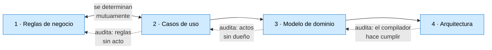

# Temario del taller

> Borrador para que el PO lo tome y lo edite. Cuatro actividades, no tres.
> Fecha: 2026-09-26.

---

## El hilo

El taller recorre **un solo camino**: del documento de requerimientos hasta la solución en capas,
sobre el mismo caso —La Estancia «La Ana»—, sin cambiar de dominio en el medio.

Cada actividad produce un entregable, y **cada entregable audita al anterior**. Eso es lo que las
hace actividades y no capítulos: se puede decir si salieron bien.

---

## Actividad 1 — Deducir las reglas de negocio

**Entrada:** el documento de requerimientos, en prosa.
**Salida:** tres tablas —términos, actos, reglas— y el cuestionario para el autor.

| # | Tema | Qué se aprende |
| --- | --- | --- |
| 1.1 | Qué es una regla de negocio | la prueba del papel; qué no es regla |
| 1.2 | **El vocabulario va antes que las reglas** | términos, unidades, ámbito. El paso que todos se saltean |
| 1.3 | Segmentar el texto | dónde corta y dónde no; los falsos cortes y las falsas uniones |
| 1.4 | Etiquetar los fragmentos | las ocho etiquetas, rápido y sin deliberar |
| 1.5 | Las tres tablas y el orden | por qué términos, después actos, después reglas |
| 1.6 | Especie, momento y dueño | restricción / derivación / alcance / estructura · invariante / precondición / completitud |
| 1.7 | Letra, intención y propuesta | las tres lecturas, separadas y rotuladas |
| 1.8 | Lo que el texto no dice | reglas no escritas, huecos de proceso, silencios de alcance |
| 1.9 | Inconsistencias | término con dos sentidos, concepto con dos nombres, invariante que el flujo no sostiene |
| 1.10 | La redundancia del autor | reafirmación, contraste, caras de una misma cosa; triangular en vez de descartar |

**Estado:** en curso. Párrafo I completo.

---

## Actividad 2 — Los casos de uso

**Entrada:** las tres tablas de la actividad 1.
**Salida:** los casos de uso con sus precondiciones y postcondiciones, cruzados contra las reglas.

| # | Tema | Qué se aprende |
| --- | --- | --- |
| 2.1 | Qué es un caso de uso y qué no | acto del negocio contra paso de la aplicación |
| 2.2 | Actor, disparador, flujo, alternativas | y por qué el «se» impersonal deja el actor vacío |
| 2.3 | **Precondición y postcondición** | de dónde salen: de la columna `Momento` de la actividad 1 |
| 2.4 | El cruce regla × caso de uso | cada regla cae sobre un acto, o es un hueco |
| 2.5 | **Los huecos que aparecen al cruzar** | la regla sin acto pide un caso de uso que no existe |
| 2.6 | Alcance | lo declarado afuera, y el silencio que no se declaró |

> **Ida y vuelta con la actividad 1.** No es una etapa posterior: es la otra mitad. Las reglas dicen
> qué actos tienen que existir; los casos de uso dicen qué reglas se quedaron sin casa. En el párrafo I
> el hallazgo mayor —un dato que ningún acto puede cargar— salió recién al cruzar las dos.

---

## Actividad 3 — El modelo de dominio

**Entrada:** reglas y casos de uso.
**Salida:** el diagrama de clases, con **cada regla ubicada en un objeto**.

Es el escalón que suele saltarse, y por eso está aparte: acá las reglas se vuelven objetos. No hay
capas todavía, no hay proyectos, no hay base de datos.

| # | Tema | Qué se aprende | Apunte |
| --- | --- | --- | --- |
| 3.1 | Entity y Value Object | identidad contra valor | §3.1 |
| 3.2 | Dónde vive cada regla | la regla va al objeto que tiene los datos para decidirla | §3.6 |
| 3.3 | **La regla que no cabe en ningún objeto** | la que mira a las demás instancias; por qué termina afuera | §3.6, §9.6 |
| 3.4 | Invariante o precondición, en código | qué se verifica al crear y qué antes de un método | §3.7 |
| 3.5 | Aggregate y raíz | quién hace cumplir lo que ningún objeto suelto alcanza | §4.10 |
| 3.6 | **Cuándo una jerarquía de tipos es la respuesta** | y cuándo heredar es un error | §3.9 |
| 3.7 | Cada objeto responde una pregunta | los siete tipos de objeto | §7 |
| 3.8 | Fábricas | por qué el constructor público no alcanza | §3.3 |

---

## Actividad 4 — La arquitectura

**Entrada:** el modelo de dominio.
**Salida:** la solución en capas, compilando, con la separación **hecha cumplir por el compilador**.

Es la más grande de las cuatro y ya tiene su hoja de ruta: los hitos **A0 a A9** de la guía
interactiva.

| # | Tema | Hito |
| --- | --- | --- |
| 4.1 | Medir la línea de base | A0 |
| 4.2 | El modelo detrás de HTTP, sin tocarlo | A1 |
| 4.3 | Identidad: el índice no sobrevive a una petición | A2 |
| 4.4 | **Nace `Application`**: las reglas que no caben en el dominio | A3 |
| 4.5 | `Domain` como proyecto aparte, y el `CS0234` | A4 |
| 4.6 | Publicar una jerarquía: el polimorfismo no viaja | A5 |
| 4.7 | Del `double` al Value Object | A6 |
| 4.8 | Persistir una jerarquía | A7 |
| 4.9 | `Contracts` y el cliente | A8 |
| 4.10 | **La Tarea 2 en los dos mundos, y contar** | A9 |

> Por tamaño, es candidata a partirse en dos: **4a, el backend en capas** (A0–A7) y **4b, clientes y
> contratos** (A8–A9). Decisión del PO.

---

## Lo que queda fuera del taller, y conviene decirlo

| Tema | Por qué |
| --- | --- |
| Pruebas automatizadas como tema propio | atraviesa las cuatro; se ejercita en cada hito, no se enseña aparte |
| Persistencia y base de datos | entra sólo como mecanismo, en 4.8 |
| Despliegue, CI, seguridad | otros documentos de la guía |
| Elicitación con personas | el taller parte de **un documento ya escrito** |

---

## Control de cambios

| Fecha | Cambios |
| --- | --- |
| 2026-09-26 | Borrador inicial. Cuatro actividades sobre la propuesta de tres: se separa el modelo de dominio de la arquitectura, y se declara la ida y vuelta entre 1 y 2. |
