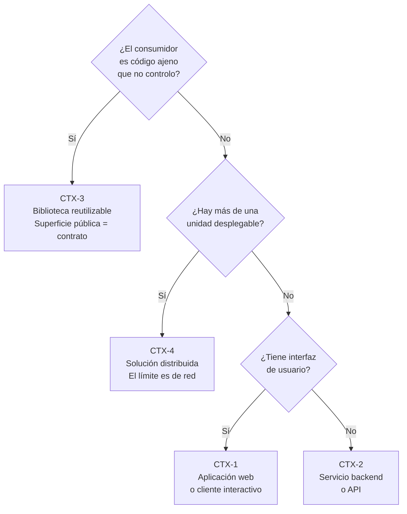

# Contextos — `MARCO-CONTEXTOS`

## Resumen ejecutivo

Un mismo escenario admite respuestas distintas según qué se esté construyendo. La regla «los nombres públicos no se cambian» es una recomendación tibia en una aplicación interna y una obligación estricta en una biblioteca publicada en NuGet, porque en el segundo caso el renombre rompe compilaciones ajenas que uno no controla.

Los cuatro contextos de esta guía separan esas situaciones. Se distinguen por una pregunta: **quién consume lo que estoy escribiendo y cuánto control tengo sobre ese consumidor.**

---

## Los cuatro contextos

---

## `CTX-1` — Aplicación web o cliente interactivo

Sistemas con interfaz de usuario: Blazor —Server o WebAssembly—, ASP.NET Core MVC, Razor Pages, .NET MAUI, o una SPA acompañada de su API.

Lo que caracteriza a este contexto es la presencia de **artefactos que no son código C#** y que tienen sus propias convenciones de nombre: componentes `.razor`, vistas `.cshtml`, hojas de estilo, recursos estáticos en `wwwroot`. La organización tiene que acomodar dos ejes simultáneos —el de la lógica y el de la presentación— y la tentación habitual es dejar que el eje de presentación imponga su estructura al resto.

El patrón de nombrado de componentes merece atención especial porque no lo cubren las guías generales de .NET. Un componente Blazor es una clase, de modo que sigue PascalCase, pero el nombre de archivo y el nombre del tipo deben coincidir exactamente: el compilador genera la clase a partir del archivo. Los detalles en [`TEM-NOMB`](../40-Nomenclatura/Nombrado-de-Tipos-y-Miembros.md).

**Lo que cambia respecto de otros contextos.** La frontera entre presentación y lógica se cruza con facilidad y sin que nada la vigile: un componente puede inyectar un `DbContext` y consultar la base directamente, y compila igual. Ese es el motivo por el que este contexto se beneficia más que ningún otro de una separación explícita, aunque sea en carpetas ([`TEM-CVP`](../30-Organizacion-Interna/Carpetas-o-Proyectos.md)).

**Ejemplo (sintético).** El sistema de reserva de salas que recorre esta guía es `CTX-1` con render *interactive server*: la superficie de UI vive en `Components/` —`ListaSalas.razor`, `FormularioReserva.razor`— y las capas de lógica en `Dominio/`, `Aplicacion/` e `Infraestructura/`, todas dentro de un único proyecto `Microsoft.NET.Sdk.Web`. La separación es de carpetas, no de ensamblados, y nada impide que un componente inyecte el `DbContext`; lo que la sostiene es la revisión, no el compilador.

---

## `CTX-2` — Servicio backend o API

Sistemas sin interfaz propia: APIs HTTP, servicios de fondo (`Microsoft.NET.Sdk.Worker`), procesos de integración, *bots*, tareas programadas.

El consumidor es otro programa, y eso desplaza el peso de la nomenclatura desde el código hacia el contrato expuesto. Los nombres de rutas, de parámetros de consulta y de propiedades JSON siguen convenciones que **no son las de C#** —`kebab-case` en rutas, `camelCase` en JSON por el serializador predeterminado de `System.Text.Json`— y confundir ambos planos produce APIs con propiedades `PascalCase` que después nadie quiere cambiar porque hay clientes atados.

La otra particularidad es que un servicio sin UI suele tener un ciclo de vida gobernado por el *host*: `IHostedService`, `BackgroundService`, inyección de dependencias con ámbitos que no coinciden con el de una petición HTTP. La organización interna tiene que hacer visible dónde empieza y termina cada ámbito.

---

## `CTX-3` — Biblioteca reutilizable

Código empaquetado para que lo consuma otro código: un paquete NuGet, una biblioteca compartida entre soluciones de la organización, un SDK de cliente.

Es el contexto donde las convenciones dejan de ser preferencia y se vuelven contrato. Todo *tipo* y todo *miembro* marcado `public` forma parte de la superficie de la biblioteca, y modificarlo rompe a los consumidores en tiempo de compilación o —peor— en tiempo de ejecución si solo se recompiló una parte.

De ahí que este sea el único contexto donde las **Framework Design Guidelines** de Microsoft aplican en su sentido literal. Fueron escritas para el diseño de bibliotecas, no de aplicaciones, y esa distinción se pierde con frecuencia: una regla como «no uses campos públicos, usá propiedades» tiene una justificación fuerte en una biblioteca —cambiar un campo por una propiedad rompe la compatibilidad binaria— y una justificación mucho más débil en una clase interna de una aplicación que se compila entera cada vez.

**Lo que cambia.** Aparecen preocupaciones que no existen en los otros contextos: versionado semántico del paquete, política de cambios ruptores, análisis de compatibilidad de API, y una distinción rigurosa entre lo `public` y lo `internal` que en una aplicación se puede tratar con más soltura.

---

## `CTX-4` — Solución distribuida

Más de una unidad desplegable que se comunica por red: microservicios, una solución con varios servicios y una interfaz común, arquitecturas con mensajería.

El rasgo que lo define es que **los límites entre partes dejan de ser verificables por el compilador**. En los tres contextos anteriores, una dependencia mal puesta produce un error de compilación o al menos un aviso del analizador. Acá, una llamada HTTP a un servicio que no debería conocerse compila perfectamente y falla en producción, o peor, funciona y crea un acoplamiento que nadie registró.

Ese cambio de régimen es la razón por la que este contexto exige artefactos que los otros no necesitan: un registro explícito de qué servicio puede llamar a cuál, contratos versionados, y una política sobre datos compartidos. El desarrollo está en [`FAM-SRV`](../10-Arquitectura-de-Servicios/README.md).

Conviene una advertencia. La mayoría de los sistemas que se describen como `CTX-4` son en realidad `CTX-2` con más pasos: varios procesos desplegables que comparten una base de datos y que por eso no pueden desplegarse ni fallar de forma independiente. Ese arreglo tiene nombre —**monolito distribuido**— y acumula los costos de ambos modelos sin los beneficios de ninguno ([`TEM-MICRO`](../10-Arquitectura-de-Servicios/Microservicios.md)).

---

## Qué cambia según el contexto

| Dimensión | `CTX-1` Web/cliente | `CTX-2` Servicio/API | `CTX-3` Biblioteca | `CTX-4` Distribuida |
|-----------|---------------------|----------------------|--------------------|---------------------|
| Consumidor | Persona | Otro programa | Otro código, ajeno | Otro servicio, por red |
| Peso de la nomenclatura pública | Bajo | Medio (contrato HTTP/JSON) | **Máximo** (contrato binario) | Alto (contrato de mensajes) |
| Quién verifica los límites | Compilador | Compilador | Compilador + análisis de API | **Nadie automáticamente** |
| Guía de referencia dominante | Coding Conventions de C# | Coding Conventions + REST | **Framework Design Guidelines** | Contratos y versionado |
| Costo de un renombre | Bajo | Medio | **Ruptor** | Alto |

---

## Preguntas guía

1. ¿En qué contexto estoy, y estoy aplicando reglas pensadas para otro? La confusión más cara es aplicar las Framework Design Guidelines completas a una aplicación interna, que agrega ceremonia sin comprar compatibilidad.
2. ¿Qué parte de lo que escribo es contrato con alguien que no controlo?
3. Si es `CTX-4`: ¿los servicios comparten base de datos? Si la respuesta es sí, el contexto real es `CTX-2` y conviene tratarlo como tal.
4. ¿Los nombres del contrato externo —rutas, JSON, mensajes— siguen la convención de su medio, o se filtró la convención de C#?
