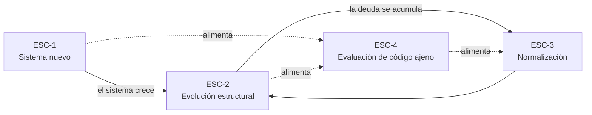

# Escenarios — `MARCO-ESCENARIOS`

## Resumen ejecutivo

Las decisiones sobre cómo organizar y escribir código no se toman en el vacío: se toman en cuatro situaciones reconocibles, y la misma pregunta admite respuestas distintas según cuál sea. «¿Conviene separar el dominio en su propio proyecto?» tiene una respuesta en un sistema que arranca y otra en uno que lleva tres años en producción con doscientos archivos ya escritos.

Este documento fija esas cuatro situaciones. Todo documento temático de la guía las recorre en su sección de aplicación, de modo que el lector pueda entrar por la que está viviendo en lugar de leer la guía completa.

---

## Los cuatro escenarios

El diagrama muestra algo que conviene tener presente desde el principio: `ESC-4` no es una etapa del ciclo de vida sino una actividad que se ejerce sobre los otros tres. Se evalúa código nuevo, código que crece y código que se está normalizando.

---

## `ESC-1` — Sistema nuevo

Arranca un sistema y no hay código previo que condicione. Se elige la estructura de la solución, la cantidad de proyectos, el modelo de despliegue y el conjunto de convenciones.

Es el escenario con más libertad y, por eso mismo, el que más decisiones irreversibles concentra en el momento de menor información. Quien decide todavía no conoce el dominio lo suficiente como para saber dónde van a caer los límites naturales del sistema, y sin embargo ya está eligiendo si habrá uno o siete proyectos.

El error característico no es elegir mal sino elegir demasiado. Un equipo que arranca con cuatro proyectos en capas, mensajería asíncrona y tres servicios desplegables independientes está pagando por adelantado una flexibilidad que todavía no necesita y que puede terminar necesitando en otro eje. La recomendación que atraviesa esta guía —y que se desarrolla en [`TEM-PART`](../10-Arquitectura-de-Servicios/Criterios-de-Particion.md)— es empezar por la estructura más simple que no impida evolucionar, no por la que anticipa todas las evoluciones posibles.

**Lo que se decide acá.** Modelo de despliegue ([`FAM-SRV`](../10-Arquitectura-de-Servicios/README.md)), estructura de la solución ([`TEM-SLN`](../20-Organizacion-de-Soluciones/Estructura-de-Solucion.md)), organización interna ([`TEM-CAPAS`](../30-Organizacion-Interna/Modelos-de-Capas.md)), y el conjunto de convenciones que van a regir, que conviene fijar el primer día porque después se negocia archivo por archivo.

**Lo que es barato revertir después.** Casi todo lo de estilo y nomenclatura: existen herramientas que reformatean y renombran mecánicamente ([`TEM-AUTO`](../50-Estilo-de-Codificacion/Automatizacion-del-Estilo.md)).

**Lo que es caro.** La partición en servicios desplegables. Unir dos servicios es trabajo; separar un monolito bien modularizado también, pero mucho menos que reunificar dos bases de datos que ya divergieron.

---

## `ESC-2` — Evolución estructural

El sistema existe, funciona y crece. La pregunta ya no es cómo organizarlo desde cero sino cuándo cambiar la organización que tiene: extraer un módulo a su propio proyecto, partir un servicio, introducir una capa que no existía, o resistir la presión de hacer cualquiera de esas cosas.

Se entra en este escenario por síntomas, no por calendario. Los tres que importan: el build se volvió lento y nadie sabe qué lo hace lento; dos partes del sistema que deberían ser independientes no pueden desplegarse por separado; o un cambio pequeño obliga a tocar archivos en cinco carpetas distintas.

Cada síntoma apunta a un remedio distinto, y confundirlos es la causa más frecuente de reorganizaciones que no mejoran nada. Un build lento rara vez se arregla partiendo el sistema en microservicios —se arregla con caché de compilación y menos proyectos, no más—. Un cambio que toca cinco carpetas suele indicar que las carpetas están organizadas por capa técnica cuando el sistema cambia por funcionalidad, y ese es un problema de organización interna ([`TEM-SLICE`](../30-Organizacion-Interna/Vertical-Slice.md)), no de despliegue.

**La decisión que define el escenario** es cuándo *no* reorganizar. Toda reorganización tiene costo cierto y beneficio incierto, y la que se hace por incomodidad estética en lugar de por un problema medible consume semanas sin mover ningún indicador.

---

## `ESC-3` — Normalización de código existente

Hay un código que funciona y que no cumple las convenciones: nombres inconsistentes, estilos de formato mezclados, capas que se saltan, proyectos con responsabilidades superpuestas. La tarea es llevarlo a una convención sin romperlo.

Lo distingue de `ESC-2` que acá no cambia la arquitectura, cambia la superficie. Y lo que lo hace difícil no es técnico sino social: la normalización produce diffs enormes que sepultan los cambios reales, rompen `git blame` y generan conflictos con toda rama abierta.

De ahí la práctica que esta guía recomienda y que desarrolla [`TEM-AUTO`](../50-Estilo-de-Codificacion/Automatizacion-del-Estilo.md): normalizar en commits dedicados que no contengan ningún cambio funcional, registrarlos en `.git-blame-ignore-revs` para que la herramienta de culpa los salte, y activar la regla en el análisis estático en el mismo commit para que el código nuevo no vuelva a desviarse. Normalizar sin activar la regla garantiza repetir el trabajo en seis meses.

El orden importa. Primero lo que una herramienta puede hacer sola y verificar sola —formato, `using` ordenados, modificadores de accesibilidad explícitos—. Después lo que requiere criterio y revisión —renombres, movimiento de archivos entre carpetas—. Mezclarlos en el mismo commit hace irrevisable el resultado.

---

## `ESC-4` — Evaluación de código ajeno

Hay que emitir un juicio sobre código que uno no escribió: una revisión de *pull request*, una auditoría técnica, la evaluación de una biblioteca de terceros antes de adoptarla, o la recepción de un sistema desarrollado por un proveedor.

El evaluador no tiene el contexto de quien decidió, y esa asimetría define el escenario. Una estructura que parece sobredimensionada puede responder a una restricción real que no está a la vista; una convención rara puede venir de un requisito de interoperabilidad. Antes de señalar una desviación conviene buscar si está justificada en algún registro de decisión.

Lo que sí se puede juzgar sin contexto es la **consistencia interna**. Un sistema que aplica una convención discutible de forma uniforme es mantenible; uno que aplica tres convenciones excelentes en distintas partes, no. Esa es la razón por la que los criterios de calidad de cada documento temático de la guía pesan más la uniformidad que la elección concreta.

**Preguntas que ordenan una evaluación.** ¿La estructura declarada coincide con la real? ¿Las dependencias entre capas van en una sola dirección o hay ciclos? ¿Las convenciones están automatizadas o dependen de que alguien las recuerde? ¿Hay un solo lugar donde se declaran las versiones de paquetes? ¿El nombre de cada proyecto permite anticipar qué hay adentro?

---

## Cruce con los contextos

El escenario fija la pregunta; el contexto ([`MARCO-CONTEXTOS`](Contextos.md)) modifica la respuesta. La combinación que más cambia el resultado es `ESC-1` con `CTX-3`: en una biblioteca reutilizable, las decisiones de nomenclatura dejan de ser preferencia de equipo y pasan a ser contrato público, porque un renombre posterior rompe a los consumidores.

| Escenario | Dónde se juega la decisión principal | Reversibilidad |
|-----------|--------------------------------------|----------------|
| `ESC-1` Sistema nuevo | Partición y estructura | Baja en despliegue, alta en estilo |
| `ESC-2` Evolución | Cuándo cambiar, y cuándo no | Media |
| `ESC-3` Normalización | Orden y granularidad de los commits | Alta |
| `ESC-4` Evaluación | Distinguir desviación de decisión justificada | No aplica |

---

## Preguntas guía

1. ¿En cuál de los cuatro escenarios estoy, y estoy aplicando el criterio de ese escenario o el de otro?
2. Si es `ESC-1`: ¿qué estoy decidiendo hoy que sería caro revertir, y puedo posponerlo sin bloquear el avance?
3. Si es `ESC-2`: ¿qué síntoma medible motiva el cambio, y qué indicador debería moverse si el cambio funciona?
4. Si es `ESC-3`: ¿la regla queda activada en el análisis estático, o voy a repetir esto?
5. Si es `ESC-4`: ¿lo que señalo es una inconsistencia real o una convención distinta de la mía?
