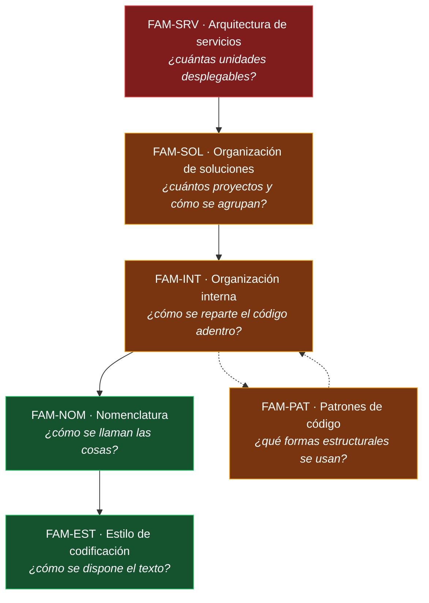

# Mapa conceptual — `MAPA-CONCEPTUAL`

## Resumen ejecutivo

Este documento responde una sola pregunta: **estoy acá, ¿qué leo?** Tres tablas de entrada —por escenario, por contexto y por decisión concreta— llevan del problema al documento que lo trata, sin obligar a recorrer la guía completa.

También fija la estructura del dominio, que es lo que permite entender por qué la guía está partida como está. Las seis familias no son una lista arbitraria de temas: corresponden a seis niveles de decisión que se toman en momentos distintos, con costos de reversión muy distintos, y que conviene no mezclar.

---

## Los seis niveles de decisión

El color indica el costo de revertir la decisión. El gradiente explica el orden de lectura recomendado: **de lo caro a lo barato**, porque una decisión de nivel superior condiciona a las inferiores y no al revés.

La relación entre `FAM-INT` y `FAM-PAT` es bidireccional a propósito. La elección de un patrón —repositorios explícitos, cortes verticales, minimal APIs— condiciona la organización de carpetas, y la organización elegida hace que ciertos patrones resulten naturales o forzados.

---

## La distinción que ordena todo el dominio

Antes de las tablas conviene fijar la separación que más errores evita, y que se desarrolla en [`FAM-SRV`](../10-Arquitectura-de-Servicios/README.md):

**Cómo se despliega un sistema y cómo se organiza su código son decisiones independientes.** Un monolito puede tener el código impecablemente modularizado; un conjunto de microservicios puede ser un desastre interno. Las cuatro combinaciones existen en la práctica:

| | Código organizado | Código desordenado |
|---|---|---|
| **Una unidad desplegable** | Monolito modular — el punto de partida que esta guía recomienda | «Gran bola de barro» |
| **Varias unidades desplegables** | Microservicios | Monolito distribuido — lo peor de ambos mundos |

Buena parte de la literatura presenta el eje horizontal como si fuera el vertical, y de ahí sale la creencia de que microservicios «ordenan» un sistema. No lo hacen: un sistema desordenado que se parte en servicios se convierte en un sistema desordenado con latencia de red y fallas parciales.

---

## Tabla de entrada por escenario

Qué leer según la situación en la que se está ([`MARCO-ESCENARIOS`](../00-Marco-de-Referencia/Escenarios.md)).

| Escenario | Leer primero | Después | Se puede omitir |
|-----------|--------------|---------|-----------------|
| `ESC-1` Sistema nuevo | [`TEM-PART`](../10-Arquitectura-de-Servicios/Criterios-de-Particion.md), [`TEM-TOPO`](../20-Organizacion-de-Soluciones/Topologias-de-Solucion.md), [`TEM-SLN`](../20-Organizacion-de-Soluciones/Estructura-de-Solucion.md), [`TEM-CVP`](../30-Organizacion-Interna/Carpetas-o-Proyectos.md) | [`TEM-MODELOS`](../30-Organizacion-Interna/Modelos-y-Contratos.md), [`TEM-BUILD`](../20-Organizacion-de-Soluciones/Build-Compartido.md), [`TEM-AUTO`](../50-Estilo-de-Codificacion/Automatizacion-del-Estilo.md) | Nada: es el escenario que más decide |
| `ESC-2` Evolución estructural | [`TEM-PART`](../10-Arquitectura-de-Servicios/Criterios-de-Particion.md), [`TEM-TOPO`](../20-Organizacion-de-Soluciones/Topologias-de-Solucion.md), [`TEM-MODU`](../10-Arquitectura-de-Servicios/Monolito-Modular.md) | [`TEM-CVP`](../30-Organizacion-Interna/Carpetas-o-Proyectos.md), [`TEM-SLICE`](../30-Organizacion-Interna/Vertical-Slice.md), [`TEM-MODELOS`](../30-Organizacion-Interna/Modelos-y-Contratos.md) | `FAM-NOM` y `FAM-EST`: no es el problema |
| `ESC-3` Normalización | [`TEM-AUTO`](../50-Estilo-de-Codificacion/Automatizacion-del-Estilo.md) | [`FAM-NOM`](../40-Nomenclatura/README.md) completa, [`TEM-FORMATO`](../50-Estilo-de-Codificacion/Formato-y-Llaves.md) | `FAM-SRV`: no se toca la arquitectura |
| `ESC-4` Evaluación | [`ANEXO-CHECK`](../99-Anexos/Listas-de-Verificacion.md) | Los criterios de calidad de cada documento pertinente | Depende del alcance de la evaluación |

---

## Tabla de entrada por contexto

Qué documentos cambian de peso según qué se está construyendo ([`MARCO-CONTEXTOS`](../00-Marco-de-Referencia/Contextos.md)).

| Contexto | Documentos de peso máximo | Por qué |
|----------|---------------------------|---------|
| `CTX-1` Web / cliente | [`TEM-CVP`](../30-Organizacion-Interna/Carpetas-o-Proyectos.md), [`TEM-ENDP`](../60-Patrones-de-Codigo/Patrones-de-Endpoint.md) | La frontera presentación/lógica se cruza sin que nada la vigile |
| `CTX-2` Servicio / API | [`TEM-ENDP`](../60-Patrones-de-Codigo/Patrones-de-Endpoint.md), [`TEM-MODELOS`](../30-Organizacion-Interna/Modelos-y-Contratos.md), [`TEM-DATOS`](../60-Patrones-de-Codigo/Patrones-de-Acceso-a-Datos.md) | El contrato expuesto pesa más que la organización interna |
| `CTX-3` Biblioteca | [`FAM-NOM`](../40-Nomenclatura/README.md) completa, [`TEM-NS`](../30-Organizacion-Interna/Espacios-de-Nombres.md) | Los nombres públicos son contrato; un renombre es cambio ruptor |
| `CTX-4` Distribuida | [`TEM-MICRO`](../10-Arquitectura-de-Servicios/Microservicios.md), [`TEM-PART`](../10-Arquitectura-de-Servicios/Criterios-de-Particion.md), [`TEM-MODELOS`](../30-Organizacion-Interna/Modelos-y-Contratos.md) | Los límites dejan de ser verificables por el compilador |

---

## Tabla de entrada por decisión concreta

La entrada más usada en la práctica: se llega con una pregunta puntual.

| La pregunta | Documento | ID |
|-------------|-----------|-----|
| ¿Monolito o microservicios? | [Criterios de partición](../10-Arquitectura-de-Servicios/Criterios-de-Particion.md) | `TEM-PART` |
| ¿Cuándo parto un servicio en dos? | [Criterios de partición](../10-Arquitectura-de-Servicios/Criterios-de-Particion.md) | `TEM-PART` |
| ¿Un proyecto o varios? | [Topologías de solución](../20-Organizacion-de-Soluciones/Topologias-de-Solucion.md) | `TEM-TOPO` |
| ¿Web y API en el mismo proceso o separados? | [Topologías de solución](../20-Organizacion-de-Soluciones/Topologias-de-Solucion.md) | `TEM-TOPO` |
| ¿Cómo organizo web + API + móvil? | [Topologías de solución](../20-Organizacion-de-Soluciones/Topologias-de-Solucion.md) | `TEM-TOPO` |
| ¿Las capas van en carpetas o en proyectos separados? | [Carpetas o proyectos](../30-Organizacion-Interna/Carpetas-o-Proyectos.md) | `TEM-CVP` |
| ¿Cómo estructuro el repositorio? ¿`src/` y `tests/`? | [Estructura de solución](../20-Organizacion-de-Soluciones/Estructura-de-Solucion.md) | `TEM-SLN` |
| ¿`.sln` o `.slnx`? | [Estructura de solución](../20-Organizacion-de-Soluciones/Estructura-de-Solucion.md) | `TEM-SLN` |
| ¿Qué tipo de proyecto creo? ¿Qué SDK? | [Tipos de proyecto](../20-Organizacion-de-Soluciones/Tipos-de-Proyecto.md) | `TEM-SDK` |
| ¿Dónde pongo la versión de los paquetes NuGet? | [Build compartido](../20-Organizacion-de-Soluciones/Build-Compartido.md) | `TEM-BUILD` |
| ¿Qué es `Directory.Build.props`? | [Build compartido](../20-Organizacion-de-Soluciones/Build-Compartido.md) | `TEM-BUILD` |
| ¿Clean Architecture, Onion o Hexagonal? | [Modelos de capas](../30-Organizacion-Interna/Modelos-de-Capas.md) | `TEM-CAPAS` |
| ¿Organizo por capa técnica o por funcionalidad? | [Vertical Slice](../30-Organizacion-Interna/Vertical-Slice.md) | `TEM-SLICE` |
| ¿Cómo nombro los espacios de nombres? | [Espacios de nombres](../30-Organizacion-Interna/Espacios-de-Nombres.md) | `TEM-NS` |
| ¿Dónde pongo los DTOs? | [Modelos, DTOs y contratos](../30-Organizacion-Interna/Modelos-y-Contratos.md) | `TEM-MODELOS` |
| ¿Los DTOs van en el dominio? | [Modelos, DTOs y contratos](../30-Organizacion-Interna/Modelos-y-Contratos.md) | `TEM-MODELOS` |
| ¿Los espacios de nombres en inglés o en español? | [Modelos, DTOs y contratos](../30-Organizacion-Interna/Modelos-y-Contratos.md) | `TEM-MODELOS` |
| ¿PascalCase o camelCase acá? | [Capitalización](../40-Nomenclatura/Capitalizacion.md) | `TEM-CAPS` |
| ¿`XMLDocument` o `XmlDocument`? | [Capitalización](../40-Nomenclatura/Capitalizacion.md) | `TEM-CAPS` |
| ¿Los campos privados llevan `_`? ¿Y `s_`? | [Capitalización](../40-Nomenclatura/Capitalizacion.md) | `TEM-CAPS` |
| ¿Cómo llamo a esta clase / método / test? | [Nombrado de tipos y miembros](../40-Nomenclatura/Nombrado-de-Tipos-y-Miembros.md) | `TEM-NOMB` |
| ¿Código en español o en inglés? | [Nombrado de tipos y miembros](../40-Nomenclatura/Nombrado-de-Tipos-y-Miembros.md) | `TEM-NOMB` |
| ¿Por qué no debo usar `Manager` / `Helper`? | [Antipatrones de nombrado](../40-Nomenclatura/Antipatrones-de-Nombrado.md) | `TEM-ANTI` |
| ¿Qué es la notación húngara y por qué no se usa? | [Antipatrones de nombrado](../40-Nomenclatura/Antipatrones-de-Nombrado.md) | `TEM-ANTI` |
| ¿Allman, K&R o 1TBS? ¿Cuál usa C#? | [Formato y llaves](../50-Estilo-de-Codificacion/Formato-y-Llaves.md) | `TEM-FORMATO` |
| ¿`var` o tipo explícito? | [Convenciones de lenguaje](../50-Estilo-de-Codificacion/Convenciones-de-Lenguaje.md) | `TEM-LENG` |
| ¿Cómo hago cumplir el estilo sin discutirlo en cada revisión? | [Automatización del estilo](../50-Estilo-de-Codificacion/Automatizacion-del-Estilo.md) | `TEM-AUTO` |
| ¿Cómo normalizo un código existente sin romper `git blame`? | [Automatización del estilo](../50-Estilo-de-Codificacion/Automatizacion-del-Estilo.md) | `TEM-AUTO` |
| ¿Minimal APIs o Controllers? | [Patrones de endpoint](../60-Patrones-de-Codigo/Patrones-de-Endpoint.md) | `TEM-ENDP` |
| ¿Necesito repositorios si ya uso EF Core? | [Patrones de acceso a datos](../60-Patrones-de-Codigo/Patrones-de-Acceso-a-Datos.md) | `TEM-DATOS` |

---

## Cruce escenario × familia

Cuánto pesa cada familia en cada escenario. `●` central, `○` relevante, `–` no aplica.

| Familia | `ESC-1` Nuevo | `ESC-2` Evolución | `ESC-3` Normalización | `ESC-4` Evaluación |
|---------|:-------------:|:-----------------:|:---------------------:|:------------------:|
| `FAM-SRV` Arquitectura de servicios | ● | ● | – | ○ |
| `FAM-SOL` Organización de soluciones | ● | ● | ○ | ● |
| `FAM-INT` Organización interna | ● | ● | ○ | ● |
| `FAM-NOM` Nomenclatura | ○ | ○ | ● | ● |
| `FAM-EST` Estilo de codificación | ○ | – | ● | ○ |
| `FAM-PAT` Patrones de código | ● | ○ | ○ | ○ |

La columna `ESC-3` explica por qué la normalización es un trabajo distinto: pesa en las dos familias de reversión barata y roza apenas a las demás. La única que no admite normalización es `FAM-SRV`, porque el modelo de despliegue no se cambia sin cambiar el comportamiento. Una reorganización que además toca la arquitectura no es normalización, es `ESC-2` disfrazado, y conviene separarla en dos trabajos.

---

## Cruce actor × familia

Dónde interviene cada rol ([`MARCO-ACTORES`](../00-Marco-de-Referencia/Actores.md)). `R` decide, `C` es consultado, `A` aplica.

| Familia | `ACT-01` Arq. | `ACT-02` Dev | `ACT-03` Resp. téc. | `ACT-04` Revisor | `ACT-05` DevOps | `ACT-06` Bibliot. |
|---------|:---:|:---:|:---:|:---:|:---:|:---:|
| `FAM-SRV` | **R** | C | C | – | C | – |
| `FAM-SOL` | **R** | A | C | – | C | C |
| `FAM-INT` | **R** | **R** | C | C | – | C |
| `FAM-NOM` | C | A | **R** | C | C | **R** |
| `FAM-EST` | – | A | **R** | C | C | – |
| `FAM-PAT` | C | **R** | C | C | – | C |

---

## Ruta de lectura sugerida

Para quien estudia el tema completo, cinco tramos. Cada uno cierra con algo que se puede decidir.

**Tramo 1 — El marco.** [Escenarios](../00-Marco-de-Referencia/Escenarios.md), [Contextos](../00-Marco-de-Referencia/Contextos.md), [Actores](../00-Marco-de-Referencia/Actores.md) y este mapa. Al terminar se puede ubicar cualquier pregunta del dominio en una coordenada.

**Tramo 2 — La decisión cara.** [`FAM-SRV`](../10-Arquitectura-de-Servicios/README.md) completa. Al terminar se puede argumentar una elección de despliegue con criterios verificables en lugar de con preferencias.

**Tramo 3 — El andamiaje.** [`FAM-SOL`](../20-Organizacion-de-Soluciones/README.md) completa. Al terminar se puede montar un repositorio .NET desde cero con build compartido y versiones centralizadas.

**Tramo 4 — El código adentro.** [`FAM-INT`](../30-Organizacion-Interna/README.md) y [`FAM-PAT`](../60-Patrones-de-Codigo/README.md). Al terminar se puede elegir un modelo de organización interna sabiendo qué se gana y qué se paga.

**Tramo 5 — La superficie.** [`FAM-NOM`](../40-Nomenclatura/README.md) y [`FAM-EST`](../50-Estilo-de-Codificacion/README.md). Al terminar se puede escribir el `.editorconfig` del equipo y defenderlo.

Los anexos no se leen de corrido: se usan. [Plantillas](../99-Anexos/Plantillas.md) al arrancar un repositorio, [listas de verificación](../99-Anexos/Listas-de-Verificacion.md) al revisar, [glosario](../99-Anexos/Glosario.md) y [referencias](../99-Anexos/Referencias.md) al consultar.
