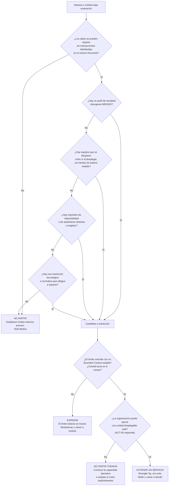
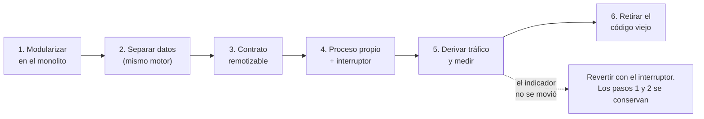

# Criterios de partición — `TEM-PART`

## Resumen ejecutivo

Decidir si un sistema se despliega como una unidad o como varias es la decisión más cara de revertir de toda esta guía, y se toma casi siempre con argumentos que no se pueden verificar. «Vamos a necesitar escalar», «así los equipos van más rápido», «es la arquitectura moderna»: ninguna de las tres afirma algo comprobable, y las tres se han usado para justificar particiones que ningún indicador mejoró.

Este documento propone reemplazar esos argumentos por cinco criterios que sí se pueden verificar antes de decidir. Cada uno se formula como una pregunta con respuesta observable, cada uno tiene un umbral, y la respuesta a la primera —¿los datos se pueden separar sin transacciones distribuidas?— tiene poder de veto sobre las otras cuatro: si no se pueden separar los datos, no hay partición posible, por muy fuertes que sean los demás argumentos.

Es el documento operativo de [`FAM-SRV`](README.md) y presupone los otros tres. Le sirve a `ACT-01` para decidir y para registrar la decisión, y a `ACT-04` y `ACT-03` para evaluar una propuesta de partición ajena.

---

## Definición

### Qué es

Un conjunto de condiciones verificables que, cumplidas, justifican convertir un límite interno en un límite de despliegue. Y, sobre todo, un procedimiento para llegar a esa conclusión sin apoyarse en preferencias.

La decisión no es binaria entre monolito y microservicios. Son al menos tres opciones —monolito, monolito modular, servicios separados— y la partición es incremental: se extrae un servicio, se mide, y se decide si extraer otro. Casi ningún sistema necesita partirse entero.

### Qué problema resuelve

**La decisión tomada por moda o por analogía.** Adoptar la arquitectura que usa una empresa de escala distinta, sin evaluar si las condiciones que allá la justifican existen acá.

**La decisión tomada por síntoma mal diagnosticado.** El *build* lento y el cambio que toca cinco carpetas son problemas reales que la partición no resuelve. Confundirlos con problemas de despliegue produce meses de trabajo sin mover el indicador.

**La irreversibilidad no advertida.** Partir es caro; reunificar, más. Un criterio explícito y un disparador de revisión escrito son lo que permite evaluar la decisión después, en lugar de defenderla.

### Qué NO es

**No es una fórmula.** Los cinco criterios ordenan la evaluación y exhiben los costos; no producen la respuesta por sí solos. La decisión sigue siendo un juicio de `ACT-01`, informado en lugar de intuitivo.

**No es una recomendación de partir.** El resultado más frecuente de aplicarlos con honestidad es no partir, o partir un solo servicio en lugar de siete.

**No es un criterio de organización del código.** Nada de lo que sigue dice cómo ordenar el interior de un servicio. Ese es el otro eje ([`FAM-INT`](../30-Organizacion-Interna/README.md)).

---

## El árbol de decisión



La forma del árbol codifica dos posiciones. La primera pregunta es eliminatoria porque la separabilidad de los datos es condición necesaria: sin ella, todo lo que se construya será un monolito distribuido. Y la salida `GO` extrae **un** servicio, no todos: la primera extracción es la que revela el costo real y con frecuencia también revela que la segunda no conviene.

---

## Los cinco criterios

Antes de enunciarlos corresponde declarar su nivel de autoridad, porque es el más bajo de los tres que distingue [`MARCO-CONVENCIONES`](../00-Marco-de-Referencia/Convenciones.md) y este documento es el más prescriptivo de la guía. **Los cinco criterios, su orden, el veto del primero y todos los umbrales cuantificados que siguen —el orden de magnitud del criterio 3, los cuatro equipos del criterio 4, los seis meses de estabilidad del contexto— son criterio propio de esta guía.** Ninguna fuente de [`ANEXO-REFERENCIAS`](../99-Anexos/Referencias.md) los respalda: `N-12` contrasta monolito y microservicios sin fijar umbrales, y `O-03` aporta el Bounded Context sin decir cuándo conviene que sea de despliegue.

Se ofrecen igual, y la razón es la que hace la diferencia. Un umbral discutible que se puede medir permite que alguien lo aplique, obtenga un número y argumente que es equivocado; «vamos a necesitar escalar» no admite esa conversación. La utilidad de estos números está en que son verificables, no en que sean estándar, y un equipo que sustituya cualquiera de ellos por otro que haya medido está usando el documento como corresponde.

### 1. ¿Los datos se pueden separar sin transacciones distribuidas?

**Cómo se verifica.** Se listan las tablas del módulo candidato y se busca, en el código y en las consultas, qué otras partes del sistema las leen o las escriben. Después se identifican las operaciones que hoy escriben en una transacción tablas de ambos lados del corte propuesto.

**El umbral.** Ninguna operación del camino frecuente debería requerir escribir a ambos lados de forma atómica. Si una operación central —confirmar una reserva— necesita escribir en el módulo que se va y en el que se queda, y las dos escrituras deben confirmar o revertir juntas, el corte está mal puesto. Que exista alguna operación marginal que tolere consistencia eventual es aceptable; que la tolere la operación principal del sistema es otra cosa.

**Qué hacer si falla.** No partir. Y hay una información valiosa en el fracaso: la transacción que no se deja separar está señalando dónde está el límite real del dominio, que no es donde se lo quería poner.

Este criterio tiene veto porque su incumplimiento no se compensa con nada. Un escalado divergente enorme no vuelve separables dos tablas que participan de la misma transacción.

### 2. ¿Hay razones de cambio distintas?

**Cómo se verifica.** Con el historial del repositorio. Se cuenta, sobre los últimos seis o doce meses, qué proporción de los *commits* que tocan el módulo candidato tocan además el resto del sistema.

**El umbral.** Si la mayoría de los cambios en el módulo vienen acompañados de cambios afuera, el módulo no tiene una razón de cambio propia y separarlo convierte cada cambio en dos despliegues coordinados. Lo deseable es lo inverso: un módulo que cambia por sus propios motivos, con un acoplamiento temporal bajo respecto del resto.

**Qué hacer si falla.** No partir por ahí. Puede que el corte correcto esté en otro lugar, y el propio análisis de coincidencia de cambios sugiere dónde: los archivos que cambian juntos con frecuencia pertenecen al mismo módulo, se llamen como se llamen.

### 3. ¿Hay perfiles de escalado distintos?

**Cómo se verifica.** Con telemetría: peticiones por segundo y consumo de recursos por área funcional, en el pico. No con estimaciones.

**El umbral.** Una diferencia de un orden de magnitud entre áreas, sostenida, y con un costo de sobredimensionamiento que sea significativo frente al costo de operar un servicio más. Una diferencia de dos o tres veces se absorbe escalando el conjunto y sale más barato.

**Qué hacer si falla.** No partir por este motivo. Este es el criterio que más se invoca sin medición y el que más fácil es de medir, lo cual dice algo sobre cómo se toman estas decisiones en la práctica.

### 4. ¿Hay equipos que se bloquean entre sí?

**Cómo se verifica.** Midiendo el tiempo entre que un cambio está listo para publicar y efectivamente se publica, y cuánto de ese tiempo es espera por otro equipo. Complementariamente: cuántos conflictos de integración cruzan fronteras de equipo, y con qué frecuencia una publicación se pospone porque otro equipo tiene algo a medias.

**El umbral.** Existe espera real y recurrente, atribuible a compartir el artefacto de despliegue. Con un solo equipo el criterio no aplica, cualquiera sea su tamaño; con dos suele resolverse con proceso; con cuatro o más equipos que publican en ritmos distintos, el argumento se vuelve sólido.

**Qué hacer si falla.** No partir. Y advertir el corolario de la ley de Conway: si se parte el sistema sin que exista un equipo que posea el servicio extraído, el resultado es un servicio que todos tocan y nadie mantiene, que es peor que el módulo del que salió ([`TEM-MICRO`](Microservicios.md)).

### 5. ¿Hay requisitos de disponibilidad o aislamiento distintos?

**Cómo se verifica.** En los requisitos no funcionales escritos y en el registro de incidentes. ¿Existe un requisito que exija que un área siga funcionando cuando otra falla? ¿Hubo incidentes donde la falla de un área tumbó a otra que debía sobrevivir?

**El umbral.** El requisito está escrito y es exigible, o el incidente ocurrió. Un deseo genérico de robustez no alcanza, porque la separación de procesos por sí sola no aísla nada: el aislamiento lo produce el manejo explícito de la ausencia del otro, y ese manejo también se puede implementar dentro de un monolito.

Se agrupa acá el aislamiento por cumplimiento normativo —datos que deben residir en otra región o bajo otro control de acceso—, que es una restricción externa y suele ser suficiente por sí misma.

**Qué hacer si falla.** No partir por este motivo, y considerar si el aislamiento que se busca se obtiene más barato con límites de recursos dentro del proceso, con degradación explícita o con desacople por cola.

---

## El Bounded Context como criterio de corte

Cumplidos los criterios anteriores, queda dónde exactamente poner el corte. La respuesta más útil viene de **Domain-Driven Design** de Eric Evans (`O-03`): el **Bounded Context** es el ámbito dentro del cual un modelo del dominio y su lenguaje son coherentes y unívocos.

La observación que lo hace operativo es que el mismo término significa cosas distintas en áreas distintas del negocio. En el sistema de reserva de salas, «sala» significa para el módulo de reservas un recurso con horarios ocupados y libres; para el de mantenimiento, un espacio físico con equipamiento y estado de conservación; para el de facturación, un centro de costo con tarifa por hora. Son tres modelos distintos que comparten un nombre.

El intento de unificarlos en un solo modelo produce la entidad `Sala` con cuarenta propiedades, de las cuales cada consumidor usa seis y las restantes le estorban. Es el síntoma más reconocible de un límite de contexto ignorado.

**Cómo se detecta un Bounded Context, en la práctica.** Se escucha a la gente de negocio. Cuando dos áreas usan el mismo sustantivo y hay que preguntar «¿en qué sentido?», hay dos contextos. Cuando una misma palabra desencadena procesos distintos según quién la diga, hay dos contextos. Y en el código: cuando una entidad tiene grupos de propiedades que nunca se usan juntos, y métodos que solo tienen sentido para un tipo de consumidor, hay dos contextos fusionados.

La relación entre este criterio y los cinco anteriores es de complementariedad, no de sustitución. El Bounded Context indica **dónde** cortaría el dominio; los cinco criterios indican **si conviene** que ese corte sea de despliegue o alcance con que sea un límite de módulo. Un Bounded Context bien identificado es la mejor frontera disponible para un módulo, y un buen candidato a servicio si además hay razón para separar el despliegue.

DDD no es un estándar de Microsoft ni una especificación; es una obra de referencia (`O-03`) cuyos conceptos el ecosistema adoptó ampliamente.

---

## Cómo extraer un módulo de forma incremental

El patrón de referencia es el **strangler fig**, atribuido a **Martin Fowler**: en lugar de reemplazar un sistema de una vez, se construye el reemplazo alrededor del original y se le va derivando tráfico hasta que el original queda sin uso y se retira. La atribución al autor es de amplia circulación; el artículo específico no se verificó en fuente primaria para esta redacción y no se cita URL. La imagen proviene de la higuera estranguladora, que crece sobre su árbol huésped hasta reemplazarlo.

Aplicado a la extracción de un módulo, el procedimiento tiene seis pasos y cada uno es reversible por sí solo.

**1. Modularizar dentro del monolito.** El módulo obtiene su ensamblado, su superficie pública mínima y su mecanismo de imposición de límites ([`TEM-MODU`](Monolito-Modular.md)). Todavía no hay red. Este paso tiene valor propio aunque la extracción se cancele acá, que es lo que le da al procedimiento su carácter incremental real.

**2. Separar los datos dentro de la misma base.** El módulo obtiene su esquema, sus migraciones y sus tablas. Se eliminan las consultas que cruzan el límite: donde había un `JOIN`, ahora hay una llamada a la superficie pública del otro módulo. Es el paso más laborioso y el que más suele revelar que el corte estaba mal.

**3. Reemplazar las llamadas directas por una interfaz remotizable.** El consumidor deja de invocar el servicio concreto y pasa a invocar una interfaz cuyos parámetros y resultados son serializables, sin navegación a entidades ajenas. La implementación sigue siendo en proceso; solo cambió la forma del contrato.

**4. Poner el módulo detrás de un proceso propio, con el interruptor puesto.** Se despliega el servicio y se mantiene la implementación en proceso. Una bandera de configuración decide cuál de las dos se usa, y el interruptor permite volver atrás sin desplegar nada.

**5. Derivar el tráfico gradualmente y observar.** Primero las operaciones de lectura, después las de escritura. Se mide latencia, tasa de error y el indicador que motivó la extracción. Si ese indicador no se mueve, la información es que la extracción no valía la pena, y el interruptor sigue estando.

**6. Retirar la implementación en proceso.** Recién cuando el tráfico pasó entero por el servicio durante un período que cubra un ciclo completo de uso —incluidos los picos y los procesos de cierre—, se elimina el código viejo y la bandera.



Los pasos 1 y 2 son los que producen la mayor parte del beneficio, y son los únicos que no se pierden si el proceso se detiene. Un equipo que hace 1 y 2 y decide no seguir tiene un sistema mejor que cuando empezó; uno que salta directamente al 4 tiene un servicio nuevo acoplado a las tablas del viejo.

---

## Señales de que no hay que partir

Ninguna de estas señales es concluyente por sí sola; tres o más juntas son razón suficiente para posponer la decisión.

**Nadie puede nombrar el indicador que debería moverse.** Si no se sabe qué se está optimizando, no se va a poder evaluar el resultado y la partición se defenderá sola para siempre.

**La justificación está en tiempo futuro.** «Vamos a necesitar», «cuando crezcamos», «si escala». Son hipótesis, y el modelo modular las cubre a un costo mucho menor y sin comprometer la opción.

**Hay un solo equipo.** El criterio de autonomía no aplica, y con él se cae el argumento más fuerte del modelo. La partición sigue siendo posible por escalado o aislamiento, pero pierde su mejor razón.

**Los datos no se dejan separar.** Criterio con veto. Cierra la discusión.

**El síntoma que motiva es *build* lento o cambio disperso.** Ninguno se resuelve partiendo el despliegue. El primero se ataca con menos proyectos y caché de compilación; el segundo, con organización interna por funcionalidad ([`TEM-SLICE`](../30-Organizacion-Interna/Vertical-Slice.md)).

**No hay quién opere el resultado.** Si `ACT-05` no participó de la decisión, o participó y advirtió que no hay capacidad para descubrimiento, correlación de trazas y canalizaciones adicionales, la partición va a producir un sistema distribuido que nadie puede diagnosticar.

**El sistema tiene menos de un año y el dominio todavía se mueve.** Los límites se están descubriendo. Fijarlos como límites de red en ese momento es fijar lo que más probablemente cambie.

**La motivación real es la contratación o el currículum.** Ocurre, rara vez se dice, y produce sistemas que la organización no puede sostener. Merece nombrarse porque quien la reconoce en sí mismo puede descontarla.

---

## Tabla comparativa

Las tres opciones sobre las dimensiones que efectivamente cambian el resultado.

| Dimensión | Monolito | Monolito modular | Microservicios |
|---|---|---|---|
| Unidades desplegables | 1 | 1 | N |
| Quién verifica los límites | Nadie | Compilador o analizador | Nadie automáticamente |
| Transacción entre áreas | ACID local | ACID local | Saga y compensación |
| Consistencia | Inmediata | Inmediata | Eventual entre servicios |
| Refactorización entre áreas | Verificada por el compilador | Verificada por el compilador | Manual, con ventana de compatibilidad |
| Latencia entre áreas | Nanosegundos | Nanosegundos | Milisegundos, y puede fallar |
| Depuración de una petición | Depurador local | Depurador local | Trazas correlacionadas |
| Escalar un área sola | No | No | Sí |
| Desplegar sin coordinar | N/A | N/A | Sí |
| Aislamiento de fallas | No | No | Sí, si se programa |
| Heterogeneidad tecnológica | No | No | Sí |
| Costo operativo | Bajo | Bajo | Alto y permanente |
| Costo de entrada | Mínimo | Bajo | Alto |
| Costo de partir después | Muy alto | Acotado | Ya está partido |
| Equipos que soporta bien | 1 a 2 | 1 a 4 | Varios, con dueño por servicio |
| Requiere `ACT-05` dedicado | No | No | **Sí** |

Dos filas de esta tabla son criterio propio y no observación: «equipos que soporta bien» —1 a 2, 1 a 4, varios con dueño por servicio— repite las cuentas del criterio 4 y arrastra su misma condición, que ninguna fuente las respalda y que su valor está en poder contrastarlas contra lo que un equipo mida. «Requiere `ACT-05` dedicado» es igualmente juicio de esta guía. Las demás filas describen propiedades del modelo, no recomendaciones.

Las filas de escalado, despliegue independiente, aislamiento y heterogeneidad son las cuatro únicas en las que la columna de la derecha gana. Si ninguna de esas cuatro es una necesidad actual y medida del sistema, la comparación se resuelve sola.

---

## Aplicación por escenario

### `ESC-1` — Sistema nuevo

Los cinco criterios son casi todos inaplicables acá, y esa es la conclusión: no hay telemetría, no hay historial de *commits*, y el dominio no se conoce lo suficiente como para identificar contextos con confianza. Decidir partir en `ESC-1` es decidir sin ninguno de los datos que la decisión requiere.

Las dos excepciones legítimas ya están enunciadas en [`TEM-MICRO`](Microservicios.md): varios equipos ya constituidos, o una restricción externa —tecnológica o normativa— que obligue a separar. Fuera de eso, lo que corresponde es un monolito modular con los contextos identificados provisionalmente como módulos, y un ADR que registre la decisión con su disparador de revisión.

### `ESC-2` — Evolución estructural

El escenario propio de este documento. Están los datos que `ESC-1` no tenía y el dominio se conoce.

El orden de trabajo: identificar el síntoma y medirlo; recorrer el árbol de decisión; si sale `GO`, elegir **un** candidato —el de mejor relación entre beneficio esperado y esfuerzo, que suele ser un módulo periférico y no el núcleo del dominio—; ejecutar el strangler fig; medir el indicador. Y volver a decidir con esa información, en lugar de continuar por inercia.

El módulo periférico como primer candidato tiene una razón concreta: si algo sale mal, el daño está acotado, y la organización aprende el costo real de operar un servicio adicional sobre algo que no es crítico.

### `ESC-3` — Normalización de código existente

No aplica directamente: normalizar estilo y nomenclatura no toca el modelo de despliegue. La conexión es de orden: **normalizar antes de partir**. Un módulo que se extrae con convenciones inconsistentes se lleva la inconsistencia a un repositorio donde después será más caro corregirla, porque la corrección requerirá su propio despliegue.

### `ESC-4` — Evaluación de código ajeno

Los criterios funcionan acá como preguntas de auditoría sobre una partición ya hecha. La secuencia: ¿cada servicio tiene su almacén? ¿Se publican por separado en la práctica? ¿Qué operación cruza servicios y cómo se garantiza su consistencia? ¿Hay un equipo por servicio?

Cuando la partición no se justifica con los criterios, la observación correcta no es «esto debería ser un monolito» —reunificar es caro y puede no valer la pena— sino señalar qué costo se está pagando y qué haría falta para que valiera. `ESC-4` describe consecuencias; no revierte decisiones ajenas.

### Qué cambia según el contexto

| Contexto | Qué cambia |
|---|---|
| `CTX-1` Web/cliente | Se agrega una pregunta al árbol: cómo compone la interfaz datos de varios servicios, y qué disponibilidad compuesta hereda el usuario. Una pantalla que depende de cuatro servicios falla más que cualquiera de ellos |
| `CTX-2` Servicio/API | Los criterios se aplican tal cual. El costo del versionado de contratos pesa más, porque puede haber consumidores externos que no se controlan |
| `CTX-3` Biblioteca | El árbol no aplica. La decisión análoga es la granularidad de los paquetes publicados, y su criterio es distinto: lo fija el consumidor, que no quiere arrastrar dependencias que no usa |
| `CTX-4` Distribuida | El sistema ya está partido. Los criterios se usan para evaluar los cortes existentes y, con frecuencia, para justificar la fusión de servicios que no debieron separarse |

---

## Ejemplos concretos

### Evaluación de un módulo candidato

Ejemplo sintético. El sistema de reserva de salas, con el módulo de notificaciones bajo evaluación.

```text
CANDIDATO: módulo Notificaciones

1. Separabilidad de datos          → SÍ
   Tablas propias: Notificacion, Plantilla, PreferenciaUsuario.
   Ninguna otra parte del sistema las lee.
   Ninguna operación escribe atómicamente en Notificacion y en Reserva:
   la notificación ya se despacha después de confirmar (bandeja de salida).

2. Razones de cambio distintas     → SÍ
   Últimos 6 meses: 34 commits tocan Notificaciones; 4 tocan además otro módulo.
   Los cambios vienen de canales nuevos y de plantillas, no del dominio de reservas.

3. Perfil de escalado distinto     → NO
   Pico: 12 notif/s contra 340 pet/s de disponibilidad.
   Menor volumen, no mayor. No hay desperdicio que recuperar.

4. Equipos bloqueándose            → NO
   Un solo equipo de 6 personas.

5. Disponibilidad/aislamiento      → SÍ (parcial)
   RNF-009: la caída del proveedor de correo no debe impedir confirmar reservas.
   Incidente 2026-03-14: el reintento del envío de correo agotó el pool de hilos
   y degradó la confirmación de reservas durante 22 minutos.

BOUNDED CONTEXT                    → SÍ, estable
   Lenguaje propio (destinatario, canal, plantilla), sin solapamiento con reservas.
   El límite no se movió en 6 meses.

CAPACIDAD OPERATIVA (ACT-05)       → Con reservas
   No hay correlación de trazas. Se requiere antes de la extracción.

CONCLUSIÓN
   Candidato válido por el criterio 5, con evidencia de incidente.
   Antes: construir correlación de trazas.
   Alternativa más barata evaluada: aislar el despacho de correo en su propio
   pool con límite de concurrencia y disyuntor, dentro del monolito.
   → Se prueba PRIMERO la alternativa barata. Si el incidente se repite
     con ella activa, se procede a la extracción.
```

Lo que hace útil a esta evaluación es la última línea. Los criterios se cumplen y aun así la decisión es probar antes la intervención barata, porque el criterio que habilita —aislamiento de fallas— tiene un remedio en proceso que cuesta dos días contra las semanas de una extracción. Un análisis que solo verifica los criterios y concluye «partir» se saltea la pregunta que más ahorra: ¿qué otra cosa resuelve esto?

### El registro de la decisión

Toda conclusión de este árbol merece un ADR, cualquiera sea el resultado. La decisión de **no** partir es tan estructural como la de partir, y sin registro la discusión vuelve cada seis meses.

```markdown
# ADR-014 — El módulo de notificaciones permanece en el monolito

## Estado
Aceptado (2026-04-02).

## Contexto
El incidente del 2026-03-14 (22 minutos de degradación en la confirmación de
reservas, causado por el reintento de envío de correo agotando el pool de hilos)
motivó la propuesta de extraer Notificaciones a un servicio propio.

Evaluación contra TEM-PART: se cumplen los criterios 1, 2 y 5; no se cumplen el
3 ni el 4. El Bounded Context es estable. No existe correlación de trazas y el
equipo es de seis personas con un único responsable de infraestructura.

## Decisión
El módulo permanece en el monolito. El aislamiento exigido por RNF-009 se
implementa con un pool de trabajo dedicado, límite de concurrencia y disyuntor
sobre el proveedor de correo. El módulo conserva su esquema propio y su
superficie pública, de modo que la extracción siga siendo viable.

## Consecuencias
El aislamiento es de recursos dentro del proceso, no de proceso: una falla
catastrófica del host sigue afectando a todo. Se acepta, porque RNF-009 exige
tolerancia a la caída del proveedor externo y no a la del host.
Se evita el costo de una unidad desplegable adicional sin capacidad de
observabilidad distribuida para operarla.

## Disparador de revisión
Un segundo incidente de degradación atribuible a notificaciones con el
aislamiento de recursos ya activo; o la incorporación de un segundo equipo
que trabaje sobre este módulo. La métrica —tiempo de espera en el pool de
notificaciones— se instrumenta con este cambio.
```

El disparador de revisión es lo que distingue este ADR de una postergación indefinida: alguien va a saber cuándo reabrirlo. El formato completo y sus criterios están en la guía hermana de documentación técnica.

---

## Preguntas guía

1. ¿Cuál de los cinco criterios motiva esta partición, y qué dato lo respalda?
2. ¿Los datos del módulo candidato se separan sin que ninguna operación frecuente requiera escribir atómicamente a ambos lados del corte?
3. ¿Qué proporción de los *commits* que tocan el módulo toca además el resto del sistema?
4. ¿Qué alternativa más barata se evaluó, y por qué no alcanza?
5. ¿Qué indicador debería moverse si esto funciona, y está instrumentado hoy?
6. ¿El límite propuesto coincide con un Bounded Context, y cuánto se movió en los últimos seis meses?
7. ¿Qué equipo va a ser dueño del servicio extraído? Si la respuesta es «todos», no hay dueño.
8. ¿`ACT-05` puede operar una unidad desplegable más con las capacidades que hay hoy?
9. ¿Cómo se revierte esto si el indicador no se mueve? ¿Existe el interruptor?
10. ¿Bajo qué condición esta decisión —partir o no partir— dejaría de ser correcta, y está escrita?

---

## Criterios de calidad

**Cada criterio invocado tiene un dato detrás.** Un número, un incidente con fecha, una consulta al historial del repositorio. «Percibimos que» no es un dato.

**Se evaluó al menos una alternativa más barata que la partición.** Y consta por qué no alcanza.

**Está nombrado el indicador que debería moverse.** Y está instrumentado antes de empezar, porque medirlo después de partir ya no permite comparar.

**La decisión está registrada con su disparador de revisión.** Tanto si se parte como si no.

**Se parte de a uno.** Un plan que extrae siete servicios en una iniciativa no permite aprender del primero.

**`ACT-05` participó.** La factura operativa la paga él, y su ausencia de la conversación es el mejor predictor de que va a estar subestimada.

### Antipatrones

**La partición por consigna.** «Todo servicio nuevo va separado», sin evaluación caso por caso. Produce fragmentación y el conjunto de límites que nadie decidió.

**El corte por capa técnica.** Un servicio de UI, uno de lógica, uno de datos. Cada funcionalidad los atraviesa a los tres y ninguno se despliega solo. Lo que la ley de Conway predice cuando la organización está partida por especialidad.

**La partición como remedio del desorden.** El error de eje. Distribuye el desorden y le quita al compilador la capacidad de señalarlo.

**El plan de partición total.** Un documento que enumera los once servicios del estado final. Suele ejecutarse hasta el tercero, dejando el sistema en un híbrido que nadie diseñó y que acumula las dos formas de operar.

**La extracción sin separar datos primero.** Saltar del paso 1 al 4 del strangler fig. Produce un servicio nuevo que consulta las tablas del viejo, o sea, un monolito distribuido nacido de fábrica.

**La medición retrospectiva.** Instrumentar el indicador después de partir. No queda contra qué comparar, y la decisión se vuelve inevaluable, que es la forma más eficaz de volverla permanente.

**La reversión imposible.** Ejecutar la extracción sin interruptor, retirando el código viejo en el mismo despliegue. Convierte un experimento en un compromiso.
