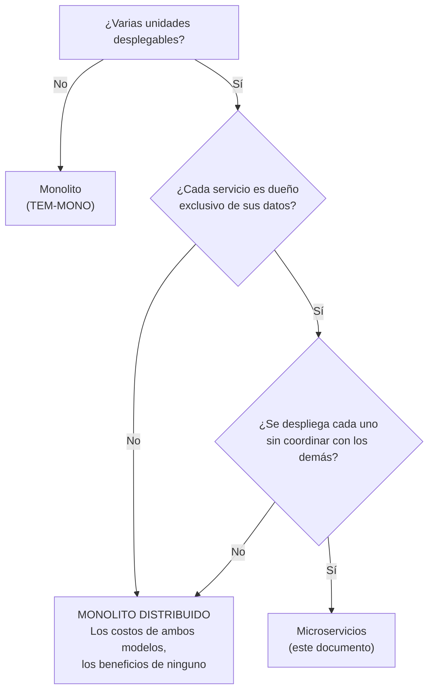

# Microservicios — `TEM-MICRO`

## Resumen ejecutivo

Un sistema de microservicios está compuesto por varias unidades desplegables que se publican de forma independiente y cada una es dueña exclusiva de sus datos. Las dos condiciones van juntas y ninguna es opcional: si dos servicios comparten tablas, no se pueden desplegar por separado aunque tengan procesos separados, y lo que hay entonces es un monolito repartido.

El modelo resuelve un conjunto acotado de problemas: escalar una parte del sistema sin escalar el resto, permitir que equipos distintos publiquen sin coordinarse, contener una falla dentro de un servicio, y usar tecnologías distintas donde conviene. Son problemas reales que ningún otro modelo resuelve. Fuera de ese conjunto, la partición no aporta nada y sí cobra: consistencia eventual, transacciones distribuidas, observabilidad que hay que construir, contratos que hay que versionar, latencia y fallas de red, y una infraestructura operativa permanente.

Lo que no resuelve, bajo ninguna circunstancia, es el desorden del código. Ese es el malentendido que más sistemas ha dañado en la última década, y este documento le dedica atención proporcional. Le sirve a `ACT-01` para evaluar la decisión con sus costos a la vista, y a `ACT-05`, que hereda casi toda la factura.

---

## Definición

### Qué es

Un sistema construido como un conjunto de servicios que cumplen dos condiciones simultáneas:

1. **Despliegue independiente.** Cada servicio se publica sin coordinar con los demás. Publicar el servicio de reservas no requiere publicar el de notificaciones, ni siquiera avisarle.
2. **Datos propios.** Cada servicio es dueño exclusivo de su almacén. Ningún otro servicio lee ni escribe sus tablas; el acceso pasa siempre por su interfaz.

La segunda condición es la que se omite con más frecuencia y la que hace posible la primera. Si el servicio B lee las tablas de A, entonces un cambio de esquema en A rompe a B, y los despliegues tienen que coordinarse: la independencia desapareció aunque los procesos sigan separados.

Microsoft describe el modelo en `N-12` como una de las arquitecturas frecuentes, contrastándolo con el monolito y señalando explícitamente que la elección depende del contexto. La página describe; no prescribe.

El prefijo «micro» es engañoso y ha causado daño. No refiere a la cantidad de líneas ni a un tamaño objetivo. Un servicio bien delimitado puede tener cuarenta mil líneas si su área de dominio lo justifica, y la búsqueda de servicios pequeños por consigna produce fragmentación: veinte servicios que se llaman entre sí en cadena para atender una petición.

### Qué problema resuelve

Cuatro problemas, y conviene ser preciso porque el modelo se justifica invocando muchos más de los que efectivamente ataca.

**Escalado diferencial.** Cuando un área del sistema recibe un orden de magnitud más de carga que las otras, separarla permite dimensionarla sola. Consultar disponibilidad de salas puede recibir cuarenta veces más peticiones que administrar el catálogo de salas; en un despliegue único, escalar la consulta implica replicar también la administración, que no lo necesita. El argumento es válido cuando el desperdicio está medido y es significativo respecto del costo de la partición.

**Autonomía de equipos.** Con seis equipos sobre un artefacto único, cada publicación se coordina y cada rama de larga vida conflictúa. Servicios separados les devuelven la capacidad de publicar en su propio ritmo. Es el argumento más fuerte del modelo, y el que más depende del tamaño de la organización: es irrelevante con ocho personas y determinante con ciento veinte.

**Aislamiento de fallas.** En un proceso único, una fuga de memoria en el generador de reportes agota el proceso y se lleva las reservas. Separados, la falla queda contenida —siempre que el consumidor esté preparado para que el otro no responda, cosa que hay que programar y probar. El aislamiento no viene por el hecho de separar; viene de manejar la ausencia del otro.

**Heterogeneidad tecnológica.** Un componente que necesita una biblioteca que solo existe en otro entorno, o un modelo de ejecución que .NET no favorece. Es el argumento menos frecuente y hay que sospechar de él cuando se lo invoca sin un caso concreto: la heterogeneidad tiene su propio costo permanente en herramientas, canalizaciones y capacidades del equipo.

### Qué NO resuelve

**No ordena el código desordenado.** Es la afirmación central de este documento. Partir el despliegue toma la organización que el código tiene y la distribuye; no la mejora. Un sistema con la lógica de negocio repartida entre controladores y componentes de UI, partido en once servicios, tiene la lógica repartida entre once conjuntos de controladores, ahora sin que el compilador pueda señalar una dependencia mal puesta.

El mecanismo de la ilusión es comprensible. Al partir, alguien tiene que decidir qué va en cada servicio, y ese ejercicio de delimitación sí ordena. Pero el orden lo produjo la delimitación, no el despliegue separado, y la delimitación se puede hacer —más barato y de forma reversible— dentro de una sola unidad desplegable ([`TEM-MODU`](Monolito-Modular.md)).

**No hace más rápido el desarrollo.** Al contrario, en el corto plazo lo hace más lento: hay contratos que definir, versionar y mantener; hay entornos locales que levantar con varios servicios; hay pruebas de integración que orquestar. La ganancia de velocidad, cuando llega, viene de la autonomía de equipos y solo existe si había equipos bloqueándose.

**No mejora el desempeño.** Lo empeora en el camino común. Una operación que antes era una llamada de método pasa a ser una o varias llamadas de red. Lo que mejora es la *capacidad de escalar* un área concreta, que es otra cosa.

**No sustituye el diseño del dominio.** Los límites entre servicios son límites de dominio antes que límites técnicos, y elegirlos mal es el error más caro del modelo porque corregirlo implica migrar datos entre almacenes.

### Con qué se lo confunde

**Con «tener varios proyectos».** Nueve `.csproj` que producen un ejecutable son un monolito. La partición es de despliegue.

**Con «usar HTTP entre componentes».** El medio de comunicación no define el modelo. Dos procesos que se hablan por HTTP y comparten base de datos no son microservicios.

**Con la orientación a servicios en general.** Un sistema con dos servicios —una API y un procesador de fondo— no es una arquitectura de microservicios, es un sistema con dos componentes. La discusión de este documento aplica cuando la cantidad y la independencia crean un problema de gobierno.

---

## Los costos, uno por uno

Todos son costos ciertos, se pagan desde el primer día y no se amortizan. Contra ellos hay que poner el beneficio esperado.

**Consistencia eventual.** Con datos repartidos, no existe un instante en que todo el sistema sea coherente. Confirmada una reserva, el servicio de notificaciones puede tardar en enterarse, y durante ese intervalo el sistema muestra estados distintos según a quién se le pregunte. No es un defecto: es la consecuencia necesaria de la partición. Lo que sí es un defecto es no haberlo decidido, no haberlo especificado en la interfaz y descubrirlo cuando un usuario reporta que reservó y no le llegó nada.

**Transacciones distribuidas y sagas.** Una operación que toca dos servicios no puede ser atómica. La forma habitual de resolverlo es una saga: una secuencia de pasos locales con una compensación por cada uno, de modo que si el paso tres falla se ejecutan las compensaciones de los pasos dos y uno. Esa maquinaria es código de producción con sus propios modos de fallo —la compensación también puede fallar, y hay que decidir qué se hace entonces— y multiplica los estados posibles del sistema. Lo que en un monolito era `BeginTransaction` y `Commit` pasa a ser un componente con máquina de estados, persistencia propia y procedimiento de operación.

**Observabilidad distribuida.** Responder «¿por qué falló esta petición?» requiere correlacionar registros de cuatro servicios. Eso exige propagar un identificador de correlación por cada salto, exportar trazas, agregarlas en algún lado y tener a alguien capaz de leerlas. Es infraestructura que hay que construir, operar y pagar, y su ausencia se descubre siempre en el peor momento posible.

**Versionado de contratos.** Con despliegue independiente, en algún momento coexisten la versión vieja de un servicio y la nueva de otro. Todo cambio de contrato tiene que ser compatible hacia atrás durante al menos una ventana de despliegue, lo que impone una disciplina: agregar campos opcionales, nunca renombrar ni cambiar el tipo de uno existente, y retirar solo después de verificar que nadie lo usa. La cadena de compatibilidad se sostiene con proceso, porque el compilador ya no ayuda.

**Latencia y fallas de red.** Cada salto agrega milisegundos y un modo de fallo nuevo: tiempo de espera agotado, conexión rechazada, respuesta parcial, respuesta duplicada por reintento. El consumidor tiene que decidir para cada llamada qué hace si el otro no responde —fallar, degradar, reintentar, servir de una caché— y esa decisión se toma tantas veces como llamadas haya. Las llamadas en cadena componen lo peor de ambos: si atender una petición requiere cuatro saltos secuenciales con 99,9 % de disponibilidad cada uno, la disponibilidad compuesta cae por debajo de la de cualquiera de sus partes.

**Complejidad operativa.** Descubrimiento de servicios, pasarela o malla, configuración por servicio y por entorno, gestión de secretos multiplicada, canalizaciones que hay que mantener en paralelo, y un entorno de desarrollo local donde levantar el sistema completo deja de ser trivial. Esta factura la recibe `ACT-05` y suele estar ausente de la conversación en que se decide partir, que ocurre entre `ACT-01` y `ACT-02`.

---

## El monolito distribuido

Es el resultado más frecuente de una partición mal fundada, y merece tratarse como el antipatrón central del tema. Consiste en varias unidades desplegables que **no pueden desplegarse ni fallar de forma independiente**. Acumula los costos de la distribución —red, consistencia, operación— y los del monolito —acoplamiento, coordinación— sin obtener los beneficios de ninguno.

El término es de uso corriente, peyorativo y sin fuente normativa; esta guía lo emplea como diagnóstico, no como categoría formal ([`ANEXO-REFERENCIAS`](../99-Anexos/Referencias.md), sección 4).

### Los dos síntomas diagnósticos

**Base de datos compartida.** Dos o más servicios leen o escriben las mismas tablas. Es el síntoma decisivo, y basta con encontrarlo para cerrar el diagnóstico: si el esquema es compartido, un cambio en él afecta a todos los que lo tocan, y ningún despliegue es independiente por mucho que los procesos estén separados.

**Despliegues que deben coordinarse.** Existe una lista de qué se publica primero, o «el servicio A y el B se publican juntos». Cada acoplamiento de despliegue es la evidencia de un acoplamiento de contrato o de datos que la partición no eliminó.

Cualquiera de los dos alcanza. Presentes ambos, no hay nada que evaluar.



### Síntomas secundarios

Menos concluyentes que los dos anteriores, pero acumulativos: una biblioteca compartida que contiene entidades de dominio y que todos los servicios referencian, de modo que actualizarla obliga a republicar todo; cadenas de llamadas síncronas de tres o más saltos para atender una petición; entornos de prueba donde no se puede ejercitar un servicio sin levantar los otros seis; y un cambio de funcionalidad que sistemáticamente toca cuatro repositorios.

### Cómo se sale

No hay atajo, y la salida corre en dirección contraria a la intuición: **hay que reunificar antes de volver a partir**. Se separan primero los datos —dando a cada servicio su esquema y eliminando las lecturas cruzadas— y solo entonces la partición de procesos se vuelve real. Si la separación de datos resulta imposible porque las entidades están genuinamente entrelazadas, la conclusión es que el corte estaba en el lugar equivocado, y lo que corresponde es fusionar los servicios y volver a cortar donde el dominio lo permita.

Reunificar es más caro que partir. Es la razón por la cual la partición merece un criterio verificable antes y no un descubrimiento después ([`TEM-PART`](Criterios-de-Particion.md)).

---

## La ley de Conway

**Melvin Conway** formuló en 1968, en el artículo «How Do Committees Invent?», la observación de que las organizaciones que diseñan sistemas producen diseños que copian la estructura de comunicación de la propia organización. La atribución —autor, año y título— es de amplia circulación y esta guía la reproduce; el texto original no se consultó en fuente primaria para esta redacción y la formulación exacta se presenta como paráfrasis, no como cita literal.

Su relevancia acá es directa y tiene dos lecturas.

La lectura descriptiva advierte sobre el fracaso más previsible del modelo: una organización con un equipo de interfaz, uno de backend y uno de base de datos que decide adoptar microservicios va a producir servicios cortados por capa técnica, no por dominio. Cada funcionalidad nueva atravesará los tres equipos y ninguno podrá desplegar solo, que es exactamente lo contrario de lo que se buscaba. El corte del sistema tiende al corte de la organización, se lo decida o no.

La lectura prescriptiva —a veces llamada «maniobra inversa de Conway»— propone reorganizar los equipos según la arquitectura deseada antes de partir el sistema. Si se quiere un servicio de reservas desplegable de forma autónoma, tiene que existir un equipo que responda por reservas de punta a punta, incluidos su almacén y su interfaz. Partir el sistema sin reorganizar los equipos produce servicios que ningún equipo posee y que todos tocan.

La consecuencia práctica para `ACT-01`: la partición en servicios es una decisión organizativa tanto como técnica, y tomarla sin `ACT-03` y sin quien pueda mover las fronteras de los equipos entrega la mitad de la decisión y espera el resultado completo.

---

## Aplicación por escenario

### `ESC-1` — Sistema nuevo

Es el escenario donde el modelo se adopta con peor información y donde esta guía recomienda no adoptarlo, con dos excepciones que sí lo justifican desde el arranque.

La primera es organizativa: si el sistema nace con varios equipos ya constituidos que deben trabajar en paralelo, la ley de Conway va a imponer límites de todos modos, y es mejor elegirlos que padecerlos. La segunda es de restricción externa: un componente que debe correr en otro entorno, o un requisito de aislamiento —de datos, de cumplimiento normativo— que obligue a separar. Fuera de eso, los límites en `ESC-1` se eligen con el mínimo conocimiento del dominio y el máximo costo de corregirlos.

Lo que sí conviene hacer es el trabajo que abarata la partición futura: módulos con límites explícitos, datos con dueño y superficie pública pequeña.

### `ESC-2` — Evolución estructural

El escenario propio del modelo. Se llega con un sistema en producción, un síntoma medido y conocimiento real del dominio, que es justo lo que faltaba en `ESC-1`.

La forma de hacerlo no es partir el sistema sino extraer un servicio: el que tiene el argumento más fuerte, primero, y medir si el indicador que motivó la extracción efectivamente se movió. Esa primera extracción es además la que revela el costo real de la infraestructura distribuida en esta organización concreta, y con frecuencia la información más valiosa que produce es que la segunda extracción no vale la pena. El procedimiento incremental está en [`TEM-PART`](Criterios-de-Particion.md).

### `ESC-3` — Normalización de código existente

No aplica como remedio, y el motivo merece enunciarse porque la tentación es fuerte: normalizar código no requiere ni justifica partir el despliegue.

Lo que sí cambia es que normalizar un sistema ya partido cuesta más. Una convención nueva se aplica sobre siete repositorios, con siete configuraciones de analizadores que hay que mantener alineadas y siete despliegues. Es un costo del modelo que rara vez se contabiliza al decidirlo, y que sugiere mantener la configuración de estilo en un lugar compartido y versionado.

### `ESC-4` — Evaluación de código ajeno

La evaluación se resuelve con dos preguntas antes que con ninguna otra: ¿cada servicio tiene su propio almacén, sin lecturas cruzadas? ¿Se puede publicar uno sin publicar los demás? Ambas son verificables desde afuera del código —en las cadenas de conexión y en las canalizaciones— y deciden si lo que hay es una arquitectura de microservicios o un monolito distribuido.

Lo que **no** corresponde es juzgar la cantidad de servicios contra ninguna referencia. Once servicios pueden ser correctos para un dominio y absurdos para otro; lo que se juzga es si cada límite tiene una justificación y si las condiciones de independencia se cumplen.

### Qué cambia según el contexto

| Contexto | Qué cambia |
|---|---|
| `CTX-1` Web/cliente | Aparece la pregunta de cómo compone la interfaz datos de varios servicios. Las opciones —agregación en una pasarela, composición en el cliente, fragmentos de interfaz por servicio— tienen consecuencias distintas y la elección merece ADR. Un cliente que llama a seis servicios en cadena hereda la disponibilidad compuesta de los seis |
| `CTX-2` Servicio/API | El contexto natural del modelo. El peso se traslada al contrato: versionado, compatibilidad hacia atrás, política de obsolescencia de campos. Es donde el costo de un cambio ruptor se paga en coordinación entre equipos |
| `CTX-3` Biblioteca | No aplica directamente. La advertencia pertinente es la inversa: una biblioteca compartida entre servicios que contenga entidades de dominio reintroduce el acoplamiento que la partición eliminó, y convierte cada actualización en un despliegue coordinado |
| `CTX-4` Distribuida | Es la definición del contexto. Todo lo que [`MARCO-CONTEXTOS`](../00-Marco-de-Referencia/Contextos.md) señala sobre `CTX-4` aplica acá: los límites dejan de ser verificables por el compilador, y hacen falta artefactos —registro de qué servicio llama a cuál, contratos versionados, política de datos— que los otros contextos no necesitan |

---

## Ejemplos concretos

### Partición correcta y partición aparente

Ejemplo sintético del sistema de reserva de salas, con las dos configuraciones enfrentadas.

```text
── Partición REAL ───────────────────────────────────────────
MiEmpresa.Reservas.Agenda/          → base de datos: reservas_db     (dueño exclusivo)
MiEmpresa.Reservas.Salas/             → base de datos: salas_db        (dueño exclusivo)
MiEmpresa.Reservas.Notificaciones/    → base de datos: notif_db        (dueño exclusivo)
   Reservas conoce SalaId. Para el nombre de la sala, llama a Salas por HTTP
   o mantiene su propia copia local actualizada por eventos.
   Cada servicio se publica sin avisarle a los otros.

── Partición APARENTE: monolito distribuido ─────────────────
MiEmpresa.Reservas.Agenda/          ┐
MiEmpresa.Reservas.Salas/             ├→ base de datos: reservas_completo_db  (compartida)
MiEmpresa.Reservas.Notificaciones/    ┘
   Reservas hace JOIN contra la tabla Salas.
   Un cambio de esquema en Salas rompe Reservas.
   Los tres se publican juntos porque las migraciones son comunes.
```

La diferencia visible es una línea de configuración; la diferencia real es que en el segundo caso no existe ninguna de las propiedades por las que se paga la distribución.

### El costo de una operación que cruza servicios

```csharp
// MiEmpresa.Reservas.Agenda — ejemplo sintético
// Confirmar una reserva y notificar, con los servicios separados.
public async Task<ResultadoReserva> ConfirmarAsync(
    SolicitudReserva solicitud, CancellationToken ct)
{
    // 1. ¿La sala existe y admite el aforo? Dato que pertenece a otro servicio.
    SalaDto? sala;
    try
    {
        sala = await _clienteSalas.ObtenerAsync(solicitud.SalaId, ct);
    }
    catch (HttpRequestException)          // el otro servicio no respondió
    {
        // Decisión obligatoria: ¿fallar, degradar o servir de caché local?
        return ResultadoReserva.NoDisponible("catálogo de salas inaccesible");
    }
    if (sala is null) return ResultadoReserva.SalaInexistente();

    // 2. Escritura local: esto sí es atómico, porque son datos propios.
    var reserva = Reserva.Solicitar(solicitud.SalaId, solicitud.Periodo, solicitud.Solicitante);
    _db.Reservas.Add(reserva);

    // 3. La notificación NO puede ir en esta transacción: es otro servicio.
    //    Se registra la intención en la misma transacción y se despacha después.
    _db.MensajesSalientes.Add(MensajeSaliente.Para(new ReservaConfirmada(reserva.Id)));

    await _db.SaveChangesAsync(ct);
    return ResultadoReserva.Confirmada(reserva.Id);
}
```

Comparado con la versión monolítica de [`TEM-MONO`](Monolito.md), la misma operación incorpora una llamada de red con su manejo de falla, una decisión de degradación que alguien tuvo que tomar, una tabla de mensajes salientes con su despachador, y consistencia eventual entre la reserva y su notificación. Todo eso es trabajo que se hace una vez por cada operación que cruza un límite. La pregunta que este ejemplo obliga a formular no es si el código es aceptable —lo es— sino qué se compró a cambio.

### Contrato compatible hacia atrás

```csharp
// MiEmpresa.Reservas.Salas — contrato expuesto, ejemplo sintético
public sealed record SalaDto
{
    public required Guid Id { get; init; }
    public required string Nombre { get; init; }
    public required int Aforo { get; init; }

    // Agregado en v1.3. Opcional: los consumidores con la versión anterior
    // lo ignoran y siguen funcionando durante la ventana de despliegue.
    public string? Edificio { get; init; }

    // Renombrar Nombre, cambiar el tipo de Aforo o quitar cualquiera de los
    // tres primeros rompe a todo consumidor que no se haya publicado todavía.
    // Retiro de un campo: marcar obsoleto, verificar consumo real en telemetría,
    // retirar en una versión posterior.
}
```

En un monolito, renombrar `Nombre` es una operación del IDE que el compilador verifica en todo el sistema. Acá es un cambio ruptor que exige coordinación entre equipos y una ventana de compatibilidad. Es el mismo cambio con dos costos que difieren en órdenes de magnitud, y ese contraste es la razón por la cual los límites se eligen antes de convertirlos en límites de red.

---

## Preguntas guía

1. ¿Cada servicio es dueño exclusivo de sus datos? Si la respuesta es no, el modelo real es un monolito distribuido y conviene tratarlo como tal.
2. ¿Cuándo fue la última vez que se publicó un servicio sin publicar ningún otro? Si no ocurrió nunca, la independencia es nominal.
3. ¿Cuál de los cuatro problemas —escalado diferencial, autonomía de equipos, aislamiento de fallas, heterogeneidad— motiva esta partición, y está medido?
4. ¿La estructura de equipos se corresponde con la partición propuesta? Si no, ¿quién puede cambiarla, y participó de la decisión?
5. Para cada llamada saliente: ¿qué ocurre si el otro servicio no responde, y está probado?
6. ¿Cuántos saltos secuenciales requiere la petición más frecuente, y cuál es la disponibilidad compuesta resultante?
7. ¿Qué operaciones cruzan servicios y necesitan saga? ¿Se ejercitaron las compensaciones?
8. ¿La consistencia eventual entre servicios está declarada en la interfaz, o el usuario la descubre?
9. ¿Quién opera esto? ¿`ACT-05` participó de la decisión de partir o recibió el resultado?

---

## Criterios de calidad

**Cada servicio tiene su almacén y nadie más lo toca.** Verificable en las cadenas de conexión.

**Se puede publicar un servicio sin publicar ningún otro.** Y se hace habitualmente, no solo en teoría.

**Los límites siguen áreas del dominio.** Un servicio corresponde a algo que un experto de negocio reconocería, no a una capa técnica ni a una tabla.

**Cada llamada saliente tiene un comportamiento definido ante la ausencia del otro.** Escrito, probado, y no «lanza excepción y ya veremos».

**Los contratos se versionan con política escrita.** Qué se puede cambiar sin romper, cuánto dura la compatibilidad, cómo se retira un campo.

**Existe correlación de trazas de punta a punta.** Y alguien la usó recientemente para diagnosticar algo real.

**Cada servicio tiene un equipo dueño.** Nombrable. Un servicio que todos tocan y nadie posee es un módulo mal ubicado.

### Antipatrones

**El monolito distribuido.** Tratado arriba. Base de datos compartida o despliegues coordinados.

**El nanoservicio.** Un servicio por entidad, o por operación. Atender una petición requiere seis saltos, la latencia se multiplica, y ningún servicio contiene suficiente dominio como para que su límite signifique algo. Síntoma: los servicios se llaman entre sí en cadena y ninguno hace nada solo.

**La biblioteca compartida de dominio.** Un paquete con las entidades del negocio que todos referencian. Actualizarlo obliga a republicar todo el sistema; es un acoplamiento de despliegue vestido de reutilización. Compartir tipos de infraestructura —registro, autenticación, telemetría— es distinto y no tiene el mismo problema.

**La saga sin compensación probada.** Existe la máquina de estados y las compensaciones nunca se ejercitaron. Se descubren en el primer fallo real, que es el peor momento para descubrir que la compensación tiene un defecto.

**El servicio compartido de escritura.** Varios servicios delegan sus escrituras en un servicio central de datos. Es un punto de acoplamiento y de fallo que reintroduce el monolito en el centro de la topología.

**La partición por capa técnica.** Un servicio de UI, uno de lógica y uno de datos. Cada funcionalidad atraviesa los tres y ninguno se despliega solo. Es el resultado típico de aplicar el modelo sobre una organización partida por especialidad, y es lo que la ley de Conway predice.

**El corte prematuro.** Partir en `ESC-1`, antes de conocer el dominio. Los límites quedan mal y corregirlos implica migrar datos entre almacenes, así que en la práctica no se corrigen: se perforan con llamadas cruzadas hasta llegar al monolito distribuido.
