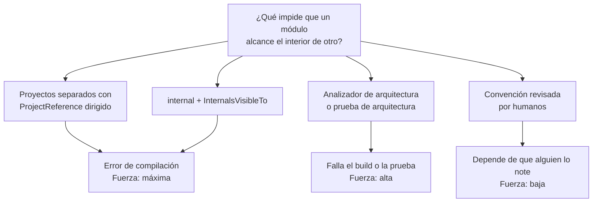

# Monolito modular — `TEM-MODU`

## Resumen ejecutivo

Un monolito modular es una sola unidad desplegable dividida internamente en módulos cuyos límites son explícitos y se hacen cumplir por un mecanismo automático. Conserva las ventajas del despliegue único —transacción local, refactorización verificada por el compilador, depuración de punta a punta— y agrega la propiedad que al monolito sin límites le falta: se puede razonar sobre una parte del sistema sin leer las demás.

La distinción con un monolito cualquiera no está en tener carpetas con nombres de módulo. Está en que exista algo, distinto de la buena voluntad del equipo, que impida a `Facturacion` alcanzar la clase interna de `Reservas`. Sin ese mecanismo, los límites duran hasta la primera fecha de entrega apretada, y su erosión es difícil de detectar porque cada violación individual parece razonable.

Es el modelo que esta guía recomienda como punto de partida para cualquier sistema no trivial, y con más razón si se prevé partirlo en el futuro. Le sirve a `ACT-01` cuando define la estructura y a `ACT-02` cuando trabaja dentro de un módulo y necesita saber qué puede tocar.

---

## Definición

### Qué es

Un sistema con una sola unidad desplegable, organizado en **módulos** que cumplen tres condiciones:

1. Cada módulo tiene una **superficie pública declarada** —un conjunto reducido de tipos por los que se lo consume— y todo lo demás es inaccesible desde afuera.
2. Los límites se **hacen cumplir por un mecanismo automático**: el compilador, un analizador o una compuerta de la canalización. No por convención.
3. Cada módulo es **dueño de sus datos**: las tablas de `Reservas` las escribe `Reservas` y nadie más, aunque estén en la misma base.

La tercera condición es la que menos se aplica y la que más determina si la partición futura será factible. Dos módulos que escriben la misma tabla no son dos módulos.

El término carece de definición canónica única y su uso varía entre autores, condición registrada en la sección 4 de [`ANEXO-REFERENCIAS`](../99-Anexos/Referencias.md). Las tres condiciones anteriores son la definición operativa de esta guía, elegida porque cada una es verificable: se puede abrir un repositorio y comprobar si se cumplen.

### Qué problema resuelve

**La erosión de los límites internos.** En un monolito sin mecanismo de imposición, cada atajo individual es defendible —«necesito este dato y la clase está ahí»— y la suma de atajos defendibles produce una maraña que nadie decidió. El mecanismo automático convierte esa negociación cotidiana en un hecho: no se discute, no compila.

**El costo de entender el sistema.** Con módulos, un desarrollador que trabaja en disponibilidad de salas necesita entender su módulo y las superficies públicas de los que consume. Sin módulos, potencialmente necesita entender todo, porque cualquier cosa puede depender de cualquier cosa.

**El costo de una partición futura.** Extraer un servicio de un monolito modular es reemplazar llamadas en proceso por llamadas de red sobre una superficie que ya está definida y es pequeña. Extraerlo de un monolito sin límites es primero descubrir cuál es la superficie, lo cual puede ocupar meses y suele revelar que no existe.

### Qué NO es, y con qué se lo confunde

**No es «un monolito con carpetas».** Las carpetas no impiden nada. `Reservas/` y `Facturacion/` como carpetas dentro del mismo ensamblado permiten que cualquier clase de una alcance cualquier clase `public` de la otra, y el compilador no dirá nada. Las carpetas son documentación de la intención; el módulo requiere imposición.

**No son microservicios en el mismo proceso.** La diferencia no es solo de despliegue. En un monolito modular las llamadas entre módulos son síncronas, en proceso, dentro de la misma transacción si conviene, y refactorizables por el compilador. Diseñar los módulos como si fueran servicios remotos —contratos serializados, comunicación exclusivamente asíncrona, consistencia eventual entre módulos— paga los costos de la distribución sin recibir sus beneficios.

**No es una arquitectura de capas.** Capas y módulos cortan en direcciones perpendiculares. Las capas separan por naturaleza técnica —dominio, aplicación, infraestructura—; los módulos separan por área funcional. Un monolito modular normalmente tiene ambas cosas: cada módulo tiene sus capas internas. La relación se desarrolla en [`TEM-CAPAS`](../30-Organizacion-Interna/Modelos-de-Capas.md).

**No es Clean Architecture, ni Onion, ni Hexagonal.** Esas son propuestas sobre la dirección de las dependencias dentro de un componente, de origen no normativo (`O-04`, `O-06`, `O-05`) y ninguna es estándar de Microsoft. La modularidad es una decisión sobre el particionado funcional y se combina con cualquiera de ellas o con ninguna.

**No es una etapa obligatoria hacia microservicios.** Muchos sistemas se quedan en monolito modular indefinidamente y esa es la conclusión correcta para la mayoría. La modularidad tiene valor por sí misma, no como preparación.

---

## Cómo se hacen cumplir los límites

Cuatro mecanismos, ordenados de mayor a menor fuerza. Se combinan; no compiten.



### Proyectos separados con referencias dirigidas

El mecanismo más fuerte y el más simple de explicar: si el `.csproj` de `Facturacion` no tiene un `ProjectReference` al de `Reservas`, el código de facturación no puede nombrar ningún tipo de reservas. No es una regla que alguien deba recordar; es una imposibilidad. Los nombres siguen el árbol canónico que este documento presenta más abajo, en «Estructura de un monolito modular con proyectos».

```xml
<!-- src/Modulos/Facturacion/MiEmpresa.Reservas.Facturacion/
     MiEmpresa.Reservas.Facturacion.csproj — ejemplo sintético -->
<Project Sdk="Microsoft.NET.Sdk">
  <ItemGroup>
    <!-- Solo el contrato público de Reservas, no su implementación -->
    <ProjectReference Include="../../Reservas/MiEmpresa.Reservas.Agenda.Contratos/MiEmpresa.Reservas.Agenda.Contratos.csproj" />
  </ItemGroup>
</Project>
```

El patrón que hace fuerte a este mecanismo es la separación entre el proyecto de contrato y el de implementación. `Facturacion` referencia `Reservas.Contratos`, que contiene interfaces y tipos de datos; la implementación vive en `Reservas` y solo la conoce el arranque de la aplicación, que registra la resolución en el contenedor de dependencias. El acoplamiento queda acotado a lo que el contrato declara.

El costo es real y hay que declararlo: más proyectos significan compilación más lenta, más archivos de configuración y más ceremonia para mover una clase de lugar. La discusión sobre cuándo un límite merece un proyecto está en [`TEM-CVP`](../30-Organizacion-Interna/Carpetas-o-Proyectos.md).

### `internal` con `InternalsVisibleTo`

Dentro de un ensamblado, `internal` restringe el acceso al propio ensamblado. Combinado con la disciplina de marcar `public` **solo** lo que constituye la superficie del módulo, produce un límite verificado por el compilador sin necesidad de partir en proyectos —siempre que cada módulo sea su propio ensamblado.

```csharp
// src/Modulos/Agenda/MiEmpresa.Reservas.Agenda/ → ensamblado MiEmpresa.Reservas.Agenda

// Superficie pública del módulo: lo único que otros módulos pueden nombrar
public interface IServicioReservas
{
    Task<ResultadoReserva> ConfirmarAsync(SolicitudReserva solicitud, CancellationToken ct);
}

public sealed record SolicitudReserva(Guid SalaId, RangoHorario Periodo, string Solicitante);

// Todo lo demás, inaccesible desde afuera del módulo
internal sealed class ServicioReservas : IServicioReservas { /* … */ }
internal sealed class PoliticaSolapamiento { /* … */ }
internal sealed class ReservasDbContext : DbContext { /* … */ }
```

`InternalsVisibleTo` abre una excepción dirigida, y su uso legítimo casi exclusivo es el proyecto de pruebas del propio módulo:

```xml
<ItemGroup>
  <InternalsVisibleTo Include="MiEmpresa.Reservas.Agenda.Tests" />
</ItemGroup>
```

Un `InternalsVisibleTo` que apunta a **otro módulo** de producción es una señal de alarma: significa que el límite se declaró y después se perforó. Conviene revisarlos periódicamente, porque se agregan para desatascar una situación puntual y quedan para siempre.

### Analizadores y pruebas de arquitectura

Cuando los módulos conviven en un mismo ensamblado —arreglo legítimo en sistemas medianos, donde partir en proyectos no compensa— el compilador no puede distinguirlos y hace falta una verificación externa. Dos formas: un analizador de Roslyn con reglas de dependencia entre espacios de nombres, o una prueba automatizada que inspeccione los ensamblados y falle si detecta una dependencia prohibida.

```csharp
// tests/Arquitectura/ReglasDeModulos.cs — ejemplo sintético, esquema del enfoque
[Fact]
public void Facturacion_no_depende_del_interior_de_Reservas()
{
    var violaciones = AnalizadorDeDependencias
        .Para(typeof(Program).Assembly)
        .DesdeEspacioDeNombres("MiEmpresa.Reservas.Facturacion")
        .HaciaEspacioDeNombres("MiEmpresa.Reservas.Agenda")
        .ExcluyendoEspacioDeNombres("MiEmpresa.Reservas.Agenda.Contratos")
        .Violaciones();

    Assert.Empty(violaciones);
}
```

Es más débil que la referencia dirigida —falla después de compilar, no durante— pero mucho más fuerte que la convención, porque bloquea la integración. Existen bibliotecas del ecosistema que implementan este tipo de aserción; esta guía no recomienda ninguna en particular y el enfoque se muestra como esquema.

### Convención revisada

La forma más débil: se acuerda qué puede llamar a qué, se documenta, y `ACT-04` lo verifica en la revisión. Funciona en equipos pequeños y estables, y falla exactamente cuando más se la necesita —bajo presión de entrega y con gente nueva.

**Esta guía recomienda** no apoyarse solo en este mecanismo para ningún límite que se considere importante. El criterio de [`MARCO-ACTORES`](../00-Marco-de-Referencia/Actores.md) aplica sin cambios: una regla que depende de que un humano la recuerde tiene rendimiento bajo.

---

## Comunicación entre módulos

Tres modos, con perfiles distintos de acoplamiento y de costo.

**Llamada directa a la interfaz pública.** El módulo consumidor recibe `IServicioReservas` por inyección de dependencias y lo invoca. Síncrono, transaccional, refactorizable por el compilador, con la pila de llamadas completa al depurar. Es el modo por defecto y el que esta guía recomienda mientras no haya una razón concreta para otro.

**Mediador en proceso.** El consumidor envía un mensaje a un despachador que resuelve el destinatario. Desacopla al consumidor del tipo concreto del proveedor, a cambio de que el compilador deje de mostrar quién llama a quién: encontrar el manejador de un mensaje pasa a requerir una búsqueda por texto. Es un intercambio real y conviene hacerlo a sabiendas. Aporta valor cuando hay comportamiento transversal —registro, validación, transacciones— que se quiere aplicar de manera uniforme mediante un canal de procesamiento.

**Eventos en proceso.** El módulo emisor publica un hecho consumado —`ReservaConfirmada`— y no sabe quién lo escucha ni si alguien lo hace. Es el acoplamiento más bajo posible y el modo natural para las reacciones secundarias: notificar, auditar, actualizar una proyección de lectura.

Tiene una trampa que conviene enunciar. Un evento en proceso puede manejarse dentro de la misma transacción que la operación que lo originó, y entonces mantiene la atomicidad; o después de confirmar, y entonces introduce consistencia eventual dentro del monolito. La segunda opción es a veces deseable —aísla al emisor de las fallas del consumidor— pero es una decisión con consecuencias observables por el usuario y merece un ADR, no una decisión por defecto del marco que se esté usando.

```csharp
// Application/ConfirmarReserva.cs — ejemplo sintético
// Llamada directa para lo que debe ser atómico; evento para lo secundario.
public async Task<ResultadoReserva> EjecutarAsync(SolicitudReserva s, CancellationToken ct)
{
    var resultado = await _reservas.ConfirmarAsync(s, ct);   // directa, dentro de la transacción
    if (!resultado.EsExitoso) return resultado;

    await _eventos.PublicarAsync(new ReservaConfirmada(resultado.ReservaId), ct); // secundario
    return resultado;
}
```

Regla práctica: **lo que debe pasar o no pasar junto con la operación va por llamada directa; lo que puede pasar después va por evento.** Elegir el evento para lo primero traslada un problema de consistencia al usuario a cambio de una elegancia que nadie percibe.

---

## Por qué es el punto medio que más rinde

El argumento se ve mejor con las tres opciones juntas, sobre las dimensiones que efectivamente cambian.

| Dimensión | Monolito sin límites | **Monolito modular** | Microservicios |
|---|---|---|---|
| Unidades desplegables | 1 | 1 | N |
| Quién verifica los límites | Nadie | **Compilador o analizador** | Nadie automáticamente |
| Transacción entre áreas | ACID local | **ACID local** | Saga y compensación |
| Refactorización entre áreas | Verificada por el compilador | **Verificada por el compilador** | Manual, con versionado de contratos |
| Costo operativo | Bajo | **Bajo** | Alto y permanente |
| Escalar un área sola | No | No | Sí |
| Equipos autónomos al desplegar | No | No | Sí |
| Costo de partir después | Muy alto | **Acotado** | Ya está partido |

Las dos columnas extremas ganan cada una en un conjunto de dimensiones. La columna del medio conserva todo lo que hace barato al monolito y compra la única cosa que el monolito sin límites no tiene: la capacidad de razonar por partes y de partirse después con costo previsible. Lo que **no** compra es escalado diferencial ni autonomía de despliegue, y si el sistema necesita cualquiera de esas dos cosas de forma medida, este modelo no alcanza.

De ahí la posición sobre el punto de partida. Si existe alguna probabilidad de tener que partir el sistema, el trabajo que abarata esa partición es exactamente el que define este modelo: establecer los límites y hacerlos cumplir. Ese trabajo tiene valor propio aunque la partición nunca ocurra, lo cual lo distingue de otras preparaciones especulativas que solo pagan si la hipótesis se cumple.

---

## Aplicación por escenario

### `ESC-1` — Sistema nuevo

El punto de partida que esta guía recomienda para todo sistema que exceda lo trivial. Dos precisiones sobre cómo arrancar sin sobredimensionar.

Los módulos iniciales se derivan del dominio, no de la técnica: `Reservas`, `Salas`, `Notificaciones` son módulos; `Servicios`, `Repositorios`, `Modelos` son capas y no cortan por donde el sistema cambia. Y conviene empezar con **pocos**: tres o cuatro módulos gruesos se subdividen después con costo bajo, mientras que doce módulos finos definidos antes de conocer el dominio se convierten en doce límites en lugares equivocados que hay que ir perforando.

El mecanismo de imposición se elige al arrancar y se instala el primer día, **para los límites entre módulos de dominio** —que `Facturacion` no alcance el interior de `Reservas`—. Instalarlo después, sobre código que ya cruzó esos límites, convierte una decisión en un proyecto de normalización.

Los límites **entre capas dentro de un módulo** son otra cosa y siguen el criterio diferido de [`TEM-CVP`](../30-Organizacion-Interna/Carpetas-o-Proyectos.md): carpetas primero, proyectos cuando la disciplina haya fallado de forma comprobable. La asimetría tiene una razón. Un límite entre módulos separa áreas del negocio que van a evolucionar en direcciones distintas y cuya erosión es difícil de revertir; un límite entre capas dentro de un módulo se refuerza después con costo bajo, porque mover archivos dentro de un módulo pequeño no arrastra a nadie.

### `ESC-2` — Evolución estructural

Es el escenario donde este modelo aparece como remedio a dos presiones distintas. Frente a un monolito que se volvió difícil de entender, modularizar es la intervención más barata que ataca la causa. Frente a la presión de partir en microservicios, modularizar primero es lo que permite decidir con información: si después de establecer los límites el problema desapareció, no había que partir.

La modularización de un sistema existente se hace por módulo y no de una vez. Se elige el área con el límite más claro, se le da su ensamblado o su proyecto, se declara la superficie mínima que otros consumen, y se activa el mecanismo de imposición para ese límite. Recién entonces se pasa al siguiente. Modularizar los ocho módulos en una sola rama produce un cambio irrevisable que además conflictúa con todo lo demás en curso.

### `ESC-3` — Normalización de código existente

Aplica de forma parcial y con una advertencia. Mover archivos a carpetas con nombre de módulo es normalización de superficie y no produce modularidad: sin cambio en la accesibilidad ni en el mecanismo de imposición, el sistema queda igual pero con la apariencia de estar modularizado, lo cual es peor que antes porque relaja la revisión.

Lo que sí corresponde a este escenario, y rinde: marcar `internal` todo lo que no forma parte de ninguna superficie pública. Es mecánico, lo verifica el compilador, y expone de inmediato el mapa real de dependencias —cada error de compilación señala un consumo que cruza un límite, y esa lista es el inventario de trabajo pendiente.

### `ESC-4` — Evaluación de código ajeno

La pregunta que separa un monolito modular real de uno declarado: **¿qué pasa si escribo, en el módulo A, una referencia a un tipo interno del módulo B?** Si compila, no hay módulos. Es una prueba de un minuto y decide la evaluación.

Como verificaciones adicionales: cuántos tipos `public` tiene cada módulo —una superficie de ciento veinte tipos no es una superficie—, cuántos `InternalsVisibleTo` apuntan a proyectos de producción, y si dos módulos escriben las mismas tablas.

### Qué cambia según el contexto

| Contexto | Qué cambia |
|---|---|
| `CTX-1` Web/cliente | La UI es transversal a los módulos y ese es el problema específico. Un componente Blazor de reservas debería consumir la superficie pública del módulo, no su interior; conviene decidir si los componentes viven dentro de su módulo o en un área de presentación común, y sostener la elección |
| `CTX-2` Servicio/API | Encaja de forma natural: cada módulo aporta sus *endpoints* y el arranque los compone. Es el arreglo que más facilita una extracción posterior, porque el contrato HTTP del módulo ya existe y ya está en uso |
| `CTX-3` Biblioteca | Los módulos corresponden a paquetes o a ensamblados dentro de un paquete, y la superficie pública deja de ser una convención interna para volverse contrato con terceros. `internal` cambia de naturaleza: acá es lo que permite evolucionar sin romper a nadie |
| `CTX-4` Distribuida | No aplica por definición —hay más de una unidad desplegable—, pero cada servicio de una solución distribuida es internamente un monolito, y todo lo de este documento aplica dentro de él |

---

## Ejemplos concretos

El ejemplo usa el **plano estructural en español** —`Modulos/`, `Nucleo/`, `Contratos/`—, una de las dos variantes que [`TEM-MODELOS`](../30-Organizacion-Interna/Modelos-y-Contratos.md) admite.

Nótese que el módulo de reservas se llama `Agenda` y no `Reservas`. No es un capricho: el producto ya se llama `Reservas`, y un módulo homónimo del producto produce nombres como `MiEmpresa.Reservas.Reservas`, que se leen mal y obligan a mirar dos veces para saber cuál segmento es cuál. Cuando el módulo central comparte nombre con el sistema, conviene nombrarlo por su contexto —la agenda, el calendario, el turnero— antes que repetir.

### Estructura de un monolito modular con proyectos

Ejemplo sintético del sistema de reserva de salas, con cuatro módulos y contratos separados. El prefijo `MiEmpresa.Reservas` nombra al sistema y `Reservas` vuelve a aparecer como nombre de módulo: la repetición es correcta y refleja que el módulo central del sistema comparte su nombre.

```text
Reservas.slnx
├── src/
│   ├── MiEmpresa.Reservas.Host/                            ← ÚNICA unidad desplegable (Sdk.Web)
│   │   └── Program.cs                                      ← compone los módulos; el único que los conoce a todos
│   ├── Modulos/
│   │   ├── Agenda/
│   │   │   ├── MiEmpresa.Reservas.Agenda.Contratos/       ← superficie pública
│   │   │   └── MiEmpresa.Reservas.Agenda/                 ← implementación, todo internal
│   │   ├── Salas/
│   │   │   ├── MiEmpresa.Reservas.Salas.Contratos/
│   │   │   └── MiEmpresa.Reservas.Salas/
│   │   ├── Facturacion/
│   │   │   ├── MiEmpresa.Reservas.Facturacion.Contratos/
│   │   │   └── MiEmpresa.Reservas.Facturacion/             ← consume Reservas.Contratos
│   │   └── Notificaciones/
│   │       ├── MiEmpresa.Reservas.Notificaciones.Contratos/
│   │       └── MiEmpresa.Reservas.Notificaciones/
│   └── Compartido/
│       └── MiEmpresa.Reservas.Nucleo/                      ← tipos base sin lógica de dominio
└── tests/
    ├── MiEmpresa.Reservas.Agenda.Tests/
    └── MiEmpresa.Reservas.Arquitectura.Tests/              ← verifica las reglas de dependencia
```

La regla de referencias que sostiene la estructura: un módulo puede referenciar `*.Contratos` de otro módulo y `Nucleo`; nunca la implementación de otro módulo. Solo `Host` referencia implementaciones, y por eso es el único lugar donde una dependencia mal puesta puede pasar inadvertida —conviene que sea corto.

`Compartido/Nucleo` es el punto de fuga de este diseño. Todo lo que se pone ahí lo ven todos los módulos, así que cualquier cosa incómoda de ubicar tiende a terminar en `Nucleo` y a convertirlo en el acoplamiento común que la estructura pretendía evitar. **Esta guía recomienda** tratar cada incorporación a `Nucleo` como una excepción que se justifica, y revisar su contenido periódicamente.

### Registro de un módulo en el arranque

```csharp
// src/Modulos/Agenda/MiEmpresa.Reservas.Agenda/RegistroDelModulo.cs — ejemplo sintético
// Único tipo public de la implementación: el punto de composición.
public static class RegistroDelModuloReservas
{
    public static IServiceCollection AgregarModuloReservas(
        this IServiceCollection servicios,
        IConfiguration configuracion)
    {
        servicios.AddDbContext<ReservasDbContext>(o =>
            o.UseSqlServer(configuracion.GetConnectionString("Reservas"),
                sql => sql.MigrationsHistoryTable("__Migraciones", "reservas")));

        servicios.AddScoped<IServicioReservas, ServicioReservas>();
        servicios.AddScoped<PoliticaSolapamiento>();   // internal: nadie más puede pedirlo
        return servicios;
    }
}
```

```csharp
// src/MiEmpresa.Reservas.Host/Program.cs — ejemplo sintético
var builder = WebApplication.CreateBuilder(args);

builder.Services.AgregarModuloReservas(builder.Configuration);
builder.Services.AgregarModuloSalas(builder.Configuration);
builder.Services.AgregarModuloNotificaciones(builder.Configuration);

var app = builder.Build();
app.MapearEndpointsDeReservas();
app.MapearEndpointsDeSalas();
app.Run();
```

Dos cosas que este arranque demuestra. Cada módulo controla su propio registro, de modo que agregar una dependencia interna no toca ningún archivo compartido. Y el `MigrationsHistoryTable` con esquema propio materializa la propiedad de los datos: cada módulo tiene sus tablas bajo su esquema y sus migraciones separadas, que es lo que después permite mover ese esquema a otra base sin desarmar el resto.

### La propiedad de los datos, en la práctica

```csharp
// MiEmpresa.Reservas.Agenda/ReservasDbContext.cs — ejemplo sintético
internal sealed class ReservasDbContext(DbContextOptions<ReservasDbContext> opciones)
    : DbContext(opciones)
{
    internal DbSet<Reserva> Reservas => Set<Reserva>();

    protected override void OnModelCreating(ModelBuilder modelo)
    {
        modelo.HasDefaultSchema("reservas");

        // La sala se referencia por identificador, sin navegación al modelo de otro módulo.
        // Si hiciera falta el nombre de la sala, se pide por IServicioSalas.
        modelo.Entity<Reserva>().Property(r => r.SalaId).IsRequired();
    }
}
```

La ausencia de una propiedad de navegación a `Sala` es deliberada y es el detalle que más cuesta sostener. Una navegación de EF Core entre entidades de dos módulos los fusiona en la práctica: comparten el `DbContext`, comparten las migraciones y ya no se pueden separar. Referenciar por identificador es incómodo —hay que hacer una llamada más para obtener el nombre— y es lo que mantiene el límite real.

---

## Preguntas guía

1. Si escribo en un módulo una referencia al interior de otro, ¿qué la rechaza, y cuándo —al compilar, al integrar, o solo si un revisor lo nota?
2. ¿Cuántos tipos `public` expone cada módulo? ¿Puedo enumerar la superficie de uno sin abrir el proyecto?
3. ¿Qué módulo es dueño de cada tabla? ¿Hay alguna que escriban dos?
4. ¿Los nombres de los módulos son términos del dominio o categorías técnicas?
5. ¿Cuántos `InternalsVisibleTo` apuntan a proyectos de producción, y sigue vigente la razón de cada uno?
6. Para cada comunicación entre módulos: ¿está bien que sea llamada directa, o el evento asíncrono introdujo consistencia eventual que alguien tendrá que explicarle a un usuario?
7. ¿Qué contiene `Nucleo` hoy, y cuánto de eso es lógica de dominio que pertenece a un módulo?
8. Si hubiera que extraer un módulo a servicio, ¿cuál es y qué habría que desarmar primero?

---

## Criterios de calidad

**El límite falla el *build*, no la revisión.** La prueba de un minuto: escribir una dependencia prohibida y comprobar que algo la rechaza automáticamente.

**La superficie pública de cada módulo es pequeña y estable.** Del orden de unos pocos tipos por módulo. Una superficie que crece en cada iteración indica que el límite está en el lugar equivocado o que no se está sosteniendo.

**Cada tabla tiene un módulo dueño.** Se puede nombrar sin ambigüedad. Si dos módulos escriben la misma tabla, hay un solo módulo repartido en dos carpetas.

**Los módulos corresponden a áreas del dominio.** Sus nombres los reconocería alguien de negocio. `Reservas` y `Facturacion` sí; `Servicios` y `Utilidades` no.

**Las excepciones están registradas y son pocas.** Cada `InternalsVisibleTo` hacia producción y cada regla de arquitectura suprimida tiene un motivo escrito y una fecha.

### Antipatrones

**El módulo decorativo.** Carpetas con nombre de módulo y ningún mecanismo de imposición. Todo es `public`, todo se alcanza, y el diagrama de arquitectura describe un sistema que no existe. Es el antipatrón más frecuente de este tema y el más difícil de detectar desde un documento: solo se ve mirando el código.

**El módulo compartido que se traga todo.** `Nucleo`, `Comun` o `Compartido` crece hasta contener lógica de dominio de varios módulos. Como todos dependen de él, cualquier cambio ahí afecta a todos, y el acoplamiento que los módulos evitaban directamente reaparece a través del centro. Síntoma: `Nucleo` tiene más tipos que cualquier módulo.

**La base de datos compartida sin dueño.** Los módulos existen en el código y comparten tablas sin propietario definido. Una migración de un módulo rompe a otro. Es la condición que hace imposible la extracción posterior, y por eso conviene tratarla antes que ninguna otra.

**El módulo distribuido antes de tiempo.** Módulos que se comunican solo por eventos asíncronos, con consistencia eventual entre ellos, dentro del mismo proceso. Paga la complejidad de la distribución —estados intermedios, reintentos, orden de llegada— sin obtener despliegue ni escalado independientes. Suele justificarse como preparación para una partición futura que en la mayoría de los casos no llega.

**El límite perforado por conveniencia.** Un `InternalsVisibleTo` entre dos módulos de producción, o una regla de arquitectura suprimida con `#pragma`. Cada perforación individual se agregó por una razón puntual y ninguna se retiró. Contarlas es una medida directa de la salud de los límites.

**La modularidad sin dueño.** Los módulos existen pero nadie responde por ninguno. Sin `ACT-02` o un equipo asignado por módulo, la superficie pública crece por acumulación y no la revisa nadie con criterio de conjunto.
