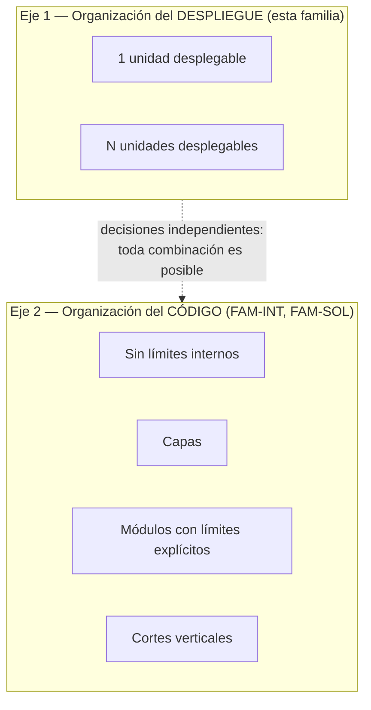

# Arquitectura de servicios — `FAM-SRV`

## Resumen ejecutivo

Un sistema tiene dos organizaciones simultáneas y con frecuencia se las trata como una sola. La primera responde a **cuántas unidades desplegables** existen: un ejecutable que se publica entero, o siete servicios que se publican por separado. La segunda responde a **cómo está ordenado el código**: cuántas capas, qué carpetas, qué proyectos, en qué dirección apuntan las dependencias. Son ejes independientes, y toda combinación entre ellos es realizable.

Existe código perfectamente ordenado —dominio separado, dependencias en una sola dirección, límites explícitos— dentro de una única unidad desplegable. Existe también un conjunto de once microservicios cuyo interior es un revoltijo sin capas y con reglas de negocio repartidas entre controladores. El primero es un monolito bien organizado. El segundo es un desastre desplegado once veces. Ninguna de las dos cosas se deduce de la otra.

Esta familia trata exclusivamente el primer eje: la organización del despliegue. La organización del código vive en [`FAM-INT`](../30-Organizacion-Interna/README.md), y la de la solución y sus proyectos en [`FAM-SOL`](../20-Organizacion-de-Soluciones/README.md). Le sirve sobre todo a `ACT-01`, que responde por esta decisión, y a `ACT-03` y `ACT-05`, que conviven con sus consecuencias todos los días.

---

## La confusión que esta familia existe para deshacer

«Vamos a microservicios para ordenar el código» es una frase que se escucha en reuniones reales y que no tiene sentido técnico. Partir el despliegue no ordena nada: toma el desorden existente y lo distribuye sobre la red, donde el compilador ya no puede señalarlo. Un método mal ubicado dentro de un ensamblado produce un aviso del analizador; el mismo método mal ubicado detrás de una llamada HTTP produce un acoplamiento invisible que nadie registra hasta que un despliegue rompe otro servicio.

La relación causal corre exactamente al revés de como se la suele enunciar. Ordenar el código —establecer módulos con límites explícitos y hacerlos cumplir— es lo que después habilita partir el despliegue con costo razonable. Sin ese trabajo previo, la partición produce un monolito distribuido: los mismos acoplamientos de antes, ahora con latencia de red, fallas parciales y consistencia eventual encima.

Cuatro combinaciones que conviene tener presentes, porque las cuatro se encuentran en producción:

| Despliegue | Código | Nombre habitual | Diagnóstico |
|---|---|---|---|
| 1 unidad | sin límites internos | «el monolito» en sentido peyorativo | Funciona; se degrada con el tamaño |
| 1 unidad | módulos con límites | monolito modular | El punto medio de mejor rendimiento |
| N unidades | módulos con límites y datos propios | microservicios | Caro, y a veces necesario |
| N unidades | sin límites, base de datos compartida | **monolito distribuido** | Todos los costos, ninguno de los beneficios |

La cuarta fila es el resultado característico de confundir los dos ejes.

---

## Documentos de la familia

| ID | Documento | Qué resuelve |
|----|-----------|--------------|
| [`TEM-MONO`](Monolito.md) | Monolito | Qué es una unidad desplegable única, qué ventajas concretas ofrece y por qué es una elección por defecto defendible en lugar de un fracaso |
| [`TEM-MODU`](Monolito-Modular.md) | Monolito modular | Cómo se establecen y se hacen cumplir límites entre módulos dentro de un mismo despliegue, con los mecanismos que ofrece .NET |
| [`TEM-MICRO`](Microservicios.md) | Microservicios | Qué problemas resuelve la partición del despliegue, qué costos impone, y cómo se reconoce el monolito distribuido |
| [`TEM-PART`](Criterios-de-Particion.md) | Criterios de partición | El documento de decisión: criterios verificables para partir o no partir, y cómo extraer un servicio de forma incremental |

El orden de lectura es el de la tabla. `TEM-PART` presupone los tres anteriores y es donde la familia se vuelve operativa: los primeros describen modelos, el último elige entre ellos.

---

## Cómo se relaciona con el resto de la guía

**Con el marco.** El modelo de despliegue es lo que define `CTX-4` en [`MARCO-CONTEXTOS`](../00-Marco-de-Referencia/Contextos.md): más de una unidad desplegable comunicándose por red, con el efecto de que los límites dejan de ser verificables por el compilador. La decisión pertenece a `ACT-01` según la matriz de [`MARCO-ACTORES`](../00-Marco-de-Referencia/Actores.md), y se concentra en `ESC-1` y `ESC-2`.

**Con la organización de la solución.** Una unidad desplegable no equivale a un proyecto `.csproj`. Un monolito modular puede tener nueve proyectos y publicar un solo ejecutable; un microservicio puede consistir en un único proyecto. La correspondencia entre proyectos y artefactos publicados se desarrolla en [`TEM-SLN`](../20-Organizacion-de-Soluciones/Estructura-de-Solucion.md).

**Con la organización interna.** Los modelos de capas ([`TEM-CAPAS`](../30-Organizacion-Interna/Modelos-de-Capas.md)) y el corte vertical ([`TEM-SLICE`](../30-Organizacion-Interna/Vertical-Slice.md)) se aplican dentro de cualquiera de los tres modelos de despliegue. Es la manifestación práctica de la independencia entre ejes: elegir Clean Architecture no dice nada sobre cuántos servicios habrá, y elegir microservicios no dice nada sobre cómo se ordena cada uno por dentro.

**Con las referencias.** `N-12` es la fuente normativa de Microsoft que cubre el contraste entre monolito y microservicios; se cita en `TEM-MONO`, `TEM-MICRO` y `TEM-PART`. El término «monolito modular» carece de definición canónica única, condición registrada en la sección 4 de [`ANEXO-REFERENCIAS`](../99-Anexos/Referencias.md); `TEM-MODU` fija la definición operativa que usa esta guía.

---

## Advertencia sobre el costo de revertir

De todas las decisiones que trata la guía, la de esta familia es la más cara de deshacer, y su asimetría merece enunciarse. Partir un monolito modular en servicios es trabajo acotado y planificable: los límites ya existen y solo cambia el medio de comunicación. Reunificar dos servicios cuyas bases de datos ya divergieron —con esquemas distintos, identificadores que no coinciden y datos duplicados que se desincronizaron— es un proyecto de migración de datos con riesgo de pérdida.

De ahí la posición que esta guía sostiene y que `TEM-PART` desarrolla: la partición se pospone hasta tener un criterio verificable que la exija, y hasta entonces se invierte en los límites internos, que son lo que abarata la partición si termina haciendo falta.
