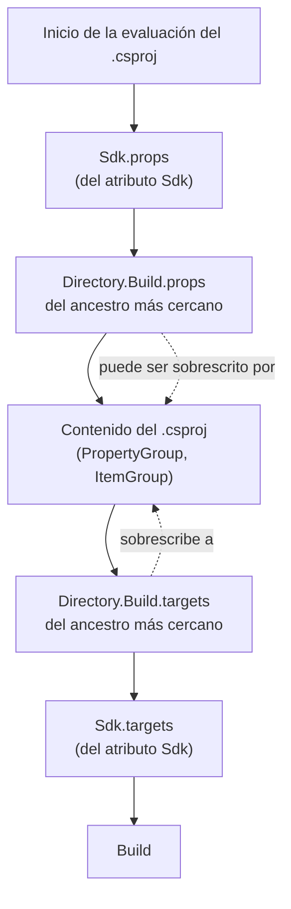

# Build compartido — `TEM-BUILD`

## Resumen ejecutivo

En una solución de seis proyectos, seis `.csproj` declaran el mismo `TargetFramework`, el mismo `Nullable`, y probablemente cinco versiones distintas del mismo paquete porque nadie sincronizó la sexta. El problema no es de disciplina: es que el lugar donde se declara la información obliga a repetirla. MSBuild y NuGet ofrecen desde hace años mecanismos para declararla una sola vez, y este documento trata cuáles son, dónde se colocan y qué conviene poner en cada uno.

Cuatro archivos concentran casi todo. `Directory.Build.props` y su contraparte `.targets` para propiedades y destinos de MSBuild (`N-09`). `Directory.Packages.props` para las versiones de paquete (`N-08`). `global.json` para la versión del SDK con la que se compila (`N-13`). Los cuatro están documentados por Microsoft (`N-09`, `N-08`, `N-13`); su aplicación concreta —qué poner en cada uno— es donde entra el criterio.

Es el documento más accionable de la familia y el de mayor rendimiento inmediato. Su destinatario natural es `ACT-05`, que es quien decide dónde se verifica cada regla y con qué severidad, en coordinación con `ACT-03`, que decide cuál es la regla. Un equipo que adopta estos cuatro archivos en un repositorio que no los tenía elimina en una tarde una clase entera de defectos que venía combatiendo de a uno.

---

## Definición

### Qué es

Un conjunto de archivos ubicados en carpetas ancestro de los proyectos, que MSBuild y NuGet localizan y aplican automáticamente sin que ningún `.csproj` los mencione. La propiedad que los hace funcionar es el descubrimiento por recorrido ascendente del árbol de directorios: cada proyecto, al evaluarse, busca hacia arriba desde su propia carpeta.

Esa mecánica tiene una consecuencia que conviene retener desde el principio: **el alcance de estos archivos lo determina su posición en el árbol de carpetas, no la solución**. Un proyecto que no está declarado en el `.slnx` hereda igual el `Directory.Build.props` de la raíz, porque MSBuild nunca miró la solución.

### Qué problema resuelve

**La divergencia silenciosa.** Cinco proyectos con `Newtonsoft.Json` en versiones 13.0.1, 13.0.2 y 13.0.3. Compila, y en tiempo de ejecución gana una sola —la que resuelva la unificación de NuGet— de modo que cuatro proyectos se probaron contra un binario y ejecutan contra otro. El defecto que esto produce es difícil de diagnosticar porque el código no lo muestra.

**La actualización de a uno.** Subir la versión de un paquete que usan ocho proyectos son ocho ediciones, y la novena vez alguien se olvida de una.

**La configuración desigual.** Un analizador activo en cuatro proyectos y ausente en el quinto. El análisis se corta en el límite del proyecto sin que nada lo señale, y el proyecto sin cobertura suele ser el más viejo, que es el que más la necesitaba.

**La irreproducibilidad del build.** Dos máquinas con SDK distintos producen resultados distintos: propiedades cuyo valor predeterminado cambió entre versiones, analizadores nuevos que aparecen como avisos, comportamiento de publicación que difiere. Un build que funciona en una máquina y falla en la canalización con el mismo commit es casi siempre esto.

### Qué NO es, y con qué se confunde

**No es un sistema de plantillas.** Estos archivos aplican a todo proyecto bajo su carpeta, sin excepción ni opción de no participar salvo condicionando explícitamente. Poner algo ahí es una decisión de alcance total.

**No es el lugar de todo lo común.** Una referencia de paquete en `Directory.Build.props` la reciben todos los proyectos del árbol, incluidos los que no la necesitan, y eso infla el grafo de dependencias de artefactos publicados. La distinción entre lo que corresponde y lo que no tiene sección propia más abajo.

**No reemplaza a `.editorconfig`.** Se confunden porque ambos viven en la raíz y ambos configuran análisis. `Directory.Build.props` declara propiedades de MSBuild —incluido si el análisis de estilo se ejecuta en el build—; `.editorconfig` declara qué reglas de estilo rigen y con qué severidad. Son complementarios y el desarrollo del segundo está en [`TEM-AUTO`](../50-Estilo-de-Codificacion/Automatizacion-del-Estilo.md).

---

## `Directory.Build.props` y `Directory.Build.targets`

### Cómo se encuentran

MSBuild parte de la carpeta del `.csproj` y sube por el árbol de directorios hasta encontrar el primer `Directory.Build.props`. Al encontrarlo, **deja de buscar** (`N-09`). No se acumulan: si hay uno en `src/MiEmpresa.Reservas.Web/` y otro en la raíz, el proyecto ve solo el primero.

Ese detalle es la causa del error más frecuente con estos archivos. Alguien agrega un `Directory.Build.props` en una subcarpeta para configurar un grupo de proyectos y, sin advertirlo, corta la herencia de todo lo que la raíz declaraba. El mecanismo para encadenar es explícito: el archivo interno importa el externo antes de agregar lo suyo.

```xml
<Project>

  <!-- Importa el Directory.Build.props del ancestro más cercano hacia arriba.
       Sin esta línea, este archivo REEMPLAZA al de la raíz para estos proyectos. -->
  <Import Project="$([MSBuild]::GetPathOfFileAbove('Directory.Build.props', '$(MSBuildThisFileDirectory)../'))" />

  <PropertyGroup>
    <IsPackable>false</IsPackable>
  </PropertyGroup>

</Project>
```

Un `Directory.Build.props` colocado en `tests/` con este contenido alcanza a todos los proyectos de prueba y a ninguno de producto, sin enumerar nada. Es el beneficio concreto de mantener los tests agrupados en una carpeta de la raíz en lugar de anidarlos junto a cada componente, que es la decisión que [`TEM-SLN`](Estructura-de-Solucion.md) discute: la disposición de carpetas determina qué alcances se pueden expresar sin escribir condiciones.

### `.props` y `.targets`: por qué son dos

La diferencia está en el momento de importación, y determina qué se puede escribir en cada uno.

`Directory.Build.props` se importa **al principio**, antes del contenido del `.csproj`. Lo que declara ahí puede ser sobrescrito por el proyecto, que es exactamente lo que se busca: valores predeterminados que un proyecto particular puede cambiar.

`Directory.Build.targets` se importa **al final**, después del contenido del `.csproj`. Lo que declara ahí gana sobre lo que el proyecto haya dicho. Sirve para dos cosas: destinos personalizados que se ejecutan en el build, y propiedades que se calculan a partir de lo que el proyecto declaró.

El caso que ilustra la distinción: si se quiere que todos los proyectos usen `net10.0` pero que uno pueda elegir otro, va en `.props`. Si se quiere que todos los proyectos que no declararon `Description` reciban una por defecto, hay que leer lo que el proyecto declaró, y eso solo es posible en `.targets`.



### Qué conviene poner, y qué no

Lo que corresponde: propiedades comunes de compilación —`TargetFramework`, `LangVersion`, `Nullable`, `ImplicitUsings`—; configuración de análisis estático —`EnableNETAnalyzers`, `AnalysisLevel`, `AnalysisMode`, `EnforceCodeStyleInBuild`—; metadatos de organización que comparten todos los paquetes —`Authors`, `Company`, licencia, URL del repositorio—; y paquetes de herramienta de build declarados con `PrivateAssets="all"`, que es el caso legítimo de una referencia de paquete global.

Lo que no corresponde: referencias de paquete funcionales. Poner `Microsoft.EntityFrameworkCore` en `Directory.Build.props` se lo entrega al proyecto de dominio que fue diseñado explícitamente para no conocerlo, y destruye en una línea la separación que [`TEM-SDK`](Tipos-de-Proyecto.md) discutía si valía la pena. Tampoco corresponde lo que solo aplica a un proyecto: si hay tres condiciones sobre `$(MSBuildProjectName)`, el archivo está haciendo el trabajo de tres `.csproj`.

La distinción práctica entre una referencia de paquete legítima y una ilegítima en este archivo es si aporta comportamiento de build o comportamiento de ejecución. Un versionador, un analizador o un generador de código son build y no llegan al artefacto publicado si se declaran con `PrivateAssets="all"`. Una biblioteca de acceso a datos es ejecución, y no va acá.

---

## `Directory.Packages.props` — gestión centralizada de paquetes

### Qué hace

Separa **qué paquete usa cada proyecto** de **qué versión usa el repositorio**. Los `.csproj` declaran `<PackageReference Include="..." />` sin atributo `Version`; un único `Directory.Packages.props` en la raíz declara `<PackageVersion Include="..." Version="..." />` para cada paquete (`N-08`).

Se activa con una propiedad:

```xml
<Project>

  <PropertyGroup>
    <ManagePackageVersionsCentrally>true</ManagePackageVersionsCentrally>
  </PropertyGroup>

  <ItemGroup>
    <PackageVersion Include="Microsoft.EntityFrameworkCore.Sqlite" Version="10.0.9" />
    <PackageVersion Include="MudBlazor" Version="9.5.0" />
    <PackageVersion Include="xunit" Version="2.9.3" />
    <PackageVersion Include="xunit.runner.visualstudio" Version="3.1.4" />
    <PackageVersion Include="Microsoft.NET.Test.Sdk" Version="17.14.1" />
    <PackageVersion Include="coverlet.collector" Version="6.0.4" />
    <PackageVersion Include="Nerdbank.GitVersioning" Version="3.7.115" />
  </ItemGroup>

</Project>
```

A partir de ahí, subir una versión es una edición en un archivo, y la divergencia entre proyectos deja de ser posible: si un `.csproj` declara una versión que no está en el archivo central, el build falla.

Disponible desde **NuGet 6.2 y SDK 6.0.300**. Este dato es de **verificación parcial**: proviene de material de divulgación de Microsoft y no se confirmó en la página de referencia de `N-08`, que documenta el mecanismo sin fijar la versión de introducción.

### Anclaje transitivo

La extensión que más resuelve y que menos se conoce. Una dependencia transitiva —un paquete que uno no declaró y que llegó porque otro paquete lo necesita— no tiene versión declarada en ningún lado del repositorio, de modo que una alerta de seguridad sobre ella obliga a agregar una referencia directa artificial solo para forzar la versión parcheada.

El anclaje transitivo lo automatiza:

```xml
<PropertyGroup>
  <ManagePackageVersionsCentrally>true</ManagePackageVersionsCentrally>
  <CentralPackageTransitivePinningEnabled>true</CentralPackageTransitivePinningEnabled>
</PropertyGroup>
```

Con esto activo, un `PackageVersion` declarado para un paquete que ninguno de los proyectos referencia directamente **igualmente fija su versión** si aparece como dependencia transitiva.

El escenario que lo justifica se repite con regularidad. Un aviso de seguridad señala una vulnerabilidad en un paquete que nadie del equipo eligió: llegó como dependencia de segundo o tercer nivel de una biblioteca que sí se declaró, la versión parcheada existe, y el proveedor de la biblioteca intermedia todavía no publicó una versión que la arrastre. Sin anclaje transitivo, la única salida es agregar al `.csproj` una referencia directa a un paquete que el código no usa, con un comentario que explique por qué está ahí; esa referencia queda como deuda, porque nada avisa cuándo dejó de hacer falta y quitarla exige rehacer el análisis. Con anclaje transitivo, la corrección es una línea en el archivo central, en el mismo lugar donde están todas las demás versiones, y el grafo de referencias de cada proyecto sigue diciendo la verdad sobre lo que ese proyecto usa. `N-08` documenta este caso de uso como la razón de existir del mecanismo.

### `VersionOverride`

La válvula de escape. Un proyecto puede declarar una versión distinta de la central:

```xml
<PackageReference Include="Serilog" VersionOverride="4.1.0" />
```

Existe para casos legítimos —un proyecto de migración que necesita convivir temporalmente con una versión anterior, una prueba de compatibilidad— y se convierte en antipatrón apenas se usa por comodidad. Cada `VersionOverride` reintroduce la divergencia que la gestión centralizada eliminó, con el agravante de que ahora está escondida en un `.csproj` que nadie revisa. Esta guía recomienda tratar cada uno como excepción con fecha de vencimiento y comentario que la justifique, y auditarlos periódicamente: la propiedad `CentralPackageVersionOverrideEnabled` en `false` permite prohibirlos por completo cuando el equipo prefiere no discutir caso por caso.

---

## `global.json` — la versión del SDK

Un archivo pequeño con consecuencias grandes. Fija qué versión del SDK de .NET usan todos los comandos ejecutados desde esa carpeta hacia abajo:

```json
{
  "sdk": {
    "version": "10.0.300",
    "rollForward": "latestFeature",
    "allowPrerelease": false
  }
}
```

**`version`** es la versión mínima solicitada. **`rollForward`** decide qué pasa cuando esa versión exacta no está instalada, y es el campo que define el compromiso entre reproducibilidad y practicidad:

| Valor | Comportamiento | Cuándo |
|-------|----------------|--------|
| `disable` | Solo la versión exacta; si no está, error | Máxima reproducibilidad, máxima fricción |
| `patch` | Acepta el parche más alto de la misma banda de funcionalidad | Reproducibilidad alta con tolerancia a correcciones |
| `latestFeature` | Acepta la banda de funcionalidad más alta de la misma versión mayor | Compromiso habitual: no cambia de versión mayor, tolera SDK más nuevos |
| `latestMajor` | Acepta cualquier versión posterior | Prácticamente equivale a no fijar nada |

**`allowPrerelease`** en `false` impide que un SDK de vista previa instalado en la máquina de alguien se use sin querer. Es la fuente de una clase específica de incidente: alguien instala una vista previa para probar algo, y a partir de ahí todos sus builds usan un compilador distinto del que usa el resto del equipo, sin ninguna señal visible.

Sin `global.json`, cada máquina usa el SDK más alto que tenga instalado. Con él, el build es reproducible en el sentido que importa: dos personas con instalaciones distintas obtienen el mismo resultado o un error claro, en lugar de resultados sutilmente distintos.

---

## Los demás archivos de la raíz

**`.editorconfig`.** Declara las reglas de estilo y su severidad, y es donde `ACT-03` materializa las convenciones del equipo. Se desarrolla en [`TEM-AUTO`](../50-Estilo-de-Codificacion/Automatizacion-del-Estilo.md). Lo único que corresponde señalar acá es la relación con `Directory.Build.props`: la propiedad `EnforceCodeStyleInBuild` decide si las reglas de estilo se evalúan durante la compilación, pero **cuáles son esas reglas lo dice `.editorconfig`**. Una sin la otra no hace nada útil.

**`nuget.config`** (`N-14`). Declara de dónde se restauran los paquetes. Su uso más valioso no es agregar una fuente sino restringirlas: `<clear />` antes de declarar las fuentes propias garantiza que la restauración no dependa de la configuración global de cada máquina, que es una diferencia entre entornos difícil de diagnosticar. En organizaciones con fuente privada, el mapeo de fuentes por paquete —qué paquetes se buscan en qué fuente— es además una defensa contra la confusión de dependencias, donde un paquete interno se resuelve desde la fuente pública porque alguien registró ahí el mismo nombre.

**`.gitattributes`.** Normaliza el tratamiento de finales de línea en el repositorio. En equipos con máquinas Windows y Linux, su ausencia produce diffs donde el archivo entero aparece modificado sin que nadie lo haya tocado, y ese ruido termina ocultando cambios reales. También marca qué archivos son binarios para que Git no intente fusionarlos.

**`.git-blame-ignore-revs`.** Lista de commits que las herramientas de atribución deben saltar. Es el complemento indispensable de toda normalización masiva en `ESC-3`: un commit que reformatea cuatrocientos archivos deja a su autor como último modificador de cada línea del repositorio, y `git blame` deja de responder la pregunta para la que existe. Registrar el hash del commit de normalización en este archivo devuelve la atribución a quien escribió el código. Conviene incorporar la entrada en el mismo commit que hace la normalización, porque agregarla después requiere recordar el hash.

### Lista de verificación del andamiaje

Los tres repositorios de referencia de Microsoft —`dotnet/runtime`, `dotnet/aspnetcore` y `dotnet/efcore`, consultados el 2026-07-19 sobre rama `main`— tienen los mismos cinco archivos en la raíz: `Directory.Build.props`, `Directory.Build.targets`, `global.json`, `NuGet.config` y `.editorconfig`. La coincidencia de los tres es lo más parecido a una línea de base que el ecosistema ofrece, y sirve para leer un repositorio ajeno por lo que falta.

| Archivo | Qué gobierna | Qué implica su ausencia |
|---------|--------------|-------------------------|
| `Directory.Build.props` | Propiedades comunes de compilación y análisis (`N-09`) | Cada `.csproj` repite `TargetFramework`, `Nullable` y configuración de analizadores; la próxima subida de marco de destino es una edición por proyecto y la que se olvida no falla el build |
| `Directory.Build.targets` | Propiedades calculadas y destinos personalizados que ganan sobre el `.csproj` (`N-09`) | Menos grave: solo hace falta cuando algo tiene que leer lo que el proyecto declaró. Su ausencia no es un defecto por sí sola |
| `global.json` | Versión del SDK con la que compila cualquiera que clone (`N-13`) | El build no es reproducible entre máquinas; la canalización puede estar usando un SDK distinto del de los desarrolladores, y la diferencia aparece como un fallo que no se replica en local |
| `NuGet.config` | De dónde se restauran los paquetes (`N-14`) | La restauración depende de la configuración global de cada máquina. Sin `<clear />` previo, un origen configurado por alguien en su equipo entra en la resolución sin que el repositorio lo declare |
| `.editorconfig` | Reglas de estilo y su severidad | No hay convenciones acordadas verificables; el análisis de estilo, si está activo, evalúa contra los valores predeterminados del SDK. Se desarrolla en [`TEM-AUTO`](../50-Estilo-de-Codificacion/Automatizacion-del-Estilo.md) |

Falta uno en esa lista, y la omisión es deliberada. `Directory.Packages.props` **no** está en los tres: solo `dotnet/efcore` adopta la gestión centralizada de paquetes; `dotnet/runtime` y `dotnet/aspnetcore` resuelven el mismo problema con el sistema Arcade, que centraliza las versiones en `eng/Versions.props`. Esta guía recomienda `N-08` de todas formas, y conviene ser explícito sobre por qué: la recomendación se apoya en el mecanismo —un único lugar donde consultar cada versión, imposibilidad de divergencia por construcción, anclaje transitivo— y no en un argumento de autoridad por adopción. Dos de los tres repositorios de referencia no lo usan, y decir lo contrario sería inexacto.

Un par de combinaciones vale la pena mirar además de las presencias individuales, y la primera solo se ve desde acá: `EnforceCodeStyleInBuild` se declara en `Directory.Build.props` y las reglas que evalúa se declaran en `.editorconfig`, de modo que la incoherencia entre los dos archivos no aparece leyendo ninguno de ellos por separado. El desarrollo de esa combinación es de [`TEM-AUTO`](../50-Estilo-de-Codificacion/Automatizacion-del-Estilo.md). Y versiones de paquete repetidas literalmente en dos o más `.csproj` no son un defecto presente sino la forma exacta que precede a la divergencia: la próxima actualización hay que aplicarla en cada lugar, y el proyecto que se queda atrás suele ser el que está fuera de la solución, donde `dotnet build` en la raíz no llega a avisar.

---

## Ejemplos concretos

### Caso sintético — reserva de salas, configuración completa

Raíz de un repositorio de reserva de salas con el andamiaje completo, para `CTX-1` en `ESC-1`. Ejemplo sintético.

```text
Reservas/
├── global.json
├── Directory.Build.props
├── Directory.Build.targets
├── Directory.Packages.props
├── .editorconfig
├── nuget.config
├── .gitattributes
├── .git-blame-ignore-revs
├── Reservas.slnx
├── src/…
└── tests/
    └── Directory.Build.props     ← encadena con el de la raíz
```

```xml
<!-- Directory.Build.props (raíz) -->
<Project>

  <PropertyGroup>
    <TargetFramework>net10.0</TargetFramework>
    <LangVersion>latest</LangVersion>
    <Nullable>enable</Nullable>
    <ImplicitUsings>enable</ImplicitUsings>
  </PropertyGroup>

  <PropertyGroup>
    <EnableNETAnalyzers>true</EnableNETAnalyzers>
    <AnalysisLevel>latest</AnalysisLevel>
    <AnalysisMode>Default</AnalysisMode>
    <EnforceCodeStyleInBuild>true</EnforceCodeStyleInBuild>
    <!-- Los avisos rompen el build solo en la canalización, que invoca con -warnaserror.
         Localmente se avisa y no se bloquea. -->
  </PropertyGroup>

  <PropertyGroup>
    <Company>MiEmpresa</Company>
    <Product>Reservas</Product>
  </PropertyGroup>

  <!-- Calcula la versión semántica desde el historial de Git e inyecta los
       atributos de versión en todos los proyectos. Aporta comportamiento de
       build, no de ejecución: PrivateAssets="all" impide que fluya como
       dependencia transitiva al consumidor del ensamblado. -->
  <ItemGroup>
    <PackageReference Include="Nerdbank.GitVersioning" PrivateAssets="all" />
  </ItemGroup>

</Project>
```

Tres decisiones de este archivo merecen leerse despacio, y las tres deberían tener el comentario que las explica.

La primera es de severidad, y es el ejemplo canónico de la distinción entre `ACT-03` y `ACT-05`. Los avisos **no** se tratan como error en el build local, para no penalizar la iteración; la canalización invoca `dotnet build -warnaserror`, de modo que un aviso nuevo bloquea la integración sin entorpecer el trabajo diario. La regla es la misma en ambos lugares; lo que cambia es dónde duele.

La segunda es `AnalysisMode=Default` en lugar de un modo más agresivo. Subir a `Recommended` o `All` en un repositorio que ya tiene código convierte en avisos nuevos convenciones que el equipo viene usando —nombres de prueba con guión bajo, ayudantes estáticos— y eso choca de frente con el criterio de «sin avisos nuevos» que la decisión de severidad acaba de fijar. Contener el modo y subirlo después, regla por regla, es compatible con ambas cosas; subirlo de golpe obliga a elegir cuál de las dos se abandona.

La tercera es la referencia de paquete del versionador. Es el caso legítimo de `PackageReference` en este archivo, y el criterio que lo hace legítimo ya se enunció: aporta comportamiento de build y no llega al artefacto publicado. Vale además como recordatorio del alcance: un proyecto que existe en disco pero no está declarado en el `.slnx` recibe igual esta referencia y todas las propiedades de arriba, porque MSBuild sube por el árbol de directorios y nunca miró la solución.

```xml
<!-- tests/Directory.Build.props -->
<Project>

  <Import Project="$([MSBuild]::GetPathOfFileAbove('Directory.Build.props', '$(MSBuildThisFileDirectory)../'))" />

  <PropertyGroup>
    <IsPackable>false</IsPackable>
    <IsTestProject>true</IsTestProject>
    <!-- El código de prueba no se documenta con XML; el aviso CS1591 no aplica acá. -->
    <NoWarn>$(NoWarn);CS1591</NoWarn>
  </PropertyGroup>

  <ItemGroup>
    <PackageReference Include="Microsoft.NET.Test.Sdk" />
    <PackageReference Include="xunit" />
    <PackageReference Include="xunit.runner.visualstudio" />
    <PackageReference Include="coverlet.collector" />
  </ItemGroup>

</Project>
```

Este segundo archivo hace dos cosas que ningún `.csproj` de prueba necesita repetir: importa explícitamente el de la raíz —sin esa línea, los proyectos de prueba perderían `TargetFramework`, `Nullable` y toda la configuración de análisis— y declara el conjunto de paquetes de prueba sin versión, porque las versiones vienen de `Directory.Packages.props`. Un proyecto de prueba nuevo se reduce entonces a un `.csproj` de siete líneas con el SDK y la referencia al proyecto que prueba.

---

## Aplicación por escenario

### `ESC-1` — Sistema nuevo

Los cuatro archivos se crean el primer día, antes del segundo proyecto. El costo en ese momento es de minutos y el beneficio empieza a acumularse de inmediato; crearlos cuando ya hay ocho `.csproj` con versiones divergentes convierte una tarea de configuración en una de reconciliación.

El orden que esta guía recomienda: `global.json` primero, porque fija el terreno; `Directory.Build.props` con `TargetFramework`, `Nullable` y análisis; `Directory.Packages.props` con `ManagePackageVersionsCentrally` y anclaje transitivo activados desde el arranque, aunque la lista de paquetes esté vacía; y `.editorconfig` acordado con `ACT-03` antes de escribir el primer archivo, porque después se negocia línea por línea.

La decisión de severidad —qué rompe el build local y qué solo la canalización— conviene tomarla explícitamente y no por omisión. Es una decisión de `ACT-05` en consulta con `ACT-03`, y el compromiso descrito en los ejemplos —aviso en local, error en la canalización— es un punto de partida defendible.

### `ESC-2` — Evolución estructural

El disparador típico es el crecimiento del número de proyectos: lo que se toleraba con tres se vuelve inmanejable con nueve. El movimiento habitual es introducir `Directory.Build.props` en subcarpetas para grupos de proyectos con necesidades distintas, y ahí la precaución es una sola y ya se enunció: sin la línea de importación explícita, el archivo nuevo corta la herencia del de la raíz en lugar de extenderla.

El segundo movimiento es la subida de versión mayor del marco de destino. Con `TargetFramework` en `Directory.Build.props` es una edición; sin él es una por proyecto, y la que se olvida no falla el build.

### `ESC-3` — Normalización de código existente

Adoptar gestión centralizada de paquetes sobre un repositorio con versiones divergentes tiene un orden que conviene respetar, porque hacerlo al revés produce un cambio irrevisable.

Primero se reconcilian las versiones **sin** introducir el archivo central: se elige la versión de destino de cada paquete divergente, se actualiza cada `.csproj`, y se verifica que todo compile y que las pruebas pasen. Ese commit tiene riesgo real de comportamiento y merece revisión atenta. Recién entonces, en un commit separado, se crea `Directory.Packages.props` y se quitan los atributos `Version` de los `.csproj`: ese segundo commit es puramente mecánico y no cambia ninguna versión resuelta, de modo que si algo se rompe, el culpable está identificado.

Introducir `Directory.Build.props` sobre proyectos existentes tiene un riesgo específico que conviene anticipar: activar `Nullable` o subir `AnalysisLevel` en la raíz alcanza de golpe a todo el repositorio y puede producir cientos de avisos. La secuencia practicable es introducir el archivo con las propiedades que ya rigen —para verificar que la infraestructura funciona sin cambiar nada— y subir la exigencia después, de a una propiedad y con un commit dedicado a bajar el número de avisos que cada una produce.

Toda normalización masiva que se haga en este escenario deja su hash en `.git-blame-ignore-revs`, en el mismo commit.

### `ESC-4` — Evaluación de código ajeno

Cinco preguntas ordenan la evaluación de la configuración de build de un repositorio ajeno, y las cinco se responden sin hablar con nadie.

¿Hay `global.json`? Sin él, el build no es reproducible entre máquinas y la canalización puede estar compilando con un SDK distinto del de los desarrolladores. ¿Hay `Directory.Packages.props`, o las versiones se repiten? La segunda situación predice divergencia futura, no presente. ¿Hay `.editorconfig`, y las propiedades de análisis en `Directory.Build.props` son coherentes con él? ¿Los avisos son error en algún lado, o el análisis está activo y nadie mira su salida? ¿Hay referencias de paquete funcionales en `Directory.Build.props` que entreguen infraestructura a proyectos que fueron diseñados para no conocerla?

La última tiene una versión rápida: leer las referencias de proyecto declaradas y comprobar si alguna contradice la separación que el nombre de los proyectos anuncia.

---

## Preguntas guía

1. ¿Cuántos lugares hay que editar para subir la versión de un paquete que usan cinco proyectos? Si son cinco, falta `Directory.Packages.props`.
2. ¿Este `Directory.Build.props` de subcarpeta importa el de arriba? Si no, ¿qué perdieron los proyectos que están debajo?
3. ¿Esta propiedad va en `.props` o en `.targets`? ¿Necesito que el proyecto pueda sobrescribirla, o necesito ganarle?
4. ¿Esta referencia de paquete aporta comportamiento de build o de ejecución? Si es de ejecución, no va en `Directory.Build.props`.
5. ¿El build produce el mismo resultado en mi máquina, en la del resto del equipo y en la canalización? ¿Qué lo garantiza además de la costumbre?
6. ¿Qué avisos rompen el build local y cuáles solo la canalización? ¿Fue una decisión o quedó así?
7. ¿Hay dependencias transitivas con vulnerabilidades conocidas ancladas a mano en algún `.csproj`? ¿Está activo el anclaje transitivo?
8. Si normalizo cuatrocientos archivos hoy, ¿el hash del commit queda en `.git-blame-ignore-revs` antes de terminar?
9. ¿Cada propiedad de estos archivos tiene una razón escrita, o alguien la copió de otro repositorio?

---

## Criterios de calidad

Una configuración de build compartido bien resuelta se reconoce por el tamaño de los `.csproj`. Si un proyecto de prueba tiene siete líneas y un proyecto de producto quince, todo lo común está donde corresponde. Si tienen cuarenta cada uno y treinta son idénticas entre proyectos, el trabajo está sin hacer.

Las propiedades concretas: existe un único lugar donde consultar la versión de cada paquete; el build produce el mismo resultado en la máquina de cualquiera y en la canalización; agregar un proyecto nuevo no requiere copiar configuración de otro; toda regla activa tiene alguien que la mira, sea el desarrollador en local o la compuerta en integración continua; y cada decisión de severidad está escrita en un comentario, porque dentro de un año nadie va a recordar por qué `AnalysisMode` no está en `All`.

### Antipatrones

**El `Directory.Build.props` cortado.** Un archivo en una subcarpeta sin la importación explícita del ancestro. Los proyectos bajo esa carpeta pierden en silencio toda la configuración de la raíz, y el síntoma aparece semanas después como un analizador que no dispara donde debería. Es el error más común de esta familia y no produce ningún mensaje.

**El archivo de paquetes global.** Referencias de paquete funcionales en `Directory.Build.props`, entregadas a todos los proyectos. El proyecto de dominio termina con acceso a EF Core, el de contratos con acceso a ASP.NET Core, y las separaciones que costaron una discusión de arquitectura quedan anuladas por una línea de infraestructura de build.

**El `VersionOverride` permanente.** Una excepción declarada como temporal que lleva dos años. Reintroduce la divergencia que la gestión centralizada elimina, y encima la esconde en un lugar donde nadie la busca.

**El `global.json` fósil.** Fija un SDK que ya nadie tiene instalado. Todo desarrollador nuevo choca contra un error en el primer comando, y el remedio de facto —que alguien borre el archivo localmente— es peor que no haberlo tenido.

**La severidad inconsistente.** Análisis activo, avisos que nadie trata como error en ningún lado, y una canalización que compila sin `-warnaserror`. El repositorio acumula avisos hasta el punto en que la salida del build es ilegible, y a partir de ahí el análisis dejó de existir aunque siga ejecutándose.

**La configuración sin comentar.** Un `Directory.Build.props` con quince propiedades y ninguna explicación. Cada una fue una decisión y ninguna es evidente; el primero que necesite cambiar algo va a elegir entre romper algo que no entiende o dejar el archivo intacto para siempre. El contraejemplo es el del ejemplo sintético de este documento: cada decisión de severidad y cada referencia de paquete llevan escrito al lado por qué están, que es la única forma de que dentro de un año alguien pueda revisarlas en lugar de heredarlas.

**El `.editorconfig` ausente con el análisis de estilo activo.** `EnforceCodeStyleInBuild=true` en `Directory.Build.props` sin archivo que declare las reglas. Se nombra acá porque la mitad de la evidencia está en este archivo y la otra mitad en su ausencia, que es la razón por la que nadie la nota; el desarrollo del antipatrón es de [`TEM-AUTO`](../50-Estilo-de-Codificacion/Automatizacion-del-Estilo.md).
