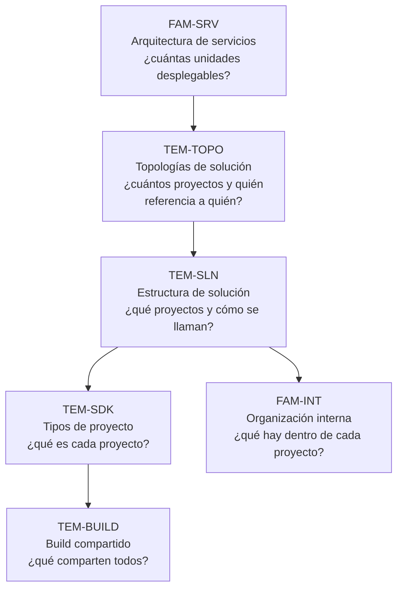

# Organización de soluciones — `FAM-SOL`

## Resumen ejecutivo

Entre la decisión de cuántos procesos desplegar y la decisión de dónde poner una clase hay un nivel intermedio que suele quedar sin dueño: cómo se compone el repositorio. Cuántos proyectos hay, qué SDK usa cada uno, dónde se declaran las versiones de paquetes, con qué versión del SDK compila cualquiera que clone el repositorio. Nada de eso es arquitectura y nada de eso es código; es la infraestructura de construcción sobre la que ambos se apoyan.

Esta familia cubre ese nivel. Se ocupa de cuántos proyectos hay y en qué dirección se referencian ([`TEM-TOPO`](Topologias-de-Solucion.md)), del archivo de solución y de la disposición de carpetas ([`TEM-SLN`](Estructura-de-Solucion.md)), del atributo `Sdk` que determina qué es cada proyecto ([`TEM-SDK`](Tipos-de-Proyecto.md)) y de los archivos que coordinan varios proyectos a la vez ([`TEM-BUILD`](Build-Compartido.md)). Es la familia con mayor proporción de material normativo de la guía: buena parte de lo que se afirma acá está especificado por Microsoft y se cita como tal.

Le sirve sobre todo a `ACT-01` y a `ACT-05`. El arquitecto decide la composición; el ingeniero DevOps decide dónde y con qué severidad se verifica lo que la composición promete. `ACT-02` la consulta menos seguido, pero cuando lo hace suele ser porque algo falló de un modo que el código no explica: una versión de paquete que difiere entre dos proyectos, un analizador que se activa en un proyecto y no en otro, un `dotnet build` que compila menos de lo esperado.

---

## Documentos de la familia

| ID | Documento | Qué resuelve |
|----|-----------|--------------|
| [`TEM-TOPO`](Topologias-de-Solucion.md) | Topologías de solución | Las cinco disposiciones de proyectos y referencias, cuándo la restricción de un consumidor obliga a un proyecto de contratos, y por qué la cantidad de proyectos no determina la cantidad de procesos |
| [`TEM-SLN`](Estructura-de-Solucion.md) | Estructura de solución | Anatomía del repositorio: `.sln` frente a `.slnx`, disposición de carpetas, nombrado de proyectos, qué entra y qué no entra en la solución |
| [`TEM-SDK`](Tipos-de-Proyecto.md) | Tipos de proyecto | El atributo `Sdk` del `.csproj` como definición real del tipo de proyecto; catálogo oficial de SDK y criterio de elección por contexto |
| [`TEM-BUILD`](Build-Compartido.md) | Build compartido | `Directory.Build.props`, `Directory.Packages.props`, `global.json` y los demás archivos que gobiernan varios proyectos desde un único lugar |

---

## Cómo se relacionan entre sí

El orden de lectura sigue el orden de decisión. Primero se resuelve **cuántos** proyectos hay y quién referencia a quién, que es `TEM-TOPO`. Después cómo se disponen en el repositorio y cómo se llaman, que es `TEM-SLN`. Después qué es cada uno, que lo fija el atributo `Sdk` en `TEM-SDK`. Por último qué comparten, que es `TEM-BUILD`.

La división de trabajo entre los cuatro es limpia y conviene retenerla: `TEM-TOPO` es el único que decide la cantidad de proyectos; los otros tres tratan cómo se disponen y se configuran los proyectos que esa decisión produjo. Un cambio de topología —introducir un proyecto de contratos, cortar la referencia del frontal a la API— repercute en los tres, mientras que renombrar una carpeta o centralizar versiones no repercute en la topología. Ahí está también el límite del documento: `TEM-TOPO` fija la disposición de proyectos, pero qué forma toman los datos al cruzar las referencias que esa disposición establece se trata en [`TEM-MODELOS`](../30-Organizacion-Interna/Modelos-y-Contratos.md), en la familia siguiente.

La dependencia más fuerte va en la dirección inversa a la lectura. `TEM-BUILD` solo tiene sentido cuando hay más de un proyecto, y su valor crece con el número de proyectos que gobierna; un repositorio de un solo `.csproj` puede prescindir de `Directory.Build.props` sin perder nada. Esa es la razón por la que el documento más accionable de la familia es también el último: las decisiones que describe se toman cuando la estructura ya existe y empieza a doler mantenerla sincronizada.

---

## Dónde termina esta familia

**Con el marco.** El escenario decide cuál de los cuatro documentos se abre primero. `ESC-1` los pone a todos en juego el mismo día y con la misma advertencia de [`MARCO-ESCENARIOS`](../00-Marco-de-Referencia/Escenarios.md): la topología más simple que satisfaga las restricciones, no la que anticipa restricciones futuras. `ESC-2` entra casi siempre por `TEM-TOPO` —introducir contratos, cortar una referencia— y arrastra a los otros tres detrás. `ESC-3` es donde esta familia rinde más y arriesga menos, porque migrar a `.slnx`, centralizar versiones o introducir `Directory.Build.props` no toca código; `TEM-TOPO` es la excepción, ya que cambiar de topología mueve archivos y produce cambios funcionales. `ESC-4` se resuelve leyendo cuatro artefactos sin hablar con nadie: el grafo de `ProjectReference`, el árbol de carpetas, el atributo `Sdk` de cada proyecto y los archivos de la raíz.

El contexto pesa en dos puntos. `CTX-3` convierte el nombre del proyecto en el identificador del paquete y su superficie pública en contrato, de modo que decisiones que en otros contextos son reversibles acá son rupturas para consumidores. Y `CTX-4` es el único donde la cantidad de proyectos y la de procesos divergen de forma sistemática, que es precisamente la confusión que `TEM-TOPO` existe para desarmar. La decisión pertenece a `ACT-01`, con `ACT-05` respondiendo por la mitad que se verifica en la canalización, según la matriz de [`MARCO-ACTORES`](../00-Marco-de-Referencia/Actores.md).

Arriba está [`FAM-SRV`](../10-Arquitectura-de-Servicios/README.md). La distinción es fácil de enunciar y difícil de sostener en la práctica: la solución agrupa proyectos para las herramientas, el servicio agrupa código para el despliegue. Una solución puede contener siete proyectos que se despliegan como un único proceso, y dos servicios que se despliegan por separado pueden vivir en el mismo repositorio. Cuando alguien lee la cantidad de proyectos de una solución como si fuera la cantidad de unidades desplegables, el error suele haber empezado acá.

Abajo está [`FAM-INT`](../30-Organizacion-Interna/README.md). Una vez decidido que hay un proyecto llamado `MiEmpresa.Reservas.Servicio`, la pregunta de si adentro hay carpetas `Domain/` y `Application/` o carpetas por funcionalidad pertenece a esa familia, no a esta. La frontera concreta entre ambas —cuándo una carpeta debería ser un proyecto— se trata en [`TEM-CVP`](../30-Organizacion-Interna/Carpetas-o-Proyectos.md).

Al costado queda el estilo. `.editorconfig` es un archivo de repositorio como los que trata `TEM-BUILD`, pero lo que declara son reglas de código, y por eso se desarrolla en [`TEM-AUTO`](../50-Estilo-de-Codificacion/Automatizacion-del-Estilo.md). Esta familia lo menciona en su lugar del árbol de archivos y no lo explica.

---

## Evidencia y ejemplos

Los cuatro documentos apoyan sus afirmaciones sobre dos materiales distintos y los mantienen separados a propósito.

El primero es la documentación normativa de Microsoft, que en esta familia cubre casi todo: el formato de solución y su migración (`N-11`), el catálogo de SDK de proyecto (`N-10`), el encadenamiento de `Directory.Build.props` (`N-09`), la gestión centralizada de paquetes (`N-08`), la selección del SDK por `global.json` (`N-13`) y los orígenes de paquetes (`N-14`).

El segundo son los tres repositorios de referencia de Microsoft —`dotnet/runtime`, `dotnet/aspnetcore` y `dotnet/efcore`, consultados el 2026-07-19 sobre rama `main`— que sirven para distinguir lo que el ecosistema efectivamente hace de lo que se le atribuye. La distinción importa más de lo que parece: los tres coinciden en `src/`, en `eng/` y en los cinco archivos de andamiaje de la raíz, y difieren en dónde ponen los tests y en si adoptan gestión centralizada de paquetes. Las coincidencias son convención; las diferencias son decisión de equipo, y esta familia las presenta como tales. El detalle de la inspección está en [`ANEXO-REFERENCIAS`](../99-Anexos/Referencias.md).

Los ejemplos que ilustran decisiones concretas usan el dominio sintético de reserva de salas, declarado como sintético en cada caso.
