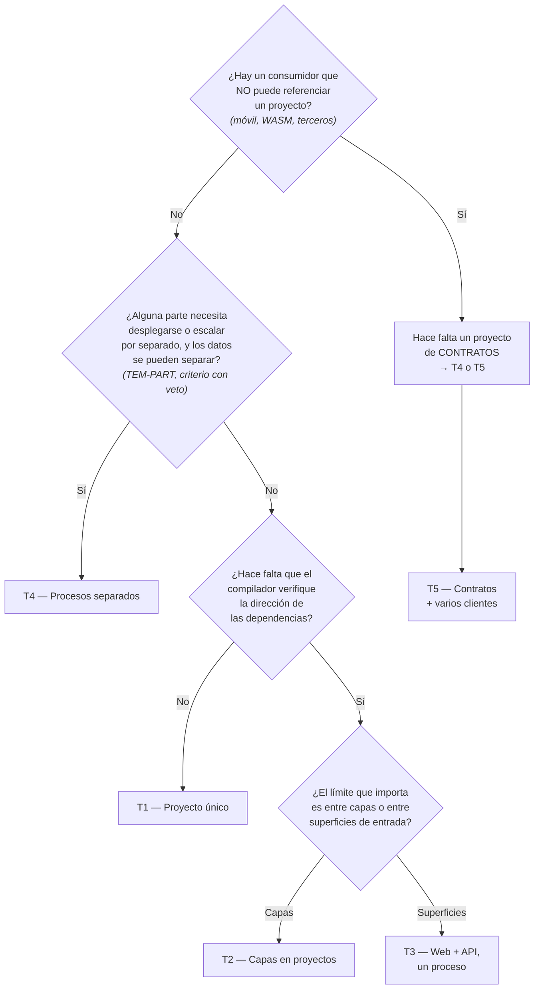

# Topologías de solución — `TEM-TOPO`

## Resumen ejecutivo

Cinco disposiciones cubren la enorme mayoría de las soluciones .NET, y elegir entre ellas se reduce a tres preguntas: cuántos consumidores distintos tiene el sistema, cuántos procesos se despliegan, y si el contrato entre las partes lo consume alguien que no puede referenciar un proyecto.

La tercera pregunta es la que más gente omite y la que más determina la estructura. Un cliente móvil o una aplicación WebAssembly no pueden referenciar el proyecto que expone la API: solo hablan HTTP. Eso obliga a que los tipos del contrato vivan en un lugar alcanzable por ambos lados, y esa restricción —no una preferencia arquitectónica— es la que hace aparecer el proyecto de contratos.

Este documento cataloga las cinco topologías con su árbol de proyectos, qué referencia a qué, dónde vive cada representación de los datos y en qué condiciones conviene cada una. Le sirve a `ACT-01` en `ESC-1` y `ESC-2`, que es quien responde por la decisión, y a `ACT-02` para ubicar dónde va lo que escribe.

---

## Definición

### Qué es

La topología de una solución es el conjunto de proyectos que la componen, la dirección de las referencias entre ellos y el reparto de esos proyectos en unidades desplegables. Responde a tres preguntas que se toman juntas y se confunden con frecuencia: cuántos `.csproj` hay, quién referencia a quién, y cuántos procesos corren.

### Qué problema resuelve

**Ubicar el código sin discutirlo cada vez.** Un desarrollador que escribe un DTO nuevo necesita saber en qué proyecto va sin abrir una conversación. Una topología declarada responde esa pregunta por construcción.

**Hacer verificable la dirección de las dependencias.** Dentro de un proyecto los límites dependen de la disciplina; entre proyectos los hace cumplir el compilador ([`TEM-CVP`](../30-Organizacion-Interna/Carpetas-o-Proyectos.md)). Elegir la topología es elegir qué límites quedan verificados y cuáles no.

**Anticipar qué separación va a costar cara.** Extraer un servicio de un sistema cuyos contratos ya están aislados es trabajo de días; hacerlo cuando los tipos del dominio viajan hasta la vista es trabajo de meses.

### Qué NO es, y con qué se lo confunde

**No es la arquitectura de despliegue.** Es la confusión central y la razón por la que este documento existe dentro de `FAM-SOL` y no de [`FAM-SRV`](../10-Arquitectura-de-Servicios/README.md). La cantidad de proyectos no determina la cantidad de procesos: dos proyectos pueden correr en un proceso, y un proyecto puede desplegarse en tres instancias. Las combinaciones se enumeran más abajo porque conviene verlas juntas.

**No es el modelo de capas.** Que existan proyectos `Domain` y `Application` no dice nada sobre la dirección real de las dependencias. Un `ProjectReference` mal puesto produce exactamente las mismas capas ornamentales que una carpeta mal usada ([`TEM-CAPAS`](../30-Organizacion-Interna/Modelos-de-Capas.md)).

**No es una escalera de madurez.** La topología de proyecto único no es la versión principiante de las otras. Es la correcta para la mayoría de los sistemas, y las siguientes se justifican por restricciones concretas, no por progreso.

---

## Las tres preguntas que deciden



La pregunta 1 es una **restricción**, no una preferencia: si existe ese consumidor, el proyecto de contratos aparece sí o sí. Las otras dos son decisiones, y admiten responderse que no.

La pregunta 2 arrastra una condición que no es de topología sino de datos, y por eso se enuncia acá con su remisión. La separabilidad de los datos sin transacciones distribuidas es el criterio con veto de [`TEM-PART`](../10-Arquitectura-de-Servicios/Criterios-de-Particion.md): si no se cumple, `T4` produce dos procesos sobre un esquema compartido, que es la trampa descrita más abajo. Querer desplegar por separado no basta para poder hacerlo.

---

## `T1` — Proyecto único

Una unidad desplegable, un `.csproj`, las capas como carpetas.

```text
src/
└── MiEmpresa.Reservas.Web/          Microsoft.NET.Sdk.Web
    ├── Program.cs
    ├── Domain/
    ├── Application/
    ├── Infrastructure/
    └── Components/
```

**Cuándo.** Un solo consumidor —la propia interfaz—, un solo despliegue, un equipo. Es el punto de partida que esta guía recomienda y el que producen las plantillas del SDK.

**Dónde van los modelos.** No hay DTOs de contrato porque no hay borde HTTP propio: los componentes ligan contra el dominio o contra modelos de presentación locales. El detalle en [`TEM-MODELOS`](../30-Organizacion-Interna/Modelos-y-Contratos.md).

**Qué se pierde.** Nada verifica que `Domain/` no use EF Core: todo `PackageReference` del único `.csproj` está disponible en todas las carpetas.

---

## `T2` — Capas en proyectos

Un despliegue, varios proyectos, un `ProjectReference` por cada dependencia permitida.

```text
src/
├── MiEmpresa.Reservas.Domain/          Sdk        (sin referencias)
├── MiEmpresa.Reservas.Application/     Sdk        → Domain
├── MiEmpresa.Reservas.Infrastructure/  Sdk        → Application
└── MiEmpresa.Reservas.Web/             Sdk.Web    → Infrastructure, Application
```

**Cuándo.** Cuando la dirección de la dependencia se violó de forma repetida pese a la revisión, o cuando una capa se reutiliza desde otra solución. No por anticipación.

**Qué compra.** Que `Domain` no pueda usar EF Core deja de ser un acuerdo y pasa a ser un error de compilación: el paquete no está en su `.csproj` y no hay forma de invocarlo.

**Qué cuesta.** Build más lento, un grafo de referencias que mantener, y refactors entre capas que dejan de ser mover un archivo.

**El detalle que se pasa por alto.** `Web` suele necesitar referenciar `Application` además de `Infrastructure`, porque el registro de servicios en `Program.cs` menciona tipos de ambas. Eso es correcto y no viola nada: la composición ocurre en el borde, y el borde conoce todo.

---

## `T3` — Web + API en un proceso

Dos proyectos con superficies de entrada distintas, un solo despliegue. Es la topología que más malentendidos genera.

```text
src/
├── MiEmpresa.Reservas.Domain/
├── MiEmpresa.Reservas.Application/
├── MiEmpresa.Reservas.Infrastructure/
├── MiEmpresa.Reservas.Api/       Sdk.Web   → Infrastructure   (controllers o endpoints)
└── MiEmpresa.Reservas.Web/       Sdk.Web   → Api               (arranca el proceso)
```

`Web` es el ensamblado de entrada y hospeda lo que expone `Api`. Corren juntos, en el mismo proceso, escuchando el mismo puerto.

### Cómo se hospedan los controllers del otro ensamblado

Acá hay un dato que se afirma mal con frecuencia. **Los controllers de un ensamblado referenciado se descubren automáticamente.** `N-17` es explícito: el `ApplicationPartManager` incluye por defecto el ensamblado de la aplicación *y sus ensamblados dependientes*, sea la referencia directa o transitiva. Si `Web` referencia a `Api`, no hace falta registrar nada.

`AddApplicationPart` existe para cuando alguna de las tres condiciones de `N-17` se rompe: que `applicationName` apunte al ensamblado raíz correcto, que el raíz referencie las partes, y que el raíz referencie el Web SDK. Los casos reales son la carga dinámica de complementos, los ensamblados no referenciados en compilación, y los arneses de prueba que alteran `applicationName` —motivo por el cual un test de integración puede devolver 404 en una ruta que funciona al ejecutar la aplicación—.

```csharp
// Solo necesario cuando el descubrimiento por defecto no alcanza (N-17).
builder.Services.AddControllers()
    .AddApplicationPart(typeof(ReservasController).Assembly);
```

Con Minimal APIs no hay descubrimiento en absoluto y tampoco hace falta: `N-18` documenta el patrón del método de extensión, que es una llamada normal y funciona igual esté la clase en este ensamblado o en otro.

```csharp
// En MiEmpresa.Reservas.Api
public static class EndpointsReservas
{
    public static RouteGroupBuilder MapReservas(this RouteGroupBuilder grupo)
    {
        grupo.MapGet("/", ListarReservas);
        grupo.MapPost("/", CrearReserva);
        return grupo;
    }
}

// En Program.cs de MiEmpresa.Reservas.Web
app.MapGroup("/api/reservas").MapReservas().RequireAuthorization();
```

Cómo conviene agrupar los *endpoints* —cuántos métodos de extensión, qué entra en cada grupo, dónde se cuelgan los filtros— es criterio de [`TEM-ENDP`](../60-Patrones-de-Codigo/Patrones-de-Endpoint.md). Acá interesa una sola propiedad: que la llamada atraviesa el límite de ensamblado sin registro ni descubrimiento, porque es una invocación de método como cualquier otra.

La asimetría con Blazor conviene retenerla: los **componentes enrutables** definidos en otro ensamblado sí requieren registro explícito, con `AddAdditionalAssemblies` sobre `MapRazorComponents` (`N-20`). Controllers no, componentes sí.

**La pregunta que hay que hacerse.** Si van a correr en el mismo proceso, ¿por qué dos proyectos? Hay una respuesta legítima: el `ProjectReference` fuerza la dirección, y el día que la API deba desplegarse por separado el trabajo ya está hecho. Y hay una ilegítima, que es que la separación «queda más arquitectónica». Esta guía recomienda adoptar `T3` solo cuando la separación futura es una posibilidad concreta y no una hipótesis decorativa; en caso contrario, `T2` con una carpeta `Api/` dentro del proyecto web cumple lo mismo con menos piezas.

---

## `T4` — Web y API en procesos separados

Los mismos proyectos que `T3`, dos unidades desplegables. Se despliegan, escalan y fallan por separado.

```text
src/
├── MiEmpresa.Reservas.Domain/
├── MiEmpresa.Reservas.Application/
├── MiEmpresa.Reservas.Infrastructure/
├── MiEmpresa.Reservas.Contracts/   Sdk       (sin referencias)  ← aparece acá
├── MiEmpresa.Reservas.Api/         Sdk.Web   → Infrastructure, Contracts
└── MiEmpresa.Reservas.Web/         Sdk.Web   → Contracts        (NO referencia Api)
```

El cambio estructural respecto de `T3` no es que haya dos procesos: es que **`Web` deja de referenciar a `Api`**. La comunicación pasa a ser HTTP, y con eso los tipos que cruzan dejan de ser los del dominio y pasan a ser los del contrato.

**Qué cambia de régimen.** El compilador deja de verificar la frontera. Un cambio en la forma de una respuesta compila en ambos lados y falla en ejecución. Es el mismo cambio que describe `CTX-4`, aunque haya solo dos procesos.

**Cuándo.** Cuando el frontal y la API tienen perfiles de escalado distintos, ciclos de despliegue independientes, o equipos que se bloquean entre sí. Los criterios completos, con sus umbrales, están en [`TEM-PART`](../10-Arquitectura-de-Servicios/Criterios-de-Particion.md): esta topología es la forma de proyecto que toma una decisión que se decide allá.

**La trampa.** Si ambos procesos comparten la base de datos y no pueden desplegarse por separado, esto es un monolito distribuido con pasos extra ([`TEM-MICRO`](../10-Arquitectura-de-Servicios/Microservicios.md)).

---

## `T5` — Contratos con varios clientes

Un dominio, una API, y consumidores que no pueden referenciar proyectos: una aplicación móvil, un cliente WebAssembly, un integrador externo.

```text
src/
├── MiEmpresa.Reservas.Domain/
├── MiEmpresa.Reservas.Application/
├── MiEmpresa.Reservas.Infrastructure/
├── MiEmpresa.Reservas.Contracts/   Sdk       ← DTOs. SIN dependencias.
├── MiEmpresa.Reservas.Api/         Sdk.Web   → Infrastructure, Contracts
├── MiEmpresa.Reservas.Web/         Sdk.Web   → Contracts
└── MiEmpresa.Reservas.Movil/       Sdk + UseMaui → Contracts
```

El proyecto MAUI no usa un SDK propio: `N-19` muestra que se declara con `Microsoft.NET.Sdk` más `<UseMaui>true</UseMaui>` y `<SingleProject>true</SingleProject>`, con `TargetFrameworks` por plataforma.

### La regla que sostiene la topología

**`Contracts` no referencia `Domain`.** Es la condición que hace que todo lo demás funcione, y la que más se incumple. Si `Contracts` arrastra el dominio, el cliente móvil se lleva las entidades, sus invariantes y sus paquetes; y peor, cualquier cambio en el dominio pasa a ser potencialmente ruptor para el móvil.

`Contracts` es un proyecto sin referencias, con tipos planos y serializables. Aunque no se publique en NuGet, se comporta como `CTX-3`: tiene consumidores que evolucionan en otro ciclo, de modo que aplican la nomenclatura estricta de `N-01` a `N-04` y una política de versionado. La lista de verificación de `CTX-3` en [`ANEXO-CHECK`](../99-Anexos/Listas-de-Verificacion.md) aplica tal cual.

Sobre el marco de destino: un proyecto de contratos puro no tiene restricción por consumirse desde WebAssembly —desde ASP.NET Core 5.0 los proyectos Blazor WASM apuntan a la versión de .NET y no a .NET Standard—. `netstandard2.0` solo sigue siendo pertinente si el mismo ensamblado debe consumirse desde .NET Framework o Xamarin heredado.

---

## Las combinaciones de proyectos y procesos

La tabla que desarma la confusión más cara del tema. Ambos ejes son independientes.

| | 1 proceso | N procesos |
|---|---|---|
| **1 proyecto** | `T1` — lo habitual | Una imagen, varias instancias tras un balanceador. Es escalado horizontal, no partición |
| **N proyectos** | `T2`, `T3` — límites verificados por el compilador, despliegue único | `T4`, `T5` — límites de red, no verificados |

La celda superior derecha existe y se olvida: replicar instancias de un mismo artefacto es la forma más barata de escalar y no requiere tocar la topología de proyectos.

---

## Cuadro comparativo

| | `T1` Único | `T2` Capas | `T3` Web+API 1 proc. | `T4` 2 procesos | `T5` + clientes |
|---|:---:|:---:|:---:|:---:|:---:|
| Proyectos | 1 | 4 | 5 | 6 | 7+ |
| Unidades desplegables | 1 | 1 | 1 | 2 | 2+ |
| Límite entre capas | disciplina | **compilador** | **compilador** | **compilador** | **compilador** |
| Límite entre frontal y API | — | — | **compilador** | red | red |
| Proyecto de contratos | no | no | opcional | **sí** | **sí** |
| DTOs de contrato | no hay | no hay | en `Api/` | en `Contracts` | en `Contracts` |
| Costo de un cambio de contrato | — | — | compila o no | despliegue coordinado | versionado |
| Complejidad operativa | mínima | mínima | mínima | media | media |

---

## Aplicación por escenario

### `ESC-1` — Sistema nuevo

La decisión se toma una vez y condiciona el resto. Esta guía recomienda contestar las tres preguntas del árbol y adoptar la topología más simple que las satisfaga, con un criterio de corte explícito: si la respuesta a las tres es «no», es `T1`, y adoptar otra cosa es pagar por una opción que no se va a ejercer.

La única topología que conviene anticipar es `T5`, y solo cuando el cliente que no puede referenciar proyectos ya está comprometido en el alcance. Introducir `Contracts` después obliga a mover tipos y a ajustar todo `using` que los mencione, que es trabajo mecánico pero extenso.

### `ESC-2` — Evolución estructural

Las transiciones habituales, en orden de costo:

`T1 → T2` es la más barata: mover carpetas a proyectos, agregar `ProjectReference`, y descubrir en el camino las dependencias que iban en la dirección equivocada —que aparecen como errores de compilación, que es exactamente el beneficio buscado—.

`T3 → T4` parece pequeña y no lo es. Cortar el `ProjectReference` de `Web` a `Api` convierte llamadas en proceso en llamadas HTTP: hay que introducir el cliente, el manejo de fallas, la serialización y el versionado. La estructura de carpetas casi no cambia y el sistema sí.

`T4 → T5` es incremental si `Contracts` ya existe, y costosa si los DTOs viven dentro del proyecto de API.

### `ESC-3` — Normalización

No aplica en su forma habitual. Cambiar de topología mueve archivos entre proyectos y altera namespaces y referencias, lo que produce cambios funcionales: es `ESC-2` y se trata con su criterio. Lo que sí corresponde a `ESC-3` es alinear los namespaces después de una migración de topología, según [`TEM-NS`](../30-Organizacion-Interna/Espacios-de-Nombres.md).

### `ESC-4` — Evaluación

El grafo de `ProjectReference` es el artefacto más informativo de una solución ajena, y se obtiene sin leer código:

```bash
grep -rn 'ProjectReference' --include=*.csproj .
```

Tres lecturas rinden. Si `Domain` referencia algo, la inversión de dependencia no existe pese a lo que diga el diagrama. Si `Contracts` referencia `Domain`, los clientes están acoplados al dominio y un cambio interno puede romperlos. Y si hay proyectos separados que igualmente se despliegan juntos y comparten base de datos, la topología declarada no es la real.

### Qué cambia según el contexto

**`CTX-1`.** `T1` es adecuada más seguido de lo que se admite. La API aparece cuando hay un segundo consumidor, no antes.

**`CTX-2`.** `T1` o `T2`; el frontal no existe y `T3` carece de sentido.

**`CTX-3`.** La biblioteca publicable es un proyecto propio por definición, y su superficie es el contrato. Se parece a `Contracts` de `T5` con versionado formal encima.

**`CTX-4`.** `T4` y `T5` son sus formas de proyecto. La decisión de cuántos servicios se toma en [`TEM-PART`](../10-Arquitectura-de-Servicios/Criterios-de-Particion.md), no acá.

---

## Ejemplos concretos

### El `.csproj` del proyecto de contratos

Lo distintivo es lo que **no** tiene: ninguna referencia de proyecto y ningún paquete de infraestructura.

```xml
<Project Sdk="Microsoft.NET.Sdk">

  <PropertyGroup>
    <!-- net10.0 alcanza para consumo desde WebAssembly. netstandard2.0 solo
         si el mismo ensamblado debe consumirse desde .NET Framework. -->
    <TargetFramework>net10.0</TargetFramework>

    <!-- Se comporta como CTX-3 aunque no se publique: hay consumidores que
         evolucionan en otro ciclo. Un aviso de API mal formada se propaga. -->
    <TreatWarningsAsErrors>true</TreatWarningsAsErrors>
    <GenerateDocumentationFile>true</GenerateDocumentationFile>
  </PropertyGroup>

  <!-- Sin ItemGroup. La ausencia de referencias es la característica
       del proyecto, no una omisión. -->

</Project>
```

### Dónde vive cada representación de los datos

La fila «DTOs de contrato» del cuadro comparativo resume el reparto: no hay DTOs en `T1` ni en `T2`, viven dentro de `Api/` en `T3`, y pasan al proyecto `Contracts` en `T4` y `T5`. El recorrido completo de una reserva desde la fila de la base hasta el consumidor, topología por topología, lo desarrolla [`TEM-MODELOS`](../30-Organizacion-Interna/Modelos-y-Contratos.md), que es el dueño del tema.

### La composición en `Program.cs` de `T3`

El proyecto de entrada compone todo. Es el único lugar donde eso es correcto.

```csharp
var builder = WebApplication.CreateBuilder(args);

// Razor Components del propio proyecto web.
builder.Services.AddRazorComponents().AddInteractiveServerComponents();

// Servicios de la API: viven en MiEmpresa.Reservas.Api, referenciado.
builder.Services.AddControllers();

builder.Services.AgregarInfraestructuraReservas(builder.Configuration);

var app = builder.Build();

app.UseAuthentication();
app.UseAuthorization();
app.UseAntiforgery();

// Los controllers de MiEmpresa.Reservas.Api se descubren solos: es un
// ensamblado dependiente del de entrada (N-17). No hace falta AddApplicationPart.
app.MapControllers();

app.MapRazorComponents<App>().AddInteractiveServerRenderMode();

app.Run();
```

---

## Preguntas guía

1. ¿Existe algún consumidor que no pueda referenciar un proyecto? Si la respuesta es sí, el proyecto de contratos no es opcional.
2. ¿`Contracts` referencia a `Domain`? Si lo hace, los clientes están acoplados al dominio y la topología no cumple su propósito.
3. ¿Cuántos procesos se despliegan, y coincide ese número con lo que sugiere la cantidad de proyectos? La divergencia es normal; la sorpresa ante la divergencia indica que se confundieron los ejes.
4. Si hay proyectos separados que se despliegan juntos, ¿qué compra esa separación además de ceremonia?
5. Si hay procesos separados, ¿comparten base de datos? ¿Pueden desplegarse sin coordinar?
6. ¿El grafo de `ProjectReference` coincide con el diagrama de arquitectura declarado?
7. En `T3`: si mañana hubiera que pasar a `T4`, ¿qué tipos están cruzando el borde que no deberían?
8. ¿La topología está registrada en un ADR con el criterio que la eligió?

---

## Criterios de calidad

Una topología sana tiene una propiedad verificable sin leer código: el grafo de `ProjectReference` es acíclico, va en una sola dirección y coincide con el diagrama que el equipo declara. A partir de ahí, tres condiciones. El proyecto de dominio no referencia nada. El proyecto de contratos, si existe, tampoco. Y la cantidad de proyectos se justifica por un límite que alguien necesita verificado, no por simetría con un diagrama.

Antipatrones nombrados:

**El proyecto de contratos que arrastra el dominio.** `Contracts` referencia `Domain` «para no duplicar la clase». El cliente móvil termina compilando contra las entidades y sus paquetes, y todo cambio de una invariante es un cambio potencialmente ruptor para el cliente. Es el fallo más frecuente de `T5` y el que anula su beneficio completo.

**La topología decorativa.** Cinco proyectos que se despliegan siempre juntos, con referencias que forman una cadena, y ninguna capa que hubiera podido violarse. La separación no impide nada que estuviera ocurriendo: cuesta build y ceremonia y no compra ningún límite.

**El proyecto `Comun` o `Shared`.** Aparece para dos utilidades y termina conteniendo la mitad del sistema, porque es el destino por defecto de todo lo que no tiene lugar obvio. Como `Shared` lo referencian todos, cualquier cosa que caiga ahí queda disponible en todas partes y la topología deja de significar nada. Es el mismo problema que la clase `Utils` de [`TEM-ANTI`](../40-Nomenclatura/Antipatrones-de-Nombrado.md), a escala de proyecto.

**Dos procesos, una base de datos.** `T4` o `T5` sobre un esquema compartido con escritura desde ambos lados. Los procesos no pueden desplegarse por separado sin coordinar migraciones, de modo que se pagó el costo de la red sin comprar la independencia.

**La API que nadie consume por red.** `T4` donde el único cliente es el frontal propio, sin requisito de escalado ni de despliegue separado. Se introdujo una frontera de red, con su serialización, su manejo de fallas y su versionado, para reemplazar una llamada de método que el compilador verificaba.

**El salto de topología sin ADR.** Se pasa de `T1` a `T4` en una rama, y seis meses después nadie recuerda qué problema lo motivó ni qué habría que observar para saber si valió la pena.
