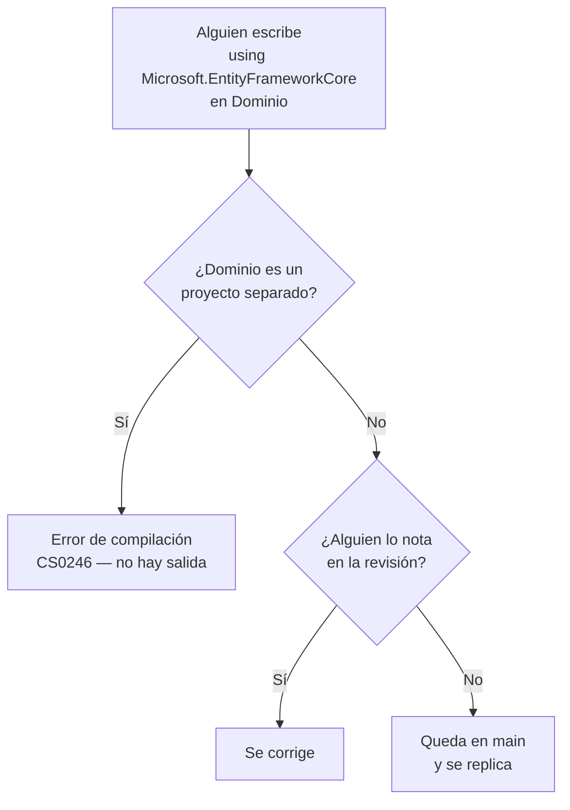

# Carpetas o proyectos — `TEM-CVP`

## Resumen ejecutivo

Elegido el modelo de organización —capas, cortes verticales o la combinación de ambos—, queda una pregunta que se decide por separado y que suele decidirse sin pensarla: si esas agrupaciones son carpetas dentro de un proyecto o proyectos `.csproj` independientes. La respuesta habitual del ecosistema es «proyectos, obviamente», y la obviedad no está fundada.

Hay exactamente una diferencia que importa. Con proyectos separados, **el compilador hace cumplir la dirección de la dependencia**: si `Dominio` no referencia a `Infraestructura`, ningún archivo de `Dominio` puede usar un tipo de `Infraestructura`, y el intento no compila. Con carpetas, la misma regla existe en el acuerdo del equipo y depende de que alguien la recuerde en la revisión. Todo lo demás —tiempos de build, cantidad de archivos, prolijidad del explorador de soluciones— es secundario y con frecuencia se argumenta al revés de como conviene.

Este es el documento de decisión de la familia. Le sirve a `ACT-01`, que fija la estructura de proyectos, y a `ACT-02`, que convive con ella todos los días y paga su costo en cada refactor.

---

## Definición

### Qué es

Una decisión sobre la **unidad de compilación** en la que vive cada grupo de código. Un proyecto `.csproj` produce un ensamblado, declara sus propias dependencias mediante `ProjectReference` y `PackageReference`, y establece un límite que el compilador conoce. Una carpeta no produce nada, no declara nada y el compilador no la ve: es una convención de organización de archivos que el SDK usa únicamente para derivar el espacio de nombres por defecto ([`TEM-NS`](Espacios-de-Nombres.md)).

Esa asimetría es todo el contenido técnico de la decisión. El resto son consecuencias.

### Qué problema resuelve

**La erosión silenciosa de la arquitectura.** Un modelo de capas correcto se degrada de a un `using` por vez. Nadie decide violar la dirección de la dependencia; alguien tiene apuro, necesita un dato, y el `DbContext` está a mano. Seis meses después el dominio depende de EF Core en catorce lugares y nadie sabe cuándo pasó. La partición en proyectos convierte cada una de esas catorce ocasiones en un error de compilación imposible de ignorar.

**La reutilización real entre soluciones.** Un ensamblado se referencia desde otra solución o se empaqueta como NuGet. Una carpeta no.

**La verificación del grafo de dependencias.** Con proyectos, el grafo está escrito en los `.csproj` y se puede leer sin abrir código. Con carpetas, el grafo real hay que reconstruirlo analizando los `using` de cada archivo.

### Qué NO es, y con qué se lo confunde

**No es la decisión de modelo de capas.** Es la confusión más frecuente de esta familia y vale insistir: tener cuatro proyectos no significa tener Clean Architecture, y tener una carpeta `Dominio/` no significa no tenerla. [`TEM-CAPAS`](Modelos-de-Capas.md) decide la dirección de las dependencias; este documento decide quién la verifica.

**No es la decisión de despliegue.** Nueve proyectos pueden publicar un único ejecutable. La cantidad de unidades desplegables se decide en [`FAM-SRV`](../10-Arquitectura-de-Servicios/README.md) y no guarda relación con la cantidad de `.csproj`.

**No es una medida de madurez.** «Un solo proyecto» se lee con frecuencia como señal de inmadurez técnica, y no lo es. Los templates de `dotnet new` generan un único proyecto, y una aplicación de veinte mil líneas con carpetas disciplinadas es más mantenible que la misma aplicación repartida en siete ensamblados con referencias circulares resueltas a fuerza de interfaces marcadoras.

**No es irreversible en ninguna de las dos direcciones.** Partir una carpeta en proyecto es mecánico: se crea el `.csproj`, se mueven los archivos, se agregan las referencias. Fusionar dos proyectos en carpetas también. Lo que sí es caro es descubrir tarde que la dirección de dependencia se violó en todas partes, porque entonces la partición deja de ser mecánica.

---

## Lo único que cambia de verdad

Conviene ver el mecanismo en concreto. Con proyectos separados, el archivo de dominio declara qué puede ver:

```xml
<!-- src/Reservas.Dominio/Reservas.Dominio.csproj -->
<Project Sdk="Microsoft.NET.Sdk">
  <PropertyGroup>
    <TargetFramework>net10.0</TargetFramework>
    <Nullable>enable</Nullable>
  </PropertyGroup>
  <!-- Sin ProjectReference ni PackageReference: el dominio no depende de nada. -->
</Project>
```

Con esa declaración, el archivo siguiente no compila. El error no es de estilo ni un aviso configurable: es `CS0246`, el tipo no existe.

```csharp
// src/MiEmpresa.Reservas.Dominio/Reservas/ServicioReservas.cs
using Microsoft.EntityFrameworkCore;   // CS0246 — no se encuentra el espacio de nombres

namespace MiEmpresa.Reservas.Dominio.Reservas;
```

En la variante de carpetas, el mismo archivo compila sin objeción, porque el `PackageReference` de EF Core está en el único `.csproj` de la aplicación y alcanza a todo su contenido. La carpeta `Dominio/` no tiene forma de rechazarlo.



La rama inferior derecha es todo el argumento a favor de partir. Su probabilidad no es constante: depende del tamaño del equipo, de la rotación, de la carga de trabajo del revisor y de si el revisor conoce la regla. En un equipo de dos personas que decidieron la arquitectura juntas es baja. En uno de doce con contratistas entrando y saliendo es alta, y crece con cada incorporación.

---

## Mecanismos intermedios

Entre «carpetas y confianza» y «proyectos y compilador» hay opciones que se usan poco y que cubren buena parte del terreno.

**`internal` con disciplina de accesibilidad.** El modificador limita la visibilidad al ensamblado, no a la carpeta, así que dentro de un proyecto único no separa capas. Sirve igual para otra cosa: reducir la superficie de cada corte o cada capa a lo que efectivamente se consume desde afuera. Un tipo `internal sealed` comunica intención y facilita la partición futura, porque al crear el proyecto se sabe qué debe volverse `public` y qué no.

**`InternalsVisibleTo`.** Cuando sí hay proyectos separados, este atributo abre lo `internal` de un ensamblado a otro nombrado explícitamente. Su uso legítimo es dar acceso al proyecto de pruebas sin volver público lo que no debe serlo. Usarlo entre proyectos de producción para saltear un límite que se acaba de establecer anula el beneficio de haberlos separado; si hace falta, la señal es que el límite estaba mal trazado.

```xml
<!-- En el .csproj del proyecto de dominio -->
<ItemGroup>
  <InternalsVisibleTo Include="Reservas.Dominio.Pruebas" />
</ItemGroup>
```

**Analizadores de Roslyn.** El análisis estático de .NET permite elevar la severidad de reglas y, mediante paquetes de analizadores, prohibir el uso de símbolos concretos en ámbitos concretos. Con `EnableNETAnalyzers` y `EnforceCodeStyleInBuild` activados —y `TreatWarningsAsErrors` en la canalización— una regla configurada como error bloquea la integración igual que un fallo de compilación. La configuración de severidades por ruta se hace en `.editorconfig`, cuyo desarrollo está en [`TEM-AUTO`](../50-Estilo-de-Codificacion/Automatizacion-del-Estilo.md).

**Pruebas de arquitectura.** Una prueba automatizada que carga los ensamblados por reflexión y afirma que ningún tipo de un espacio de nombres referencia tipos de otro. Falla en la canalización como cualquier prueba, y tiene la ventaja de que la regla queda escrita en código legible en lugar de en un acuerdo verbal. Existen bibliotecas de .NET dedicadas a esto; **esta guía no las nombra porque no verificó cuáles están vigentes ni su estado de mantenimiento** —quien las adopte debería comprobarlo antes—. La técnica también se implementa sin biblioteca, recorriendo los tipos con reflexión y sus dependencias declaradas.

El rendimiento de estos mecanismos no es equivalente al del compilador y conviene no exagerarlo. Una prueba de arquitectura se puede desactivar; un analizador se puede suprimir con un `#pragma`; un `ProjectReference` ausente no se puede evadir. Lo que compran es un punto intermedio con costo mucho menor.

---

## Los costos de partir en proyectos

Se enumeran porque en la discusión habitual solo se enumeran los beneficios.

**Compilación más lenta.** Cada proyecto agrega sobrecarga de restauración, análisis y escritura del ensamblado. En incrementos pequeños la diferencia es marginal; en un `rebuild` completo y en la canalización, se acumula. Diez proyectos donde alcanzaban dos es un costo que se paga en cada compilación durante toda la vida del sistema.

**Ceremonia por cada movimiento.** Mover una clase entre capas pasa de arrastrar un archivo a: verificar que la referencia exista, ajustar la accesibilidad de `internal` a `public`, revisar si eso expone tipos que no deberían salir, y a veces descubrir que la referencia crearía un ciclo y hay que introducir una abstracción. En `ESC-1`, cuando los límites todavía se están descubriendo, ese peaje se paga muchas veces.

**Presión hacia lo público.** Es el costo menos discutido y el más insidioso. Partir en proyectos obliga a volver `public` todo lo que cruza un límite, y esa superficie pública ampliada es exactamente lo contrario de lo que se buscaba. Un sistema de un proyecto puede tener casi todo `internal`; uno de siete tiene una superficie pública considerable, con lo que eso implica para el análisis y para la tentación de usarla desde donde no corresponde.

**Grafo de referencias que mantener.** Cada `.csproj` declara sus dependencias, y esas declaraciones se desactualizan: referencias que quedaron y nadie usa, paquetes duplicados con versiones distintas si no hay gestión centralizada (`N-08`). Es trabajo de mantenimiento que las carpetas no generan.

**Superficie de configuración multiplicada.** `TargetFramework`, `Nullable`, `LangVersion` y las propiedades de análisis se repiten en cada proyecto salvo que se centralicen en `Directory.Build.props` (`N-09`). Sin esa centralización, la deriva entre proyectos es cuestión de tiempo, y produce el caso desagradable de un proyecto con nulabilidad desactivada dentro de una solución que la usa.

---

## Tabla comparativa

| Dimensión | Carpetas | Proyectos separados |
|---|---|---|
| Quién verifica la dirección de dependencia | La revisión humana | **El compilador** |
| Costo de mover una clase entre capas | Arrastrar un archivo | Referencia, accesibilidad, posible ciclo |
| Tiempo de compilación | Menor | Mayor, y crece con la cantidad |
| Superficie pública necesaria | Mínima; casi todo `internal` | Amplia; lo que cruza el límite debe ser `public` |
| Reutilización desde otra solución | No es posible | Directa |
| Empaquetado como NuGet | No es posible | Directo |
| Configuración a mantener | Un `.csproj` | N, salvo centralización con `Directory.Build.props` |
| Lectura del grafo de dependencias | Hay que analizar los `using` | Está declarado en los `.csproj` |
| Costo de revertir la decisión | Bajo | Bajo, si la dirección se respetó |
| Riesgo dominante | Erosión silenciosa del límite | Ceremonia que desalienta el refactor |

Ninguna columna gana. Lo que la tabla muestra es que el intercambio es entre **garantía** y **agilidad**, y que la elección correcta depende de cuánto valga cada una en la situación concreta.

---

## El criterio de esta guía

Esta guía recomienda **empezar con carpetas y partir en proyectos cuando aparezca una razón concreta**, no antes.

Cuatro razones califican, y son las únicas que esta guía considera suficientes por sí solas:

1. **Reutilización real desde otra solución.** No prevista ni deseable: existente. Hay otro repositorio que necesita este código hoy.
2. **Necesidad de empaquetar como NuGet.** El contexto pasó a ser `CTX-3` y el ensamblado es la unidad de distribución.
3. **Violación repetida de la dirección de dependencia pese a la revisión.** Ocurrió, se corrigió, volvió a ocurrir. La disciplina demostró no alcanzar en este equipo, con este tamaño, con esta rotación.
4. **Un consumidor que no puede referenciar el proyecto.** Una aplicación móvil, un cliente WebAssembly, un integrador externo: cuando alguien tiene que compilar contra los tipos sin poder agregar un `ProjectReference`, hace falta un proyecto de contratos, y la carpeta no sirve. Es la razón que [`TEM-TOPO`](../20-Organizacion-de-Soluciones/Topologias-de-Solucion.md) establece al describir `T5`, y la única de las cuatro que no admite postergarse: no depende de la disciplina del equipo sino de quién está del otro lado del borde.

La cuarta se distingue de las otras tres en que no es un juicio sino un hecho comprobable del alcance. Las tres primeras se evalúan; esta se constata.

La tercera razón es la que más se invoca de forma preventiva y la que esta guía sostiene que debe invocarse solo de forma reactiva. La diferencia no es menor. «Podría pasar» justifica la partición en cualquier proyecto del mundo y por lo tanto no discrimina nada; «pasó dos veces en tres meses y está en el historial» es un dato que se puede llevar a `ACT-01` y que hace la conversación breve.

El fundamento del criterio es el costo asimétrico de revertir. Partir tarde es una operación mecánica cuando la dirección de dependencia se respetó: se crean los `.csproj`, se mueven las carpetas, se agregan las referencias y el compilador señala cada punto donde faltaba algo. Partir temprano y descubrir que los límites estaban mal trazados obliga a rehacer el grafo entero, y en el intervalo el equipo pagó ceremonia por una estructura que no correspondía.

Una recomendación complementaria que abarata la partición futura: mantener la **disciplina de proyectos sin los proyectos**. Que las carpetas se traten como si fueran ensamblados, que lo que no cruza el límite sea `internal`, y que la regla esté escrita en algún lado —un ADR, una prueba de arquitectura— en lugar de vivir en la memoria de quien la decidió. Con eso, el día que la partición se justifique, es una tarde de trabajo.

---

## Aplicación por escenario

### `ESC-1` — Sistema nuevo

Carpetas. El sistema todavía no sabe dónde están sus límites naturales, y fijarlos en `.csproj` el primer día es apostar información que no se tiene. La excepción es `CTX-3`: una biblioteca que se va a publicar necesita su proyecto desde el principio, porque el ensamblado es el artefacto.

En `CTX-4` la pregunta se plantea dentro de cada servicio, y un servicio recién creado casi nunca justifica más de un proyecto. La partición del despliegue ya introdujo bastantes límites.

### `ESC-2` — Evolución estructural

Es el escenario del documento. La decisión se toma acá, con evidencia, y las tres razones de la sección anterior son el filtro. Vale el criterio general de `ESC-2`: la reorganización que se hace por incomodidad estética consume semanas sin mover ningún indicador.

Si la razón es la tercera —violación repetida—, esta guía recomienda un paso previo antes de partir: instalar una prueba de arquitectura o una regla de analizador que falle en la canalización. Es una tarde de trabajo contra la semana que cuesta partir, y si resuelve el problema la partición deja de hacer falta. Si no lo resuelve porque el equipo la suprime, ese dato también es informativo.

### `ESC-3` — Normalización de código existente

No aplica y conviene no forzarlo. Partir en proyectos es un cambio estructural, no una normalización. Presentar una reorganización de proyectos como «limpieza» es el modo habitual de introducir un cambio de arquitectura sin que nadie lo apruebe, y produce el diff enorme que `ESC-3` advierte que hay que evitar.

Lo que sí corresponde: si ya hay proyectos separados, verificar que sus referencias declaradas coincidan con las que efectivamente se usan, y quitar las que sobran. Es mecánico y de bajo riesgo.

### `ESC-4` — Evaluación de código ajeno

Un único proyecto no es un hallazgo. Lo que se evalúa es la coherencia entre la estructura declarada y la real, y hay dos preguntas que rinden.

La primera se aplica a los sistemas de proyecto único: ¿los `using` de la carpeta central respetan la dirección que el equipo dice seguir? Se responde con una búsqueda de texto y no requiere entender el dominio.

La segunda se aplica a los sistemas con muchos proyectos: ¿el grafo de `ProjectReference` es acíclico y tiene sentido? Siete proyectos donde cada uno referencia a los otros seis no establecieron ningún límite; establecieron ceremonia. Y un `InternalsVisibleTo` entre dos proyectos de producción es señal de que el límite entre ellos se trazó en el lugar equivocado.

---

## Ejemplos concretos

Conviene desarrollar el caso de las capas en carpetas dentro de un proyecto único, porque es la opción que esta guía recomienda como punto de partida y la que peor se entiende. El ejemplo es sintético: la aplicación de reserva de salas que la guía usa como hilo conductor, un solo `Microsoft.NET.Sdk.Web` en `src/MiEmpresa.Reservas.Web/` con las cuatro capas como directorios —`Dominio/`, `Aplicacion/`, `Infraestructura/`, `Components/`—, puertos declarados como interfaces en `Aplicacion/Puertos/` e implementaciones en `Infraestructura/Persistencia/`.

**Por qué la configuración se sostiene.** Ninguna de las tres razones que esta guía exige para partir está presente: no hay otra solución que consuma el código, no se publica como paquete, y la dirección de dependencia no se violó. Partir en cuatro proyectos agregaría grafo de referencias, superficie pública y tiempo de compilación a cambio de una garantía que la disciplina está entregando sin costo. Y la entrega de hecho: un `grep` de `Microsoft.EntityFrameworkCore` sobre `Dominio/` y `Aplicacion/` no devuelve nada, que es la verificación completa disponible en este arreglo.

**Cuál es el riesgo que se asume.** Que la dirección se respete es una propiedad del código escrito, no de la estructura que lo contiene. El mecanismo es directo y no depende del ejemplo: en un proyecto único, **todo `PackageReference` del `.csproj` está disponible para todos los archivos del proyecto sin excepción**. Si el proyecto declara

```xml
<PackageReference Include="Microsoft.EntityFrameworkCore.Sqlite" Version="10.0.0" />
```

entonces un `using Microsoft.EntityFrameworkCore;` dentro de `Dominio/Reservas/` compila sin un solo aviso. La carpeta `Dominio/` no tiene forma de rechazar lo que el `.csproj` ya trajo, porque el compilador no ve carpetas: ve un ensamblado y su conjunto de referencias. Ese es el contenido exacto de la asimetría enunciada al principio del documento.

Lo que impide la violación, entonces, es que quien escribe conoce la regla y que alguien revisa. Vale precisar qué **no** la impide, porque suele darse por cubierto. Un `Directory.Build.props` con `EnableNETAnalyzers`, `AnalysisLevel=latest` y `EnforceCodeStyleInBuild=true` es una configuración de análisis exigente y no aporta nada aquí: gobierna estilo y calidad general, no la dirección de las dependencias entre carpetas. Ninguna regla del conjunto predeterminado de analizadores de .NET conoce el concepto de capa.

El riesgo está bien asumido mientras el equipo sea pequeño y el dominio quepa en la cabeza de quien lo escribió. Su perfil cambia con dos condiciones: que se sume otra persona con acceso de escritura, o que el dominio crezca hasta que nadie recuerde de memoria qué contiene. Con cualquiera de las dos, el paso barato no es partir en proyectos sino instalar la verificación automática que hasta entonces no hacía falta.

---

## Preguntas guía

1. ¿Está registrada esta decisión en algún lado, o los proyectos existen porque el primer commit los creó?
2. ¿Cuál de las tres razones —reutilización existente, empaquetado, violación repetida— justifica cada proyecto que hoy tenemos? Si algún proyecto no responde a ninguna, ¿qué aporta?
3. ¿La dirección de dependencia se ha violado alguna vez en este repositorio? ¿Está en el historial o es una impresión?
4. Si la violación es el problema, ¿probamos una prueba de arquitectura antes de partir? Cuesta una tarde contra una semana.
5. ¿Cuánto tarda hoy un `rebuild` completo, y cuánto tardaría con tres proyectos más?
6. ¿Qué proporción de los tipos es `public` sin que nada fuera del ensamblado los consuma?
7. ¿Hay algún `InternalsVisibleTo` entre proyectos de producción? Si sí, ¿el límite está trazado donde corresponde?
8. Si mañana hubiera que partir, ¿es una tarde de trabajo o es un proyecto? La respuesta mide la disciplina actual mejor que cualquier diagrama.

---

## Criterios de calidad

Un sistema resuelve bien esta decisión cuando la decisión existe. Que esté registrada en un ADR con su motivo es la diferencia entre una elección y una omisión, y es lo primero que `ESC-4` puede evaluar. Después importan tres cosas: que la dirección de dependencia se respete de hecho, con proyectos o sin ellos; que haya algún mecanismo de verificación proporcional al riesgo real del equipo; y que la cantidad de proyectos tenga una justificación por proyecto, no una global.

Antipatrones nombrados:

**Proyecto por capa por reflejo.** Cuatro proyectos creados el primer día porque «así se hace», sin que ninguno tenga consumidor externo ni haya habido violación alguna. Se paga ceremonia permanente por una garantía que nadie necesitaba todavía.

**Proyecto de un archivo.** Un `.csproj` completo —restauración, compilación, ensamblado, entrada en la solución— para alojar dos interfaces. El costo fijo del proyecto excede por mucho lo que contiene.

**`InternalsVisibleTo` como válvula de escape.** Se partió en proyectos para establecer un límite y se abrió el límite con un atributo porque hacía falta un tipo del otro lado. Quedan los costos de la partición y ninguna de sus garantías.

**Referencia circular resuelta con abstracción vacía.** Dos proyectos se necesitan mutuamente, y para romper el ciclo se crea un tercero con interfaces sin comportamiento que ninguno de los dos habría escrito por su cuenta. El ciclo sigue existiendo en el diseño; solo se le agregó un ensamblado encima.

**Carpetas con nombre de capa y sin disciplina de capa.** Existe `Dominio/`, y adentro hay `DbContext`, atributos de serialización y llamadas HTTP. Es el fracaso característico de la opción de carpetas, y es peor que no haber separado nada, porque el nombre de la carpeta afirma una propiedad que el código no tiene.

**Configuración replicada.** Diez `.csproj` con `TargetFramework` y `Nullable` copiados a mano, sin `Directory.Build.props`. Es cuestión de tiempo que uno quede atrás, y el que quede atrás será el que menos se toca, que suele ser el dominio.
