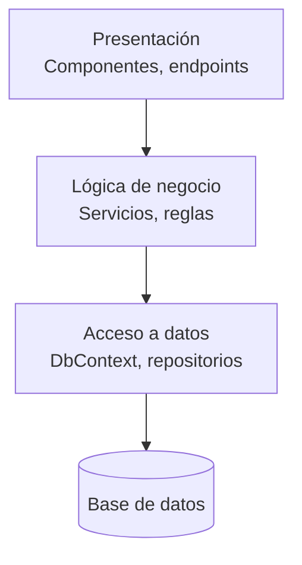
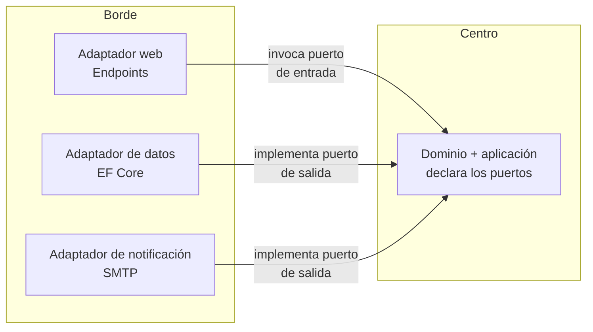
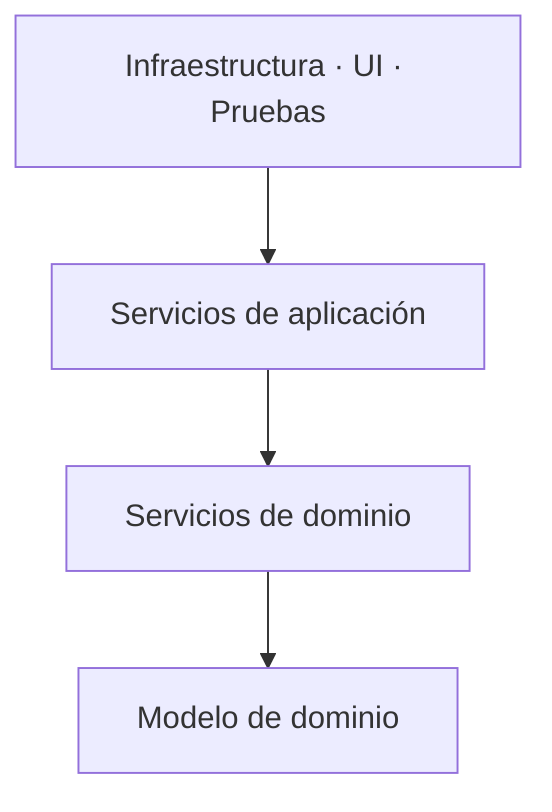
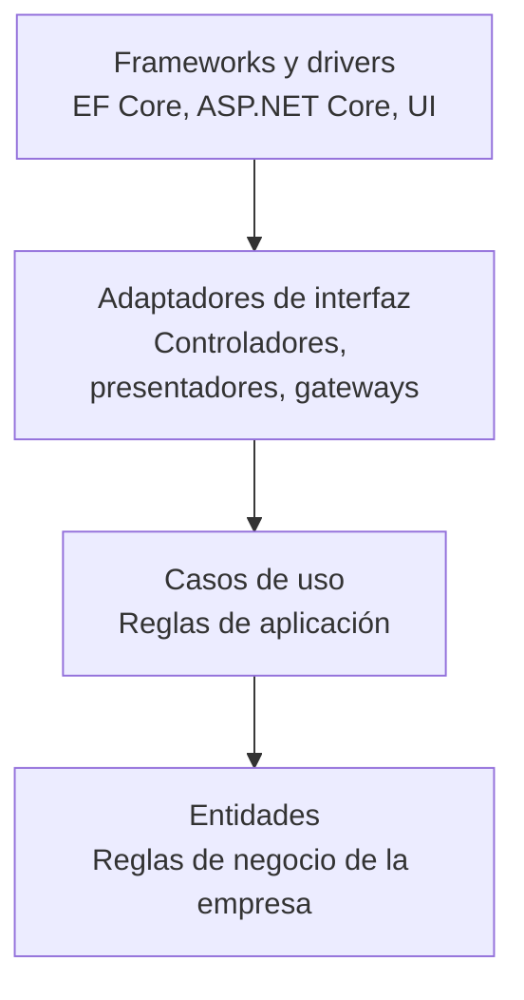
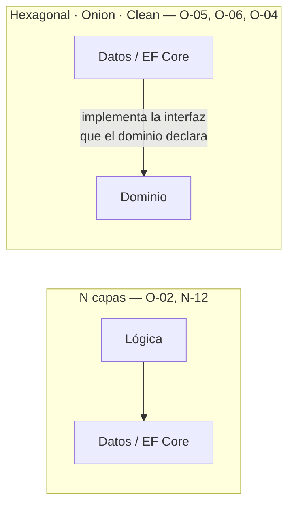

# Modelos de capas — `TEM-CAPAS`

## Resumen ejecutivo

Cuatro modelos se disputan la organización horizontal del código .NET: N capas, Hexagonal, Onion y Clean Architecture. Los cuatro responden a la misma pregunta —¿en qué dirección se permite que una parte del sistema dependa de otra?— y tres de ellos dan prácticamente la misma respuesta con vocabularios distintos. Esa coincidencia se nota poco porque cada uno llegó con su libro, su diagrama y su terminología propia.

El documento tiene dos propósitos. El primero es describir cada modelo con su origen verificable y su mecanismo real, sin el ruido de la divulgación. El segundo es más incómodo y probablemente más útil: dejar establecido que **ninguno de los cuatro es un estándar de Microsoft**, que Microsoft los describe en `N-12` sin prescribirlos, y que los templates de `dotnet new` no generan ninguno. Esa confusión hace que equipos adopten estructuras de cuatro proyectos convencidos de estar cumpliendo una norma, cuando están tomando una decisión de diseño discutible cuyo costo permanente nadie evaluó.

Le sirve a `ACT-01`, que responde por la dirección de las dependencias según la matriz de [`MARCO-ACTORES`](../00-Marco-de-Referencia/Actores.md), y a `ACT-04`, que necesita distinguir en una revisión entre una desviación real y un modelo distinto del suyo.

---

## Definición

### Qué es

Un modelo de capas es una regla sobre la **dirección permitida de las dependencias** entre grupos de código. Nada más que eso. Todo lo demás —cuántas capas, cómo se llaman, si son carpetas o proyectos— es implementación de esa regla y varía entre autores, entre equipos y entre proyectos del mismo equipo.

La regla se formula sobre dos objetos: unos grupos de código con nombre, y un conjunto de aristas permitidas entre ellos. Que un grupo se llame «Aplicación» o «Casos de uso» no cambia nada verificable; que pueda o no referenciar a «Infraestructura» cambia todo.

### Qué problema resuelve

**El acoplamiento de la lógica de negocio a decisiones que van a cambiar.** Una regla como «una sala no admite dos reservas superpuestas» tiene una vida útil de años. El proveedor de base de datos, la versión de EF Core, el formato del mensaje HTTP y el framework de UI tienen vidas útiles mucho más cortas. Cuando la regla de negocio está escrita dentro de un método que recibe un `DbContext`, cambiar lo de vida corta obliga a tocar lo de vida larga, y ese es el costo que cualquier modelo de capas intenta evitar.

**La verificabilidad de la lógica sin infraestructura.** Un dominio que no depende de EF Core se prueba sin base de datos. Esa es la consecuencia práctica más visible y la que más rápido se pierde cuando la dirección de dependencia se relaja.

**La legibilidad del sistema para quien llega.** Un grafo de dependencias acíclico y orientado permite entender qué puede afectar a qué sin leer el código. Un grafo con ciclos no permite razonar sobre nada de forma local.

### Qué NO es, y con qué se lo confunde

**No es un estándar de Microsoft.** Se dice acá con todas las letras porque es la confusión más cara del ecosistema .NET y la razón principal por la que este documento existe. Los orígenes son externos y verificables: `O-02` para el modelo en capas, `O-05` para Hexagonal, `O-06` para Onion, `O-04` para Clean Architecture. Microsoft los describe en `N-12`, que es documentación de arquitectura y no especificación, con recomendaciones y sin obligación. El comportamiento por defecto del SDK apunta en la dirección contraria: `dotnet new webapi` y `dotnet new blazor` generan **un solo proyecto**, sin capas separadas, sin proyecto de dominio y sin inversión de dependencia. Microsoft no publica ningún template que produzca una estructura Clean, Onion o Hexagonal.

Adoptar cualquiera de estos modelos es legítimo. Presentarlos al equipo como cumplimiento normativo no lo es, porque impide que se evalúe si el costo conviene.

**No es una decisión sobre proyectos.** «Tenemos Clean Architecture» y «tenemos cuatro `.csproj`» son afirmaciones independientes. El modelo se puede implementar en carpetas dentro de un único proyecto, y una solución de siete proyectos puede violar la dirección de dependencia en cinco lugares. Lo que cambia al partir es quién verifica el límite, y eso se trata en [`TEM-CVP`](Carpetas-o-Proyectos.md).

**No es una decisión sobre despliegue.** El modelo de capas se aplica dentro de una unidad desplegable. Cuántas unidades hay es [`FAM-SRV`](../10-Arquitectura-de-Servicios/README.md), y las dos decisiones no se condicionan.

**No excluye el corte vertical.** La contraposición entre capas y cortes verticales que aparece en la divulgación es más retórica que técnica. Se combinan, y [`TEM-SLICE`](Vertical-Slice.md) desarrolla cómo.

**No es Domain-Driven Design.** `O-03` aporta un vocabulario de modelado —agregado, entidad, objeto de valor, contexto delimitado— que es ortogonal a la dirección de las dependencias. Se puede aplicar Clean Architecture con un modelo de dominio anémico, y se puede modelar con agregados dentro de una arquitectura en N capas clásica. Que aparezcan juntos en la literatura es un hecho editorial, no una implicación.

---

## Los cuatro modelos

### N capas / Layered — `O-02`, descrito en `N-12`

El modelo más antiguo y el que sigue siendo el punto de partida implícito de la mayoría de los equipos. Fowler lo describe en `O-02` como *Layered Architecture*; Microsoft lo presenta en `N-12` bajo el nombre de arquitectura monolítica en N capas.

Tres capas canónicas: presentación, lógica de negocio y acceso a datos. Cada una puede usar la que tiene debajo y ninguna la que tiene encima. La dependencia es estrictamente descendente, lo que produce un grafo acíclico trivial de verificar.



Su virtud es que se entiende en treinta segundos y no requiere ningún mecanismo especial: las referencias apuntan hacia abajo y listo. Su defecto es estructural y define la historia posterior de todos los demás modelos. **La lógica de negocio depende del acceso a datos.** El grupo de código con la vida útil más larga del sistema referencia al grupo con la vida útil más corta, que es exactamente lo contrario de lo que conviene.

En la práctica eso significa que la capa de lógica conoce el `DbContext`, o al menos las interfaces de repositorio que la capa de datos define. Cambiar de proveedor de persistencia, o simplemente probar una regla de negocio, arrastra la infraestructura entera. Fowler ya identificaba la tensión en 2002; los tres modelos siguientes son intentos de resolverla.

### Hexagonal / Ports & Adapters — `O-05`, Cockburn, 2005-09-04

Cockburn plantea el problema de otro modo. En lugar de un apilamiento vertical con arriba y abajo, propone un centro —la aplicación— rodeado de un borde. El centro declara **puertos**, que son interfaces expresadas en el vocabulario del dominio; el borde aporta **adaptadores**, que son implementaciones de esos puertos contra tecnologías concretas.

El mecanismo que hace funcionar el modelo es la inversión de dependencia, y conviene enunciarlo con precisión porque es lo que se pierde en las versiones divulgadas. La interfaz `IRepositorioReservas` **pertenece al núcleo** —dominio y aplicación—, no a la infraestructura: la declara quien la necesita, con los tipos del dominio en su firma, sin ninguna concesión al proveedor de datos. La clase `RepositorioReservasEfCore` vive en el borde y depende del dominio para implementarla. La flecha de compilación apunta desde la infraestructura hacia el dominio; la flecha de ejecución apunta al revés.



Cockburn distingue puertos de entrada —lo que el mundo le pide al sistema— de puertos de salida —lo que el sistema le pide al mundo—, y esa distinción es la que más rinde en la práctica. El hexágono del nombre no significa seis de nada; es un dibujo que permite representar varios puertos alrededor sin sugerir jerarquía.

La nota sobre `O-05` en [`ANEXO-REFERENCIAS`](../99-Anexos/Referencias.md) aplica acá: la fecha corresponde al artículo publicado en el sitio del autor, que ha mencionado que la idea es anterior. Esa atribución no está verificada y la guía no la afirma.

### Onion — `O-06`, Palermo, 2008-07-29

Palermo conserva la idea de capas pero cambia la geometría. En lugar de apilarlas, las dispone en anillos concéntricos con el modelo de dominio en el centro, y fija una regla única: **las dependencias apuntan hacia adentro**. Un anillo externo puede conocer los internos; ninguno interno conoce los externos.

Los anillos habituales, de adentro hacia afuera: modelo de dominio, servicios de dominio, servicios de aplicación, y un anillo exterior que agrupa infraestructura, interfaz de usuario y pruebas. Que la UI y la base de datos compartan anillo es una afirmación deliberada del modelo: ambas son detalles intercambiables, y ninguna es más central que la otra.



Comparado con Hexagonal, Onion es más prescriptivo sobre el interior: define anillos con nombre y contenido esperado, donde Cockburn solo dice «centro» y «borde». Comparado con N capas, la diferencia decisiva es que el acceso a datos dejó de estar debajo y pasó a estar afuera.

### Clean Architecture — `O-04`, Martin, 2017

Martin publica `O-04` trece años después de Cockburn y nueve después de Palermo, y lo que aporta no es un modelo nuevo sino una síntesis con una regla enunciada de forma memorable. La **regla de dependencia**: las dependencias del código fuente apuntan solo hacia adentro, hacia políticas de nivel más alto. Nada de un círculo interior puede saber nada de un círculo exterior — ni un nombre de clase, ni un nombre de función, ni un formato de datos.

Los cuatro anillos: entidades, casos de uso, adaptadores de interfaz, y frameworks y drivers. El propio Martin señala en la obra que su esquema es una integración de arquitecturas previas, y menciona explícitamente la Hexagonal de Cockburn y la Onion de Palermo entre ellas. La guía lo repite porque en la divulgación posterior esa genealogía casi siempre desaparece, y Clean Architecture termina presentada como un descubrimiento independiente y superior.

El aporte propio más operativo es el tratamiento de los cruces de límite. Martin insiste en que cuando el flujo de control tiene que ir hacia afuera pero la dependencia debe ir hacia adentro, la solución es la inversión de dependencia mediante interfaces —lo mismo que los puertos de Cockburn— y detalla el patrón para el caso del presentador, donde el caso de uso no devuelve un objeto sino que invoca una interfaz de salida.



### Qué comparten y en qué se diferencian de verdad

Hexagonal, Onion y Clean dicen lo mismo. La formulación cambia; el mecanismo no. Los tres establecen que el dominio no depende de la infraestructura y que la relación se invierte mediante interfaces declaradas por el dominio. Un sistema implementado según cualquiera de los tres es indistinguible de los otros dos si se lo mira por su grafo de dependencias, que es la única propiedad verificable de un modelo de capas.

Las diferencias reales, enumeradas sin generosidad:

- **Cantidad de anillos con nombre.** Cockburn no los cuenta, Palermo propone cuatro, Martin propone cuatro con otros nombres. Ninguna de las tres cifras es normativa y los autores lo dicen.
- **Vocabulario.** Puerto y adaptador en Cockburn; anillo y servicio en Palermo; entidad, caso de uso y adaptador en Martin. La traducción entre los tres es mecánica.
- **Grado de prescripción interior.** Hexagonal es el más abierto sobre qué hay en el centro; Clean es el más específico, con su distinción entre reglas de empresa y reglas de aplicación.
- **Tratamiento explícito del flujo de salida.** Martin lo desarrolla más que los otros dos, y es su contribución técnica más concreta.

Nada de eso justifica tratarlas como decisiones distintas. La decisión real es binaria y es la del diagrama siguiente: si el dominio depende de la infraestructura o si la relación está invertida.



El equipo que discute durante dos semanas si adoptar Onion o Clean está discutiendo nombres de carpetas. El equipo que decide si invertir o no la dependencia hacia el dominio está tomando la única decisión de esta familia que cambia algo medible.

---

## Aplicación por escenario

### `ESC-1` — Sistema nuevo

Es donde la decisión se toma y donde el error característico es tomarla en exceso. Un sistema que arranca no conoce todavía sus límites naturales, y la inversión de dependencia completa exige declarar interfaces para colaboradores cuya forma final nadie conoce.

Esta guía recomienda arrancar con una separación en tres carpetas —dominio, aplicación, infraestructura— con la dirección de dependencia invertida desde el primer día, y sin partir en proyectos. La inversión desde el principio se justifica porque introducirla después obliga a reescribir firmas en todo el sistema, mientras que partir en proyectos más tarde es una operación mecánica. Son dos costos de reversión muy distintos y conviene no confundirlos.

Lo que cambia por contexto: en `CTX-3` la inversión es prácticamente obligatoria, porque una biblioteca que arrastra EF Core al consumidor le impone una dependencia que él no pidió. En `CTX-1` el riesgo dominante es que la UI se salte todas las capas, y la separación explícita vale sobre todo por eso. En `CTX-4` la pregunta se replica dentro de cada servicio y las respuestas pueden ser distintas entre ellos.

### `ESC-2` — Evolución estructural

Introducir un modelo de capas en un sistema que no lo tiene es de las reorganizaciones más caras que existen, porque toca todas las firmas de método que cruzan la frontera nueva. El síntoma que la justifica es concreto: no se puede probar una regla de negocio sin levantar una base de datos, y eso ya cuesta tiempo medible en cada ciclo de integración.

El síntoma que **no** la justifica es la incomodidad estética o la lectura de un libro. Vale la advertencia de [`MARCO-ESCENARIOS`](../00-Marco-de-Referencia/Escenarios.md): toda reorganización tiene costo cierto y beneficio incierto.

Cuando se decide avanzar, la vía incremental que esta guía recomienda es extraer un solo flujo. Se toma la funcionalidad de mayor densidad de reglas —en el dominio de reserva de salas, la validación de superposición—, se declara su puerto, se mueve la regla al dominio y se deja el resto del sistema como está. Si el patrón se sostiene tres o cuatro flujos, se generaliza; si molesta más de lo que aporta, se revirtió una sola funcionalidad.

### `ESC-3` — Normalización de código existente

Aplica poco, y conviene decirlo en lugar de forzar la entrada. La normalización trata la superficie —formato, nombres, orden de miembros— y el modelo de capas es estructura. Mover clases entre capas no es normalizar, es `ESC-2` con otro nombre, y presentarlo como normalización es la forma habitual de introducir una reorganización sin que nadie la apruebe.

Lo que sí corresponde acá es la parte declarativa. Que los espacios de nombres reflejen la capa donde la clase efectivamente vive, que los archivos estén en la carpeta que su namespace declara, y que las violaciones detectadas queden registradas como deuda con su ubicación. Eso se hace con herramientas y se revisa rápido.

### `ESC-4` — Evaluación de código ajeno

Lo que se evalúa no es qué modelo eligieron sino si lo cumplen. Un sistema en N capas clásico y consistente es más mantenible que uno que declara Clean Architecture y tiene tres lugares donde el dominio importa `Microsoft.EntityFrameworkCore`.

La verificación es mecánica y no requiere entender el dominio. Se listan las dependencias declaradas de la capa central —`using` en el código, `PackageReference` y `ProjectReference` si hay proyectos separados— y se busca cualquier tipo de infraestructura. Un `using Microsoft.EntityFrameworkCore` dentro de una carpeta `Dominio/` es una violación objetiva del modelo que ese sistema dice seguir, y se señala sin necesidad de conocer la historia.

En `CTX-3` la evaluación se extiende al grafo de paquetes: una biblioteca cuyo paquete arrastra un proveedor de datos concreto está exportando una decisión de infraestructura a sus consumidores.

---

## Ejemplos concretos

### La inversión de dependencia, en el dominio de reserva de salas

Lo que sigue es sintético y muestra el mecanismo completo en la mínima cantidad de código posible. **La misma jerarquía, todo en español:** este documento usa la variante íntegra de plano estructural en español —`Dominio`, `Aplicacion`, `Puertos`, `Infraestructura`, y los sufijos de rol traducidos—, que [`TEM-MODELOS`](Modelos-y-Contratos.md) declara tan coherente como la variante en inglés siempre que no se mezclen. La interfaz se declara en el núcleo, con tipos del dominio en su firma y sin ninguna referencia a la tecnología de persistencia.

```csharp
// Aplicacion/Puertos/IRepositorioReservas.cs
using MiEmpresa.Reservas.Dominio.Reservas;

namespace MiEmpresa.Reservas.Aplicacion.Puertos;

public interface IRepositorioReservas
{
    Task<IReadOnlyList<Reserva>> ObtenerSuperpuestasAsync(
        Guid salaId,
        RangoHorario periodo,
        CancellationToken cancelacion);

    Task AgregarAsync(Reserva reserva, CancellationToken cancelacion);

    Task ConfirmarCambiosAsync(CancellationToken cancelacion);
}
```

La regla de negocio vive en el núcleo y depende únicamente de esa abstracción. No sabe si detrás hay SQL Server, SQLite o una lista en memoria, y esa ignorancia es lo que permite probarla sin infraestructura. `IReloj` es un puerto propio, incluido acá para mostrar que el tiempo también es un colaborador reemplazable; en .NET 8 y posteriores `TimeProvider` de la BCL cumple ese papel sin declarar nada.

```csharp
// Aplicacion/Reservas/ServicioReservas.cs
using MiEmpresa.Reservas.Aplicacion.Puertos;
using MiEmpresa.Reservas.Dominio.Reservas;

namespace MiEmpresa.Reservas.Aplicacion.Reservas;

public sealed class ServicioReservas(IRepositorioReservas repositorio, IReloj reloj)
{
    public async Task<ResultadoReserva> ReservarAsync(
        Guid salaId,
        RangoHorario periodo,
        string solicitante,
        CancellationToken cancelacion)
    {
        if (periodo.Inicio < reloj.Ahora)
        {
            return ResultadoReserva.Rechazada("No se admiten reservas en el pasado.");
        }

        var superpuestas = await repositorio.ObtenerSuperpuestasAsync(
            salaId, periodo, cancelacion);

        if (superpuestas.Count > 0)
        {
            return ResultadoReserva.Rechazada("La sala ya está reservada en ese período.");
        }

        var reserva = Reserva.Solicitar(salaId, periodo, solicitante);
        await repositorio.AgregarAsync(reserva, cancelacion);

        // La confirmación de la unidad de trabajo es del servicio de aplicación,
        // no del repositorio: acá termina el caso de uso y acá se decide persistir.
        await repositorio.ConfirmarCambiosAsync(cancelacion);
        return ResultadoReserva.Aceptada(reserva.Id);
    }
}
```

La implementación vive en infraestructura y es la única que conoce EF Core. La flecha de compilación apunta desde acá hacia el dominio.

```csharp
// Infraestructura/Persistencia/RepositorioReservasEfCore.cs
using Microsoft.EntityFrameworkCore;
using MiEmpresa.Reservas.Aplicacion.Puertos;
using MiEmpresa.Reservas.Dominio.Reservas;

namespace MiEmpresa.Reservas.Infraestructura.Persistencia;

internal sealed class RepositorioReservasEfCore(ReservasDbContext contexto) : IRepositorioReservas
{
    public async Task<IReadOnlyList<Reserva>> ObtenerSuperpuestasAsync(
        Guid salaId,
        RangoHorario periodo,
        CancellationToken cancelacion) =>
        await contexto.Reservas
            .Where(r => r.SalaId == salaId
                     && r.Periodo.Inicio < periodo.Fin
                     && periodo.Inicio < r.Periodo.Fin)
            .ToListAsync(cancelacion);

    // Agrega al seguimiento y no confirma: quien decide cuándo se persiste
    // es el servicio de aplicación, que conoce el límite del caso de uso.
    public Task AgregarAsync(Reserva reserva, CancellationToken cancelacion)
    {
        contexto.Reservas.Add(reserva);
        return Task.CompletedTask;
    }

    public Task ConfirmarCambiosAsync(CancellationToken cancelacion) =>
        contexto.SaveChangesAsync(cancelacion);
}
```

Lo que demuestra el conjunto: `ServicioReservas` se instancia en una prueba con un repositorio falso y sin ningún archivo de base de datos. Si la interfaz estuviera declarada en infraestructura —el error más común al implementar mal el modelo—, el núcleo referenciaría al proyecto o la carpeta de infraestructura y la propiedad se perdería, aunque el diagrama del README siguiera dibujando las flechas al revés.

Nótese que el adaptador **no confirma**. `AgregarAsync` deja la entidad en seguimiento y la confirmación viaja por un puerto propio que el servicio de aplicación invoca al cerrar el caso de uso. Un repositorio que llama a `SaveChangesAsync` en cada operación impide componer dos escrituras en una sola transacción, y es el antipatrón que [`TEM-DATOS`](../60-Patrones-de-Codigo/Patrones-de-Acceso-a-Datos.md) nombra como «repositorio que confirma».

### Cómo se ve cada modelo en el árbol de carpetas

N capas clásico, con la dependencia hacia abajo:

```text
src/MiEmpresa.Reservas/
├── Presentacion/
│   └── EndpointsReservas.cs
├── Logica/
│   └── ServicioReservas.cs         // usa RepositorioReservas directamente
└── Datos/
    ├── ReservasDbContext.cs
    └── RepositorioReservas.cs      // acá se declara Y se implementa
```

El mismo sistema con la dependencia invertida. El cambio que importa no se mide en archivos movidos sino en quién declara la interfaz: los puertos salieron de `Datos/` y ahora los declara el núcleo, agrupados en `Aplicacion/Puertos/`.

```text
src/MiEmpresa.Reservas/
├── Dominio/
│   └── Reservas/
│       ├── Reserva.cs
│       ├── RangoHorario.cs
│       └── PoliticaCancelacion.cs
├── Aplicacion/
│   ├── Puertos/                       // el núcleo declara lo que necesita
│   │   ├── IRepositorioReservas.cs
│   │   ├── IRepositorioSalas.cs
│   │   ├── INotificadorReservas.cs
│   │   └── IReloj.cs
│   └── Reservas/
│       └── ServicioReservas.cs
├── Infraestructura/
│   ├── Persistencia/
│   │   ├── ReservasDbContext.cs
│   │   ├── RepositorioReservasEfCore.cs
│   │   └── RepositorioSalasEfCore.cs
│   ├── Notificaciones/
│   │   └── NotificadorReservasSmtp.cs
│   └── RelojDelSistema.cs
└── Components/
    └── Pages/Reservas.razor
```

### La variante hexagonal sobre esa misma estructura

El árbol anterior ya admite una lectura hexagonal sin mover un solo archivo de lugar, y vale seguirla porque muestra dónde está realmente la decisión. Los cuatro archivos de `Aplicacion/Puertos/` —`IRepositorioReservas`, `IRepositorioSalas`, `INotificadorReservas`, `IReloj`— son los puertos de salida, y sus adaptadores son exactamente las clases de `Infraestructura/Persistencia/`, `Infraestructura/Notificaciones/` y `RelojDelSistema.cs`. La propiedad que define el modelo es negativa y se verifica leyendo: ni `Dominio/` ni `Aplicacion/` contienen una sola referencia a `Microsoft.EntityFrameworkCore`, pese a que el paquete está disponible para todo el proyecto. (Ejemplo sintético del dominio de reserva de salas que la guía usa como hilo conductor.)

Dos observaciones. La primera es que el modelo se sostiene sin ningún proyecto separado, lo que confirma que capas y proyectos son decisiones independientes —el desarrollo está en [`TEM-CVP`](Carpetas-o-Proyectos.md)—. La segunda es que ubicar los puertos en `Aplicacion/Puertos/`, como hace este ejemplo, en lugar de junto a las entidades de `Dominio/`, es una variante legítima: Cockburn (`O-05`) ubica los puertos en el centro sin distinguir dominio de aplicación, y ambas lecturas cumplen la regla de dependencia. Que el criterio sea uniforme importa más que cuál se eligió.

---

## Cuándo cada modelo se justifica

| Situación | Modelo que rinde | Motivo |
|---|---|---|
| Aplicación interna, un desarrollador, CRUD dominante | Ninguno; carpetas por funcionalidad | Las reglas de negocio son escasas; la inversión agrega interfaces sin colaborador alternativo |
| Aplicación de línea de negocio con reglas moderadas | N capas con dominio sin dependencias hacia abajo | Se obtiene la propiedad principal sin la ceremonia de los puertos |
| Sistema con reglas de negocio densas y larga vida prevista | Hexagonal, Onion o Clean —da igual cuál— | El dominio justifica su aislamiento y sobrevive a varias generaciones de infraestructura |
| Biblioteca reutilizable (`CTX-3`) | Inversión obligatoria | Toda dependencia de infraestructura se le impone al consumidor |
| Integración con sistemas externos volátiles | Hexagonal, por sus puertos de salida | El puerto es el punto exacto donde se absorbe el cambio del proveedor |

Y el reverso, que se enuncia menos. Es sobreingeniería cuando cada puerto tiene exactamente un adaptador y nunca va a tener otro; cuando el «dominio» consiste en clases con propiedades y ningún comportamiento; cuando el sistema entero es una capa de traducción entre HTTP y SQL sin reglas propias; y cuando el equipo pasa más tiempo decidiendo en qué anillo va una clase que escribiendo la regla que esa clase implementa. Ese último síntoma es el más confiable de los cuatro.

---

## Preguntas guía

1. ¿En qué dirección apuntan hoy las dependencias entre el dominio y la infraestructura, y coincide eso con lo que el equipo cree?
2. ¿Puedo ejecutar las pruebas de una regla de negocio sin levantar base de datos ni servidor? Si no, el modelo declarado no está vigente.
3. ¿El modelo que estamos adoptando resuelve un problema que tenemos, o uno que leímos? ¿Puedo nombrarlo?
4. ¿Alguien del equipo cree que Clean Architecture es un requisito de Microsoft? Si sí, conviene desarmarlo antes de discutir la estructura.
5. ¿Cada puerto tiene o va a tener más de un adaptador? Si la respuesta es no para todos, ¿qué compra la abstracción?
6. ¿Las interfaces del dominio están declaradas en el dominio, o solo ubicadas ahí visualmente mientras su firma expone tipos de infraestructura?
7. ¿La dirección de dependencia la verifica algo automático, o depende de que un revisor la recuerde ([`TEM-CVP`](Carpetas-o-Proyectos.md))?
8. ¿La discusión en curso es sobre invertir la dependencia o sobre cómo nombrar los anillos? Solo la primera cambia algo.

---

## Criterios de calidad

Una aplicación buena del modelo se reconoce por propiedades verificables, no por el parecido del árbol de carpetas con el diagrama de un libro. El dominio compila sin referencias a paquetes de infraestructura. El grafo de dependencias no tiene ciclos. Las pruebas del dominio corren sin base de datos, sin servidor y sin red. El modelo elegido está registrado en un ADR con el motivo, de modo que `ESC-4` pueda distinguir decisión de accidente. Y la regla se verifica de algún modo automático, aunque sea una prueba de arquitectura, porque una dirección de dependencia que solo vigila la revisión humana se erosiona en meses.

Los antipatrones frecuentes, con nombre:

**Capas de mentira.** El diagrama del README muestra las flechas invertidas y el código las tiene al derecho. Se detecta en treinta segundos leyendo los `using` de la capa central; es el hallazgo más común en `ESC-4`.

**Interfaz declarada del lado equivocado.** `IRepositorioReservas` vive en la carpeta o el proyecto de infraestructura. Compila, parece limpio, y no invierte nada: el dominio sigue dependiendo de infraestructura, ahora con un archivo más.

**Dominio anémico con ceremonia completa.** Cuatro anillos, veinte interfaces, inyección de dependencias por todas partes, y las clases del dominio son sacos de propiedades sin comportamiento. Toda la lógica está en los servicios de aplicación. Se paga el costo del modelo sin obtener el beneficio, porque lo que se aisló no tiene nada adentro.

**Capa de paso.** Un servicio de aplicación cuyo único contenido es llamar al repositorio y devolver lo que recibió, para cada operación del sistema. Multiplica los archivos por tres sin agregar ninguna decisión.

**Fuga de tipos de infraestructura en la firma del puerto.** El puerto devuelve `IQueryable<T>`, o recibe un `DbSet`, o expone una entidad de persistencia. La interfaz está en el dominio pero su firma habla el idioma de EF Core, y la independencia es nominal.

**Arquitectura por autoridad.** Se adopta el modelo porque «es el estándar de Microsoft» o «es lo que dice Uncle Bob», sin evaluar el costo. Es el antipatrón que este documento existe para prevenir, y su síntoma diagnóstico es que nadie del equipo puede nombrar qué problema concreto resuelve la estructura que están manteniendo.
