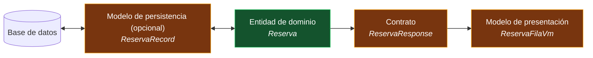

# Modelos, DTOs y contratos — `TEM-MODELOS`

## Resumen ejecutivo

El mismo concepto de negocio aparece hasta cuatro veces en un sistema con capas: como entidad de dominio, como fila de una tabla, como carga útil que cruza el borde HTTP y como estructura que la interfaz liga a sus controles. Son cuatro tipos distintos con el mismo nombre de pila, y decidir cuáles colapsar es una de las decisiones de organización que más consecuencias tiene y menos deliberación recibe.

La regla que ordena todo el documento cabe en una frase: **cada representación pertenece a la capa que la consume, no a la que la produce.** El DTO de la API no vive en el dominio aunque describa una entidad del dominio, porque quien lo cambia es una versión de la API y no una regla de negocio.

La cantidad de representaciones que hacen falta no es una preferencia: la determina la topología ([`TEM-TOPO`](../20-Organizacion-de-Soluciones/Topologias-de-Solucion.md)). En un proyecto único con Blazor Server no hay DTO de contrato porque no hay borde HTTP propio; en cuanto aparece un cliente que habla por red, el DTO deja de ser opcional. Le sirve a `ACT-02` todos los días y a `ACT-01` cuando decide la topología.

---

## Definición

### Qué es

Una representación es una forma concreta que toman los datos de un concepto en una capa determinada. `Reserva` como entidad de dominio, `ReservaResponse` como carga útil de una respuesta HTTP y `ReservaFilaVm` como estructura que una tabla liga son tres tipos distintos que describen la misma reserva desde tres lugares.

### Qué problema resuelve separarlas

**Independizar los ciclos de cambio.** Es la razón central. Una regla de negocio nueva cambia la entidad; una versión de la API cambia el contrato; un rediseño de pantalla cambia el modelo de presentación. Con un solo tipo compartido, cualquiera de los tres cambios obliga a revisar los otros dos contextos, y el tipo termina acumulando propiedades que solo sirven en uno de ellos.

**Controlar qué se expone.** Una entidad tiene campos que no deben salir: identificadores internos, marcas de auditoría, referencias a otras entidades que arrastrarían medio grafo al serializar. Un contrato explícito es la lista de lo que se publica, y esa lista es revisable.

**Evitar la serialización accidental de todo el grafo.** Una entidad de EF Core con propiedades de navegación serializada directamente produce respuestas enormes, ciclos, o consultas perezosas disparadas durante la serialización. El DTO corta eso por construcción.

### Qué NO es, y con qué se lo confunde

**No es duplicación.** Es la objeción habitual y merece respuesta directa: dos tipos con los mismos campos hoy no son duplicación si responden a razones de cambio distintas. Que coincidan es una circunstancia del momento, no una propiedad. La duplicación problemática es la que obliga a cambiar dos lugares por un mismo motivo; acá los motivos son distintos por definición.

**No es una capa de mapeo por sí sola.** Tener DTOs no aporta nada si el DTO es una copia mecánica de la entidad generada automáticamente y expuesta entera. El valor está en decidir qué se publica, no en interponer un tipo.

**No siempre hacen falta las cuatro.** Colapsar representaciones es legítimo y a menudo correcto. Lo que no es correcto es colapsarlas sin advertirlo, y descubrir el acoplamiento cuando aparece el segundo consumidor.

**El modelo de persistencia no es automáticamente distinto del dominio.** Con EF Core, mapear la entidad de dominio directamente es la práctica corriente y funciona. Separarlos es una decisión que se toma cuando el esquema y el modelo divergen lo suficiente, no un requisito del patrón.

---

## Las cuatro representaciones

| Representación | Qué es | Quién la cambia | Dónde vive |
|---|---|---|---|
| **Entidad de dominio** | El concepto con sus invariantes y su comportamiento | Una regla de negocio | `Domain/` |
| **Modelo de persistencia** | La forma que toma en la base | Un cambio de esquema | `Infrastructure/Persistence/` — o es la misma clase |
| **Contrato / DTO** | Lo que cruza el borde HTTP | Una versión de la API | El proyecto de contratos, o el borde de la API |
| **Modelo de presentación** | Lo que la interfaz liga a sus controles | Un cambio de pantalla | Junto al componente que lo usa |



El nodo de persistencia va rotulado como opcional a propósito: `ReservaRecord` solo existe cuando el esquema y el modelo divergieron lo bastante como para justificar una clase espejo. En el caso corriente ese nodo y el de dominio son la misma clase `Reserva`, mapeada por configuración de EF Core, y el diagrama se lee colapsando ambos en uno.

Las flechas hacia el contrato y la presentación son **de una sola dirección**. El dominio no conoce el DTO; el mapeo lo hace la capa que expone. Si el dominio referencia el contrato, la dependencia se invirtió y el ciclo de cambio de la API pasó a gobernar el del negocio.

---

## Nomenclatura: los dos planos del vocabulario

Acá se resuelve una pregunta que aparece en todo equipo hispanohablante y que suele plantearse mal, como si fuera una sola decisión de idioma. Son dos planos, y cada uno se decide por separado.

**El plano estructural** nombra la arquitectura: `Domain`, `Application`, `Infrastructure`, `Contracts`, `Services`, `Repositories`, `Handlers`. Comprende dos cosas y conviene decirlo con precisión, porque de ahí sale la mitad de las inconsistencias: **los segmentos de espacio de nombres y los sufijos de rol de los tipos** —`Service`, `Repository`, `Handler`, `Controller`, `Factory`, `Options`—. Un tipo llamado `ServicioReservas` dentro de `MiEmpresa.Reservas.Application` no está en una zona neutral: está mezclando dentro del plano estructural, igual que si el segmento dijera `Aplicacion`. Es vocabulario técnico que proviene de la literatura, y esa literatura está en inglés. Todo el instrumental —plantillas, ejemplos de la documentación, bibliotecas, respuestas de la comunidad— lo escribe en inglés, y los sufijos convencionales (`Service`, `Repository`, `Controller`, `Exception`, `EventArgs`) no admiten traducción sin perder la señal que comunican.

**El plano del dominio** nombra el negocio: `Reserva`, `Sala`, `PoliticaCancelacion`, `Aforo`. Es el lenguaje ubicuo de `O-03`, y su valor está en coincidir exactamente con las palabras que usa quien define las reglas. Si el negocio dice «reserva» y «aforo», traducirlos a `Booking` y `Capacity` introduce un diccionario que alguien tiene que mantener mentalmente en cada conversación.

**Esta guía recomienda** decidir cada plano por su propio criterio, y admite explícitamente la combinación más frecuente: **estructura en inglés, dominio en el idioma del negocio.**

```text
MiEmpresa.Reservas.Domain.Salas          ← Domain estructural, Salas del negocio
MiEmpresa.Reservas.Application.Puertos   ← inconsistente: mezcla dentro del plano
MiEmpresa.Reservas.Application.Ports     ← coherente
```

No es «mezclar idiomas»: es reconocer que hay dos vocabularios con orígenes distintos. Lo que sí falla es mezclar **dentro** de un plano —`Domain` junto a `Aplicacion`, o `Sala` junto a `BookingPolicy`—, porque ahí no hay criterio que permita anticipar en qué idioma está lo próximo que se busque.

La alternativa de escribir todo en español también es coherente y esta guía no la desaconseja; exige asumir que los sufijos convencionales se traducen (`ServicioReservas` e `IRepositorioReservas` en vez de `ReservasService` e `IReservasRepository`) y sostenerlo sin excepciones. Lo que no funciona es no decidir.

### Por qué `DTOs` y `Models` no son buenos segmentos

Esto es independiente del idioma, y conviene separarlo de la discusión anterior porque se arrastran juntos.

`N-01` pide pluralizar un segmento cuando agrupa **elementos semánticamente equivalentes**. `Salas` agrupa salas: es una agrupación semántica. `DTOs` agrupa cosas que comparten un rasgo técnico y ningún significado —el DTO de reservas y el de facturación no tienen nada que ver entre sí—, y a escala produce un namespace único con doscientos tipos de veinte funcionalidades distintas.

Es el mismo defecto que la clase `Utils` de [`TEM-ANTI`](../40-Nomenclatura/Antipatrones-de-Nombrado.md), a escala de espacio de nombres: agrupa por lo que las cosas **son** en vez de por lo que **tratan**. `Models`, `Entities`, `Helpers` y `Interfaces` como segmento tienen exactamente el mismo problema.

La forma que escala es concepto primero, tipo después si hace falta:

```text
MiEmpresa.Reservas.Contracts.Reservas      ← los contratos DE reservas
MiEmpresa.Reservas.Contracts.Salas         ← los contratos DE salas

MiEmpresa.Reservas.Contracts.DTOs          ← todos los DTOs de todo
```

`Contracts` como **proyecto** sí es correcto, porque ahí el criterio no es semántico sino de referencia: es lo que un cliente puede referenciar sin arrastrar el dominio ([`TEM-TOPO`](../20-Organizacion-de-Soluciones/Topologias-de-Solucion.md)). Adentro se organiza por concepto.

### Por qué el sufijo `Model` dice poco

`ReservaModel` no comunica en qué plano vive el tipo. Todo es un modelo de algo: la entidad modela el negocio, el DTO modela la carga útil, el modelo de presentación modela la pantalla. El sufijo que se aplica a las cuatro representaciones no distingue ninguna.

Los sufijos que sí informan dicen **para qué cruza el tipo una frontera**:

| Sufijo | Qué comunica | Ejemplo |
|---|---|---|
| `Request` | Entra por el borde HTTP | `CrearReservaRequest` |
| `Response` | Sale por el borde HTTP | `ReservaResponse` |
| `Dto` | Cruza una frontera, sin comportamiento y sin dirección declarada | `ReservaDto` |
| `Vm` / `ViewModel` | Lo liga la interfaz | `ReservaFilaVm` |
| *(sin sufijo)* | Es del dominio | `Reserva` |

`Request` y `Response` son preferibles a `Dto` porque además de decir que cruza dicen hacia dónde. `Dto` es aceptable cuando el tipo se usa en ambas direcciones. **La entidad de dominio no lleva sufijo**: es el concepto, y todo lo demás se nombra por referencia a él.

---

## Ejemplos concretos — la jerarquía completa, con clases

El mismo concepto en sus cuatro representaciones. Ejemplo sintético del sistema de reserva de salas, en la variante de estructura en inglés y dominio en español.

```text
src/
├── MiEmpresa.Reservas.Domain/
│   └── Reservas/
│       ├── Reserva.cs                    ← entidad, sin sufijo
│       ├── RangoHorario.cs               ← objeto de valor
│       ├── EstadoReserva.cs              ← enumeración
│       └── PoliticaCancelacion.cs        ← regla de negocio
│
├── MiEmpresa.Reservas.Application/
│   ├── Reservas/
│   │   └── ReservasService.cs           ← sufijo de rol: plano estructural
│   └── Ports/
│       └── IReservasRepository.cs
│
├── MiEmpresa.Reservas.Infrastructure/
│   └── Persistence/
│       ├── ReservasDbContext.cs
│       └── Configurations/
│           └── ReservaConfiguration.cs   ← mapeo EF Core, no una clase espejo
│
├── MiEmpresa.Reservas.Contracts/
│   └── Reservas/
│       ├── CrearReservaRequest.cs
│       ├── ReservaResponse.cs
│       └── ReservaResumenResponse.cs
│
└── MiEmpresa.Reservas.Web/
    └── Components/
        └── Reservas/
            ├── TablaReservas.razor
            └── ReservaFilaVm.cs          ← modelo de presentación, junto al componente
```

### El dominio

Lleva el comportamiento y protege las invariantes. Sin atributos de serialización, sin referencias a EF Core, sin sufijo.

```csharp
namespace MiEmpresa.Reservas.Domain.Reservas;

public sealed class Reserva
{
    private Reserva(Guid id, Guid salaId, RangoHorario periodo, string solicitante)
    {
        Id = id;
        SalaId = salaId;
        Periodo = periodo;
        Solicitante = solicitante;
        Estado = EstadoReserva.Pendiente;
    }

    public Guid Id { get; }
    public Guid SalaId { get; }
    public RangoHorario Periodo { get; private set; }
    public string Solicitante { get; }
    public EstadoReserva Estado { get; private set; }

    // El constructor es privado y la creación pasa por acá: no existe forma
    // de obtener una Reserva que viole la invariante del rango.
    public static Reserva Solicitar(Guid salaId, RangoHorario periodo, string solicitante)
    {
        if (periodo.Duracion > TimeSpan.FromHours(8))
        {
            throw new ArgumentException("Una reserva no puede exceder ocho horas.", nameof(periodo));
        }

        return new Reserva(Guid.NewGuid(), salaId, periodo, solicitante);
    }

    public void Cancelar(PoliticaCancelacion politica, DateTimeOffset ahora)
    {
        if (!politica.PermiteCancelar(this, ahora))
        {
            throw new InvalidOperationException("La reserva ya no admite cancelación.");
        }

        Estado = EstadoReserva.Cancelada;
    }
}
```

El objeto de valor no tiene identidad y se compara por contenido, que es exactamente lo que `record` expresa:

```csharp
namespace MiEmpresa.Reservas.Domain.Reservas;

public readonly record struct RangoHorario(DateTimeOffset Inicio, DateTimeOffset Fin)
{
    public TimeSpan Duracion => Fin - Inicio;

    public bool SeSolapaCon(RangoHorario otro) => Inicio < otro.Fin && otro.Inicio < Fin;
}
```

### El contrato

Tipos planos, serializables, sin comportamiento. Viven en el proyecto que el cliente puede referenciar.

```csharp
namespace MiEmpresa.Reservas.Contracts.Reservas;

// Entra: lo que el cliente envía. No incluye Id ni Estado: los decide el servidor.
public sealed record CrearReservaRequest(
    Guid SalaId,
    DateTimeOffset Inicio,
    DateTimeOffset Fin,
    string Solicitante);

// Sale: lo que el servidor publica. Nótese que NO expone todo lo que tiene
// la entidad, y que el estado viaja como string y no como el enum del dominio:
// agregar un valor al enum no debe romper a un cliente que no lo conoce.
public sealed record ReservaResponse(
    Guid Id,
    Guid SalaId,
    string NombreSala,
    DateTimeOffset Inicio,
    DateTimeOffset Fin,
    string Estado);
```

Dos decisiones del ejemplo que conviene notar. `ReservaResponse` incluye `NombreSala`, que la entidad `Reserva` no tiene —el contrato se arma para el consumidor, no para espejar la entidad—. Y `Estado` viaja como texto: exponer el enum del dominio ata la evolución de un tipo interno al contrato publicado.

### La presentación

Lo que la interfaz liga. Vive junto al componente porque cambia con él.

```csharp
namespace MiEmpresa.Reservas.Web.Components.Reservas;

// Solo lo que la tabla muestra, ya formateado para mostrarse.
public sealed record ReservaFilaVm(
    Guid Id,
    string Sala,
    string Franja,          // "14:00 – 15:30", ya compuesto
    string Estado,
    bool PuedeCancelarse);  // la decisión ya tomada: la vista no evalúa reglas
```

`PuedeCancelarse` ilustra el criterio: la vista **no** evalúa la política de cancelación. Recibe la respuesta. Si el componente tuviera que aplicar la regla, la lógica de negocio habría migrado a la presentación, que es la falla que describe [`TEM-CAPAS`](Modelos-de-Capas.md).

### El mapeo

Ocurre en la capa que expone, en una sola dirección, y es código explícito y aburrido a propósito.

```csharp
namespace MiEmpresa.Reservas.Api.Reservas;

internal static class MapeoReservas
{
    public static ReservaResponse ADto(this Reserva reserva, string nombreSala) =>
        new(reserva.Id,
            reserva.SalaId,
            nombreSala,
            reserva.Periodo.Inicio,
            reserva.Periodo.Fin,
            reserva.Estado.ToString());
}
```

### La misma jerarquía, todo en español

Para el equipo que decide el plano estructural en español. Es igualmente coherente y cambia solo los segmentos y los sufijos.

```text
MiEmpresa.Reservas.Dominio.Reservas          Reserva, RangoHorario, EstadoReserva
MiEmpresa.Reservas.Aplicacion.Puertos        IRepositorioReservas
MiEmpresa.Reservas.Infraestructura.Persistencia
MiEmpresa.Reservas.Contratos.Reservas        CrearReservaSolicitud, ReservaRespuesta
MiEmpresa.Reservas.Web.Components.Reservas   ReservaFilaVm
```

El punto de fricción de esta variante está en los sufijos convencionales. `CrearReservaSolicitud` es defendible; `SalaNoDisponibleExcepcion` ya no, porque `Exception` es el sufijo que `N-01` fija para los tipos que derivan de `Exception` y traducirlo rompe una convención que el instrumental asume. Esta guía recomienda, si se elige español estructural, mantener en inglés los sufijos que corresponden a tipos base del framework —`Exception`, `EventArgs`, `Attribute`, `Collection`— y traducir el resto.

---

## Cuántas representaciones según la topología

Lo que determina el número no es el gusto sino la topología ([`TEM-TOPO`](../20-Organizacion-de-Soluciones/Topologias-de-Solucion.md)).

| Topología | Dominio | Persistencia | Contrato | Presentación |
|---|:---:|:---:|:---:|:---:|
| `T1` proyecto único | sí | mapeo EF | **no hay borde** | opcional |
| `T2` capas en proyectos | sí | mapeo EF | **no hay borde** | opcional |
| `T3` web + API, un proceso | sí | mapeo EF | sí, en `Api/` | opcional |
| `T4` dos procesos | sí | mapeo EF | **sí, obligatorio** | sí |
| `T5` varios clientes | sí | mapeo EF | **sí, obligatorio** | sí, por cliente |

En `T1` y `T2` no hay DTO de contrato porque no hay contrato: los componentes ligan contra el dominio o contra un modelo de presentación local. Introducir DTOs ahí agrega mapeo sin comprar aislamiento, y es sobreingeniería frecuente.

El salto está entre `T3` y `T4`. Mientras el frontal referencia el proyecto de la API puede usar los tipos del dominio; en cuanto la comunicación es por red, el tipo del dominio no puede cruzar. Quien construye `T3` previendo migrar a `T4` conviene que imponga la disciplina del DTO desde el principio.

---

## Aplicación por escenario

### `ESC-1` — Sistema nuevo

Se decide junto con la topología y conviene registrarlo. Las dos decisiones concretas: el idioma de cada plano, y qué representaciones existen desde el día uno.

Esta guía recomienda el mínimo que la topología exige y ninguna más. Agregar un DTO cuando aparece el segundo consumidor es trabajo acotado; mantener durante dos años una capa de mapeo que nadie necesita es costo permanente.

### `ESC-2` — Evolución estructural

El caso característico es la aparición del segundo consumidor: había una aplicación web que usaba el dominio directamente y ahora hay un cliente móvil. Aparecen a la vez el proyecto de contratos, los DTOs y el mapeo.

El orden que esta guía recomienda: primero crear `Contracts` vacío y sin referencias, después mover o crear los DTOs ahí, y recién entonces cortar la referencia del frontal al dominio. Hacerlo al revés deja el sistema sin compilar durante toda la migración.

### `ESC-3` — Normalización

Aplica de forma limitada. Renombrar `ReservaModel` a `ReservaResponse` es mecánico y seguro con la operación de renombre del IDE. Lo que **no** es normalización es separar representaciones colapsadas: eso cambia el comportamiento en el borde y es `ESC-2`.

Una advertencia específica: renombrar un tipo de contrato puede cambiar el nombre que viaja serializado si la serialización depende del nombre del tipo o de sus propiedades. Antes de renombrar propiedades de un DTO hay que verificar la política de serialización y los clientes desplegados.

### `ESC-4` — Evaluación

Tres lecturas rápidas. Si una entidad de EF Core aparece en la firma de un endpoint público, no hay contrato y el esquema de la base está publicado. Si `Contracts` referencia `Domain`, los clientes están acoplados al dominio. Y si existe un namespace `Models` o `DTOs` con decenas de tipos de funcionalidades distintas, la organización es por tipo técnico y va a degradarse con el crecimiento.

### Qué cambia según el contexto

**`CTX-1`.** El modelo de presentación es la representación que más aparece y menos se nombra: con frecuencia vive como propiedades sueltas del componente. Formalizarlo rinde cuando la misma pantalla se arma desde dos fuentes.

**`CTX-2`.** El contrato es el producto. La entidad no debe aparecer nunca en una firma pública.

**`CTX-3`.** Los tipos publicados son contrato binario y aplican `N-01` a `N-04` literalmente. Un renombre es cambio ruptor.

**`CTX-4`.** Se agrega el contrato de mensajes entre servicios, que nadie verifica en compilación y que necesita versionado explícito.

---

## Preguntas guía

1. ¿Cuántas representaciones tiene hoy el concepto central del sistema, y cuántas exige su topología?
2. ¿Alguna entidad de dominio aparece en la firma de un endpoint público?
3. ¿El proyecto de contratos referencia el dominio?
4. ¿Los segmentos de espacio de nombres agrupan por concepto o por tipo técnico? ¿Existe un `Models` o un `DTOs` con tipos de funcionalidades distintas?
5. ¿Hay algún tipo con sufijo `Model` cuyo plano no se pueda determinar por el nombre?
6. ¿El plano estructural y el del dominio están cada uno en un solo idioma, y la decisión está escrita?
7. ¿El mapeo entre representaciones vive en la capa que expone, o el dominio conoce el DTO?
8. ¿Un enum del dominio viaja tal cual en un contrato publicado?

---

## Criterios de calidad

Un sistema con las representaciones bien repartidas tiene una propiedad verificable en un minuto: ningún tipo del dominio aparece en la firma de un endpoint público, y ningún tipo de contrato aparece dentro del dominio. A partir de ahí, tres condiciones. Cada representación existe porque su topología la exige y no por simetría. Los espacios de nombres agrupan por concepto. Y los sufijos permiten saber en qué plano vive un tipo sin abrirlo.

Antipatrones nombrados:

**La entidad expuesta.** El endpoint devuelve la entidad de EF Core. Publica el esquema de la base, arrastra propiedades de navegación al serializar y convierte cualquier cambio de modelo en un cambio ruptor de la API. Es el más frecuente de todos.

**El DTO en el dominio.** El contrato se define junto a la entidad «para no duplicar». El dominio pasa a depender de la forma del contrato HTTP, y una versión de la API obliga a tocar la capa de negocio.

**El tipo único con propiedades opcionales.** Una sola clase `Reserva` que sirve de entidad, de contrato y de modelo de presentación, con campos anulables que solo se llenan en algunos usos. Nadie puede saber qué campos son válidos en qué contexto, y el compilador no ayuda.

**El namespace por tipo técnico.** `Models`, `DTOs`, `Entities`, `Interfaces` como segmento. Agrupa por lo que las cosas son y no por lo que tratan; a los veinte casos de uso es un cajón.

**El sufijo `Model` universal.** `ReservaModel`, `SalaModel`, `UsuarioModel` en cuatro capas distintas. El sufijo no distingue nada y obliga a leer el namespace completo para ubicar el tipo.

**El enum del dominio en el contrato.** Serializar `EstadoReserva` como valor numérico ata el contrato al orden de declaración: insertar un valor en el medio reasigna los números y rompe silenciosamente a los clientes desplegados.

**El mapeo bidireccional automático.** Una herramienta que convierte entidad en DTO y DTO en entidad por convención de nombres. Reintroduce el acoplamiento que el DTO existía para cortar, y traslada a ejecución errores que el mapeo explícito habría dado en compilación.

**Los idiomas mezclados dentro de un plano.** `Domain` junto a `Aplicacion`, o `Sala` junto a `BookingPolicy`. La separación por planos es legítima; la mezcla dentro de un plano deja al lector sin forma de anticipar en qué idioma está lo próximo.
