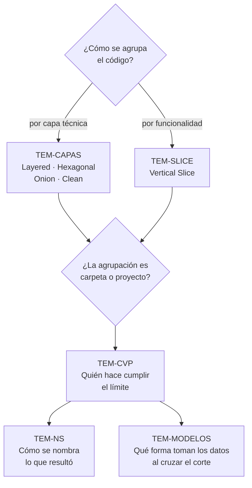

# Organización interna — `FAM-INT`

## Resumen ejecutivo

Adentro de una unidad desplegable hay decisiones que no dependen de cuántas unidades desplegables tenga el sistema. Cómo se separan las responsabilidades, en qué dirección se permiten las dependencias, si el código se agrupa por capa técnica o por funcionalidad, si esas agrupaciones son carpetas o proyectos, cómo se nombran los espacios de nombres que las reflejan, y qué forma toman los datos al pasar de una agrupación a otra. Un microservicio de doscientas líneas enfrenta las mismas preguntas que un monolito de cien mil, con respuestas distintas por tamaño, no por modelo de despliegue.

Esta familia trata ese eje y solo ese eje. La cantidad de unidades desplegables se decide en [`FAM-SRV`](../10-Arquitectura-de-Servicios/README.md); la composición de la solución y sus proyectos, en [`FAM-SOL`](../20-Organizacion-de-Soluciones/README.md). La independencia entre los tres es real y conviene ejercitarla: elegir Clean Architecture no dice nada sobre cuántos servicios habrá, y elegir microservicios no dice nada sobre cómo se ordena cada uno por dentro.

Le sirve sobre todo a `ACT-01`, que fija el modelo de capas y la dirección de las dependencias, y a `ACT-02`, que según la matriz de [`MARCO-ACTORES`](../00-Marco-de-Referencia/Actores.md) es responsable de la organización de carpetas dentro de su módulo. `ACT-04` la usa como criterio de evaluación: casi todo lo que se puede señalar en una revisión sin conocer la historia del sistema aparece en estos cinco documentos.

---

## La confusión que esta familia existe para deshacer

Buena parte del material disponible sobre organización de código .NET presenta Clean Architecture, Onion y Hexagonal como si fueran el estándar de Microsoft. No lo son. Sus orígenes están fuera del ecosistema —`O-04`, `O-06` y `O-05` respectivamente— y Microsoft las **describe** en `N-12` sin prescribirlas. La prueba más simple está a mano de cualquiera: `dotnet new webapp` genera un único proyecto sin capas separadas, y ese es el único comportamiento por defecto que Microsoft ofrece.

La consecuencia práctica de la confusión es cara. Equipos que arrancan con cuatro proyectos y una inversión de dependencia completa porque creen estar cumpliendo una norma, cuando en realidad están adoptando una opinión —legítima, pero opinión— cuyo costo permanente nadie evaluó. El desarme detallado está en [`TEM-CAPAS`](Modelos-de-Capas.md), que es donde la familia carga más peso argumentativo.

Hay una segunda confusión, más silenciosa y más frecuente. «Separar en capas» y «separar en proyectos» se tratan como la misma decisión, y son dos. Se puede tener un modelo de capas impecable en carpetas dentro de un único `.csproj`, y se puede tener siete proyectos con dependencias circulares disfrazadas. Lo que cambia al partir en proyectos es quién verifica el límite —el compilador o la disciplina—, y ese es el tema de [`TEM-CVP`](Carpetas-o-Proyectos.md).

El diagrama fija el orden de lectura y también una relación que el texto repite: `TEM-CAPAS` y `TEM-SLICE` no son alternativas excluyentes. Se combinan con frecuencia, y la combinación habitual es cortes verticales dentro de un módulo con capas dentro de cada corte.

---

## Documentos de la familia

| ID | Documento | Qué resuelve |
|----|-----------|--------------|
| [`TEM-CAPAS`](Modelos-de-Capas.md) | Modelos de capas | Los cuatro modelos de organización horizontal con su origen verificable, qué comparten realmente, y cuál es el nivel de autoridad de cada uno |
| [`TEM-SLICE`](Vertical-Slice.md) | Vertical Slice | La organización por funcionalidad, su tensión con las capas horizontales, y cómo se combinan en lugar de excluirse |
| [`TEM-CVP`](Carpetas-o-Proyectos.md) | Carpetas o proyectos | El documento de decisión: qué cambia de verdad al partir en `.csproj`, qué mecanismos intermedios existen, y cuándo se justifica el corte |
| [`TEM-NS`](Espacios-de-Nombres.md) | Espacios de nombres | La convención normativa de nombrado, su relación con las carpetas, y qué cambia cuando el espacio de nombres es contrato público |
| [`TEM-MODELOS`](Modelos-y-Contratos.md) | Modelos, DTOs y contratos | Las cuatro representaciones de un mismo concepto, en qué capa vive cada una, los sufijos que las distinguen y la decisión de idioma por planos |

`TEM-CVP` es el más operativo de los cinco y presupone los dos primeros: elige entre estructuras que `TEM-CAPAS` y `TEM-SLICE` describen. `TEM-NS` es transversal y se puede leer suelto.

Los cinco documentos responden preguntas encadenadas sobre el mismo corte. `TEM-CAPAS` y `TEM-SLICE` dicen **cómo se corta** el código —en franjas horizontales o en cortes verticales—; `TEM-CVP` decide si ese corte es una carpeta o un `.csproj`, es decir quién lo hace cumplir; `TEM-NS` fija cómo se nombra lo que resultó. `TEM-MODELOS` cierra la serie con la pregunta que las otras cuatro dejan abierta: **qué forma toman los datos al cruzar esos cortes**. Un límite entre capas solo significa algo si los tipos que lo atraviesan cambian de forma al hacerlo; cuando la misma entidad viaja desde la base hasta la vista, el corte está dibujado pero no existe.

El vínculo con la familia anterior pasa por ahí. Cuántas representaciones hacen falta no lo decide el gusto sino la topología de la solución ([`TEM-TOPO`](../20-Organizacion-de-Soluciones/Topologias-de-Solucion.md)): sin un borde HTTP propio no hay DTO de contrato, y en cuanto un consumidor habla por red el DTO deja de ser opcional.

---

## Cómo se relaciona con el resto de la guía

**Con el marco.** El escenario cambia radicalmente qué documento importa. En `ESC-1` la familia entera está en juego y el riesgo dominante es sobreestructurar; en `ESC-2` el documento útil suele ser `TEM-CVP`, porque el síntoma —«un cambio pequeño toca cinco carpetas»— es un problema de eje de agrupación, no de despliegue, tal como advierte [`MARCO-ESCENARIOS`](../00-Marco-de-Referencia/Escenarios.md). En `ESC-3` casi todo lo de la familia es caro de aplicar retroactivamente, con la excepción de `TEM-NS`, que sí se normaliza con herramientas.

El contexto pesa sobre todo en dos puntos. `CTX-1` es el que más se beneficia de una separación explícita, porque nada impide que un componente Blazor consulte la base de datos directamente y compile igual. `CTX-3` convierte el espacio de nombres en parte del contrato publicado, y por eso `TEM-NS` tiene una sección dedicada.

**Con la arquitectura de servicios.** [`TEM-MODU`](../10-Arquitectura-de-Servicios/Monolito-Modular.md) trata límites entre módulos dentro de un despliegue único; esta familia trata la organización dentro de cada módulo. Son escalas anidadas del mismo problema, y los mecanismos de aplicación —`internal`, analizadores, pruebas de arquitectura— se comparten.

**Con la organización de soluciones.** La decisión de `TEM-CVP` produce proyectos o no los produce; si los produce, [`TEM-SLN`](../20-Organizacion-de-Soluciones/Estructura-de-Solucion.md) determina cómo se agrupan en la solución y qué convenciones de nombre siguen.

**Con la nomenclatura.** [`TEM-NS`](Espacios-de-Nombres.md) fija la estructura de los espacios de nombres; la capitalización de sus segmentos se explica una vez en [`TEM-CAPS`](../40-Nomenclatura/Capitalizacion.md) y no se repite acá.

**Con las referencias.** `N-12` es la única fuente de Microsoft que cubre estos modelos, y los cubre describiéndolos. Los orígenes reales son `O-02` para el modelo en capas, `O-05` para Hexagonal, `O-06` para Onion, `O-04` para Clean Architecture y `O-07` para Vertical Slice. «Screaming Architecture» aparece en la sección 4 de [`ANEXO-REFERENCIAS`](../99-Anexos/Referencias.md) entre los conceptos sin fuente normativa, y esta familia lo trata con esa reserva.

---

## Ejemplo de referencia de la familia

Los cinco documentos vuelven sobre un mismo ejemplo sintético, el sistema de reserva de salas que la guía usa como hilo conductor, porque ilustra las cuatro decisiones a la vez. Un único proyecto `Microsoft.NET.Sdk.Web` con las capas en carpetas —`Dominio/`, `Aplicacion/`, `Infraestructura/`, `Components/`—, puertos declarados como interfaces en `Aplicacion/Puertos/`, espacios de nombres que reproducen exactamente la ruta de carpetas bajo `MiEmpresa.Reservas.Web`, y sintaxis de ámbito de archivo en todo el código.

Es una configuración deliberadamente ordinaria, y por eso sirve. Muestra una disciplina de capas sin la ceremonia de partir en proyectos, y muestra también el riesgo que esa elección acepta: con un solo `.csproj`, el `PackageReference` de EF Core alcanza a todas las carpetas y nada impide que `Dominio/` lo use. Que no lo use depende de la revisión, no del compilador. Esa asimetría es el contenido de [`TEM-CVP`](Carpetas-o-Proyectos.md).
