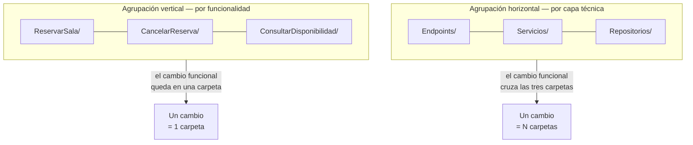

# Vertical Slice — `TEM-SLICE`

## Resumen ejecutivo

Agregar un campo al formulario de reserva obliga a tocar el componente, el servicio de aplicación, la interfaz del repositorio, su implementación, el modelo de datos y la validación. Seis archivos en cinco carpetas distintas, ninguna de ellas cerca de las otras. Ese es el costo cotidiano de organizar el código por capa técnica, y es el problema que Jimmy Bogard plantea en `O-07`.

La propuesta invierte el eje de agrupación. En lugar de juntar todos los servicios en una carpeta y todos los repositorios en otra, se junta todo lo que una funcionalidad necesita: su petición, su manejador, su validación y su acceso a datos viven en el mismo lugar y se leen de corrido. El principio que lo ordena es simple de enunciar y difícil de aplicar con consistencia: **el código que cambia junto vive junto**.

Le sirve sobre todo a `ACT-02`, que según [`MARCO-ACTORES`](../00-Marco-de-Referencia/Actores.md) decide la organización de carpetas dentro de su módulo, y a `ACT-01` cuando el síntoma de `ESC-2` es que un cambio pequeño se dispersa. No es una alternativa a los modelos de capas de [`TEM-CAPAS`](Modelos-de-Capas.md), aunque la divulgación las presente enfrentadas: se combinan, y la combinación es más frecuente que cualquiera de las dos en estado puro.

---

## Definición

### Qué es

Una organización del código por **funcionalidad** en lugar de por rol técnico. Cada funcionalidad —reservar una sala, cancelar una reserva, consultar disponibilidad— ocupa una carpeta que contiene todos los artefactos que esa operación necesita, desde la entrada hasta la persistencia.

Bogard lo formula en `O-07` a partir de una observación sobre el acoplamiento. Las capas horizontales maximizan la cohesión de lo técnicamente semejante y minimizan la de lo funcionalmente relacionado; el corte vertical hace lo contrario. Como la unidad de cambio de un sistema es casi siempre la funcionalidad y casi nunca la capa, la segunda disposición se alinea mejor con el trabajo real.

Una consecuencia menos evidente y bastante liberadora: cada corte puede resolverse con la técnica que le convenga. Una consulta de solo lectura puede ejecutar SQL directo sin pasar por el modelo de dominio; una operación con reglas densas puede usar entidades, agregados e inversión completa. En una arquitectura por capas esa asimetría es difícil de sostener, porque la capa impone su forma a todo lo que la atraviesa.

### Qué problema resuelve

**La dispersión del cambio.** El síntoma que [`MARCO-ESCENARIOS`](../00-Marco-de-Referencia/Escenarios.md) registra en `ESC-2` como «un cambio pequeño obliga a tocar archivos en cinco carpetas distintas». La causa habitual no es la falta de capas sino que las carpetas estén organizadas por capa cuando el sistema cambia por funcionalidad.

**La abstracción por adelantado.** Las capas empujan a definir interfaces genéricas que sirvan a todos los consumidores: un `IRepositorioReservas` con doce métodos porque doce operaciones lo usan. Cada método nuevo altera un contrato compartido, y cada cambio en el contrato obliga a revisar a todos los usuarios. El corte vertical permite que cada funcionalidad tenga exactamente la consulta que necesita y ninguna otra.

**El costo de leer.** Entender qué hace «cancelar una reserva» requiere abrir un directorio en lugar de reconstruir el flujo saltando entre cinco carpetas. Para quien llega al sistema, esa diferencia es sustancial.

### Qué NO es, y con qué se lo confunde

**No es un estándar de Microsoft.** Su origen es `O-07`, un artículo de blog de 2018. Microsoft no lo menciona en `N-12` ni publica templates que lo generen. Aplica lo mismo que se dice en [`TEM-CAPAS`](Modelos-de-Capas.md) sobre Clean, Onion y Hexagonal.

**No es lo contrario de las capas.** Es el argumento central de este documento y se desarrolla más abajo. Un corte vertical puede tener capas adentro, y de hecho las tiene apenas la funcionalidad supera cierta complejidad.

**No es ausencia de estructura.** Una carpeta por funcionalidad con archivos de mil líneas adentro no es Vertical Slice, es desorden con nombre de moda. El modelo mueve el eje de agrupación; no elimina la necesidad de separar responsabilidades.

**No requiere una biblioteca de mediación.** El patrón se asocia con frecuencia a un mediador que despacha peticiones a manejadores, y esa asociación viene de que Bogard es autor de una biblioteca de ese tipo. La organización por funcionalidad no depende de ninguna biblioteca: se puede implementar con clases estáticas, con métodos de extensión sobre el enrutador, o con inyección directa del manejador en el endpoint.

**No es CQRS.** Separar el modelo de lectura del de escritura es una decisión sobre el modelo de datos; agrupar por funcionalidad es una decisión sobre la disposición de los archivos. Aparecen juntos con frecuencia porque el corte vertical facilita que lecturas y escrituras usen caminos distintos, pero adoptar uno no implica el otro.

### Screaming Architecture

El concepto se atribuye a Robert C. Martin y se resume en una idea: la estructura de un sistema debería **gritar qué hace**, no con qué está construido. Alguien que abre el repositorio de un sistema de reserva de salas debería ver reservas, salas y disponibilidad en el primer nivel, no `Controllers`, `Services` y `Repositories`, que es lo que vería en cualquier otro sistema del mundo.

La analogía que sostiene el argumento es arquitectónica en sentido literal: los planos de una biblioteca gritan «biblioteca» y no gritan «hormigón armado». El material de construcción es un detalle de implementación, y un framework web ocupa ese mismo lugar respecto de un sistema de software.

Conviene registrar la reserva que corresponde. Según la sección 4 de [`ANEXO-REFERENCIAS`](../99-Anexos/Referencias.md), el concepto está atribuido a Martin y fue divulgado en su blog, **no en `O-04`**. Es una idea con menos respaldo bibliográfico que las de la sección 3 del anexo, y esta guía la usa como argumento —convincente— y no como fuente.

---

## Capas y cortes: la tensión real

La contraposición se plantea mal casi siempre. Se la presenta como una elección entre dos arquitecturas rivales, cuando son dos ejes de una misma cuadrícula: todo sistema tiene funcionalidades y tiene responsabilidades técnicas, y la pregunta es cuál de los dos determina el primer nivel de carpetas.



**Qué se gana.** Localidad del cambio, que es la propiedad principal. Con ella vienen tres consecuencias: los conflictos de fusión bajan porque dos equipos que trabajan en funcionalidades distintas no tocan los mismos archivos; la eliminación de una funcionalidad es borrar un directorio, sin residuos en carpetas ajenas; y cada corte puede elegir su técnica sin negociar con los demás.

**Qué se pierde.** La barrera técnica explícita, y es una pérdida real que la divulgación tiende a minimizar. En un modelo de capas con proyectos separados, el compilador impide que un endpoint use el `DbContext`. Con cortes verticales, el acceso a datos está en la misma carpeta que la presentación, y nada estructural distingue lo uno de lo otro: la separación depende enteramente de la disciplina de quien escribe y de quien revisa. En un equipo con rotación alta, esa dependencia se paga.

Se pierde también la reutilización que la capa hacía obvia. Si tres funcionalidades necesitan la misma consulta y cada una la tiene en su carpeta, la duplicación es visible. A veces es correcta —tres consultas parecidas que van a divergir—, a veces no lo es, y distinguirlas requiere criterio en cada caso, no una regla.

**Cómo se combinan.** La disposición que esta guía recomienda para sistemas de tamaño medio: cortes verticales en el primer nivel, capas adentro del corte cuando la funcionalidad las justifica, y un dominio compartido en el nivel superior para lo que efectivamente es transversal —las entidades, los objetos de valor, las reglas invariantes que no pertenecen a una sola operación.

```text
src/MiEmpresa.Reservas/
├── Dominio/                        // compartido: entidades y reglas invariantes
│   ├── Reserva.cs
│   ├── Sala.cs
│   └── RangoHorario.cs
├── Funcionalidades/
│   ├── ReservarSala/               // corte con capas adentro
│   │   ├── ReservarSalaEndpoint.cs
│   │   ├── ReservarSalaHandler.cs
│   │   ├── ReservarSalaValidador.cs
│   │   └── ConsultaDeSuperposicion.cs
│   └── ConsultarDisponibilidad/    // corte plano: no hay reglas que aislar
│       └── ConsultarDisponibilidad.cs
└── Infraestructura/
    └── ReservasDbContext.cs
```

La asimetría entre los dos cortes del ejemplo es deliberada y es lo que el modelo permite. `ReservarSala` tiene reglas y merece separación interna; `ConsultarDisponibilidad` es una consulta y un archivo alcanza. Forzar la misma estructura en ambos es lo que las capas obligan y lo que el corte vertical evita.

---

## Aplicación por escenario

### `ESC-1` — Sistema nuevo

Es el escenario donde el modelo se adopta con menos costo, porque no hay que mover nada. La dificultad está en otro lado: nombrar las funcionalidades exige conocer el dominio, y en el día uno ese conocimiento no existe. Un corte mal delimitado se arrastra igual que una capa mal ubicada.

Esta guía recomienda derivar los nombres de los cortes de los casos de uso ya identificados —`CU-` en la nomenclatura de [`MARCO-CONVENCIONES`](../00-Marco-de-Referencia/Convenciones.md)— en lugar de inventarlos. Si el análisis dice «reservar sala», la carpeta se llama `ReservarSala`, y la trazabilidad entre el requisito y el código sale gratis.

Por contexto: en `CTX-1` los artefactos de presentación complican el corte, porque los archivos `.razor` tienen convenciones de ubicación que el framework asume; la solución habitual es dejar las páginas en `Components/` y llevar al corte todo lo que no sea UI. En `CTX-3` el modelo aplica menos, porque una biblioteca se organiza por la superficie que publica y no por los casos de uso de nadie.

### `ESC-2` — Evolución estructural

El síntoma que justifica la migración es el que ya se nombró: un cambio funcional que toca cinco carpetas de forma sistemática. Conviene medirlo antes de decidir, y el dato está disponible: los archivos que cambian juntos en el historial de control de versiones. Si los commits de funcionalidad tocan consistentemente archivos de tres o cuatro capas distintas, la evidencia está.

La migración es incremental por naturaleza, y esa es su mayor ventaja frente a un cambio de modelo de capas. Se crea `Funcionalidades/` al lado de las carpetas existentes, se mueve una funcionalidad completa, y se deja el resto donde está. Conviven sin problema. Lo que no conviene es dejar la convivencia indefinida sin registrarla, porque un sistema con dos organizaciones simultáneas y sin criterio declarado es peor que cualquiera de las dos.

### `ESC-3` — Normalización de código existente

Aplica de forma limitada. Mover archivos entre carpetas es una reorganización, no una normalización, y presentarla como tal es el modo habitual de introducir un cambio estructural sin aprobación. Vale la advertencia de `ESC-3`: el movimiento de archivos requiere criterio y revisión, y no se mezcla en el mismo commit con lo que una herramienta hace sola.

Lo que sí corresponde: si el sistema ya está organizado por funcionalidad, verificar que los espacios de nombres lo reflejen y no hayan quedado replicando la capa técnica anterior. Es uno de los antipatrones que registra [`TEM-NS`](Espacios-de-Nombres.md) y se corrige mecánicamente.

### `ESC-4` — Evaluación de código ajeno

Lo primero que se evalúa es si el eje es consistente. Un sistema con `Funcionalidades/ReservarSala/` y también `Servicios/ServicioReservas.cs` tiene dos organizaciones compitiendo, y quien llega no sabe dónde poner el archivo siguiente. Esa ambigüedad cuesta más que cualquiera de los dos modelos aplicado mal.

Lo segundo es si la disciplina interna existe. Un corte donde el endpoint construye la consulta LINQ en línea es exactamente lo que el crítico del modelo predice, y es un hallazgo legítimo. Lo tercero es si hay reglas de negocio duplicadas entre cortes: la misma validación de superposición escrita tres veces con tres criterios sutilmente distintos es el fallo más caro que este modelo habilita.

---

## Ejemplos concretos

### Un corte completo

Sintético, sobre el dominio de reserva de salas. El ejemplo usa el **plano estructural en español** —`Funcionalidades/`, `Dominio/`, `Infraestructura/`—, una de las dos variantes que [`TEM-MODELOS`](Modelos-y-Contratos.md) admite; con estructura en inglés el segmento equivalente sería `Features/`. Los cuatro artefactos viven en `Funcionalidades/ReservarSala/` y se leen en orden. La petición primero:

```csharp
// Funcionalidades/ReservarSala/ReservarSalaRequest.cs
namespace MiEmpresa.Reservas.Funcionalidades.ReservarSala;

public sealed record ReservarSalaRequest(
    Guid SalaId,
    DateTimeOffset Inicio,
    DateTimeOffset Fin,
    string SolicitanteEmail);
```

La validación de forma, separada de la validación de negocio. Acá solo se comprueba lo que se puede comprobar sin consultar nada:

```csharp
// Funcionalidades/ReservarSala/ReservarSalaValidador.cs
namespace MiEmpresa.Reservas.Funcionalidades.ReservarSala;

internal static class ReservarSalaValidador
{
    public static IReadOnlyList<string> Validar(ReservarSalaRequest peticion)
    {
        var errores = new List<string>();

        if (peticion.Fin <= peticion.Inicio)
        {
            errores.Add("El período debe terminar después de comenzar.");
        }

        if (string.IsNullOrWhiteSpace(peticion.SolicitanteEmail))
        {
            errores.Add("Se requiere el correo del solicitante.");
        }

        return errores;
    }
}
```

El manejador, con su acceso a datos propio. Consulta exactamente lo que necesita y no pasa por ninguna abstracción compartida:

```csharp
// Funcionalidades/ReservarSala/ReservarSalaHandler.cs
using Microsoft.EntityFrameworkCore;
using MiEmpresa.Reservas.Dominio;
using MiEmpresa.Reservas.Infraestructura;

namespace MiEmpresa.Reservas.Funcionalidades.ReservarSala;

internal sealed class ReservarSalaHandler(ReservasDbContext contexto, TimeProvider reloj)
{
    public async Task<ReservarSalaResultado> ManejarAsync(
        ReservarSalaRequest peticion,
        CancellationToken cancelacion)
    {
        var errores = ReservarSalaValidador.Validar(peticion);
        if (errores.Count > 0)
        {
            return ReservarSalaResultado.Invalida(errores);
        }

        if (peticion.Inicio < reloj.GetUtcNow())
        {
            return ReservarSalaResultado.Rechazada("No se admiten reservas en el pasado.");
        }

        var periodo = new RangoHorario(peticion.Inicio, peticion.Fin);

        var haySuperposicion = await contexto.Reservas
            .AnyAsync(
                r => r.SalaId == peticion.SalaId
                     && r.Periodo.Inicio < periodo.Fin
                     && periodo.Inicio < r.Periodo.Fin,
                cancelacion);

        if (haySuperposicion)
        {
            return ReservarSalaResultado.Rechazada("La sala ya está reservada en ese período.");
        }

        var reserva = Reserva.Solicitar(peticion.SalaId, periodo, peticion.SolicitanteEmail);
        contexto.Reservas.Add(reserva);
        await contexto.SaveChangesAsync(cancelacion);

        return ReservarSalaResultado.Aceptada(reserva.Id);
    }
}
```

Y el endpoint, que registra la ruta y delega:

```csharp
// Funcionalidades/ReservarSala/ReservarSalaEndpoint.cs
namespace MiEmpresa.Reservas.Funcionalidades.ReservarSala;

internal static class ReservarSalaEndpoint
{
    public static void Registrar(IEndpointRouteBuilder rutas) =>
        rutas.MapPost("/api/reservas", async (
            ReservarSalaRequest peticion,
            ReservarSalaHandler manejador,
            CancellationToken cancelacion) =>
        {
            var resultado = await manejador.ManejarAsync(peticion, cancelacion);
            return resultado.EsAceptada
                ? Results.Created($"/api/reservas/{resultado.ReservaId}", resultado)
                : Results.BadRequest(resultado.Errores);
        });
}
```

Lo que demuestra el conjunto: los cuatro archivos suman menos de cien líneas, se leen sin abrir ninguna otra carpeta, y todos son `internal` salvo la petición. Eliminar la funcionalidad es borrar el directorio y quitar una línea del registro de rutas. El precio está a la vista en el manejador, que usa `ReservasDbContext` directamente: no hay ninguna barrera estructural entre esta funcionalidad y la base de datos, y si la regla de superposición tiene que aplicarse también en otro corte, hay que decidir conscientemente dónde ponerla.

### Contraste con la disposición horizontal

El mismo sistema, tres funcionalidades, bajo los dos ejes. Por capa:

```text
src/MiEmpresa.Reservas/
├── Endpoints/
│   ├── ReservasEndpoints.cs
│   └── DisponibilidadEndpoints.cs
├── Servicios/
│   ├── ServicioReservas.cs
│   └── ServicioDisponibilidad.cs
├── Repositorios/
│   ├── IRepositorioReservas.cs
│   └── RepositorioReservas.cs
└── Modelos/
    ├── ReservarSalaRequest.cs
    ├── CancelarReservaRequest.cs
    └── DisponibilidadResponse.cs
```

Por funcionalidad:

```text
src/MiEmpresa.Reservas/
├── Funcionalidades/
│   ├── ReservarSala/
│   │   ├── ReservarSalaRequest.cs
│   │   ├── ReservarSalaValidador.cs
│   │   ├── ReservarSalaHandler.cs
│   │   └── ReservarSalaEndpoint.cs
│   ├── CancelarReserva/
│   │   ├── CancelarReservaRequest.cs
│   │   ├── CancelarReservaHandler.cs
│   │   └── CancelarReservaEndpoint.cs
│   └── ConsultarDisponibilidad/
│       ├── ConsultarDisponibilidadHandler.cs
│       └── ConsultarDisponibilidadEndpoint.cs
├── Dominio/
│   ├── Reserva.cs
│   └── Sala.cs
└── Infraestructura/
    └── ReservasDbContext.cs
```

La cuenta de archivos es casi la misma; lo que cambia es la distancia entre los que se editan juntos. Agregar un motivo de cancelación obligatorio toca dos archivos contiguos en la segunda disposición y cuatro archivos repartidos en la primera.

### El contraejemplo, que es igual de informativo

Conviene mirar la distribución inversa, porque decide en contra de este modelo con el mismo razonamiento. Un sistema de reserva de salas con pocas operaciones —reservar, cancelar, consultar disponibilidad— y un dominio de reglas concentradas —solapamiento de rangos horarios, política de cancelación, aforo— tiene como unidad de cambio la regla, no el caso de uso. Un cambio en `PoliticaCancelacion` toca un archivo del dominio y ninguno de los cortes. Con esa distribución, la agrupación horizontal cuesta poco: las tres carpetas de capa se recorren enteras en un minuto, y el corte vertical aportaría menos de lo que cuesta introducirlo.

La prueba está en el historial, no en la preferencia. Si los commits agrupan archivos de `Dominio/`, el eje de cambio es la regla; si agrupan un handler con su endpoint y su validador, es la funcionalidad.

---

## Preguntas guía

1. ¿Cuál es la unidad de cambio real de este sistema —la funcionalidad o la capa? El historial de control de versiones lo responde: qué archivos cambian juntos.
2. ¿La estructura de carpetas del primer nivel dice qué hace el sistema o con qué está construido?
3. ¿Puedo eliminar una funcionalidad borrando un directorio? Si quedan residuos en cuatro carpetas, el corte no está completo.
4. ¿Qué reglas de negocio están duplicadas entre cortes, y coinciden exactamente?
5. ¿Existe un criterio declarado sobre qué va al dominio compartido y qué se queda en el corte, o cada uno decide?
6. ¿La carpeta compartida está creciendo commit a commit? Es el indicador temprano de que el modelo se está degradando.
7. ¿Los cortes se llaman entre sí? Si sí, ¿está registrado en algún lado quién puede llamar a quién?
8. ¿Estamos adoptando este modelo por un síntoma medible o porque las capas nos parecen anticuadas?

---

## Criterios de calidad

Un corte vertical bien aplicado tiene un límite que se puede nombrar: la carpeta corresponde a una operación que un usuario o un sistema externo puede pedir, no a una entidad ni a un rol técnico. Sus archivos son en su mayoría `internal`, porque nadie fuera del corte debería necesitarlos. Las reglas de negocio invariantes viven en el dominio compartido y no dentro de un corte, de modo que dos funcionalidades no puedan discrepar sobre la misma regla. Y hay un criterio declarado sobre qué es transversal y qué no, porque sin él cada desarrollador resuelve la duda distinto.

Antipatrones nombrados:

**Corte por entidad.** `Funcionalidades/Reservas/` con doce archivos adentro que cubren todas las operaciones sobre reservas. Es una capa de dominio con otro nombre: la carpeta vuelve a crecer con cada operación y la localidad del cambio se pierde.

**Corte anémico.** Una carpeta por funcionalidad y un solo archivo adentro que reenvía a un servicio compartido de la carpeta de al lado. Se pagó la estructura sin mover nada.

**El helper compartido que absorbe todo.** Aparece un `Comun/` o un `Shared/` que empieza con dos utilidades y termina conteniendo la mitad del sistema, porque cada vez que dos cortes se parecen algo migra ahí. Es el mismo problema que el nombre genérico vacío de [`TEM-ANTI`](../40-Nomenclatura/Antipatrones-de-Nombrado.md), a escala de carpeta compartida. Es la falla más frecuente del modelo, y su antídoto es tolerar duplicación hasta que la tercera repetición demuestre que el concepto existe.

**Regla de negocio duplicada con divergencia.** La validación de superposición está escrita en `ReservarSala` y en `ModificarReserva` con criterios de borde distintos —uno usa `<` y el otro `<=`—. El sistema acepta lo que rechaza por otro camino, y el fallo tarda meses en aparecer.

**Corte sin límite de acceso.** Todo público, y las funcionalidades se llaman entre sí. El grafo de dependencias entre cortes se vuelve una maraña, y se perdió la propiedad de poder borrar un directorio.

**Slice de mentira.** La carpeta se llama por funcionalidad pero adentro hay un `Controllers/`, un `Services/` y un `Repositories/`. Es la organización horizontal anidada dentro de la vertical, con los costos de ambas.
