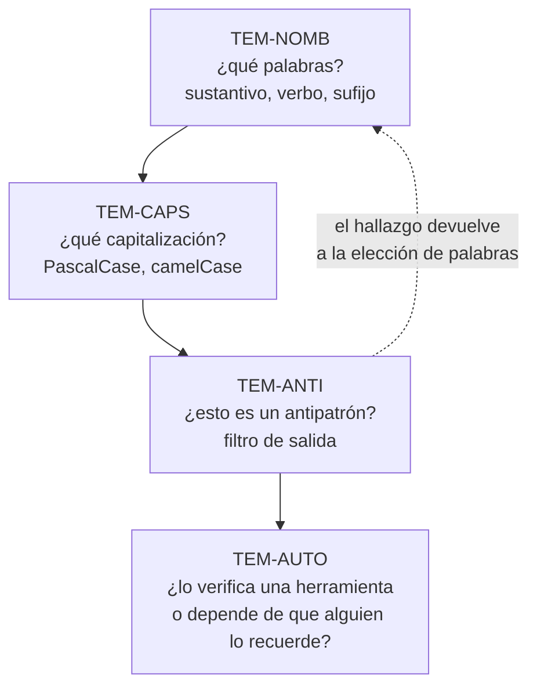

# Nomenclatura — `FAM-NOM`

## Resumen ejecutivo

De todas las familias de esta guía, esta es la que tiene más respaldo normativo y menos margen de opinión. Microsoft especifica qué capitalización lleva cada clase de identificador (`N-02`), qué categoría gramatical corresponde a cada clase de miembro (`N-04`), y prohíbe explícitamente algunas prácticas —la notación húngara, las abreviaturas— en lugar de limitarse a desaconsejarlas (`N-03`). Buena parte de lo que un equipo discute en las revisiones de código ya está resuelto en una página publicada.

Lo que sí queda abierto, y esta familia trata con honestidad, es todo lo demás: qué sufijos convencionales adopta el equipo, cómo se nombran los tests, y qué hacer con la fila enorme de convenciones que el ecosistema practica sin que ninguna especificación las imponga —el prefijo `_`, el prefijo `s_`, el sufijo `Async`—. La familia marca en cada caso de qué nivel de autoridad se trata, porque el error más frecuente en la literatura sobre el tema no es equivocarse en la regla sino equivocarse en quién la dictó.

Le sirve principalmente a `ACT-02`, que aplica estas decisiones docenas de veces por día, y a `ACT-03`, que las fija. `ACT-06` la lee de otra manera: en `CTX-3` un nombre público mal elegido no es una molestia estética sino una versión mayor del paquete.

---

## Dos planos que se confunden

**Nomenclatura no es estilo de formato.** La distinción organiza esta familia y la separa de [`FAM-EST`](../50-Estilo-de-Codificacion/README.md).

La nomenclatura decide **qué palabras** componen un identificador y **con qué capitalización** se escriben: que un método se llame `CancelarReserva` y no `procesarDatos1`. El estilo de formato decide **cómo se dispone el texto alrededor** de esos identificadores: dónde va la llave de apertura, cuántos espacios de sangría, si `var` es aceptable, en qué orden van los `using`.

Ambos planos se automatizan con la misma herramienta —`.editorconfig` más analizadores, tratado en [`TEM-AUTO`](../50-Estilo-de-Codificacion/Automatizacion-del-Estilo.md)— y por eso se los mete en la misma bolsa. Pero se comportan de forma distinta en algo que importa. Un cambio de formato es mecánico, verificable por herramienta y de riesgo nulo. Un cambio de nombre exige criterio humano, atraviesa la superficie pública y, en `CTX-3`, rompe consumidores. Un equipo puede normalizar el formato de un repositorio entero en un commit; renombrar cien tipos en un commit es una operación distinta y merece otro tratamiento (`ESC-3`).

---

## Para quién se escribieron las Framework Design Guidelines

`N-01` a `N-04` son las páginas de *Framework Design Guidelines* en Microsoft Learn, reimpresión de la segunda edición del libro de Cwalina y Abrams de 2008 (`O-01`), con aviso explícito de posible desactualización. El título delimita el alcance: **framework**, no aplicación.

La consecuencia práctica se hace visible en `CTX-3`. Ahí los nombres son contrato, un renombre es un cambio ruptor, y el rigor completo de estas guías está justificado hasta en sus detalles menores. En una aplicación interna —`CTX-1` o `CTX-2`, donde todo se recompila junto y el único consumidor es el propio equipo— el mismo rigor compra bastante menos. Esta guía las cita como normativas y a la vez señala dónde el costo de aplicarlas fuera de `CTX-3` supera el beneficio.

Una excepción a esa relajación: las reglas de capitalización de `N-02` conviene aplicarlas idénticas en los cuatro contextos, porque su valor no está en la compatibilidad sino en que un lector reconozca de un vistazo si `Reserva` es un tipo o `reserva` una variable. Eso vale igual en una aplicación descartable.

---

## Documentos de la familia

| ID | Documento | Qué resuelve |
|----|-----------|--------------|
| [`TEM-CAPS`](Capitalizacion.md) | Capitalización | Cómo se escribe cada identificador y cómo se llama cada técnica: PascalCase, camelCase, `SCREAMING_SNAKE_CASE`, snake_case, kebab-case. Tabla completa elemento → convención, regla de acrónimos, prefijos y sufijos |
| [`TEM-NOMB`](Nombrado-de-Tipos-y-Miembros.md) | Nombrado de tipos y miembros | Qué palabras elegir: sustantivos para tipos, verbos para métodos, sufijos convencionales, nombrado de tests y lenguaje ubicuo. El idioma de cada plano lo decide [`TEM-MODELOS`](../30-Organizacion-Interna/Modelos-y-Contratos.md) |
| [`TEM-ANTI`](Antipatrones-de-Nombrado.md) | Antipatrones de nombrado | Lo que no se hace, con nombre propio: notación húngara, prefijos heredados de C++, abreviaturas, nombres genéricos vacíos, nombres que mienten |

---

## Cómo se relacionan entre sí

La secuencia es la de una decisión real. Ante un identificador nuevo, primero se eligen las palabras (`TEM-NOMB`), después se aplica la capitalización que corresponde a su categoría (`TEM-CAPS`), y `TEM-ANTI` funciona como filtro que se ejecuta sobre el resultado.

En la práctica la lectura suele ir al revés. Quien llega a esta familia normalmente viene de una revisión de código donde algo se señaló, y ese algo casi siempre está catalogado en `TEM-ANTI` con un nombre que permite discutirlo sin discutir a la persona.

---

## Dónde termina esta familia

Arriba está [`FAM-INT`](../30-Organizacion-Interna/README.md). El nombre de un espacio de nombres es nomenclatura y se rige por `N-02`; **qué** espacios de nombres existen y cómo se corresponden con las carpetas es organización interna, y se trata en [`TEM-NS`](../30-Organizacion-Interna/Espacios-de-Nombres.md). La misma división vale para los proyectos: cómo se capitaliza `Reservas.Dominio` es asunto de acá, si ese proyecto debe existir es asunto de [`TEM-SLN`](../20-Organizacion-de-Soluciones/Estructura-de-Solucion.md).

Al costado está [`FAM-EST`](../50-Estilo-de-Codificacion/README.md), por la distinción que abre este documento.

Abajo está la automatización. Casi todas las reglas de esta familia son verificables por herramienta mediante las opciones `dotnet_naming_rule` del `.editorconfig` (`N-07`), y esa es la diferencia entre una convención vigente y una convención declarada. `ACT-03` fija la regla; `ACT-05` decide con qué severidad se verifica; el detalle está en [`TEM-AUTO`](../50-Estilo-de-Codificacion/Automatizacion-del-Estilo.md).

---

## Ejemplo de referencia

Los tres documentos apoyan sus reglas en `N-01` a `N-05` y verifican la práctica contra los repositorios de referencia de Microsoft, cuyos `.editorconfig` declaran las reglas `dotnet_naming_rule` que esta familia describe (`F-02`, `F-03`, `O-08`). Donde la fuente normativa no dice nada —el caso más visible es la decisión de idioma— los ejemplos usan el dominio sintético de reserva de salas: el dominio nombrado en español —`Sala`, `Reserva`, `ServicioReservas`— sobre una superficie de framework que está inevitablemente en inglés —`Program`, `MapPost`—. La decisión de idioma se toma por plano y la desarrolla [`TEM-MODELOS`](../30-Organizacion-Interna/Modelos-y-Contratos.md); lo que [`TEM-NOMB`](Nombrado-de-Tipos-y-Miembros.md) trata es cómo se aplica al elegir las palabras de cada tipo y de cada miembro.
