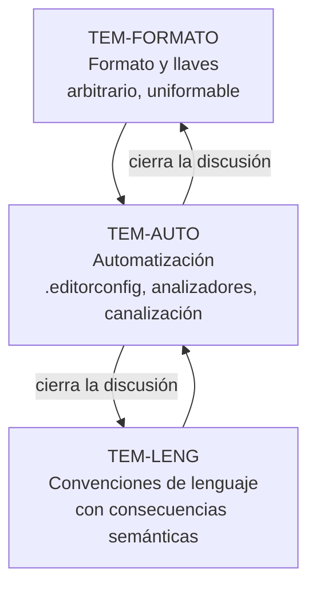

# Estilo de codificación — `FAM-EST`

## Resumen ejecutivo

Ninguna otra clase de convención consume tanta discusión y aporta tan poco valor por unidad de discusión. Dónde va la llave de apertura, si se indenta con espacios o tabulaciones, si los `using` van ordenados: son preguntas cuya respuesta correcta es «la que ya usa el repositorio», y sin embargo son las que más tiempo de revisión consumen en la mayoría de los equipos. Esa desproporción es el hecho que organiza toda esta familia.

La conclusión práctica se sigue sola. Si el valor está en la uniformidad y no en la elección concreta, entonces la elección conviene delegarla —a lo que ya hay, a lo que dice `N-06`, a lo que la herramienta trae por defecto— y la uniformidad conviene automatizarla. Un equipo que discute estilo en cada *pull request* está pagando en atención humana algo que un archivo de configuración resuelve una vez. De ahí que el documento más importante de la familia no sea el que describe los estilos sino el que explica cómo dejar de hablar de ellos: [`TEM-AUTO`](Automatizacion-del-Estilo.md).

Le sirve principalmente a `ACT-03`, que es quien fija el conjunto de convenciones y quien responde por el `.editorconfig` del repositorio, y a `ACT-05`, que decide con qué severidad y en qué momento se verifican. `ACT-02` la consulta al incorporarse a un repositorio ajeno; `ACT-04` la necesita para saber qué no le corresponde señalar a mano, porque una observación de estilo que una herramienta podría haber hecho es tiempo de revisión mal gastado.

---

## Qué separa esta familia de `FAM-NOM`

La nomenclatura decide **qué palabras** se usan; el estilo decide **cómo se dispone el texto**. `ObtenerReservaAsync` frente a `GetReservationAsync` es nomenclatura. Que la llave de apertura del método vaya en línea propia y que el cuerpo se indente con cuatro espacios es estilo.

La distinción no es académica: tienen costos de cambio distintos y por eso admiten políticas distintas. Renombrar un miembro público de una biblioteca rompe a los consumidores (`CTX-3`) y es una decisión que se toma una vez y se arrastra; reformatear un archivo entero es una operación mecánica, verificable y sin efecto sobre el binario. Un equipo puede normalizar el formato de doscientos archivos en una tarde con `dotnet format` y no puede normalizar los nombres de la misma forma, porque el renombre requiere criterio y los nombres viven en contratos.

Hay una zona intermedia que esta familia trata y que conviene anticipar. Algunas decisiones que se discuten como si fueran estilo tienen consecuencias semánticas reales: activar tipos de referencia anulables cambia qué compila, elegir `record` en lugar de `class` cambia la igualdad, `async void` cambia cómo se propagan las excepciones. Esas viven en [`TEM-LENG`](Convenciones-de-Lenguaje.md) y no admiten el argumento de «da lo mismo mientras sea uniforme».

---

## Documentos de la familia

| ID | Documento | Qué resuelve |
|----|-----------|--------------|
| [`TEM-FORMATO`](Formato-y-Llaves.md) | Formato y llaves | Los estilos de llaves con nombre propio —Allman, K&R, 1TBS, GNU, Whitesmiths—, por qué C# usa Allman, indentación, longitud de línea, orden de `using` y de miembros, `#region` y comentarios |
| [`TEM-LENG`](Convenciones-de-Lenguaje.md) | Convenciones de lenguaje | Las elecciones que sí cambian el significado: `var`, cuerpos de expresión, anulables, `record`/`class`/`struct`, coincidencia de patrones, `async`/`await`, sentencias de nivel superior |
| [`TEM-AUTO`](Automatizacion-del-Estilo.md) | Automatización del estilo | `.editorconfig`, familias de reglas `IDExxxx` y `CAxxxx`, severidades, `dotnet format`, analizadores, la compuerta de la canalización de integración continua y la estrategia de normalización de `ESC-3` |

---

## Cómo se relacionan

El orden de lectura no coincide con el orden de importancia. `TEM-FORMATO` va primero porque es lo que el lector espera encontrar y porque nombra el vocabulario —Allman, K&R— que después se usa sin explicar; pero su contenido es en su mayor parte arbitrario, y el propio documento lo declara. `TEM-LENG` es donde el tema empieza a tener consecuencias. `TEM-AUTO` es donde deja de ser opinión: una vez que las reglas están declaradas en un archivo y verificadas por el compilador, el debate se termina porque ya no hay nada que negociar en la revisión.

El ciclo del diagrama es el punto. Las dos primeras cajas alimentan la tercera con reglas candidatas, y la tercera devuelve el favor convirtiéndolas en verificaciones que nadie tiene que recordar. Una regla de estilo que no llega a `TEM-AUTO` es una regla que va a erosionarse: `ESC-3` explica por qué normalizar sin activar la regla en el análisis estático garantiza repetir el trabajo.

---

## Relación con el resto de la guía

[`FAM-NOM`](../40-Nomenclatura/README.md) es la familia hermana y la frontera está descrita arriba. Comparten mecanismo de aplicación —buena parte de las reglas de nombrado también se declaran en `.editorconfig`, mediante `dotnet_naming_rule`— y por eso `TEM-AUTO` sirve a las dos.

[`TEM-BUILD`](../20-Organizacion-de-Soluciones/Build-Compartido.md) trata los archivos de repositorio que gobiernan varios proyectos. `.editorconfig` es uno de ellos por su ubicación y su herencia por directorio, pero lo que declara son reglas de código y por eso se desarrolla acá. Las propiedades de MSBuild que activan los analizadores —`EnableNETAnalyzers`, `AnalysisMode`, `EnforceCodeStyleInBuild`— viven en `Directory.Build.props` y se explican en `TEM-AUTO` desde el ángulo de qué hacen, no de dónde se declaran.

[`TEM-NS`](../30-Organizacion-Interna/Espacios-de-Nombres.md) se ocupa de los espacios de nombres, incluida la forma de declararlos con ámbito de archivo. `TEM-LENG` lo menciona al pasar y remite ahí.

---

## Lo que esta familia no va a decir

No va a decir que Allman sea mejor que K&R. No lo es: es lo que C# eligió, y lo que un desarrollador de Java escribe con la misma convicción es exactamente lo contrario. Esta guía sostiene una posición más modesta y más útil —la uniformidad dentro de un repositorio vale mucho más que cualquiera de las dos elecciones— y trata de mantener el tono acorde. Un documento que suena dogmático sobre una convención arbitraria le enseña al lector a discutir en lugar de a automatizar.

Donde sí hay una posición fuerte es en `ESC-4`. Evaluar código ajeno por su estilo de llaves es un error de evaluador: lo que se juzga sin contexto es la consistencia interna y si las convenciones están automatizadas o dependen de memoria humana. Un repositorio con un estilo que a uno no le gusta, aplicado de forma uniforme y verificado en compilación, está mejor que uno con el estilo preferido de uno aplicado a la mitad de los archivos.
