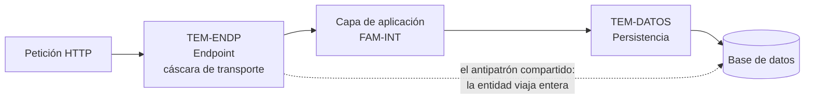

# Patrones de código — `FAM-PAT`

## Resumen ejecutivo

Hay patrones que un equipo elige y que después no se ven en ninguna parte, y hay patrones que determinan cómo se llaman las carpetas, cuántos archivos hay y dónde busca alguien la línea que atiende una petición. Esta familia trata los segundos. Un `Strategy` bien aplicado no cambia la forma del repositorio; elegir controllers en lugar de route handlers, o repositorios explícitos en lugar de `DbContext` directo, sí la cambia, y de forma difícil de revertir.

El alcance está deliberadamente acotado a dos decisiones: cómo se expone la superficie HTTP y cómo se organiza la persistencia. Son las dos que aparecen en toda aplicación .NET de línea de negocio, las dos que más discusión generan y las dos cuyo resultado se puede ver desde el árbol de archivos.

Le sirve a `ACT-01` cuando fija el esqueleto de un servicio nuevo, a `ACT-02` cuando decide dónde poner el endpoint número quince o la consulta número cuarenta, y a `ACT-04` cuando tiene que distinguir una estructura que resuelve algo de una que solo agrega niveles.

---

## Lo que esta familia no es

**No es un catálogo de patrones de diseño.** No hay entradas para Strategy, Factory, Decorator, Observer ni el resto del vocabulario clásico. Esos patrones son valiosos, están documentados en obras que los tratan mucho mejor de lo que podría hacerlo un capítulo de esta guía, y sobre todo son ortogonales a su objeto: cómo se organiza el código .NET. Un sistema puede usar Decorator intensivamente sin que eso altere una sola carpeta.

Para el catálogo general de patrones de aplicación empresarial, la referencia es `O-02` —*Patterns of Enterprise Application Architecture*, de Martin Fowler—, registrada en [`ANEXO-REFERENCIAS`](../99-Anexos/Referencias.md). De ahí salen los dos patrones que sí aparecen acá con su definición original: **Front Controller**, del que descienden los controllers de ASP.NET Core, y **Repository** junto con **Unit of Work**, cuyo estado actual frente a EF Core es el tema central de `TEM-DATOS`.

**No es normativa de Microsoft.** Ninguno de los dos documentos prescribe una elección. Microsoft documenta Minimal APIs y controllers como opciones vigentes, y no publica especificación alguna sobre si conviene envolver EF Core en repositorios. Donde esta familia toma posición, lo hace con la fórmula «esta guía recomienda», y donde el desacuerdo es genuino —el caso del repositorio— presenta ambos lados y ofrece un criterio de decisión en lugar de un veredicto.

---

## Documentos de la familia

| ID | Documento | Qué resuelve |
|----|-----------|--------------|
| [`TEM-ENDP`](Patrones-de-Endpoint.md) | Patrones de endpoint | Route handlers frente a controllers: qué cambia realmente entre ambos, el paso intermedio de `MapGroup` que suele saltearse, y el paralelo con otros ecosistemas |
| [`TEM-DATOS`](Patrones-de-Acceso-a-Datos.md) | Patrones de acceso a datos | Repository, Unit of Work y CQRS frente a lo que EF Core ya provee; por qué el repositorio genérico falla; qué tipo cruza cada límite; dónde viven y cuándo se aplican las migraciones |

Los dos se leen sueltos y no hay orden obligatorio. Se tocan en un punto concreto, y vale la pena anticiparlo: el endpoint es donde se decide qué tipo sale hacia el cliente, y devolver ahí una entidad de EF Core es el antipatrón que ambos documentos señalan desde su lado.

---

## Cómo se relaciona con el resto de la guía

**Con la organización interna.** Es la relación más fuerte y también la más malinterpretada. La elección de patrón de endpoint y la de acceso a datos no son decisiones de arquitectura: no dicen nada sobre las capas ni sobre la dirección de las dependencias, que se deciden en [`TEM-CAPAS`](../30-Organizacion-Interna/Modelos-de-Capas.md). La relación corre en sentido inverso al que se supone. Un diseño de puertos y adaptadores ya decidió que habrá repositorios explícitos, porque el repositorio *es* el puerto; un proyecto de dominio separado que no puede referenciar EF Core ya decidió lo mismo, y esta vez con el compilador como garante, según el mecanismo que discute [`TEM-CVP`](../30-Organizacion-Interna/Carpetas-o-Proyectos.md). Quien llega a esta familia buscando qué patrón adoptar suele tener la decisión ya tomada río arriba.

Con [`TEM-SLICE`](../30-Organizacion-Interna/Vertical-Slice.md) la afinidad es doble. Los métodos de extensión que agrupan endpoints permiten cortar por funcionalidad en lugar de por recurso, cosa que el molde del controller dificulta; y CQRS, en su forma simple, establece que leer y escribir son cortes distintos de la misma funcionalidad.

**Con el marco.** El escenario cambia el uso de la familia por completo. En `ESC-1` ambas decisiones están abiertas y son baratas, y el riesgo dominante es el mismo que atraviesa la guía entera: adoptar por anticipado una estructura cuyo costo es permanente y cuyo beneficio es hipotético. En `ESC-2` la familia se consulta por un síntoma —un archivo que creció, consultas que se multiplicaron— y el trabajo consiste en no confundir el síntoma con su causa. En `ESC-3` casi todo lo de esta familia queda fuera del alcance de una normalización: convertir controllers a route handlers o introducir una capa de repositorios son cambios de diseño con riesgo funcional, no ajustes de estilo. En `ESC-4` lo que se evalúa no es la elección sino la consistencia y lo que la estructura elegida está comprando.

El contexto pesa distinto en cada documento. `TEM-ENDP` es central en `CTX-2`, donde la superficie HTTP es el producto entero, y marginal en `CTX-1`, donde suele reducirse a unos pocos endpoints que la interfaz necesita. `TEM-DATOS` es transversal a `CTX-1`, `CTX-2` y `CTX-4`, y casi no aplica en `CTX-3` salvo que la biblioteca sea precisamente el componente de acceso a datos, caso en el que su superficie pública pasa a ser contrato con todo lo que eso implica.

**Con las referencias.** `O-02` es la fuente de los patrones clásicos que aparecen acá. La sección 4 de [`ANEXO-REFERENCIAS`](../99-Anexos/Referencias.md) es pertinente por lo que no contiene: CQRS y Specification no tienen entrada normativa en esa tabla, y esta familia los trata con esa reserva, sin presentarlos como práctica oficial de .NET.

---

## Ejemplo de referencia de la familia

El sistema de reserva de salas —el ejemplo sintético que recorre la guía— aparece en los dos documentos con las decisiones tomadas en direcciones aparentemente opuestas. Los endpoints de autenticación son Minimal APIs sin ceremonia, escritos en línea en `Program.cs`; la persistencia, en cambio, pasa por repositorios explícitos declarados como interfaces en `Aplicacion/Puertos/`, con implementaciones en la capa de infraestructura.

La combinación no es incoherencia, y esa es la lección. Los endpoints existen para resolver una limitación técnica puntual —un componente Blazor interactivo no puede establecer una cookie, porque la respuesta HTTP ya se envió cuando el componente ejecuta— y su superficie es de cuatro rutas que no van a crecer; la persistencia, en cambio, es el eje del sistema, tiene varios agregados y un diseño de puertos que se sostiene sobre ella. Cada decisión responde al peso de lo que organiza, no a una regla uniforme aplicada a todo el proyecto.
