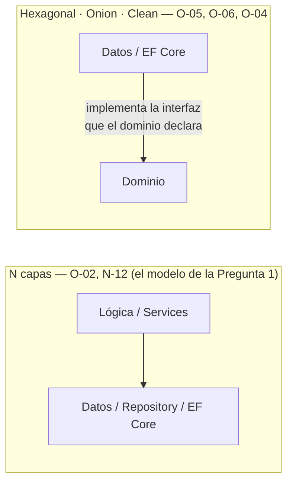
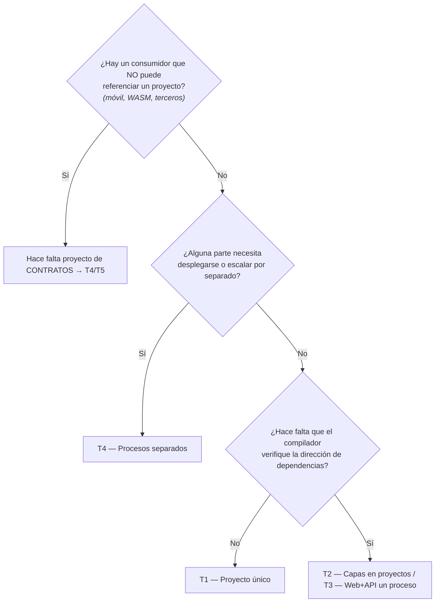

# Análisis integral — del modelo por tipo técnico a las capas actuales

## Resumen ejecutivo

Este documento responde cuatro preguntas encadenadas sobre un patrón de organización muy difundido —`Models`, `Repositories`, `Services`, `Controllers`, `DTOs`, `ViewModels`, `Views`— y su lugar en el modelo de capas actual. La tesis que las atraviesa es una sola: **ese modelo no desapareció ni fue reemplazado por otro; fue re-encuadrado.** Lo que cambió no son las piezas —siguen existiendo servicios, repositorios y objetos de transporte— sino dos cosas que la disposición antigua dejaba implícitas y que la actual obliga a decidir: **la dirección de las dependencias** y **el eje por el que se agrupa el código.**

El análisis se apoya íntegramente, y en primer lugar, en la cadena documental de [`GUIA-INDICE`](../README.md). Cada afirmación normativa se cita por el identificador de [`ANEXO-REFERENCIAS`](../99-Anexos/Referencias.md) —`N-xx` normativo de Microsoft, `F-xx` convención de facto, `O-xx` obra de referencia—, y lo que es criterio propio de la guía se marca con la fórmula «esta guía recomienda». La distinción importa porque el error más caro del ecosistema .NET es presentar como estándar de Microsoft lo que es opinión bien fundada: **ninguno de los modelos de capas que se tratan acá es un estándar de Microsoft** ([`TEM-CAPAS`](../30-Organizacion-Interna/Modelos-de-Capas.md), sobre `N-12`).

Los ejemplos de código conservan el dominio de **turnos** que plantea la consulta original, declarados como sintéticos. La guía madre usa el dominio de reserva de salas como hilo conductor; acá se traduce a turnos para responder sobre el mismo ejemplo por el que se pregunta.

> **Nota de idioma de los ejemplos.** Se usa la combinación que [`TEM-MODELOS`](../30-Organizacion-Interna/Modelos-y-Contratos.md) admite como la más frecuente: **plano estructural en inglés** (`Domain`, `Application`, `Infrastructure`, `Contracts`) y **plano de dominio en español** (`Turno`, `Profesional`, `FranjaHoraria`). La variante íntegra en español es igualmente coherente y se muestra donde aporta.

---

## Pregunta 1 — ¿Qué ocurrió con DAO, MVC, Repository, DTO y Entity? ¿Dónde quedó esa organización?

### El diagnóstico: era organización por tipo técnico

La estructura de la consulta —una carpeta `Models`, otra `Repositories` (o DAOs), otra `Services`, otra `Controllers`, otra `DTOs`, otra `ViewModels`, otra `Views`— es un caso de **agrupación horizontal: por rol técnico**. Todos los servicios juntos, todos los repositorios juntos, todos los modelos juntos. [`TEM-SLICE`](../30-Organizacion-Interna/Vertical-Slice.md) la describe con precisión y nombra su costo cotidiano: agregar un campo al formulario de turno obliga a tocar el componente, el servicio, la interfaz del repositorio, su implementación, el modelo de datos y la validación —seis archivos en cinco carpetas que no están cerca entre sí—, porque *la unidad de cambio de un sistema es casi siempre la funcionalidad y casi nunca la capa*.

Ese modelo **no desapareció**. Sigue siendo el punto de partida implícito de la mayoría de los equipos, y coincide casi exactamente con el modelo **N capas / Layered** que Fowler describe en `O-02` y que Microsoft presenta en `N-12` ([`TEM-CAPAS`](../30-Organizacion-Interna/Modelos-de-Capas.md)). Lo que cambió es que hoy sabemos ponerle nombre a su defecto estructural y separar las decisiones que antes viajaban juntas.

### El defecto que define todo lo que vino después

En el árbol de la consulta, `TurnoServices.cs` usa `TurnoRepository`, y `TurnoRepository` define y devuelve `TurnoModel`. La dependencia va **hacia abajo**: la lógica de negocio conoce el acceso a datos. [`TEM-CAPAS`](../30-Organizacion-Interna/Modelos-de-Capas.md) lo enuncia sin rodeos:

> «El grupo de código con la vida útil más larga del sistema referencia al grupo con la vida útil más corta, que es exactamente lo contrario de lo que conviene.»

Una regla de negocio —«un profesional no admite dos turnos superpuestos»— vive años; el proveedor de base de datos, la versión del ORM y el formato HTTP viven mucho menos. Cuando la regla está escrita dentro de un método que recibe un `DbContext` (o, en la época de JDBC/ADO.NET, una conexión y SQL a mano), cambiar lo de vida corta obliga a tocar lo de vida larga. Fowler ya identificaba la tensión en 2002; Hexagonal (`O-05`), Onion (`O-06`) y Clean (`O-04`) son intentos sucesivos de resolverla (se desarrolla en la Pregunta 2).

### `TurnoModel` no es un tipo: son hasta cuatro colapsados

El punto central de la consulta —«tengo `TurnoModel` como objeto plano de persistencia o Entity, y también es objeto de intercambio entre repository y services»— tiene nombre en la guía. Según [`TEM-MODELOS`](../30-Organizacion-Interna/Modelos-y-Contratos.md), **el mismo concepto de negocio aparece hasta cuatro veces** en un sistema con capas, y usar un solo tipo para todas es colapsarlas:

| Representación | Qué es | Quién la cambia | Dónde vive |
|---|---|---|---|
| **Entidad de dominio** | El concepto con sus invariantes y su comportamiento | Una regla de negocio | `Domain/` |
| **Modelo de persistencia** | La forma que toma en la base | Un cambio de esquema | `Infrastructure/Persistence/` — o es la misma clase |
| **Contrato / DTO** | Lo que cruza el borde HTTP | Una versión de la API | El proyecto de contratos, o el borde de la API |
| **Modelo de presentación** | Lo que la interfaz liga a sus controles | Un cambio de pantalla | Junto al componente que lo usa |

`TurnoModel` de la consulta es **la entidad de dominio y el modelo de persistencia colapsados en una clase** (algo que con EF Core es legítimo y corriente), pero que además viajaba como objeto de intercambio hasta el borde. La regla que ordena el reparto:

> «Cada representación pertenece a la capa que la consume, no a la que la produce.»

Colapsar representaciones **no es un error** —a menudo es correcto—; el error es colapsarlas sin advertirlo y descubrir el acoplamiento cuando aparece el segundo consumidor. Cuántas hacen falta lo determina la topología, no el gusto (Pregunta 3).

### Dónde quedó cada carpeta del modelo antiguo

Ésta es la respuesta directa a «¿dónde quedó esta organización?». Cada carpeta de la consulta tiene un destino en el modelo actual:

| Carpeta del modelo de la consulta | Dónde queda hoy | Fuente |
|---|---|---|
| `Models/TurnoModel.cs` (Entity/persistencia) | Se **desdobla**: entidad en `Domain/`, y si el esquema diverge, modelo de persistencia en `Infrastructure/Persistence/`. Con EF Core suelen ser la misma clase mapeada por configuración | [`TEM-MODELOS`](../30-Organizacion-Interna/Modelos-y-Contratos.md) |
| `Repositories/` (o DAOs) | Sigue existiendo, pero como **puerto declarado por el núcleo** (`Application/Ports/`) e implementado en `Infrastructure/`. Su necesidad se discute: `DbSet<T>` ya es un repositorio y `DbContext` ya es un Unit of Work (`O-02`) | [`TEM-DATOS`](../60-Patrones-de-Codigo/Patrones-de-Acceso-a-Datos.md) |
| `Services/TurnoServices.cs` | Queda en `Application/` como **servicio de aplicación / caso de uso**, ahora dependiendo de abstracciones y no de la clase concreta de datos | [`TEM-CAPAS`](../30-Organizacion-Interna/Modelos-de-Capas.md) |
| `Controllers/` | Es una **superficie de entrada** (adaptador): controllers o Minimal APIs, en el borde | [`TEM-TOPO`](../20-Organizacion-de-Soluciones/Topologias-de-Solucion.md) |
| `DTOs/` | Como **carpeta técnica** es un antipatrón de segmento; como **proyecto** `Contracts` es correcto, organizado por concepto adentro | [`TEM-MODELOS`](../30-Organizacion-Interna/Modelos-y-Contratos.md) |
| `ViewModels/` (o PageModels en MAUI) | Es el **modelo de presentación** (`Vm`), que vive junto al componente que lo liga | [`TEM-MODELOS`](../30-Organizacion-Interna/Modelos-y-Contratos.md) |
| `Views/` (o Pages) | La superficie de presentación, junto a su `Vm` | [`TEM-MODELOS`](../30-Organizacion-Interna/Modelos-y-Contratos.md) |

### La nomenclatura en relación con ese modelo

Aquí es donde el modelo antiguo más se aparta de la convención actual, y la razón es concreta ([`TEM-MODELOS`](../30-Organizacion-Interna/Modelos-y-Contratos.md)):

**1. `Models` y `DTOs` no son buenos segmentos de espacio de nombres.** `N-01` pide pluralizar un segmento cuando agrupa *elementos semánticamente equivalentes*. `Turnos` agrupa turnos; `DTOs` agrupa cosas que solo comparten un rasgo técnico —el DTO de turnos y el de facturación no tienen nada que ver— y a escala produce un namespace único con doscientos tipos de veinte funcionalidades. Es el mismo defecto que la clase `Utils` de [`TEM-ANTI`](../40-Nomenclatura/Antipatrones-de-Nombrado.md), a escala de namespace: agrupa por lo que las cosas **son** en vez de por lo que **tratan**. La forma que escala es **concepto primero, tipo después si hace falta**:

```text
MiEmpresa.Turnos.Contracts.Turnos       ← los contratos DE turnos
MiEmpresa.Turnos.Contracts.Profesionales

MiEmpresa.Turnos.Contracts.DTOs         ← antipatrón: todos los DTOs de todo
```

**2. El sufijo `Model` dice poco.** `TurnoModel` no comunica en qué plano vive: todo es un modelo de algo. Los sufijos que sí informan dicen **para qué cruza el tipo una frontera**:

| Sufijo | Qué comunica | Ejemplo |
|---|---|---|
| `Request` | Entra por el borde HTTP | `CrearTurnoRequest` |
| `Response` | Sale por el borde HTTP | `TurnoResponse` |
| `Dto` | Cruza una frontera, sin comportamiento y sin dirección declarada | `TurnoDto` |
| `Vm` / `ViewModel` | Lo liga la interfaz | `TurnoFilaVm` |
| *(sin sufijo)* | Es del dominio | `Turno` |

La entidad de dominio **no lleva sufijo**: es el concepto, y todo lo demás se nombra por referencia a él. Es decir, `TurnoModel` del ejemplo debería, según su plano, llamarse `Turno` (dominio), `TurnoResponse`/`CrearTurnoRequest` (contrato) o `TurnoFilaVm` (presentación).

---

## Pregunta 2 — ¿Cómo aplican los modelos estructurales nuevos y cuál es su equivalencia con el anterior?

### Qué es realmente un «modelo de capas»

[`TEM-CAPAS`](../30-Organizacion-Interna/Modelos-de-Capas.md) reduce el tema a su núcleo:

> «Un modelo de capas es una regla sobre la **dirección permitida de las dependencias** entre grupos de código. Nada más que eso.»

Cuatro modelos se disputan el terreno, y tres de ellos dan **la misma respuesta con vocabularios distintos**:

- **N capas / Layered** — `O-02` (Fowler), descrito en `N-12`. Presentación → Lógica → Datos, dependencia estrictamente **descendente**. Es el modelo de la consulta.
- **Hexagonal / Ports & Adapters** — `O-05` (Cockburn, 2005). Un centro que declara **puertos** (interfaces en el vocabulario del dominio) y un borde con **adaptadores** que los implementan.
- **Onion** — `O-06` (Palermo, 2008). Anillos concéntricos; las dependencias apuntan **hacia adentro**.
- **Clean Architecture** — `O-04` (Martin, 2017). Síntesis de las anteriores con la *regla de dependencia*: el código fuente depende solo hacia adentro. El propio Martin la presenta como integración de Hexagonal y Onion.

### La única diferencia que importa es binaria

Hexagonal, Onion y Clean son indistinguibles por su grafo de dependencias —que es *la única propiedad verificable de un modelo de capas*—. La decisión real no es «¿Onion o Clean?» (eso es discutir nombres de carpetas), sino:



### La equivalencia con el modelo de la Pregunta 1

**El modelo de la consulta es N capas con la dependencia hacia abajo.** `TurnoServices` → `TurnoRepository` → `TurnoModel`. El modelo nuevo **invierte esa flecha**: el núcleo declara `ITurnosRepository` (con tipos del dominio en su firma) y la implementación con EF Core vive afuera y depende del dominio. En árbol de carpetas, la equivalencia es directa:

**N capas clásico (equivalente al de la consulta), dependencia hacia abajo:**

```text
src/MiEmpresa.Turnos/
├── Presentacion/
│   └── TurnosController.cs
├── Logica/
│   └── TurnoServices.cs         // usa TurnoRepository directamente
└── Datos/
    ├── TurnosDbContext.cs
    └── TurnoRepository.cs        // acá se declara Y se implementa la interfaz
```

**El mismo sistema con la dependencia invertida (Hexagonal/Onion/Clean).** El cambio que importa no se mide en archivos movidos sino en **quién declara la interfaz**: los puertos salieron de `Datos/` y ahora los declara el núcleo:

```text
src/MiEmpresa.Turnos/
├── Domain/
│   └── Turnos/
│       ├── Turno.cs
│       ├── FranjaHoraria.cs
│       └── PoliticaCancelacion.cs
├── Application/
│   ├── Ports/                       // el núcleo declara lo que necesita
│   │   ├── ITurnosRepository.cs
│   │   └── INotificadorTurnos.cs
│   └── Turnos/
│       └── TurnosService.cs
├── Infrastructure/
│   ├── Persistence/
│   │   ├── TurnosDbContext.cs
│   │   └── TurnosRepositoryEfCore.cs
│   └── Notificaciones/
│       └── NotificadorTurnosSmtp.cs
└── Components/
    └── Pages/Turnos.razor
```

Ese mismo árbol admite una **lectura hexagonal sin mover un archivo**: los tipos de `Application/Ports/` son los puertos de salida y las clases de `Infrastructure/` son sus adaptadores. La propiedad que define el modelo es *negativa* y se verifica leyendo: ni `Domain/` ni `Application/` contienen una sola referencia a `Microsoft.EntityFrameworkCore`.

### El mecanismo de la inversión, en código (dominio de turnos, sintético)

El puerto se declara en el núcleo, con tipos del dominio en su firma y sin ninguna referencia a la tecnología de persistencia:

```csharp
// Application/Ports/ITurnosRepository.cs
using MiEmpresa.Turnos.Domain.Turnos;

namespace MiEmpresa.Turnos.Application.Ports;

public interface ITurnosRepository
{
    Task<IReadOnlyList<Turno>> ObtenerSuperpuestosAsync(
        Guid profesionalId, FranjaHoraria franja, CancellationToken ct);

    Task AgregarAsync(Turno turno, CancellationToken ct);

    // La confirmación de la unidad de trabajo es del servicio de aplicación,
    // no del repositorio: acá termina el caso de uso y acá se decide persistir.
    Task ConfirmarCambiosAsync(CancellationToken ct);
}
```

La implementación es la única que conoce EF Core, y su flecha de compilación apunta **hacia el dominio**:

```csharp
// Infrastructure/Persistence/TurnosRepositoryEfCore.cs
using Microsoft.EntityFrameworkCore;
using MiEmpresa.Turnos.Application.Ports;
using MiEmpresa.Turnos.Domain.Turnos;

namespace MiEmpresa.Turnos.Infrastructure.Persistence;

internal sealed class TurnosRepositoryEfCore(TurnosDbContext contexto) : ITurnosRepository
{
    public async Task<IReadOnlyList<Turno>> ObtenerSuperpuestosAsync(
        Guid profesionalId, FranjaHoraria franja, CancellationToken ct) =>
        await contexto.Turnos
            .Where(t => t.ProfesionalId == profesionalId
                     && t.Franja.Inicio < franja.Fin
                     && franja.Inicio < t.Franja.Fin)
            .ToListAsync(ct);

    public Task AgregarAsync(Turno turno, CancellationToken ct)
    {
        contexto.Turnos.Add(turno);
        return Task.CompletedTask;   // no confirma: eso lo decide el caso de uso
    }

    public Task ConfirmarCambiosAsync(CancellationToken ct) =>
        contexto.SaveChangesAsync(ct);
}
```

Si la interfaz estuviera declarada en infraestructura —el error más común—, el núcleo referenciaría a infraestructura y la inversión se perdería, *aunque el diagrama del README siguiera dibujando las flechas al revés*. Es el antipatrón que [`TEM-CAPAS`](../30-Organizacion-Interna/Modelos-de-Capas.md) llama «interfaz declarada del lado equivocado».

### Un tercer eje: por capa técnica o por funcionalidad

El modelo de la consulta agrupa por capa técnica. La alternativa que propone `O-07` (Bogard) es **Vertical Slice**: agrupar por funcionalidad, de modo que todo lo que «crear turno» necesita viva junto ([`TEM-SLICE`](../30-Organizacion-Interna/Vertical-Slice.md)). No es lo contrario de las capas —se combinan—:

```text
src/MiEmpresa.Turnos/
├── Domain/                          // compartido: entidades y reglas invariantes
│   ├── Turno.cs
│   └── FranjaHoraria.cs
├── Features/
│   ├── CrearTurno/                  // corte con capas adentro
│   │   ├── CrearTurnoEndpoint.cs
│   │   ├── CrearTurnoHandler.cs
│   │   ├── CrearTurnoValidator.cs
│   │   └── ConsultaDeSuperposicion.cs
│   └── ConsultarAgenda/             // corte plano: no hay reglas que aislar
│       └── ConsultarAgenda.cs
└── Infrastructure/
    └── TurnosDbContext.cs
```

### Cuándo cada modelo se justifica

[`TEM-CAPAS`](../30-Organizacion-Interna/Modelos-de-Capas.md) da la tabla de decisión, que evita adoptar por moda:

| Situación | Modelo que rinde | Motivo |
|---|---|---|
| App interna, un desarrollador, CRUD dominante | Ninguno; carpetas por funcionalidad | Las reglas son escasas; la inversión agrega interfaces sin colaborador alternativo |
| Línea de negocio con reglas moderadas | N capas con dominio sin dependencias hacia abajo | Se obtiene la propiedad principal sin la ceremonia de los puertos |
| Reglas densas y larga vida prevista | Hexagonal, Onion o Clean —da igual cuál— | El dominio justifica su aislamiento |
| Biblioteca reutilizable (`CTX-3`) | Inversión obligatoria | Toda dependencia de infraestructura se le impone al consumidor |

Y el reverso: es **sobreingeniería** cuando cada puerto tiene un solo adaptador y nunca tendrá otro, cuando el «dominio» son clases con propiedades y ningún comportamiento, o cuando el equipo pasa más tiempo decidiendo en qué anillo va una clase que escribiendo la regla —el síntoma más confiable—.

---

## Pregunta 3 — ¿Cómo especifico a un equipo la estructura y la nomenclatura de espacios de nombres?

Especificar una estructura a un equipo son **tres decisiones separadas** que la consulta mezcla, y conviene desacoplarlas porque se deciden con criterios distintos:

1. **La topología** (cuántos proyectos y qué referencia a qué) → [`TEM-TOPO`](../20-Organizacion-de-Soluciones/Topologias-de-Solucion.md).
2. **El modelo de capas** (dirección de las dependencias) → [`TEM-CAPAS`](../30-Organizacion-Interna/Modelos-de-Capas.md).
3. **La nomenclatura de espacios de nombres** → [`TEM-NS`](../30-Organizacion-Interna/Espacios-de-Nombres.md), sobre `N-01`.

### Paso 1 — Elegir topología con tres preguntas

[`TEM-TOPO`](../20-Organizacion-de-Soluciones/Topologias-de-Solucion.md) reduce la elección a tres preguntas y cinco disposiciones:



| | `T1` Único | `T2` Capas | `T3` Web+API 1 proc. | `T4` 2 procesos | `T5` + clientes |
|---|:---:|:---:|:---:|:---:|:---:|
| Proyectos | 1 | 4 | 5 | 6 | 7+ |
| Límite entre capas | disciplina | **compilador** | **compilador** | **compilador** | **compilador** |
| Proyecto de contratos | no | no | opcional | **sí** | **sí** |

La pregunta 1 es una **restricción**, no una preferencia: si existe un cliente que solo habla HTTP, el proyecto `Contracts` aparece sí o sí. Esta guía recomienda **la topología más simple que satisfaga las tres preguntas**: si la respuesta a las tres es «no», es `T1`, y adoptar otra cosa es pagar por una opción que no se va a ejercer.

### Paso 2 — Decidir carpetas o proyectos

[`TEM-CVP`](../30-Organizacion-Interna/Carpetas-o-Proyectos.md) aísla la única diferencia que importa: con **proyectos separados el compilador hace cumplir la dirección de la dependencia** (un `using Microsoft.EntityFrameworkCore` en `Domain/` da error `CS0246`); con **carpetas**, la regla depende de que alguien la recuerde en la revisión. No es una medida de madurez: los templates de `dotnet new` generan un solo proyecto. Entre ambos extremos hay mecanismos intermedios —`internal`, analizadores de Roslyn, pruebas de arquitectura—.

### Paso 3 — Fijar la nomenclatura de espacios de nombres

Es **la única parte de la organización interna que Microsoft especifica de forma normativa**. `N-01` fija el patrón ([`TEM-NS`](../30-Organizacion-Interna/Espacios-de-Nombres.md)):

```text
<Empresa>.<Producto|Tecnología>[.<Funcionalidad>][.<Subespacio>]
```

Con las reglas que más se incumplen: PascalCase (`N-02`); nombres de producto **estables** (no marcas de campaña que caducan); **pluralizar** cuando el segmento agrupa elementos equivalentes (`Turnos`, no `Turno`, para el segmento; el tipo es `Turno` en singular). En una aplicación interna, el segmento de empresa aporta poco y la práctica corriente lo omite —conviene declarar esa omisión en las convenciones del equipo—.

**Dos planos de vocabulario, uno por plano de idioma** ([`TEM-MODELOS`](../30-Organizacion-Interna/Modelos-y-Contratos.md)):

- **Plano estructural** (arquitectura): `Domain`, `Application`, `Infrastructure`, `Contracts`, `Ports`, y los sufijos de rol `Service`, `Repository`, `Handler`, `Controller`. Es vocabulario técnico que la literatura escribe en inglés.
- **Plano del dominio** (negocio): `Turno`, `Profesional`, `FranjaHoraria`. Es el lenguaje ubicuo de `O-03`; su valor está en coincidir con las palabras de quien define las reglas.

Esta guía recomienda **decidir cada plano por su propio criterio**, y admite la combinación más frecuente: **estructura en inglés, dominio en el idioma del negocio.** Lo que falla es mezclar *dentro* de un plano (`Domain` junto a `Aplicacion`, o `Turno` junto a `AppointmentPolicy`).

### Cómo especificarlo de forma que no se degrade

Especificar no es dibujar un diagrama: es dejarlo **verificable**. Esta guía recomienda entregar al equipo:

1. **Un ADR** con la topología elegida y su motivo, para que una evaluación futura distinga decisión de accidente ([`TEM-TOPO`](../20-Organizacion-de-Soluciones/Topologias-de-Solucion.md), criterios de calidad).
2. **El grafo de `ProjectReference` declarado**, que es el artefacto más informativo de una solución y se lee sin abrir código:
   ```bash
   grep -rn 'ProjectReference' --include=*.csproj .
   ```
3. **La convención de namespaces por escrito**: si se incluye o no el segmento de empresa, y qué idioma tiene cada plano.
4. **Reglas automáticas en `.editorconfig`** (coincidencia namespace–carpeta, namespace con ámbito de archivo) y `Directory.Build.props` para centralizar `TargetFramework`, `Nullable`, etc.

### Ejemplos según lo que el equipo quiera respetar

**A. Si el equipo quiere respetar el modelo antiguo de la Pregunta 1** (N capas por tipo técnico, un solo proyecto — `T1`). Es legítimo; esta guía no lo desaconseja mientras la dependencia y la nomenclatura sean coherentes:

```text
src/MiEmpresa.Turnos.Web/            RootNamespace = MiEmpresa.Turnos.Web
├── Models/         → MiEmpresa.Turnos.Web.Models
├── Repositories/   → MiEmpresa.Turnos.Web.Repositories
├── Services/       → MiEmpresa.Turnos.Web.Services
├── Controllers/    → MiEmpresa.Turnos.Web.Controllers
└── ViewModels/     → MiEmpresa.Turnos.Web.ViewModels
```

Advertencia que conviene comunicar: los segmentos `Models`, `Repositories`, `DTOs` agrupan por tipo técnico y degradan al crecer ([`TEM-MODELOS`](../30-Organizacion-Interna/Modelos-y-Contratos.md)); en `T1` no hay compilador que verifique que la lógica no toque la base ([`TEM-CVP`](../30-Organizacion-Interna/Carpetas-o-Proyectos.md)).

**B. Si el equipo quiere algo más nuevo** (capas invertidas en proyectos — `T2`), la especificación es el grafo de referencias:

```text
src/
├── MiEmpresa.Turnos.Domain/          Sdk        (sin referencias)
├── MiEmpresa.Turnos.Application/     Sdk        → Domain
├── MiEmpresa.Turnos.Infrastructure/  Sdk        → Application
└── MiEmpresa.Turnos.Web/             Sdk.Web    → Infrastructure, Application
```

**C. Si hay un cliente que no puede referenciar proyectos** (móvil/WASM — `T5`), aparece `Contracts` y la regla que sostiene la topología: **`Contracts` NO referencia `Domain`**. Las siete raíces de namespace son independientes y comparten prefijo por convención, no por jerarquía del lenguaje ([`TEM-NS`](../30-Organizacion-Interna/Espacios-de-Nombres.md)):

```text
MiEmpresa.Turnos.Domain          MiEmpresa.Turnos.Domain.Turnos
MiEmpresa.Turnos.Application      MiEmpresa.Turnos.Application.Ports
MiEmpresa.Turnos.Infrastructure   MiEmpresa.Turnos.Infrastructure.Persistence
MiEmpresa.Turnos.Contracts        MiEmpresa.Turnos.Contracts.Turnos     ← hermano de Domain, sin referencia
MiEmpresa.Turnos.Api              MiEmpresa.Turnos.Api.Turnos
MiEmpresa.Turnos.Web              MiEmpresa.Turnos.Web.Components.Turnos
MiEmpresa.Turnos.Movil            MiEmpresa.Turnos.Movil.Vistas
```

---

## Pregunta 4 — Domain, Infrastructure, Contracts, records y POCOs

### Cómo identificar el Domain con claridad

[`TEM-CAPAS`](../30-Organizacion-Interna/Modelos-de-Capas.md) y [`TEM-MODELOS`](../30-Organizacion-Interna/Modelos-y-Contratos.md) permiten dar una definición operativa, no decorativa. El **dominio** es:

- **El concepto con sus invariantes y su comportamiento** —no un saco de propiedades—. Lleva la regla de negocio y la protege.
- **El grupo de código con la vida útil más larga** del sistema.
- **Lo que no depende de nada de infraestructura**: sin atributos de serialización, sin referencias a EF Core, sin sufijo en el nombre.

La prueba de identificación es **negativa y verificable en un minuto**: si puedo ejecutar las pruebas de una regla de negocio **sin levantar base de datos ni servidor**, esa regla está en el dominio; si no puedo, el dominio declarado no está vigente. Un `using Microsoft.EntityFrameworkCore` dentro de `Domain/` es una violación objetiva.

Tomando el `TurnoModel` de la Pregunta 1 y convirtiéndolo en **entidad de dominio de verdad** (sintético):

```csharp
namespace MiEmpresa.Turnos.Domain.Turnos;

public sealed class Turno
{
    private Turno(Guid id, Guid profesionalId, FranjaHoraria franja, string paciente)
    {
        Id = id;
        ProfesionalId = profesionalId;
        Franja = franja;
        Paciente = paciente;
        Estado = EstadoTurno.Pendiente;
    }

    public Guid Id { get; }
    public Guid ProfesionalId { get; }
    public FranjaHoraria Franja { get; private set; }
    public string Paciente { get; }
    public EstadoTurno Estado { get; private set; }

    // El constructor es privado y la creación pasa por acá: no existe forma
    // de obtener un Turno que viole la invariante de la franja.
    public static Turno Solicitar(Guid profesionalId, FranjaHoraria franja, string paciente)
    {
        if (franja.Duracion > TimeSpan.FromHours(4))
        {
            throw new ArgumentException("Un turno no puede exceder cuatro horas.", nameof(franja));
        }

        return new Turno(Guid.NewGuid(), profesionalId, franja, paciente);
    }

    public void Cancelar(PoliticaCancelacion politica, DateTimeOffset ahora)
    {
        if (!politica.PermiteCancelar(this, ahora))
        {
            throw new InvalidOperationException("El turno ya no admite cancelación.");
        }

        Estado = EstadoTurno.Cancelado;
    }
}
```

La diferencia con `TurnoModel` es toda la definición: `TurnoModel` era un objeto plano que cualquiera podía construir en cualquier estado; `Turno` **no se puede construir en un estado inválido** y su comportamiento vive con sus datos.

### Infrastructure

Es el **borde** que conoce las tecnologías concretas: EF Core, SMTP, sistema de archivos. Contiene los **adaptadores** que implementan los puertos declarados por el núcleo (ver `TurnosRepositoryEfCore` en la Pregunta 2). Es *la única capa que conoce EF Core*, y su flecha de compilación apunta hacia el dominio. Aquí viven también el `DbContext`, las configuraciones de mapeo y las migraciones ([`TEM-DATOS`](../60-Patrones-de-Codigo/Patrones-de-Acceso-a-Datos.md)).

### Contracts — y qué relación tiene con `record` y con los POCO/POJO

**Contracts** es el plano de **lo que cruza el borde HTTP**: tipos planos, serializables, **sin comportamiento**, que viven en el proyecto que un cliente puede referenciar sin arrastrar el dominio ([`TEM-MODELOS`](../30-Organizacion-Interna/Modelos-y-Contratos.md), [`TEM-TOPO`](../20-Organizacion-de-Soluciones/Topologias-de-Solucion.md)). `Contracts` como **proyecto** es correcto porque su criterio no es semántico sino **de referencia**: es lo que el cliente referencia sin llevarse las entidades. Su regla de oro: **`Contracts` no referencia `Domain`.**

Sobre el término de la consulta: **«register» corresponde a `record` de C#** (no a un registro de servicios). Un `record` es la forma idiomática de declarar contratos y objetos de transporte en C# moderno, y **es un POCO**. Conviene precisar los términos, como conocimiento general del lenguaje (la guía no los fija como estándar normativo):

- **POCO** = *Plain Old CLR Object*: una clase o `record` sin dependencias de un framework —el equivalente .NET del **POJO** (*Plain Old Java Object*)—. Es exactamente lo que [`TEM-MODELOS`](../30-Organizacion-Interna/Modelos-y-Contratos.md) describe para un contrato: «tipos planos, serializables, sin comportamiento».
- Un `record` posicional expresa esa intención en una línea y, por ser inmutable y comparado por valor, encaja con un objeto de transporte que no tiene identidad ni ciclo de vida propio.

Los contratos del ejemplo de turnos, como `record`:

```csharp
namespace MiEmpresa.Turnos.Contracts.Turnos;

// Entra: lo que el cliente envía. No incluye Id ni Estado: los decide el servidor.
public sealed record CrearTurnoRequest(
    Guid ProfesionalId,
    DateTimeOffset Inicio,
    DateTimeOffset Fin,
    string Paciente);

// Sale: lo que el servidor publica. NO expone todo lo que tiene la entidad, y
// el estado viaja como string y no como el enum del dominio: agregar un valor al
// enum no debe romper a un cliente que no lo conoce.
public sealed record TurnoResponse(
    Guid Id,
    Guid ProfesionalId,
    string NombreProfesional,
    DateTimeOffset Inicio,
    DateTimeOffset Fin,
    string Estado);
```

Dos decisiones deliberadas: `TurnoResponse` incluye `NombreProfesional`, que la entidad `Turno` **no tiene** —el contrato se arma para el consumidor, no para espejar la entidad—; y `Estado` viaja como texto —exponer el enum del dominio ataría la evolución de un tipo interno al contrato publicado—.

El **objeto de valor** del dominio también es un `record`, porque se compara por contenido y no tiene identidad —que es exactamente lo que `record` expresa—:

```csharp
namespace MiEmpresa.Turnos.Domain.Turnos;

public readonly record struct FranjaHoraria(DateTimeOffset Inicio, DateTimeOffset Fin)
{
    public TimeSpan Duracion => Fin - Inicio;

    public bool SeSolapaCon(FranjaHoraria otra) => Inicio < otra.Fin && otra.Inicio < Fin;
}
```

### El mapeo entre representaciones

La entidad no conoce el contrato: el mapeo ocurre **en la capa que expone, en una sola dirección**, y es código explícito y aburrido a propósito. Es el único lugar donde los namespaces de dominio y de contratos conviven por diseño ([`TEM-NS`](../30-Organizacion-Interna/Espacios-de-Nombres.md)):

```csharp
// MiEmpresa.Turnos.Api/Turnos/MapeoTurnos.cs
using MiEmpresa.Turnos.Contracts.Turnos;
using MiEmpresa.Turnos.Domain.Turnos;

namespace MiEmpresa.Turnos.Api.Turnos;

internal static class MapeoTurnos
{
    public static TurnoResponse ADto(this Turno turno, string nombreProfesional) =>
        new(turno.Id,
            turno.ProfesionalId,
            nombreProfesional,
            turno.Franja.Inicio,
            turno.Franja.Fin,
            turno.Estado.ToString());
}
```

### La jerarquía completa, con las cuatro representaciones del turno

```text
src/
├── MiEmpresa.Turnos.Domain/
│   └── Turnos/
│       ├── Turno.cs                    ← entidad, sin sufijo, con comportamiento
│       ├── FranjaHoraria.cs            ← objeto de valor (record struct)
│       ├── EstadoTurno.cs              ← enumeración
│       └── PoliticaCancelacion.cs      ← regla de negocio
│
├── MiEmpresa.Turnos.Application/
│   ├── Turnos/  └── TurnosService.cs   ← caso de uso; sufijo de rol (plano estructural)
│   └── Ports/   └── ITurnosRepository.cs
│
├── MiEmpresa.Turnos.Infrastructure/
│   └── Persistence/
│       ├── TurnosDbContext.cs
│       └── Configurations/TurnoConfiguration.cs   ← mapeo EF Core, no una clase espejo
│
├── MiEmpresa.Turnos.Contracts/
│   └── Turnos/
│       ├── CrearTurnoRequest.cs        ← POCO / record
│       └── TurnoResponse.cs            ← POCO / record
│
└── MiEmpresa.Turnos.Web/
    └── Components/Turnos/
        ├── TablaTurnos.razor
        └── TurnoFilaVm.cs              ← modelo de presentación, junto al componente
```

### Cuántas representaciones existen según la topología

No es una preferencia: la determina la topología ([`TEM-MODELOS`](../30-Organizacion-Interna/Modelos-y-Contratos.md)):

| Topología | Dominio | Persistencia | Contrato | Presentación |
|---|:---:|:---:|:---:|:---:|
| `T1` proyecto único | sí | mapeo EF | **no hay borde** | opcional |
| `T2` capas en proyectos | sí | mapeo EF | **no hay borde** | opcional |
| `T3` web + API, un proceso | sí | mapeo EF | sí, en `Api/` | opcional |
| `T4` dos procesos | sí | mapeo EF | **obligatorio** | sí |
| `T5` varios clientes | sí | mapeo EF | **obligatorio** | sí, por cliente |

En `T1`/`T2` introducir DTOs de contrato es sobreingeniería frecuente: no hay borde HTTP propio que aislar. El `TurnoModel` de la Pregunta 1, en un `T1`, puede legítimamente ser una sola clase; el problema aparece cuando llega el segundo consumidor y esa clase ya cruzaba hasta la vista.

---

## Síntesis — las decisiones que la organización antigua dejaba implícitas

La organización de la Pregunta 1 no está «mal» ni fue derogada: es **N capas por tipo técnico**, y sigue siendo una elección legítima ([`TEM-CAPAS`](../30-Organizacion-Interna/Modelos-de-Capas.md), [`TEM-CVP`](../30-Organizacion-Interna/Carpetas-o-Proyectos.md)). Lo que el modelo actual aporta es **hacer explícitas cuatro decisiones** que antes viajaban colapsadas:

1. **Dirección de la dependencia** — hacia la base (N capas) o invertida hacia el dominio (Hexagonal/Onion/Clean). Es la única decisión que cambia algo medible ([`TEM-CAPAS`](../30-Organizacion-Interna/Modelos-de-Capas.md)).
2. **Eje de agrupación** — por capa técnica o por funcionalidad ([`TEM-SLICE`](../30-Organizacion-Interna/Vertical-Slice.md)).
3. **Cuántas representaciones** del concepto existen, según la topología, y con qué sufijo se nombra cada una ([`TEM-MODELOS`](../30-Organizacion-Interna/Modelos-y-Contratos.md)).
4. **Quién verifica los límites** — el compilador (proyectos) o la disciplina (carpetas) ([`TEM-CVP`](../30-Organizacion-Interna/Carpetas-o-Proyectos.md)).

Y una advertencia que atraviesa todo el análisis, tomada literalmente de [`TEM-CAPAS`](../30-Organizacion-Interna/Modelos-de-Capas.md): **ninguno de estos modelos es un estándar de Microsoft.** Adoptar cualquiera es legítimo; presentarlo al equipo como cumplimiento normativo no lo es, porque impide evaluar si el costo conviene. El síntoma diagnóstico de que algo salió mal es que nadie del equipo puede nombrar qué problema concreto resuelve la estructura que están manteniendo.

---

## Preguntas guía para llevar a la práctica

1. ¿Cuántas representaciones tiene hoy el concepto `Turno`, y cuántas exige su topología?
2. ¿Puedo probar una regla de negocio sin levantar base de datos? Si no, el modelo declarado no está vigente.
3. ¿En qué dirección apuntan las dependencias entre dominio e infraestructura, y coincide con lo que el equipo cree?
4. ¿Los segmentos de namespace agrupan por concepto (`Turnos`) o por tipo técnico (`Models`, `DTOs`)?
5. ¿El plano estructural y el del dominio están cada uno en un solo idioma, y la decisión está escrita?
6. ¿La topología y el modelo de capas están registrados en un ADR con su motivo?
7. ¿La dirección de dependencia la verifica algo automático (proyectos, analizadores, pruebas de arquitectura), o depende de la memoria del revisor?
8. ¿`Contracts`, si existe, referencia a `Domain`? Si lo hace, los clientes están acoplados al dominio.

---

## Trazas y fuentes

Documentos de la cadena de [`GUIA-INDICE`](../README.md) en que se basa este análisis:

- [`TEM-CAPAS`](../30-Organizacion-Interna/Modelos-de-Capas.md) — Modelos de capas (N capas, Hexagonal, Onion, Clean).
- [`TEM-MODELOS`](../30-Organizacion-Interna/Modelos-y-Contratos.md) — Las cuatro representaciones, nomenclatura y sufijos.
- [`TEM-NS`](../30-Organizacion-Interna/Espacios-de-Nombres.md) — Convención `N-01`, planos de idioma, `RootNamespace`.
- [`TEM-TOPO`](../20-Organizacion-de-Soluciones/Topologias-de-Solucion.md) — Topologías `T1`–`T5` y el proyecto de contratos.
- [`TEM-CVP`](../30-Organizacion-Interna/Carpetas-o-Proyectos.md) — Carpetas frente a proyectos; quién verifica el límite.
- [`TEM-SLICE`](../30-Organizacion-Interna/Vertical-Slice.md) — Corte por funcionalidad frente a corte por capa técnica.
- [`TEM-DATOS`](../60-Patrones-de-Codigo/Patrones-de-Acceso-a-Datos.md) — Repository/DAO, Unit of Work, DTO en la consulta.
- [`ANEXO-REFERENCIAS`](../99-Anexos/Referencias.md) — Niveles de autoridad y fuentes `N-`, `F-`, `O-`.

Fuentes primarias citadas por los documentos anteriores: `N-01` (Naming Guidelines), `N-12` (Common web application architectures), `O-02` (Fowler, *PoEAA*: Layered, Repository, Unit of Work), `O-03` (Evans, *DDD*: lenguaje ubicuo, agregado), `O-04` (Martin, *Clean Architecture*), `O-05` (Cockburn, Hexagonal), `O-06` (Palermo, Onion), `O-07` (Bogard, Vertical Slice).
