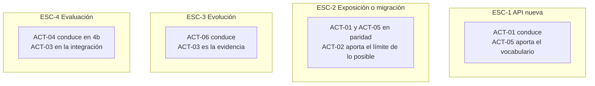

# Actores del dominio — `MARCO-ACTORES`

## Resumen ejecutivo

Las decisiones de diseño de una API se toman mal cuando no está claro a quién le corresponden. El caso típico: el desarrollador que implementa un endpoint elige el nombre del recurso, el formato del error y el criterio de paginación en el mismo *commit* en que escribe la lógica, sin que nadie haya fijado esas convenciones. No es negligencia; es que nadie definió que esa decisión tenía dueño.

Este documento define siete actores, qué decide cada uno, hasta dónde llega su autoridad y qué preguntas debería poder responder. Lo importante no son los títulos —cada organización usa los suyos— sino la **separación de responsabilidades**: en un equipo chico, una persona ocupa varios roles, y saber cuál está ocupando en cada momento es lo que evita que las convenciones se decidan por omisión.

---

## Los siete actores

| ID | Actor | Decide sobre | Autoridad |
|----|-------|--------------|-----------|
| `ACT-01` | Arquitecto de API | Convenciones, versionado, modelo de recursos | Vinculante en toda la superficie |
| `ACT-02` | Desarrollador productor | Implementación del contrato acordado | Vinculante dentro del endpoint |
| `ACT-03` | Desarrollador consumidor | Cómo se consume y se aísla | Vinculante en su cliente; consultiva sobre el contrato |
| `ACT-04` | QA / tester de API | Qué se verifica y qué se considera defecto | Vinculante para aceptar o rechazar |
| `ACT-05` | Analista funcional | Qué operaciones existen y qué reglas rigen | Vinculante sobre el qué, no sobre el cómo |
| `ACT-06` | Product owner de API | Alcance, prioridad, política de deprecación | Vinculante sobre el calendario |
| `ACT-07` | Seguridad y operaciones | Autenticación, límites, exposición | Poder de veto |

---

## `ACT-01` — Arquitecto de API

**Qué le toca.** Las decisiones que valen para toda la superficie y que resultan caras de revertir: el modelo de recursos, las convenciones de nomenclatura de URIs y de campos, la estrategia de versionado, el formato de los errores, el criterio de paginación, y qué estilo de integración corresponde a cada caso —REST, mensajería, gRPC—.

**Hasta dónde llega.** Fija el marco; no diseña cada endpoint. Un arquitecto que revisa nombre por nombre se convierte en cuello de botella y termina siendo ignorado. La forma efectiva de ejercer esta autoridad no es la revisión caso por caso sino el documento de convenciones más un mecanismo automático que las verifique —un *linter* de OpenAPI en la integración continua—.

**Dónde falla.** Por exceso, prescribiendo hasta el detalle y produciendo un documento que nadie lee. Por defecto, dejando que cada equipo invente su convención y descubriendo tarde que la organización tiene cinco formatos de error distintos.

**Preguntas que debe poder responder.** ¿Por qué esta API versiona así y no de otra manera? ¿Qué hace un desarrollador cuando necesita una operación que no encaja en CRUD? ¿Cómo verifico que las convenciones se cumplen sin revisar cada *pull request*?

---

## `ACT-02` — Desarrollador productor

**Qué le toca.** Implementar el contrato: los códigos de estado que devuelve cada caso, la validación de la entrada, la traducción entre el modelo de recursos y el modelo interno, el rendimiento de la consulta, las pruebas.

**Hasta dónde llega.** Es el actor con más capacidad de erosionar las convenciones sin que se note. Cada endpoint es una oportunidad de desviarse —devolver `200` con un error adentro porque es más rápido, agregar un parámetro que no sigue la convención, exponer la entidad de base de datos directamente para ahorrarse el mapeo— y ninguna de esas desviaciones se ve en revisión si el revisor mira la lógica y no el contrato.

Tiene además una responsabilidad que suele quedar implícita: **detectar cuándo el contrato acordado no se puede implementar razonablemente** y devolver esa información en lugar de forzarlo. Un endpoint que la especificación describe como simple y que exige siete consultas y una transacción distribuida es información de diseño, y llega tarde si aparece recién en producción.

**Dónde falla.** En la distancia entre lo que la especificación declara y lo que el código hace. Es la divergencia que más aparece en `ESC-4a`.

**Preguntas que debe poder responder.** ¿Qué código de estado corresponde a cada camino de fallo de este endpoint, incluidos los que no probé? ¿Este cambio que estoy por hacer rompe a alguien? ¿Lo que devuelvo coincide con lo que la especificación declara?

---

## `ACT-03` — Desarrollador consumidor

**Qué le toca.** Construir el cliente: manejo de errores y reintentos, aislamiento del contrato ajeno respecto del código propio, caché, autenticación y renovación de credenciales.

**Hasta dónde llega.** Sobre el contrato tiene voz consultiva, y es la voz más valiosa y la menos escuchada. Quien consume una API descubre en horas lo que el diseñador no vio en semanas: que faltan datos que obligan a una segunda llamada, que el error no distingue casos que el cliente necesita distinguir, que la paginación no sirve para el uso real.

En `CTX-1` este actor está fuera de la organización y su retroalimentación llega por canales de soporte, si llega. Vale la pena construir el canal antes de necesitarlo: una API pública sin forma de escuchar a sus integradores acumula fricción invisible.

**Dónde falla.** Acoplándose a detalles no garantizados —el orden de los elementos de una colección sin `sort` explícito, la forma exacta del texto de un mensaje de error, un campo no documentado que apareció en la respuesta— y descubriendo que se rompió cuando el productor hizo un cambio que consideraba compatible.

**Preguntas que debe poder responder.** ¿De qué partes de esta respuesta dependo, y cuáles están garantizadas por contrato? ¿Qué hace mi cliente cuando la API responde `429` o `503`? ¿Puedo reemplazar este proveedor sin tocar mi dominio?

---

## `ACT-04` — QA / tester de API

**Qué le toca.** Verificar que la API hace lo que dice: pruebas de contrato contra la especificación, casos de error y de borde, comportamiento bajo carga, y en `ESC-4` la caracterización de una API ajena.

**Hasta dónde llega.** Decide si algo se acepta. Su alcance específico en este dominio es más amplio de lo que suele asumirse: no se trata solo de verificar que el camino feliz funcione, sino de que **los caminos de fallo estén especificados y se comporten como se especificó**. Un endpoint que devuelve `500` ante una entrada inválida está mal aunque el camino feliz funcione perfecto, y ese defecto solo aparece si alguien lo busca.

En `ESC-4b` es el actor principal: la caracterización de una API sin documentación es esencialmente un trabajo de prueba exploratoria.

**Dónde falla.** Probando solo lo que la especificación declara. Los defectos de contrato más caros están en lo que la especificación **no** dice: qué pasa con un campo de más, con un valor de enumerado desconocido, con una petición concurrente sobre el mismo recurso.

**Preguntas que debe poder responder.** ¿Cada operación tiene definidos sus casos de error, y los probé? ¿La respuesta real coincide con el esquema publicado, campo por campo? ¿Qué pasa si esta operación se ejecuta dos veces?

---

## `ACT-05` — Analista funcional

**Qué le toca.** Traducir la necesidad de negocio en operaciones: qué entidades existen, qué reglas las gobiernan, qué transiciones de estado son válidas, qué significa cada error desde el punto de vista del usuario.

**Hasta dónde llega.** Define el **qué**, no el **cómo**. La frontera se cruza en ambas direcciones y conviene tenerla nombrada: un analista que especifica «un endpoint `POST /cancelarReserva`» ya decidió el diseño de la API, y un arquitecto que decide que la cancelación con menos de 24 horas devuelve `409` sin consultar ya decidió una regla de negocio.

Su aporte más específico en este dominio es el **vocabulario del dominio**, que es literalmente el material con el que se nombran los recursos. Cuando el negocio distingue entre «reserva» y «solicitud de reserva», esa distinción tiene que llegar al modelo de recursos; si no llega, la API va a necesitar un campo `tipo` que la reintroduzca peor.

**Dónde falla.** Especificando en términos de la interfaz de usuario en lugar del dominio, lo que empuja hacia el antipatrón de `CTX-3`: endpoints modelados según pantallas.

**Preguntas que debe poder responder.** ¿Qué entidades del negocio tienen identidad propia y ciclo de vida? ¿Qué reglas deben cumplirse siempre, y cuáles son solo del flujo actual? ¿Qué distinciones hace el negocio que el modelo todavía no refleja?

---

## `ACT-06` — Product owner de API

**Qué le toca.** El alcance y el calendario: qué operaciones se publican y en qué orden, qué se deprecia y con cuánta antelación, qué compromiso de estabilidad se asume, y —en `CTX-1`— el modelo de acceso y sus límites.

**Hasta dónde llega.** Es el actor cuya existencia más se omite, y el que más falta hace en `ESC-3`. Las decisiones de deprecación son de producto, no técnicas: cuánto tiempo se sostiene una versión vieja es una negociación entre el costo de mantenerla y el costo de forzar la migración de los consumidores. Sin alguien que la conduzca, la versión vieja se sostiene indefinidamente por miedo o se apaga de golpe por cansancio.

Aplica sobre todo en `CTX-1`, donde la API es un producto con usuarios. En `CTX-2` y `CTX-3` el rol suele estar absorbido por el product owner de la aplicación, y ahí conviene recordar que **la API tiene consumidores propios cuyo interés no siempre coincide con el de la aplicación**.

**Dónde falla.** Tratando la API como detalle de implementación de la aplicación. Cuando eso pasa, las decisiones de contrato se toman según la conveniencia de la próxima entrega y la API acumula deuda que después nadie puede pagar.

**Preguntas que debe poder responder.** ¿Quién consume cada versión y cuánto tardaría en migrar? ¿Qué prometimos por escrito sobre estabilidad? ¿Cuánto cuesta sostener la versión anterior un trimestre más?

---

## `ACT-07` — Seguridad y operaciones

**Qué le toca.** El mecanismo de autenticación y autorización, qué se expone y a quién, los límites de uso, el registro y la observabilidad, y qué información puede aparecer en una respuesta de error.

**Hasta dónde llega.** Tiene poder de veto, y es el único actor que lo tiene. Una API que expone datos personales sin control de acceso no se publica aunque el negocio lo pida y el calendario apriete.

Su intervención más específica en este dominio suele pasar desapercibida: **los mensajes de error filtran información**. Un `404` que distingue «la reserva no existe» de «la reserva existe pero no es tuya» le confirma al atacante la existencia del recurso. Un `500` que devuelve la traza de excepción expone la estructura interna, las versiones de las bibliotecas y a veces cadenas de conexión. La tensión con `ACT-03`, que necesita errores informativos, es real y se resuelve caso por caso; se trata en [`TEM-ERR`](../40-Contratos-y-Representaciones/Manejo-de-Errores.md).

**Dónde falla.** Interviniendo tarde. Un requisito de seguridad que llega cuando la API ya está publicada suele ser rompiente, y entonces se negocia una excepción que se vuelve permanente.

**Preguntas que debe poder responder.** ¿Qué puede hacer un token robado de esta API, y por cuánto tiempo? ¿Qué información se filtra por las diferencias entre respuestas de error? ¿Cómo se detecta y se frena un consumo abusivo?

---

## Matriz de responsabilidad por decisión

Se usa la notación RACI reducida: **D** decide, **C** es consultado, **I** es informado.

| Decisión | `ACT-01` | `ACT-02` | `ACT-03` | `ACT-04` | `ACT-05` | `ACT-06` | `ACT-07` |
|---|---|---|---|---|---|---|---|
| Modelo de recursos | **D** | C | C | I | **C** | I | I |
| Nomenclatura de URIs y campos | **D** | C | C | I | C | I | — |
| Estrategia de versionado | **D** | I | C | I | — | **C** | I |
| Formato de errores | **D** | C | **C** | C | C | I | **C** |
| Código de estado de un caso concreto | C | **D** | C | **C** | C | — | — |
| Reglas de negocio que la API aplica | C | I | — | C | **D** | C | — |
| Paginación y filtrado | **D** | C | **C** | I | C | I | I |
| Autenticación y autorización | C | I | C | I | — | I | **D** |
| Límites de uso | C | I | C | I | — | **C** | **D** |
| Publicar una versión nueva | C | I | I | C | I | **D** | I |
| Apagar una versión vieja | C | I | **C** | I | — | **D** | I |
| Aceptar un endpoint como terminado | I | I | I | **D** | C | I | C |
| Exponer un campo con datos personales | C | I | I | I | C | C | **D** (veto) |

Las dos filas que más conflicto generan en la práctica son «formato de errores», donde `ACT-03` y `ACT-07` tiran en direcciones opuestas, y «apagar una versión vieja», donde el costo lo paga un actor y la decisión la toma otro.

---

## Cómo cambia según escenario y contexto



En `CTX-1` los siete actores están presentes y `ACT-06` y `ACT-07` son determinantes. En `CTX-2` es frecuente que `ACT-06` no exista y que `ACT-01` absorba sus decisiones, lo cual funciona hasta que hay que apagar algo. En `CTX-3`, `ACT-03` está dentro del equipo y el ciclo de retroalimentación es corto: es la situación más cómoda y la que peor prepara para las demás. En `CTX-4`, `ACT-01` y `ACT-02` trabajan contra un contrato que no controlan, y `ACT-03` pasa a ser el rol dominante.

---

## Cuando una persona ocupa varios roles

Es la situación normal en equipos chicos y no tiene nada de irregular. Lo que sí produce problemas es no advertir el cambio de sombrero, porque cada rol tiene un sesgo y ocuparlos simultáneamente los deja sin contrapeso:

- `ACT-01` + `ACT-02` en la misma persona tiende a convenciones que se ajustan a lo que ya se implementó.
- `ACT-02` + `ACT-04` tiende a probar lo que se programó, no lo que se especificó.
- `ACT-02` + `ACT-03` —el caso de `CTX-3` con un equipo *fullstack*— tiende a APIs modeladas según la pantalla, porque quien las diseña sabe exactamente qué necesita el cliente hoy.

La mitigación no es contratar gente sino **hacer explícito el momento de la decisión**: escribir la convención antes de implementarla, escribir el caso de prueba desde la especificación y no desde el código, y revisar el contrato en un paso separado de la revisión de la lógica.

---

## Preguntas guía

- Para cada decisión que tomé esta semana sobre la API, ¿qué rol estaba ocupando?
- ¿Hay alguna fila de la matriz sin nadie asignado en mi organización?
- ¿Quién decide, en mi equipo, que un cambio es rompiente? ¿Y quién decide que una versión se apaga?
- ¿`ACT-03` tiene forma de hacer llegar su experiencia a `ACT-01`, o solo se queja?
- ¿`ACT-07` interviene en el diseño o solo audita al final?

---

## Anexo — Ficha de asignación

Se completa al inicio del trabajo sobre una API y se revisa cuando cambia el equipo.

```yaml
actores:
  ACT-01_arquitecto: ""
  ACT-02_productor: ""
  ACT-03_consumidor: ""          # en CTX-1 puede ser "externo, sin canal directo"
  ACT-04_qa: ""
  ACT-05_analista: ""
  ACT-06_product_owner: ""       # frecuentemente vacío en CTX-2
  ACT-07_seguridad: ""
sin_asignar: []                  # roles que nadie ocupa: es el riesgo a declarar
decisiones_sin_dueno: []         # filas de la matriz sin responsable
canal_de_retroalimentacion: ""   # cómo llega ACT-03 a ACT-01
```

El campo `sin_asignar` es el que más información aporta. Un rol vacío no significa que sus decisiones no se tomen: significa que se toman por omisión, distribuidas entre quienes están, y sin que nadie las revise.
