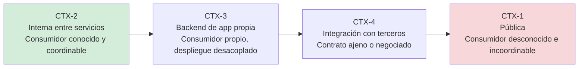

# Contextos del dominio — `MARCO-CONTEXTOS`

## Resumen ejecutivo

Un contexto es **quién consume la API y bajo qué acoplamiento**. Es la variable que más cambia las respuestas dentro de un mismo escenario: diseñar una API pública para miles de integradores desconocidos y diseñar una API que solo habla con otro servicio del mismo equipo son actividades con criterios opuestos, aunque ambas se hagan en `ESC-1` y ambas usen HTTP y JSON.

Mientras los [escenarios](Escenarios.md) fijan cuánta libertad hay, los contextos fijan cuánto rigor conviene. Todos los documentos temáticos indican qué cambia según el contexto.

---

## El eje que los ordena

Los contextos se ordenan por **distancia al consumidor**: cuánto sabe el productor sobre quién lo llama, y cuánta capacidad tiene de coordinar un cambio con él.



A mayor distancia, mayor costo de equivocarse y mayor justificación para el rigor: especificación formal, versionado explícito, errores estructurados, política de deprecación. A menor distancia, ese mismo rigor puede ser ceremonia que nadie aprovecha.

Confundir los extremos produce los dos errores simétricos que la guía intenta desarmar. Aplicarle a una API interna el aparato de una API pública cuesta tiempo sin comprar nada. Aplicarle a una API pública la informalidad de una interna cuesta la confianza de los integradores, y esa no se recupera con un parche.

---

## `CTX-1` — API pública

**Quién consume.** Terceros desconocidos, en cantidad indeterminada, con calendarios propios. Incluye tanto la API abierta como la API de socios con acceso restringido: lo que define el contexto no es el control de acceso sino la imposibilidad de coordinar un cambio.

**Qué cambia.** Todo se vuelve contrato. La especificación OpenAPI es el producto, no un subproducto; los nombres de los campos son parte de la interfaz pública y cambiarlos rompe; la política de versionado y deprecación debe estar publicada antes de necesitarla. El manejo de errores importa más que en ningún otro contexto porque el consumidor no puede leer el código para entender qué salió mal: el mensaje de error **es** la documentación en el momento en que más se la necesita.

Aparecen además preocupaciones que en los otros contextos son opcionales: límites de uso publicados y aplicados, estabilidad garantizada por escrito, portal de documentación, credenciales autogestionadas, y un canal para anunciar cambios.

**Riesgo dominante.** Publicar algo que después hay que sostener durante años. Todo campo expuesto es un compromiso; conviene exponer de menos y agregar, porque quitar es rompiente y agregar no.

**Ejemplo del dominio.** El sistema de reserva de salas abre su API para que empresas clientes integren sus propios sistemas de gestión de personal.

---

## `CTX-2` — API interna entre servicios

**Quién consume.** Otros servicios de la misma organización, conocidos, con equipos identificables y capacidad de despliegue coordinado.

**Qué cambia.** El contrato sigue siendo un contrato, pero es renegociable. Un cambio rompiente se puede hacer si se coordina el despliegue de los dos lados, y eso habilita una economía distinta: se puede corregir un nombre mal elegido en lugar de arrastrarlo, se puede eliminar un endpoint que nadie usa después de verificarlo, se puede saltar el versionado formal para cambios que se despliegan juntos.

Lo que **no** cambia es la necesidad de especificación. La creencia de que una API interna no necesita OpenAPI porque «el equipo se conoce» sobrevive hasta que el equipo rota. En este contexto la especificación vale menos como contrato y más como generador: de clientes tipados, de pruebas de contrato y de la documentación que nadie va a escribir a mano.

Aparecen en cambio preocupaciones propias: la observabilidad distribuida —propagación de contexto de traza—, la resiliencia ante fallas parciales, y el riesgo de que la red de llamadas entre servicios se vuelva un grafo que nadie entiende.

**Riesgo dominante.** El acoplamiento invisible. Como cambiar es barato, se cambia seguido, y se termina con servicios que solo pueden desplegarse todos juntos: un monolito distribuido, con la latencia de la red y ninguna de las ventajas de la separación.

**Ejemplo del dominio.** El servicio de reservas consulta al servicio de identidad para resolver los permisos del usuario que reserva.

---

## `CTX-3` — Backend de aplicación propia

**Quién consume.** Una aplicación cliente del mismo producto: una SPA, una aplicación Blazor, una vista MVC que llama por AJAX, una aplicación móvil .NET MAUI. Un solo consumidor, propio, pero que **se despliega por separado**.

Ese desacoplamiento de despliegue es lo que distingue este contexto del anterior y lo que más se subestima. Una aplicación MAUI instalada en el teléfono de un usuario no se actualiza cuando el backend se despliega: sigue llamando a la API que conocía, con la versión que tenía, durante todo el tiempo que el usuario tarde en actualizar —o para siempre, si nunca actualiza—. En términos de libertad de cambio, un cliente móvil se comporta como `CTX-1` aunque el equipo sea el mismo.

Blazor en render *interactive server* es el caso opuesto y conviene tenerlo presente: el código del componente se ejecuta en el servidor, de modo que el consumo de una API interna desde ese componente es una llamada servidor a servidor y se comporta como `CTX-2`. La misma tecnología en render WebAssembly vuelve a ser un cliente desplegado en el navegador. La distinción no es cosmética: cambia dónde viven las credenciales, qué se puede confiar y qué latencia se paga.

**Qué cambia.** La API puede modelarse para las necesidades de su cliente en lugar de para la generalidad del dominio: agregar en un solo endpoint lo que la pantalla necesita, en lugar de obligar al cliente a hacer cinco llamadas. Es el patrón *Backend for Frontend*, y es legítimo cuando el cliente es uno. Deja de serlo cuando aparece el segundo cliente con necesidades distintas y el backend empieza a acumular endpoints a medida para cada pantalla de cada aplicación.

**Riesgo dominante.** Que la API quede modelada según la interfaz de usuario. Cuando el endpoint se llama `/pantallaReservas` y devuelve exactamente los campos que esa pantalla dibuja, cualquier rediseño visual se convierte en un cambio de backend.

**Ejemplo del dominio.** La aplicación MAUI de reservas y la aplicación web Blazor consumen la misma API del sistema de salas.

---

## `CTX-4` — Integración con sistemas externos

**Quién consume, o a quién se consume.** Un sistema de un tercero con el que hay que interoperar: la pasarela de pagos, el ERP corporativo, el servicio de facturación electrónica del organismo fiscal, el proveedor de identidad.

Es el único contexto donde el rol se invierte con frecuencia: muchas veces no se diseña la API sino que se **consume** una ajena, y el trabajo de diseño consiste en construir la capa que la aísla del resto del sistema. Cuando sí se diseña, el contrato suele estar negociado o directamente impuesto por el otro lado.

**Qué cambia.** El contrato deja de ser una decisión y pasa a ser un dato. Las preguntas se desplazan: qué garantías reales ofrece el otro lado, qué pasa cuando no responde, cómo se reintenta sin duplicar operaciones —la idempotencia deja de ser teoría y se vuelve el problema central—, y cómo se aísla el resto del sistema de las particularidades del proveedor para poder reemplazarlo.

Aparecen además restricciones que no se eligen: autenticación con el mecanismo que el proveedor soporte, formatos heredados, límites de uso ajenos, y a menudo una documentación incompleta que obliga a operar en `ESC-4b`.

**Riesgo dominante.** Dejar que el modelo del proveedor se filtre al dominio propio. Cuando los tipos que devuelve la pasarela de pagos circulan por toda la aplicación, cambiar de pasarela deja de ser una decisión comercial y pasa a ser una reescritura.

**Ejemplo del dominio.** El sistema de reservas cobra la seña a través de una pasarela de pagos externa y emite la factura contra el servicio del organismo fiscal.

---

## Tabla comparativa

| | `CTX-1` Pública | `CTX-2` Interna | `CTX-3` App propia | `CTX-4` Integración |
|---|---|---|---|---|
| **Consumidor** | Desconocido, múltiple | Conocido, coordinable | Propio, desplegado aparte | Externo, ajeno |
| **Cambio rompiente** | Requiere versión nueva y deprecación | Coordinable | Según el cliente: web sí, móvil no | No se decide de este lado |
| **Especificación OpenAPI** | Es el producto | Genera clientes y pruebas | Genera el cliente tipado | Se consume la del proveedor |
| **Versionado** | Explícito y publicado | Ligero o ninguno | Explícito si hay clientes instalados | Impuesto |
| **Errores** | Estructurados y documentados | Estructurados | Estructurados | Se traducen los ajenos |
| **Rate limiting** | Necesario y publicado | Por protección, no por negocio | Poco relevante | Se lo padece |
| **Preocupación propia** | Estabilidad del contrato | Observabilidad distribuida | Agregación por pantalla | Aislamiento y reintentos |

---

## Cruce con los escenarios

Un mismo escenario cambia de forma según el contexto. El caso más nítido es `ESC-3`, la evolución en producción:

| Escenario en… | `CTX-1` Pública | `CTX-2` Interna | `CTX-3` App propia | `CTX-4` Integración |
|---|---|---|---|---|
| `ESC-3` cambio rompiente | Versión nueva, deprecación anunciada, soporte simultáneo por meses | Se coordina el despliegue y se cambia | Depende del cliente: en web se despliega junto, en móvil se versiona | El proveedor decide; se adapta el aislamiento |

La conclusión práctica es que **el mismo cambio técnico cuesta órdenes de magnitud distintos según el contexto**, y por eso la primera pregunta ante cualquier decisión de esta guía es en qué contexto se está.

---

## Correspondencia con los contextos genéricos del marco

El Prompt de origen enuncia los contextos como desarrollo web, backend y soluciones fullstack. Esa partición describe el tipo de aplicación, no el acoplamiento con el consumidor, y en el dominio de las APIs es la segunda la que gobierna las decisiones. La correspondencia es la siguiente:

| Contexto genérico | Dónde cae en esta guía |
|---|---|
| Desarrollo web | `CTX-3`, y `CTX-1` cuando la aplicación web es de terceros |
| Backend | `CTX-2`, con `CTX-4` para las integraciones salientes |
| Soluciones fullstack | `CTX-3`, con la distinción entre Blazor *interactive server* (se comporta como `CTX-2`) y los clientes desplegados |

La reformulación es criterio de esta guía y se declara como tal. Se adoptó porque las tres categorías originales dejan indistinguibles situaciones cuyo tratamiento difiere por completo: una API web pública y una API web interna son ambas «desarrollo web» y no comparten casi ninguna decisión de diseño.

---

## Preguntas guía

- ¿Puedo nombrar a todos los consumidores de esta API, y puedo pedirles que desplieguen un cambio?
- Si mañana renombro un campo, ¿qué se rompe y cuánto tardo en enterarme?
- ¿El cliente que estoy sirviendo se despliega conmigo o por su cuenta?
- ¿Estoy diseñando para el dominio o para la pantalla que lo consume hoy?
- En `CTX-4`, ¿cuánto del modelo del proveedor circula por dentro de mi sistema?

---

## Anexo — Determinación del contexto

Cuatro preguntas en orden. La primera que se responda afirmativamente fija el contexto.

```yaml
- pregunta: "¿Consumen esta API organizaciones distintas de la mía?"
  si: CTX-1
- pregunta: "¿Estoy consumiendo una API que no controlo?"
  si: CTX-4
- pregunta: "¿El consumidor es una aplicación cliente de mi propio producto?"
  si: CTX-3
  nota: "Si es Blazor interactive server, el consumo ocurre en el servidor: tratar como CTX-2."
- pregunta: "¿El consumidor es otro servicio de mi organización?"
  si: CTX-2
```

Una API puede estar en varios contextos a la vez, y es más frecuente de lo que parece: la misma API sirve a la aplicación móvil (`CTX-3`) y a los clientes integradores (`CTX-1`). Cuando eso pasa, **rige el contexto más restrictivo**, porque las garantías se dan al consumidor menos coordinable. La alternativa es separar en dos superficies, y suele ser la decisión correcta cuando las necesidades divergen.
