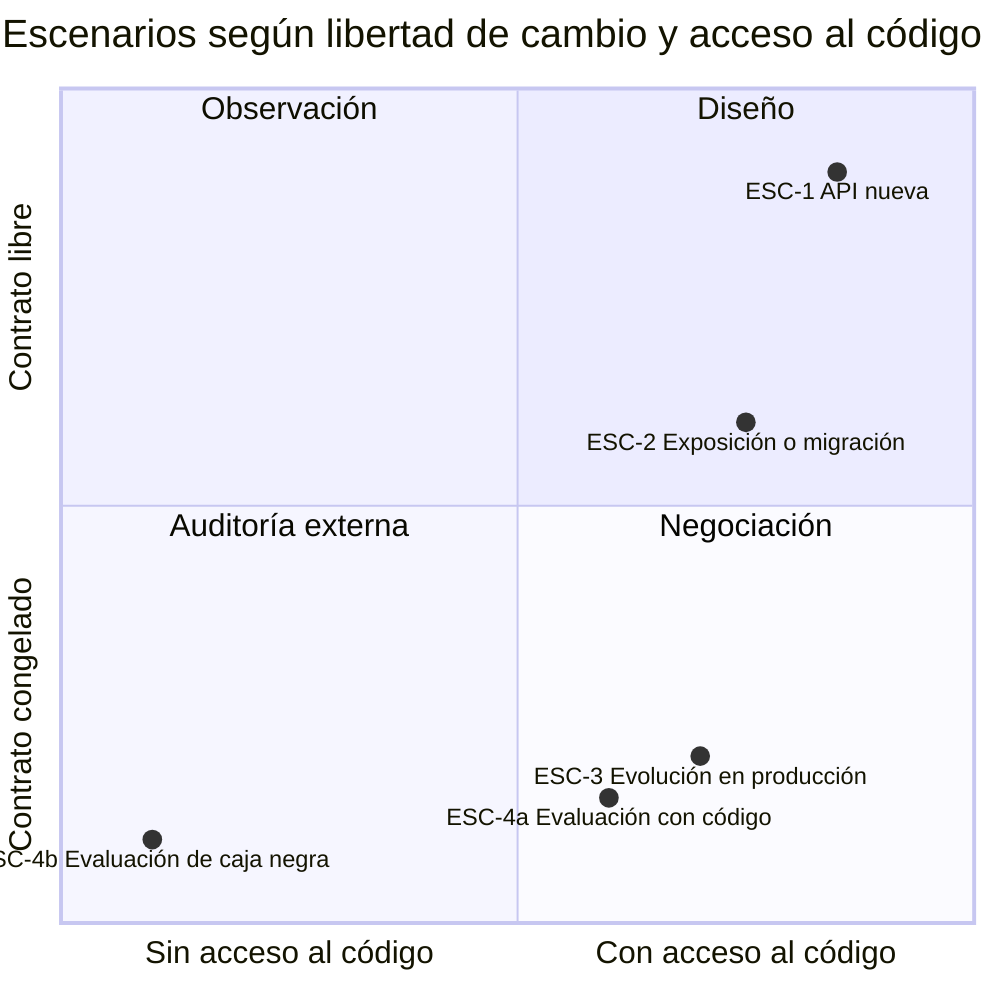
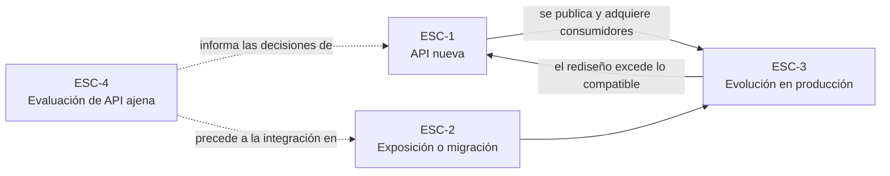

# Escenarios del dominio — `MARCO-ESCENARIOS`

## Resumen ejecutivo

Un escenario es la situación de proyecto desde la que alguien se acerca al diseño de una API. No es lo mismo decidir cómo se llaman los recursos de una API que todavía no existe que decidirlo cuando ya hay ochenta clientes móviles instalados consumiéndola. La decisión técnica puede ser idéntica; el margen para tomarla no lo es.

Esta guía define cuatro escenarios. Todos los documentos temáticos los recorren en su sección «Aplicación por escenario», de modo que el lector pueda ubicarse en el suyo y leer solo lo que le toca. Junto con los [contextos](Contextos.md) y los [actores](Actores.md) forman el vocabulario común del que dependen los demás documentos.

---

## Por qué cuatro y no otros

Los escenarios se distinguen por dos variables que gobiernan casi todo lo demás: **cuánta libertad hay para cambiar el contrato** y **cuánto acceso hay al código que lo implementa**. La primera determina si una decisión de diseño es reversible; la segunda, si se puede verificar algo o solo observarlo desde afuera.



Cruzar esas dos variables da los cuatro escenarios que siguen. El cuarto se desdobla en dos variantes porque evaluar una API con el código a la vista y evaluarla navegándola desde afuera exigen técnicas distintas, aunque persigan el mismo objetivo.

---

## `ESC-1` — API nueva

**Situación.** Se diseña una API que todavía no tiene consumidores. No hay contrato publicado, no hay clientes que romper, y la elección de convenciones está abierta.

Es el escenario donde más importa decidir bien y donde menos se percibe la urgencia de hacerlo. Nada de lo que se elige acá duele todavía: el costo de haber puesto el verbo en la URI, de haber devuelto `200 OK` con un error adentro o de no haber previsto la paginación aparece cuando ya hay consumidores, y para entonces la decisión pasó a `ESC-3` y dejó de ser gratis.

**Qué se decide acá.** El modelo de recursos, la nomenclatura de URIs y de campos, la estrategia de versionado —incluso si la primera versión no la necesita todavía—, el formato de errores, el mecanismo de autenticación y la forma de la paginación. Son las decisiones que después se vuelven caras.

**Cuál es la trampa.** Sobrediseñar. Una API nueva con hipermedia completa, siete niveles de filtrado y tres esquemas de versionado simultáneos resuelve problemas que no tiene. El criterio útil es distinguir las decisiones que hay que tomar ahora porque después cuestan —nomenclatura, formato de error, versionado— de las que se pueden postergar sin penalización —caché, hipermedia, filtrado avanzado—. La guía marca esa diferencia tema por tema.

**Cómo se sabe que terminó.** Existe una especificación OpenAPI revisada antes de que se escriba el primer controlador, y un ejemplo de petición y respuesta para cada operación, incluyendo los errores.

---

## `ESC-2` — Exposición o migración

**Situación.** Ya existe un sistema en funcionamiento y hay que ponerle una API REST encima, o hay que rehacer una API existente sobre otra plataforma. Abarca tres variantes que comparten la misma tensión: exponer un sistema que no fue pensado para ser expuesto, portar una API de otro lenguaje a .NET, y reemplazar un protocolo previo —SOAP, RPC propietario, un endpoint que devuelve XML desde 2009— por uno HTTP.

La tensión es siempre la misma: **el modelo interno existente empuja hacia una API que lo refleja, y esa API casi nunca es la que conviene**. Un sistema cuyas tablas se llaman `TB_RESERVA_CAB` y `TB_RESERVA_DET` tiende a producir endpoints `/tbReservaCab`, y con eso filtra al consumidor una decisión de modelado de 2011 que ya nadie defiende.

**Qué se decide acá.** Cuánto del modelo interno se deja ver. La respuesta razonable casi nunca es «todo» ni «nada»: se diseña el modelo de recursos desde el punto de vista del consumidor y se acepta el costo de traducir. Ese costo de traducción es el precio de no acoplar el contrato público a la base de datos, y conviene declararlo explícitamente ante quien financia el proyecto, porque desde afuera parece trabajo redundante.

**Cuál es la trampa.** En la variante de migración, reproducir el contrato viejo por fidelidad. Migrar una API SOAP a REST conservando el patrón `POST /api/EjecutarOperacion` con un campo `operacion` en el cuerpo produce SOAP con otra sintaxis, sin ninguna de las ventajas de HTTP y sin las herramientas de SOAP. Si el contrato viejo se va a conservar tal cual, migrar no aporta.

**Cómo se sabe que terminó.** El modelo de recursos publicado se puede explicar sin mencionar tablas ni clases internas, y existe un mapa explícito entre cada recurso y lo que lo respalda internamente.

---

## `ESC-3` — Evolución en producción

**Situación.** La API existe, tiene consumidores activos y hay que cambiarla. Incluye tanto agregar funcionalidad como corregir decisiones de diseño que resultaron equivocadas.

Es el escenario más frecuente en la vida real y el peor cubierto por el material disponible, que suele detenerse en cómo diseñar una API y no en cómo cambiarla sin romper a quien la usa. La restricción central es que **el productor no controla el calendario del consumidor**: una aplicación móvil instalada sigue llamando a la versión que conocía durante meses o años después de que se publicó la nueva.

**Qué se decide acá.** Si el cambio es rompiente o no —una pregunta con respuesta técnica precisa, no una opinión, y la trata [`TEM-BREAK`](../50-Evolucion-y-Versionado/Compatibilidad-y-Cambios-Rompientes.md)—; si se emite una versión nueva o se extiende la actual; cómo se anuncia la deprecación y con cuánta antelación; y cómo se mide quién sigue usando lo viejo, porque sin esa medición la fecha de apagado se fija por intuición.

**Cuál es la trampa.** Suponer que agregar es siempre seguro. Agregar un campo obligatorio a un cuerpo de petición rompe; agregar un valor nuevo a un enumerado rompe a los clientes que lo deserializan con validación estricta; endurecer una validación que antes pasaba rompe a quien dependía de la laxitud. Se detalla en [`TEM-BREAK`](../50-Evolucion-y-Versionado/Compatibilidad-y-Cambios-Rompientes.md).

**Cómo se sabe que terminó.** Cada versión publicada tiene una fecha de fin de soporte comunicada, y existe telemetría por versión que permite saber si esa fecha es realista.

---

## `ESC-4` — Evaluación de una API ajena

**Situación.** Hay que entender, juzgar o consumir una API que otro diseñó. El objetivo puede ser decidir si integrarse con ella, auditar su calidad, aprender de ella o construir un cliente contra ella.

El escenario se desdobla según el acceso disponible, y la diferencia es lo bastante grande como para justificar tratarlas por separado.

### `ESC-4a` — Con acceso al código o a la especificación

Se dispone del repositorio, de la especificación OpenAPI o de ambos. La evaluación puede ser sistemática: se recorre la especificación operación por operación, se contrasta con lo que el código realmente hace —divergen más seguido de lo que se admite— y se verifica contra las listas de [`ANEXO-CHECK`](../99-Anexos/Listas-de-Verificacion.md).

El hallazgo más frecuente en esta variante es la **divergencia entre la especificación y la implementación**: campos documentados que ya no se devuelven, códigos de estado que el código emite y la especificación no declara, parámetros opcionales que en la práctica son obligatorios. Una especificación generada desde el código a partir de anotaciones reduce esa divergencia pero no la elimina, porque las anotaciones también se desactualizan.

### `ESC-4b` — Solo desde afuera

No hay código ni especificación: hay una API en funcionamiento, quizá documentación de usuario, y la posibilidad de hacerle peticiones. Es la situación de quien evalúa un producto de terceros antes de comprarlo, de quien releva un sistema heredado cuyo código se perdió, y de quien tiene que integrarse con un proveedor que no documenta.

La técnica es distinta: se infiere el modelo de recursos desde las URIs observadas, se prueban métodos no documentados para ver qué responde, se examinan las cabeceras —a menudo revelan el framework, la estrategia de caché y la de rate limiting—, y se contrastan los códigos de estado devueltos con los que la semántica exigiría. Lo que se obtiene es una hipótesis del contrato, no el contrato; conviene registrarlo como tal.

Hay un límite ético y legal que la guía enuncia sin desarrollar: sondear una API ajena para caracterizarla solo es legítimo con autorización, dentro de los términos de servicio y sin exceder los límites de uso publicados. Enumerar identificadores para descubrir el modelo de datos no es evaluación, es otra cosa.

**Cómo se sabe que terminó.** En ambas variantes, existe un documento que describe el contrato observado con su nivel de confianza por operación, y una lista de las preguntas que no pudieron responderse con la evidencia disponible.

---

## Tabla comparativa

| | `ESC-1` API nueva | `ESC-2` Exposición o migración | `ESC-3` Evolución | `ESC-4` Evaluación |
|---|---|---|---|---|
| **Libertad de cambio** | Total | Alta en el contrato, nula en el sistema de respaldo | Restringida por los consumidores | Ninguna |
| **Acceso al código** | Se está escribiendo | Al sistema previo, sí | Sí | `4a` sí · `4b` no |
| **Riesgo dominante** | Sobrediseñar o postergar lo caro | Filtrar el modelo interno | Romper consumidores en silencio | Dar por cierto lo que solo se infirió |
| **Artefacto de salida** | Especificación OpenAPI revisada | Mapa recurso ↔ sistema interno | Política de versionado y deprecación | Informe del contrato observado |
| **Actor que suele conducir** | `ACT-01` arquitecto | `ACT-01` con `ACT-05` analista | `ACT-06` product owner con `ACT-01` | `ACT-04` QA o `ACT-03` consumidor |

---

## Cómo se combinan

Los escenarios no son excluyentes y rara vez se presentan puros. Un proyecto típico atraviesa varios, y a menudo simultáneamente: se evalúa la API del proveedor de pagos (`ESC-4`), se expone el sistema de facturación heredado (`ESC-2`), se diseña desde cero el módulo de reservas (`ESC-1`) y se sigue manteniendo la v1 que ya está en producción (`ESC-3`).



La transición que más conviene retener es la primera: **toda API de `ESC-1` termina en `ESC-3`**, normalmente antes de lo previsto. Diseñar sabiendo eso es la diferencia entre una API que se puede evolucionar y una que hay que reemplazar.

---

## Correspondencia con los escenarios genéricos del marco

El Prompt que origina esta guía enuncia los escenarios en términos generales de proyecto. La correspondencia con los cuatro definidos acá es directa:

| Escenario genérico | Escenario de esta guía |
|---|---|
| Desarrollo de software nuevo | `ESC-1` |
| Migración a otro lenguaje o plataforma | `ESC-2` |
| Evaluación de software existente con acceso al código | `ESC-4a` |
| Evaluación de un producto solo desde afuera | `ESC-4b` |

`ESC-3` no tiene correspondencia en esa enumeración y se agregó por criterio de esta guía: en el dominio de las APIs, la evolución de un contrato publicado plantea restricciones que ninguno de los otros cuatro cubre, y omitirla dejaría fuera el escenario más frecuente.

---

## Preguntas guía

- ¿En qué escenario estoy hoy, y en cuál voy a estar dentro de un año?
- ¿Qué decisiones de las que estoy tomando serían caras de revertir cuando pase a `ESC-3`?
- Si estoy en `ESC-2`, ¿cuánto de mi modelo interno se ve desde afuera, y lo decidí o me pasó?
- Si estoy en `ESC-3`, ¿sé quién consume cada versión, o lo estoy suponiendo?
- Si estoy en `ESC-4b`, ¿qué parte de lo que documenté es observación y qué parte es inferencia?

---

## Anexo — Ficha de ubicación

Se completa al inicio de un trabajo sobre una API, y se revisa cuando cambia algo estructural.

```yaml
escenario_principal: ESC-?          # el que domina el trabajo
escenarios_secundarios: []          # los que también intervienen
contexto: CTX-?                     # ver Contextos.md
consumidores_conocidos:             # vacío en ESC-1; obligatorio en ESC-3
  - nombre: ""
    version_consumida: ""
    puede_actualizar: si | no | desconocido
libertad_de_cambio: total | acotada | nula
acceso: codigo | especificacion | ambos | ninguno
decisiones_ya_congeladas: []        # lo que no se puede tocar y por qué
```

El campo `puede_actualizar` es el que más discusión genera y el más determinante: una API cuyos consumidores son todos internos y desplegables a demanda admite cambios que una API con clientes móviles instalados no admite. Confundir ambas situaciones es el origen de la mayoría de las rupturas evitables.
