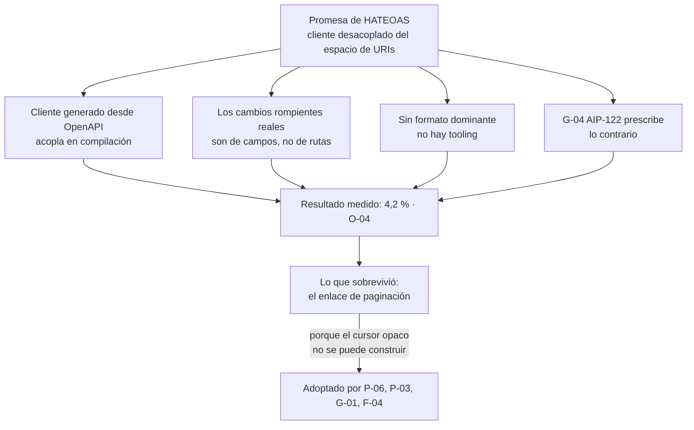

# Hipermedia y HATEOAS — `TEM-HATEOAS`

## Resumen ejecutivo

HATEOAS es la cuarta restricción de interfaz de `O-01`: el estado de la aplicación avanza siguiendo enlaces que el servidor ofrece en sus respuestas, no invocando URIs que el cliente construyó a partir de documentación. La promesa es un desacoplamiento fuerte —el servidor reorganiza su espacio de nombres sin romper clientes, y las acciones disponibles se descubren en tiempo de ejecución en lugar de replicarse en cada consumidor— y Fielding la considera definitoria: en `O-02` afirma que sin hipertexto como motor del estado de la aplicación no hay API REST.

Es también la restricción que el mercado descartó, y hay medición. `O-04` analizó 500 APIs públicas que declaran ofrecer REST y encontró un 4,2 % de cumplimiento. Bajo la definición del autor del término, alrededor del 96 % de las «APIs REST» públicas no lo son. Ninguna de las guías corporativas verificadas prescribe hipermedia general, y `G-04` AIP-122 prescribe explícitamente lo contrario para la identificación de recursos.

Lo que sí sobrevivió es un caso mínimo y utilitario: **el enlace de navegación entre páginas**. GitHub lo emite en la cabecera `Link` de `N-10` (`P-06`), la guía de Azure lo prescribe como campo `nextLink` en el cuerpo (`G-01`), `F-04` lo define como objeto `links` con claves obligatorias, y Stripe expone un campo `url` en su objeto de lista (`P-03`). Hipermedia ganó exactamente donde resuelve un problema concreto —que el cliente no tenga que construir un cursor a mano— y perdió en todo lo demás.

El documento le sirve a `ACT-01`, que tiene que decidir si prescribe enlaces y cuáles, y a `ACT-03`, que necesita saber de qué partes de una respuesta puede depender.

---

## Definición

### Qué es

La sigla desarrolla *Hypermedia As The Engine Of Application State*. Nombra la condición de que las transiciones de estado disponibles para un cliente en un momento dado le lleguen en la representación que acaba de recibir, en lugar de estar codificadas en el cliente.

Una precisión de vocabulario que esta guía sostiene de forma literal: la disertación (`O-01` §5.1.5) enumera *«hypermedia as the engine of application state»* entre las cuatro restricciones de interfaz. La variante con *hypertext*, de donde sale la sigla tal como circula, aparece en otros textos de Fielding y no está verificada contra `O-01` en esta guía. La frase tajante —*«if the engine of application state … is not being driven by hypertext, then it cannot be a REST API. Period.»*— pertenece a `O-02`, la entrada de blog de 2008, no a la disertación.

El mecanismo concreto tiene tres piezas. Un **enlace**, que es una URI. Un **tipo de relación**, que dice qué significa ese enlace respecto del recurso actual —`next`, `self`, `cancelar`— y que es lo que el cliente interpreta. Y, cuando el enlace representa una acción y no una navegación, alguna indicación del **método** y de lo que hay que enviar. `N-10` estandariza las dos primeras piezas en la cabecera `Link`; la tercera no tiene estándar dominante y es donde los formatos divergen.

### Qué problema resuelve

**El acoplamiento del cliente al espacio de URIs.** Un cliente que compone `"/reservas/" + id` tiene esa estructura congelada. Reorganizar las rutas —mover las reservas bajo la sede, cambiar el esquema de identificadores— rompe a todos los consumidores a la vez. `O-02` formula esto como el reclamo de que los servidores conserven la libertad de controlar su propio espacio de nombres y puedan instruir al cliente sobre cómo construir las URIs apropiadas.

**La replicación de reglas de negocio en el cliente.** Si la cancelación exige veinticuatro horas de antelación, cada cliente que quiera ocultar el botón tiene que conocer la regla. Cuando la regla cambia a cuarenta y ocho, hay que actualizar todos los clientes, y en `CTX-3` con una aplicación MAUI instalada eso significa esperar a que el usuario actualice. Un enlace `cancelar` que el servidor emite o no según el estado real mueve la regla a un solo lado.

**La construcción de cursores opacos.** Es el caso donde la adopción sí ocurrió, y no es casualidad: un cursor opaco es por definición algo que el cliente no puede construir. `G-04` AIP-158 lo enuncia sin rodeos al exigir que los tokens de página sean opacos y no parseables por el usuario. Si el token es opaco, la única forma de llegar a la página siguiente es que el servidor la ofrezca.

### Qué NO es, y con qué se lo confunde

**No es emitir un `self` en cada respuesta.** Un enlace que repite la URI que el cliente acaba de usar no aporta información y no constituye HATEOAS. La restricción exige que el conjunto de enlaces **varíe con el estado del recurso**; un bloque de enlaces constante es decoración.

**No es documentación embebida.** Un campo con la URL del portal de documentación es una cortesía útil —Heroku lo incluye en su objeto de error como campo `url` (`G-08`)— y no tiene relación con la restricción.

**No es lo mismo que enlazar recursos relacionados.** Devolver `"salaHref": "/salas/a3f1"` junto a una reserva ahorra una composición de URI al cliente y es buena práctica, pero es navegación entre datos, no motor del estado de la aplicación. La diferencia está en si el conjunto cambia cuando cambia el estado.

**No sustituye a la especificación.** Un cliente que recibe un enlace con relación `cancelar` sabe a dónde ir; no sabe qué cuerpo enviar ni qué respuestas esperar. Esa información sigue viniendo de un documento OpenAPI (`N-19`) o de la documentación. La expectativa de que hipermedia hiciera innecesaria la especificación es una de las razones por las que decepcionó.

**No es un requisito para que una API sea buena.** Es la lectura que esta guía más quiere desactivar. El 95,8 % que mide `O-04` incluye a todas las APIs que la industria considera ejemplares.

---

## Por qué casi nadie lo implementa

La medición está en `O-04` —Neumann, Laranjeiro y Bernardino, IEEE Transactions on Services Computing 14(4):957–970—, que partió del top 4000 de Alexa, aisló 500 sitios que declaran ofrecer una API REST y los analizó por cumplimiento de principios y de buenas prácticas. El resultado sobre hipermedia es **4,2 %**. El conjunto de datos es de alrededor de 2018 y no es actual; es la mejor evidencia cuantitativa disponible y esta guía la usa señalando ambas cosas. La verificación fue indirecta: se confirmaron autores, publicación, metodología y la cifra, sin abrir el PDF completo.

Las razones de la no adopción son verificables por separado y conviene enumerarlas porque explican también dónde sí funcionó.

**El cliente típico no descubre nada en tiempo de ejecución.** Deserializa en tipos generados desde OpenAPI, donde las operaciones están fijadas en compilación. La generación de clientes —que es una de las razones principales por las que se publica una especificación, y que trata [`TEM-CLIENTES`](../60-Especificacion-y-Documentacion/Generacion-de-Clientes-y-Pruebas-de-Contrato.md)— produce exactamente el acoplamiento que hipermedia quería evitar. Para que los enlaces rindan hay que escribir el cliente a mano contra ellos, y nadie lo hace.

**El desacoplamiento que compra rara vez es el que hace falta.** El problema real de `ESC-3` no es que las URIs cambien: es que cambian los campos, los tipos, las validaciones y los enumerados. Hipermedia no ayuda con ninguno de esos, y todos ellos son cambios rompientes que `TEM-BREAK` cataloga. Comprar libertad para reorganizar rutas, a cambio de peso en cada respuesta, resuelve una parte pequeña del problema de evolución.

**Ningún formato se impuso.** Sin un formato dominante no hay tooling, y sin tooling el costo recae entero sobre cada equipo. La fragmentación se detalla más abajo.

**Las guías corporativas no lo piden, y una lo desaconseja.** `G-04` AIP-122 prescribe que los recursos expongan un campo `name` con su nombre de recurso y que **no** expongan self-links ni tuplas ni otras formas de identificación. Es una posición explícitamente contraria en el punto más básico de hipermedia, sostenida por la organización con el corpus de diseño de APIs más extenso que esta guía verificó.

**El versionado explícito ocupó su lugar.** Todas las plataformas verificadas resolvieron la evolución del contrato con versión declarada: Stripe con fecha en cabecera `Stripe-Version` (`P-01`), GitHub con `X-GitHub-Api-Version` (`P-05`), Shopify con fecha en la URL (`P-07`), Azure con `api-version` en query (`G-01`). El problema tenía otra solución y esa solución se adoptó.



---

## Los formatos

Cinco nombres circulan cuando se discute cómo serializar enlaces en JSON: HAL, JSON:API, Siren, Ion e Hydra. **De los cinco, esta guía solo verificó JSON:API.** Las especificaciones de HAL, Siren, Ion e Hydra no se consultaron y no se recogió evidencia de su adopción; figuran en la sección de fuentes no verificadas de [`ANEXO-REFERENCIAS`](../99-Anexos/Referencias.md). Se los nombra acá porque el lector los va a encontrar citados en cualquier material sobre el tema, y porque omitirlos daría la impresión falsa de que no existen. **Nada de lo que este documento afirme sobre sus mecanismos concretos debe darse por verificado**, y esta guía no formula ninguna afirmación técnica sobre ellos.

Lo que sí está verificado:

**JSON:API v1.1 (`F-04`).** Especificación comunitaria estable, finalizada el 2022-09-30, con media type registrado ante IANA: `application/vnd.api+json`. El documento debe contener al menos uno de `data`, `errors`, `meta` o un miembro de extensión; `data` y `errors` no pueden coexistir. Entre los miembros de nivel superior opcionales está `links`, y para paginación define las claves `first`, `last`, `prev` y `next` como obligatorias. Es la pieza hipermedia que efectivamente se adopta. Su clasificación como convención de facto y no como norma responde a su fuerza normativa —ninguna organización de estándares la respalda— y no a su calidad, que es alta. `G-06` la recomienda para organizaciones del gobierno británico que no tengan estándar propio.

**RFC 8288, Web Linking (`N-10`).** Es el único mecanismo **normativo** de la lista y no es un formato de cuerpo: define la cabecera `Link` y el registro de tipos de relación. Sintaxis: `Link: <uri>; rel="tipo"; param=...`, con múltiples enlaces separados por coma o en cabeceras repetidas. El atributo `rel` es obligatorio; `anchor`, `title`, `type`, `hreflang` y `media` son opcionales. Obsoleta RFC 5988, de modo que citar 5988 hoy es citar un documento reemplazado.

Una precisión sobre `N-10` que conviene retener porque produce citas incorrectas: **el RFC define la cabecera y el registro, no los nombres de relación**. Según el registro IANA (`N-11`), `self`, `related` provienen de RFC 4287; `next` y `prev` de la especificación HTML; `previous` es sinónimo registrado de `prev`; y solo `first` y `last` se registran con referencia a RFC 8288. Para citar una relación concreta corresponde `N-11`, no `N-10`.

### El desacuerdo sobre dónde va el enlace

`N-10` es la vía estándar y el ecosistema mayoritariamente no la usa. La evidencia:

| Quién | Dónde pone el enlace de página siguiente | Fuente |
|---|---|---|
| GitHub | Cabecera `link` con `rel="prev"`, `"next"`, `"first"`, `"last"` | `P-06` |
| Azure (guía de Microsoft) | Campo `nextLink` en el cuerpo, URL absoluta, incluyendo `api-version`; **se omite el campo** en la última página en lugar de enviarlo nulo | `G-01` |
| JSON:API | Objeto `links` de nivel superior con `first`, `last`, `prev`, `next` | `F-04` |
| Stripe | Objeto de lista con `url` y `has_more`; sin campo `next` explícito: el cliente compone con el último identificador y `starting_after` | `P-03` |

Cuatro mecanismos para el mismo enlace, y solo uno de los cuatro es el estándar. El detalle de Azure —omitir el campo en lugar de enviarlo nulo— es la clase de precisión que rinde en la práctica: evita que el cliente haga una petición de más. El de Stripe merece nota porque su cursor **no es opaco**: es el identificador del objeto, lo que acopla la paginación al orden de creación y contradice lo que `G-04` AIP-158 exige. La convención de facto que sostiene la práctica dominante es «poner la navegación en el cuerpo», con evidencia en `P-03`, `G-01` y `F-04`; la prescripción estándar es `N-10`, sostenida por `P-06`.

Esta guía recomienda `N-10` cuando la API es `CTX-1` y se espera que la consuman clientes genéricos, y considera igualmente defendible el enlace en el cuerpo en los demás contextos, siempre que la elección esté documentada. El detalle se desarrolla en [`TEM-PAG`](../40-Contratos-y-Representaciones/Colecciones-y-Paginacion.md).

---

## Aplicación por escenario

### `ESC-1` — API nueva

`MARCO-ESCENARIOS` clasifica hipermedia entre las decisiones postergables sin penalización, y este documento aporta la razón: agregar enlaces a una respuesta es un cambio compatible, mientras que quitarlos o cambiar su forma no lo es. Se puede empezar sin y agregar después; empezar con hipermedia completa y descubrir que ningún cliente la usa deja una superficie que ya no se puede reducir.

La excepción es el enlace de paginación, que esta guía recomienda decidir desde el principio precisamente porque cambiarlo después sí rompe. Elegir entre `N-10` y un campo en el cuerpo es una decisión de `ACT-01`, y la matriz de `MARCO-ACTORES` la ubica en la fila de paginación, donde `ACT-03` es consultado con peso.

La trampa de sobrediseño que el escenario advierte tiene acá su ejemplo más caro: una API nueva con hipermedia completa resuelve un problema de acoplamiento que todavía no tiene, y lo paga en cada respuesta durante toda su vida.

### `ESC-2` — Exposición o migración

Hipermedia rara vez es el problema de este escenario y ocasionalmente es una herramienta.

El caso donde sirve es acotado y vale nombrarlo: cuando el sistema de respaldo tiene un flujo de estados no trivial —una reserva que pasa por solicitada, confirmada, en curso y finalizada, con transiciones distintas en cada paso—, emitir las transiciones disponibles como enlaces evita que el consumidor tenga que replicar la máquina de estados. Es exactamente la promesa original de la restricción, aplicada donde tiene contenido.

El caso donde estorba es el frecuente: agregar enlaces a una API que expone un sistema heredado sin flujo de estados interesante suma trabajo de traducción a un proyecto que ya tiene el suyo. La prioridad del escenario, según `MARCO-ESCENARIOS`, es no filtrar el modelo interno, y eso se juega en el modelado de recursos, no en los enlaces.

### `ESC-3` — Evolución en producción

Es el escenario donde la ausencia de hipermedia se paga, y donde esa deuda ya no se puede saldar.

Un cliente en producción que compone URIs no se vuelve descubridor porque el servidor empiece a emitir enlaces: hay que reescribirlo, y en `CTX-3` con aplicación instalada eso es esperar meses o años. Incorporar hipermedia a una API existente no compra nada hasta que los clientes la usen, con lo cual el costo es inmediato y el beneficio remoto e incierto.

Lo que sí se puede hacer, y esta guía recomienda, es **emitir enlaces sin exigirlos**. Agregar un bloque de enlaces es compatible, los clientes viejos lo ignoran, y los nuevos pueden usarlo. Lo que no debe hacerse es empezar a depender de ese bloque —por ejemplo, dejando de documentar la estructura de las rutas— mientras haya consumidores que no lo consultan.

Hay una consecuencia menos evidente y conviene declararla: si se emiten enlaces, esos enlaces pasan a ser contrato. Cambiar el nombre de una relación o dejar de emitirla rompe a quien la use. `MARCO-ACTORES` señala que `ACT-03` falla acoplándose a detalles no garantizados; un enlace emitido y no documentado es candidato exacto a ese problema.

### `ESC-4` — Evaluación de una API ajena

La presencia de enlaces es fácil de observar y su significado es fácil de sobreestimar. Tres preguntas separan hipermedia real de decoración.

¿El conjunto de enlaces **cambia** con el estado del recurso? Es la prueba decisiva. Pedir dos recursos en estados distintos y comparar sus enlaces responde en dos peticiones. Si el bloque es idéntico, hay decoración.

¿Los enlaces incluyen **acciones** o solo navegación? Un `self` y un `next` son navegación. Un `cancelar` que aparece y desaparece es una transición de estado.

¿La documentación **garantiza** los enlaces, o simplemente aparecen? En `ESC-4a` se verifica contra la especificación; en `ESC-4b` es inferencia y así debe registrarse. Un cliente que dependa de un enlace no documentado se acopló a algo no garantizado, que es el modo característico de fallo de `ACT-03`.

En `ESC-4b`, la observación del enlace de paginación es además el mejor atajo para caracterizar la estrategia de colecciones de una API ajena: la forma del cursor —identificador de objeto, token opaco, número de página— dice de inmediato qué garantías de consistencia ofrece y qué pasa cuando se insertan filas durante el recorrido, problema que `O-05` documenta.

### Qué cambia según el contexto

| Contexto | Postura recomendada | Motivo |
|---|---|---|
| `CTX-1` pública | Enlace de paginación por `N-10` o por cuerpo, documentado; hipermedia de acciones solo si el flujo de estados lo justifica | El consumidor desconocido no puede preguntar, y toda relación emitida pasa a ser compromiso permanente |
| `CTX-2` interna | Enlace de paginación; el resto rara vez rinde | El acoplamiento a rutas se resuelve coordinando el despliegue, que es la ventaja del contexto |
| `CTX-3` app propia | Enlace de paginación; enlaces de acción solo si evitan replicar reglas en un cliente que no se puede actualizar | Es el único contexto donde el argumento de la regla replicada tiene fuerza real, por los clientes instalados |
| `CTX-4` integración | No aplica como decisión: se consume lo que el proveedor emita | Si el proveedor emite enlaces, conviene usarlos en lugar de componer URIs, y aislarlos igual |

El caso de `CTX-3` es el único donde esta guía considera que hipermedia de acciones puede pagar su costo, y por una razón específica que `MARCO-CONTEXTOS` establece: una aplicación MAUI instalada no se actualiza cuando el backend se despliega, de modo que toda regla replicada en ella queda congelada. Un enlace condicional mueve la regla al servidor, que sí se despliega. La misma aplicación en Blazor *interactive server* no tiene el problema, porque el componente se ejecuta en el servidor y se despliega con él.

---

## Ejemplos concretos

Ejemplos **sintéticos** del dominio de reserva de salas.

### El enlace de paginación, en las cuatro formas verificadas

Con la cabecera `Link` de `N-10`, que es la forma normativa y la que usa GitHub (`P-06`):

```http
GET /salas/a3f1/reservas?desde=2026-08-01&limite=20 HTTP/1.1
Host: api.salas.ejemplo
Accept: application/json
```

```http
HTTP/1.1 200 OK
Content-Type: application/json
Link: </salas/a3f1/reservas?desde=2026-08-01&limite=20&cursor=eyJpZCI6IjhmM2MxZSJ9>; rel="next",
      </salas/a3f1/reservas?desde=2026-08-01&limite=20>; rel="first"

{ "datos": [ { "id": "8f3c1e", "estado": "confirmada" } ] }
```

Con un campo en el cuerpo, siguiendo la forma que prescribe `G-01` —URL absoluta, con los parámetros de versión incluidos, y **campo ausente** en la última página:

```http
HTTP/1.1 200 OK
Content-Type: application/json

{
  "value": [ { "id": "8f3c1e", "estado": "confirmada" } ],
  "nextLink": "https://api.salas.ejemplo/salas/a3f1/reservas?desde=2026-08-01&api-version=2026-07-01&cursor=eyJpZCI6IjhmM2MxZSJ9"
}
```

Con la estructura de `F-04`, cuyas cuatro claves son obligatorias para paginación:

```http
HTTP/1.1 200 OK
Content-Type: application/vnd.api+json

{
  "data": [ { "type": "reservas", "id": "8f3c1e", "attributes": { "estado": "confirmada" } } ],
  "links": {
    "first": "/salas/a3f1/reservas?page[cursor]=",
    "last":  null,
    "prev":  null,
    "next":  "/salas/a3f1/reservas?page[cursor]=eyJpZCI6IjhmM2MxZSJ9"
  }
}
```

Y la forma de Stripe (`P-03`), donde no hay enlace a la página siguiente y el cliente la compone con el identificador del último elemento:

```http
HTTP/1.1 200 OK
Content-Type: application/json

{
  "object": "list",
  "url": "/salas/a3f1/reservas",
  "has_more": true,
  "data": [ { "id": "8f3c1e", "estado": "confirmada" } ]
}
```

Las cuatro resuelven el mismo problema. Las tres primeras liberan al cliente de conocer el esquema de paginación; la cuarta no, y por eso Stripe expone un identificador en lugar de un token opaco. `G-04` AIP-158 exige lo contrario —tokens opacos, no parseables por el usuario— y la contradicción entre esa prescripción y esa práctica es un buen recordatorio de que `G-xx` y `P-xx` son niveles de autoridad distintos.

### Hipermedia de acciones: el caso donde tiene contenido

La misma reserva, en dos estados. Primero, cuando aún admite cancelación:

```http
GET /reservas/8f3c1e HTTP/1.1
Host: api.salas.ejemplo
Accept: application/json
```

```http
HTTP/1.1 200 OK
Content-Type: application/json
ETag: "v3-8f3c1e"

{
  "id": "8f3c1e",
  "estado": "confirmada",
  "desde": "2026-08-03T14:00:00Z",
  "acciones": [
    { "rel": "self",        "href": "/reservas/8f3c1e",                "metodo": "GET" },
    { "rel": "cancelar",    "href": "/reservas/8f3c1e/cancelaciones",  "metodo": "POST" },
    { "rel": "reprogramar", "href": "/reservas/8f3c1e/reprogramacion", "metodo": "POST" }
  ]
}
```

La misma reserva, cuatro horas antes del inicio, cuando la política de la sede ya no admite cancelar:

```http
HTTP/1.1 200 OK
Content-Type: application/json
ETag: "v4-8f3c1e"

{
  "id": "8f3c1e",
  "estado": "confirmada",
  "desde": "2026-08-03T14:00:00Z",
  "acciones": [
    { "rel": "self", "href": "/reservas/8f3c1e", "metodo": "GET" }
  ]
}
```

El cliente oculta los dos botones sin conocer la regla de las veinticuatro horas. Ese es el beneficio, y es real. El costo también: el cliente hay que escribirlo para consultar `acciones`, la estructura `acciones` es propia —no corresponde a ninguna especificación verificada—, y las relaciones `cancelar` y `reprogramar` no están en el registro `N-11`, con lo cual solo las entiende un cliente de este dominio.

La alternativa sin hipermedia que resuelve el mismo problema, y que esta guía recomienda considerar primero por su costo mucho menor:

```json
{
  "id": "8f3c1e",
  "estado": "confirmada",
  "desde": "2026-08-03T14:00:00Z",
  "puedeCancelarse": false,
  "puedeReprogramarse": false
}
```

Dos campos booleanos mueven la regla al servidor igual que los enlaces, se documentan en OpenAPI sin ninguna dificultad, y no requieren un cliente descubridor. Lo que no hacen es liberar al cliente de conocer la ruta de cancelación. Si la ruta va a cambiar, los enlaces ganan; si no va a cambiar —que es el caso normal—, los campos alcanzan.

### Emitir y consumir `Link`, en C#

Ejemplo sintético. Emisión conforme a `N-10`:

```csharp
app.MapGet("/salas/{salaId}/reservas", async (
    string salaId, string? cursor, int limite,
    IConsultaReservas consulta, HttpContext ctx) =>
{
    var pagina = await consulta.ListarAsync(salaId, cursor, limite);

    if (pagina.CursorSiguiente is not null)
    {
        var siguiente = $"/salas/{salaId}/reservas?limite={limite}&cursor={Uri.EscapeDataString(pagina.CursorSiguiente)}";
        // rel es el único atributo obligatorio de N-10; el resto son opcionales.
        ctx.Response.Headers.Append("Link", $"<{siguiente}>; rel=\"next\"");
    }

    return Results.Ok(new { datos = pagina.Elementos });
});
```

Consumo desde un cliente, siguiendo el enlace en lugar de reconstruirlo. Es la única forma en que el cursor opaco cumple su función:

```csharp
public async IAsyncEnumerable<Reserva> RecorrerReservasAsync(string rutaInicial)
{
    var ruta = rutaInicial;

    while (ruta is not null)
    {
        var respuesta = await _http.GetAsync(ruta);
        respuesta.EnsureSuccessStatusCode();

        var pagina = await respuesta.Content.ReadFromJsonAsync<PaginaDeReservas>();
        foreach (var reserva in pagina!.Datos) yield return reserva;

        // El cliente no compone el cursor: lo toma del enlace que el servidor ofreció.
        ruta = ExtraerRel(respuesta.Headers, "next");
    }
}
```

El parseo de la cabecera `Link` —omitido acá— tiene que contemplar múltiples enlaces separados por coma y también múltiples cabeceras `Link` en la misma respuesta, porque `N-10` admite ambas formas. Escribirlo a mano con una división por comas falla cuando una URI contiene una coma codificada, que es el defecto más común de las implementaciones caseras.

---

## Preguntas guía

- ¿El conjunto de enlaces que emito cambia con el estado del recurso, o es constante? Si es constante, ¿qué aporta?
- ¿Algún cliente consume los enlaces que emito? ¿Puedo nombrarlo?
- ¿Qué regla de negocio estoy replicando en el cliente que un enlace condicional movería al servidor? ¿Y un campo booleano resolvería lo mismo más barato?
- Si mis enlaces son contrato, ¿están documentados en la especificación? ¿Qué pasa si dejo de emitir uno?
- ¿Mi cursor de paginación es opaco? Si lo es, ¿el cliente tiene forma de llegar a la página siguiente sin el enlace?
- ¿Uso `N-10` o un campo en el cuerpo, y por qué? ¿Está escrito en algún lado?
- Las relaciones que emito, ¿están en el registro `N-11` o son propias? ¿Las documenté como propias?
- En `ESC-4`, ¿verifiqué que los enlaces cambian con el estado, o solo vi que existen?

---

## Criterios de calidad

### Aplicación buena

Los enlaces se emiten donde reponen información que el cliente no puede construir. El cursor opaco es el caso paradigmático y está sostenido por la práctica de `P-06`, `G-01` y `F-04`, además de por la prescripción de `G-04` AIP-158.

El mecanismo de transporte está elegido y documentado. Cabecera `N-10` o campo en el cuerpo, una de las dos, en toda la superficie. Mezclarlas obliga a `ACT-03` a escribir dos recorridos de colección para la misma API.

Los tipos de relación usados están registrados en `N-11` cuando existen —`self`, `next`, `prev`, `first`, `last`, `related`, `collection`, `item`— y las relaciones propias se documentan como tales con su significado. Reutilizar un nombre registrado con otra semántica es peor que inventar uno.

Los enlaces figuran en la especificación OpenAPI. Un enlace emitido y no especificado es un acoplamiento no garantizado esperando a ocurrir.

Cuando se opta por no implementar hipermedia, la decisión está registrada. `TEM-REST` propone la ficha de restricciones y el campo de justificación existe para esto.

### Aplicación pobre y antipatrones

**Hipermedia decorativa.** Un bloque de enlaces constante en todas las respuestas, típicamente un `self` y poco más, presentado como cumplimiento del nivel 3 de `O-03`. No aporta información al cliente y agrega peso a cada respuesta.

**Enlaces sin documentar que se vuelven contrato.** Se emiten «por si acaso», un consumidor empieza a usarlos, y quitarlos rompe. Todo lo que sale del servidor es contrato aunque no esté escrito, especialmente en `CTX-1`.

**Cursor no opaco presentado como cursor.** Exponer el identificador del último elemento y llamarlo cursor —lo que hace Stripe (`P-03`), con conocimiento de causa— deja al cliente componiendo la petición siguiente y acopla la paginación al criterio de orden. Es defendible como decisión declarada; es un problema cuando se cree que se está entregando un token opaco.

**Reinventar `N-10` en el cuerpo con otro nombre.** Un campo `_links` con estructura propia en una API `CTX-1` obliga a cada integrador a escribir un parseo específico. Si se va a poner en el cuerpo, seguir `F-04` es una opción con especificación estable y media type registrado.

**Prescribir HATEOAS completo por argumento de autoridad.** Citar a Fielding para exigir hipermedia en una API `CTX-2` con dos consumidores conocidos es aplicar el rigor del contexto equivocado, que `MARCO-CONTEXTOS` identifica como uno de los dos errores simétricos. La cita es correcta y el uso no.

**Afirmar cosas sobre HAL, Siren, Ion o Hydra sin verificarlas.** Esta guía no las verificó y no las afirma. Un documento que compare sus mecanismos en detalle debería declarar de dónde sacó esa información, porque el material de divulgación sobre estos formatos repite descripciones que no siempre coinciden con las especificaciones.

---

## Anexo — Lista de verificación de hipermedia

Se aplica a una API concreta. En `ESC-4` las columnas de evidencia son obligatorias.

```yaml
api: ""
fecha: AAAA-MM-DD
contexto: CTX-?

decision_general:
  implementa_hipermedia: no | solo-paginacion | acciones-condicionales | completo
  justificacion: ""                 # obligatorio en cualquier valor distinto de "solo-paginacion"

paginacion:
  mecanismo: link-header | campo-en-cuerpo | ninguno
  norma_o_convencion: "N-10" | "G-01 (Azure)" | "F-04 (JSON:API)" | propia
  cursor_opaco: si | no
  ultima_pagina: campo-omitido | campo-nulo | has_more | otro
  documentado_en_openapi: si | no

relaciones_emitidas:
  - rel: "next"
    registrada_en_N-11: si
    varia_con_el_estado: no
    documentada: si
  - rel: ""
    registrada_en_N-11: si | no
    varia_con_el_estado: si | no    # "no" en todas = hipermedia decorativa
    documentada: si | no

consumidores:
  clientes_que_siguen_enlaces: []   # vacío = los enlaces son peso muerto
  clientes_que_componen_uris: []    # los que quedarían rotos si se reorganiza el espacio

hallazgos:
  enlaces_no_documentados: []
  relaciones_propias_sin_definicion: []
  mezcla_de_mecanismos: si | no
inferencias_no_verificadas: []      # ESC-4b
```

El campo `clientes_que_siguen_enlaces` es el que decide si el resto de la ficha importa. Vacío, con enlaces emitidos, describe la situación más común: costo pagado en cada respuesta sin beneficiario. Es también el argumento más difícil de sostener frente a un equipo convencido de estar haciendo lo correcto, y la razón por la que conviene tener el dato antes de la discusión.
