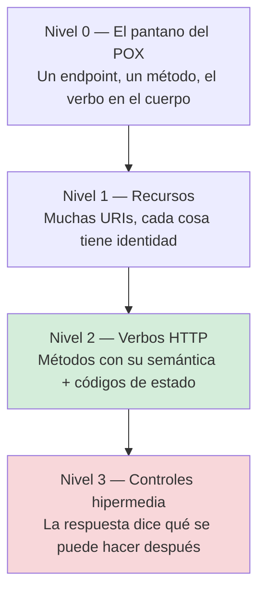

# Modelo de madurez de Richardson — `TEM-RMM`

## Resumen ejecutivo

El modelo de madurez de Richardson ordena en cuatro niveles el grado en que una API HTTP aprovecha los mecanismos de la Web. Lo desarrolló Leonard Richardson y lo difundió Martin Fowler en un artículo publicado el 18 de marzo de 2010 (`O-03`), que sigue siendo la referencia que se cita. Su utilidad no está en producir un veredicto sino en dar un vocabulario compartido para una conversación que sin él se vuelve circular: en lugar de discutir si una API «es REST», se localiza en qué nivel está y qué costaría subir uno.

La observación que ordena todo el documento es que **la industria se estacionó en el nivel 2 y lo hizo deliberadamente**. Las guías corporativas verificadas —Microsoft en `G-01` y `G-02`, Google en `G-04`, Zalando en `G-05`— prescriben APIs de nivel 2. La medición de `O-04` sitúa el cumplimiento de hipermedia en el 4,2 % de 500 APIs públicas. Y el propio Fowler señala en `O-03` que, según la definición de Fielding, el nivel 3 es precondición para llamar REST a algo. El resultado es una contradicción tácita entre la teoría canónica y la práctica universal, que esta guía prefiere nombrar antes que resolver por decreto.

Le sirve a `ACT-01` como criterio de nivel objetivo al fijar convenciones, a `ACT-04` como rúbrica rápida de caracterización en `ESC-4`, y a cualquiera que necesite explicarle a un equipo por qué subir del nivel 1 al 2 rinde mucho y del 2 al 3 casi nunca.

---

## Definición

### Qué es

Una escala de cuatro peldaños, acumulativa, sobre cuántos mecanismos del protocolo HTTP y de la arquitectura Web aprovecha una API. Cada nivel presupone el anterior. `O-03` la presenta como una progresión pedagógica —Fowler la usa para explicar los elementos de REST introduciéndolos de a uno— y no como un instrumento de auditoría.



### Los cuatro niveles

**Nivel 0 — el pantano del POX.** `O-03` lo describe como *«using HTTP as a transport system for remote interactions, but without using any of the mechanisms of the web»*. HTTP funciona como túnel: hay un único endpoint, todo va por `POST`, la operación se nombra dentro del cuerpo y el resultado —incluido el fallo— viaja en un `200`. Es el modelo de SOAP y de XML-RPC, y es también el resultado típico de una migración por fidelidad desde uno de ellos, que `MARCO-ESCENARIOS` identifica como la trampa característica de `ESC-2`.

**Nivel 1 — recursos.** Aparecen muchas URIs en lugar de una. Cada sala, cada reserva, cada sede tiene identidad propia y dirección propia. Es el paso que introduce la noción de recurso, que en `O-01` §5.1.5 es la primera de las cuatro restricciones de interfaz. Todavía se usa un solo método y los errores todavía pueden viajar en un `200`, pero el sistema dejó de ser un procedimiento y pasó a ser un conjunto de cosas direccionables.

**Nivel 2 — verbos HTTP.** Los métodos se usan según su propósito y los códigos de estado según su semántica. `O-03` lo enuncia como usar `GET` para operaciones seguras y `POST`/`PUT` para los cambios de estado, junto con los códigos apropiados. Lo que este nivel compra no es elegancia: es que **la infraestructura empieza a entender el tráfico**. Un `GET` es cacheable por cualquier intermediario según `N-01` §9.3.1 y `N-02`; un `PUT` o un `DELETE` son idempotentes según `N-01` §9.2.2 y por lo tanto reintentables sin riesgo; un `503` dispara la política de reintento del cliente y un `400` no. La ganancia es operativa y se cobra en producción.

**Nivel 3 — controles hipermedia.** La respuesta incluye enlaces que describen qué acciones están disponibles a continuación. Es la cuarta restricción de interfaz de `O-01`, y `TEM-HATEOAS` la desarrolla entera. Fowler observa en `O-03` que, según la definición de Fielding, este nivel no es un extra sino la condición para usar el nombre.

### Qué problema resuelve

**Ordena una discusión que sin él es irrespondible.** «¿Esto es REST?» admite dos respuestas ciertas y contradictorias según qué autoridad se invoque. «¿En qué nivel está?» admite una sola, verificable mirando peticiones.

**Hace visible el retorno decreciente.** El salto de 0 a 1 y de 1 a 2 compra cosas concretas y baratas. El salto de 2 a 3 compra una propiedad —desacoplar al cliente del espacio de URIs— cuyo valor depende por completo del contexto, y cuesta en cada respuesta, en cada cliente y en cada especificación. Que el modelo sea una escala hace fácil ver dónde está el escalón caro.

**Da un objetivo enunciable.** «Nivel 2 completo, con el link de paginación del nivel 3» es una convención que `ACT-01` puede escribir en una página y que `ACT-04` puede verificar. Es, además, exactamente lo que hacen las plataformas grandes.

### Qué NO es, y con qué se lo confunde

**No es una escala de calidad.** El nombre «madurez» sugiere que más es mejor y esa lectura es la que más daño hace. Una API de nivel 2 bien diseñada, con modelo de recursos coherente, códigos de estado correctos y errores estructurados, es mejor API que una de nivel 3 con recursos mal modelados y enlaces que nadie consume. El nivel mide qué mecanismos se usan, no si se usan bien.

**No es una norma.** `O-03` es un artículo de un autor identificable sobre una charla de otro. No es un RFC, no es una especificación y no obliga a nadie. Su lugar en la jerarquía de [`MARCO-CONVENCIONES`](../00-Marco-de-Referencia/Convenciones.md) es el de obra de referencia: origen verificable de un concepto, no fuente de autoridad.

**No es de Fielding.** El modelo no aparece en `O-01`. Es una lectura posterior, hecha por Richardson, de las restricciones de la disertación. Fowler la conecta con Fielding en `O-03` y esa conexión es la que produce la afirmación de que el nivel 3 es precondición del nombre.

**No es un plan de migración obligatorio.** Que los niveles sean acumulativos no significa que toda API deba recorrerlos. Casi ninguna llega al 3, y eso está medido.

**El año de la charla original de Richardson en QCon no está verificado.** `O-03` referencia la charla sin consignar el año, y esta guía no lo afirma. La fecha firme es la del artículo de Fowler: 2010-03-18.

---

## Dónde está la industria realmente

La evidencia disponible converge en un punto y conviene exhibirla junta.

**Lo que prescriben las guías.** Microsoft, Google y Zalando prescriben, cada una con su propio vocabulario y contradiciéndose en casi todo lo demás, APIs de nivel 2: recursos como sustantivos, colecciones, métodos HTTP con su semántica, códigos de estado. Ninguna de las tres exige controles hipermedia generales. Google en `G-04` AIP-122 va más lejos y prescribe lo contrario para la identificación: los recursos *must not* exponer self-links ni tuplas, sino un campo `name` con el nombre de recurso. `F-04` —JSON:API— es de las pocas especificaciones difundidas que empuja hipermedia, y lo hace de forma acotada, con un objeto `links` cuyas claves `first`, `last`, `prev` y `next` son obligatorias para paginación.

**Lo que se mide.** `O-04` analizó 500 APIs públicas que declaran ofrecer REST, partiendo del top 4000 de Alexa, y encontró un 4,2 % de cumplimiento de HATEOAS. El conjunto de datos es de alrededor de 2018; es la mejor evidencia cuantitativa disponible y no es actual. Esta guía la cita señalando ambas cosas.

**Lo que hacen las plataformas.** La parte de hipermedia que sobrevivió es el enlace de navegación entre páginas, y ahí la adopción es alta pero el transporte no converge: GitHub emite la cabecera `Link` de `N-10` (`P-06`), la guía de Azure prescribe un campo `nextLink` en el cuerpo (`G-01`), `F-04` usa un objeto `links`, y Stripe expone un campo `url` en su objeto de lista sin campo `next` explícito (`P-03`). Cuatro mecanismos para el mismo enlace.

| Nivel | Prescripción de las guías | Evidencia de adopción |
|---|---|---|
| 0 | Ninguna guía verificada lo prescribe | Sobrevive en sistemas heredados y en migraciones por fidelidad (`ESC-2`) |
| 1 | Presupuesto por todas | Universal en lo que se declara REST |
| 2 | `G-01`, `G-02`, `G-04`, `G-05`, `G-06` | Es el destino de facto del mercado |
| 3 | Solo parcialmente en `F-04`; `G-04` AIP-122 prescribe lo contrario | 4,2 % según `O-04`; alta solo en el enlace de paginación |

La conclusión que esta guía extrae, declarada como criterio propio: **el nivel 2 es el destino práctico de casi toda API, y el nivel 3 debe justificarse caso por caso en lugar de presuponerse deseable**. Prescribir hipermedia completa es prescribir algo que el 95,8 % del mercado decidió no hacer, con lo cual el equipo que lo adopta paga el costo del formato, el de los clientes que hay que escribir a mano porque el tooling no lo aprovecha, y el de la especificación que igual hay que publicar.

---

## Por qué el nivel 2 es el destino práctico

Tres razones, en orden de peso.

**Lo que compra el nivel 2 se cobra en infraestructura ajena.** Un `GET` cacheable lo cachea un CDN que nadie de tu equipo configuró para tu dominio. Un `PUT` idempotente lo reintenta un cliente HTTP con su política por defecto. Un `429` lo respeta una biblioteca de reintentos genérica. El valor del nivel 2 no depende de que nadie más lo entienda, porque los mecanismos ya están implementados en el camino entre el cliente y el servidor. Es la restricción de sistema por capas de `O-01` §5.1.6 rindiendo en la práctica.

**Lo que compra el nivel 3 requiere un cliente que lo aproveche.** Un enlace que el cliente ignora es peso muerto en cada respuesta. Y el cliente típico no lo aprovecha: deserializa la respuesta en un tipo generado desde OpenAPI (`N-19`), donde las operaciones disponibles ya están fijadas en tiempo de compilación. Para que hipermedia rinda hace falta un cliente que descubra en tiempo de ejecución, y ese cliente hay que escribirlo, porque la generación de código a partir de la especificación produce exactamente lo contrario.

**El mecanismo de evolución se repuso por otra vía.** Hipermedia desacoplaba al cliente del espacio de URIs para que el servidor pudiera reorganizarlo. Sin hipermedia, ese acoplamiento existe y se administra con versionado explícito, que es lo que hacen todas las plataformas verificadas: Stripe con fecha en cabecera (`P-01`), GitHub con `X-GitHub-Api-Version` (`P-05`), Shopify con fecha en la URL (`P-07`), Azure con `api-version` en query (`G-01`). El problema tiene solución conocida; hipermedia no es la única.

Un matiz que esta guía sostiene y que evita la lectura fácil: **entre el nivel 2 y el nivel 3 hay un escalón intermedio que sí conviene y que casi nadie nombra**. Consiste en emitir los enlaces donde reponen información que el cliente no puede construir —el cursor de la página siguiente, sobre todo— y no emitirlos donde solo reformulan lo que la documentación ya dice. Es lo que hacen GitHub, Azure, Stripe y `F-04`, cada uno a su manera, y es una posición coherente, no una implementación incompleta del nivel 3.

---

## Aplicación por escenario

### `ESC-1` — API nueva

El nivel se elige, y esta guía recomienda enunciarlo en el documento de convenciones antes de escribir el primer endpoint, porque el nivel 2 no se alcanza por acumulación de endpoints correctos: se pierde por acumulación de excepciones.

Alcanzar el nivel 2 en una API nueva es barato si se decide al principio y caro si se descubre después. Los dos puntos donde se pierde son conocidos. El primero, las operaciones que no encajan en CRUD: confirmar, cancelar, reprogramar. Resolverlas con `POST /reservas/8f3c/cancelar` es una decisión de diseño legítima que [`TEM-ACCIONES`](../20-Diseno-de-Recursos/Operaciones-No-CRUD.md) desarrolla; resolverlas con `POST /api` y un campo `accion` es volver al nivel 0 en la parte más interesante del dominio. El segundo, los códigos de estado: un endpoint que devuelve `200` con `{"exito": false}` porque el cliente pidió que fuera más fácil de consumir arrastra a toda la API al nivel 1.

Sobre el nivel 3, el criterio de esta guía en `ESC-1`: implementar el enlace de paginación desde el principio, porque cambiarlo después es rompiente, y postergar todo lo demás. `MARCO-ESCENARIOS` clasifica hipermedia entre las decisiones postergables sin penalización, y esta es la razón concreta.

### `ESC-2` — Exposición o migración

El nivel de partida está dado por lo que existe, y suele ser 0. La pregunta no es a qué nivel llegar sino cuánto del salto financia el proyecto.

Un sistema heredado con operaciones tipo `EjecutarOperacion` puede exponerse en nivel 1 con relativamente poco trabajo: identificar las entidades del dominio y darles URIs, aunque por debajo se sigan llamando los mismos procedimientos. El salto al nivel 2 es más caro porque exige mapear cada operación interna a una semántica de método y a un código de estado, y ahí aparecen las operaciones que no encajan y las que fallan de maneras que el sistema viejo nunca distinguió.

La trampa que `MARCO-ESCENARIOS` señala se lee bien en esta escala: migrar SOAP a REST conservando el patrón de operación en el cuerpo produce una API de nivel 0 con sintaxis HTTP, que perdió las herramientas de SOAP y no ganó ninguna de las propiedades del nivel 2. Si el resultado va a quedar en nivel 0, la migración no aporta y conviene decirlo antes de empezar.

### `ESC-3` — Evolución en producción

Subir de nivel es un cambio rompiente casi siempre, y esa es la observación central del escenario.

Cambiar `POST /obtenerReserva` por `GET /reservas/{id}` rompe a todos los consumidores. Cambiar un `200` con error adentro por un `409` rompe a los clientes que ramifican sobre el cuerpo. Ninguno de los dos se puede hacer en silencio, y ambos entran en la maquinaria de [`TEM-BREAK`](../50-Evolucion-y-Versionado/Compatibilidad-y-Cambios-Rompientes.md) y [`TEM-VERS`](../50-Evolucion-y-Versionado/Estrategias-de-Versionado.md).

La estrategia que esta guía recomienda es no subir de nivel la API existente sino fijar el nivel objetivo para lo nuevo y dejar que la superficie converja con el tiempo. Una API mixta —endpoints viejos en nivel 1, endpoints nuevos en nivel 2— es fea y es honesta; una migración global de nivel es un proyecto de reescritura disfrazado de mejora incremental. Lo que sí conviene documentar es cuál endpoint está en qué nivel, porque de lo contrario `ACT-03` no puede saber si el `200` que recibió significa éxito.

### `ESC-4` — Evaluación de una API ajena

Es el escenario donde el modelo rinde más, y la razón es su velocidad: ubicar una API en la escala lleva minutos y orienta todo lo demás.

En `ESC-4a` la ubicación se verifica contra el código o la especificación. Un documento OpenAPI (`N-19`) con un solo path y un solo `post` es nivel 0 sin ambigüedad. Uno con muchos paths pero donde todas las operaciones son `post` es nivel 1. Uno donde los métodos se reparten y las respuestas declaran códigos distintos por caso de fallo es nivel 2, y ahí conviene contrastar con lo que el código emite, porque la divergencia entre especificación e implementación es el hallazgo más frecuente del escenario.

En `ESC-4b` la ubicación es inferencia y así debe registrarse. Tres observaciones bastan para una hipótesis razonable: cuántas URIs distintas aparecen, qué métodos acepta cada una —probar `GET` sobre algo que la documentación solo describe con `POST` es informativo—, y qué código devuelve un caso de error conocido. Una API que responde `200` a una petición manifiestamente inválida está en nivel 1 aunque sus URIs sean impecables.

El criterio que esta guía recomienda para el informe: registrar el nivel observado por endpoint y no por API. Las APIs reales son heterogéneas, y un promedio esconde justamente lo que interesa, que es dónde están las excepciones.

### Qué cambia según el contexto

| Contexto | Nivel objetivo | Justificación |
|---|---|---|
| `CTX-1` pública | Nivel 2 completo, sin excepciones, más enlace de paginación | El consumidor desconocido no puede preguntar; toda inconsistencia se paga en soporte |
| `CTX-2` interna | Nivel 2, con tolerancia acotada donde el costo supere el beneficio | El consumidor coordinable absorbe la excepción, pero la rotación de equipo la vuelve deuda |
| `CTX-3` app propia | Nivel 2 en la semántica de método y estado; agregación por pantalla aceptada | El *Backend for Frontend* tensiona el modelo de recursos, no la semántica HTTP |
| `CTX-4` integración | No aplica como objetivo: el nivel es un dato del proveedor | Rinde como insumo de evaluación y como criterio de diseño de la capa de aislamiento |

`CTX-4` merece la aclaración porque es la única entrada donde el modelo cambia de función. Consumir una API de nivel 0 es perfectamente posible; lo que importa es que el aislamiento no propague su forma hacia adentro. Cuando el proveedor devuelve `200` con `{"error": ...}`, la capa de traducción convierte eso en la excepción o el resultado que el dominio propio entiende, y el resto del sistema no se entera. `MARCO-CONTEXTOS` señala el riesgo dominante del contexto —que el modelo del proveedor se filtre— y este es uno de sus vectores.

---

## Ejemplos concretos

Ejemplos **sintéticos** del dominio de reserva de salas. La misma operación —consultar las reservas de una sala, y cancelar una— recorre los cuatro niveles.

### Nivel 0

```http
POST /api/servicio HTTP/1.1
Host: api.salas.ejemplo
Content-Type: application/json

{ "operacion": "listarReservasDeSala", "salaId": "a3f1", "desde": "2026-08-01" }
```

```http
HTTP/1.1 200 OK
Content-Type: application/json

{ "exito": true, "reservas": [ { "id": "8f3c1e", "desde": "2026-08-03T14:00:00Z" } ] }
```

```http
POST /api/servicio HTTP/1.1
Host: api.salas.ejemplo
Content-Type: application/json

{ "operacion": "cancelarReserva", "reservaId": "8f3c1e" }
```

```http
HTTP/1.1 200 OK
Content-Type: application/json

{ "exito": false, "codigoError": "FUERA_DE_PLAZO" }
```

Una sola URI, un solo método, el fallo indistinguible del éxito para cualquier observador que no parsee el cuerpo. Ningún intermediario puede cachear la consulta ni distinguir la lectura de la escritura.

### Nivel 1

```http
POST /salas/a3f1/reservas/consultar HTTP/1.1
Host: api.salas.ejemplo
Content-Type: application/json

{ "desde": "2026-08-01" }
```

```http
POST /reservas/8f3c1e/cancelar HTTP/1.1
Host: api.salas.ejemplo
```

```http
HTTP/1.1 200 OK
Content-Type: application/json

{ "exito": false, "codigoError": "FUERA_DE_PLAZO" }
```

Las cosas tienen identidad: la sala `a3f1` y la reserva `8f3c1e` son direccionables. Sigue habiendo un solo método y el fallo sigue viajando en un `200`. Es el nivel donde queda una migración que resolvió el modelado de recursos y no la semántica de protocolo, y es un estado intermedio frecuente en `ESC-2`.

### Nivel 2

```http
GET /salas/a3f1/reservas?desde=2026-08-01&limite=20 HTTP/1.1
Host: api.salas.ejemplo
Accept: application/json
```

```http
HTTP/1.1 200 OK
Content-Type: application/json
Cache-Control: private, max-age=30
ETag: "col-a3f1-9d2"

{
  "datos": [
    { "id": "8f3c1e", "salaId": "a3f1", "estado": "confirmada",
      "desde": "2026-08-03T14:00:00Z", "hasta": "2026-08-03T15:00:00Z" }
  ]
}
```

La cancelación, con el fallo expresado como estado y como cuerpo estructurado según `N-04`:

```http
POST /reservas/8f3c1e/cancelaciones HTTP/1.1
Host: api.salas.ejemplo
Content-Type: application/json

{ "motivo": "cambio-de-agenda" }
```

```http
HTTP/1.1 409 Conflict
Content-Type: application/problem+json

{
  "type": "https://api.salas.ejemplo/problemas/cancelacion-fuera-de-plazo",
  "title": "La reserva ya no admite cancelación",
  "status": 409,
  "detail": "La política de la sede exige cancelar con 24 horas de antelación; faltan 3 horas.",
  "horasRestantes": 3
}
```

El `GET` es seguro y cacheable (`N-01` §9.3.1). El `409` clasifica el fallo en la categoría que `N-01` §15.5.10 define, y el campo de extensión `horasRestantes` está habilitado por `N-04` §3.2. Un cliente genérico ya sabe que no debe reintentar; un cliente del dominio puede mostrar el faltante exacto.

La elección de modelar la cancelación como una subcolección `/cancelaciones` en lugar de `POST /reservas/8f3c1e/cancelar` es una decisión de diseño de recursos, no de nivel: ambas formas son nivel 2. Se discute en [`TEM-ACCIONES`](../20-Diseno-de-Recursos/Operaciones-No-CRUD.md).

### Nivel 3

```http
GET /reservas/8f3c1e HTTP/1.1
Host: api.salas.ejemplo
Accept: application/json
```

```http
HTTP/1.1 200 OK
Content-Type: application/json
Link: </reservas/8f3c1e>; rel="self"

{
  "id": "8f3c1e",
  "estado": "confirmada",
  "desde": "2026-08-03T14:00:00Z",
  "enlaces": [
    { "rel": "self",     "href": "/reservas/8f3c1e" },
    { "rel": "cancelar", "href": "/reservas/8f3c1e/cancelaciones", "metodo": "POST" },
    { "rel": "sala",     "href": "/salas/a3f1" }
  ]
}
```

Cuando la reserva ya no admite cancelación, la relación `cancelar` desaparece de la respuesta y el cliente deja de ofrecer el botón sin conocer la regla de las veinticuatro horas. Esa es la promesa concreta del nivel 3, y también donde se ve su costo: el cliente tiene que estar escrito para consultar `enlaces` en lugar de para llamar a un método generado. Los formatos que estandarizan esta estructura —y por qué ninguno se impuso— se tratan en [`TEM-HATEOAS`](Hipermedia.md).

Las relaciones `self`, `next`, `prev` y `related` están en el registro `N-11`; `cancelar` y `sala` no lo están y son de extensión propia. La estructura `enlaces` de este ejemplo es sintética y no corresponde a ninguna especificación.

### Detección del nivel, en C#

Ejemplo sintético de una prueba de caracterización para `ESC-4b`: verifica una propiedad del nivel 2 —que la API distinga el fallo mediante el código de estado— sin conocer nada del dominio.

```csharp
[Theory]
[InlineData("/reservas/no-existe-8f3c")]
[InlineData("/salas/no-existe-a3f1")]
public async Task RecursoInexistente_NoDevuelve200(string ruta)
{
    var respuesta = await _cliente.GetAsync(ruta);

    // Nivel 2 exige que la clase del fallo viaje en el estado, no solo en el cuerpo.
    Assert.NotEqual(HttpStatusCode.OK, respuesta.StatusCode);
    Assert.Equal(HttpStatusCode.NotFound, respuesta.StatusCode);
}
```

Una batería de comprobaciones de esta forma —métodos no documentados, entradas inválidas, recursos inexistentes— produce la ubicación en la escala más rápido que leer la documentación, y produce evidencia en lugar de inferencia. El límite ético que `MARCO-ESCENARIOS` enuncia para `ESC-4b` aplica: sondear una API ajena solo es legítimo con autorización y dentro de los términos de servicio.

---

## Preguntas guía

- ¿En qué nivel está cada endpoint de mi API, y sé cuáles son las excepciones?
- ¿Qué me costaría subir del nivel actual al siguiente, y qué propiedad concreta compraría?
- ¿Estoy en nivel 1 porque lo decidí o porque nadie miró los códigos de estado?
- Si tengo enlaces en las respuestas, ¿algún cliente los consume, o los emito porque un artículo dijo que había que hacerlo?
- ¿Hay algún endpoint que devuelva `200` con un fallo adentro? ¿Cuántos consumidores dependen ya de eso?
- En `ESC-4`, ¿el nivel que anoté lo verifiqué con peticiones o lo inferí de la documentación?
- ¿Mi documento de convenciones enuncia un nivel objetivo, o lo deja a criterio de cada endpoint?

---

## Criterios de calidad

### Aplicación buena

El nivel objetivo está enunciado en el documento de convenciones y las excepciones están registradas con su motivo. La uniformidad importa más que el nivel: una API íntegramente de nivel 2 es más fácil de consumir que una que oscila entre 1 y 3 según quién escribió cada endpoint, porque `ACT-03` puede escribir un solo manejo de errores en lugar de uno por endpoint.

Cuando se emiten enlaces, se emiten donde reponen información que el cliente no puede construir. El cursor de la página siguiente es el caso paradigmático y está sostenido por la práctica de `P-06`, `P-03` y `G-01`.

El nivel se verifica automáticamente donde se puede. Un *linter* de OpenAPI en la integración continua detecta el endpoint que declara `200` como única respuesta posible, que es el síntoma más habitual de regresión al nivel 1. `MARCO-ACTORES` señala que esa es la forma efectiva de que `ACT-01` ejerza su autoridad sin volverse cuello de botella.

### Aplicación pobre y antipatrones

**El nivel como puntaje.** Presentar el nivel 3 como meta de calidad e inducir a un equipo a implementar hipermedia sin ningún cliente que la consuma. Produce respuestas más pesadas, especificaciones más largas y cero beneficio. Es prescribir lo que el 95,8 % del mercado decidió no hacer, con argumento de autoridad prestado.

**Nivel 1 con estética de nivel 2.** URIs impecables, plural en las colecciones, *kebab-case* impecable, y todo por `POST` devolviendo `200`. Es el caso más frecuente y el más difícil de detectar en una revisión que mire la lógica y no el contrato; `MARCO-ACTORES` lo señala como el modo característico en que `ACT-02` erosiona las convenciones sin que se note.

**`200` con error en el cuerpo.** La evidencia de las plataformas verificadas es unánime en contra para APIs de recurso único: Stripe define `200 OK` como *«Everything worked as expected»* y usa 4xx/5xx para todo fallo (`P-04`), y `G-01` exige una cabecera `x-ms-error-code` que presupone un estado de error. El matiz honesto es que el patrón sí tiene sentido en protocolos con lotes, donde una petición contiene varias operaciones que pueden fallar por separado —es el caso de GraphQL—, y ahí no es un antipatrón sino una consecuencia del diseño. En REST de recurso único, no hay tal justificación.

**Verbos en la URI.** `/obtenerReservas`, `/cancelarReserva`, `/crearSala`. La URI identifica un recurso; el verbo va en el método. La excepción legítima son las operaciones que no encajan en CRUD, y la forma de resolverlas está en [`TEM-ACCIONES`](../20-Diseno-de-Recursos/Operaciones-No-CRUD.md), no en volver al nivel 0.

**Enlaces decorativos.** Emitir un `self` en cada respuesta y llamar a eso HATEOAS. Un enlace que solo repite la URI que el cliente acaba de usar no aporta nada y no acerca al nivel 3, que exige que los enlaces disponibles varíen con el estado del recurso.

**Discutir el nivel en lugar del problema.** «Esto es nivel 2 y debería ser 3» no es un hallazgo. «Cuando la reserva pasa a no cancelable, el cliente no tiene forma de saberlo sin replicar la regla de las veinticuatro horas» sí lo es, y de ahí puede salir la decisión de emitir un enlace condicional o la de exponer un campo `puedeCancelarse`, que resuelve lo mismo sin hipermedia.

---

## Anexo — Ficha de ubicación en la escala

Se completa por endpoint, no por API. En `ESC-1` a `ESC-3` es una decisión; en `ESC-4` es una observación y la columna de evidencia pasa a ser obligatoria.

```yaml
api: ""
fecha: AAAA-MM-DD
modo: decision | observacion
nivel_objetivo: 0 | 1 | 2 | 3        # el que fija el documento de convenciones

endpoints:
  - ruta: "GET /salas/{id}/reservas"
    nivel: 2
    metodo_acorde_a_semantica: si | no
    codigos_de_estado_por_caso: si | no | parcial
    errores_estructurados: si | no    # N-04 u otro formato declarado
    enlaces_emitidos: []              # rel emitidos, si hay
    excepcion_registrada: ""          # motivo, si el nivel es menor al objetivo
    evidencia: ""                     # obligatorio en ESC-4: petición que lo demuestra

resumen:
  endpoints_en_nivel_0: 0
  endpoints_en_nivel_1: 0
  endpoints_en_nivel_2: 0
  endpoints_en_nivel_3: 0
  devuelven_200_con_error: []         # el hallazgo más accionable de la ficha
  verbos_en_uri: []
inferencias_no_verificadas: []        # ESC-4b: lo que se supuso sin comprobar
```

Los dos campos que más rinden son `devuelven_200_con_error` y `verbos_en_uri`. Ambos son mecánicos de detectar, ambos son rompientes de corregir una vez que hay consumidores, y ambos indican con precisión dónde una API perdió el nivel que su documentación dice tener.
