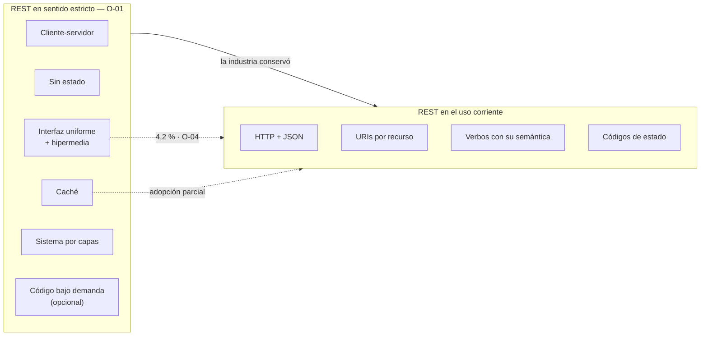

# Qué es REST — `TEM-REST`

## Resumen ejecutivo

REST es un estilo arquitectónico que Roy Fielding definió en el capítulo 5 de su disertación doctoral de 2000 (`O-01`) como un conjunto de restricciones aplicadas sobre el diseño de un sistema distribuido. Cada restricción renuncia a algo —libertad de diseño, casi siempre— para obtener a cambio una propiedad concreta: escalabilidad, visibilidad para los intermediarios, capacidad de evolucionar sin coordinación. La disertación no describe una tecnología ni prescribe un formato de URI; describe por qué la Web funciona a la escala a la que funciona.

Lo que la industria llama REST es otra cosa, y esa distancia es el asunto central de este documento. En el uso corriente, «API REST» designa cualquier API HTTP con recursos identificados por URI, verbos con su semántica habitual y representaciones JSON. Bajo la definición de `O-01`, eso satisface algunas restricciones e ignora la que Fielding considera definitoria. La medición de `O-04` cuantifica la brecha: de 500 APIs públicas analizadas, el 4,2 % cumple hipermedia.

El documento le sirve a `ACT-01`, que necesita saber qué está invocando cuando dice «esto no es RESTful» en una revisión de diseño, y a `ACT-04`, que en `ESC-4` tiene que juzgar una API ajena con criterios defendibles en lugar de con folklore. Le sirve también a cualquiera que haya perdido una tarde discutiendo si un endpoint es REST: la mayoría de esas discusiones se disuelven en cuanto se nombra qué autoridad invoca cada parte.

---

## Definición

### Qué es

Un **estilo arquitectónico**: un conjunto de restricciones coordinadas sobre los elementos de una arquitectura y las relaciones permitidas entre ellos. Fielding lo construye de forma incremental en `O-01` §5.1, partiendo de lo que llama el *Null Style* —un sistema sin ninguna restricción, donde todo está permitido y por lo tanto nada está garantizado— y agregando restricciones una por una. Cada una recorta el espacio de diseños posibles y, a cambio, hace que el sistema resultante tenga propiedades que antes no podía tener.

Las secciones de la disertación son seis, verificadas contra el texto:

| § | Restricción | Qué prohíbe | Qué compra |
|---|---|---|---|
| 5.1.2 | Cliente-servidor | Que la interfaz de usuario y el almacenamiento de datos vivan en el mismo componente | Que cliente y servidor evolucionen y escalen por separado |
| 5.1.3 | Sin estado (*stateless*) | Que el servidor guarde contexto de sesión entre peticiones | Visibilidad, fiabilidad ante fallos, escalado horizontal sin afinidad |
| 5.1.4 | Caché | Respuestas cuya condición de almacenamiento sea ambigua | Eliminar interacciones completas; latencia y carga menores |
| 5.1.5 | Interfaz uniforme | Interfaces a medida por componente | Independencia entre partes desarrolladas por separado |
| 5.1.6 | Sistema por capas | Que un componente vea más allá de la capa con la que habla | Intermediarios: balanceadores, cachés compartidas, pasarelas |
| 5.1.7 | Código bajo demanda | — | Extender al cliente en tiempo de ejecución |

La sexta es **explícitamente opcional** en la disertación, que la califica de *only an optional constraint within REST*. La fórmula correcta es «cinco restricciones más una opcional»; «seis restricciones obligatorias», que circula ampliamente, es incorrecta. Es la clase de imprecisión que este documento trata de no cometer, porque quien la comete pierde el derecho a corregir las demás.

### La interfaz uniforme, por dentro

La restricción de §5.1.5 es la que Fielding señala como distintiva de REST frente a otros estilos de red, y la única que la disertación descompone. Cita verbatim:

> «REST is defined by four interface constraints: identification of resources; manipulation of resources through representations; self-descriptive messages; and, hypermedia as the engine of application state.»

**Identificación de recursos.** Todo lo que se puede nombrar es un recurso y tiene un identificador. En HTTP, una URI (`N-08`). El recurso es la abstracción conceptual —«la reserva 8f3c»—, no los bytes que se devuelven al pedirla. Se desarrolla en [`TEM-RECURSOS`](../20-Diseno-de-Recursos/Modelado-de-Recursos.md).

**Manipulación a través de representaciones.** El cliente nunca toca el recurso: intercambia representaciones de su estado. La misma reserva puede representarse como JSON, como XML o como una página HTML, y las tres son representaciones del mismo recurso. De ahí que la negociación de contenido de `N-01` §12 no sea un accesorio sino una consecuencia directa de la restricción.

**Mensajes autodescriptivos.** Cada mensaje trae lo necesario para procesarlo: el método dice qué se pretende, el media type dice cómo interpretar el cuerpo, las directivas de caché dicen si puede almacenarse. Es lo que permite que un proxy que no sabe nada del dominio de reservas de salas decida correctamente si puede cachear una respuesta.

**Hipermedia como motor del estado de la aplicación.** El estado en el que se encuentra el cliente avanza siguiendo enlaces que el servidor le ofrece, no invocando URIs que el cliente construyó a partir de documentación. Es la restricción menos implementada y la que `TEM-HATEOAS` desarrolla.

Una precisión de vocabulario que la guía sostiene de forma literal: la disertación dice *hypermedia as the engine of application state*. La variante con *hypertext*, de donde sale la sigla HATEOAS, aparece en otros textos de Fielding y no está verificada contra `O-01` en esta guía.

### Qué problema resuelve

**La escala de la Web.** No la de una API interna con diez consumidores: la de un sistema con millones de agentes independientes, desplegados sin coordinación, que interoperan durante décadas. Las restricciones de `O-01` están elegidas para esa escala. Cuando `ACT-01` decide que la restricción de estado no le rinde en su API interna de cuatro servicios, no está siendo negligente: está observando correctamente que el problema que la restricción resuelve no es el suyo.

**La independencia entre partes.** La interfaz uniforme existe para que un componente escrito por un equipo y otro escrito por otro equipo, sin haberse hablado nunca, interoperen. El costo está declarado en la propia disertación: una interfaz uniforme degrada la eficiencia, porque la información se transfiere en un formato estandarizado en lugar de uno óptimo para la necesidad concreta. Fielding acepta ese costo a cambio de la independencia; quien diseña un backend para una única aplicación propia (`CTX-3`) tiene derecho a evaluar el intercambio de nuevo.

**La evolución sin coordinación.** Es el propósito que menos se reconoce. En `O-02`, Fielding reclama que los servidores conserven la libertad de controlar su propio espacio de nombres y de instruir a los clientes sobre cómo construir las URIs apropiadas. Un cliente que descubre a dónde ir no se rompe cuando el servidor reorganiza sus rutas; un cliente que tiene las rutas compiladas adentro, sí. Todo el aparato de versionado de [`FAM-EVO`](../50-Evolucion-y-Versionado/README.md) es la respuesta a un problema que hipermedia pretendía evitar.

### Qué NO es, y con qué se lo confunde

**No es HTTP.** REST es un estilo arquitectónico; HTTP es un protocolo que lo instancia y que el propio Fielding coeditó. Se puede usar HTTP violando todas las restricciones —un único `POST /api` con un campo `operacion` en el cuerpo es HTTP y no es REST— y se puede razonar sobre REST sin mencionar HTTP. La confusión importa porque produce el reflejo de discutir estilo cuando lo que está en juego es semántica de protocolo, que es normativa y está en `N-01`.

**No es «URLs bonitas con JSON».** Es la acepción corriente y este documento la reconoce como tal; lo que no es aceptable es presentarla como la definición de `O-01`.

**No es CRUD sobre tablas.** La correspondencia entre `POST`/`GET`/`PUT`/`DELETE` y crear/leer/actualizar/borrar es una coincidencia útil, no una definición. Nada en `O-01` dice que un recurso deba corresponder a una fila, y las operaciones que no encajan en CRUD —confirmar una reserva, cancelarla con penalidad— son el caso normal y no la excepción. Se tratan en [`TEM-ACCIONES`](../20-Diseno-de-Recursos/Operaciones-No-CRUD.md).

**No es una especificación y no impone reglas de nomenclatura.** `O-01` es una disertación doctoral, no un documento normativo del IETF. No dice que las colecciones vayan en plural, ni que las rutas vayan en minúsculas, ni dónde debe ir la versión. Cada una de esas prescripciones proviene de una guía de organización —Google en `G-04` AIP-122 exige plural, Zalando en `G-05` regla 129 exige *kebab-case*— y esas guías se contradicen entre sí. Atribuirlas a REST es el error de citación más frecuente del tema.

**No es un veredicto binario.** «Esto no es RESTful» rara vez es una crítica accionable. La pregunta útil es cuál restricción se está violando y qué propiedad se pierde con eso. Un endpoint que guarda estado de sesión en el servidor viola §5.1.3 y a cambio pierde la posibilidad de escalar sin afinidad de sesión; enunciado así, se puede decidir si el intercambio conviene.

---

## La brecha entre REST-según-Fielding y REST-como-se-usa

Ocho años después de la disertación, y ante el uso ya establecido del término, Fielding publicó `O-02` con una formulación deliberadamente tajante:

> «if the engine of application state … is not being driven by hypertext, then it cannot be a REST API. Period.»

La entrada completa se titula *«REST APIs must be hypertext-driven»* y su argumento se apoya en el mismo principio de evolución: los servidores deben conservar la libertad de controlar su propio espacio de nombres, y para eso tienen que poder instruir al cliente sobre cómo construir las URIs en lugar de que el cliente las conozca de antemano.

Dos advertencias sobre cómo se cita ese texto. La primera: la frase pertenece a `O-02`, no a `O-01`; atribuirla a la disertación es incorrecto y sucede constantemente. La segunda, más consecuente: **en `O-02` Fielding no discute el versionado en URI**. La objeción habitual al `/v1/` es una derivación razonable de su principio de que el cliente no debe construir URIs, no una condena textual, y presentarla como cita directa es poner palabras en su boca. Esta guía la trata como derivación y lo declara cada vez que aparece, en particular en [`TEM-VERS`](../50-Evolucion-y-Versionado/Estrategias-de-Versionado.md).

Enfrentado a ese criterio, el estado del mercado está medido. `O-04` —Neumann, Laranjeiro y Bernardino, IEEE Transactions on Services Computing— partió del top 4000 de Alexa, aisló 500 sitios que declaran ofrecer una API REST y los analizó por cumplimiento de principios. **El 4,2 % cumple HATEOAS.** El conjunto de datos es de alrededor de 2018 y no es actual; es la mejor evidencia cuantitativa disponible y la guía la usa señalando ambas cosas.



La lectura honesta de esa brecha no es que la industria se equivocó. Es que **la industria adoptó las restricciones que le rendían en su escala y descartó la que solo rinde a escala de Web abierta**, reemplazándola por especificaciones fuera de banda —OpenAPI (`N-19`)— y versionado explícito. Esta guía sostiene que ese intercambio es defendible en la mayoría de los contextos y que el problema no es haberlo hecho sino no haberlo declarado: se sigue enseñando REST citando a Fielding mientras se construye algo que él nombró como no-REST.

---

## Aplicación por escenario

### `ESC-1` — API nueva

Es donde las restricciones se pueden respetar sin pagar reconversión, y por eso conviene decidirlas explícitamente en lugar de heredarlas por defecto del framework.

Tres decisiones concretas se toman acá y son caras después. **El estado (§5.1.3)**: si la autenticación va por token autocontenido (`N-17`) o por sesión de servidor. La segunda opción no es ilegítima, pero acopla el escalado a la afinidad de sesión y esa consecuencia debe estar sobre la mesa antes de la primera línea de código. **La cacheabilidad (§5.1.4)**: qué respuestas van a llevar `ETag` y `Cache-Control`. Se puede postergar sin penalización mayor, a diferencia de las otras dos. **La identificación de recursos (§5.1.5)**: el modelo de recursos y su nomenclatura, que es la decisión más cara de revertir de toda la API.

La trampa que `MARCO-ESCENARIOS` señala para `ESC-1` —sobrediseñar— tiene en este tema su ejemplo más costoso: implementar hipermedia completa en una API nueva de `CTX-3` resuelve un problema de acoplamiento que esa API no tiene, y agrega a cada respuesta una estructura que el único cliente va a ignorar.

### `ESC-2` — Exposición o migración

El estilo arquitectónico previo condiciona lo que se puede lograr, y conviene nombrar el condicionamiento en lugar de sufrirlo.

Exponer un sistema con estado conversacional —un ERP heredado donde las operaciones dependen de una sesión abierta— contra una API sin estado obliga a una de dos cosas: mantener el mapeo de sesión en una capa de traducción, o rediseñar la operación para que sea autocontenida. La primera es más barata y arrastra el problema; la segunda es el trabajo real. Que la decisión se tome explícitamente es lo que distingue una migración de un envoltorio.

En la variante de migración desde SOAP, la restricción de interfaz uniforme es exactamente lo que se está comprando. Reproducir el contrato viejo con `POST /api/EjecutarOperacion` y un campo `operacion` en el cuerpo mantiene la interfaz a medida, pierde las herramientas de SOAP y no gana nada de HTTP: ni caché, ni intermediarios, ni semántica de método. `MARCO-ESCENARIOS` lo señala como la trampa característica del escenario, y la razón por la que es trampa se lee mejor desde las restricciones.

### `ESC-3` — Evolución en producción

Acá se paga la factura de no haber implementado hipermedia, y es la conexión más importante de este documento con el resto de la guía. Un cliente que construye sus URIs a partir de documentación tiene esas URIs congeladas; reorganizar el espacio de nombres es rompiente. La libertad que `O-02` reclama para el servidor no existe, y su reposición se llama versionado.

La restricción de mensajes autodescriptivos, en cambio, sí rinde en este escenario y suele estar disponible: agregar un campo a una representación es compatible **si y solo si** los consumidores ignoran lo que no reconocen. Esa es la condición que `N-14` discute bajo la crítica al principio de robustez, y que [`TEM-BREAK`](../50-Evolucion-y-Versionado/Compatibilidad-y-Cambios-Rompientes.md) desarrolla.

### `ESC-4` — Evaluación de una API ajena

Las restricciones funcionan bien como rúbrica de evaluación, y mejor que cualquier lista de reglas de nomenclatura, porque preguntan por propiedades observables.

En `ESC-4a`, con acceso al código, se verifica lo que desde afuera solo se infiere: si hay estado de sesión del lado servidor, si las respuestas declaran su cacheabilidad, si el modelo de recursos existe como abstracción o si los endpoints son procedimientos con nombre de sustantivo.

En `ESC-4b` la observación es indirecta y conviene registrarla como hipótesis. Una cookie de sesión sugiere estado; la ausencia de `ETag` y `Cache-Control` sugiere que la restricción de caché no se ejerció; una URI con un verbo adentro sugiere que el modelo es de procedimientos. Ninguna de las tres es prueba, y `MARCO-ESCENARIOS` insiste con razón en distinguir observación de inferencia en el informe.

Un criterio que esta guía recomienda para ambos casos: **no puntuar el cumplimiento de restricciones como si fuera una nota**. Una API sin hipermedia no es peor por eso; el 95,8 % del mercado tomó esa decisión. Lo que sí es un hallazgo es una API que declara ser REST en su documentación y viola la semántica de `N-01` —`GET` con efectos, `200` con un error adentro—, porque ahí la promesa y la conducta divergen.

### Qué cambia según el contexto

| Contexto | Restricción que más rinde | Restricción que menos rinde | Nota |
|---|---|---|---|
| `CTX-1` pública | Interfaz uniforme y sin estado | Código bajo demanda | El consumidor desconocido es exactamente el caso para el que se diseñó la interfaz uniforme |
| `CTX-2` interna | Sin estado, por escalado y resiliencia | Hipermedia | Consumidor coordinable: el acoplamiento a URIs se resuelve desplegando los dos lados |
| `CTX-3` app propia | Caché, con impacto directo en la percepción de velocidad | Interfaz uniforme, cuando el cliente es uno solo | Es donde el patrón *Backend for Frontend* tensiona la uniformidad de forma legítima |
| `CTX-4` integración | Sistema por capas, que habilita interponer el aislamiento | Todas: el contrato es un dato | No se diseña; se traduce |

El caso de `CTX-3` merece la nota que `MARCO-CONTEXTOS` ya adelanta. Blazor en render *interactive server* ejecuta el componente en el servidor, de modo que su consumo de una API interna es una llamada servidor a servidor y se comporta como `CTX-2`. Cambia dónde viven las credenciales y qué latencia se paga, y por lo tanto cambia el peso relativo de la restricción de caché.

---

## Ejemplos concretos

Todos los ejemplos son **sintéticos** y pertenecen al dominio de reserva de salas.

### La restricción de estado, en dos versiones

Una API con estado conversacional del lado servidor. La segunda petición solo tiene sentido si el servidor recuerda la primera:

```http
POST /sesiones-de-reserva HTTP/1.1
Host: api.salas.ejemplo
Content-Type: application/json

{ "salaId": "a3f1" }
```

```http
HTTP/1.1 200 OK
Set-Cookie: reserva-en-curso=7d21ac; Path=/

{ "paso": 1, "siguiente": "elegir-horario" }
```

```http
POST /sesiones-de-reserva/paso-2 HTTP/1.1
Host: api.salas.ejemplo
Cookie: reserva-en-curso=7d21ac
Content-Type: application/json

{ "desde": "2026-08-03T14:00:00Z", "hasta": "2026-08-03T15:00:00Z" }
```

El servidor guarda a qué sala corresponde `7d21ac`. Consecuencias verificables: la petición no se entiende en aislamiento, un intermediario no puede razonar sobre ella, y cualquier nodo que la reciba necesita acceso al estado de esa sesión.

La versión autocontenida, que satisface §5.1.3:

```http
POST /reservas HTTP/1.1
Host: api.salas.ejemplo
Authorization: Bearer eyJhbGciOi...
Content-Type: application/json

{
  "salaId": "a3f1",
  "desde": "2026-08-03T14:00:00Z",
  "hasta": "2026-08-03T15:00:00Z",
  "solicitanteId": "u-4410"
}
```

```http
HTTP/1.1 201 Created
Location: /reservas/8f3c1e
Content-Type: application/json
ETag: "v1-8f3c1e"

{
  "id": "8f3c1e",
  "salaId": "a3f1",
  "estado": "confirmada",
  "desde": "2026-08-03T14:00:00Z",
  "hasta": "2026-08-03T15:00:00Z"
}
```

La petición lleva todo lo necesario, incluida la identidad del llamador en un token autocontenido. Cualquier nodo del clúster la atiende. El `ETag` habilita las peticiones condicionales de `N-01` §8.8 y con eso la restricción de caché y el control de concurrencia optimista, que desarrolla [`TEM-IDEM`](../30-Semantica-HTTP/Idempotencia-y-Concurrencia.md).

### Interfaz uniforme frente a interfaz a medida

Interfaz a medida —un procedimiento remoto sobre HTTP, nivel 0 de `O-03`:

```http
POST /api/servicio HTTP/1.1
Host: api.salas.ejemplo
Content-Type: application/json

{ "operacion": "obtenerReservasDeSala", "salaId": "a3f1", "desde": "2026-08-01" }
```

```http
HTTP/1.1 200 OK
Content-Type: application/json

{ "exito": false, "codigoError": "SALA_INEXISTENTE" }
```

Nada de ese intercambio es visible para un intermediario. El método no dice qué se pretende, la URI no identifica lo consultado, y el `200` afirma que todo salió bien mientras el cuerpo dice lo contrario, con lo que la observabilidad y los reintentos automáticos quedan ciegos.

La misma consulta con interfaz uniforme:

```http
GET /salas/a3f1/reservas?desde=2026-08-01&limite=20 HTTP/1.1
Host: api.salas.ejemplo
Accept: application/json
```

```http
HTTP/1.1 404 Not Found
Content-Type: application/problem+json

{
  "type": "https://api.salas.ejemplo/problemas/sala-inexistente",
  "title": "La sala indicada no existe",
  "status": 404,
  "detail": "No hay ninguna sala con identificador a3f1 en la sede consultada."
}
```

El método declara una operación segura y cacheable (`N-01` §9.3.1), la URI identifica el recurso, el estado clasifica el fallo y el media type `application/problem+json` de `N-04` dice cómo interpretar el cuerpo. El mensaje es autodescriptivo en el sentido de §5.1.5.

### Cacheabilidad declarada, en C#

Ejemplo sintético con Minimal APIs. La forma concreta se trata en [`TEM-MINIMAL`](../80-Implementacion-en-NET/Minimal-APIs-y-Controllers.md); acá solo interesa que la restricción de §5.1.4 se ejerce diciéndolo en la respuesta, no dejándolo implícito.

```csharp
app.MapGet("/salas/{salaId}", async (string salaId, ICatalogoSalas catalogo, HttpContext ctx) =>
{
    var sala = await catalogo.ObtenerAsync(salaId);
    if (sala is null) return Results.NotFound();

    var etag = $"\"{sala.Version}\"";
    if (ctx.Request.Headers.IfNoneMatch == etag)
        return Results.StatusCode(StatusCodes.Status304NotModified);

    ctx.Response.Headers.ETag = etag;
    ctx.Response.Headers.CacheControl = "public, max-age=300";
    return Results.Ok(sala);
});
```

El catálogo de salas cambia poco y lo consultan muchos clientes: es el caso donde la restricción rinde. Aplicar lo mismo a `/reservas` sería incorrecto, porque su representación cambia con cada operación y la respuesta correcta ahí es la revalidación, no la frescura. `N-02` §4.2.1 fija la precedencia entre directivas de frescura y [`TEM-CACHE`](../30-Semantica-HTTP/Cache-y-Peticiones-Condicionales.md) lo desarrolla.

---

## Preguntas guía

- ¿Qué restricción de `O-01` estoy violando con esta decisión, y qué propiedad pierdo a cambio de qué?
- ¿La afirmación que estoy por hacer viene de `O-01`, de un RFC, de la guía de una organización o de la costumbre? ¿Puedo nombrar cuál?
- ¿El servidor guarda algo entre peticiones? Si lo guarda, ¿puedo escalar horizontalmente sin afinidad de sesión?
- ¿Mis respuestas declaran si pueden almacenarse, o dejan que el consumidor lo suponga?
- ¿Un intermediario que no sabe nada de mi dominio puede razonar sobre este mensaje?
- Si mañana reorganizo el espacio de URIs, ¿qué se rompe? ¿Y qué mecanismo tengo para que no se rompa?
- ¿Estoy discutiendo si algo «es RESTful» cuando lo que quiero decir es que viola `N-01`?

---

## Criterios de calidad

### Aplicación buena

Cada restricción respetada tiene una razón enunciable en términos de la propiedad que compra, y cada restricción relajada tiene una decisión registrada con su costo. El vocabulario distingue el estilo arquitectónico de la especificación del protocolo: lo que es normativo se cita como `N-01` o `N-02` con su sección, y lo que es criterio de diseño se declara como tal.

El documento de convenciones del equipo nombra sus fuentes. Cuando prescribe plural en las colecciones dice que sigue a Google (`G-04` AIP-122) o que es criterio propio, y no que «REST lo exige».

Las discusiones de revisión se formulan sobre propiedades. «Este endpoint devuelve `200` con un error adentro y eso deja ciegos a los reintentos y a la observabilidad» es accionable; «esto no es RESTful» no lo es.

### Aplicación pobre y antipatrones

**Argumento de autoridad sin fuente.** «REST dice que…» seguido de una prescripción de nomenclatura. `O-01` no prescribe nomenclatura. Es el antipatrón más frecuente y el más fácil de detectar: basta pedir la sección.

**Purismo selectivo.** Exigir hipermedia mientras se guarda estado de sesión del lado servidor, o insistir con la ortodoxia de los verbos en una API que devuelve `200` para todo. Las restricciones son un sistema; cumplir la que resulta barata y violar la que resulta cara, invocando la misma autoridad para ambas cosas, no es rigor.

**Citar `O-01` para lo que dice `O-02`.** La frase sobre el motor de estado de la aplicación es de la entrada de blog de 2008, no de la disertación. Y atribuirle a Fielding una condena explícita del `/v1/` en `O-02` es inexacto: ahí no discute el versionado en URI.

**Confundir CRUD con REST.** Modelar todo como cuatro operaciones sobre filas y después no saber dónde poner «cancelar una reserva con menos de veinticuatro horas de antelación», que es exactamente el caso interesante del dominio.

**Estilo RPC con estética REST.** URIs con verbos —`/obtenerReservas`, `/cancelarReserva`—, todo por `POST`, `200` siempre. Es el nivel 0 de `O-03` con nombres que aparentan otra cosa, y `MARCO-ESCENARIOS` lo identifica como el resultado típico de una migración por fidelidad.

**Aplicar el rigor del contexto equivocado.** Hipermedia completa en `CTX-3` cuesta y no compra. Ausencia de contrato estable en `CTX-1` cuesta la confianza de los integradores. `MARCO-CONTEXTOS` los llama los dos errores simétricos, y ambos se cometen invocando a REST.

---

## Anexo — Lista de verificación de restricciones

Se completa sobre una API concreta, en `ESC-1` como decisión y en `ESC-4` como observación. La columna de justificación es la que aporta: una restricción relajada con razón registrada es una decisión de arquitectura; sin razón registrada es una omisión.

```yaml
api: ""
escenario: ESC-?
contexto: CTX-?
fecha: AAAA-MM-DD
modo: decision | observacion        # ESC-1/2/3 decide; ESC-4 observa

restricciones:
  cliente_servidor:
    cumple: si | no | parcial
    evidencia: ""
  sin_estado:
    cumple: si | no | parcial
    estado_en_servidor: ""          # qué se guarda entre peticiones, si algo
    impacto_en_escalado: ""
    justificacion_si_no_cumple: ""
  cache:
    cumple: si | no | parcial
    recursos_cacheables: []         # cuáles declaran Cache-Control o ETag
    justificacion_si_no_cumple: ""
  interfaz_uniforme:
    identificacion_de_recursos: si | no | parcial
    manipulacion_por_representaciones: si | no | parcial
    mensajes_autodescriptivos: si | no | parcial
    hipermedia: si | no | parcial   # el caso normal es "no"; ver TEM-HATEOAS
    justificacion_si_no_cumple: ""
  sistema_por_capas:
    cumple: si | no | parcial
    intermediarios_previstos: []    # pasarela, caché compartida, balanceador
  codigo_bajo_demanda:
    cumple: si | no | na            # opcional en O-01; "na" es la respuesta normal

nivel_rmm_observado: 0 | 1 | 2 | 3  # ver TEM-RMM
afirmaciones_no_verificadas: []     # en ESC-4b: qué se infirió y no se comprobó
```

El campo `justificacion_si_no_cumple` es el único cuya ausencia constituye un hallazgo. Una API sin hipermedia y sin justificación registrada está en la situación del 95,8 % que mide `O-04`, lo cual es normal; una API sin estado declarado como decisión y con estado de sesión en producción tiene un problema de escalado que nadie evaluó.
